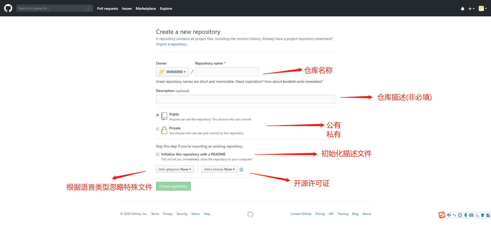

# Git及Github学习笔记

> 学习自[Git使用教程](https://www.imooc.com/article/20411)及官方学习手册

## 一、Git是什么
分布式版本控制系统


Remote: 远程仓库

Repository: 本地仓库

Index: 暂存区

Workspace: 工作区

## 二、SVN与Git区别

SVN是集中式的，而Git是分布式的

SVN更安全，便于管理，版本更可控，但是数据库压力大，必须连接服务器

## 三、windows操作系统安装Git

git官网: https://git-scm.com/

官网下载默认安装即可
开始菜单找到 Git --> Git Bash
填写用户名及邮箱

	git config --global user.name "William66886"
	git config --global user.email "william66886@sina.cn"

**--global 参数 表示这台电脑所有Git仓库都会用这个配置**

## 四、具体使用

### 一、创建本地版本库

```` git
mkdir testgit
cd testgit
git init
````

### 二、将文件添加到版本库

#### 1、将文件添加到暂存区

````git
git add readme.txt
````

将目录下的所有文件添加到暂存区

```git
git add .
```

#### 2、将文件从暂存区提交到版本库

````git
git commit -m "readme.txt提交"
````

#### 3、查看状态

````git
git status
````

#### 4、查看修改内容

````git
git diff readme.txt
````

### 三、版本回退

#### 1、查看日志

````git
git log
git log –pretty=oneline 只显示版本号及注释
````

查看详细操作日志

````
git reflog
````

* git log 只显示已提交的版本信息

* git reflog 可以查看所有操作信息包括commit和reset

#### 3、版本回退

回退到上一版本

````
git reset --hard HEAD^
````

回退到上上版本

````
git reset --hard HEAD^^
````

回退到上100版本

````
git reset --hard HEAD~100
````

回退到指定版本

````
git reset --hard 版本号
````

#### 4、撤销修改和删除文件

撤销修改

````
git checkout -- readme.txt
````

撤销与回退区别

* 撤销会把本地当前修改但并没有提交到版本库或暂存区的内容撤销到与版本库或暂存区一致状态
* 回退会把当前版本库版本回退到上一版本

删除文件

````
 rm readme.txt
 git commit -m "删除readme.txt"
````


## 五、远程仓库Github

### 一、设置SSH  key

由于本地git仓库和github仓库是通过SSH加密的，所以需要设置SSH key

#### 1、创建SSH key 

先查看用户目录下(C:\Users\William\.ssh)是否有id_rsa id_rsa.pub两个文件

id_rsa：私钥

id_rsa.pub：公钥

如果没有，在命令行下运行

````
ssh-keygen -t rsa –C “youremail@example.com”
````

ssh-keygen参考说明:(https://www.iteye.com/blog/killer-jok-1853451)非必要知识

#### 2、github配置SSH key公密

Settings --> SSH and GPG keys --> New SSH key --> 填写Title --> 复制id_rsa.pub到key

### 二、添加远程仓库

点击右上角+号 --> create a new repo


常用开源许可证关系图


### 三、本地仓库关联远程仓库

````
git remote add origin https://github.com/tugenhua0707/testgit.git
````

上传本地代码

由于受到"Black Lives Matter"运动的影响，GitHub 从今年 10 月 1 日起，在该平台上创建的所有新的源代码仓库将默认被命名为 “main”，而不是原先的"master"

````
git push -u origin master
````

## 六、创建与合并分支

git checkout -b dev：创建dev分支并切换分支到dev

git branch：查看当前分支

git branch dev：创建dev分支

git branch -d dev：删除dev分支

git checkout dev：切换分支到dev

git merge dev：将dev分支的内容合并到此分支

### 处理冲突


<<<<<HEAD：主分支修改内容

\>>>>>fenzhi1：fenzhi1分支修改的内容

手动选择即可

### 合并分支

通常合并分支时，git一般使用”Fast forward”模式，在这种模式下，删除分支后，会丢掉分支信息

合并dev分支

```git
git merge –no-ff -m “注释” dev
```

–no-ff：禁用fast forward模式

## 七、Bug分支

开发中遇到bug，可以为bug创建一个临时分支，修复完成后合并分支，然后将临时分支删除。

但是，很多时候会出现工作进行到一半，然后突然有一个更急的工作，

比如，当我正在修复一个404bug时，我创建了一个404分支，这时发现一个严重的500bug，这时可以将404分支修改的内容隐藏起来

```
git stash
```

这时通过git status命令查看，项目是干净的

现在就可以创建一个issue-500分支，来修改500bug

修改提交并合并后，切换回404bug分支

````sh
#创建并转到分支
git checkout -b isuue-500
#提交修改
git add readme.txt
git commit -m "fix bug 500"
#合并分支
git checkout main
git merge --no-ff -m "merge bug fix 404" isuue-500
#删除分支
git branch -d isuue-500
#回到原分支
git checkout isuue-404
````

回到404bug分支后，查看被隐藏的代码

```sh
git stash list
```

````sh
#恢复隐藏的代码
git stach apply
#删除第一条隐藏的代码
git stash drop
````

```sh
#恢复并删除隐藏代码
git stash pop
```

## 八、多人协作

### 推送分支

查看远程库信息：git remote

远程库详细信息：git remote -v

推送分支：git push origin master(main)

推送其他分支(如dev)：git push origin dev

### 抓取分支

抓取404分支：git clone -b 404 git@github.com:Will66886/gitStudy.git

### 多人协作工作模式

首先，可以试图用git push origin branch-name推送自己的修改。

如果推送失败，则因为远程分支比你的本地更新早，需要先用git pull试图合并。

如果合并有冲突，则需要解决冲突，并在本地提交。再用git push origin branch-name推送

## 九、常用命令总结

### 9.1、新建代码库

```sh
# 在当前目录新建一个Git代码库
$ git init

# 新建一个目录，将其初始化为Git代码库
$ git init [project-name]

# 下载一个项目和它的整个代码历史
$ git clone [url]
```

### 9.2、配置

```sh
# 显示当前的Git配置
$ git config --list

# 编辑Git配置文件
$ git config -e [--global]

# 设置提交代码时的用户信息
$ git config [--global] user.name "[name]"
$ git config [--global] user.email "[email address]"
```

### 9.3、增加/删除文件

```sh
# 添加指定文件到暂存区
$ git add [file1] [file2] ...

# 添加指定目录到暂存区，包括子目录
$ git add [dir]

# 添加当前目录的所有文件到暂存区
$ git add .

# 添加每个变化前，都会要求确认
# 对于同一个文件的多处变化，可以实现分次提交
$ git add -p

# 删除工作区文件，并且将这次删除放入暂存区
$ git rm [file1] [file2] ...

# 停止追踪指定文件，但该文件会保留在工作区
$ git rm --cached [file]

# 改名文件，并且将这个改名放入暂存区
$ git mv [file-original] [file-renamed]
```

### 9.4、代码提交

```sh
# 提交暂存区到仓库区
$ git commit -m [message]

# 提交暂存区的指定文件到仓库区
$ git commit [file1] [file2] ... -m [message]

# 提交工作区自上次commit之后的变化，直接到仓库区
$ git commit -a

# 提交时显示所有diff信息
$ git commit -v

# 使用一次新的commit，替代上一次提交
# 如果代码没有任何新变化，则用来改写上一次commit的提交信息
$ git commit --amend -m [message]

# 重做上一次commit，并包括指定文件的新变化
$ git commit --amend [file1] [file2] ...
```

### 9.5、分支

```sh
# 列出所有本地分支
$ git branch

# 列出所有远程分支
$ git branch -r

# 列出所有本地分支和远程分支
$ git branch -a

# 新建一个分支，但依然停留在当前分支
$ git branch [branch-name]

# 新建一个分支，并切换到该分支
$ git checkout -b [branch]

# 新建一个分支，指向指定commit
$ git branch [branch] [commit]

# 新建一个分支，与指定的远程分支建立追踪关系
$ git branch --track [branch] [remote-branch]

# 切换到指定分支，并更新工作区
$ git checkout [branch-name]

# 切换到上一个分支
$ git checkout -

# 建立追踪关系，在现有分支与指定的远程分支之间
$ git branch --set-upstream [branch] [remote-branch]

# 合并指定分支到当前分支
$ git merge [branch]

# 选择一个commit，合并进当前分支
$ git cherry-pick [commit]

# 删除分支
$ git branch -d [branch-name]

# 删除远程分支
$ git push origin --delete [branch-name]
$ git branch -dr [remote/branch]
```

### 9.6、标签

```sh
# 列出所有tag
$ git tag

# 新建一个tag在当前commit
$ git tag [tag]

# 新建一个tag在指定commit
$ git tag [tag] [commit]

# 删除本地tag
$ git tag -d [tag]

# 删除远程tag
$ git push origin :refs/tags/[tagName]

# 查看tag信息
$ git show [tag]

# 提交指定tag
$ git push [remote] [tag]

# 提交所有tag
$ git push [remote] --tags

# 新建一个分支，指向某个tag
$ git checkout -b [branch] [tag]
```

### 9.7、查看信息

```sh
# 显示有变更的文件
$ git status

# 显示当前分支的版本历史
$ git log

# 显示commit历史，以及每次commit发生变更的文件
$ git log --stat

# 搜索提交历史，根据关键词
$ git log -S [keyword]

# 显示某个commit之后的所有变动，每个commit占据一行
$ git log [tag] HEAD --pretty=format:%s

# 显示某个commit之后的所有变动，其"提交说明"必须符合搜索条件
$ git log [tag] HEAD --grep feature

# 显示某个文件的版本历史，包括文件改名
$ git log --follow [file]
$ git whatchanged [file]

# 显示指定文件相关的每一次diff
$ git log -p [file]

# 显示过去5次提交
$ git log -5 --pretty --oneline

# 显示所有提交过的用户，按提交次数排序
$ git shortlog -sn

# 显示指定文件是什么人在什么时间修改过
$ git blame [file]

# 显示暂存区和工作区的差异
$ git diff

# 显示暂存区和上一个commit的差异
$ git diff --cached [file]

# 显示工作区与当前分支最新commit之间的差异
$ git diff HEAD

# 显示两次提交之间的差异
$ git diff [first-branch]...[second-branch]

# 显示今天你写了多少行代码
$ git diff --shortstat "@{0 day ago}"

# 显示某次提交的元数据和内容变化
$ git show [commit]

# 显示某次提交发生变化的文件
$ git show --name-only [commit]

# 显示某次提交时，某个文件的内容
$ git show [commit]:[filename]

# 显示当前分支的最近几次提交
$ git reflog
```

### 9.8、远程同步

```sh
# 下载远程仓库的所有变动
$ git fetch [remote]

# 显示所有远程仓库
$ git remote -v

# 显示某个远程仓库的信息
$ git remote show [remote]

# 增加一个新的远程仓库，并命名
$ git remote add [shortname] [url]

# 取回远程仓库的变化，并与本地分支合并
$ git pull [remote] [branch]

# 上传本地指定分支到远程仓库
$ git push [remote] [branch]

# 强行推送当前分支到远程仓库，即使有冲突
$ git push [remote] --force

# 推送所有分支到远程仓库
$ git push [remote] --all
```

### 9.9、撤销

```sh
# 恢复暂存区的指定文件到工作区
$ git checkout [file]

# 恢复某个commit的指定文件到暂存区和工作区
$ git checkout [commit] [file]

# 恢复暂存区的所有文件到工作区
$ git checkout .

# 重置暂存区的指定文件，与上一次commit保持一致，但工作区不变
$ git reset [file]

# 重置暂存区与工作区，与上一次commit保持一致
$ git reset --hard

# 重置当前分支的指针为指定commit，同时重置暂存区，但工作区不变
$ git reset [commit]

# 重置当前分支的HEAD为指定commit，同时重置暂存区和工作区，与指定commit一致
$ git reset --hard [commit]

# 重置当前HEAD为指定commit，但保持暂存区和工作区不变
$ git reset --keep [commit]

# 新建一个commit，用来撤销指定commit
# 后者的所有变化都将被前者抵消，并且应用到当前分支
$ git revert [commit]

# 暂时将未提交的变化移除，稍后再移入
$ git stash
$ git stash pop
```


##### 问题解决

当使用git访问或克隆远程仓库时，如果服务器的SSL证书未经过第三方机构签署，那么Git就会报错。这是十分合理的设计，毕竟未知的没有签署过的证书意味着很大安全风险。但是，服务器是你自建的，为了方便的临时签名。

git config http.sslVerify false


