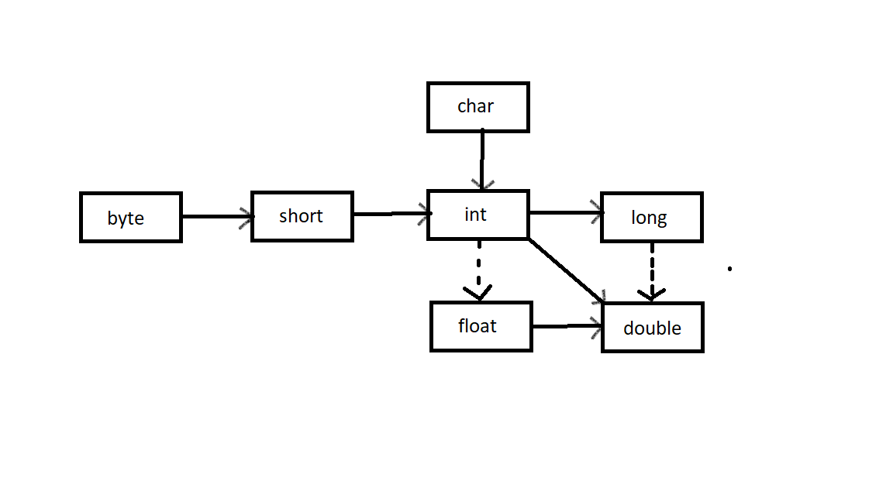
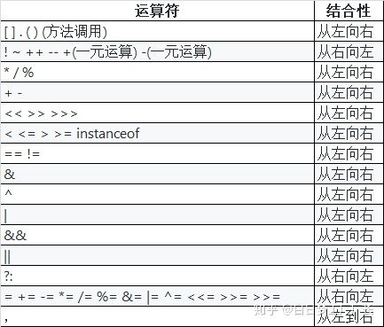

# Core Java Study Notes


## 第一章 Java程序设计概述

### 1.2、JAVA"白皮书"的关键术语

1. 简单性
2. 面向对象
3. 分布式
4. 健壮性
5. 安全性
6. 体系结构中立
7. 可移植性
8. 解释型
9. 高性能
10. 多线程
11. 动态性

## 第二章 Java程序设计环境

###### 工具包术语

- JDK: Java开发工具包
- JRE: Java运行环境
- Server JRE: 服务器JRE
- SE: 标准版
- EE: 企业版
- ME: 微型版


###### :star2:**环境变量配置**

JAVA_HOME c:Java\jdk-11.0.2

Path后面加%JAVA_HOME%\bin;


######  命令行

win+r cmd 

javac Welcome.java //将java文件编译为class文件

java Welcome //执行

###### JShell

## 第三章 Java的基本程序设计结构

### 3.1、一个简单的Java应用程序

```java
public class FirstSample{
	public static void main(String[] args){
        System.out.plainln("Hello,World!");
    }
}
```

### 3.2、注释

//单行注释

/* */多行注释

/** */自动生成文档注释 ==4.9详细讲解==

### 3.3、:star2:基本数据类型

4种整型、2种浮点型、1种字符类型、1种boolean型

| 类型    | 存储空间 | 取值范围                                                     |
| ------- | -------- | ------------------------------------------------------------ |
| int     | 4b       | -2147483648~2147483647                                       |
| short   | 2b       | -32768~32767                                                 |
| long    | 8b       | -9223372036854775808~9223372036854775807                     |
| byte    | 1b       | -128~127                                                     |
| float   | 4b       | 大约&plusmn;3.40282347E&plusmn;38F(有效位数为6~7位)          |
| double  | 8b       | 大约&plusmn;1.79769313486231570E&plusmn;308F(有效位数为15位) |
| char    | 2b       | UTF-16编码中的一个**代码单元**                               |
| boolean | 1b       |                                                              |

### 3.4、变量与常量

```java
int i , j; //不建议声明变量时写在一行，降低可读性
```

变量声明尽可能靠近变量第一次使用的地方

#### 3.4.3、常量

关键词为final表示这个变量只能被赋值一次，常量名使用全大写

````java
final double CM_PER_INCH=2.54;
````

可以在一个类的多个方法中使用的常量，类常量

```java
public static final double CM_PER_INCH=2.54;
```

#### 3.4.4、枚举类型

```java
enum Size {SMALL,MEDIUM,LARGE,EXTRA_LARGE};

Size s = Size.MEDIUM;
```


### 3.5、运算符

\+ - * / % 加减乘除和整数求余

#### 3.5.2、数学函数

Math

sqrt(double a) 平方根

pow(double a,double b) a的b次方

floodMod

#### 3.5.3、类型转换



#### 3.5.6、自增与自减运算

++n与n++

```java
int n = 7;
int m = 7;
int a = 2*++m; 
int b = 2*n++;
```

int a = 2*++m; ==等价于 int a = 2\*(m+1)==

int b = 2*n++; ==等价于 int b = 2\*n+1==

### 3.5.7、运算符


& 与 && 的区别：& 和 | 左右两边的式子一定会执行（比较笨），&& 和 || 只要左边的式子能得出结果，右边的式子就不会执行（比较聪明）。

三元运算符

condition ? expression<sub>1</sub> : expression<sub>2</sub>

condition 为true 值为expression<sub>1</sub>反之为expression<sub>2</sub>

#### 3.5.8、位运算符

&:	1 0010 & 1 0000 = 1 0000 两个操作数中位都为1，结果才为1，否则结果为0

|:	1 0010 & 1 0000 = 1 0010 两个位只要有一个为1，那么结果就是1，否则就为0

^:	1111 ^ 0010 = 1101 如果位为0，结果是1，如果位为1，结果是0

~:	~1101 = 0010 两个操作数的位中，相同则结果为0，不同则结果为1

\> \>	 <<

运算符优先级



### 3.6、字符串

#### 3.6.2、拼接

字符串间插入

```java
String str = "Hello";
System.out.println(String.join(" /","S","M","L","XL") );
```

输出结果为:S /M /L /XL


JAVA11新增，复制拼接字符串

```java
String str = "Hello";
System.out.println(str.repeat(4));
```

输出结果为：HelloHelloHelloHello

#### 3.6.3、不可变字符串

不可变字符串优点：编译器可以让字符串共享

缺点效率低

#### 3.6.4、字符串是否相等

```java
String str1 = "Hello";
String str2 = "Hello";
String str3 = "hello";
System.out.println(str1.equals(str2));//true
System.out.println(str1.equalsIgnoreCase(str3));//true，不校验大小写区分
System.out.println(str1+""==str2);//false
System.out.println(str1.comparaTo(str2));//0,效率不如equals
```

==str1+""\=\=str2判断这两个字符串是否存在同一个位置==

#### 3.6.6、码点与代码单元

代码点（Code Point）：在 Unicode 代码空间中的一个值，取值 0x0 至 0x10FFFF，代表一个字符。

代码单元（Code Unit）：在具体编码形式中的最小单位。比如 UTF-16 中一个 code unit 为 16 bits，UTF-8 中一个 code unit 为 8 bits。一个 code point 可能由一个或多个 code unit(s) 表示。在 U+10000 之前的 code point 可以由一个 UTF-16 code unit 表示，U+10000 及之后的 code point 要由两个 UTF-16 code units 表示

#### 3.6.7、String API

```java
String greeting = "Hello World!";
greeting.charAt(3);//返回指定位置的代码单元
int i = greeting.codePointAt(4);//返回从给定位置开始的码点
greeting.offsetByCodePoints(1,4);//返回从1码点开始，4个码点之后的码点索引
"sd".compareTo("sd");//按字典顺序比较两个字符串,如果两个字符串内容相同返回0
greeting.codePoints().toArray();//将这个字符串作为一个流返回
"".isEmpty();//如果字符串为空返回true
"  ".isBlank();//如果字符串为空或空格组成返回true
greeting.startsWith("H");//如果字符串以H为开头返回true
greeting.endsWith("o");//如果字符串以o为结尾返回true

//返回与字符串或码点匹配的第一个字串开始的位置
greeting.indexOf("e");
greeting.indexOf("l",5);
greeting.indexOf(111);
greeting.indexOf(111,6);

//返回与字符串或码点匹配的末尾字串开始的位置
greeting.lastIndexOf("e");
greeting.lastIndexOf("l",5);
greeting.lastIndexOf(111);
greeting.lastIndexOf(111,6);

greeting.length();
greeting.codePointCount(1,5);//返回1和4之间的码点个数
greeting.replace("lo","a");//返回新字符串，这个字符串替换lo
greeting.substring(3);
greeting.substring(3,7);//截取字符串
greeting.toLowerCase();//返回一个原字符串全小写字符串
greeting.toUpperCase();//返回一个原字符串全大写字符串
"   Hello   ".trim();//去除收尾空格
"   Hello   ".strip();//去除收尾空格，包括Unicode的空格
```

#### 3.6.9、构建字符串

StringBuilder效率高但线程不安全

StringBuffer效率低线程安全

```java
StringBuilder builder = new StringBuilder();//构造空的构建字符串
builder.append("Hello World");//追加一个字符串并返回一个this
builder.append('c');//追加一个字节并返回一个this
builder.appendCodePoint(97);//追加一个码点并返回一个this
builder.setCharAt(0,'h');//将第0位设置为h
builder.insert(6,'a');//在第6位插入一个字符串并返回this
builder.delete(6,7);//删除偏移量6到6-1的代码单元并返回this
String str = builder.toString();//返回一个与构建器或缓冲器内容相同的字符串
```

### 3.7、输入与输出

```java
Scanner in = new Scanner(System.in);
System.out.println("What is your name");
String name = in.nextLine();
System.out.println("How old are you");
int age = in.nextInt();
System.out.println("Hello, "+name+". Next year , you,ll be" + (age+1));
```

#### 3.7.2、格式化输出

```java
System.out.printf("%+,.2f",-10000.0/3.0);
String name = "William ";
int age = 28;
String message = String.format("Hello,%s. Next year you'll be %d",name,age);
System.out.printf(message);
System.out.printf("%tc", new Date());
System.out.printf("%1$s %2$tB %2$te %2$tY","Due date:",new Date());
System.out.printf("%s %tB %<te %<tY","Due date:",new Date());
```

#### 3.7.3、文件输入与输出

```java
Scanner in = new Scanner(Path.of("C:\\myfile.txt"), StandardCharsets.UTF_8);
PrintWriter out = new PrintWriter("myfile.txt",StandardCharsets.UTF_8);
```


### 3.8、控制流程

#### 3.8.1、块作用域

#### 3.8.2、条件语句

if(choice){}

if(){}else{}

if(){}else if(){}else{}

#### 3.8.3、循环

while(){}

do{}while()

#### 3.8.4、确定循环

for(int i=0;i<=10;i++){}

#### 3.8.5、多重选择: switch

```java
switch(choice){

	case 1:
        ...
        break;
    case 2:
        ...
        break;
    default:
        ...
        break;    
}
```

case标签可以是：

- 类型为char、byte、short或int的常量表达式
- 枚举常量
- 从==Java7==开始，case标签还可以是字符串字面量

#### 3.8.6、中断控制流程语句

break：不执行代码块后面代码，直接退出循环语句

read_data:while(){break read_data;}：带标签的break，用于跳出多重嵌套的循环语句

continue：不执行代码块后面代码，回到循环首部再执行循环

### 3.9、大数

BigInteger：实现任意精度的整数运算

BigDecimal：实现任意精度的浮点数运算

BigInteger方法：

- BigInteger add(BigInteger  other)：求和
- BigInteger subtract(BigInteger  other)：求差
- BigInteger multiply(BigInteger  other)：求积
- BigInteger divide(BigInteger  other)：求商
- BigInteger mod(BigInteger  other)：求余
- BigInteger sqrt(BigInteger  other)：JDK9 平方根
- int compareTo(BigInteger  other)：如果两个大数相等则返回0，小于返回负数，大于返回正数
- static BigInteger valueOf(long x)：返回值等于X的大整数

BigDecimal方法

- BigDecimal add(BigDecimalother)：求和
- BigDecimal subtract(BigDecimalother)：求差
- BigDecimal multiply(BigDecimalother)：求积
- BigDecimal divide(BigDecimalother)：求商 如果商是一个无限循环小数则会抛出一个异常
- BigDecimal divide(BigDecimalother,RoundingMode mode)：RoundingMode为枚举，求上根据mode舍入
- int compareTo(BigInteger  other)：如果两个大数相等则返回0，小于返回负数，大于返回正数
- static BigInteger valueOf(long x)：返回值等于x的大整数
- static BigInteger valueOf(long x,int scale)：返回值等于x/10<sup>scale</sup>的大整数

### 3.10、数组

#### 3.10.1、声明数组

一旦创建数组就不能再改变它的大小

int[] a;	声明数组

int[] a = new int[100];	初始化数组

int[] a = {2,3,4,5,1};	初始化数组简写形式

new int[]{2,3,4,5,1};	匿名数组

int[] a = new int[]{{2,3,4,5,1}} 	初始化数组并直接设置数组大小

int[] b = {2,3,4,5,1};	与上面等价

#### 3.10.2、访问数组元素

创建一个数组时，所有元素都初始化为0。boolean数组的元素会初始化为false，对象数组的元素则初始化为一个特殊值null

#### 3.10.3、for each 循环

增强for循环语句

for(variable : collection) statement

#### 3.10.4、数组拷贝

```java
        int[] a = {1,2,3};
        int[] b = {1,2,3};

        a = b;
        System.out.println(a == b);
        System.out.println(a);
        System.out.println(b);

        int[] a1 = {1,2,3};
        int[] b1 = {1,2,3};

        a1 = Arrays.copyOf(b1,b1.length);
        System.arraycopy(b1, 0, a1, 0, b1.length);
        System.out.println(a1 == b1);
        System.out.println(a1);
        System.out.println(b1);
```

a  =  b指向相同的内存地址

a1 = b1 指向不同的内存地址

#### 3.10.5、命令行参数

3.10.6、数组排序

viod Arrays.sort(xxx[] a): 源码为双枢轴快速排序，不改变内存路径

Arrays API

static String toString(xxx[] a)：返回包含a中元素的一个字符串，a只能是基本数据类型数组

static xxx[] copyOf(xxx[] a,int end)：返回与a类型相同数组，范围为0~end，如果end超过a.length，则会填充默认值

static xxx[] copyOfRange(xxx[] a,int start,int end)：返回与a类型相同数组，范围为start~end，如果end超过a.length，则会填充默认值

static void sort(xxx[] a)：快速排序

static int binarySearch(xxx[] a,xxx v)：

static int binarySearch(xxx[] a,int start,int end,xxx v)：使用二分法查找在有序数组a中查找值v，如果找到v则返回相应下标，否则返回一个负数r，-r-1是v应插入的位置

static void full(xxx[] a,xxx v)：将数组的所有元素都设置为v

static boolean equals(xxx[] a,xxx[] b)：如果两个数组大小相同，并且下标相同的元素都对应相等，返回true

#### 3.10.7、多维数组

```java
double[][] balances;
```

#### 3.10.8、不规则数组

## 第四章 对象与类

### 4.1、面向对象程序设计概述

面向对象程序设计(object-oriented programming,OOP)

#### 4.1.1、类

类：构造对象的模板或蓝图

创建类的实例：由类构造的对象的过程为创建类的实例

封装(或称为数据隐藏)：将数据和行为组合在一个包中，并对对象的使用者隐藏具体实现方式

实例字段：对象中的数据称为实例字段

方法：操作数据的过程为方法

对象的状态：特定对象都有一组特定的实例字段值，这些值的集合就是这个对象的当前状态

无论何时，只要在对象上调用一个方法，他的状态就有可能发生改变

继承：通过扩展一个类来建立另外一个类的过程称为继承

#### 4.1.2 、对象

对象的三个主要特征：

- 对象的行为：可以对对象完成那些操作，或者可以对对象应用哪些方法
- 对象的状态：当调用那些方法时，对象会如何响应
- 对象的标识：如何区分具有相同行为与状态的不同对象

#### 4.1.3、识别类

#### 4.1.4、类之间的关系

常见关系有：

- 依赖（“uses-a”）
- 聚合（“has-a”）
- 继承（“is-a”）

### 4.2、使用预定类

#### 4.2.1、对象与对象变量

想要使用对象，首先必须构造对象，并指定其初始状态，然后对对象应用方法

#### 4.2.2、Java类库中的localDate类

#### 4.2.3、更改器方法与访问器方法

更改器方法：改变对象的状态的方法，例如set方法

访问器方法：只访问对象而不修改对象的方法，例如get方法


