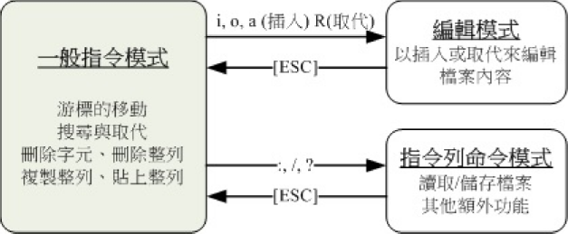
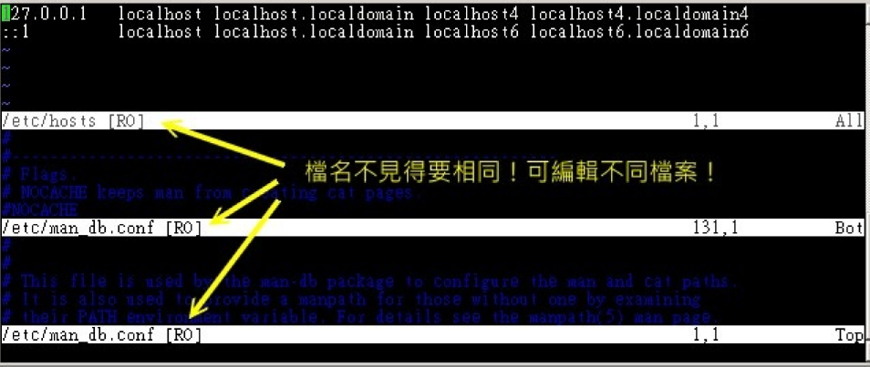
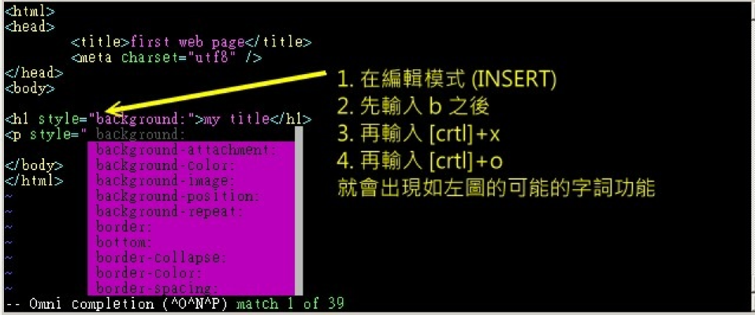

# Linux vi及vim使用

## 一、vi的使用

- 一般指令模式：

  以vi 打开一个文件就直接进入一般指令模式了（这是默认的模式，也简称为一般模式）。在
  这个模式中，你可以使用“上下左右”按键来移动光标，你可以使用“删除字符”或“删除整列”来
  处理文件内容，也可以使用“复制、贴上”来处理你的文件数据。

- 编辑模式

  在一般指令模式中可以进行删除、复制、贴上等等的动作，但是却无法编辑文件内容的！要
  等到你按下“i, I, o, O, a, A, r, R”等任何一个字母之后才会进入编辑模式。注意了！通常在
  Linux 中，按下这些按键时，在画面的左下方会出现“ INSERT 或REPLACE ”的字样，此时才
  可以进行编辑。而如果要回到一般指令模式时，则必须要按下“Esc”这个按键即可退出编辑模
  式。

- 命令行命令模式

  在一般模式当中，输入“ : / ? ”三个中的任何一个按钮，就可以将光标移动到最下面那一列。在
  这个模式当中，可以提供你“搜寻数据”的动作，而读取、存盘、大量取代字符、离开vi 、显
  示行号等等的动作则是在此模式中达成的！

  

简单的说，我们可以将这三个模式想成下面的图示来表示：



### 一般指令下的按键说明

| 移动光标的方法      |                      |
| ------------------- | -------------------- |
| h 或向左方向键（←） | 光标向左移动一个字符 |
| h 或向左方向键（←） | 光标向左移动一个字符 |
| j 或向下方向键（↓） | 光标向下移动一个字符 |
| k 或向上方向键（↑） | 光标向上移动一个字符 |
| l 或向右方向键（→） | 光标向右移动一个字符 |
| 如果你将右手放在键盘上的话，你会发现hjkl 是排列在一起的，因此可以使用这四个按钮来移动光标。如果想要进行多次移动的话，例如向下移动30 列，可以使用"30j" 或"30↓" 的组合按键，亦即加上想要进行的次数（数字）后，按下动作即可！ |   |
| [Ctrl] + [f] | 屏幕“向下”移动一页，相当于[Page Down]按键（常用） |
| [Ctrl] + [b] | 屏幕“向上”移动一页，相当于[Page Up] 按键（常用） |
| [Ctrl] + [d] | 屏幕“向下”移动半页 |
| [Ctrl] + [u] | 屏幕“向上”移动半页 |
| + | 光标移动到非空白字符的下一列 |
| - | 光标移动到非空白字符的上一列 |
| n<space> | 那个n 表示“数字”，例如20 。按下数字后再按空白键，光标会向右移动这一列的n 个字符。例如20<space> 则光标会向后面移动20个字符距离。 |
| 0 或功能键[Home] | 这是数字“ 0 ”：移动到这一列的最前面字符处（常用） |
| $ 或功能键[End] | 移动到这一列的最后面字符处（常用） |
| H | 光标移动到这个屏幕的最上方那一列的第一个字符 |
| M | 光标移动到这个屏幕的中央那一列的第一个字符 |
| L | 光标移动到这个屏幕的最下方那一列的第一个字符 |
| G | 移动到这个文件的最后一列（常用） |
| nG | n 为数字。移动到这个文件的第n 列。例如<br/>20G 则会移动到这个文件的第20 列（可配合<br/>:set nu） |
| gg | 移动到这个文件的第一列，相当于1G 啊！<br/>（常用） |
| n\<Enter> | n 为数字。光标向下移动n 列（常用） |


| 搜寻与取代 |	|
| ------------------- | -------------------- |
| /word | 向光标之下寻找一个名称为word 的字串。例如要在文件内搜寻vbird 这个字串，就输入/vbird 即可！（常用） |
| ?word | 向光标之上寻找一个字串名称为word 的字串。 |
| n | 这个n 是英文按键。代表“**重复前一个搜寻的动作**”。举例来说，如果刚刚我们执行/vbird 去向下搜寻vbird 这个字串，则按下n 后，会向下继续搜寻下一个名称为vbird 的字串。如果是执行?vbird 的话，那么按下n则会向上继续搜寻名称为vbird 的字串！ |
| N | 这个N 是英文按键。与n 刚好相反，为“反<br/>向”进行前一个搜寻动作。例如/vbird 后，按<br/>下N 则表示“向上”搜寻vbird 。 |
| 使用/word 配合n 及N 是非常有帮助的！可以让你重复的找到一些你搜寻的关键字！ |	|
| :n1,n2s/word1/word2/g | n1 与n2 为数字。在第n1 与n2 列之间寻找word1 这个字串，并将该字串取代为word2！举例来说，在100 到200 列之间搜寻vbird并取代为VBIRD则：“:100,200s/vbird/VBIRD/g”。（常用） |
| :1,$s/word1/word2/g | 从第一列到最后一列寻找word1 字串，并将该字串取代为word2 ！（常用） |
| :1,$s/word1/word2/gc | 从第一列到最后一列寻找word1 字串，并将该字串取代为word2 ！且在取代前显示提示字符给使用者确认（confirm）是否需要取代！（常用） |

| 删除、复制与贴上 |	|
| ------------------- | -------------------- |
| x, X | 在一列字当中，x 为向后删除一个字符（相当于[del] 按键），X 为向前删除一个字符（相当于[backspace] 亦即是倒退键）（常用） |
| nx | n 为数字，连续向后删除n 个字符。举例来说，我要连续删除10 个字符，“10x”。 |
| dd | 删除光标所在的那一整列（常用） |
| ndd | n 为数字。删除光标所在的向下n 列，例如20dd 则是删除20 列（常用） |
| d1G | 删除光标所在到第一列的所有数据 |
| dG | 删除光标所在到最后一列的所有数据 |
| d$ | 删除光标所在处，到该列的最后一个字符 |
| d0 | 那个是数字的0 ，删除光标所在处，到该列的最前面一个字符 |
| yy | 复制光标所在的那一列（常用） |
| nyy | n 为数字。复制光标所在的向下n 列，例如20yy 则是复制20 列（常用） |
| y1G | 复制光标所在列到第一列的所有数据 |
| yG | 复制光标所在列到最后一列的所有数据 |
| y0 | 复制光标所在的那个字符到该列行首的所有数据 |
| y$ | 复制光标所在的那个字符到该列行尾的所有数据 |
| p, P | p 为将已复制的数据在光标下一列贴上，P 则为贴在光标上一列！举例来说，我目前光标在第20 列，且已经复制了10 列数据。则按下p 后，那10 列数据会贴在原本的20 列之后，亦即由21 列开始贴。但如果是按下P呢？那么原本的第20 列会被推到变成30列。（常用） |
| J | 将光标所在列与下一列的数据结合成同一列 |
| c | 重复删除多个数据，例如向下删除10 列，[10cj ] |
| u | 复原前一个动作。（常用） |
| [Ctrl]+r | 重做上一个动作。（常用） |
| 这个u 与[Ctrl]+r 是很常用的指令！一个是复原，另一个则是重做一次～利用这两个功能按键，你的编辑，嘿嘿！很快乐的啦！ |	|
| . | 不要怀疑！这就是小数点！意思是重复前一个动作的意思。如果你想要重复删除、重复贴上等等动作，按下小数点“.”就好了！（常用） |

### 一般指令模式切换到编辑模式的可用的按钮说明
| 进入插入或取代的编辑模式 |	|
| ------------------- | -------------------- |
| i,I | 进入插入模式（Insert mode）：i为“从目前光标所在处插入”，I为“在目前所在列的第一个非空白字符处开始插入”。（常用） |
| a,A | 进入插入模式（Insert mode）：a为“从目前光标所在的下一个字符处开始插入”，A 为“从光标所在列的最后一个字符处开始插入”。（常用） |
| o, O | 进入插入模式（Insert mode）：这是英文字母o 的大小写。o为“在目前光标所在的下一列处插入新的一列”；O 为在目前光标所在处的上一列插入新的一列！（常用） |
| r, R | 进入取代模式（Replacemode）：r 只会取代光标所在的那一个字符一次；R会一直取代光标所在的文字，直到按下ESC 为止；（常用） |
| 上面这些按键中，在vi 画面的左下角处会出现“--INSERT--”或“--REPLACE--”的字样。由名称就知道该动作了吧！！特别注意的是，我们上面也提过了，你想要在文件里面输入字符时，一定要在左下角处看到INSERT 或REPLACE 才能输入喔！ |	|
| [Esc] | 退出编辑模式，回到一般指令模式中（常用） |

### 一般指令模式切换到命令行界面的可用按钮说明
| 命令行界面的储存、离开等指令 |	|
| ------------------- | -------------------- |
| :w | 将编辑的数据写入硬盘文件中（常用） |
| :w! | 若文件属性为“只读”时，强制写入该文件。不过，到不能写入，还是跟你对该文件的文件权限有关啊！ |
| :q | 离开vi （常用） |
| :q! | 若曾修改过文件，又不想储存，使用! 为强制离开不储存盘案。 |
| 注意一下啊，那个惊叹号（!）在vi 当中，常常具有“强制”的意思～ |	|
| :wq | 储存后离开，若为:wq! 则为强制储存后离开（常用） |
| ZZ | 这是大写的Z 喔！若文件没有更动，则不储存离开，若文件已经被更动过，则储存后离开！ |
| :w [filename] | 将编辑的数据储存成另一个文件（类似另存新文件） |
| :r [filename] | 在编辑的数据中，读入另一个文件的数据。亦即将“filename” 这个文件内容加到光标所在列后面 |
| :n1,n2 w [filename] | 将n1 到n2 的内容储存成filename 这个文件。 |
| :! command | 暂时离开vi 到命令行界面下执行command 的显示结果！例如“:! ls /home”即可在vi 当中察看/home 下面以ls 输出的文件信息！ |


| vim 环境的变更 |	|
| ------------------- | -------------------- |
| :set nu | 显示行号，设置之后，会在每一列的字首显示该列的行<br/>号 |
| :set nonu | 与set nu 相反，为取消行号！ |


## 二、vim的使用

| 区块选择的按键意义 |	|
| ------------------- | -------------------- |
| v | 字符选择，会将光标经过的地方反白选择！ |
| V | 列选择，会将光标经过的列反白选择！ |
| [Ctrl]+v | 区块选择，可以用长方形的方式选择数据 |
| y | 将反白的地方复制起来 |
| d | 将反白的地方删除掉 |
| p | 将刚刚复制的区块，在光标所在处贴上！ |

```shell
vim filename1 filename2   <== vim可以编辑多个文件
```

| 多文件编辑的按键 |	|
| ------------------- | -------------------- |
| :n | 编辑下一个文件 |
| :N | 编辑上一个文件 |
| :files | 列出目前这个vim 的打开的所有文件 |

| 多窗口情况下的按键功能 |	|
| ------------------- | :------------------- |
| :sp[filename] | 打开一个新窗口，如果有加filename，表示在新窗口打开一个新文件，否则表示两个窗口为同一个文件内容（同步显示）。 |
| [ctrl]+w+ j<br/>[ctrl]+w+↓ | 按键的按法是：先按下[ctrl] 不放，再按下w 后放开所有的按键，然后再按下j （或向下方向键），则光标可移动到下方的窗口。 |
| ctrl]+w+ k<br/>[ctrl]+w+↑ | 同上，不过光标移动到上面的窗口。 |
| [ctrl]+w+q | 其实就是:q 结束离开啦！举例来说，如果我想要结束下方的窗口，那么利用[ctrl]+w+↓ 移动到下方窗口后，按下:q 即可离开，也可以按下[ctrl]+w+q 啊！ |



| 组合按钮 | 补齐的内容 |
| ------------------- | :------------------- |
| [ctrl]+x -> [ctrl]+n | 通过目前正在编辑的这个“文件的内容文字”作为关键字，予以补齐 |
| [ctrl]+x -> [ctrl]+f | 以当前目录内的“文件名”作为关键字，予以补齐 |
| [ctrl]+x -> [ctrl]+o | 以扩展名作为语法补充，以vim 内置的关键字，予以补齐 |

假设你想要编写网页，正要使用到CSS 的美化功能时，突然想到有个背景的东西要处理，但
是突然忘记掉背景的CSS 关键语法，那可以使用如下的模样来处置！请注意，一定要使用
.html 或.php 的扩展名，否则vim 不会调用正确的语法检验功能喔！因此下面我们创建的文
件名为html.html 啰！




| vim 的环境设置参数 |	|
| ------------------- | :------------------- |
| :set nu :set nonu | 就是设置与取消行号啊！ |
| :set hlsearch :set<br/>nohlsearch | hlsearch 就是high light search（高亮度搜寻）。这个就是设置<br/>是否将搜寻的字串反白的设置值。默认值是hlsearch |
| :set autoindent :set<br/>noautoindent | 是否自动缩排？autoindent 就是自动缩排。 |
| :set backup | 是否自动储存备份文件？一般是nobackup 的，如果设置<br/>backup 的话，那么当你更动任何一个文件时，则原始文件会被另<br/>存成一个文件名为filename~ 的文件。举例来说，我们编辑<br/>hosts ，设置:set backup ，那么当更动hosts 时，在同目录下，<br/>就会产生hosts~ 文件名的文件，记录原始的hosts 文件内容 |
| :set ruler | 还记得我们提到的右下角的一些状态列说明吗？这个ruler 就是<br/>在显示或不显示该设置值的啦！ |
| :set showmode | 这个则是，是否要显示--INSERT-- 之类的字眼在左下角的状态<br/>列。 |
| :set<br/>backspace=（012） | 一般来说，如果我们按下i 进入编辑模式后，可以利用倒退键<br/>（backspace）来删除任意字符的。但是，某些distribution 则<br/>不许如此。此时，我们就可以通过backspace 来设置啰～当<br/>backspace 为2 时，就是可以删除任意值；0 或1 时，仅可删除<br/>刚刚输入的字符，而无法删除原本就已经存在的文字了！ |
| :set all | 显示目前所有的环境参数设置值。 |
| :set | 显示与系统默认值不同的设置参数，一般来说就是你有自行变动<br/>过的设置参数啦！ |
| :syntax on :syntax<br/>off | 是否依据程序相关语法显示不同颜色？举例来说，在编辑一个纯<br/>文本文件时，如果开头是以# 开始，那么该列就会变成蓝色。如<br/>果你懂得写程序，那么这个:syntax on 还会主动的帮你除错呢！<br/>但是，如果你仅是编写纯文本，要避免颜色对你的屏幕产生的干<br/>扰，则可以取消这个设置。 |
| :set bg=dark :set<br/>bg=light | 可用以显示不同的颜色色调，默认是“ light ”。如果你常常发现注<br/>解的字体深蓝色实在很不容易看，那么这里可以设置为dark<br/>喔！试看看，会有不同的样式呢！ |