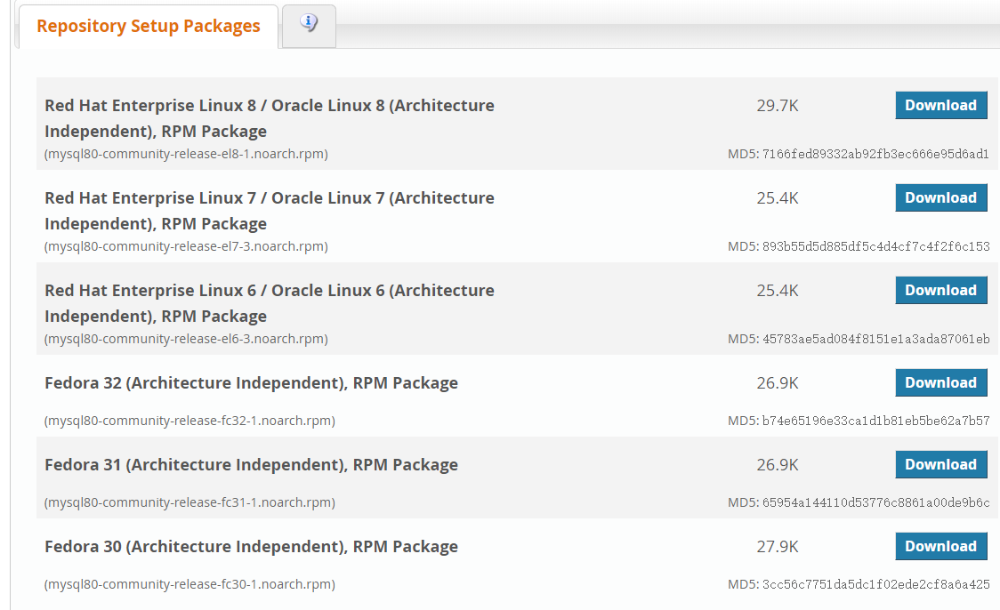
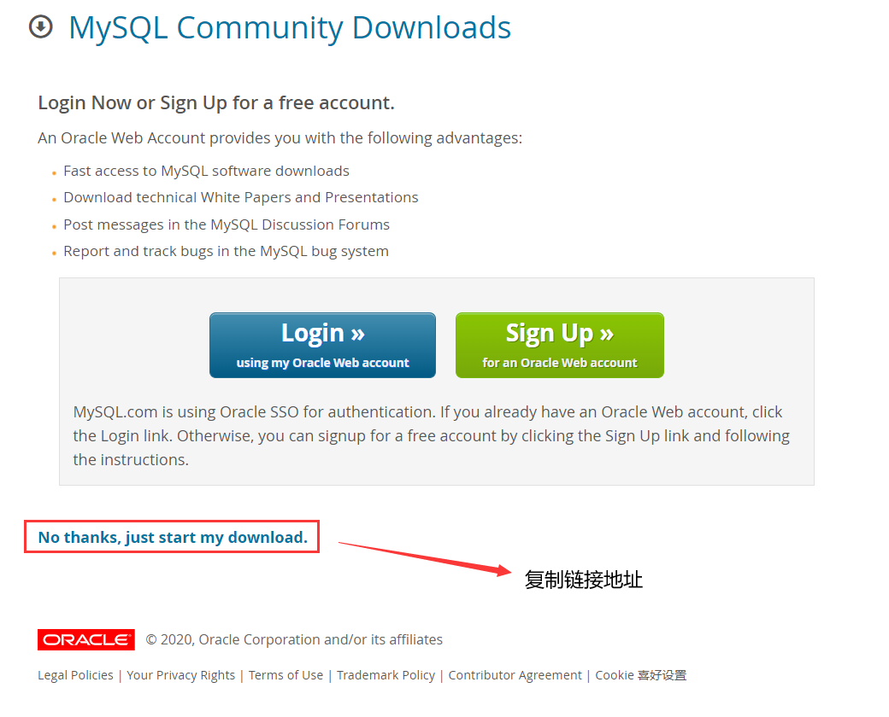

# Linux安装Mysql

参考自菜鸟：https://www.runoob.com/mysql/mysql-install.html

1. 安装前先检查是否安装过mysql和mariadb

```
rpm -qa | grep mysql
rpm -qa | grep mariadb
```

有的话用`yum -remove <包名>`卸载

2. 去官网下载Yum资源包，注意这里安装的是mysql8.0版本，后面版本可能操作会不太一样

https://dev.mysql.com/downloads/repo/yum/

选择自己系统对应的版本





```shell
wget https://dev.mysql.com/get/mysql80-community-release-el7-3.noarch.rpm =》上面复制的链接地址
rpm -ivh mysql80-community-release-el7-3.noarch.rpm
yum update
yum install mysql-server
```

3. 权限设置：

```
chown mysql:mysql -R /var/lib/mysql
```

4. 初始化 MySQL：

```
mysqld --initialize
```

5. 启动 MySQL：

```
systemctl start mysqld
```

这里我报了个错

查看日志`cat /var/log/mysqld.log`

提示错误原因为The innodb_system data file 'ibdata1' must be writable，也就是说没有写权限

进入安装目录/var/lib，mysql其他版本可能不是这个目录

赋予权限`chmod -R 777 mysql`，然后再执行解决问题

7. 查看 MySQL 运行状态：

```
systemctl status mysqld
```

8. 进入数据库修改root密码

```
mysql -uroot -p
```

输入初始化密码，如果忘记密码可以到/etc/my.cnf配置文件最后添加`skip-grant-tables`跳过密码验证，然后重启服务，就可以跳过密码进入

```mysql
ALTER USER 'root'@'localhost' IDENTIFIED WITH mysql_native_password BY '新密码';
```

9. 设置远程访问

```mysql
mysql> use mysql;
mysql> update user set user.Host='%' where user.User='root';
mysql> flush privileges;
```

更改/etc/mysql/my.cnf

将文件中的“bind-address  = 127.0.0.1”改为“bind-address  = 0.0.0.0”，让所有IP都能访问 

```
#查看端口
firewall-cmd --query-port=3306/tcp
#新增端口
firewall-cmd --add-port=3306/tcp
#移除端口
firewall-cmd --remove-port=3306/tcp
```

