# Linux安装RabbitMQ

官网地址：https://www.rabbitmq.com/

学习自：http://www.imooc.com/article/305858

Linux版本：CentOS7

RabbitMQ：3.8.5

仅供参考，不同版本安装略有不同

进入官网，首先点击Get Started

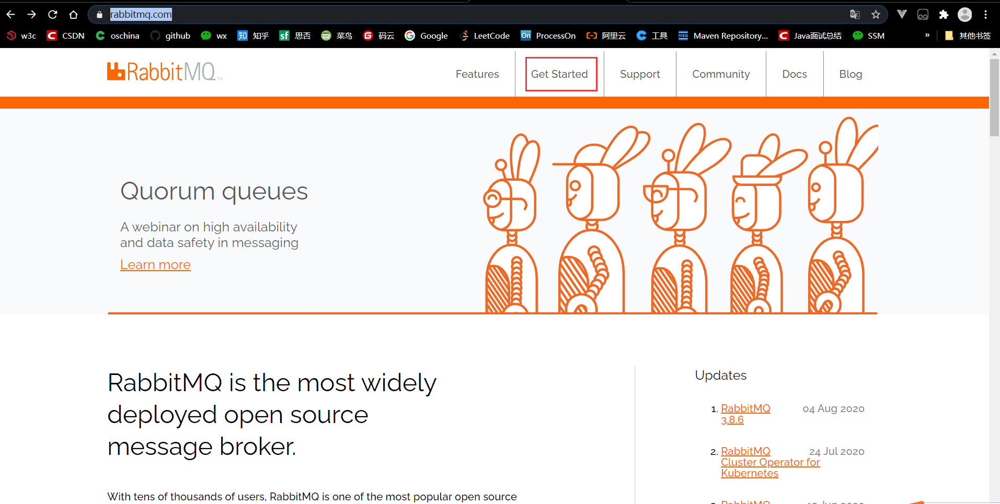

然后点击Download + Installation

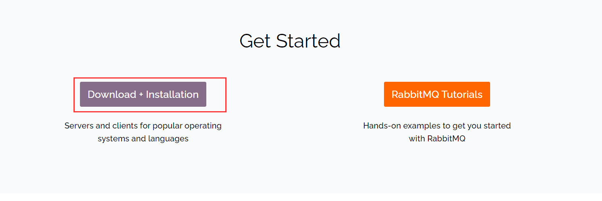

点击下载安装linux版本

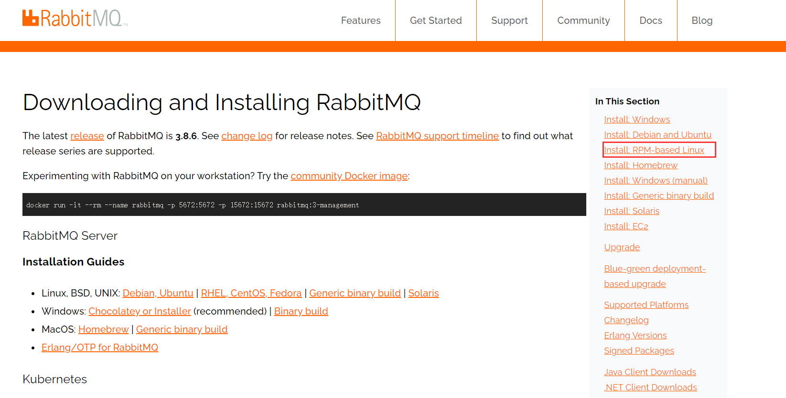

1. RabbitMQ是用erlang写的，所以首先安装erlang

官网解释直接yum可能无法安装erlang的最新版本，所以我们要先锁定erlang在yum库中的版本

下拉网页找到

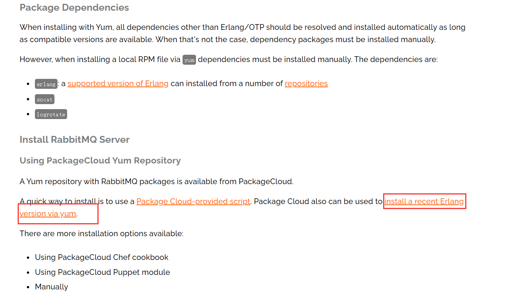

选择rpm运行这条命令

```
curl -s https://packagecloud.io/install/repositories/rabbitmq/erlang/script.rpm.sh | sudo bash
```

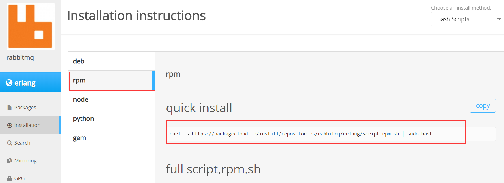

提示安装成功

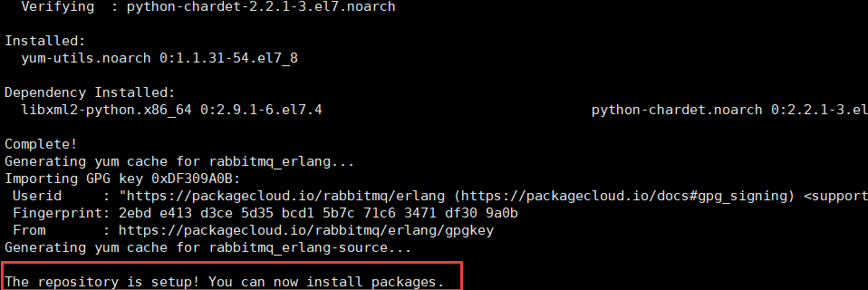

```
yum install erlang
```

提示Complete!安装成功

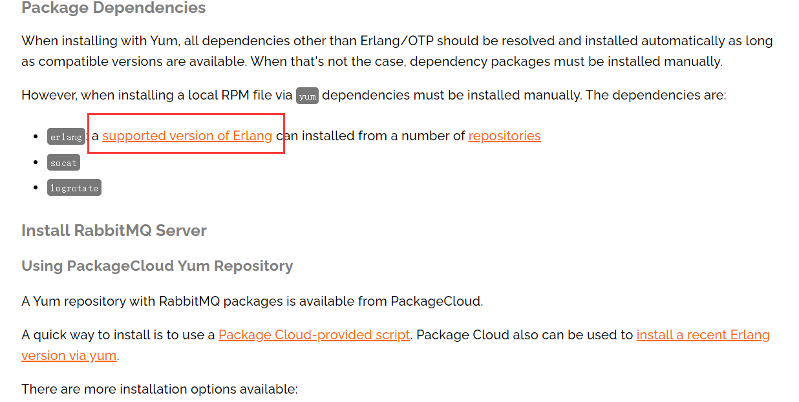

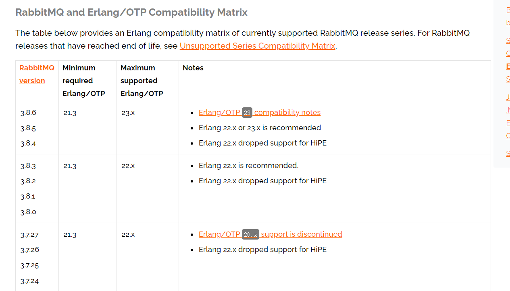

运行erlang查看版本是否正确

```
erl
```

2. 安装rabbitmq-server

首先安装下面三个key，不报错就是安装成功了

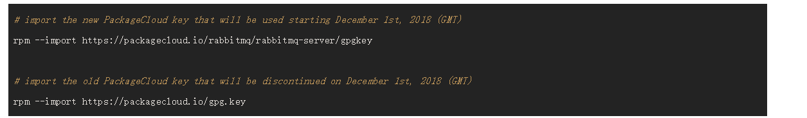

```bash
rpm --import https://packagecloud.io/rabbitmq/rabbitmq-server/gpgkey

rpm --import https://packagecloud.io/gpg.key
```

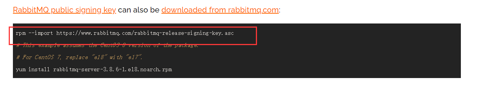

```bash
rpm --import https://www.rabbitmq.com/rabbitmq-release-signing-key.asc
```


随后，点击这里锁定版本库

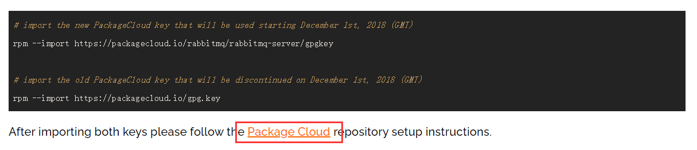

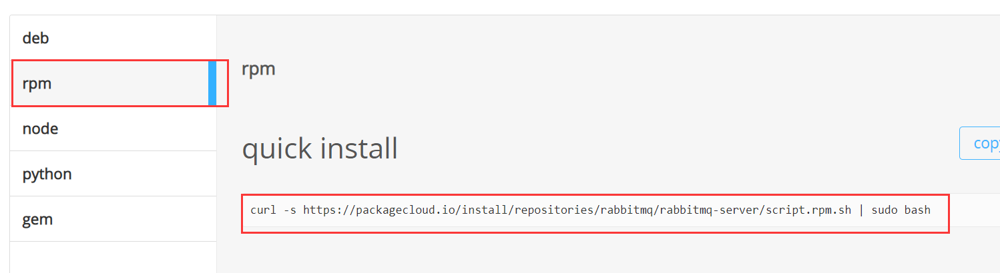

提示The repository is setup! You can now install packages.则为安装成功

下载软件包，我这里是CentOS7.x版本

```
wget https://github.com/rabbitmq/rabbitmq-server/releases/download/v3.8.6/rabbitmq-server-3.8.6-1.el7.noarch.rpm
```

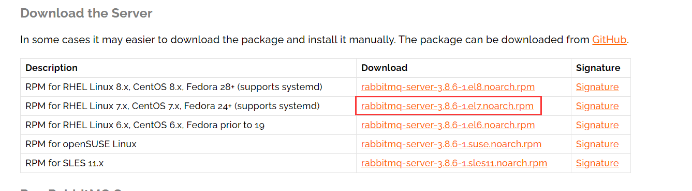

安装前还需要安装EPEL和socat

```
yum -y install epel-release
yum -y install socat
```

正式开始安装rabbitmq-server

```
rpm -ivh rabbitmq-server-3.8.6-1.el7.noarch.rpm
```

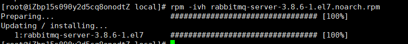

3. 配置RabbitMQ

这里官网给了一个参考配置：https://github.com/rabbitmq/rabbitmq-server/blob/master/docs/advanced.config.example

在/etc/rabbitmq/目录下

```
tounch rabbitmq.conf
```

然后将参考配置粘贴进去

找到{loopback_users, [<<"guest">>]},在下面添加opback_users = none，该配置表示用户只能通过localhost访问，默认guest用户，将其设为none就让guest用户可以远程连接访问

至此，启动rabbitmq-server

```
service rabbitmq-server start
```

显示Redirecting to /bin/systemctl start rabbitmq-server.service就是成功了