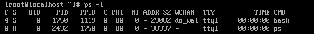
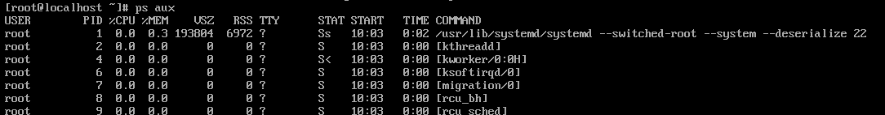
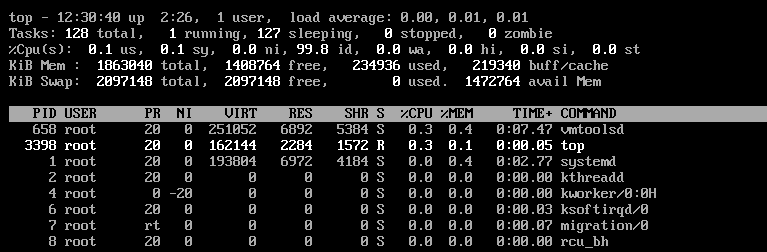

# 鸟哥的Linux私房菜(基础篇)

## 6、Linux文件与目录管理


### ls：文件与目录检视

```shell
[root@study ~]# ls [-aAdfFhilnrRSt] 文件名或目录名称..
[root@study ~]# ls [--color={never,auto,always}] 文件名或目录名称..
[root@study ~]# ls [--full-time] 文件名或目录名称..
选项与参数：
-a ：全部的文件，连同隐藏文件（开头为. 的文件）一起列出来（常用）
-A ：全部的文件，连同隐藏文件，但不包括. 与.. 这两个目录
-d ：仅列出目录本身，而不是列出目录内的文件数据（常用）
-f ：直接列出结果，而不进行排序（ls 默认会以文件名排序！）
-F ：根据文件、目录等信息，给予附加数据结构，例如：
*:代表可可执行文件；/:代表目录；=:代表socket 文件；;:代表FIFO 文件；
-h ：将文件大小以人类较易读的方式（例如GB, KB 等等）列出来；
-i ：列出inode 号码，inode 的意义下一章将会介绍；
-l ：长数据串行出，包含文件的属性与权限等等数据；（常用）
-n ：列出UID 与GID 而非使用者与群组的名称（UID与GID会在帐号管理提到！）
-r ：将排序结果反向输出，例如：原本文件名由小到大，反向则为由大到小；
-R ：连同子目录内容一起列出来，等于该目录下的所有文件都会显示出来；
-S ：以文件大小大小排序，而不是用文件名排序；
-t ：依时间排序，而不是用文件名。
--color=never ：不要依据文件特性给予颜色显示；
--color=always ：显示颜色
--color=auto ：让系统自行依据设置来判断是否给予颜色
--full-time ：以完整时间模式（包含年、月、日、时、分）输出
--time={atime,ctime} ：输出access 时间或改变权限属性时间（ctime）
而非内容变更时间（modification time）

```

### mkdir：创建新目录

```shell
[root@study ~]# mkdir [-mp] 目录名称
选项与参数：
-m ：设置文件的权限喔！直接设置，不需要看默认权限（umask）的脸色～
-p ：帮助你直接将所需要的目录（包含上层目录）递回创建起来！
范例：请到/tmp下面尝试创建数个新目录看看：
[root@study ~]# cd /tmp
[root@study tmp]# mkdir test &lt;==创建一名为test 的新目录
[root@study tmp]# mkdir test1/test2/test3/test4
mkdir: cannot create directory ‘test1/test2/test3/test4’: No such file or directory
# 话说，系统告诉我们，没可能创建这个目录啊！就是没有目录才要创建的！见鬼嘛？
[root@study tmp]# mkdir -p test1/test2/test3/test4
# 原来是要建test4 上层没先建test3 之故！加了这个-p 的选项，可以自行帮你创建多层目录！
范例：创建权限为rwx--x--x的目录
[root@study tmp]# mkdir -m 711 test2
[root@study tmp]# ls -ld test*
drwxr-xr-x. 2 root root 6 Jun 4 19:03 test
drwxr-xr-x. 3 root root 18 Jun 4 19:04 test1
drwx--x--x. 2 root root 6 Jun 4 19:05 test2
# 仔细看上面的权限部分，如果没有加上-m 来强制设置属性，系统会使用默认属性。
# 那么你的默认属性为何？这要通过下面介绍的[umask](../Text/index.html#umask) 才能了解喔！^_^
```

### tar：打包指令

```shell
[dmtsai@study ~]$ tar [-z|-j|-J] [cv] [-f 待建立的新檔名] filename... <==打包与压缩
[dmtsai@study ~]$ tar [-z|-j|-J] [tv] [-f 既有的 tar檔名]             <==察看文件名
[dmtsai@study ~]$ tar [-z|-j|-J] [xv] [-f 既有的 tar檔名] [-C 目錄]   <==解压缩
选项与参数：
-c ：创建打包文件，可搭配-v 来察看过程中被打包的文件名（filename）
-t ：察看打包文件的内容含有哪些文件名，重点在察看“文件名”就是了；
-x ：解打包或解压缩的功能，可以搭配-C （大写）在特定目录解开
特别留意的是，-c, -t, -x 不可同时出现在一串命令行中。
-z ：通过gzip 的支持进行压缩/解压缩：此时文件名最好为*.tar.gz
-j ：通过bzip2 的支持进行压缩/解压缩：此时文件名最好为*.tar.bz2
-J ：通过xz 的支持进行压缩/解压缩：此时文件名最好为*.tar.xz
特别留意，-z, -j, -J 不可以同时出现在一串命令行中
-v ：在压缩/解压缩的过程中，将正在处理的文件名显示出来！
-f filename：-f 后面要立刻接要被处理的文件名！建议-f 单独写一个选项啰！（比较不会忘记）
-C 目录：这个选项用在解压缩，若要在特定目录解压缩，可以使用这个选项。
其他后续练习会使用到的选项介绍：
-p（小写）：保留备份数据的原本权限与属性，常用于备份（-c）重要的配置文件
-P（大写）：保留绝对路径，亦即允许备份数据中含有根目录存在之意；
--exclude=FILE：在压缩的过程中，不要将FILE 打包
```

简单记忆：

- 压　缩：tar -j\<u>c\</u>v -f filename.tar.bz2 要被压缩的文件或目录名称
- 查　询：tar -j\<u>t\</u>v -f filename.tar.bz2
- 解压缩：tar -j\<u>x\</u>v -f filename.tar.bz2 -C 欲解压缩的目录

### nohup：忽略挂起

```shell
[root@study ~]# nohup [指令与参数] <==在终端机前景中工作
[root@study ~]# nohup [指令与参数] & <==在终端机背景中工作
```

### ps

ps 是撷取一个时间点的程序状态

```shell
ps -ef <==查看进程
ps -ef|grep A <==查看进程A
ps aux <==观察系统所有的程序数据
ps -lA <==也是能够观察所有系统的数据
ps axjf <==连同部分程序树状态
选项与参数：
-A ：所有的process 均显示出来，与-e 具有同样的效用；
-a ：不与terminal 有关的所有process ；
-u ：有效使用者（effective user）相关的process ；
x ：通常与a 这个参数一起使用，可列出较完整信息。
输出格式规划：
l ：较长、较详细的将该PID 的的信息列出；
j ：工作的格式（jobs format）
-f ：做一个更为完整的输出。
```

#### ps -l：

仅观察自己的bash(操作系统)相关程序



- F：代表这个程序旗标（process flags），说明这个程序的总结权限，常见号码有：
若为4 表示此程序的权限为root ；
若为1 则表示此子程序仅进行复制（fork）而没有实际执行（exec）。
- S：代表这个程序的状态（STAT），主要的状态有：
- R （Running）：该程序正在运行中；
- S （Sleep）：该程序目前正在睡眠状态（idle），但可以被唤醒（signal）。
- D ：不可被唤醒的睡眠状态，通常这支程序可能在等待I/O 的情况（ex>打印）
- T ：停止状态（stop），可能是在工作控制（背景暂停）或除错（traced）状态；
- Z （Zombie）：僵尸状态，程序已经终止但却无法被移除至内存外。
- UID/PID/PPID：代表“此程序被该UID 所拥有/程序的PID 号码/此程序的父程序PID 号
码”
- C：代表CPU 使用率，单位为百分比；
- PRI/NI：Priority/Nice 的缩写，代表此程序被CPU 所执行的优先顺序，数值越小代表该
程序越快被CPU 执行。详细的PRI 与NI 将在下一小节说明。
- ADDR/SZ/WCHAN：都与内存有关，ADDR 是kernel function，指出该程序在内存的哪
个部分，如果是个running 的程序，一般就会显示“ - ” / SZ 代表此程序用掉多少内存/
- WCHAN 表示目前程序是否运行中，同样的，若为- 表示正在运行中。
- TTY：登陆者的终端机位置，若为远端登陆则使用动态终端接口（pts/n）；
- TIME：使用掉的CPU 时间，注意，是此程序实际花费CPU 运行的时间，而不是系统时
间；
- CMD：就是command 的缩写，造成此程序的触发程序之指令为何。

#### ps aux

观察系统所有程序



- USER：该process 属于那个使用者帐号的？
- PID ：该process 的程序识别码。
- %CPU：该process 使用掉的CPU 资源百分比；
- %MEM：该process 所占用的实体内存百分比；
- VSZ ：该process 使用掉的虚拟内存量（KBytes）
- RSS ：该process 占用的固定的内存量（KBytes）
- TTY ：该process 是在那个终端机上面运行，若与终端机无关则显示?，另外，tty1-tty6
是本机上面的登陆者程序，若为pts/0 等等的，则表示为由网络连接进主机的程序。
- STAT：该程序目前的状态，状态显示与ps -l 的S 旗标相同（R/S/T/Z）
- START：该process 被触发启动的时间；
- TIME ：该process 实际使用CPU 运行的时间。
- COMMAND：该程序的实际指令为何？

### kill：移除工作

```shell
[root@study ~]# kill -signal %jobnumber
[root@study ~]# kill -l
选项与参数：
-l ：这个是L 的小写，列出目前kill 能够使用的讯号（signal）有哪些？
signal ：代表给予后面接的那个工作什么样的指示啰！用man 7 signal 可知：
-1 ：重新读取一次参数的配置文件（类似reload）；
-2 ：代表与由键盘输入[ctrl]-c 同样的动作；
-9 ：立刻强制删除一个工作；
-15：以正常的程序方式终止一项工作。与-9 是不一样的。
范例一：找出目前的bash 环境下的背景工作，并将该工作“强制删除”。
[root@study ~]# jobs
[1]+ Stopped vim ~/.bashrc
[2] Stopped find / -print
[root@study ~]# kill -9 %2; jobs
[1]+ Stopped vim ~/.bashrc
[2] Killed find / -print
# 再过几秒你再下达jobs 一次，就会发现2 号工作不见了！因为被移除了！
范例二：找出目前的bash 环境下的背景工作，并将该工作“正常终止”掉。
[root@study ~]# jobs
[1]+ Stopped vim ~/.bashrc
[root@study ~]# kill -SIGTERM %1
# -SIGTERM 与-15 是一样的！您可以使用kill -l 来查阅！
# 不过在这个案例中，vim 的工作无法被结束喔！因为他无法通过kill 正常终止的意思！
```

## 第十六章、程序管理与SHLinux初探

### 16.3、程序管理

#### 16.3.1、程序的观察

ps ：将某个时间点的程序运行情况撷取下来

```
[root@study ~]# ps aux <==观察系统所有的程序数据
[root@study ~]# ps -lA <==也是能够观察所有系统的数据
[root@study ~]# ps axjf <==连同部分程序树状态
选项与参数：
-A ：所有的process 均显示出来，与-e 具有同样的效用；
-a ：不与terminal 有关的所有process ；
-u ：有效使用者（effective user）相关的process ；
x ：通常与a 这个参数一起使用，可列出较完整信息。
输出格式规划：
l ：较长、较详细的将该PID 的的信息列出；
j ：工作的格式（jobs format）
-f ：做一个更为完整的输出。
```


### 4、top

持续侦测程序运行的状态

```
top [-d 数字] top [-bnp]
选项与参数：
-d ：后面可以接秒数，就是整个程序画面更新的秒数。默认是5 秒；
-b ：以批次的方式执行top ，还有更多的参数可以使用喔！
通常会搭配数据流重导向来将批次的结果输出成为文件。
-n ：与-b 搭配，意义是，需要进行几次top 的输出结果。
-p ：指定某些个PID 来进行观察监测而已。
在top 执行过程当中可以使用的按键指令：
? ：显示在top 当中可以输入的按键指令；
P ：以CPU 的使用资源排序显示；
M ：以Memory 的使用资源排序显示；
N ：以PID 来排序喔！
T ：由该Process 使用的CPU 时间累积（TIME+）排序。
k ：给予某个PID 一个讯号（signal）
r ：给予某个PID 重新制订一个nice 值。
q ：离开top 软件的按键。
```



- 第一行（top...）：这一行显示的信息分别为：
  - 目前的时间，亦即是12:30:40 那个项目；
  - 开机到目前为止所经过的时间，亦即是up 2:26, 那个项目；
  - 已经登陆系统的使用者人数，亦即是1 users, 项目；
  - 系统在1, 5, 15 分钟的平均工作负载。我们在第十五章谈到的batch 工作方式为负载
  - 小于0.8 就是这个负载啰！代表的是1, 5, 15 分钟，系统平均要负责运行几个程序
    （工作）的意思。越小代表系统越闲置，若高于1 得要注意你的系统程序是否太过
    繁复了！
- 第二行（Tasks...）：显示的是目前程序的总量与个别程序在什么状态（running,
sleeping, stopped, zombie）。比较需要注意的是最后的zombie 那个数值，如果不是0
！好好看看到底是那个process 变成僵尸了吧？
- 第三行（%Cpus...）：显示的是CPU 的整体负载，每个项目可使用? 查阅。需要特别注
意的是wa 项目，那个项目代表的是I/O wait，通常你的系统会变慢都是I/O 产生的问题
比较大！因此这里得要注意这个项目耗用CPU 的资源喔！另外，如果是多核心的设
备，可以按下数字键“1”来切换成不同CPU 的负载率。
- 第四行与第五行：表示目前的实体内存与虚拟内存（Mem/Swap）的使用情况。再次重
申，要注意的是swap 的使用量要尽量的少！如果swap 被用的很大量，表示系统的实体
内存实在不足！
- 第六行：这个是当在top 程序当中输入指令时，显示状态的地方。

至于top 下半部分的画面，则是每个process 使用的资源情况。比较需要注意的是：

- PID ：每个process 的ID 啦！
- USER：该process 所属的使用者；
- PR ：Priority 的简写，程序的优先执行顺序，越小越早被执行；
- NI ：Nice 的简写，与Priority 有关，也是越小越早被执行；
- %CPU：CPU 的使用率；
- %MEM：内存的使用率；
- TIME+：CPU 使用时间的累加；
top 默认使用CPU 使用率（%CPU）作为排序的重点，如果你想要使用内存使用率排序，则
可以按下“M”，若要回复则按下“P”即可。如果想要离开top 则按下“ q ”吧！如果你想要将top
的结果输出成为文件时，可以这样做：

```shell
范例二：将top 的信息进行2 次，然后将结果输出到/tmp/top.txt
[root@study ~]# top -b -n 2 > /tmp/top.txt
这样一来，嘿嘿！就可以将top 的信息存到/tmp/top.txt 文件中了。
```

### 5、sed


### 6、grep


### 7、awk

awk是一款小型的数据处理工具

```shell
[dmtsai@study ~]$ awk '条件类型1{动作1} 条件类型2{动作2} ...' filename
```

awk 后面接两个单引号并加上大括号{} 来设置想要对数据进行的处理动作。awk 可以处理后
续接的文件，也可以读取来自前个指令的standard output 

### 图形化界面切换设置

```shell
#设置为命令行界面
systemctl set-default multi-user.target
#设置为图形化界面
systemctl set-default graphical.target
```


### 全部代码：


6. scp
7. rm
8. watch
9. df
10. tcpdump
11. lsof
12. nc
13. netstat
14. vmstat
15. mpstat
16. split
17. wc -c +filename
18. more/less
19. head/tail
20. diff
23. cd
25. cp
26. pwd
27. tree
28. touch
29. chmod 
30. file
31. cat
32. tr
33. sort
34. find
35. which
36. whereis
37. locate
39. service
40. curl
41. wget
42. ping
43. telnet
44. nslookup
45. ss
46. ifconfig
47. su
48. sudo
49. du
50. free
51. sar
52. lsof
53. ulimit
54. iostat

