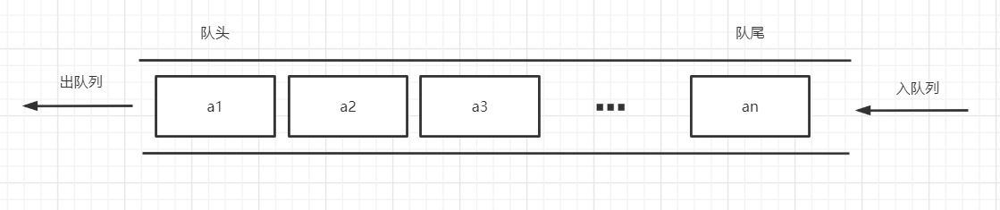
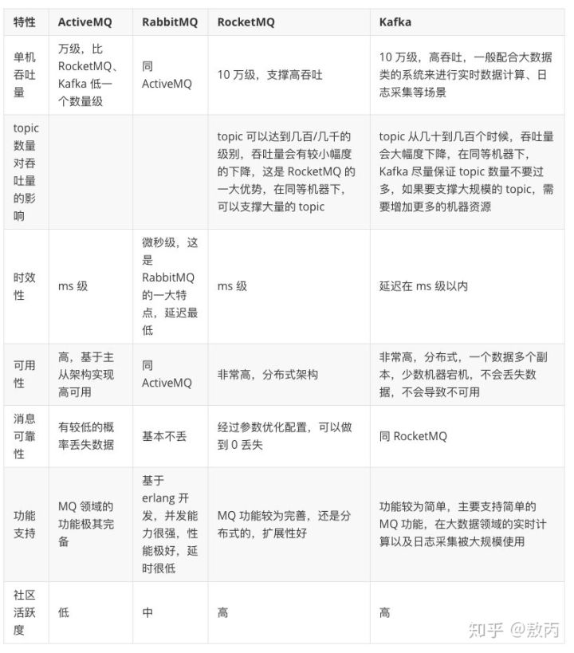
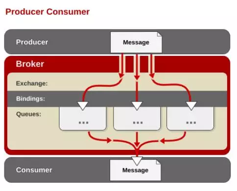
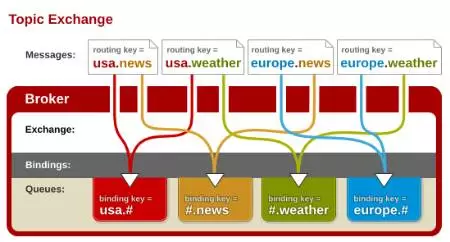
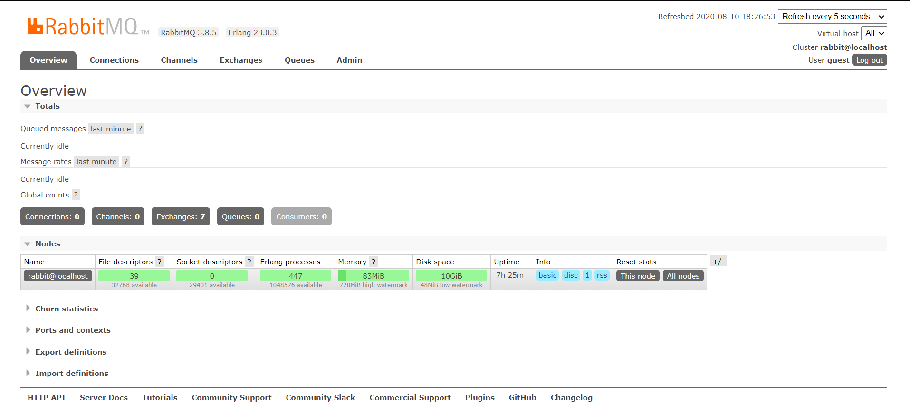
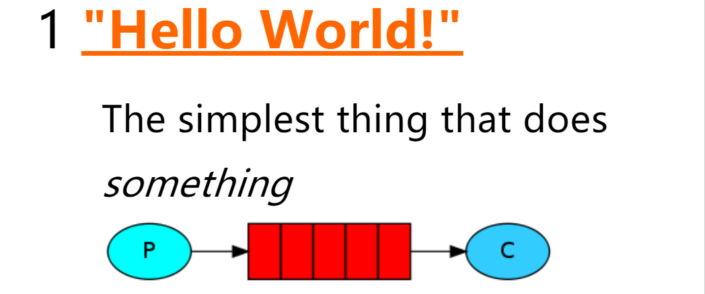
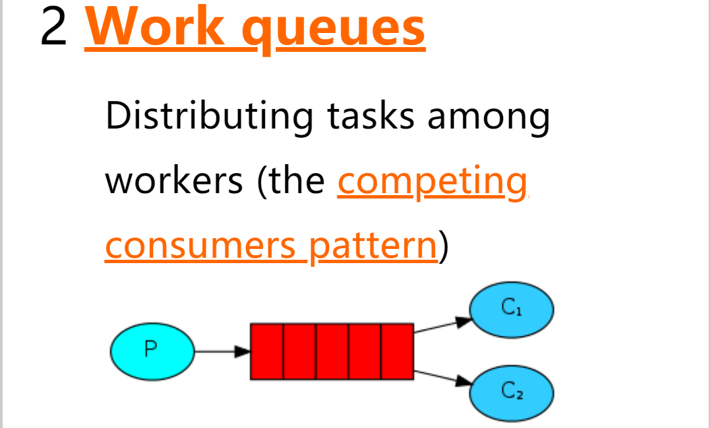
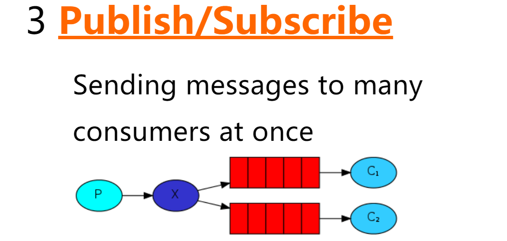
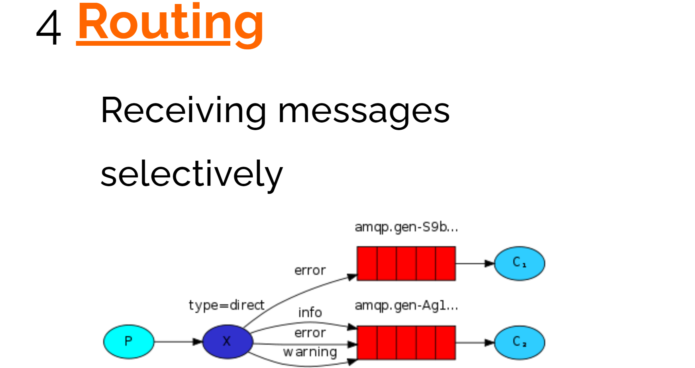
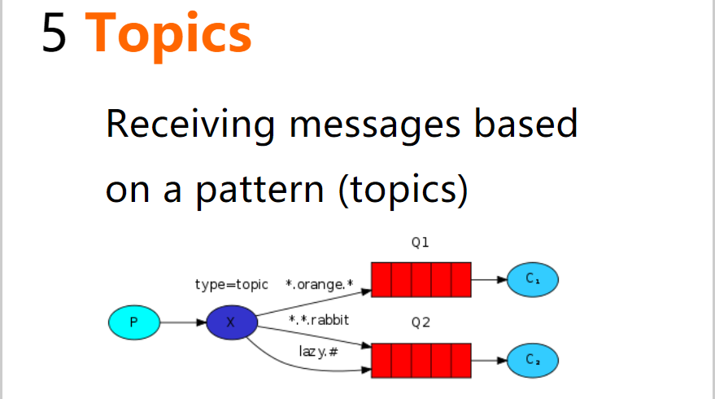

# RabbitMQ基础

https://www.bilibili.com/video/BV1dE411K7MG

## 第一章、RabbitMQ简介

### 1.1、什么是RabbitMQ

**RabbitMQ**是实现了高级消息队列协议（AMQP）的开源消息代理软件（亦称面向消息的中间件）。RabbitMQ服务器是用Erlang语言编写的，而集群和故障转移是构建在开放电信平台框架上的。所有主要的编程语言均有与代理接口通讯的客户端库。

### 1.2、什么是消息队列

队列是数据结构的一种，只允许在一端进行插入，并且只允许在另一端进行删除，直白的说就是先进先出。

而消息队列则是用队列存储消息



### 1.3、为什么要用消息队列

1. 异步

   也就是开启多线程的意思，可以将一些功能异步处理

2. 解耦

   比如说我们做一个接口，一些系统要调用这个接口的话，我们要修改代码，而不再调用这个接口，也要修改代码。这时，我们可以用消息队列监听这个接口，其他系统如果想要调用这个接口，可以从消息队列获取

3. 削峰

   如果我们实现一个整点秒杀活动，瞬时并发量会非常高，可能导致系统崩溃，而消息队列可以将这些请求存储起来，并由系统根据自身性能主动获取这些请求

### 1.4、消息队列的缺点

1. 系统复杂性

   消息队列过于复杂，会出现各种问题，如**消息重复消费**、**消息丢失**、**消息的顺序消费**等等

2. 数据一致性

   存储在消息队列中的消息可能会由于各种原因丢失数据，它并没有数据库的持久化的数据存储能力，所以使用消息队列的消息不能太重要

3. 可用性

   如果消息队列服务器突然宕机，那整个系统都可能崩溃

### 1.5、主流消息队列产品对比



rabbitmq的优势在于免费，并发能力强，数据基本不会丢失，与springboot契合度高

## 第二章、AMQP协议

### 2.1、AMQP基本概念


- **Message(消息)**：消息是不具体的，它由消息头和消息体组成。消息体是不透明的，而消息头则由一系列的可选属性组成，这些属性包括routing-key(路由键)、priority(相对于其他消息的优先权)、delivery-mode(指出该消息可能需要持久性存储)等
- **Publisher(生产者)**：消息的生产者，也是一个向交换器发布消息的客户端应用
- **Broker(消息队列服务器实体)**: 接收和分发消息的应用，RabbitMQ Server就是Message Broker。
- **Virtual host(虚拟主机)**: 出于多租户和安全因素设计的，把AMQP的基本组件划分到一个虚拟的分组中，类似于网络中的namespace概念。当多个不同的用户使用同一个RabbitMQ server提供的服务时，可以划分出多个vhost，每个用户在自己的vhost创建exchange／queue等。
- **Connection(网络连接)**: publisher／consumer和broker之间的TCP连接。断开连接的操作只会在client端进行，Broker不会断开连接，除非出现网络故障或broker服务出现问题。
- **Channel(信道)**: 如果每一次访问RabbitMQ都建立一个Connection，在消息量大的时候建立TCP Connection的开销将是巨大的，效率也较低。Channel是在connection内部建立的逻辑连接，如果应用程序支持多线程，通常每个thread创建单独的channel进行通讯，AMQP method包含了channel id帮助客户端和message broker识别channel，所以channel之间是完全隔离的。Channel作为轻量级的Connection极大减少了操作系统建立TCP connection的开销。
- **Exchange(交换机)**: message到达broker的第一站，根据分发规则，匹配查询表中的routing key，分发消息到queue中去。常用的类型有：direct (point-to-point), topic (publish-subscribe) and fanout (multicast)。
- **Queue(消息队列) **:消息最终被送到这里等待consumer取走。一个message可以被同时拷贝到多个queue中。
- **Binding(绑定)**: exchange和queue之间的虚拟连接，binding中可以包含routing key。Binding信息被保存到exchange中的查询表中，用于message的分发依据。

### 2.2、典型的“生产/消费”消息模型



生产者发送消息到broker server（RabbitMQ）。在Broker内部，用户创建Exchange／Queue，通过Binding规则将两者联系在一起。Exchange分发消息，根据类型／binding的不同分发策略有区别。消息最后来到Queue中，等待消费者取走。

### 2.3、Exchange类型

Exchange有多种类型，最常用的是Direct／Fanout／Topic三种类型。

- Direct
  
  Message中的“routing key”如果和Binding中的“binding key”一致， Direct exchange则将message发到对应的queue中。

- Fanout
  
  每个发到Fanout类型Exchange的message都会分到所有绑定的queue上去。

- Topic
  
  根据routing key，及通配规则，Topic exchange将分发到目标queue中。

Routing key中可以包含两种通配符，类似于正则表达式：

```
“#”通配任何零个或多个word
“*”通配任何单个word
```

## 第三章、管道命令行与管理界面

### 3.1、管道命令行

可通过`rabbitmqctl help`查看所有命令

### 3.2、管理界面



1. Overview概览

2. Connections连接

   查看rabbitmq与哪些应用连立起了连接，可以进行搜索，支持正则表达式，支持分页

3. Channels信道

   可以进行搜索，支持正则表达式，支持分页

4. Exchange交换机

   可以进行搜索，可以自定义交换机

5. Queue队列

   可以进行搜索，可以自定义队列，需要绑定交换机

6. Admin用户

   可以进行搜索，添加用户，修改权限，自定义虚拟主机等操作


## 第四章、Java使用RabbitMQ

在Java后台调用Rabbitmq，首先要建立一个maven项目并导入依赖

```xml
<dependency>
    <groupId>com.rabbitmq</groupId>
        <artifactId>amqp-client</artifactId>
    <version>5.9.0</version>
</dependency>
```

然后创建连接，这里创建了一个工具类用于创建连接和关闭连接

```java
public class RabbitMQUtils {
    //定义提供连接对象的方法
    public static Connection getConnection(){
        try{
            ConnectionFactory connectionFactory = new ConnectionFactory();
            connectionFactory.setHost("192.168.254.133");
            connectionFactory.setPort(5672);
            //设置虚拟主机
            connectionFactory.setVirtualHost("/ems");
            //设置用户名
            connectionFactory.setUsername("ems");
            //设置密码
            connectionFactory.setPassword("123");
            //获取链接对象
            return connectionFactory.newConnection();
        } catch (IOException | TimeoutException e) {
            e.printStackTrace();
        }
        return null;
    }
    //关闭通道和关闭连接工具方法
    public static void closeConnectionAndChannel(Channel channel,Connection connection){
        try{
            if (channel!=null)channel.close();
            if (connection!=null)connection.close();
        } catch (TimeoutException | IOException e) {
            e.printStackTrace();
        }
    }
}
```

### 4.1、Hello World模型



- P：生产者，也就是要发送消息的程序
- C：消费者：消息的接受者，会一直等待消息到来。
- queue：消息队列，图中红色部分。类似一个邮箱，可以缓存消息；生产者向其中投递消息，消费者从其中取出消息。

实例代码

生产者生产消息直接发布到队列中

```java
public class Provider {
    @Test
    public void testSentMassage() throws IOException, TimeoutException {
        Connection connection = RabbitMQUtils.getConnection();
        if (connection==null)return;
        Channel channel = connection.createChannel();
        //通道绑定对应消息
        //queue:队列名称，如果队列不存在自动创建
        //durable:队列是否持久化
        //exclusive:是否独占队列
        //autoDelete:是否在消费完成后自动删除队列
        //arguments:额外附加参数
        channel.queueDeclare("hello",false,false,false,null);
        //发布消息
        //exchange:交换机名称
        //routingKey:队列名称
        //props:传递消息的额外名称
        //body:消息的具体内容
        channel.basicPublish("","hello",null,"hello RabbitMQ".getBytes());
        RabbitMQUtils.closeConnectionAndChannel(channel,connection);
    }
}
```

消费者消费消息（注意：正常来说我们消费完消息后也要及时的关闭通道和连接，但是由于消费消息是由另一个线程的操作的，如果我们关闭了连接就无法观察到结果，而事实上消息是已经被消费的。）

```java
public class Customer {
    public static void main(String[] args) throws IOException {
        Connection connection = RabbitMQUtils.getConnection();
        if (connection==null)return;
        Channel channel = connection.createChannel();

        channel.queueDeclare("hello",false,false,false,null);
        //消费消息
        //queue:队列名称
        //autoAck:开始消息的自动确认机制
        //callback:消费时回调接口
        channel.basicConsume("hello",true,new DefaultConsumer(channel){
            @Override
            public void handleDelivery(String consumerTag, Envelope envelope, AMQP.BasicProperties properties, byte[] body) throws IOException {
                System.out.println("new String(body) = " + new String(body));
            }
        });
        RabbitMQUtils.closeConnectionAndChannel(channel,connection);
    }
}
```

### 4.2、Work queues模型



- P：生产者：任务的发布者
- C1：消费者-1，领取任务并且完成任务
- C2：消费者-2：领取任务并完成任务

**Work queues**，也被称为（Task queues），任务模型。当消息处理比较耗时的时候，可能生产消息的速度会远远大于消息的消费速度。长此以往，消息就会堆积越来越多，无法及时处理。此时就可以使用work 模型：**让多个消费者绑定到一个队列，共同消费队列中的消息**。队列中的消息一旦消费，就会消失，因此任务是不会被重复执行的。

实例代码

生产者同上

消费者1

将消息确认关闭(autoAck设置为false)

注意：如果autoAck为true，则队列会将所有消息平均并且直接地交给消费者，当消费者出现异常，那么消息会丢失

在消费完消息后通知队列已消费消息

```java
//消息确认
//deliveryTag：确认队列中哪个具体消息
//multiple：是否开启多个消息同时确认
channel.basicAck(envelope.getDeliveryTag(),false);
```

```java
public class Customer1 {
    public static void main(String[] args) throws IOException {
        Connection connection = RabbitMQUtils.getConnection();
        final Channel channel = connection.createChannel();
        channel.basicQos(1);
        channel.queueDeclare("work",true,false,false,null);

        //消费消息
        //queue:队列名称
        //autoAck:开始消息的自动确认机制
        //callback:消费时回调接口
        channel.basicConsume("work",false,new DefaultConsumer(channel){
            @Override
            public void handleDelivery(String consumerTag, Envelope envelope, AMQP.BasicProperties properties, byte[] body) throws IOException {
                try {
                    Thread.sleep(2000);
                } catch (InterruptedException e) {
                    e.printStackTrace();
                }
                System.out.println("消费者-1：" + new String(body));
                //消息确认
                //deliveryTag：确认队列中哪个具体消息
                //multiple：是否开启多个消息同时确认
                channel.basicAck(envelope.getDeliveryTag(),false);
            }
        });
//        channel.close();
//        connection.close();
    }
}
```

消费者2同上

这里为了对比消息是按照性能分配的，将消费者1延迟2秒，消费者2延迟1秒，这样就能清楚的观察到，消费者2比消费者1多消费了一倍的消息

### 4.3、Publish/Subscribe模型



发布/订阅模型，习惯上将其称为广播模型

在广播模式下，消息发送流程是这样的：

-  可以有多个消费者
-  每个**消费者有自己的queue**（队列）
-  每个**队列都要绑定到Exchange**（交换机）
-  **生产者发送的消息，只能发送到交换机**，交换机来决定要发给哪个队列，生产者无法决定。
-  交换机把消息发送给绑定过的所有队列
-  队列的消费者都能拿到消息。实现一条消息被多个消费者消费

实例代码

生产者：与前两种不同的是，要将消息放到交换机当中

```java
public class Provider {
    @Test
    public void TestSetMessage() throws IOException {
        Connection connection = RabbitMQUtils.getConnection();
        Channel channel = connection.createChannel();
        channel.exchangeDeclare("logs","fanout");
        for (int i = 0; i < 100; i++) {
            String message = "fanout type message"+i;
            System.out.println(message);
            channel.basicPublish("logs","",null,message.getBytes());
        }
        RabbitMQUtils.closeConnectionAndChannel(channel,connection);
    }
}
```

消费者1：想要获取消息首先要建立一个临时的队列，当消息消费完毕，临时队列将自动删除

```java
public class Customer1 {
    public static void main(String[] args) throws IOException {
        //获取连接对象
        Connection connection = RabbitMQUtils.getConnection();
        Channel channel = connection.createChannel();
        //通道绑定交换机
        channel.exchangeDeclare("logs","fanout");
        //建立临时队列
        String queueName = channel.queueDeclare().getQueue();
        //绑定交换机与队列
        channel.queueBind(queueName,"logs","");
        //消费消息
        channel.basicConsume(queueName,true,new DefaultConsumer(channel){
            @Override
            public void handleDelivery(String consumerTag, Envelope envelope, AMQP.BasicProperties properties, byte[] body) throws IOException {
                try {
                    Thread.sleep(2000);
                } catch (InterruptedException e) {
                    e.printStackTrace();
                }
                System.out.println("消费者1:"+new String(body));
            }
        });
    }
}
```

消费者2：同上，需要注意的是，这种模型下，消费者1和消费者2都会接收到全部消息

### 4.4、Rounting模型

在广播模式中，一条消息，会被所有订阅的队列都消费。但是，在某些场景下，我们希望不同的消息被不同的队列消费。这时就要用到Direct类型的Exchange。

 在Direct类型下：

- 队列与交换机的绑定，不能是任意绑定了，而是要指定一个RoutingKey（路由key）
- 消息的发送方在 向 Exchange发送消息时，也必须指定消息的 RoutingKey。
- Exchange不再把消息交给每一个绑定的队列，而是根据消息的Routing Key进行判断，只有队列的Routingkey与消息的 Routing key完全一致，才会接收到消息



Rounting路由模型，当消息发送时携带一个

- P：生产者，向Exchange发送消息，发送消息时，会指定一个routing key。
- X：Exchange（交换机），接收生产者的消息，然后把消息递交给 与routing key完全匹配的队列
- C1：消费者，其所在队列指定了需要routing key 为 error 的消息
- C2：消费者，其所在队列指定了需要routing key 为 info、error、warning 的消息

实例代码

生产者：将消息发送到交换机时，消息会携带一个routing key

```java
public class Provider {
    public static void main(String[] args) throws IOException {
        String exchangeName = "logs_direct";
        Connection connection = RabbitMQUtils.getConnection();
        Channel channel = connection.createChannel();
        //通过通道声明交换机 direct：路由模式
        channel.exchangeDeclare(exchangeName,"direct");
        String routingKey="error";//路由key
        //消息绑定路由key发送消息
        channel.basicPublish(exchangeName,routingKey,null,("这是direct模型基于routing key：["+routingKey+"]发送的消息").getBytes());
        RabbitMQUtils.closeConnectionAndChannel(channel,connection);
    }
}
```

消费者1：临时队列绑定交换机时需要指定响应的route key才能获取到消息

```java
public class Customer1 {
    public static void main(String[] args) throws IOException {
        String exchangeName = "logs_direct";
        Connection connection = RabbitMQUtils.getConnection();
        Channel channel = connection.createChannel();
        //通道声明交换机和交换机类型
        channel.exchangeDeclare(exchangeName,"direct");
        //创建一个临时队列
        String queueName = channel.queueDeclare().getQueue();
        //基于route key绑定队列和交换机
        channel.queueBind(queueName,exchangeName,"error");
        //获取消息
        channel.basicConsume(queueName,true,new DefaultConsumer(channel){
            @Override
            public void handleDelivery(String consumerTag, Envelope envelope, AMQP.BasicProperties properties, byte[] body) throws IOException {
                System.out.println("消费者1："+new String(body));
            }
        });
    }
}
```

消费者2：如同广播模型，相同一条消息可以由多个消费者消费，如果消费者的临时队列和交换机所绑定的route key与生产者所发布的消息所携带的route key对应不上，则无法获取消息

```java
public class Customer2 {
    public static void main(String[] args) throws IOException {
        String exchangeName = "logs_direct";
        Connection connection = RabbitMQUtils.getConnection();
        Channel channel = connection.createChannel();
        //通道声明交换机和交换机类型
        channel.exchangeDeclare(exchangeName,"direct");
        //创建一个临时队列
        String queueName = channel.queueDeclare().getQueue();
        //基于route key绑定队列和交换机
        channel.queueBind(queueName,exchangeName,"error");
        channel.queueBind(queueName,exchangeName,"info");
        channel.queueBind(queueName,exchangeName,"warring");
        //获取消息
        channel.basicConsume(queueName,true,new DefaultConsumer(channel){
            @Override
            public void handleDelivery(String consumerTag, Envelope envelope, AMQP.BasicProperties properties, byte[] body) throws IOException {
                System.out.println("消费者2："+new String(body));
            }
        });
    }
}
```

### 4.5、Topic模型



Topic类型的Exchange与Direct相比，都是可以根据RoutingKey把消息路由到不同的队列。只不过Topic类型Exchange可以让队列在绑定Routing key 的时候使用通配符！这种模型Routingkey 一般都是由一个或多个单词组成，多个单词之间以”.”分割，例如： item.insert

统配符
\* (star) can substitute for exactly one word.    匹配不多不少恰好1个词
\# (hash) can substitute for zero or more words.  匹配一个或多个词

如：
audit.\#    匹配audit.irs.corporate或者 audit.irs 等
audit.\*   只能匹配 audit.irs

代码示例

```java
public class Provider {
    public static void main(String[] args) throws IOException {
        Connection connection = RabbitMQUtils.getConnection();
        Channel channel = connection.createChannel();
        channel.exchangeDeclare("topics","topic");
        String routeKey = "user.save.world";
        channel.basicPublish("topics",routeKey,null,("这里是topic动态路由模型，routeKey：["+routeKey+"]").getBytes());
        RabbitMQUtils.closeConnectionAndChannel(channel,connection);
    }
}
```

```java
public class Customer1 {
    public static void main(String[] args) throws IOException {
        Connection connection = RabbitMQUtils.getConnection();
        Channel channel = connection.createChannel();
        channel.exchangeDeclare("topics","topic");
        String queue = channel.queueDeclare().getQueue();
        channel.queueBind(queue,"topics","user.#");
        channel.basicConsume(queue,true,new DefaultConsumer(channel){
            @Override
            public void handleDelivery(String consumerTag, Envelope envelope, AMQP.BasicProperties properties, byte[] body) throws IOException {
                System.out.println("消费者1："+new String(body));
            }
        });
    }
}
```

```java
public class Customer2 {
    public static void main(String[] args) throws IOException {
        Connection connection = RabbitMQUtils.getConnection();
        Channel channel = connection.createChannel();
        channel.exchangeDeclare("topics","topic");
        String queue = channel.queueDeclare().getQueue();
        channel.queueBind(queue,"topics","*.save.*");

        channel.basicConsume(queue,true,new DefaultConsumer(channel){
            @Override
            public void handleDelivery(String consumerTag, Envelope envelope, AMQP.BasicProperties properties, byte[] body) throws IOException {
                System.out.println("消费者1："+new String(body));
            }
        });
    }
}
```

## 第五章、SpringBoot中使用RabbitMQ

### 5.1、环境搭建

Maven引入启动器

```xml
<dependency>
  <groupId>org.springframework.boot</groupId>
  <artifactId>spring-boot-starter-amqp</artifactId>
</dependency>
```

 yaml配置文件

```yaml
spring:
    application:
        name: springboot_rabbitmq 
    rabbitmq:
        host: localhost #服务IP
        port: 5672 #服务端口
        username: ems #用户名
        password: 123 #密码
        virtual-host: /ems #虚拟主机
```

### 5.2、Hello World模型

生产者

```java
@SpringBootTest//springboot测试类
class RabbitmqSpringbootApplicationTests {
    @Autowired
    private RabbitTemplate rabbitTemplate;
    @Test
    void contextLoads() {
        rabbitTemplate.convertAndSend("hello","hello world");
    }
}
```

消费者

```java
@Component
@RabbitListener(queuesToDeclare = @Queue(value = "hello",durable = "false",autoDelete = "true"))
public class HelloCustomer {
    @RabbitHandler
    public void receive1(String message){
        System.out.println("message="+message);
    }
}
```

### 5.2、Work queues模型

生产者

```java
@SpringBootTest
class RabbitmqSpringbootApplicationTests {
    @Autowired
    private RabbitTemplate rabbitTemplate;
    @Test
    void contextLoads() {
        for (int i = 0; i < 10; i++) {
            rabbitTemplate.convertAndSend("work","hello work"+i);
        }
    }
}
```

消费者

```java
@Component
public class WorkCustomer {
    @RabbitListener(queuesToDeclare = @Queue("work"))
    public void receive1(String message){
        System.out.println("message1 = " + message);
    }
    @RabbitListener(queuesToDeclare = @Queue("work"))
    public void receive2(String message){
        System.out.println("message2 = " + message);
    }
}
```

> 说明:默认在Spring AMQP实现中Work这种方式就是公平调度,如果需要实现能者多劳需要额外配置

### 5.3、Publish/Subscribe模型

生产者

```java
@SpringBootTest
class RabbitmqSpringbootApplicationTests {
    @Autowired
    private RabbitTemplate rabbitTemplate;
    @Test
    void testFanout(){
        rabbitTemplate.convertAndSend("logs","","Fanout模型发送消息");
    }
}
```

消费者

```java
@Component
public class FanoutCustomer {
    @RabbitListener(bindings = {
            @QueueBinding(
                    value = @Queue,//创建临时队列
                    exchange = @Exchange(value = "logs",type = "fanout")//绑定的交换机
            )
    })
    public void receive1(String message){
        System.out.println("message1："+message);
    }
    @RabbitListener(bindings = {
            @QueueBinding(
                    value = @Queue,//创建临时队列
                    exchange = @Exchange(value = "logs",type = "fanout")//绑定的交换机
            )
    })
    public void receive2(String message){
        System.out.println("message2："+message);
    }
}
```

### 5.4、Routing模型

生产者

```java
@SpringBootTest
class RabbitmqSpringbootApplicationTests {
    @Autowired
    private RabbitTemplate rabbitTemplate;

    @Test
    void testRoute(){
        rabbitTemplate.convertAndSend("directs","error","发送routingKey为info的路由信息");
    }
}
```

消费者

```java
@Component
public class RouteCustomer {
    @RabbitListener(bindings = {
            @QueueBinding(
                    value = @Queue,
                    exchange = @Exchange(value = "directs",type = "direct"),
                    key = {"info","error","warn"}
            )
    })
    public void receive1(String message){
        System.out.println("message1:"+message);
    }
    @RabbitListener(bindings = {
            @QueueBinding(
                    value = @Queue,
                    exchange = @Exchange(value = "directs",type = "direct"),
                    key = {"error"}
            )
    })
    public void receive2(String message){
        System.out.println("message2:"+message);
    }
}
```

### 5.5、Topic模型

生产者

```java
@SpringBootTest
class RabbitmqSpringbootApplicationTests {
    @Autowired
    private RabbitTemplate rabbitTemplate;
    @Test
    void testTopic(){
        rabbitTemplate.convertAndSend("topics","order","发送user.save路由消息");
    }
}
```

消费者

```java
@Component
public class TopicCustomer {
    @RabbitListener(bindings = {
            @QueueBinding(
                    value = @Queue,
                    exchange = @Exchange(type = "topic",name = "topics"),
                    key = {"user.save","user.*"}
            )
    })
    public void receive1(String message){
        System.out.println("message1:"+message);
    }
    @RabbitListener(bindings = {
            @QueueBinding(
                    value = @Queue,
                    exchange = @Exchange(type = "topic",name = "topics"),
                    key = {"order.#","produce.#","user.*"}
            )
    })
    public void receive2(String message){
        System.out.println("message2:"+message);
    }
}
```