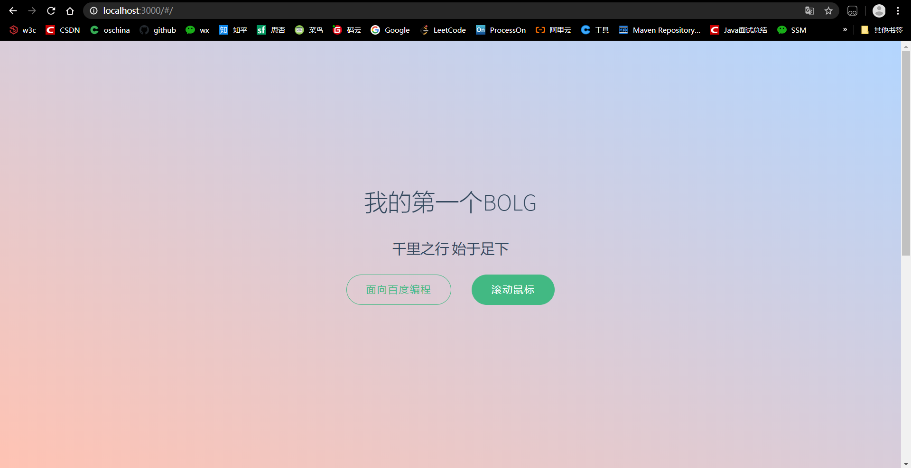

# Github+docsify搭建个人博客

## 一些说明

#### 先来看下我搭建好的效果

和一般的使用Hexo、Jekyll、Hugo等博客框架搭建的博客可能有些差异。这个更像是一个Document API，不过博客也是一些文章啦。

#### 使用的框架技术

- docsify框架
- 基于Github Pages的站点部署

#### 我是在**Windows 7**下搭建的

网上好些搭建博客的视频教程，大部分用的是Macbook。没办法，“实力确实不允许啊”，我还挣扎在Windows的苦海中。等我有钱了，我也要卖最好的Mac，写最渣的代码。

 

## 准备工作

#### 1、要有git环境，有github账号

windows下安装git可以看下这篇[Git简易教程之git简介及安装](http://mp.weixin.qq.com/s?__biz=MzU3ODkzNjAwOA==&mid=2247483757&idx=1&sn=9630555b1c4032e40d15912218a4554a&chksm=fd6c8ccaca1b05dcbf8ff94b715d89cf1380dd3629d9e7c9a8ec718e0bf9a207675f89689bea&scene=21#wechat_redirect)

因为我们要使用Github Pages来部署我们的应用，请先注册下github的账号。

#### 2、有node环境

docsify框架需要有node环境的支持。上node.js的官网下载安装包，此处下载Windows版本的，点下一步一路安装下去即可。另外需要配置下环境变量。

Windows下安装node环境，请自行百度教程安装。

#### 3、简要说明一下步骤

- 上docsify官网了解下，里面有使用的步骤了。
- 使用docsify命令生成文档站点
- 在github上部署站点

## 上docsify官网看一看

地址：https://docsify.js.org/#/ docsify官网

 你没有看错，docsify的官网就是用它自身的js框架搭建的。这种极简风我还是挺喜欢的。

> A magical documentation site generator 一款神奇的文档站点生成器

最主要的特性是，支持Markdown格式，对程序员的博主们是很友好的。不用生成html文件，写完MD格式的博客直接往上一放，框架自己在运行时解析渲染成html页面。

## 使用docsify命令生成文档站点

#### 安装docsify-cli 工具

推荐安装 docsify-cli 工具，可以方便创建及本地预览文档网站。

```
npm i docsify-cli -g
```

因为我们已经**安装了node环境**，所以直接打开CMD窗口执行上面的命令就好了。

#### 初始化一个项目

然后我们选择一个目录，作为我们的博客站点目录。也就是项目要生成的目录。

比如我在E盘下新建了一个myblogs的目录  打开CMD黑框，cd到该目录，执行如下命令：

```
docsify init ./docs
```


执行完成后，目录结构就会变成这样


可以看到，多了一个docs文件夹，其实这个文件夹就是将来我们存放MD格式的博客文件的地方。

与此同时，docs目录下会生成几个文件。


- index.html 入口文件
- README.md 会做为主页内容渲染
- .nojekyll 用于阻止 GitHub Pages 会忽略掉下划线开头的文件

#### 启动项目，预览效果

到这里，就可以启动项目，然后看下效果了。使用下面命令启动项目：

```
docsify serve docs
```


流程器输入：http://localhost:3000

 看着有点简陋，不过框架已经搭好了，接下来就是一些配置了。

#### 增加一些配置，变身成真正的blogsite

这里我们主要配置一下封面、左侧导航栏和首页，其他的配置可以参考docsify官网。

**1、配置左侧导航栏**

在 `E:\myblogs\docs`目录下新建一个 `_sidebar.md` 的md文件，内容如下：

```
- 设计模式
  - [第一章节](desgin-pattern/Java面试必备：手写单例模式.md)  - [工厂模式](desgin-pattern/工厂模式超详解（代码示例）.md)  - [原型模式](desgin-pattern/设计模式之原型模式.md)  - [代理模式](desgin-pattern/设计模式之代理模式.md)
- Spring框架
  - [初识spring框架](spring/【10分钟学Spring】：（一）初识Spring框架.md)  - [依赖注入及示例](spring/【10分钟学Spring】：（二）一文搞懂spring依赖注入（DI）.md)  - [spring的条件化装配](spring/【10分钟学Spring】：（三）你了解spring的高级装配吗_条件化装配bean.md)
- 数据库
```

这其实就是最基本的md文件，里面写了一些链接而已。当然了我们诸如 `desgin-pattern/Java面试必备：手写单例模式.md` 是相对路径，目录下也要放 `Java面试必备：手写单例模式.md` 文件才行。

 只有上面的 `_sidebar.md` 文件是不行滴，还需要在index.html文件中配置一下。在内嵌的js脚本中加上下面这句：

```
loadSidebar: true
```


好了，我们来看下效果。

注意，无需我们重新启动docsify serve，保存刚才添加和修改的文件就行。


**2、配置个封面**

套路和上面配置左侧导航栏是一样的。

首先新建一个 `_coverpage.md` 的md文件，这里面的内容就是你封面的内容。

```
# Myblogs

> 我要开始装逼了

[CSDN](https://blog.csdn.net/m0_37965018)[滚动鼠标](#introduction)
```

然后在index.xml文件中修改js脚本配置，添加一句：

```
coverpage: true
```


看下效果


**3、配置一个首页**

最后我们来配置下首页，也就是封面完了之后，第一个看到的界面。

其实就是 `E:\myblogs\docs` 目录下 `README.md` 文件的内容。

我们一直没有管他，默认就是这个样子的：

 改一下，放上自己牛逼的经历或者是标签。

```
# 最迷人的二营长
> [个人博客](https://blog.csdn.net/m0_37965018)

> [GitHub](https://github.com/Corefo/ "github")
```

看下效果


## 部署到Github上

没有域名 + 服务器怎么办，不用担心，我们有Github啊，通过Github Pages的功能，我们可以将个人站点托管到github上。

#### 登录github账号，创建仓库

登录github的官网，创建一个仓库，起个名字吧，就叫myblogs。


仓库创建好了，我们使用第二种方式导入一个本地仓库（本地仓库还没有创建，接下来会建一个）。


#### 创建本地仓库，推送到github

首先我们进入我们的本地博客站点目录，也就是 `E:\myblogs`

右键 `GitBashHere` 打开git命令行初始化一个仓库，并提交所有的博客文件到git本地仓库。

涉及命令如下：

```
git init // 初始化一个仓库git add -A // 添加所有文件到暂存区，也就是交给由git管理着git commit -m "myblogs first commit" // 提交到git仓库，-m后面是注释git remote add origin https://github.com/Corefo/myblogs.gitgit push -u origin master // 推送到远程myblogs仓库
```

按上面的命令顺序操作，不出意外的话，我们的本地myblogs已经同步到了github上面了。

刷新github的页面来看下。


#### 使用Github Pages功能建立站点

这一步相当简单，简单到令人发指！！

在myblogs仓库下，选中 `Settings` 选项，


然后鼠标一直向下滚动，直到看到 `GitHubPages` 页签，在Source下面选择 `master branch/docs folder` 选项。

 好了，ok了，完美了，这么简单。

同时，还会提示你在哪里去访问你的站点。 

按照提示，我们访问看看：

