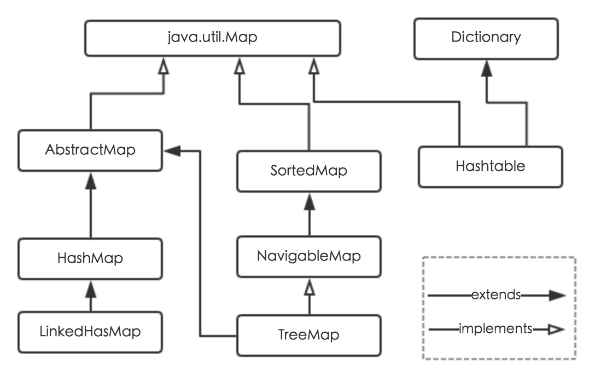
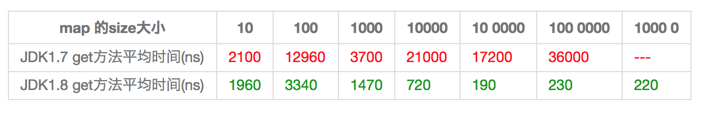

# HashMap详解

## 一、概述

Java为数据结构中的映射定义了一个接口java.util.Map，此接口主要有四个常用的实现类，HashMap，HashTable，LinkedHashMap和TreeMap



1. HashMap：它根据HashCode值存储数据，大多数情况下可以直接定位到它的值，因而有很快的访问速度，但是遍历顺序却是不确定的。HashMap最多只允许一条记录键为null，允许多条记录的值为null。HashMap非线程安全，即任意时刻可以有多个线程同时写入HashMap，可能会导致数据的不一致。如果需要满足线程安全，可以用Collections的synchronizedMap方法使HashMap具有线程安全的能力，或者使用ConcurrentHashMap
2. HashTable：HashTable是遗留类，现在已不推荐使用，很多映射的常用功能与HashMap类似，不同的是它继承自Dictionary类，并且线程安全，但是现在已经不建议使用了，推荐使用ConcurrentMap，HashTable是将整个对象设置同步锁，而ConcurrentMap是将每个桶用volatile关键字维护，这种方式被称为分段锁，这样效率就比HashTable高很多
3. LinkedHashMap：LinkedHashMap是HashMap的一个子类，保存了记录时的插入顺序，在用Iterator遍历LinkedHashMap时，先得到的记录肯定是先插入的，也可以在构造时带参数，按照访问次序排序
4. TreeMap：TreeMap实现SortedMap接口，能够把它保存的记录根据键排序，默认是按键值的升序排序，也可以指定排序的比较器，当用Iterator遍历TreeMap时，得到的记录是排过序的，如果使用排序的映射，建议使用TreeMap。在使用TreeMap时，Key必须实现Comparable接口或者在构造TreeMap传入自定义的Comparator，否则运行时抛出java.lang,ClassCastException类型的异常。

对于上述四种Map类型的类，要求映射中的key是不可变对象。不可变对象是该对象创建后哈希值不会被改变。如果对象的哈希值发生变化，Map对象很可能就定位不到映射的位置了

## 二、内部实现

### 2.1、存储结构-字段

从结构实现来讲，HashMap是数组+链表/红黑树实现的


从源码可知，HashMap类中有一个非常重要的字段，就是Node<K,V>[] table，即哈希桶数组，明显是一个Node类型的数组

```java
static class Node<K,V> implements Map.Entry<K,V> {
    final int hash;//用来定位数组索引位置
    final K key;
    V value;
    Node<K,V> next;//指向链表的下一个Node
    public final K getKey()        {...}
    public final V getValue()      {...}
    public final String toString() {...}
    public final int hashCode() {...}
    public final V setValue(V newValue) {...}
    public final boolean equals(Object o) {...}
}
```

Node是HashMap的一个内部类，实现了Map.Entry接口，本质就是映射(键值对)，上图中的每一个黑色圆点就是一个Node对象。

HashMap就是使用Hash表来存储的。哈希表为解决冲突，可以采用开放地址法和链地址法等来解决问题，Java中HashMap采用的是链地址法。链地址法，简单来说就是数组加链表的结合，在每个数组元素上都是一个链表结构，当数组被Hash后，得到数组下标，把数据放在对应下标元素的链表上，例如执行下面代码

```java
put("小明","9")
```

系统将调用"小明"这个key的hashCode()方法得到其hashCode值(该方法适用于每个Java对象)，然后再通过Hash算法的后两步运算(高位运算与取模运算)，来定位该键值对的存储位置，有时两个Key会定位到相同位置，表示发生了Hash碰撞，当然Hash算法计算结果越分散均匀，Hash碰撞的概率就越小，map存取效率就越高。

如果哈希桶数组较大，即使较差的Hash算法也会比较分散，如果哈希桶数组较小，即使好的Hash算法也会出现较多碰撞，所以就需要在时间成本和空间成本之间权衡，其实就是在根据实际情况确定哈希桶数组的大小，并且在此基础上设计好hash算法减少Hash碰撞。如果我们用好的Hash算法和扩容机制就能最大限度的权衡时间成本和空间成本。

从HashMap默认构造函数源码可知

```java
int threshold;             // 所能容纳的key-value对极限 
final float loadFactor;    // 负载因子
int modCount;  
int size;
```

首先Node[] table的初始化长度length(默认值为16)，loadFactor为负载因子(默认值0.75)，threshold是HashMap所能容纳最大数据量的Node个数，threshold = length * loadFactor。也就是说在数组定义好长度后，负载因子越大，所能容纳的Node个数越多。

结合负载因子的定义公式可知，threshold就是在此length和loadFactor对应下允许的最大元素数目，超过这个数目就重新resize(扩容)，扩容后的HashMap容量是之前容量的两倍。默认的负载因子0.75是对空间和时间效率的一个平衡选择，建议不要修改，除非在时间和空间比较特殊的情况下，如果内存空间很多又对时间效率要求很高，可以降低负载因子loadFactor的值，相反可以提高loadFactor的值，这个值可以大于1

size这个字段其实就是HashMap实际存在的Node数量。而modCount字段主要用来记录HashMap内部结构发生变化的次数，主要用于迭代的快速失败，一旦发现expectedModCount与modCount不一致则立即报错。注意，内部结构发生变化指的是结构发生变化(add、remove还有put一个新Key)，但是某个Key对应的value值被覆盖不属于结构变化

在HashMap中，哈希桶数组table长度length大小必须为2的n次方，这是一种非常规的设计，常规的设计是把数组长度设计为素数，这种设计是为了取模和扩容时做优化，同时为了减少冲突，HashMap定位哈希桶索引位置时，也加入了高位参与运算的过程

### 2.2、功能实现-方法

HashMap内部功能很多，这里主要从根据key获取哈希桶数组索引位置、put方法的详细执行、扩容过程三个具有代表性的点深入展开讲解

#### 2.2.1、确定哈希桶数组索引位置

不管增加、删除、查找键值对，定位到哈希桶数组的位置都是很关键的第一步。我们知道HashMap的数据结构是数组加链表的结合，所以我们当然希望这个HashMap中的元素位置尽量分布均匀些，尽量使得每一个位置上的元素数量都只有一个，那么当我们求得这个位置的时候，马上就可以知道对应位置上的元素是我们想要的，不用遍历链表，大大优化了查询效率。HashMap定位数组索引位置，直接决定了hash算法的离散性能，

```java
方法一：
static final int hash(Object key) {   //jdk1.8 & jdk1.7
     int h;
     // h = key.hashCode() 为第一步 取hashCode值
     // h ^ (h >>> 16)  为第二步 高位参与运算
     return (key == null) ? 0 : (h = key.hashCode()) ^ (h >>> 16);
}
方法二：
static int indexFor(int h, int length) {  //jdk1.7的源码，jdk1.8没有这个方法，但是实现原理一样的
     return h & (length-1);  //第三步 取模运算
}
```

这个算法叫做扰动函数，基本三个步骤：取Key的hashCode值、高位运算、取模运算

对于任意给定的对象，只要它的hashCode()返回值相同，那么程序调用方法一所计算得到的Hash码值总是相同的。我们首先想到的就是把hash值对数组长度取模运算，这样一来，元素的分布相对来说是比较均匀的。但是模运算的消耗还是比较大的，所以在HashMap中，调用方法二来计算该对象应该保存在table数组中的哪个索引处

这个方法非常巧妙，它通过h & (table.length - 1)来得到该对象的保存位，而HashMap底层数组长度总是2的n次方，这是HashMap在速度上的优化。当length总是2的n次方时，h & (lenght - 1)运算等价于length取模，也就是h % length，但是& 比 %更具有效率

在JDK1.8的实现中，优化了高位运算的算法，通过hashCode()的高16位异或低于16位实现的：(h = k.hashCode()) ^ (h >>> 16)，主要是从速度、功效、质量来考虑的，这么做是可以在数组table的length比较小的时候，也能保证考虑到高低Bit都参与到Hash的计算中，同时不会有太大开销。


#### 2.2.2、分析HashMap的put方法


1. 判断键值对数组table[i]是否是空或者为null，否则执行resize()进行扩容
2. 根据键值key计算hash值得到插入的索引i，如果table[i] == null，直接新建节点添加，转向⑥，如果table[i]不为空，转向③
3. 判断table[i]首个元素是否和key一样，如果相同直接覆盖velue，否则转向④，这里的相同指的是hashCode以及equals
4. 判断table[i]是否为treeNode，即table[i]是否是红黑树，如果是红黑树，则直接在树中插入键值对，否则转向⑤
5. 遍历table[i]，判断链表长度是否大于8，大于8的话把链表转换为红黑树(转红黑树方法还会判断table长度是否超过64，如果没有超过，则执行resize()扩容)，在红黑树中执行插入操作，否则进行链表的插入操作；遍历中若是发现key已经存在，直接覆盖value即可
6. 插入成功后，判断实际存在的键值对数量size是否超过了threshold，如果超过，进行扩容

JDK1.8HashMap的put方法

```java
public V put(K key, V value) {
     // 对key的hashCode()做hash
     return putVal(hash(key), key, value, false, true);
 }
 
 final V putVal(int hash, K key, V value, boolean onlyIfAbsent,
                boolean evict) {
     Node<K,V>[] tab; Node<K,V> p; int n, i;
     // 步骤①：tab为空则创建
     if ((tab = table) == null || (n = tab.length) == 0)
         n = (tab = resize()).length;
     // 步骤②：计算index，并对null做处理 
     if ((p = tab[i = (n - 1) & hash]) == null) 
         tab[i] = newNode(hash, key, value, null);
     else {
         Node<K,V> e; K k;
         // 步骤③：节点key存在，直接覆盖value
         if (p.hash == hash &&
             ((k = p.key) == key || (key != null && key.equals(k))))
             e = p;
         // 步骤④：判断该链为红黑树
         else if (p instanceof TreeNode)
             e = ((TreeNode<K,V>)p).putTreeVal(this, tab, hash, key, value);
         // 步骤⑤：该链为链表
         else {
             for (int binCount = 0; ; ++binCount) {
                 if ((e = p.next) == null) {
                     p.next = newNode(hash, key,value,null);
                      //链表长度大于8转换为红黑树进行处理
                     if (binCount >= TREEIFY_THRESHOLD - 1) // -1 for 1st  
                         treeifyBin(tab, hash);
                     break;
                 }
                  // key已经存在直接覆盖value
                 if (e.hash == hash &&
                     ((k = e.key) == key || (key != null && key.equals(k))))                                          break;
                 p = e;
             }
         }
         
         if (e != null) { // existing mapping for key
             V oldValue = e.value;
             if (!onlyIfAbsent || oldValue == null)
                 e.value = value;
             afterNodeAccess(e);
             return oldValue;
         }
     }

     ++modCount;
     // 步骤⑥：超过最大容量 就扩容
     if (++size > threshold)
         resize();
     afterNodeInsertion(evict);
     return null;
 }
```

#### 2.2.3、扩容机制

扩容(resize)就是重新计算容量，向HashMap对象里不停的添加元素，而HashMap对象数组无法装载更多元素时，对象就需要扩大数组的长度，以便能装入更多的元素。当然，java的数组是无法自动扩容的，方法就是新建一个比原来大两倍的数组代替已有的容量小的数组。

首先分析一下resize的源码，由于1.8版本加入了红黑树，较为复杂，为了便于理解，先使用JDK1.7版本，本质上区别不大

```java
void resize(int newCapacity) {//传入新容量
     Entry[] oldTable = table; //引入扩容前的Entry数组
     int oldCapacity = oldTable.length;         
     if (oldCapacity == MAXIMUM_CAPACITY) { //扩容前的数组大小如果已经达到最大(2^30)了
         threshold = Integer.MAX_VALUE; //修改阈值为int的最大值(2^31-1)，这样就不会扩容了
         return;
     }
     Entry[] newTable = new Entry[newCapacity]; //初始化一个新的Entry数组
     transfer(newTable);                        //将数据转移到新数组里
     table = newTable;                          //HashMap的table属性引用新的Entry数组
     threshold = (int)(newCapacity * loadFactor);//修改阈值
 }
```

这里就是使用一个容量更大的数组代替已有的容量小的数组，transfer()方法将原有Entry数组的元素拷贝到新的Entry数组里

```java
 void transfer(Entry[] newTable) {
     Entry[] src = table;                   //src引用旧的Entry数组
     int newCapacity = newTable.length;		//
     for (int j = 0; j < src.length; j++) { //遍历旧的Entry数组
         Entry<K,V> e = src[j];             //取得旧Entry数组的每个元素
         if (e != null) {
             src[j] = null;	//释放旧Entry数组的对象引用(for循环后，旧Entry数组不再引用任何对象)
             do {
                 Entry<K,V> next = e.next;
                 int i = indexFor(e.hash, newCapacity); //重新计算每个元素在数组中的位置
                 e.next = newTable[i]; //标记[i]
                 newTable[i] = e;      //将元素放在数组上
                 e = next;             //访问下一个Entry链上的元素
             } while (e != null);
         }
     }
 }
```

newTable[i]的引用赋给了e.next，也就是使用了单链表的头插法，同一位置上的新元素总会被放入链表的头部位置；这样先放在一个索引上的元素终会被放入Entry链表的尾部(如果hash冲突的话)，这一点和1.8有区别。在旧数组中同一条Entry链上的元素，通过重新计算索引位置后，有可能被放入到了新数组的不同位置上。

举个例子说明一下扩容过程。假设我们的算法就是简单的key mod一下表的大小(也就是数组的长度)。其中哈希桶数组的table的size=2，所以key = 3、7、5，put顺序依次为5、7、3，在mod 2以后都冲突在table[1]这里了。这里假设负载因子loadFactor = 1，即当键值对的实际大小size大于table的实际大小时进行扩容。接下来的三个步骤是哈希桶数组大小resize成4，然后所有的Node重新rehash的过程


再来看看JDK1.8做了哪些优化。经过观测可以发现，我们使用的是二次幂的扩展(长度扩为原来的两倍)，所有元素位置要么是在原位置，要么是在原位置再移动两次幂的位置。

如下图，n为table的长度，图( a )表示扩容前的key1和key2两种key确定索引的示例，图( b ) 表示扩容后key1和key2两种key扩容后索引位置的示例，其中hash1是key1对应的哈希值与高位运算的结果


元素在重新计算hash之后，因为n变为两倍，那么n-1的mask范围在高位多1bit，因此新的index就会发生这样的变化


因此，我们在扩充HashMap的时候，不需要像JDK1.7那样重新计算hash，只需要看原来的hash值新增的那个bit是1还是0就好了，是0的话索引不变，是1的话索引变成"原索引 + oldCap"


这样的设计节省了重新计算hash的时间，而且同时，由于新增的1bit是0还是1可以认为是随机的，因此resize过程，均匀的把之前的冲突的节点分散到新的bucket了。有一点注意区别，JDK1.7中rehash的时候，旧链表迁移新链表的时候，如果在新链表的数组索引位置相同，则链表元素会倒置，但是从上图可以看出，JDK1.8不会倒置。

```java
 final Node<K,V>[] resize() {
     Node<K,V>[] oldTab = table;
     int oldCap = (oldTab == null) ? 0 : oldTab.length;
     int oldThr = threshold;
     int newCap, newThr = 0;
     if (oldCap > 0) {
         // 超过最大值就不再扩充了，就只好随你碰撞去吧
         if (oldCap >= MAXIMUM_CAPACITY) {
             threshold = Integer.MAX_VALUE;
             return oldTab;
         }
         // 没超过最大值，就扩充为原来的2倍
         else if ((newCap = oldCap << 1) < MAXIMUM_CAPACITY &&
                  oldCap >= DEFAULT_INITIAL_CAPACITY)
             newThr = oldThr << 1; // double threshold
     }
     else if (oldThr > 0) // initial capacity was placed in threshold
         newCap = oldThr;
     else {               // zero initial threshold signifies using defaults
         newCap = DEFAULT_INITIAL_CAPACITY;
         newThr = (int)(DEFAULT_LOAD_FACTOR * DEFAULT_INITIAL_CAPACITY);
     }
     // 计算新的resize上限
     if (newThr == 0) {
 
         float ft = (float)newCap * loadFactor;
         newThr = (newCap < MAXIMUM_CAPACITY && ft < (float)MAXIMUM_CAPACITY ?
                   (int)ft : Integer.MAX_VALUE);
     }
     threshold = newThr;
     @SuppressWarnings({"rawtypes"，"unchecked"})
         Node<K,V>[] newTab = (Node<K,V>[])new Node[newCap];
     table = newTab;
     if (oldTab != null) {
         // 把每个bucket都移动到新的buckets中
         for (int j = 0; j < oldCap; ++j) {
             Node<K,V> e;
             if ((e = oldTab[j]) != null) {
                 oldTab[j] = null;
                 if (e.next == null)
                     newTab[e.hash & (newCap - 1)] = e;
                 else if (e instanceof TreeNode)
                     ((TreeNode<K,V>)e).split(this, newTab, j, oldCap);
                 else { // 链表优化重hash的代码块
                     Node<K,V> loHead = null, loTail = null;
                     Node<K,V> hiHead = null, hiTail = null;
                     Node<K,V> next;
                     do {
                         next = e.next;
                         // 原索引
                         if ((e.hash & oldCap) == 0) {
                             if (loTail == null)
                                 loHead = e;
                             else
                                 loTail.next = e;
                             loTail = e;
                         }
                         // 原索引+oldCap
                         else {
                             if (hiTail == null)
                                 hiHead = e;
                             else
                                 hiTail.next = e;
                             hiTail = e;
                         }
                     } while ((e = next) != null);
                     // 原索引放到bucket里
                     if (loTail != null) {
                         loTail.next = null;
                         newTab[j] = loHead;
                     }
                     // 原索引+oldCap放到bucket里
                     if (hiTail != null) {
                         hiTail.next = null;
                         newTab[j + oldCap] = hiHead;
                     }
                 }
             }
         }
     }
     return newTab;
 }
```

##  三、线性安全性

在多线程使用场景中，应该尽量避免使用线性不安全的HashMap，而使用线性安全的ConcurrentHashMap。下面举例讲解一下

```java
public class HashMapInfiniteLoop {  
    private static HashMap<Integer,String> map = new HashMap<Integer,String>(2，0.75f);  
    public static void main(String[] args) {  
        map.put(5， "C");  
        new Thread("Thread1") {  
            public void run() {  
                map.put(7, "B");  
                System.out.println(map);  
            };  
        }.start();  
        new Thread("Thread2") {  
            public void run() {  
                map.put(3, "A);  
                System.out.println(map);  
            };  
        }.start();        
    }  
}
```

其中，map初始化长度为2，负载因子为0.75，throshold = 2 * 0.75 = 1，也就是说当put第二个key的时候，map就需要进行扩容了

通过设置断点让线程1和线程2同时debug到transfer方法的首行，注意此时两个线程已经成功添加数据。放开thread1的断点至"next = e.next;"，然后放开thread2的断点，让线程2进行resize


注意，Thread1的e指向了key(3)，而next指向了key(7)，其在线程2rehash后，指向了线程2重建后的链表

线程1被调度回来执行，先是执行newTable[i] = e，然后执行e = next，导致了e指向了key(7)，而下一次循环的next = e.next导致了next指向了key(3)


e.next = newTable[i]导致key(3).next指向了key(7)。注意：此时key(7).next已经指向了key(3)，这样就形成了一个单向环形链表


于是当我们线程1调用map.get(11)时，就会进入死循环

## 四、JDK1.7与JDK1.8的HashMap性能对比

### 4.1、Hash分布较为均匀的情况下

由于JDK1.8中扩容之后不需要再重新计算hash值，所以略快于JDK1.7


通过观测测试结果可知，JDK1.8的性能要高于JDK1.7 15%以上，在某些size的区域上，甚至高于100%。由于Hash算法较均匀，JDK1.8引入的红黑树效果不明显，下面我们看看Hash不均匀的的情况。

### 4.2、Hash极不均匀的情况



这种情况下JDK1.8的红黑树就体现出了优势，HashMap会动态的将它替换成一个红黑树，这话的话会将时间复杂度从O(n)降为O(logn)。hash算法均匀和不均匀所花费的时间明显也不相同，这两种情况的相对比较，可以说明一个好的hash算法的重要性。

## 五、小结

1. 扩容是一个特别耗性能的操作，所以当程序员在使用HashMap的时候，估算map的大小，初始化的时候给一个大致的数值，避免map进行频繁的扩容。

2. 负载因子是可以修改的，也可以大于1，但是建议不要轻易修改，除非情况非常特殊。

3. HashMap是线程不安全的，不要在并发的环境中同时操作HashMap，建议使用ConcurrentHashMap。

4. JDK1.8引入红黑树大程度优化了HashMap的性能。

5. 还没升级JDK1.8的，现在开始升级吧。HashMap的性能提升仅仅是JDK1.8的冰山一角。


