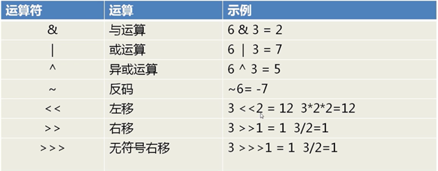

# Java二进制及运算

## 一、Java内置的进制转换

### 1.1、十进制转其他进制

```java
Integer.toBinaryString(16);//十进制转二进制
Integer.toOctalString(16);//十进制转八进制
Integer.toHexString(16);//十进制转十六进制
```

### 1.2、其他进制转十进制

```java
Integer.valueOf("1010",2);//二进制转十进制
Integer.valueOf("376",8);//八进制转十进制
Integer.valueOf("FFF",16);//十六进制转十进制
```

### 1.3、parseInt()和valueOf()的区别

```java
Integer.parseInt("1010",2);
Integer.parseInt("376",8);
Integer.parseInt("FFF",16);
```

parseInt返回类型是基本数据类型int，而valueOf返回类型则是Integer

## 二、基本的位运算

二进制可以和十进制一样加减乘除，但是它还有更简便的运算方式就是**位运算**。比如在计算机中Int类型的大小是32bit，可以用32位的2进制数来表示，所以我们可以用位运算来对int类型的数值进行计算，当然你也可以用平常的方法来计算一些数据

首先我们看看基本的运算符



优点：

- 特定情况下，计算方便，速度快，被支持面广
- 如果用算数方式，速度慢，逻辑复杂
- 位运算不限于一种语言，它是计算机的基本运算方法

### 2.1、按位与( & )

两位全为1，结果才为1

```
0 & 0 = 0; 
0 & 1 = 0; 
1 & 0 = 0; 
1 & 1 = 1;
```

例如：51 & 5 即：0011 0011 & 0000 0101 = 0000 0001 = 1

==特殊用法==：

1. 清零：如果想将一个单元清零，即将其全部二进制位为0，只要各个位与0相与，就可以得到0

   51 & 0 = 0011 0011 & 0000 0000 = 0000 0000 = 0

2. 取一个数指定位

   1010 1110 取低四位，只需要与0000 1111与运算即可，1010 1110 & 0000 1111 = 0000 1110

### 2.2、按位或( | )

只要有一个为1，结果就为1

````
0 | 0 = 0;
1 | 0 = 1;
0 | 1 = 1;
1 | 1 = 1;
````

例如：51 | 5 即：0011 0011 | 0000 0101 = 0011 0111 = 55

==特殊用法==

常用来将一个数的指定位数全部置为 1

1010 1110 将高位全部置为1 ，与1111 0000或运算即可，1010 1110 | 1111 0000 = 1111 1110

### 2.3、异或( ^ )

两个相应位为"异"(值不同)，则该位结果为1，否则为0

```
0 ^ 0 = 0;
1 ^ 0 = 1;
0 ^ 1 = 1;
1 ^ 1 = 0;
```

例如：51 ^ 5 即：0011 0011 ^ 0000 0101 = 0011 0111 = 54

==特殊用法==

1. 与1相异或，使特定位翻转

   1010 1110将低四位翻转，与0000 1111异或运算即可，1010 1110 ^ 0000 1111 = 1010 0001

2. 与0相异或，保持原位

   1010 1110 ^ 0000 0000 = 1010 1110

3. 两个变量交换值

   有三种方案

   1. 借助第三个变量实现C = A，A = B ， B = C，缺点：需要创建一个对象

   2. 利用加减法实现两个变量交换 A = A + B；B = A - B；A = A - B，缺点：内存消耗大

   3. 用位异或运算来实现效率最高

      A = A ^ B，B = A ^ B，A = A ^ B

      A = 1100 1010 与B = 1011 1110交换

      A = 1100 1010 ^ 1011 1110 = 0111 0100

      B = 0111 0100 ^ 1011 1110 = 1100 1010

      A = 0111 0100 ^ 1100 1010 = 1011 1110

### 2.4、取反与运算( ~ )

对一个二进制数按位取反，即0变1，1变0

~1 = 0，~0 = 1

### 2.5、左移( << )

将一个运算对象的各个二进制位全部左移若干位(左边的二进制位丢弃，右边补0)

例如：2 << 1 = 0010 << 1 = 0100 = 4

若左移时舍弃的高位不包含1，则每左移一位，相当于该数乘以2

例如：11 << 2 = 0000 1011 << 2 = 0010 1100 = 44

### 2.6、右移( >> )

将一个运算对象的各个二进制位全部右移若干位，正数左补0，负数左补1，右边丢弃。

若右移时高位不是1(即不是负数)，操作数每右移一位，相当于该数除以2

4 >> 2  = 0000 0100 >> 2 = 0000 0001 = 1

-14 >> 2 = 1111 0010 >> 2 = 1111 1100 = -4

### 2.7、无符号右移运算( >>> )

将一个运算对象的各个二进制位全部右移若干位，右移后不管正数负数左边空出的位数用零来填充，右边丢弃

例如： -14 >>> 2

1111 1111 1111 1111 1111 0010 >>> 2 = 0011 1111 1111 1111 1111 1111 1100 = 1073741820

可以看出负数右移之后会变成正数

## 三、原码、反码和补码

### 3.1、原码

一个整数按照绝对值大小转化成的二进制数称为原码

例如：0000 0000 0000 0000 0000 0000 0000 1110是14的源码

### 3.2、反码

将二进制数按位取反，所得到的的新二进制数称为原二进制数的反码

例如：将0000 0000 0000 0000 0000 0000 0000 1110每位取反

得到1111 1111 1111 1111 1111 1111 1111 0001

### 3.3、补码

反码加1称为补码

1111 1111 1111 1111 1111 1111 1111 0001 + 1 = 1111 1111 1111 1111 1111 1111 1111 0010

这就是14的补码 -14


