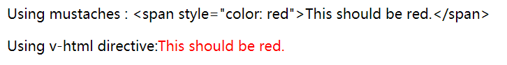

# Vue快速入门

[Vue官网](https://cn.vuejs.org/)

## 1、Vue是什么

### 1.1、MVVM架构

传统的MVC框架组成：

- M(Model)：模型层
- V(View)：视图层
- C(View Controller)：控制层

当新的请求到来时Model会通知View Controller，然后View Controller更新View，当用户操作View层后，View Controller再更新Model


MVVM框架组成：

- M(Model)：模型层
- V(View|View Controller)：控制视图层
- VM(View Model)：视图模型层

MVVM将原本MVC中的View Controller剥离一部分功能，由View Model对象来交互View Controller与Model间的数据

View Model对象可以双向绑定，既可以从VIew Controller中获取数据，也可以通过Model获取数据。

在前端页面中，把Model用纯JavaScript对象表示，View负责显示，两者做到了最大限度的分离。

把Model和View关联起来的就是ViewModel。ViewModel负责把Model的数据同步到View显示出来，还负责把View的修改同步回Model。


### 1.2、第一个Vue

1. 导入vue.js

```javascript
<!--开发版本-->
<script src="https://cdn.jsdelivr.net/npm/vue/dist/vue.js"></script>
<!--生产版本-->
<script src="https://cdn.jsdelivr.net/npm/vue@2.6.11"></script>
```

2. 创建Vue实例对象，设置el属性和data属性
3. 使用模板语法把数据渲染到页面

```html
<!DOCTYPE html>
<html lang="en">
<head>
    <meta charset="UTF-8">
    <title>vue基础</title>
</head>

<body>
    <div id="app">
        {{message}}
    </div>
    <script src="https://cdn.jsdelivr.net/npm/vue/dist/vue.js"></script>
    <script>
        var app = new Vue({
            el:"#app",
            data:{
                message:"Hello Vue!"
            }
        })
    </script>
</body>
</html>
```

Vue支持ECMAScript 5，由于IE8不支持ECMAScript 5

## 2、Vue基本语法

### 2.1、el挂载点

Vue会管理el选项的命中元素及其内部的后代元素。

不能使用html和body标签作为挂载点

el支持id、class 及 标签

1. id: #app
2. class: .appClass
3. 标签: div

尽量使用div为挂载点

```html
<!DOCTYPE html>
<html lang="en">
<head>
    <meta charset="UTF-8">
    <title>el挂载点</title>
</head>
<body>
    {{message}}
    <div id="app" class="appClass">
        {{message}}
        <span>{{message}}</span>
    </div>
    <script src="https://cdn.jsdelivr.net/npm/vue/dist/vue.js"></script>
    <script>
        var app = new Vue({
            el:".appClass",
            data:{
                message:"Hello Vue!"
            }
        })
    </script>
</body>
</html>
```

### 2.2、data数据对象

Vue数据写在data

```html
<!DOCTYPE html>
<html lang="en">
<head>
    <meta charset="UTF-8">
    <title>data数据对象</title>
</head>
<body>
<div id="app">
    {{message}}
    <h2>{{student.name}}{{student.phoneNum}}</h2>
    <ul>
        <li>{{family[0]}}</li>
        <li>{{family[1]}}</li>
        <li>{{family[2]}}</li>
    </ul>
</div>
<script src="https://cdn.jsdelivr.net/npm/vue/dist/vue.js"></script>
<script>
    var app = new Vue({
        el : '#app',
        data : {
            message : "data数据对象",
            student : {
                name : "苏茶",
                phoneNum : "13940124949"
            },
            family : ["苏州","苏泽","苏珊"]
        }
    })
</script>
</body>
</html>
```

## 3、模板语法

### 3.1、插值

#### 3.1.1、文本

数据绑定最常用的形式就是{{msg}}(双大括号)的文本插值

```Vue
<span>Message:{{msg}}</span>
```

v-once指令可以一次性地插值，当数据改变时，插值处不会更新，注意，这个操作同样会影响到该节点的其他数据绑定

```vue
<span v-once>这个将不会改变: {{ msg }}</span>
```

#### 3.1.2、原始HTML

v-html指令可以输出HTML页面

```vue
<div id="app">
    <p>Using mustaches : {{rawHtml}}</p>
    <p>Using v-html directive:<span v-html="rawHtml"></span></p>
</div>
<script>
    var app = new Vue({
        el:"#app",
        data:{
            rawHtml:"<span style=\"color: red\">This should be red.</span>"
        }
    })
</script>
```



注意：动态渲染Html可能会遭遇XSS攻击，绝对不要对用户提供的内容使用插值

#### 3.1.3、标签属性(Attribute)

如果想要修改标签属性，可以使用v-bind指令

```vue
<!--动态修改id-->
<div v-bind:id="dynamicId"></div>
```

```vue
<!--修改可见属性-->
<div id="app" v-once>
    <button v-bind:disabled="isButtonDisabled">Button</button>
</div>
<script>
var app = new Vue({
        el:"#app",
        data:{
            isButtonDisabled:"disable"
        }
    })
</script>
```

如果isButtonDisabled的值是null、undefined 或 false，则 disabled attribute 甚至不会被包含在渲染出来的 \<button>`元素中。

#### 3.1.4、使用javaScript表达式

vue支持完全的javaScript表达式

```vue
{{ number + 1 }}
{{ ok ? 'YES' : 'NO' }}
{{ message.split('').reverse().join('') }}
<div v-bind:id="'list-' + id"></div>
```

注意：每个绑定都只能包含**单个表达式**，所以下面的例子不会生效

```vue
<!-- 这是语句，不是表达式 -->
{{ var a = 1 }}
<!-- 流控制也不会生效，请使用三元表达式 -->
{{ if (ok) { return message } }}
```

模板表达式都被放入沙盒中，只能访问全局变量的一个白名单，如Mat 和 Date。无法在模板表达式中试图访问用户定义的全局变量。

具体来说就是只能在模板表达式中调用以下全局变量，如果想要添加自定义的全局变量，可以把变量放入白名单当中，不过不建议这样做Math,Number,Date,Array,Object,Boolean,String,RegExp,Map,Set,JSON,Intl

### 3.2、指令

指令是带有v-前缀的特殊属性，预期是单个JavaScript表达式(v-for除外)

#### 3.2.1、参数

前面提到的v-bind指令可以接收一个“参数”，在指令名称之后以冒号表示

```vue
<a v-bind:href="url">...</a>
```

v-on指令，它用于监听 DOM 事件

```vue
<a v-on:click="doSomething">...</a>
```

#### 3.2.2、==动态参数==

从 2.6.0 开始，可以用方括号括起来的 JavaScript 表达式作为一个指令的参数：

#### 3.2.3、修饰符

修饰符是以半角句话`.`指明的特殊后缀，用与指出一个指令以特殊方式绑定

```vue
<div id="app">
    <div @click="click1">
        <div @click.stop="click2">
            click me2
        </div>
    </div>
</div>
<script type="text/javascript">
    var vm = new Vue({
        el : "#app",
        methods:{
            click1 : function () {
                console.log('click1......');
            },
            click2 : function () {
                console.log('click2......');
            }
        }
    });
</script>
```

其中@为v-on缩写，修饰符.stop- 调用 event.stopPropagation()。

### 3.3、缩写

#### 3.3.1、v-bind缩写

v-bind指令可以直接省略

```vue
<!-- 完整语法 -->
<a v-bind:href="url">...</a>

<!-- 缩写 -->
<a :href="url">...</a>

<!-- 动态参数的缩写 (2.6.0+) -->
<a :[key]="url"> ... </a>
```

#### 3.3.2、v-on缩写

v-on缩写为@符号

```vue
<!-- 完整语法 -->
<a v-on:click="doSomething">...</a>

<!-- 缩写 -->
<a @click="doSomething">...</a>

<!-- 动态参数的缩写 (2.6.0+) -->
<a @[event]="doSomething"> ... </a>
```

## 4、计算属性与监听器

### 4.1、计算属性

模板内的表达式只应做简单运算，复杂的运算应放入**计算属性**中

#### 4.1.1、基础例子

```vue
<div id="example">
    <p>Original message: {{message}}</p>
    <p>Compute reversed message : {{reversedMessage}}</p>
</div>
<script type="text/javascript">
    var app = new Vue({
        el : '#example',
        data : {
            message : 'Hello'
        },
        computed : {
            reversedMessage : function () {
                return this.message.split('').reverse().join('');
            }
        }
    })
</script>
```

这里声明了一个计算属性reversedMessage，reversedMessage的值始终取决于message中的值

#### 4.1.2、计算属性缓存vs方法

计算属性与方法都可以达到同样的目的，不同的是计算属性是基于它们的**响应式依赖进行缓存**的。如上面的例子，如果message值不发生改变，多次访问reversedMessage会直接返回结果而不经过函数计算。

而方法则是总会**再次**执行函数

#### 4.1.3、计算属性vs监听属性

#### 4.1.4、计算属性的setter

计算属性默认只有 getter，不过在需要时你也可以提供一个 setter：

```javascript
<div id="example">
    <p>{{firstName}}</p>
    <p>{{lastName}}</p>
    <p>{{fullName}}</p>
</div>
<script type="text/javascript">
    var app = new Vue({
        el : '#example',
        data : {
            firstName : 'William',
            lastName : 'Wang'
        },
        computed: {
            fullName: {
                // getter
                get: function () {
                    return this.firstName + ' ' + this.lastName
                },
                // setter
                set: function (newValue) {
                    var names = newValue.split(' ')
                    this.firstName = names[0]
                    this.lastName = names[names.length - 1]
                }
            }
        }
    })
</script>
```

现在再运行 vm.fullName = 'John Doe' 时，setter 会被调用，vm.firstName 和vm.lastName`也会相应地被更新。

### 4.2、监听器

Vue通过Watch选项，来响应数据变化。当需要在数据变化时执行异步或开销较大的操作时，这个方法是最有用的

```vue
<div id="watch-example">
    <input v-model="question">
    <p>get a random number : {{ randomNum }}</p>
</div>
<script>
    var watchApp = new Vue({
        el: '#watch-example',
        data : {
            question : '',
            randomNum : 0
        },
        watch: {
            question : function (newVal) {
                Number(newVal);
                this.randomNum =  newVal + Math.random();// + Math.random();
            }
        }
    });
</script>
```

## 5、Class与Style绑定

### 5.1、绑定HTML Class

#### 5.1.1、对象语法

我们可以传给v-bind:class一个对象，以动态地切换class

```vue
<div id="app">
    <div :class="{active : isActive}"
            style="width:200px; height:200px; text-align:center; line-height:200px;">
        hi vue
    </div>
</div>
<script type="text/javascript">
var app = new Vue({
    el : '#app',
    data : {
        isActive : true
    }
});
</script>
<style>
    .active{background:#FF0000;}
</style>
```

v-bind:class也可以与普通的class属性共存

```vue
<div class="test" :class="{active : isActive}"
     style="width:200px; height:200px; text-align:center; line-height:200px;">
    hi vue
</div>
```

多个class属性插入

```vue
<body>
<div id="app">
    <div :class="{active : isActive,green : isGreen}"
            style="width:200px; height:200px; text-align:center; line-height:200px;">
        hi vue
    </div>
</div>
<script type="text/javascript">
var app = new Vue({
    el : '#app',
    data : {
        isActive : true,
        isGreen : true
    }
});
</script>
<style>
    .active{background:#FF0000;}
    .green{color: green}
</style>
```

#### 5.1.2、数组语法

我们可以把一个数组传给v-bind

```vue
<div :class="['active','green']"
     style="width:200px; height:200px; text-align:center; line-height:200px;">
    hi vue
</div>
```
如果想根据条件切换列表中的class，可以使用三元表达式

```vue
<div :class="[isActive ? 'active' :'' , isGreen ? 'green' : '']"
     style="width:200px; height:200px; text-align:center; line-height:200px;">
    hi vue
</div>
```

#### 5.1.3、==用在组件上==

### 5.2、绑定内联样式

#### 5.2.1、对象语法

v-bind:style的对象语法十分直观--很像一个CSS，但其实是一个JavaScript对象，CSS property 名可以用驼峰式 (camelCase) 或短横线分隔 (kebab-case，记得用引号括起来) 来命名

```vue
<div id="app">
    <div
            :style="{color:color, fontSize:size, background: isRed ? '#FF0000' : ''}">
        hi vue
    </div>
</div>
<script type="text/javascript">
var app = new Vue({
    el : '#app',
    data : {
        color : '#000000',
        size : '20px',
        isRed : true
    }
});
</script>
```

最好能直接绑定一个样式中，这样更为直观

```vue
<div v-bind:style="styleObject"></div>
<script type="text/javascript">
var app = new Vue({
    el : '#app',
    data: {
      styleObject: {
        color: 'red',
        fontSize: '13px'
      }
    }
</script>
```

#### 5.2.2、数组语法

v-bind:style的数组语法可以将多个样式对象应用到同一个元素上：

```vue
<div v-bind:style="[baseStyles, overridingStyles]"></div>
```

#### 5.2.3、自动添加前缀

当 v-bind:style使用需要添加浏览器引擎前缀dor_Prefix)的 CSS property 时，如transform，Vue.js 会自动侦测并添加相应的前缀。

#### 5.2.4、多重值

从 2.3.0 起你可以为 style 绑定中的 property 提供一个包含多个值的数组，常用于提供多个带前缀的值，例如：

```
<div :style="{ display: ['-webkit-box', '-ms-flexbox', 'flex'] }"></div>
```

这样写只会渲染数组中最后一个被浏览器支持的值。在本例中，如果浏览器支持不带浏览器前缀的 flexbox，那么就只会渲染 display: flex。

## 6、条件渲染

### 6.1、v-if

#### 6.1.1、在 \<template> 元素上使用 v-if 条件渲染分组

\<template>是一个模板元素

v-if可以用于把一个\<template>元素当做不可见的包裹元素，最终的渲染结果将不包含\<template>元素

```vue
<template v-if="ok">
  <h1>Title</h1>
  <p>Paragraph 1</p>
  <p>Paragraph 2</p>
</template>
```

### 6.2、v-else

可以通过条件判断v-if、v-else渲染页面，如下awesome为true显示Vue is awesome!，false则显示Oh no

```vue
<div id="app">
    <h2 v-if="awesome">Vue is awesome!</h2>
    <h2 v-else>Oh no</h2>
</div>
<script>
    var app = new Vue({
        el:'#app',
        data : {
            'awesome' : true
        }
    })
</script>
```

v-else必须紧跟在带有v-if或v-else-if的元素后面，否则无法识别

### 6.3、v-else-if

可以通过使用v-else-if多个条件来渲染页面，类似地需要紧跟在带有v-if的元素后面

```vue
<div id="app">
    <h2 v-if="type === 1">A</h2>
    <h2 v-else-if="type === 2">B</h2>
    <h2 v-else>C</h2>
</div>
<script>
    var app = new Vue({
        el:'#app',
        data : {
            'type' : 1
        }
    })
</script>
```

判断对象类型必须相同否则会产生异常

### 6.4、v-show

v-show只是简单的切换元素的CSS display属性

```vue
<h1 v-show="ok">Hello!</h1>
```

注意，v-show不支持\<template> 元素，也不支持 v-else。

#### 6.4.1、v-show vs v-if

- v-if是真正的条件渲染
- v-if是惰性的：如果在初始渲染时条件为false，则什么都不做。直到条件为true，才开始渲染
- v-show只是简单的控制css的display属性
- 相比之下v-show切换开销小，而v-if的渲染开销小

#### 6.4.2、v-if 与 v-for 一起使用

==不要同时使用 v-if 和 v-for。==

 当 v-if 与 v-for 一起使用时，v-for 具有比 v-if 更高的优先级。


### 6.5、用key管理可复用元素

vue可以复用已有元素而不是从头开始渲染

```vue
<template v-if="loginType === 'username'">
  <label>Username</label>
  <input placeholder="Enter your username">
</template>
<template v-else>
  <label>Email</label>
  <input placeholder="Enter your email address">
</template>
```

当你切换loginType时，将不会清除用户已经输入的内容，因为两个模板使用了相同的元素，\<input>仅仅是替换了placeholder

当我们希望两个input标签互相独立，就可以使用key属性将二者区分开来

```vue
<template v-if="loginType === 'username'">
  <label>Username</label>
  <input placeholder="Enter your username" key="username-input">
</template>
<template v-else>
  <label>Email</label>
  <input placeholder="Enter your email address" key="email-input">
</template>
```

这样每次切换，输入框都会被重新渲染

## 7、列表渲染

### 7.1、用v-for把一个数组对应为一组元素

我们可以用 v-for 指令基于一个数组来渲染一个列表。v-for 指令需要使用 item in items 形式的特殊语法，其中 items 是源数据数组，而 item 则是被迭代的数组元素的别名。

```vue
<ul id="example-1">
    <li v-for="item in items" :key="item.message">
        {{item.message}}
    </li>
</ul>
<script type="text/javascript">
    var app = new Vue({
        el : '#example-1',
        data : {
            items : [
                {message : 'Foo'},
                {message : 'Bar'}
            ]
        }
    })
</script>
```

v-for还支持一个可选的第二参数，即当前项的索引

```vue
<ul id="example-1">
    <li v-for="(item,index) in items" :key="item.message">
        {{parentMessage}} - {{index}} - {{item.message}}
    </li>
</ul>
<script type="text/javascript">
    var app = new Vue({
        el : '#example-1',
        data : {
            parentMessage : 'parent',
            items : [
                {message : 'Foo'},
                {message : 'Bar'}
            ]
        }
    })
</script>
```

### 7.2、在for里使用对象

你也可以用v-for 来遍历一个对象的 property。

```vue
<ul id="v-for-object">
    <li v-for="value in object">
        {{value}}
    </li>
</ul>

<script type="text/javascript">
    var app = new Vue({
        el : '#v-for-object',
        data : {
            object : {
                title : 'How to do list in Vue',
                author : 'Jane Doe',
                publishedAt : '2020-01-01'
            }
        }
    })
</script>
```

你也可以提供第二个的参数为 property 名称 (也就是键名)：

```vue
<ul id="v-for-object">
    <li v-for="(value, key) in object">
        {{key}} - {{value}}
    </li>
</ul>
```

还可以用第三个参数作为索引：

```vue
<ul id="v-for-object">
    <li v-for="(value, key , index) in object">
        {{index}} - {{key}} - {{value}}
    </li>
</ul>
```

在遍历对象时，会按 Object.keys() 的结果遍历，但是不能保证它的结果在不同的 JavaScript 引擎下都一致。

### 7.3、维护状态

当 Vue 正在更新使用 v-for 渲染的元素列表时，它默认使用“就地更新”的策略。如果数据项的顺序被改变，Vue 将不会移动 DOM 元素来匹配数据项的顺序，而是就地更新每个元素，并且确保它们在每个索引位置正确渲染。

可以使用key属性，让Vue跟踪每一个节点的身份，从而重用和重新排序现有元素

```vue
<ul id="v-for-object">
    <li v-for="(value,key,index) in object" :key="key">
        {{index}} - {{value}}
    </li>
</ul>
<script type="text/javascript">
    var app = new Vue({
        el : '#v-for-object',
        data : {
            object : {
                author : 'Jane Doe',
                publishedAt : '2020-01-01',
                title : 'How to do list in Vue',
            }
        }
    })
</script>
```

建议只要用v-for都提供key属性

注意：不要使用对象或数组之类的非基本类型值作为 v-for 的 key。请用字符串或数值类型的值。

### 7.4、数组更新检测

#### 7.4.1、变更方法

Vue 将被侦听的数组的变更方法进行了包裹，所以它们也将会触发视图更新。这些被包裹过的方法包括：

- push()
- pop()
- shift()
- unshift()
- splice()
- sort()
- reverse()

#### 7.4.2、替换数组

替换数组方法，它们不会变更数据，而总返回一个新数组：

- filter()
- concat()
- slice()

这些方法并没有从新渲染整个列表

### 7.5、显示过滤/排序后的结果

当我们只想要显示过滤或排序后的结果，但并不变更原始数据。我们可以创建一个计算属性，用于显示过滤/排序后的结果

```vue
<div id="app">
    <ul>
        <li v-for="n in evenNumber">{{n}}</li>
    </ul>
</div>
<script type="text/javascript">
    var app = new Vue({
        el : '#app',
        data : {
            numbers : [1,2,3,4,5,6]
        },
        computed: {
            evenNumber : function () {
                return this.numbers.filter(function (number) {
                    return number % 2 === 0;
                })
            }
        }
    })
</script>
```

在计算属性不适用的情况下 (例如，在嵌套 v-for 循环中) 你可以使用一个方法：

```vue
<div id="app">
    <ul v-for="set in sets">
        <li v-for="n in even(set)">{{n}}</li>
    </ul>
</div>
<script type="text/javascript">
    var app = new Vue({
        el : '#app',
        data : {
            sets : [[1,2,3,4,5],[6,7,8,9,10]]
        },
        methods : {
            even : function (numbers) {
                return numbers.filter(function (number) {
                    return number % 2 === 0;
                })
            }
        }
    })
</script>
```

### 7.6、在v-for里使用值范围

v-for可以接受整数。为重复模板次数

```vue
<div>
  <span v-for="n in 10">{{ n }} </span>
</div>
```

### 7.7、在\<template>上使用v-for

v-for用于\<template>来循环渲染一段包含多个元素的内容

```vue
<div id="app">
    <ul>
        <template v-for="item in items">
            <li>{{item.msg}}</li>
            <li class="divider" role="presentation"></li>
        </template>
    </ul>
</div>
<script type="text/javascript">
    var app = new Vue({
        el : '#app',
        data : {
            items : [
                {msg : '123'},
                {msg : '123'},
            ]
        }
    })
</script>
```

### 7.8、==在组件上使用 v-for==

## 8、事件处理

### 8.1、监听事件

v-on指令可以监听DOM事件，并在触发时运行一些JavaScript代码

```vue
<div id="example-1">
    <button v-on:click="counter += 1">Add 1</button>
    <p>The button above has been checked {{counter}} times</p>
</div>
<script type="text/javascript">
    var app = new Vue({
        el : '#example-1',
        data : {
            counter : 0
        }
    })
</script>
```

### 8.2、事件处理方法

大多数情况下，我们不会将JavaScript直接写在v-on指令中，一般会接收一个需要调用的方法名

```vue
<div id="example-2">
    <button v-on:click="greet">Greet</button>
</div>
<script type="text/javascript">
    var app = new Vue({
        el : '#example-2',
        data : {
            name : 'Vue.js'
        },
        methods: {
            greet : function (event) {
                alert('Hello' + this.name);
                if(event){
                    alert(event.target.tagName)
                }
            }
        }
    })    
// 也可以用 JavaScript 直接调用方法
app.greet(); // => 'Hello Vue.js!'
</script>
```

### 8.3、内联处理器中的方法

除了直接绑定到一个方法，也可以在内联JavaScript语句中调用方法

```vue
<div id="example-3">
    <button v-on:click="say('hi')">Say hi</button>
    <button v-on:click="say('what')">Say what</button>
</div>
<script type="text/javascript">
    var app = new Vue({
        el : '#example-3',
        methods : {
            say : function (message) {
                alert(message)
            }
        }
    })
</script>
```

在内联语句处理器中访问原始DOM事件，可以用特殊变量$event把它传入方法

```vue
<div id="example-3">
    <button v-on:click="warn('From can not submit yet.',$event)">Submit</button>
</div>
<script type="text/javascript">
    var app = new Vue({
        el : '#example-3',
        methods : {
            warn : function (message , event) {
                if (event){
                    event.preventDefault()
                }
                alert(message)
            }
        }
    })
</script>
```

### 8.4、事件修饰符

- .stop - 阻止单击事件继续传播，可以阻止冒泡事件，调用 event.stopPropagation()。
- .prevent - 阻止链接跳转，如可使a标签点击不跳转，调用 event.preventDefault()。
- .capture - 添加事件侦听器时使用 capture 模式，以冒泡事件为例，默认为从内到外响应，被capture标注的事件，优先级更高，如果所有冒泡事件都被标注capture，则会变成从外到内响应。
- .self - 只当事件是从侦听器绑定的元素本身触发时才触发回调。
- .once - 只触发一次回调。
- .passive - (2.3.0) 以 { passive: true } 模式添加侦听器

```vue
<!-- 阻止单击事件继续传播 -->
<a v-on:click.stop="doThis"></a>

<!-- 提交事件不再重载页面 -->
<form v-on:submit.prevent="onSubmit"></form>

<!-- 修饰符可以串联 -->
<a v-on:click.stop.prevent="doThat"></a>

<!-- 只有修饰符 -->
<form v-on:submit.prevent></form>

<!-- 添加事件监听器时使用事件捕获模式 -->
<!-- 即内部元素触发的事件先在此处理，然后才交由内部元素进行处理 -->
<div v-on:click.capture="doThis">...</div>

<!-- 只当在 event.target 是当前元素自身时触发处理函数 -->
<!-- 即事件不是从内部元素触发的 -->
<div v-on:click.self="doThat">...</div>
```

使用修饰符时，顺序很重要；相应的代码会以同样的顺序产生。因此，用 v-on:click.prevent.self 会阻止所有的点击，而 v-on:click.self.prevent 只会阻止对元素自身的点击。

不要把 .passive 和 .prevent 一起使用，因为 .prevent 将会被忽略，同时浏览器可能会向你展示一个警告。请记住，.passive 会告诉浏览器你不想阻止事件的默认行为。

### 8.5、按键修饰符

Vue 允许为 v-on 在监听键盘事件时添加按键修饰符：

````vue
<div id="app">
    <!-- 只有在 `key` 是 `Enter` 时调用 `vm.submit()` -->
    <input @:keyup.enter="submit">
</div>
<script type="text/javascript">
    var app = new Vue({
        el : '#app',
        methods : {
            submit : function () {
                alert('出来吧')
            }
        }
    })
</script>
````

你可以直接将 KeyboardEvent.key 暴露的任意有效按键名转换为 kebab-case 来作为修饰符。

```vue
<input v-on:keyup.page-down="onPageDown">
```

- .enter
- .tab
- .delete (捕获“删除”和“退格”键)
- .esc
- .space
- .up
- .down
- .left
- .right

### 8.6、系统修饰符

可以用如下修饰符来实现仅在按下相应按键时才触发鼠标或键盘事件的监听器。

- .ctrl
- .alt
- .shift
- .meta 

注意：在 Mac 系统键盘上，meta 对应 command 键 (⌘)。在 Windows 系统键盘 meta 对应 Windows 徽标键 (⊞)。在 Sun 操作系统键盘上，meta 对应实心宝石键 (◆)。在其他特定键盘上，尤其在 MIT 和 Lisp 机器的键盘、以及其后继产品，比如 Knight 键盘、space-cadet 键盘，meta 被标记为“META”。在 Symbolics 键盘上，meta 被标记为“META”或者“Meta”。

请注意修饰键与常规按键不同，在和 keyup 事件一起用时，事件触发时修饰键必须处于按下状态。换句话说，只有在按住 ctrl 的情况下释放其它按键，才能触发 keyup.ctrl。而单单释放 ctrl 也不会触发事件。如果你想要这样的行为，请为 ctrl 换用 keyCode：keyup.17。

#### 8.6.1、.exact修饰符

.exact修饰符允许你控制由精确的系统修饰符组合触发的事件

```vue
<!-- 即使 Alt 或 Shift 被一同按下时也会触发 -->
<button v-on:click.ctrl="onClick">A</button>

<!-- 有且只有 Ctrl 被按下的时候才触发 -->
<button v-on:click.ctrl.exact="onCtrlClick">A</button>

<!-- 没有任何系统修饰符被按下的时候才触发 -->
<button v-on:click.exact="onClick">A</button>
```

#### 8.6.2、鼠标按钮修饰符

- .left
- .right
- .middle

这些修饰符会限制处理函数仅响应特定的鼠标按钮。

## 9、表单输入绑定

### 9.1、基础用法

你可以用 v-model 指令在表单 \<input>、\<textarea> 及 \<select> 元素上创建双向数据绑定。它会根据控件类型自动选取正确的方法来更新元素。v-model负责监听用户的输入事件以更新数据，并对一些极端场景进行一些特殊处理。

注意：v-model 会忽略所有表单元素的 value、checked、selected attribute 的初始值而总是将 Vue 实例的数据作为数据来源。你应该通过 JavaScript 在组件的 data 选项中声明初始值。

v-model 在内部为不同的输入元素使用不同的 property 并抛出不同的事件：

- text 和 textarea 元素使用 value property 和 input 事件；
- checkbox 和 radio 使用 checked property 和 change 事件；
- select 字段将 value 作为 prop 并将 change 作为事件。

#### 9.1.1、文本

```vue
<div id="app">
    <input v-model="message" placeholder="edit me">
    <p>Message is :{{message}}</p>
</div>
<script type="text/javascript">
    var app = new Vue({
        el : '#app',
        data : {
            message : ''
        }
    })
</script>
```

#### 9.1.2、多行文本

```vue
<div id="app">
    <span>Multiline message is:</span>
    <p style="white-space: pre-line">{{message}}</p>
    <br>
    <textarea v-model="message" placeholder="add multiple lines"></textarea>
</div>
<script type="text/javascript">
    var app = new Vue({
        el : '#app',
        data : {
            message : ''
        }
    })
</script>
```

在文本区域插值 (\<textarea>{{text}}\</textarea>) 并不会生效，应用 v-model 来代替。

#### 9.1.3、复选框

单个复选框，绑定到布尔值

```vue
<div id="app">
    <input type="checkbox" id="checkbox" v-model="checked">
    <label for="checkbox">{{checked}}</label>
</div>
<script type="text/javascript">
    var app = new Vue({
        el : '#app',
        data : {
            checked : true
        }
    })
</script>
```

多个复选框绑定到同一个数组

```vue
<div id="app">
    <input type="checkbox" id="jack" value="Jack" v-model="checkedName">
    <label for="jack">Jack</label>
    <input type="checkbox" id="john" value="John" v-model="checkedName">
    <label for="john">John</label>
    <input type="checkbox" id="mike" value="Mike" v-model="checkedName">
    <label for="mike">Mike</label>
    <br>
    <span>Checked name: {{checkedName}}</span>
</div>
<script type="text/javascript">
    var app = new Vue({
        el : '#app',
        data : {
            checkedName : []
        }
    })
</script>
```

#### 9.1.4、单选按钮

```vue
<div id="app">
    <input type="radio" id="one" value="One" v-model="picked">
    <label for="one">One</label>
    <input type="radio" id="two" value="Two" v-model="picked">
    <label for="two">Two</label>
    <br>
    <span>Picked:{{picked}}</span>
</div>

<script type="text/javascript">
    var app = new Vue({
        el : '#app',
        data : {
            picked : ''
        }
    })
</script>
```

#### 9.1.5、选择框

```vue
<div id="app">
    <select v-model="selected">
        <option disabled value="">请选择</option>
        <option>A</option>
        <option>B</option>
        <option>C</option>
    </select>
    <span>Selected: {{selected}}</span>
</div>
<script type="text/javascript">
    var app = new Vue({
        el : '#app',
        data : {
            selected : ''
        }
    })
</script>
```

注意：如果 v-model 表达式的初始值未能匹配任何选项，\<select> 元素将被渲染为“未选中”状态。在 iOS 中，这会使用户无法选择第一个选项。因为这样的情况下，iOS 不会触发 change 事件。因此，更推荐像上面这样提供一个值为空的禁用选项。

多选时(绑定到一个数组)

```vue
<div id="app">
    <select v-model="selected" multiple style="width: 50px">
        <option>A</option>
        <option>B</option>
        <option>C</option>
    </select>
    <span>Selected: {{selected}}</span>
</div>
<script type="text/javascript">
    var app = new Vue({
        el : '#app',
        data : {
            selected : []
        }
    })
</script>
```

用v-for渲染的动态选项

```vue
<div id="app">
    <select v-model="selected">
        <option v-for="option in options" :value="option.value">{{option.text}}</option>
    </select>
    <br>
    <span>Selected: {{selected}}</span>
</div>
<script type="text/javascript">
    var app = new Vue({
        el : '#app',
        data : {
            selected : 'A',
            options : [
                {text : 'One', value : 'A'},
                {text : 'Two', value : 'B'},
                {text : 'Three', value : 'C'},
            ]
        }
    })
</script>
```

### 9.2、值绑定

对于单选按钮，复选框及选择框的选项，v-model 绑定的值通常是静态字符串 (对于复选框也可以是布尔值)：

```vue
<!-- 当选中时，`picked` 为字符串 "a" -->
<input type="radio" v-model="picked" value="a">

<!-- `toggle` 为 true 或 false -->
<input type="checkbox" v-model="toggle">

<!-- 当选中第一个选项时，`selected` 为字符串 "abc" -->
<select v-model="selected">
  <option value="abc">ABC</option>
</select>
```

但是有时我们可能想把值绑定到 Vue 实例的一个动态 property 上，这时可以用 v-bind 实现，并且这个 property 的值可以不是字符串。

#### 9.2.1、复选框

```vue
<div id="app">
    <input type="checkbox" v-model="toggle" true-value="yes" false-value="no">
    <p>{{toggle}}</p>
</div>
<script type="text/javascript">
    var app = new Vue({
        el : '#app',
        data : {
            toggle : ''
        }
    })
</script>
```

这里的 true-value 和 false-value attribute 并不会影响输入控件的 value attribute，因为浏览器在提交表单时并不会包含未被选中的复选框。如果要确保表单中这两个值中的一个能够被提交，(即“yes”或“no”)，请换用单选按钮。

#### 9.2.2、单选按钮

```vue
<div id="app">
    <input type="radio" v-model="pick" :value="a">
    <p>{{pick}}</p>
</div>
<script type="text/javascript">
    var app = new Vue({
        el : '#app',
        data : {
            pick : '',
            a : '我得到你了'
        }
    })
</script>
```

#### 9.2.3、选择框的选项

```vue
<div id="app">
    <select v-model="selected">
        <option :value="{number : 123}">123</option>
    </select>
    <p>{{selected.number}}</p>
</div>
<script type="text/javascript">
    var app = new Vue({
        el : '#app',
        data : {
            selected : {
                number : 0
            }
        }
    })
</script>
```

### 9.3、修饰符

#### 9.3.1、.lazy

在默认情况下，v-model 在每次 input 事件触发后将输入框的值与数据进行同步 (除了上述输入法组合文字时)。你可以添加 lazy 修饰符，从而转为在 change 事件_之后_进行同步：

```vue
<input v-model="message" placeholder="edit me">
```

change是在失去焦点时触发，而input则是实时的

#### 9.3.2、.number

如果想自动将用户的输入值转为数值类型，可以给 v-model 添加 number 修饰符：

```vue
<input v-model.number="age" type="number">
```

这通常很有用，因为即使在 type="number" 时，HTML 输入元素的值也总会返回字符串。如果这个值无法被 parseFloat() 解析，则会返回原始的值。

#### 9.3.3、.trim

如果要自动过滤用户输入的首尾空白字符，可以给 v-model 添加 trim 修饰符：

```vue
<input v-model.trim="msg">
```

### 9.4、在组件上使用 v-model

## 10、组件基础

### 10.1、基本示例

组件是可复用的 Vue 实例，且带有一个名字：在这个例子中是 \<button-counter>。我们可以在一个通过 new Vue创建的 Vue 根实例中，把这个组件作为自定义元素来使用：

```vue
<div id="app">
    <button-counter></button-counter>
</div>
<script>
    Vue.component('button-counter',{
        data : function () {
            return {
                count : 0
            }
        },
        template : '<button v-on:click="count++">You clicked me {{count}} times</button>'
    })
    var app = new Vue({
        el : '#app'
    })
</script>
```

因为组件是可复用的Vue实例，所以它们与Vue接收相同的选项，例如data、computed、watch、methods以及生命周期钩子等。仅有的例外是像el根实例特有的选项

### 10.2、组件的复用

你可以将组件进行任意次数的复用：

```vue
<div id="components-demo">
  <button-counter></button-counter>
  <button-counter></button-counter>
  <button-counter></button-counter>
</div>
```

注意当点击按钮时，每个组件都会各自独立维护它的 count。因为你每用一次组件，就会有一个它的新**实例**被创建。

#### data必须是一个函数

在上面的例子中你会发现data并不是提供了一个对象，一个组件的data选项必须是一个函数，因此每一个实例可以维护一份被返回对象的独立的拷贝

```js
data: function () {
  return {
    count: 0
  }
}
```

如果 Vue 没有这条规则，点击一个按钮就可能会影响到其它所有实例

### 10.3、组件的组织

通常一个应用会以一棵嵌套的组件树的形式来组织：


例如，你可能会有页头、侧边栏、内容区等组件，每个组件又包含了其它的像导航链接、博文之类的组件。

为了能在模板中使用，这些组件必须先注册以便Vue能够识别。这里有两种组件的注册类型：全局注册和局部注册。至此我们的组件都是通过Vue.component全局注册的

```js
Vue.component('button-counter',{
	 // ... options ...
})
```

全局注册的组件可以用在被其注册之后的任何(new Vue)新创建的根实例，也包括其组件库中的所有子组件的模板中。

### 10.4、通过Prop向子组件传递数据

Prop是你可以在组件上注册的自定义属性。当一个值传递给一个Prop属性的时候，它就变成了那个组件实例的一个property。

比如，你创建了一个博文组件，如果想给这个组件传递一个标题，我们就可以用一个props选项，将其包含在该组件可接受的prop列表中

```vue
<div id="app">
    <blog-post title="title1"></blog-post>
    <blog-post title="title2"></blog-post>
    <blog-post title="title3"></blog-post>
</div>
<script type="text/javascript">
    Vue.component('blog-post',{
        props : ['title'],
        template: '<h3>{{title}}</h3>'
    })
    var app = new Vue({
        el : '#app'
    })
</script>
```

一个组件默认可以拥有任意数量的 prop，任何值都可以传递给任何 prop。在上述模板中，你会发现我们能够在组件实例中访问这个值，就像访问 data 中的值一样。

一个 prop 被注册之后，你就可以像这样把数据作为一个自定义 attribute 传递进来：	

```vue
<blog-post title="My journey with Vue"></blog-post>
<blog-post title="Blogging with Vue"></blog-post>
<blog-post title="Why Vue is so fun"></blog-post>
```

然而在一个典型的应用中，你可能在 data 里有一个博文的数组：

```vue
<div id="app">
    <blog-post v-for="post in posts" :id="post.id" :title="post.title"></blog-post>
</div>
<script type="text/javascript">
    Vue.component('blog-post',{
        props : ['title'],
        template: '<h3>{{title}}</h3>'
    })
    var app = new Vue({
        el : '#app',
        data : {posts: [
            { id: 1, title: 'My journey with Vue' },
            { id: 2, title: 'Blogging with Vue' },
            { id: 3, title: 'Why Vue is so fun' }
        ]}
    })
</script>
```

如上所示，你会发现我们可以使用 v-bind 来动态传递 prop。这在你一开始不清楚要渲染的具体内容，比如从一个 API 获取博文列表的时候，是非常有用的。

### 10.5、单个根元素

**每个组件必须只有一个根元素**

```js
Vue.component('blog-post',{
    props : ['title'],
    template: '<h3>{{ title }}</h3><div v-html="content"></div>'
})
```

这样写Vue会提示一个错误，并解释道**every component must have a single root element**

你可以将模板的内容包裹在一个父元素内，来修复这个问题

```html
<div class="blog-post">
  <h3>{{ title }}</h3>
  <div v-html="content"></div>
</div>
```

过多的自定义标签会让代码显得过于臃肿

```vue
<div id="app">
    <blog-post v-for="post in posts"
               :Mykey="post.id"
               :title="post.title"
               :content="post.content"
               :publishedAt="post.publishedAt"
               :comments="post.comments">
    </blog-post>
</div>
<script type="text/javascript">
    Vue.component('blog-post',{
        props : ['Mykey','title','content','publishAt','comments'],
        template : '<div><h3>{{Mykey}}{{title}}</h3><p>{{content}}</p><p>{{publishedAt}}</p><p>{{comments}}</p></div>'
    })
    var app = new Vue({
        el : '#app',
        data : {
            posts : [
                {id : '1',title : 'Java',content : 'Hello Java',publishedAt : 'baidu',comments : 'ADFHSR'},
                {id : '2',title : 'Python',content : 'Hello Python',publishedAt : 'google',comments : 'asdAF'},
            ]
        }
    })
</script>
```

通过重构这个 \<blog-post> 组件，让它变成接受一个单独的 post prop：

```vue
<div id="app">
    <blog-post v-for="post in posts" :post="post">
    </blog-post>
</div>
<script type="text/javascript">
    Vue.component('blog-post',{
        props : ['post'],
        template : '<div>' +
            '<h3>{{post.id}}{{ post.title }}</h3><p>{{post.content}}</p><p>{{post.publishedAt}}</p></div>'
    })
    var app = new Vue({
        el : '#app',
        data : {
            posts : [
                {id : '1',title : 'Java',content : 'Hello Java',publishedAt : 'baidu',comments : 'ADFHSR'},
                {id : '2',title : 'Python',content : 'Hello Python',publishedAt : 'google',comments : 'asdAF'},
            ]
        }
    })
</script>
```

上述的这个和一些接下来的示例使用了 JavaScript 的模板字符串来让多行的模板更易读。它们在 IE 下并没有被支持，所以如果你需要在不 (经过 Babel 或 TypeScript 之类的工具) 编译的情况下支持 IE，请使用折行转义字符取而代之。

### 10.6、监听子组件事件

现在我们想实现一个可以把子组件中文字动态放大

首先在其父组件中添加postFontSize数据

```js
new Vue({
  el: '#blog-posts-events-demo',
  data: {
    posts: [/* ... */],
    postFontSize: 1
  }
})
```

它可以在模板中用来控制所有博文的字号：

```html
<div id="blog-posts-events-demo">
  <div :style="{ fontSize: postFontSize + 'em' }">
    <blog-post
      v-for="post in posts"
      v-bind:key="post.id"
      v-bind:post="post"
    ></blog-post>
  </div>
</div>
```

现在我们在每篇博文正文之前添加一个按钮来放大字号：

```js
Vue.component('blog-post', {
  props: ['post'],
  template: `
    <div class="blog-post">
      <h3>{{ post.title }}</h3>
      <button>
        Enlarge text
      </button>
      <div v-html="post.content"></div>
    </div>
  `
})
```

问题是这个按钮不会做任何事：

```html
<button>
  Enlarge text
</button>
```

当点击这个按钮时，我们需要告诉父级组件放大所有博文的文本。幸好 Vue 实例提供了一个自定义事件的系统来解决这个问题。父级组件可以像处理 native DOM 事件一样通过 v-on 监听子组件实例的任意事件：

```html
<blog-post
  ...
  v-on:enlarge-text="postFontSize += 0.1"
></blog-post>
```

同时子组件可以通过调用内建的 $emit方法并传入事件名称来触发一个事件：

```html
<button v-on:click="$emit('enlarge-text')">
  Enlarge text
</button>
```

有了这个 v-on:enlarge-text="postFontSize += 0.1" 监听器，父级组件就会接收该事件并更新 postFontSize 的值。

```vue
<div id="app">
    <div :style="{fontSize : postFontSize + 'em'}">
        <blog-post @enlarge-text="postFontSize += 0.1" v-for="post in posts" :key="post.id" :post="post" >
        </blog-post>
    </div>
</div>
<script type="text/javascript">
    Vue.component('blog-post',{
        props : ['post'],
        template : '<div class="blog-post"><h3>{{post.title}}</h3><button @click="$emit(\'enlarge-text\')">Enlarge text</button></div>'
    })
    var app = new Vue({
        el : '#app',
        data : {
            posts : [
                {id : '1',title : 'Java',content : 'Hello Java',publishedAt : 'baidu',comments : 'ADFHSR'},
                {id : '2',title : 'Python',content : 'Hello Python',publishedAt : 'google',comments : 'asdAF'},
            ],
            postFontSize : 1
        }
    })
</script>
```

#### 10.6.1、使用事件抛出一个值

可以使用$emit的第二个参数来为事件抛出一个值

```html
<button v-on:click="$emit('enlarge-text', 0.1)">
  Enlarge text
</button>
```

然后当在父级组件监听这个事件的时候，我们可以通过$event访问到这个被抛出的值

```html
<blog-post
  ...
  v-on:enlarge-text="postFontSize += $event"
></blog-post>
```

或者这个事件处理函数是一个方法

```html
<blog-post
  ...
  v-on:enlarge-text="onEnlargeText"
></blog-post>
```

那么这个值将会作为第一个参数传入这个方法：

```js
methods: {
  onEnlargeText: function (enlargeAmount) {
    this.postFontSize += enlargeAmount
  }
}
```

```vue
<div id="app">
    <div :style="{fontSize : postFontSize + 'em'}">
        <blog-post @enlarge-text="onEnlargeText" v-for="post in posts" :key="post.id" :post="post" >
        </blog-post>
    </div>
</div>
<script type="text/javascript">
    Vue.component('blog-post',{
        props : ['post'],
        template : '<div class="blog-post"><h3>{{post.title}}</h3><button @click="$emit(\'enlarge-text\',0.1,0.1)">Enlarge text</button></div>'
    })
    var app = new Vue({
        el : '#app',
        data : {
            posts : [
                {id : '1',title : 'Java',content : 'Hello Java',publishedAt : 'baidu',comments : 'ADFHSR'},
                {id : '2',title : 'Python',content : 'Hello Python',publishedAt : 'google',comments : 'asdAF'},
            ],
            postFontSize : 1
        },
        methods : {
            onEnlargeText : function (enlargeAmount,enlargeAmount2) {
                this.postFontSize = enlargeAmount+enlargeAmount2;
            }
        }
    })
</script>
```

#### 10.6.2、在组件上使用v-model

自定义事件也可以用于创建支持 v-model 的自定义输入组件

```html
<input v-model="searchText">
```

等价于

```html
<input
  v-bind:value="searchText"
  v-on:input="searchText = $event.target.value"
>
```

当用在组件上时，v-model则会这样

```vue
<custom-input
  v-bind:value="searchText"
  v-on:input="searchText = $event"
></custom-input>
```

为了让它正常工作，这个组件内的input必须

- 将value属性绑定到一个名叫value的prop
- 在其input事件被触发时，将新的值通过自定义的input事件抛出

```vue
<div id="app">
    <custom-input v-model="searchText">
    </custom-input>
    <span>{{searchText}}</span>
</div>
<script type="text/javascript">
    Vue.component('custom-input',{
        props : ['value'],
        template : '<div><input :value="value" @input="$emit(\'input\',$event.target.value)"></div>'
    })
    var app = new Vue({
        el : '#app',
        data : function () {
            return {
                searchText : ''
            }
        }
    })
</script>
```

### 10.4、通过插槽分发内容

和 HTML 元素一样，我们经常需要向一个组件传递内容，像这样：

```html
<alert-box>
  Something bad happened.
</alert-box>
```

不过这样会报错

Vue可以通过自定义插槽slot元素，来向组件传递内容

```vue
Vue.component('alert-box', {
  template: `
    <div class="demo-alert-box">
      <strong>Error!</strong>
      <slot></slot>
    </div>
  `
})
```

### 10.5、动态组件

在多个组件间来回切换的功能是很有用的

可以通过Vue的component元素加一个特殊的is属性来实现

```html
<!-- 组件会在 `currentTabComponent` 改变时改变 -->
<component v-bind:is="currentTabComponent"></component>
```

在上述示例中，currentTabComponent 可以包括

- 已注册组件的名字，或
- 一个组件的选项对象

请留意，这个 attribute 可以用于常规 HTML 元素，但这些元素将被视为组件，这意味着所有的 attribute 都会作为 DOM attribute 被绑定。对于像 value 这样的 property，若想让其如预期般工作，你需要使用 .prop 修饰器。

```vue
<div id="dynamic-component-demo" class="demo">
    <button
            v-for="tab in tabs"
            v-bind:key="tab"
            v-bind:class="['tab-button', { active: currentTab === tab }]"
            v-on:click="currentTab = tab"
    >
        {{ tab }}
    </button>
    <component v-bind:is="currentTabComponent" class="tab">
    </component>
</div>

<script>
    Vue.component("tab-home", {
        template: "<div>Home component</div>"
    });
    Vue.component("tab-posts", {
        template: "<div>Posts component</div>"
    });
    Vue.component("tab-archive", {
        template: "<div>Archive component</div>"
    });
    new Vue({
        el: "#dynamic-component-demo",
        data: {
            currentTab: "Home",
            tabs: ["Home", "Posts", "Archive"]
        },
        computed: {
            currentTabComponent: function() {
                return "tab-" + this.currentTab.toLowerCase();
            }
        }
    });
</script>
```

### 10.6、解析 DOM 模板时的注意事项

有些 HTML 元素，诸如 \<ul>、\<ol>、\<table> 和 \<select>，对于哪些元素可以出现在其内部是有严格限制的。而有些元素，诸如 \<li>、\<tr> 和 \<option>，只能出现在其它某些特定的元素内部。

这会导致我们使用这些有约束条件的元素时遇到一些问题。例如：

```html
<table>
  <blog-post-row></blog-post-row>
</table>
```

这个自定义组件 \<blog-post-row> 会被作为无效的内容提升到外部，并导致最终渲染结果出错。幸好这个特殊的 is attribute 给了我们一个变通的办法：

```html
<table>
  <tr is="blog-post-row"></tr>
</table>
```

需要注意的是如果我们从以下来源使用模板的话，这条限制是不存在的：

- 字符串 (例如：template: '...')
- 单文件组件 (.vue)

- \<script type="text/x-template">


