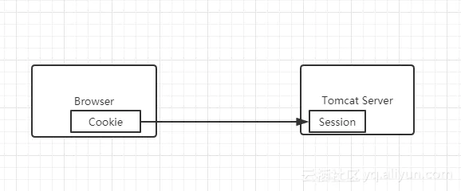

# 单点登录(SSO)

单点登录英文全称Single Sign On，简称就是SSO。它的解释是：在多个应用系统中，值需要登录一次，就可以访问其他相互信任的应用系统

如图所示，图中有4个系统，分别是Application1、Application2、Application3和SSO。Application1、Application2、Application3需要登录时，将跳转到SSO系统，SSO系统完成登录，其他的应用系统也就随之登录了。

## 技术实现

### 普通认证机制

如上图所示，我们在浏览器(Browser)中访问一个应用，这个应用需要登录，我们填写完用户名和密码之后，完成登录认证。这时，我们在这个用户的session中标记登录状态为yes(已登录)，同时在浏览器(Browser)中写入Cookie，这个Cookie是这个用户的唯一标识。下次我们再访问这个应用的时候，请求中会带上这个Cookie，服务端会根据这个Cookie找到对应的session，通过session来判断这个用户是否登录。如果不做特殊配置，这个Cookie的名字叫做jsessionid，值在服务端(server)是唯一的

### 同域下的单点登录

一个企业一般情况下只有一个域名，通过二级域名区分不同的系统。比如我们有个域名叫做：a.com，同时有两个业务系统分别为：app1.a.com和app2.a.com。我们要做单点登录(SSO)，需要一个登录系统，叫做：sso.a.com

我们只要在sso.a.com登录，app1.a.com和app2.a.com就也登录了。通过上面的登录认证机制，我们就可以知道，在sso.a.com中登录了，其实是在sso.a.com的服务端的session中记录了登录状态，同时在浏览器端(Brower)的sso.a.com下写入了Cookie。

登录app1.a.com和app2.a.com还要解决两个问题

- Cookie是不能跨域的，我们Cookie的domain属性是sso.a.com，在给app1.a.com和app2.a.com发送请求是带不上的
- sso、app1和app2是不同的应用，它们的session存在自己的应用内，是不共享的

- 针对第一个问题，sso登录以后可以将Cookie的域设置为顶域，即a.com，这样所有子域的系统都可以访问到顶域的Cookie。我们在设置Cookie时，只能设置顶域和自己的域，不能设置其他的域。比如：我们不能在自己的系统中给baidu.com的域设置Cookie

- 第二个问题，当我们在sso系统登录之后，这时再访问app1，Cookie也带到了app1的服务端(Server)，然后可以通过Session共享，让另外两个系统也能获取到app1的Session，共享Session的解决方案有很多，比如Spring-Session

### 不同域下的单点登录

同域下的单点登录是巧用了Cookie顶域的特性，但是不同域的Cookie是不共享的

这就要用到CAS的流程了

1. 用户访问到app1系统，app1系统需要登录的，但用户现在没有登录
2. app1系统会跳转到CAS server，即SSO登录系统，CAS系统发现该用户也没有登录，就跳转至用户登录页面了
3. 用户填写用户名密码之后，会在CAS系统进行认证，CAS认证成功后会将登录信息保存至Session，浏览器(Browser)中写入CAS域下的Cookie
4. SSO系统登录后会生成一个ST(Server Ticket)，然后跳转到app1系统，同时将ST作为参数传递给app1系统
5. app1系统拿到ST后，从后台向CAS发送请求，验证ST是否有效
6. 验证通过后，app1系统将登录状态写入session并设置app1域下的Cookie

至此，跨域单点登录就完成了。以后我们再访问app1系统时，app1就是登录的

现在，我们再访问一下app2系统

1. 用户访问app2系统，app2系统没有登录，跳转到CAS系统
2. 由于用户已经通过app1系统登录到CAS系统了，不需要重新登录认证
3. CAS系统生成ST，浏览器跳转至app2系统，并将ST作为参数传递给app2
4. app2拿到ST，后台访问CAS，验证ST是否有效
5. 验证通过后，app2系统将登录状态写入session并设置app2域下的Cookie