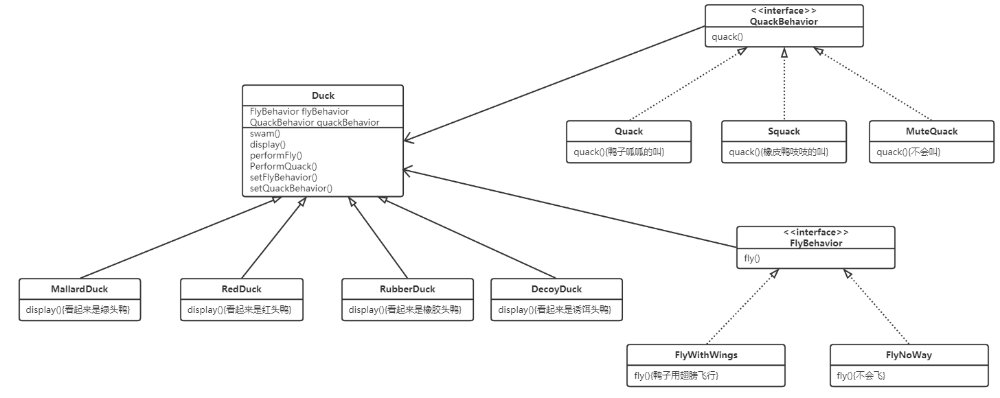
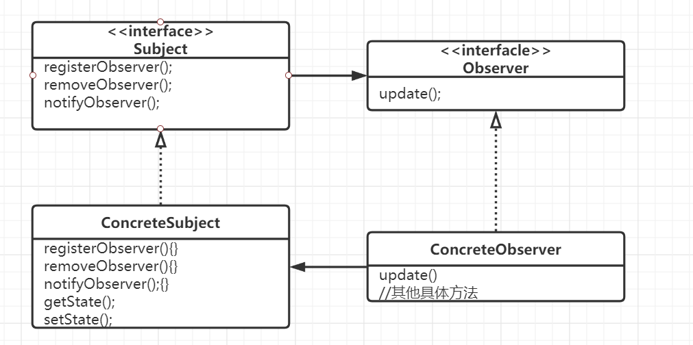

# Head First 设计模式


## 一、设计模式入门

**设计模式**（Design Pattern），是一套被反复使用、多数人知晓的、经过分类编目的、代码设计经验的总结。使用设计模式是为了可重用代码、让代码更容易被他人理解、保证代码可靠性、程序的重用性。

**设计原则**：找出应用中可能需要变化之处，把它们独立出来，不要和不需要变化的代码混在一起，换句话说，把会变化的不会取出并封装起来，以便以后可以轻易地改动或扩充此部分，而不影响不需要变化的其他部分

**设计原则**：针对接口编程，而不是针对实现编程

**设计原则**：多用组合，少用继承

### 策略模式

**策略模式**（Strategy Pattern）：策略模式定义了算法组，分别封装起来，让它们之间可以互相替换，此模式让算法的变化独立于使用算法的客户



```java
public abstract class Duck {
    FlyBehavior flyBehavior;
    public void performFly(){
        flyBehavior.fly();
    }
}
```

```java
public class MallardDuck extends Duck{
    public MallardDuck(){
        super.flyBehavior = new FlyWithWings();
    }
}
```

```java
public interface FlyBehavior {
    public void fly();
}
```

```java
public class FlyWithWings implements FlyBehavior {
    @Override
    public void fly() {
        System.out.println("I`m flying!");
    }
}
```

```java
package com.shary.strategy.duck;

public class FlyNoWay implements FlyBehavior {
    @Override
    public void fly() {
        System.out.println("I can`t fly");
    }
}
```

## 二、观察者模式

### 观察者模式

**观察者模式(Observer Pattern)**：观察者模式定义了对象之间的一对多依赖，这样依赖，当一个对象改变状态时，它的所有依赖者都会收到通知并自动更新



```java
public interface Subject {
    void registerObserver(Observer o);//订阅主题
    void removeObserver(Observer o);//取消订阅
    void notifyObservers();//主题发布
}
```

```java
public class WeatherData implements Subject {
    private ArrayList<Observer> observers;
    private float temperature;
    private float humidity;
    private float pressures;
	public WeatherData(){
        observers = new ArrayList<>();
    }
    //观察者订阅主题
    @Override
    public void registerObserver(Observer o) {
        observers.add(o);
    }
    //观察者取消订阅主题
    @Override
    public void removeObserver(Observer o) {
        int i = observers.indexOf(o);
        if (i >= 0){
            observers.remove(i);
        }
    }
    //主题通过观察者接口的更新方法，将状态推送给所有订阅的观察者
    @Override
    public void notifyObservers() {
        for (int i = 0; i<observers.size(); i++){
            Observer observer = observers.get(i);
            observer.update(temperature,humidity,pressures);
        }
    }
    //状态更新将主动推送
    public void measurementsChanged(){
        notifyObservers();
    }
    /**
    * 获取状态
    */
    public void setMeasurements(float temperature,float humidity,float pressures){
        this.temperature = temperature;
        this.humidity = humidity;
        this.pressures = pressures;
        measurementsChanged();
    }
}
```

```java
public interface Observer {
    void update(float temp, float humidity, float pressure);//更新参数
}
```

```java
/*
* DisplayElement接口就不写了，只有一个display方法
*/
public class CurrentConditionsDisplay implements Observer,DisplayElement{
    private float temperature;
    private float humidity;
    private final Subject weatherData;
    public CurrentConditionsDisplay(Subject weatherData){
        this.weatherData = weatherData;
        weatherData.registerObserver(this);//订阅主题
    }
    @Override
    public void display() {
        System.out.println("Current conditions："+temperature + "F degrees and "+ humidity + "% humidity");
    }
    @Override
    public void update(float temp, float humidity, float pressure) {
        this.temperature = temp;
        this.humidity = humidity;
        display();
    }
}
```

```java
public class WeatherStation {
    public static void main(String[] args) {
        WeatherData weatherData = new WeatherData();
        CurrentConditionsDisplay currentConditionsDisplay = new CurrentConditionsDisplay(weatherData);
		/**
		*模拟主题数据，实际开发中，主题应从接口或者数据库中获取
		*/
        weatherData.setMeasurements(80,65,30.4f);
        weatherData.setMeasurements(82,70,29.2f);
        weatherData.setMeasurements(78,90,29.2f);
    }
}

```

当两个对象之间松耦合，他们依然可以交互，但是不太清楚彼此的细节。观察者模式提供了一种对象设计，让主题和观察者之间松耦合

**设计原则**：为了交互对象之间的松耦合设计而努力