# Core Java Volume I Study Notes

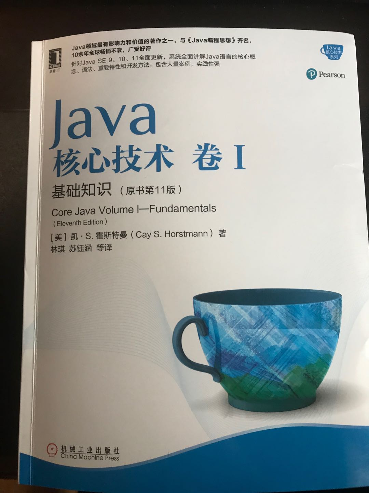

## 第一章 Java程序设计概述

### 1.2、JAVA"白皮书"的关键术语

1. 简单性
2. 面向对象
3. 分布式
4. 健壮性
5. 安全性
6. 体系结构中立
7. 可移植性
8. 解释型
9. 高性能
10. 多线程
11. 动态性

## 第二章 Java程序设计环境

###### 工具包术语

- JDK: Java开发工具包
- JRE: Java运行环境
- Server JRE: 服务器JRE
- SE: 标准版
- EE: 企业版
- ME: 微型版

###### :star2:**环境变量配置**

JAVA_HOME c:Java\jdk-11.0.2

Path后面加%JAVA_HOME%\bin;

######  命令行

win+r cmd 

javac Welcome.java //将java文件编译为class文件

java Welcome //执行

###### JShell

## 第三章 Java的基本程序设计结构

### 3.1、一个简单的Java应用程序

```java
public class FirstSample{
	public static void main(String[] args){
        System.out.plainln("Hello,World!");
    }
}
```

### 3.2、注释

//单行注释

/* */多行注释

/** */自动生成文档注释 ==4.9详细讲解==

### 3.3、:star2:基本数据类型

4种整型、2种浮点型、1种字符类型、1种boolean型

| 类型    | 存储空间 | 取值范围                                                     |
| ------- | -------- | ------------------------------------------------------------ |
| int     | 4b       | -2147483648~2147483647                                       |
| short   | 2b       | -32768~32767                                                 |
| long    | 8b       | -9223372036854775808~9223372036854775807                     |
| byte    | 1b       | -128~127                                                     |
| float   | 4b       | 大约&plusmn;3.40282347E&plusmn;38F(有效位数为6~7位)          |
| double  | 8b       | 大约&plusmn;1.79769313486231570E&plusmn;308F(有效位数为15位) |
| char    | 2b       | UTF-16编码中的一个**代码单元**                               |
| boolean | 1b       |                                                              |

| 转义序列 | 名称   | Unicode值 |
| -------- | ------ | --------- |
| \b       | 退格   | \u0008    |
| \t       | 制表   | \u0009    |
| \n       | 换行   | \u000a    |
| \r       | 回车   | \u000d    |
| \\"      | 双引号 | \u0022    |
| \\'      | 单引号 | \u0027    |
| \\\      | 反斜杠 | \u005c    |


### 3.4、变量与常量

```java
int i , j; //不建议声明变量时写在一行，降低可读性
```

变量声明尽可能靠近变量第一次使用的地方

#### 3.4.3、常量

关键词为final表示这个变量只能被赋值一次，常量名使用全大写

````java
final double CM_PER_INCH=2.54;
````

可以在一个类的多个方法中使用的常量，类常量

```java
public static final double CM_PER_INCH=2.54;
```

#### 3.4.4、枚举类型

```java
enum Size {SMALL,MEDIUM,LARGE,EXTRA_LARGE};

Size s = Size.MEDIUM;
```


### 3.5、运算符

\+ - * / % 加减乘除和整数求余

#### 3.5.2、数学函数

Math

sqrt(double a) 平方根

pow(double a,double b) a的b次方

floodMod

#### 3.5.3、类型转换

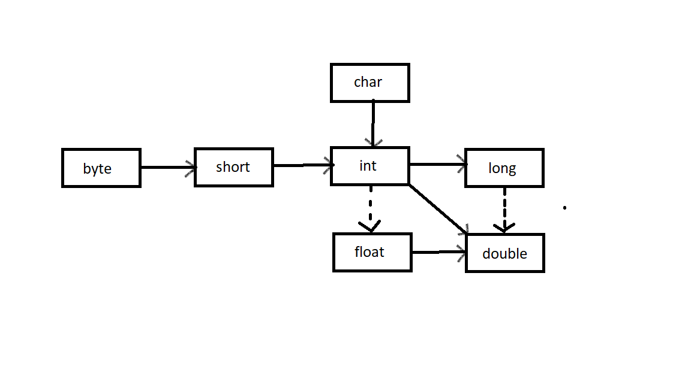

#### 3.5.6、自增与自减运算

++n与n++

```java
int n = 7;
int m = 7;
int a = 2*++m; 
int b = 2*n++;
```

int a = 2*++m; ==等价于 int a = 2\*(m+1)==

int b = 2*n++; ==等价于 int b = 2\*n+1==

#### 3.5.7、运算符

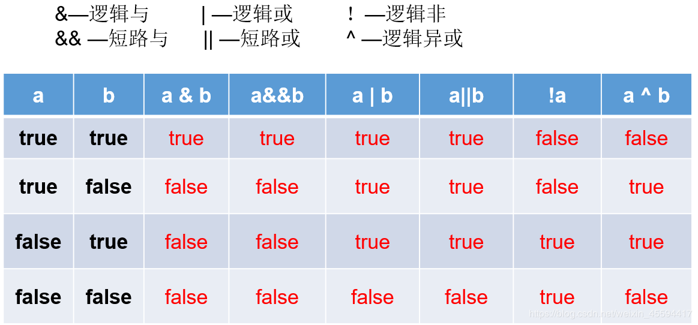

& 与 && 的区别：& 和 | 左右两边的式子一定会执行（比较笨），&& 和 || 只要左边的式子能得出结果，右边的式子就不会执行（比较聪明）。

三元运算符

condition ? expression<sub>1</sub> : expression<sub>2</sub>

condition 为true 值为expression<sub>1</sub>反之为expression<sub>2</sub>

#### 3.5.8、位运算符

&:	1 0010 & 1 0000 = 1 0000 两个操作数中位都为1，结果才为1，否则结果为0

|:	1 0010 & 1 0000 = 1 0010 两个位只要有一个为1，那么结果就是1，否则就为0

^:	1111 ^ 0010 = 1101 如果位为0，结果是1，如果位为1，结果是0

~:	~1101 = 0010 两个操作数的位中，相同则结果为0，不同则结果为1

\> \>	 <<

运算符优先级

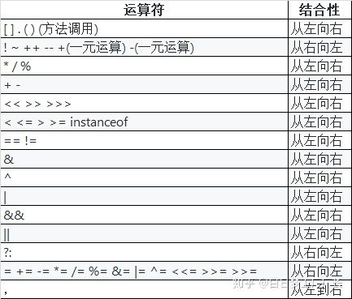

### 3.6、字符串

```java
String str1 = "abc";
String str2 = "abc";
String str3 = new String("abc");
```


#### 3.6.2、拼接

字符串间插入

```java
String str = "Hello";
System.out.println(String.join(" /","S","M","L","XL") );
```

输出结果为:S /M /L /XL


JAVA11新增，复制拼接字符串

```java
String str = "Hello";
System.out.println(str.repeat(4));
```

输出结果为：HelloHelloHelloHello

#### 3.6.3、不可变字符串

不可变字符串优点：编译器可以让字符串共享

缺点效率低

#### 3.6.4、字符串是否相等

```java
String str1 = "Hello";
String str2 = "Hello";
String str3 = "hello";
System.out.println(str1.equals(str2));//true
System.out.println(str1.equalsIgnoreCase(str3));//true，不校验大小写区分
System.out.println(str1+""==str2);//false
System.out.println(str1.comparaTo(str2));//0,效率不如equals
```

==str1+""\=\=str2判断这两个字符串是否存在同一个位置==

#### 3.6.6、码点与代码单元

代码点（Code Point）：在 Unicode 代码空间中的一个值，取值 0x0 至 0x10FFFF，代表一个字符。

代码单元（Code Unit）：在具体编码形式中的最小单位。比如 UTF-16 中一个 code unit 为 16 bits，UTF-8 中一个 code unit 为 8 bits。一个 code point 可能由一个或多个 code unit(s) 表示。在 U+10000 之前的 code point 可以由一个 UTF-16 code unit 表示，U+10000 及之后的 code point 要由两个 UTF-16 code units 表示

#### 3.6.7、String API

```java
String greeting = "Hello World!";
greeting.charAt(3);//返回指定位置的代码单元
int i = greeting.codePointAt(4);//返回从给定位置开始的码点
greeting.offsetByCodePoints(1,4);//返回从1码点开始，4个码点之后的码点索引
"sd".compareTo("sd");//按字典顺序比较两个字符串,如果两个字符串内容相同返回0
greeting.codePoints().toArray();//将这个字符串作为一个流返回
"".isEmpty();//如果字符串为空返回true
"  ".isBlank();//如果字符串为空或空格组成返回true
greeting.startsWith("H");//如果字符串以H为开头返回true
greeting.endsWith("o");//如果字符串以o为结尾返回true

//返回与字符串或码点匹配的第一个字串开始的位置
greeting.indexOf("e");
greeting.indexOf("l",5);
greeting.indexOf(111);
greeting.indexOf(111,6);

//返回与字符串或码点匹配的末尾字串开始的位置
greeting.lastIndexOf("e");
greeting.lastIndexOf("l",5);
greeting.lastIndexOf(111);
greeting.lastIndexOf(111,6);

greeting.length();
greeting.codePointCount(1,5);//返回1和4之间的码点个数
greeting.replace("lo","a");//返回新字符串，这个字符串替换lo
greeting.substring(3);
greeting.substring(3,7);//截取字符串
greeting.toLowerCase();//返回一个原字符串全小写字符串
greeting.toUpperCase();//返回一个原字符串全大写字符串
"   Hello   ".trim();//去除收尾空格
"   Hello   ".strip();//去除收尾空格，包括Unicode的空格
```

#### 3.6.9、构建字符串

StringBuilder效率高但线程不安全

StringBuffer效率低线程安全

```java
StringBuilder builder = new StringBuilder();//构造空的构建字符串
builder.append("Hello World");//追加一个字符串并返回一个this
builder.append('c');//追加一个字节并返回一个this
builder.appendCodePoint(97);//追加一个码点并返回一个this
builder.setCharAt(0,'h');//将第0位设置为h
builder.insert(6,'a');//在第6位插入一个字符串并返回this
builder.delete(6,7);//删除偏移量6到6-1的代码单元并返回this
String str = builder.toString();//返回一个与构建器或缓冲器内容相同的字符串
```

### 3.7、输入与输出

```java
Scanner in = new Scanner(System.in);
System.out.println("What is your name");
String name = in.nextLine();
System.out.println("How old are you");
int age = in.nextInt();
System.out.println("Hello, "+name+". Next year , you,ll be" + (age+1));
```

#### 3.7.2、格式化输出

```java
System.out.printf("%+,.2f",-10000.0/3.0);
String name = "William ";
int age = 28;
String message = String.format("Hello,%s. Next year you'll be %d",name,age);
System.out.printf(message);
System.out.printf("%tc", new Date());
System.out.printf("%1$s %2$tB %2$te %2$tY","Due date:",new Date());
System.out.printf("%s %tB %<te %<tY","Due date:",new Date());
```

#### 3.7.3、文件输入与输出

```java
Scanner in = new Scanner(Path.of("C:\\myfile.txt"), StandardCharsets.UTF_8);
PrintWriter out = new PrintWriter("myfile.txt",StandardCharsets.UTF_8);
```


### 3.8、控制流程

#### 3.8.1、块作用域

#### 3.8.2、条件语句

if(choice){}

if(){}else{}

if(){}else if(){}else{}

#### 3.8.3、循环

while(){}

do{}while()

#### 3.8.4、确定循环

for(int i=0;i<=10;i++){}

#### 3.8.5、多重选择: switch

```java
switch(choice){

	case 1:
        ...
        break;
    case 2:
        ...
        break;
    default:
        ...
        break;    
}
```

case标签可以是：

- 类型为char、byte、short或int的常量表达式
- 枚举常量
- 从==Java7==开始，case标签还可以是字符串字面量

#### 3.8.6、中断控制流程语句

break：不执行代码块后面代码，直接退出循环语句

read_data:while(){break read_data;}：带标签的break，用于跳出多重嵌套的循环语句

continue：不执行代码块后面代码，回到循环首部再执行循环

### 3.9、大数

BigInteger：实现任意精度的整数运算

BigDecimal：实现任意精度的浮点数运算

BigInteger方法：

- BigInteger add(BigInteger  other)：求和
- BigInteger subtract(BigInteger  other)：求差
- BigInteger multiply(BigInteger  other)：求积
- BigInteger divide(BigInteger  other)：求商
- BigInteger mod(BigInteger  other)：求余
- BigInteger sqrt(BigInteger  other)：JDK9 平方根
- int compareTo(BigInteger  other)：如果两个大数相等则返回0，小于返回负数，大于返回正数
- static BigInteger valueOf(long x)：返回值等于X的大整数

BigDecimal方法

- BigDecimal add(BigDecimalother)：求和
- BigDecimal subtract(BigDecimalother)：求差
- BigDecimal multiply(BigDecimalother)：求积
- BigDecimal divide(BigDecimalother)：求商 如果商是一个无限循环小数则会抛出一个异常
- BigDecimal divide(BigDecimalother,RoundingMode mode)：RoundingMode为枚举，求上根据mode舍入
- int compareTo(BigInteger  other)：如果两个大数相等则返回0，小于返回负数，大于返回正数
- static BigInteger valueOf(long x)：返回值等于x的大整数
- static BigInteger valueOf(long x,int scale)：返回值等于x/10<sup>scale</sup>的大整数

### 3.10、数组

#### 3.10.1、声明数组

一旦创建数组就不能再改变它的大小

int[] a;	声明数组

int[] a = new int[100];	初始化数组

int[] a = {2,3,4,5,1};	初始化数组简写形式

new int[]{2,3,4,5,1};	匿名数组

int[] a = new int[]{{2,3,4,5,1}} 	初始化数组并直接设置数组大小

int[] b = {2,3,4,5,1};	与上面等价

#### 3.10.2、访问数组元素

创建一个数组时，所有元素都初始化为0。boolean数组的元素会初始化为false，对象数组的元素则初始化为一个特殊值null

#### 3.10.3、for each 循环

增强for循环语句

for(variable : collection) statement

#### 3.10.4、数组拷贝

```java
        int[] a = {1,2,3};
        int[] b = {1,2,3};

        a = b;
        System.out.println(a == b);
        System.out.println(a);
        System.out.println(b);

        int[] a1 = {1,2,3};
        int[] b1 = {1,2,3};

        a1 = Arrays.copyOf(b1,b1.length);
        System.arraycopy(b1, 0, a1, 0, b1.length);
        System.out.println(a1 == b1);
        System.out.println(a1);
        System.out.println(b1);
```

a  =  b指向相同的内存地址

a1 = b1 指向不同的内存地址

#### 3.10.5、命令行参数

3.10.6、数组排序

viod Arrays.sort(xxx[] a): 源码为双枢轴快速排序，不改变内存路径

Arrays API

static String toString(xxx[] a)：返回包含a中元素的一个字符串，a只能是基本数据类型数组

static xxx[] copyOf(xxx[] a,int end)：返回与a类型相同数组，范围为0~end，如果end超过a.length，则会填充默认值

static xxx[] copyOfRange(xxx[] a,int start,int end)：返回与a类型相同数组，范围为start~end，如果end超过a.length，则会填充默认值

static void sort(xxx[] a)：快速排序

static int binarySearch(xxx[] a,xxx v)：

static int binarySearch(xxx[] a,int start,int end,xxx v)：使用二分法查找在有序数组a中查找值v，如果找到v则返回相应下标，否则返回一个负数r，-r-1是v应插入的位置

static void full(xxx[] a,xxx v)：将数组的所有元素都设置为v

static boolean equals(xxx[] a,xxx[] b)：如果两个数组大小相同，并且下标相同的元素都对应相等，返回true

#### 3.10.7、多维数组

```java
double[][] balances;
```

#### 3.10.8、不规则数组

## 第四章 对象与类

### 4.1、面向对象程序设计概述

面向对象程序设计(object-oriented programming,OOP)

#### 4.1.1、类

类：构造对象的模板或蓝图

创建类的实例：由类构造的对象的过程为创建类的实例

封装(或称为数据隐藏)：将数据和行为组合在一个包中，并对对象的使用者隐藏具体实现方式

实例字段：对象中的数据称为实例字段

方法：操作数据的过程为方法

对象的状态：特定对象都有一组特定的实例字段值，这些值的集合就是这个对象的当前状态

无论何时，只要在对象上调用一个方法，他的状态就有可能发生改变

继承：通过扩展一个类来建立另外一个类的过程称为继承

#### 4.1.2 、对象

对象的三个主要特征：

- 对象的行为：可以对对象完成那些操作，或者可以对对象应用哪些方法
- 对象的状态：当调用那些方法时，对象会如何响应
- 对象的标识：如何区分具有相同行为与状态的不同对象

#### 4.1.3、识别类

#### 4.1.4、类之间的关系

常见关系有：

- 依赖（“uses-a”）
- 聚合（“has-a”）
- 继承（“is-a”）

### 4.2、使用预定类

#### 4.2.1、对象与对象变量

想要使用对象，首先必须构造对象，并指定其初始状态，然后对对象应用方法

#### 4.2.2、Java类库中的localDate类

- static LocalDate now()：构造一个表示当前日期的对象
- static LocalDate of(int year,int month,int day)：构造一个表示给定日期的对象
- int getYear()
- int getMonthValue()
- int getDayofMonth()：得到当前日期的年、月、日
- DayOfWeek getDayOfWeek：得到当前日期是星期几，作为一个DayOfWeek的实例返回，调用getValue来得到1~7之间的一个数，表示这是星期几，1表示星期一，7表示星期日
- LocalDate plusDays(int n)
- LocalDate miusDays(int n)：生成当前日期之后或之前n天的日期

#### 4.2.3、更改器方法与访问器方法

更改器方法：改变对象的状态的方法，例如set方法

访问器方法：只访问对象而不修改对象的方法，例如get方法

### 4.3、用户自定义类

#### 4.3.1、Employee类

#### 4.3.2、多个源文件的使用

javac Employee*.java

javac EmployeeTest.java：如果Employee被调用，编译器会自动编译Employee，反之则不会编译

#### 4.3.3、剖析Employee类

==强烈建议将实例字段标记为private==

#### 4.3.4、从构造器开始

在构造Employee类的对象时，构造器会运行，从而将实例字段初始化为所希望的初始状态

构造器：

- 构造器与类名相同
- 每个类有一个或多个参数
- 构造器可以有0个、1个或多个参数
- 构造器没有返回值
- 构造器总伴随着new操作符一起调用

#### 4.3.5、用var声明局部变量

在==Java10==中

```java
Emloyee harry = new Employee("Herry Hacker",50000,1989,10,1);
var harry = new Employee("Herry Hacker",50000,1989,10,1);
```

var关键字只能用于方法中的局部变量。参数和字段的类型必须声明

#### 4.3.6、使用null引用

==Java9==中Objects类提供的null判断方法：

- static <T\> T requireNonNull(T obj,String message)：检查指定的对象引用是否为null ，如果是，则抛出自定义的NullPointerException。
- static <T\>T requireNotNullElse(T obj,T defaultObj)：如果它是非 null ，则返回第一个参数，否则返回非 null第二个参数。 

#### 4.3.7、隐式参数与显式参数

```java
public void raiseSalary(double byPercent){
    double raise = salary * byPercent / 100;
    salary += raise;
}
```

显式参数：又称为方法调用的目标或接收者，位于方法名后面的括号中，上面byPercent就是显式参数

隐式参数：是出现方法名前的对象，上面salary就是显式参数

#### 4.3.8、封装的优点

```java
public String getName(){
    return name;
}
public double getSalary(){
    return salary;
}
public LocalDate getHireDay(){
    return hireDay
}
```

字段访问器：只返回实例字段值的方法

想要获取或设置实例字段的值，需要提供三项内容：

- 一个私有的数据字段
- 一个公共的字段访问器方法
- 一个公共的字段修改器方法

==不要编写返回可变对象引用的访问器方法==

```java
class Employee{
    private Date hireDay;
    public Date getHireDay(){
        return hireDay;
    }
}
```

由于Date是可变的，harry和d引用的是同一对象，所以这样写破坏了封装性

```java
Employee2 harry = new Employee2();
Date d = harry.getHireDay();
double tenYears = 10*365.25*24*60*60*1000;
Date date = d.setTime(d.getTime() - (long)tenYears);
```

直接导致在对d做修改时会同时修改harry的值

```java
class Employee{
    private Date hireDay;
    public Date getHireDay(){
        return (Date)hireDay.clone();
    }
}
```

解决方案为克隆，对象克隆是指存放在另一个新位置上的对象副本

#### 4.3.9、基于类的访问权限

一个方法可以访问所属类的所有对象的私有数据

#### 4.3.10、私有方法

只要方法是私有的，类的设计者就可以确信它不会再别处使用，所以可以将其删除，而不影响其他代码

#### 4.3.11、final实例字段

final修饰的字段必须在构造对象时初始化

final修饰符常用于修饰基本类型或者不可变类的字段

```java
class Employee{
    private final String name;
}
```


### 4.4静态方法

#### 4.4.1、静态字段

静态字段又称为类字段，如果将一个字段定义为static，每个类只有一个这样的字段

```java
class Employee{
    private static int nextId = 1;
    private int id;
}
```

#### 4.4.2、静态常量

```java
public static final double PI = 3.141592653589323846
```

由于每个类对象都可以修改公共字段，所以，最好不要有公共字段。然而，公共常量(final)可以声明为公共，因为它不能被重新赋值

#### 4.4.3、静态方法

静态方法是不在对象上执行的方法

```java
public static int getNextId(){
    retrun nextId;
}
int n = Employee.getNextId();
```

可以使用Employee对象调用静态方法，但不建议这样做，因为会与非静态方法混淆

两种情况下可以使用静态方法

- 方法不需要访问对象状态，因为它需要的所有参数都是通过显示参数提供(例如：Math.pow)
- 方法只需要访问类的静态字段(例如：Employee.getNextId)

#### 4.4.4、工厂方法

#### 4.4.5、main方法

static <T\> void requireNonNull(T obj)

static <T\> void requireNonNull(T obj,String message)

static <T\> void requireNonNull(T obj,Supplier<String\> messageSupplier)：java8

如果obj为null，这些方法会抛出一个NullPointerException异常而没有消息或者给定的消息

static <T\> T requireNonNullElse(T obj,T defaultObj)

static <T\> T requireNonNullElseGet(T obj,Supplier<T\> defaultSupplier)

如果obj不为null则返回obj，或者如果obj为null则返回默认对象

### 4.5、方法参数

按值调用：表示方法接受的是调用者提供的值

按引用调用：表示方法接收的是调用者提供的变量地址

==Java程序设计语言总是采用按值调用==

Java中对方法参数能做什么和不能做什么：

- 方法不能修改基本数据类型的参数(即数值型或布尔值)
- 方法可以改变对象参数的状态
- 方法不能让一个对象参数引用一个新的对象

### 4.6、对象构造

#### 4.6.1、重载

重载：多个方法，有相同的名字、不同的参数。

#### 4.6.2、默认字段初始化

如果构造器中没有显式地为字段设置初始值，那么就会被自动地赋为默认值：数值为0、布尔值为false、对象引用为null，即使想要的值为默认值也应初始化字段

#### 4.6.3、无参数的构造器

public Employee(){

​	name = "";

​	salary = 0;

​	hireDay = LocalDate.now();

}

如果写一个类时没有编写构造器，就会为你提供一个无参数构造器。这个构造器将所有的实例字段设置为默认值。

当类没有其他任何构造器时，会有一个默认的无参构造器。如果你已经写了一个有参构造器，那么如果你想要构造一个无参对象，则必须写一个无参构造器

#### 4.6.4、显式字段初始化

一般常量static final 声明字段在声明时直接初始化

其他字段建议在构造器中初始化

比如类Demo有个Map类型成员变量，如果直接赋值，那么就必须要指定这个Map是何种Map,而通过构造函数赋值，这个就不确定了，有可能是各种Map的实现。所以，通过构造函数与set方法赋值，能够使程序更加的灵活，也能够体现多态的面向对象的特征。

==有点看不懂回头再看==<https://coolshell.cn/articles/1106.html>

#### 4.6.5、参数名

#### 4.6.6、调用另一个构造器

如果构造器的第一个语句形如this(...)，这个构造器将调用同一个类的另一个构造器

```java
public Employee(double s){
    this("Employee #" + nextId, s);
    nextId++;
}
```

#### 4.6.7、初始化块

初始化数据三种方法：

- 在构造器中设置值
- 在声明中赋值
- 在初始化块中赋值

初始化块：只要构造这个类的对象，这些块就会被执行

在一个类声明中，可以包含任意多个代码块

为了避免字段重复定义，建议总是将初始化块放在字段定义之后

Random()：构造一个新的随机数生成器

int nextInt(int i)：返回一个0~n-1之间的随机数

#### 4.6.8、对象析构与finalize方法

### 4.7、包

#### 4.7.1、包名

使用包的主要原因是确保类名的唯一性

#### 4.7.2、类的导入

一个类可以使用所属包中的所有类，以及其他包中的公共类(public class)

两种方式访问一个包中的公共类：

- 完全限定名：java.time.LocalDate today = java.time.LocalDate.now();
- import语句

#### 4.7.3、静态导入

静态导入允许导入静态方法和静态字段，而不只是类

```java
import static java.lang.StrictMath.random;
random();
```

#### 4.7.4、在包中增加类

想要将类放入包中，就必须将包的名字放在源文件的开头，即放在定义这个包中各个类的代码之前

如果没有在源文件中放置package语句，这个源文件中的类就属于无名包

编译器不检查目录结构，虚拟机需要通过目录找到类

#### 4.7.5、包访问

public：任意类使用

private：只能由它们定义的类使用

(defaul)：同一个包下的类使用

 protected：子类使用

#### 4.7.6、类路径

#### 4.7.7、设置类路径

### 4.8、JAR文件

#### 4.8.1、创建JAR文件

#### 4.8.2、清单文件

#### 4.8.3、可执行JAR文件

#### 4.8.4、多版本JAR文件

#### 4.8.5、关于命令行选项的说明

### 4.9、文档注释

#### 4.9.1、注释的插入

#### 4.9.2、类注释

#### 4.9.3、方法注释

- @param variable description：参数
- @return description：返回
- @throws class description：可能抛出的异常

#### 4.9.4、字段注释

#### 4.9.5、通用注释

- @since text：始于，text可以是引入这个特性的版本的任何描述，@since 1.7.1
- @author name：作者
- @version text：版本
- @see reference：参见
- @Link：链接
- @index：搜索框条目

#### 4.9.6、包注释

#### 4.9.7、注释抽取

### 4.10、类设计技巧

1. 一定要保证数据私有

2. 一定要对数据进行初始化

3. 不要在类中使用过多的基本数据类型

4. 不是所有的字段都需要单独的字段访问器和字段更改器

5. 分解有过多职责的类

6. 类名和方法名要能够体现它们的职责：

   类名应当是一个名词(Order)，或者是前面有形容词修饰的名词(RushOrder)，或者是有动名词(有"-ing"后缀)修饰的名词

   访问器方法用小写的get开头

   更改器方法用小写的set开头

7. 优先使用不可变得类

   如果多个线程试图同时更新一个对象，就会发生并发更改

## 第五章、继承

继承的基本思想是，可以基于已有的类创建新的类

反射是指在程序运行期间更多地了解类及其属性的能力

### 5.1、类、超类、和子类

#### 5.1.1、定义子类

关键字**extends**表明正在构造的新类派生于一个已存在的类

这个已存在的类称为***超类、基类或父类***

新类称为***子类或孩子类***

子类中没有显式地定义超类的方法，但是可以对子类的对象使用这些方法，这是因为子类类自动地继承了超类中的方法

应该将最一般的方法放在超类中，而将更特殊的方式放在子类中

#### 5.1.2、覆盖方法

超类的方法并不一定适用于子类，为此需要一个新的方法***覆盖***超类中的方法

子类已经覆盖了超类的方法，但是又需要调用超类的方法，这时候需要使用super关键字

```java
super.getSalary;
```

在子类中可以增加字段、增加方法或覆盖超类的方法，不过继承绝对不会删除任何字段或方法

#### 5.1.3、子类构造器

多态：一个对象变量可以指示多种实际类型的现象称为多态

动态绑定：在运行时能够自动选择适当的方法称为动态绑定

#### 5.1.4、继承层次

继承层次：由一个公共超类派生出来的集合称为继承层次

继承链：从某个特定的类到其祖先的路径称为该类的继承链

#### 5.1.5、多态

替换原则：程序中出现超类对象的任何地方都可以使用子类的对象替换

对象变量是多态的，一个超类的变量既可以引用一个超类的对象，也可以引用任何一个子类的对象

#### 5.1.6、理解方法调用

假设要调用.f(args)，x声明为C类的一个对象，调用的详细描述：

1. 编译器查看对象的声明类型和方法名

2. 编译器确定方法调用中提供的参数类型。如果在所有名为f的方法中存在一个与所提参数类型完全匹配的方法，就选这个方法，这个过程称为***重载解析***

   签名：方法的名字和参数列表称为方法的签名

   子类方法覆盖超类方法并修改返回类型，则称为这两个方法有***可协变***的返回类型

3. 如果是private方法、static方法、final方法或者构造器，那么编译器将可以准确地知道应该调用哪个方法。这个称为***静态绑定***

4. 程序运行并且采用动态绑定调用方法时，虚拟机必须调用与x所引用对象的实际类型对应的那个方法

调用e.getSalary()的解析过程为：

1. 首先，虚拟机获取e的实际类型的方法表
2. 之后，虚拟机查找定义了getSalary签名的类
3. 最后，虚拟机调用这个方法

动态绑定重要特性：无序对现有的代码进行修改就可以对程序进行扩展

在覆盖方法的时候，子类的方法不能低于超类方法的可见性。

#### 5.1.7、阻止继承：final类和方法

不允许扩展的类被称为final类

类中的某个方法也可以被声明为final。如果这样做，子类就不能覆盖这个方法，final类中的所有方法自动地成为final方法，但字段不会被声明为final

如果一个方法没有被覆盖并且很短，编译器就能够对它进行优化处理，这个过程称为***内联***，比如说e.getName()，编译器会将其替换为e.name

#### 5.1.8、强制类型转换

将一个类型强制转换成另一个类型的过程称为强制类型转换

强制类型转换的作用是，要在暂时忽视对象的实际类型之后使用对象的全部功能

instanceof关键字：判断一个对象是否为这个类的实例

```java
Student s = new Student;
s instanceof Student //true
```

强制类型转换使用注意事项：

- 只能在继承层次内进行强制类型转换
- 在将超类强制类型转换为子类之前，应该使用instanceof进行检查

注意：

```java
s = null;
s instanceof Student//false
```

如果s为null，判断不会发生异常，因为null没有引用任何对象

尽量少使用强制类型转换和instanceof关键字

#### 5.1.9、抽象类

父类中的方法，被它的子类们重写，子类各自的实现都不尽相同。那么父类的方法声明和方法主体，只有声明还有意义，而方法主体则没有存在的意义了。我们把没有方法主体的方法称为抽象方法，用abstract关键字声明抽象类。Java语法规定，包含抽象方法的类就是抽象类。

定义：

1. 抽象方法：没有方法体的方法。
2. 抽象类：包含抽象方法的类。

```java
public abstract class Person{
    public abstract String getDescription();
}
```

有抽象方法的类必须声明为抽象类，但是即便不含抽象方法的类，也可以声明抽象类

超类为抽象类的子类，声明时必须重写父类方法

抽象类不能实例化

#### 5.1.10、受保护访问

1. private：仅对本类可见
2. public：对外部完全可见
3. protected：对本包和所有子类可见
4. 默认：对本包可用

### 5.2、Object：所有类的超类

Object类是Java所有类的始祖

如果没有明确地指出超类，Object就被认为是这个类的超类

#### 5.2.1、Object类型的变量

Java当中，只有基本数据类型不是对象

所有数组类型，不管对象数组还是基本数据类型的数组都扩展了Object类

#### 5.2.2、equals方法

Object类中的equals方法用于检测一个对象是否等于另一个对象

#### 5.2.3、相等测试与继承

Java语言规范要求equals方法具有的特性：

1. 自反性：对于任何非空引用x，x.equals(x)应该返回true
2. 对称性：对于任何引用x和y，当且仅当y.equals(x)返回true时，x.equals(y)返回true
3. 传递性：对于任何引用x，y和z，如果x.equals(y)返回true，y.equals(z)返回true，x.equals(z)也应该返回true。
4. 一致性：如果x和y引用的对象没有发生变化，反复调用x.equals(y)应该返回同样的结果。
5. 对于任意非空引用x，x.equals(null)应该返回false

```JAVA
public class Empolyee{
    public boolean equals(Object otherObject){
        //a quick test to see if the Objects are identical
        if(this == otherObject) return true;
        //must return false if the explicit paramenter is null
        if(otherObject == null) return false;
        //if the classes don`t match,they can`t equal
        if(getClass() != otherObject.getClass())
            return false;
        //now we know otherObject is a non-null Employee
        Employee other = (Employee)otherObject;
        //test whether the fields have identical values
        return name.equals(other.name)
            && salary == other.salary 
            && hireDay.equals(other.hireDay);
    }
}
```

编写一个完美的equals方法的建议：

1. 显式参数命名为otherObject，稍后需要将他强制转换成另一个名为other的变量

2. 检测this与otherObject是否相等：意思是检测otherObject是否为该对象本身

   if(this == otherObject) return true;

3. 检测otherObject是否为null

   if(otherObject == null) return false;

4. 比较this与otherObject的类：

   - 如果equals的语义可以在子类中改变，就使用getClass检测

     if(getClass() != otherObject.getClass()) return false;

   - 如果所有子类都有相同的相等性语义，可以使用instanceof检测

     if(!(otherObject instanceof ClassName)) return false;

5. 将otherObject强制转换为相应类类型的变量

   Employee other = (Employee)otherObject;

6. 根据相等性概念的要求改比较字段。使用 == 比较基本类型字段。使用Objects.equals比较对象字段。

   如果所有字段都匹配，就返回true，否则返回false

   return name.equals(other.name)
               && salary == other.salary 
               && hireDay.equals(other.hireDay);

   如果在子类中重新定义equals，就要在其中包含一个super.equals(other)调用


可以使用@Override标记要覆盖超类方法的那些子类方法，如果签名不一致就会报错

java.util.Arrays:

- static boolean equals(xxx[] a,xxx[] b) ==5==：如果两个数组长度相同，并且在对应的位置上数据元素也相同，将返回true

java.util.Objects

- static boolean equals(Object a,Object b) ==7== ：如果a和b都为null，返回true；如果只有其中之一为null，返回false；否则返回a.equals(b)

#### 5.2.4、hashCode方法

散列码(hash code)是由对象导出的一个整型值

String类使用计算散列码：

```java
int hash = 0;
for(int i = 0;i < lenth(); i++){
    hash =31 * hash + charAt(i);
}
```

如果重新定义了equals方法，就必须为用户可能插入散列表的对象重新定义hashcode方法

equals与hashCode的定义必须相容：如果x.equals(y) 返回true，那么x.hashCode()就必须与y.hashCode()返回相同的值

java.lang.Object:

- int hashCode()：返回对象的散列码。散列码可以是任意的整数，包括正数或负数。两个相等的对象要求返回相等的散列码

java.util.Objects: ==7==

- static int hash(Object... objects)：返回一个散列码，由提供的所对象的散列码组合而得到
- static int hashCode(Object a)：如果a为null返回0，否则返回a.hashCode()

java.lang.(Integer|Long|Short|Byte|Double|Float|Character|Boolean)

- static int hashCode(xxx value)：==8==返回给定制的散列码。这里xxx是对应给定包装类型的基本类型。

java.util.Arrays

- static int hashCode(xxx[] a)：==5==计算数组a的散列码。组成这个数组的元素类型xxx可以是Object、int、long、short、char、byte、boolean、float或double

#### 5.2.5、toString方法

toString方法：返回表示对象值的一个字符串

java.lang.Object:

- Class getClass()：返回包含对象信息的类对象
- boolean equals(Object otherObject)：比较两个对象是否相等，如果两个对象指向同一块存储取余，返回true，否则返回false，要在自定义的类中覆盖这个方法
- String toString()：返回表示该对象值的字符串，要在自定义的类中覆盖这个方法

java.lang.Class：

- String getName()：返回这个类的名字
- Class getSuperClass()：以Class对象的形式返回这个类的超类

### 5.3、泛型数组列表

ArrayList是一个有类型参数的泛型类

#### 5.3.1、声明数组列表

java.util.ArrayList<E\> 

- ArrayList<E\>()：构造一个空数组列表
- ArrayList<E\>(int initialCapacity)
- boolean add(E obj)：一旦加了一个元素，数组列表就会将容量定为10
- int size()
- void ensureCapacity(int capacity)：确保数组列表在不重新分配内部存储数组的情况下有足够的容量存储给定数量的元素
- void trimTosize()：可将数组列表的存储容量削减到当前大小

#### 5.3.2、访问数组列表元素

java.util.Arrays<E\>

- E set(int index,E obj)
- E get(int index)
- void add(int index,E obj)
- E remove(int index)

#### 5.3.3、类型化与原始数组列表的兼容性

声明ArrayList时，如果没有声明类型参数，则默认为Object

```java
public class EmployeeDB{
    public void update(ArrayList list){}
    public ArrayList find(String query){}
}
```

```java
ArrayList<EmployeeDB> staff = ...;
employee.update(staff);
```

这时不需要将staff强制转换，但是依然是有风险的，update方法有可能无法处理EmployeeDB类型

```java
ArrayList<Employee> result = employeeDB.find(query);
```

这时返回的数组列表的类型参数是未知的，如果返回类型无法强转为Employee则会报java.lang.ClassCastException强制转换异常错误

```java
@SuppressWarnings("unchecked")
```

用上述注解，可以标记接受强制类型转换的变量，暂时忽略编译器的警告

### 5.4、对象包装器与自动装箱

包装器：将基本类型转换为对象的类称为包装器

ArrayList的类型参数不允许是基本数据类型

ArrayList<Integer\>效率远低于int[]，所以除非必须要ArrayList，否则用int[]

自动装箱：调用list.add(3)编译器会自动变换为list.add(Integer.valueOf(3))，这种变换称为自动装箱

自动拆箱：int n = list.get(i) ==> int n = list,get(i).intValue();

尽量避免频繁自动装拆箱，虽然自动拆装箱是编译器的工作，但是频繁的创建对象会占用虚拟机内存

java.lang.Integer：

- int inValue
- static String toString(int i)
- static String toString(int i,int radix)：返回数值i基于radix参数指定进制的表示
- static int parseInt(String s)
- static int parseInt(String s,int radix)：返回字符串s表示整数，采用radix参数指定的进制
- static Integer valueOf(String s)
- static Integer valueOf(String,int radix)

java.text.NumberFormat

- Number parse(String s)：假设s表示的是一个数值，返回数字值

### 5.5、参数数量可变的方法

变参方法：可以提供参数数量可变的方法

```java
public static double max(double... values){
    double largest = Double.NeGTIVE_INFNITY;
    for(double v:values){
        if(v>largest){
            largest = v;
        }
    }
    return largest;
}
```

### 5.6、枚举类

```java
public enum Size{SMALL,MEDIUM,LARGE,EXTRA_LARGE}
```

可以为枚举类型增加构造器、方法和字段

枚举的构造器总是私有的，可以省略private修饰符

### 5.7、==反射==

反射：能够分享类能力的程序称为反射

反射使用场景：

- 在运行时分析类的能力
- 在运行时检查对象
- 实现泛型数组操作代码
- 利用Method对象

#### 5.7.1、Class类

Java运行时系统始终为所有对象维护一个运行时的类型标识，保存这些类型标识的类名为Class

获得Class类对象的三种方法：

```java
var generator = new Random();
Class c1 = generator.getClass();

String className = "java.util.Random";
Class c2 = Class.forName(className);

Class c4 = Random.class;
```

虚拟机为每个类型管理一个唯一的Class对象。因此，可以利用 == 运算符实现两个类对象的比较

```java
var c1 = Class.forName("java.util.Random");
Object obj = c1.getConstructor().newInstance();
```

Class类型对象，调用getConstructor方法获得Constructor类型对象，再调用newInstance方法来构造一个实例

java.lang.Class

- string getName()：返回这个类的类名及包名

- static Class forName(String className)：返回一个Class对象，表示名为className的类
- Constructor getConstructor(Class... parameterType)：生成一个对象，描述有指定参数类型的构造器

java.lang.reflect.Constructor

- Object newInstance(Object... params)：将params传递到构造器，来构造这个构造器声明类的一个新实例

java.lang.Throwable

- void printStackTrace()：将Throwable对象和堆栈轨迹打印到标准错误流

#### 5.7.2、声明异常入门

处理器可以捕获异常并进行处理

检查型异常：建议其将会检查你是否知道这个异常并做好准备来处理后果

非检查型异常：编译器并不期望你为这些异常提供处理器

#### 5.7.3、资源

java.lang.Class

- URL getResource(String name)

- InputStream getResourceAsStream(String name)

  找到与类位于同一位置的资源，返回一个可以用来加载资源的URL或输入流

#### 5.7.4、利用反射分析类的能力

java.lang.Class：

- Field[] getFields()：返回一个包含Field对象的数组，这些对象对应这个类或其他超类的公共字段

- Field[] getDeclaredFields()：只返回当前类的公共字段，不返回超类的公共字段

- Method[] getMethods()：返回包含Method对象的数组，包含该类及继承自超类的所有公共方法

- Method[] getDeclaredMethods()

- Constructor[] getConstructors()：返回包含Constructor对象的数组，包含该类及继承自超类的所有公共构造器

- Constructor[] getDeclaredConstructors();

- String getPackageName()：==9==得到包含这个类型的包的包名，如果这个类型是一个数组类型，则返回元素类型所属的包，或者如果这个类型是一个基本数据类型，则返回“java.lang”

java.lang.reflect.Field

java.lang.reflect.Method

java.lang.reflect.Constructor

- Class getDeclaringClass()：返回一个Class对象，表示定义了这个构造器、方法或字段的类

- Class getExceptionType()(在Constructor和Method classes类中)

  返回一个Class对象数组，其中各个对象表示这个方法所抛出的异常的类型

- int getModifiers()：返回一个整数，描述这个构造器、方法或字段的修饰符。使用Modifier类中的方法来分析这个返回值

- String getName()

- Class[] getParameterTypes()(在Constructor和Method classes类中)

  返回一个Class对象数组，其中各个对象表示参数的类型

- Class getReturnType()(在Method类中)

java.lang.reflect.Modifier

- static String toString(int modifiers)：返回一个字符串，包含对应modifiers中位设置的修饰符

- static boolean isAbstract(int modifiers)
- static boolean isAbstract(int modifiers)
- static boolean isFinal(int modifiers)
- static boolean isInterface(int modifiers)
- static boolean isNative(int modifiers)
- static boolean isPrivate(int modifiers)
- static boolean isProtected(int modifiers)
- static boolean isPublic(int modifiers)
- static boolean isStatic(int modifiers)
- static boolean isStrict(int modifiers)
- static boolean isSynchronized(int modifiers)
- static boolean isVolatile(int modifiers)

这些方法将检测modifiers值中与方法明中修饰符对应的二进制位

#### 5.7.5、使用反射在运行时分析对象

利用反射机制可以查看在编译时还不知道的对象字段

java.lang.reflect.AccessibleObject

- void setAccessible(boolean flag)：设置或取消这个可访问对象的可访问标志，如果拒绝访问则抛出一个IllegalAccessException异常
- boolean trySetAccessible()：==9== 为这个可访问的对象设置可访问标志，如果拒绝则返回false
- boolean isAccessible()：得到这个可访问对象的可访问标志值
- static void setAccessible(AccessibeObject[] array,boolean flag)：设置一个对象数组的可访问标志

java.lang.Class

- Field getField(String name)：得到指定名的公共字段
- Field[] getFields()：所有这些字段的一个数组
- Field getDeclaredField(String name)
- Fields getDeclaredFields()

java.lang.reflect.Field

- Object get(Object obj)：返回obj对象中用这个Field对象描述的字段的值
- void set(Object obj,Object newValue)：将Obj对象中这个Field对象描述的字段设置为一个新值

#### 5.7.6、使用反射编写泛型数组代码

java.lang.reflect.Array

- static Object get(Object array,int index)

- static xxx getXxx(Object array,int index)

  (xxx 是boolean、byte、char、double、float、int、long、short中的一种基本类型)这些方法将返回存储给定数组中给定索引位置上的值

- static void set(Object array,int index,xxx newValue)

- static void setXxx(Object array,int index,xxx newValue)

#### 5.7.7、调用任意方法和构造器

java.lang.reflect.Method

- public Object invoke(Object implicitParamenter,Object[] explicitParamenter)

  调用这个对象描述的方法，传入给定参数，并返回方法的返回值。对于静态方法，传入null作为隐式参数。使用包装器传递基本类型值。基本类型的返回值必须是未包装的

### 5.8、继承的设计技巧

1. 将公共操作和字段放在超类中
2. 不要使用受保护的字段
3. 使用继承实现“is-a”关系
4. 除非所有继承的方法都有意义，否则不要使用继承
5. 在覆盖方法时，不要改变预期的行为
6. 使用多台，而不要使用类型信息
7. 不要滥用反射

## 第六章、接口、lambda表达式与内部类

### 6.1、接口

接口：接口用来描述类应该做什么，而不是指定他们应该具体做什么

一个类可以实现一个或多个接口

#### 6.1.1、接口的概念

```java
class Employee implements Comparable<Employee>{
    public int compareTo(Employee other){
        return Double.compare(salary,other.salary);
    }
}

Arrays.sort(new Employee[3]);
```

想要调用Arrays.sort方法，显式参数类型必须实现接口Comparable，因为Arrays.sort必须调用compareTo方法

接口不是类，而是对希望符合这个接口的类的一组需求

接口中的所有方法都自动是public方法，因此，在接口中声明方法时，不必提供关键字public

接口绝不会有实例字段

让类实现接口步骤：

1. 将类声明为实现给定的接口，关键字为implements
2. 对接口中的所有方法提供定义

实现接口时，必须把方法声明为public

实现接口的主要原因是，Java是一种强类型语言，在调用方法的时候，编译器要能检查这个方法确实存在

java.lang.Comparable<T\>

- int copareTo(T other)：用这个对象与other进行比较，小于other返回负整数，等于返回0，大于返回正整数

java.util.Arrays

- static void sort(Object[] a)：对数组a中的元素排序，a中元素必须实现Comparable接口，并且元素之间必须可比较

java.Iang.Integer

- static int compare(int x,int y)：x<y返回负整数，x=y返回0，x>y返回正整数

java.lang.Double

- static int compate(double x,double y)

#### 6.1.2、接口的属性

接口不是类，不能通过new实例化接口

接口变量必须应用实现了这个接口的类对象

可以使用instanceof检查一个对象是否实现了某个特定的接口

接口中不能包含实例字段，但可以包含常量

接口中的方法都自动被设置为public一样，接口中的字段总是public static final

#### 6.1.3、接口与抽象类

每个类只能扩展一个类，但是每个类可以实现多个接口

#### 6.1.4、静态和私有方法

允许在接口中增加静态方法

#### 6.1.5、默认方法

可以为接口方法提供一个默认实现，必须用default修饰符标记这样一个方法

```java
public interface Iterator<E>{
    boolean hashNext();
    E next();
    defualt void remove(){
        throw new UnsupportedOperationException("remove");
    }
}
```

默认方法的一个重要用法是“接口演化”，如果接口增加了一个方法，只能通过默认方法来扩展，否则不能保证“源代码兼容”

#### 6.1.6、解决默认方法冲突

1. 如果这个类的超类与接口定义了同样签名的方法，超类优先

   

2. 如果这个类的两个接口中，其中一个接口定义了默认方法，另一个接口定义了同样签名的方法（不管这个方法是不是默认方法），这个类必须覆盖这个方法。但是当这两个接口都没有为共享方法提供默认实现，就不会引起冲突

#### 6.1.7、接口与回调

回调是一种常见的设计模式。在这种模式中，可以指定某个特定事件发生时应该采取的动作

#### 6.1.8、Comparator接口

#### 6.1.9、==对象克隆==

```java
var original = new Employee("John Public",50000);
Employee copy = original;
copy.raiseSalary(10);
```

当original对象建立copy副本后，copy修改salary值，同时original的salary的值也会改变，这时就需要clone

```java
Employee copy = original.clone();
copy.raiseSalary(10);
```

默认的克隆操作是“浅拷贝”，并没有克隆对象中引用的其他对象。如果引用的对象是可变的，那么浅克隆出的对象所引用的对象还是会一同改变，如Date类的对象

如果原对象的浅克隆对象共享的子对象是不可变的，那么这种共享就是安全的，如String对象

浅拷贝同时克隆所有可变的引用对象就是深拷贝

对于每一个类，需要确定：

1. 默认的clone方法是否满足需求
2. 是否可以在可变的子对象上调用clone来修补默认的clone方法
3. 是否不该使用克隆

第三项为默认选项，如果选择一二项，类必须：

1. 实现Cloneable接口
2. 重新定义clone方法，并指定public访问修饰符

Object类中的clone方法声明为protected

Cloneable接口的出现与接口的正常使用，这个接口的作用是，当一个对象请求克隆，但是没有实现这个接口，那么就会生成一个检查型异常

Cloneable是一个少有的**标记接口**(或称为**记号接口**)，标记接口不包含任何方法，它的唯一作用就是允许在类型查询中使用instanceof

### 6.2、lambda表达式

lambda表达式是一个可传递的代码块，可以在一个执行一次或多次

#### 6.2.1、为什么引入lambda表达式

在引入lambda表达式之前，由于java是一种面向对象语言，传递一段代码块并不容易，必须构造一个对象，然后引用这个对象实现的方法来传递，所以引入lambda表达式来处理代码块

#### 6.2.2、lambda表达式的语法

1. 有参表达式：(参数) -> {表达式}

```java
(String first,String second) -> {first.length() - second.length()}
```

2. 无参表达式：() -> {表达式}

```java
() -> {
    for (int i = 100; i>=0; i++){
        System.out.println(i);
    }
}
```

3. 可推导出参数类型，可省略参数类型

```java
Comparator comp = (first , second) -> {
    first.length() - second.length();
}
```

4. 只有一个参数，且参数类型可推导，可以省略空格

```java
ActionListener listener = event -> 
    System.out.println("The time is " + INstant.ofEpochMilli(event.getWhen()));
```

5. 无序指定lambda表达式的返回类型

```java
(String first,String second) -> {first.length() - second.length()}
```

#### 6.2.3、函数式接口

函数式接口：对于只有一个抽象方法的接口，需要这种接口的对象是，就可以提供一个lambda表达式

```java
public class Test {
    static IntCall intcall;
    public static void main(String[] args) {
        intcall = i -> {
            if(i<10){
                return i+intcall.call(i+1);
            }else{
                return i;
            }
        };
        int i2 = intcall.call(1);
    }
}
interface IntCall{
    int call(int x);
}
```

在java中，对lambda表达式所能做的也只是转换为函数式接口

#### 6.2.4、方法引用

```java
var timer = new Timer(1000,event -> System.out.println(event));
//lambda简写为
var timer = new Timer(1000,System.out::println);
```

方法引用指示编译器生成一个函数式接口的实例，覆盖这个接口的抽象方法来调用给定的方法

用 :: 运算符分割方法名与对象或类名：

1. object :: instanceMethod
2. Class :: instanceMethod
3. Class :: staticMethod

只有当lambda表达式的体只调用一个方法而不做其他操作时，才能把lambda表达式重写为方法引用

#### 6.2.5、构造器引用

构造器引用与方法引用很类似，只不过方法名为new。例如，Person::new是Person构造器的一个引用

```java
Arraylist<String> names = ...;
Stream<Person> stream = names.stream().map(Person::new);
List<Person> people =stream.collect(Collectors.toList());
```

Java有一个限制，无法构造泛型类型T的数组。数组构造器引用对于克服这个限制很有用。表达式new T[n]会产生错误，因为这会改为new Object[n]

```java
Person[] people = stream.toArray(Person[]::new);
```

#### 6.2.6、变量作用域

lambda表达式中可以捕获外围作用域中的变量的值，但要确保所捕获的值是明确定义的。在lambda表达式中，只能引用值不会改变的变量。

下面做法为不合法的，因为start是会改变的变量：

```java
public static void countDown(int start,int delay){
    ActionListener listener = event -> {
        start--;
        System.out.println(start);
    };
    new Timer(delay,listener).start();
}
```

如果在lambda表达式中引用一个变量，而这个变量可能在外部改变，这也是不合法的

下面做法是不合法的，因为i在外部发生了改变：

```java
public static void repeat(String text,int count){
    for(int i = 1; i <= count; i++){
        ActionListener listener = event -> {
            System.out.println(i + ":" + text);
        };
        new Timer(1000,listener.start());
    }
}
```

lambda表达式中捕获的变量必须实际上是事实最终变量，事实最终变量是指，这个变量初始化之后就不会再为它赋新值。

lambda表达式的体育嵌套块有相同的作用域

#### 6.2.7、处理lambda表达式

使用lambda表达式的重点是延迟执行

这样做的原因有：

- 在一个单独的线程中运行代码
- 多次运行代码
- 在算法的适当位置运行代码
- 发生某种情况是执行代码
- 只在必要时才运行代码

如果设计你自己的接口，其中只有一个抽象方法，可以用@FunctionalInterface注解来标记这个接口。这样做有两个优点。如果你无意中增加了另一个抽象方法，编译器会产生一个错误消息。另外javadoc页会指出你的接口是一个函数式接口

#### 6.2.8、再谈Comparator

### 6.3、内部类

内部类是定义在另一个类中的类

使用内部类的两个原因：

- 内部类可以对同一个包中的其他类隐藏
- 内部类方法可以访问定义这个类的作用域中的数据，包括原本私有的数据

#### 6.3.1、使用内部类访问对象的状态

一个内部类方法可以访问自身的数据，也可以访问创建它的外围对象的数据字段

内部类的对象总有一个隐式引用，指向创建它的外部类对象

类的可声明权限修饰符

外部类：public、(defualt)

内部类：public、protected、(defualt)、private

#### 6.3.2、内部类的特殊语法规则

使用外围类引用：OuterClass.this

外围类的作用域之外引用内部类：OuterClass.InnerClass

内部类不能有static方法

#### 6.3.3、内部类是否有用、必要和安全

内部类是一个编译器现象，与虚拟机无关。编译器将会把内部类转换为常规的类文件，用$分隔外部类名与内部类名，而虚拟机则对此一无所知

内部类可以访问外围类的私有数据，但外部类则不能访问内部类的的私有数据

如果内部类访问了私有数据字段，就有可能通过外围类所在包中增加的其他类访问那些字段

#### 6.3.4、局部内部类

声明局部类是不能有访问说明符。局部类的作用域被限定在声明这个局部类的块中

局部类有个很大的优势，即对外部世界完全隐蔽

#### 6.3.5、由外部方法访问变量

局部类还有一个优点。它们不仅能够访问外部类的字段，还可以访问局部变量。不过局部变量必须是**事实最终变量**

#### 6.3.6、匿名内部类

假如只想创建这个类的对象，甚至不需要为类指定名字。这样一个类被称为匿名内部类

```java
new SuperType(construction parameters){
    inner class methods and data
}
```

SuperType如果是接口，匿名内部类就要实现这个接口；如果是类，匿名内部类就要扩展这个类

```java
var count = new Person("Dracula"){{initalization}};
```

尽管匿名类不能有构造器，但可以提供一个对象初始化块

外层括号建立了ArrayList的一个匿名子类。内层括号则是一个对象初始化块

#### 6.3.7、静态内部类

使用内部类只是为了把一个隐藏在另一个类的内部，并不需要内部类有外围类对象的一个引用。为此，可以将内部类声明为static，这样就不会生成那个引用。

只要内部类不需要方位外围类对象，就应该使用静态内部类。有些程序员用嵌套类表示静态内部类

与常规类不同，静态内部类可以有静态字段可方法

在接口中声明的内部类自动是static和public

### 6.4、==服务加载器==

### 6.5、==代理==

## 第七章、异常、断言和日志

当发生异常时，应做到：

1. 向用户通知错误
2. 保存所有的工作
3. 允许用户妥善地退出程序

Java使用了一种称为异常处理的错误捕获机制

### 7.1、处理错误

如果由于出现错误而使得某些操作没有完成，程序应：

- 返回到一种安全状态，并能够让用户执行其他命令
- 允许用户保存所有工作结果，并以妥善的方式终止程序

可能会出现的错误种类：

1. 用户输入错误
2. 设备错误
3. 物理限制
4. 代码错误

在Java中，如果某个方法不能够采用正常的途径完成它的任务，可以通过另一个路径退出方法。在这种情况下，方法并不返回任何值，而是抛出一个封装了错误信息的对象。需要注意的是，这个方法将会立即退出，并不返回正常值或任何值。此外，也不会从调用这个方法的代码中继续执行，取而代之的是，异常处理机制开始搜索能够处理这种异常状况的异常处理器

#### 7.1.1、异常分类

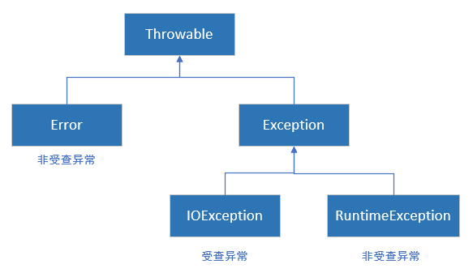

所有异常对象都是派生与Throwable类的一个类实例

Throwable下有两个分支：

- Error：Error类层次结构描述了Java运行时系统的内部错误和资源耗尽错误，这种错误对象不应被抛出，只能通知用户
- Exception：Exception下又分解为两个分支：
  - RuntimeException：
    - 错误的强制类型转换异常
    - 数组访问越界
    - 访问空指针异常
  - 非RuntimeException的异常，如IOException
    - 试图超越文件末尾继续读取数据
    - 试图打开一个不存在的文件
    - 试图根据给定的字符串查找Class对象，而这个字符串表示的类并不存在

Error类或RuntimeException类的所有异常称为非检查型异常

所有其他的异常称为检查型异常

#### 7.1.2、声明检查型异常

方法不仅需要告诉编译器需要返回什么值，还要告诉编译器有可能发生什么样的错误

要在方法的首部指出这个方法可能抛出的一个异常，所以要修改方法首部，以反映这个方法可能抛出的检查型异常

有以下四种情况会抛出异常：

- 调用了一个抛出检查型异常的方法
- 检测到一个错误，并且利用throw语句抛出一个检查型异常
- 程序出现错误
- Java虚拟机或运行时库出现内部错误

有些Java方法包含在对外提供的类中，对于这些方法应该通过方法受不得异常规范声明这个方法的异常

```java
class MyAniation{
    public Image loadImage(String s) throws IOException{
        
    }
}
```

需要抛出多个检查型异常类型，可以将配个异常类型之间用逗号隔开

```java
class MyAniation{
    public Image loadImage(String s) throws FileNotfoundException,EOFException{
        
    }
}
```

==不要声明java的内部错误，即从Error继承的异常，也不要声明从RuntimeException继承的那些非检查型异常==

总结：一个方法必须声明所有可能抛出的检查型异常，而非检查型异常要么在你的控制之外(Error)，要么是由从一开始就应该避免的情况所到会的(RuntimeException)。如果方法没有声明所有可能发生的检查型异常，编译器就会发出一个错误消息


如果在子类中覆盖了超类的一个方法，子类方法中声明的检查型异常不能比超类方法中声明的异常更通用(子类方法可以抛出更特定的异常，或者根本不抛出任何异常)。如果超类方法没有抛出任何检查型异常，子类也不能抛出任何检查型异常

如果一个类中的一个方法声明它会抛出一个异常，而这个异常是某个特定类型的实例，那么这个方法抛出的异常可能属于这个类，也可能属于这个类的任意一个子类。

#### 7.1.3、如何抛出异常

如何抛出异常：

1. 找到一个合适的异常
2. 创建这个类的一个对象
3. 将对象抛出

抛出异常语句：

```java
throw new EOFException();

var e = new EOFException();
throw e;
```

#### 7.1.4、创建异常类

创建一个异常类我们需要做的是定义一个派生与Exception的类，或者派生于Exception的某个子类，如IOException。习惯的做法是，自定义的这个类应该包含两个构造器，一个是默认的构造器，另一个是包含详细描述信息的构造器(超类Throwable的toString方法返回一个字符串，其中包含这个详细信息，这在调试中非常有用)。

```java
class FileFormatException extends IOException{
    public FileFormatException(){}
    public FileFormatException(String grips){
        super(grips);
    }
}
```

java.lang.Throwable

- Throwable()：构造一个新的Throwable对象，但没有详细的描述信息
- Throwable(String message)：构造一个新的Throwable对象，带有指定的详细描述信息。按惯例，所有派生的异常类都支持一个默认构造器和一个带有详细描述信息的构造器
- String getMessage()：获得Throwable对象的详细描述信息

### 7.2、捕获异常

#### 7.2.1、捕获异常

```java
try{
    code;
    more code;
}catch(Exception e){
    handler for this type
}
```

如果try语句块中的任何代码抛出了catch子句中指定的一个异常类，那么程序将跳过try语句块中的其余代码，并执行catch子句中的处理器代码。

如果try语句块中的代码没有抛出任何异常，那么程序将跳过catch子句

如果try语句块中的任何代码抛出了catch子句中没有声明的一个异常类型，那么这个方法就会立即退出(希望它的调用者为了这种类型的异常提供了catch子句)

一般情况下，要捕获那些你知道如何处理的异常，而继续传播那些你不知道怎样处理的异常

#### 7.2.2、捕获多个异常

```java
try{
    code that might throw exceptions;
}catch(FileNotFoundException e){
    e.getMessage();//获得详细的错误消息
    e.getClass().getName;//获得异常对象的实际类型
    emergency action for missing files;
}catch(UnkownNotException e){
    emergency action for unkown hosts;
}catch(IOException e){
    emergency action for all other I/O problems
}
```

在Java7中，同一个catch子句中可以捕获多个异常类型

```java
try{
    code that might throw exceptions;
}catch(FileNotFoundException e | UnkownNotException e){
    emergency action for missing files and unkown hosts;
}catch(IOException e){
    emergency action for all other I/O problems
}
```

只有当捕获的异常类型彼此之间不存在子类关系时才需要这种特性

#### 7.2.3、再次抛出异常与异常链

如果我们想要改变异常类型，我们可以捕获这个异常并在catch子句中抛出一个新的异常

```java
try{
    access the database;
}catch(SQLException e){
    throw new ServletException("database error:" + e.getMessage());
}
```

也可以吧原始异常设置为新异常的"原因"

```java
try{
    access the database;
}catch(SQLExcption e){
    var e = new ServletException("database error");
    e.initCause(original);
    throw e;
}
```

捕获到这个异常时，可以使用下面这条语句获取原始异常

```java
Throwable original = e.getCause();
```

强烈建议使用这种包装技术。这样可以在子系统中抛出高层异常，而不会丢失原始异常的细节。

如果在一个方法中发生了一个检查型异常，但这个方法不允许抛出检查型异常，那么我们可以捕获这个检查型异常，并将它包装成一个运行时异常

在java7后，有时你可能只想记录一个异常，再将它重新抛出，而不做任何改变

```java
try{
    access the database;
}catch(Exception e){
    logger.log(level,message,e);
    throw e;
}
```

#### 7.2.4、finally子句

不管是否有异常被捕获，finally子句中的代码都会执行

```java
var in = new FileInputStream(...);
try{
    //1
    code that might throw exception;
    //2
}catch(IOException e){
    //3
    show error message;
    //4
}finally{
    //5
    in.close;
}
//6
```

1. 代码没有抛出异常：执行1、2、5、6
2. 代码抛出一个异常，并被一个catch捕获：执行1、3、4、5、6
3. 代码抛出一个异常，并被一个catch捕获，但是catch子句也抛出了一个异常：执行1、3、5
4. 代码抛出一个异常，但是没有任何catch子句捕获：执行1、5

警告，不要把改变控制流的语句(return,throw,break,continue)放在finally子句中

#### 7.2.5、try-with-Resources

所有被打开的系统资源，比如流、文件或者Socket连接等，都需要手动关闭

```java
BufferedInputStream  in = null;
try{
    in = new BufferedInputStream(new FileInputStream(new File("test.txt")));
}catch (IOException e) {
    e.printStackTrace();
}finally {
    if (in != null){
        try {
            in.close();
        }catch (IOException ex){
            ex.printStackTrace();
        }
    }
}
```

但是这样十分繁琐

java7之后，可以使用try-with-resource语句方便的退出

```java
try(var in = new BufferedInputStream(new FileInputStream(new File("test.txt")));){
    int read = in.read();
} catch (IOException e) {
    e.printStackTrace();
}
```

try块退出时，内部实现AutoClosable接口的资源，会自动调用res.close()。

在Java9中，可以在try首部中提供之前声明的事实最终变量

```java
public static void printAll(String[] lines,PrintWriter out){
    try(out){
        for(String line : lines)
            out.println(line);
    }
}
```

反编译可以看到，close方法如果发生异常，会被自动捕获，并由addSuppressed方法增加到原来的异常

#### 7.2.6、分析堆栈轨迹元素

堆栈轨迹是程序执行过程中某个特定点上的所有挂起的方法调用的一个列表

可以使用Throwable类中的printStackTrace方法访问堆栈轨迹的文本描述信息

```java
var t = new Throwable();
var out = new StringWriter();
t.printStackTrace(new PrintWriter(out));
String description = out.toString();
```

也可以使用StackWalker类，它会生成一个StackWalker.StackFrame实例流，其中每个实例分别描述一个栈帧

```java
StackWalker walker = StackWalker.getInstance();
walker.forEach(System.out::println);
```

如果想要以懒方式处理Stream<StackWalker.StackFrame>，可以调用：

```java
walker.walk(stream -> process stream)
```

java.lang.Throwable：

- Throwable(Throwable cause)
- Throwable(String message,Throwable cause)：用给定的cause(原因)构造一个Throwable对象
- Throwable initCause(Throwable cause)：为这个对象设置原因，如果这个对象已有一个原因，则抛出一个异常。返回this
- Throwable  getCause()：获得设置为这个对象原因的异常对象。如果没有设置原因，则返回null
- StackTraceElement[] getStackTrace()：获得构造这个对象是调用堆栈的轨迹。
- void addSuppressed(Throwable t) ：==7== 为这个异常增加一个“抑制的”异常。这出现在try-with-resoures语句中，其中t是close方法抛出的一个异常
- Throwable[] getSuppressed() ：==7== 得到这个异常的所有“抑制的”异常。一般来说，这些是try-with-resource语句中close方法抛出的异常

java.lang.Exception：

- Exception(Throwable cause)
- Exception(String message,Throwable cause)：用给定的cause构造一个Exception对象

java.lang.RuntimeException：

- RuntimeException(Throwable cause)：
- RuntimeException(String message,Throwable cause)：用给定的cause构造一个RuntimeException对象

java.lang.StackWalker：==9==

- static StackWalker getInstance()：

- static StackWalker getInstance(StackWalker.Option option) ：

- static StackWalker getInstance(Set<StackWalker.Option> options) ：

  得到一个StackWalker实例。选项包括StackWalker.Option枚举中的RETAIN_CLASS_REFERENCE、SHOW_REFLECT_FRAMES和SHOW_HIDDEN_FRAMES

- void forEach(Consumer<? super StackWalker.StackFrame> action) ：在每个栈帧上完成跟定的动作，从最近调用的方法开始

- <T> T walk(Function<? super Stream<StackWalker.StackFrame>,? extends T> function) ：

  对一个栈帧流应用给定的函数，返回这个函数的结果

java.lang.StackWalker.StackFrame:==9==

- String getFileName() ：得到包含该元素执行点的源文件的文件名，如果这个信息不可用则返null
- int getLineNumber() ：得到包含钙元素执行点的源文件的行号，如果这个信息不可用则返回-1
- String getClassName() ：得到方法包含该元素执行点的类的完全限定名
- Class<?> getDeclaringClass() ：得到方法包含该元素执行点的类的Class对象。如果这个栈遍历器不是用RETAIN_CLASS_REFERENCE选项构造的，则会抛出一个异常
- String getMethodName() ：得到包含该元素执行点的方法的方法名。构造器的方法名为<init>。静态初始化器的方法名为<clinit>。无法区分同名的重载方法
- boolean isNativeMethod() ：如果这个元素的执行点在一个原生方法中，则返回true
- String toString()：返回一个格式化的字符串，包含类和方法名、文件名以及行号(如果这些信息可用)

java.lang.StackTraceElement：

- String getFileName() ：得到包含该元素执行点的源文件的文件名，如果这个信息不可用则返null
- int getLineNumber() ：得到包含钙元素执行点的源文件的行号，如果这个信息不可用则返回-1
- String getClassName() ：得到方法包含该元素执行点的类的完全限定名
- String getMethodName() ：得到包含该元素执行点的方法的方法名。构造器的方法名为<init>。静态初始化器的方法名为<clinit>。无法区分同名的重载方法
- boolean isNativeMethod() ：如果这个元素的执行点在一个原生方法中，则返回true
- String toString()：返回一个格式化的字符串，包含类和方法名、文件名以及行号(如果这些信息可用)

### 7.3、使用异常的技巧

1. 异常处理不能代替简单的测试
2. 不要过分的细化异常
3. 充分利用异常的层次结构
4. 不要压制异常
5. 在检测错误时，“苛刻”要比放任更好
6. 不要羞于传递异常

### 7.4、使用断言

#### 7.4.1、断言的概念

断言机制允许在测试期间向代码中插入一些检查，而在生产代码中会自动删除这些检查。

Java语言引入了关键字assert。这个关键字有两种形式：

```java
assert condition;
assert condition:expression;
```

```java
assert x>=0;
assert x>=0 : x;
```

两个语句都会计算条件，如果结果为false，则抛出一个AssertionError异常。第二个语句则会将表达式传入AssertionError对象的构造器，并转换成一个消息字符串。

断言使用场景，可以用作测试，也可以用来作为提示或注释

#### 7.4.2、启用和禁用断言

在默认情况下，断言是禁用的。可以在运行程序时用-enableassertions或ea选项启动断言：

```asciidoc
java -enableassertions MyApp
```

不必重新编译程序来启动或禁用断言。启用或禁用断言是类加载器的功能。禁用断言时，类加载器会去除断言代码

也可以在某个类或整个包中启用断言

```
java -ea:MyClass -ea:com.mycompany.mylib MyApp
```

如果想要关闭断言，可以用选项 -disableassertions或-da在某个特定类和包中禁用断言

```java
java -ea:... -da:MyClass MyApp
```

#### 7.4.3、使用断言完成参数检查

Java语言中，给出了三种处理系统错误的机制

- 抛出一个异常
- 日志
- 使用断言

使用断言的场景：

- 断言的失败是致命且不可恢复的错误
- 断言检查只是在开发和测试阶段打开

#### 7.4.4、使用断言提供假设文档

java.lang.ClassLoader：

- void setDefaultAssertionStatus(boolean enabled) ：为通过类加载器加载的类(没有显式的类或包断言状态)启用或禁用断言
- void setClassAssertionStatus(String className, boolean enabled) ：为给定的类和它的内部类启用或禁用断言
- void setPackageAssertionStatus(String packageName, boolean enabled) ：为给定的包及其自爆中的所有类启用或禁用断言
- void clearAssertionStatus() ：删除所有显式的类和包断言状态设置，并禁用通过这个类加载器加载的所有类的断言

### 7.5、日志

使用日志API的优点：

- 可以很容易地取消全部日志记录，或仅仅取消某个级别以下的人日志，而且可以很容易地再次打开日志开关
- 可以很简单地禁止日志记录，因此，将这些日志代码留在程序中的开销很小
- 日志记录可以被定向到不同的处理器，如控制台显示、写至文件，等等
- 日志记录器和处理器都可以对记录进行过滤。过滤器可以根据过滤器实现器指定的标准丢弃那些无用的记录项
- 日志记录可以采用不同的方式格式化，例如，纯文本或xml
- 应用程序可以使用多个日志记录器，它们使用与包名类似的有层次结构的名字，例如，com.mycompany.myapp
- 日志系统的配置由配置文件控制

#### 7.5.1、基本日志

要生成简单的日志记录，可以使用全局日志记录器，并调用器info方法：

```java
Logger.getGlobal().info("file->Open menu item selected");
```

如果想要禁用所有日志可以在适当的地方(如main的最前面)调用：

```java
Logger.getGlobal().setLevel(Level.OFF);
```

#### 7.5.2、高级日志

可以调用getLogger方法创建或获取日志记录器

```java
private static final Logger myLogger = Logger.getLogger("com.myconpany.myapp");
```

未被任何变量引用的日志记录器可能会被垃圾回收。为防止发生，可以用静态变量存储日志记录器的引用

7个日志级别：

- SEVERE
- WARNING
- INFO
- CONFIG
- FINE
- FINER
- FINEST

在默认情况下，实际上只记录前3个级别，当然可以设置其他级别：

```java
logger.setLevel(Level.FINE);
```

Level.ALL开启所有级别日志

LEVEL.OFF关闭所有级别日志

所有级别日志都有记录方法

```java
logger.warning(message);
logger.fine(message);
```

可以使用log方法并指定级别达到如上效果

```java
logger.log(LEVEL.FINE,message);
```

建议使用低级别的日志来用于诊断和一些不重要的日志

默认日志处理器会抑制INFO及以下级别的日志

可以使用logp方法获得调用类的方法的确切位置，这个方法的签名为：

```java
public void logp(Level level, String sourceClass, String sourceMethod, String msg);//记录消息，指定源类和方法，不带参数。 
```

跟踪执行流的便利方法

```java
void entering(String sourceClass, String sourceMethod)//记录方法条目。 
void entering(String sourceClass, String sourceMethod, Object param1)//使用一个参数记录方法条目。 
void entering(String sourceClass, String sourceMethod, Object[] params)//使用参数数组记录方法条目。
void exiting(String sourceClass, String sourceMethod)//记录方法返回。 
void exiting(String sourceClass, String sourceMethod, Object result) //使用结果对象记录方法返回。
```

获得日志记录中包含异常的描述

```java
void throwing(String sourceClass, String sourceMethod, Throwable thrown);//记录抛出异常。
void log(Level level, String msg, Throwable thrown);//使用关联的Throwable信息记录消息。  
```

#### 7.5.3、修改日志管理器配置

可以通过编辑配置文件来修改日志系统的各个属性，在默认情况下，配置文件位于conf/logging.properties(java9之前位于jre/lib/logging.properties)

自定义配置

```java
java -Djava.util.logging.config.file = configFile MainClass
```

想要修改默认的日志级别，就需要编辑配置文件，并修改以下的命令行

```java
.level=INFO
```

可以通过添加下面这一行来指定自定义日志记录器的日志级别

```java
com.mycompany.myapp.level=FINE
```

日志管理器在虚拟机启动时初始化，也就是在main方法执行前。如果想要定制日志属性，但是没有用-Djava.util.logging.config.file命令行选项启动应用，可以在程序中调用System.setProperty("java.util.logging.config.file",file)。不过，这样一来，你还必须调用LogManager.getLogManager().readConfiguration()重新更新日志配置

在Java9中，可以通过调用以下方法更新日志配置：

```java
LogManager.getLogManager().updateConfiguration(mapper);
```

这样就会从java.util.logging.config.file系统属性指定的位置读取一个新配置。然后应用这个映射器来解析老配置或新配置中所有键的值。映射器是一个Function<String,BiFunction<String,String,String>>。它将现有的配置中的键映射到替换函数。每个替换函数接收到与键关联的老值和新值(如果没有关联则得到null)，生成一个替换，或者如果要在更新中删除这个键则返回null

#### 7.5.4、本地化

本地化的应用程序包含资源包中的本地特定信息。资源包包括一组映射，分别对应各个本地化环境。

一个程序可以包含多个资源包，例如一个用于菜单，另一个用于日志消息，想要为资源包增加映射，需要对应每个本地化环境提供一个文件。如英文：mycompany/logmessages_en.properties，德文：mycompany/logmessages_de.properties

可以将这些文件与应用程序的类文件放在一起，以便ResouceBundle类自动找到它们。

请求时，可以指定一个资源包

```java
Logger logger = Logger.getLogger(loggerName,"com.mycompany.logmessages");
```

然后为日志消息指定资源包的键，而不是实际的日志消息字符串

```java
logger.info("readingFile");
```

通常需要将一些消息增加一些参数，因此，消息可能包括占位符{0}，{1}等

```
Reading file {0}.
Achung!Datei{0} wird eingelesen
```

```java
logger.log(Level.INFO,"readingFile",fileName);
logger.log(Level.INFO,"renamingFile",new Object[]{oldName,newName});
```

在Java9中可以在logrb方法中指定资源包对象

```java
logger.logrb(Level.INFO,bundle,"renamingFile",oldName,newName)
```

#### 7.5.5、处理器

默认情况下，日志记录器将记录发送到ConsoleHandler，并由他输出到System.err流

与日志记录器一样，处理器也有日志级别。对于一个要记录的日志记录，它的日志级别必须高于日志记录器和处理器二者的阈值

默认为：java.util.logging.ConsoleHandler.level=INFO

日志记录器和处理器都会发出日志，所以应将userParentHandlers属性设为false

想要把日志发送到其他地方需要添加其他处理器，日志API中提供了两个有用的处理器FileHandler、SocketHandler

FileHandler：可以将记录收集到文件中

SocketHandler：可以将记录发送到指定的主机和端口

可以通过设置日志管理器配置文件中的不同参数(详情请看下表)，或者使用另一个构造器，来修改文件处理器的默认行为

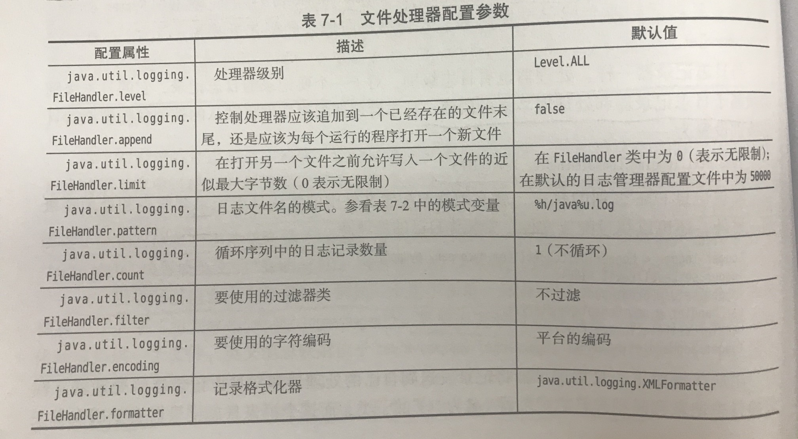

#### 7.5.6、过滤器

在默认情况下，会根据日志记录的级别进行过滤。每个日志记录器和处理器都有一个可选的过滤器来完成附加的过滤，要定义一个过滤器，需要实现Filter接口，并定义以下方法：

```java
boolean isLoggable(LogRecord record)
```

#### 7.5.7、格式化器

ConsoleHandler类可以生成文本和XML格式的日志记录。不过，你也可以自定义格式。这需要扩展Formatter类并覆盖下面的方法：

```java
String format(LogRecord record)
```

可以根据自己的需要以任何方式对记录中的信息进行格式化，并返回结果字符串。

可以对记录中的消息部分进行格式化，将替换参数并应用本地化处理：

```java
String formatMessage(LogRecord record)
```

很多文件格式需要在已格式化的记录的前后加上一个头部和尾部

```java
String getHead(Handler h)
String getTail(Handler h)
```

最后，调用setFormatter方法将格式化器安装到处理器中

#### 7.5.8、日志技巧

1. 对一个简单的应用，选择一个日志记录器
2. 默认的日志配置会把级别等于或高于INFO的所有消息记录到控制台
3. 最好只将对程序用户有意义的消息设置为几个级别

java.util.logging.Logger：

- static Logger getLogger(String name) 

- static Logger getLogger(String name, String bundleName)：

  查找或创建指定子系统的记录器，本地化消息位于名为bundleName的资源包中  

- void severe(String msg) 

- void warning(String msg) 

- void info(String msg) 

- void config(String msg) 

- void fine(String msg) 

- void finer(String msg) 

- void finest(String msg) ：
  记录一个日志记录，包含方法名指示器的级别和给定的信息
  
- void entering(String sourceClass, String sourceMethod) 

- void entering(String sourceClass, String sourceMethod, Object param1) 

- void entering(String sourceClass, String sourceMethod, Object[] params) 

- void exiting(String sourceClass, String sourceMethod) 

- void exiting(String sourceClass, String sourceMethod, Object result)

  记录一个描述进入/退出方法(有给定的参数和返回值)的日志记录

- void throwing(String sourceClass, String sourceMethod, Throwable thrown)：记录抛出异常。

- void log(Level level, String msg) 

- void log(Level level, String msg, Object param1) 

- void log(Level level, String msg, Object[] params) 

- void log(Level level, String msg, Throwable thrown) 

  记录一个有给定级别和消息的日志记录，其中包括对象或者可抛出对象。要包括对象，消息中必须包含格式化占位符{0}、{1}等

- void logp(Level level, String sourceClass, String sourceMethod, String msg)

- void logp(Level level, String sourceClass, String sourceMethod, String msg, Object param1)

- void logp(Level level, String sourceClass, String sourceMethod, String msg, Object[] params)

- void logp(Level level, String sourceClass, String sourceMethod, String msg, Throwable thrown)

  记录一个有给定级别、准则的调用者信息和消息的日志记录，其中可以包括对象或可抛出对象

- void logp(Level level, String sourceClass, String sourceMethod, Throwable thrown, Supplier<String>==9==

- void logp(Level level, String sourceClass, String sourceMethod, Supplier<String> msgSupplier)==9==

  记录一个有给定级别、准则的调用者信息、资源包和消息的日志记录，其中可以包括对象或可抛出对象

- Level getLevel()

- void setLevel(Level newLevel)

  获得和设置这个日志记录器的级别

- Logger getParent() 

- void setParent(Logger parent) 

  获得和设置这个日志记录器的父日志记录器

- Handler[] getHandlers()

  获取与此记录器关联的处理器

- void addHandler(Handler handler)

- void removeHandler(Handler handler) 

  增加或删除这个日志记录器中的一个处理器

- boolean getUseParentHandlers() 

- void setUseParentHandlers(boolean useParentHandlers) 	

  获得和设置使用父处理器属性，如果是true，日志记录器会将全部日志转发至其父处理器

- Filter getFilter() 

- void setFilter(Filter newFilter) 

  获得和设置这个日志记录器的过滤器

java.util.logging.Handler 

- abstract void publish(LogRecord record) ：发送LogRecord 
- abstract void flush()：刷新所有缓冲输出。 

- abstract void close()：刷新所有缓冲输出，并释放所有相关资源。

- Filter getFilter() 

- void setFilter(Filter newFilter) 

  获得和设置这个处理器的过滤器

- Formatter getFormatter() 

- void setFormatter(Formatter newFormatter) 

  获得和设置这个处理器的格式化器

- Level getLevel()

- void setLevel(Level newLevel)

  获得和设置这个处理器的级别

java.util.logging.ConsoleHandler 

- ConsoleHandler()：构造一个新的控制台处理器

java.util.logging.FileHandler
- FileHandler()

- FileHandler(String pattern)

- FileHandler(String pattern, boolean append)

- FileHandler(String pattern, int limit, int count)

- FileHandler(String pattern, int limit, int count, boolean append)

- FileHandler(String pattern, long limit, int count, boolean append) ==9==

  构造一个文本处理器，limit实在打开一个新日志文件之前，日志文件可以包含的近似最大字节数。count是循环序列的文件数量。如果append为true，记录则应该准假在一个已存在的日志文件末尾

java.util.logging.LogRecord

- Level getLevel() ：获取日志消息级别

- String getLoggerName()：获取源记录器的名称。

- ResourceBundle getResourceBundle()

- String getResourceBundleName()

  获取本地化资源包或包名，如果没有提供，则返回null

- String getMessage()：在本地化或格式化之前获取“原始”日志消息

- Object[] getParameters()： 获取日志消息的参数，如果没有提供，则返回null

- Throwable getThrown()： 获得所抛出的对象，如果没有提供，则返回null

- String getSourceClassName() 

- String getSourceMethodName()

  获得记录这个日志记录的代码区域。这个信息有可能是由日志记录代码提供的，也有可能是自动从运行时堆栈推测出来的。如果日志记录代码提供的值有误，或者运行时代码由于优化而无法推测出确切的位置，这两个方法的返回值就有可能不准确

- long getMillis()：自1970年以来以毫秒为单位获取创建时间

- Instant getInstant()==9==：获取创建时间，作为java.time.Instant返回

- long getSequenceNumber()：获取序列号。 

- int getThreadID()：获取创建这个日志记录的线程的唯一ID。这些ID是由LogRecord类分配的，与其他线程的ID无关

java.util.logging.LogManager 

- static LogManager getLogManager()：返回全局LogManager对象。 

- void readConfiguration() 

- void readConfiguration(InputStream ins)

  从系统属性java.util.logging.config.file指定的文件或者给定的输入流读取日志配置

- void updateConfiguration(InputStream ins, Function<String,BiFunction<String,String,String>> mapper) ==9==

- void updateConfiguration(Function<String,BiFunction<String,String,String>> mapper) )==9==

  将日志配置与系统属性java.util.logging.config.file指定的文件或给定的输入流合并

java.util.logging.Filter

- boolean isLoggable(LogRecord record)：如果给定日志记录需要记录，则返回true

java.util.logging.Formatter 

- abstract String format(LogRecord record) 格式化给定的日志记录并返回格式化的字符串。

- String formatMessage(LogRecord record) 从日志记录中本地化和格式化消息字符串。

- String getHead(Handler h) 

- String getTail(Handler h) 

  返回应该出现在包含日志记录的文档开头和结尾的字符串。Formatter超类将这些方法返回日志记录的本地化和格式化消息部分

### 7.6、调试技巧

1. 通过日志或标准输出流打印结果

2. 通过main方法测试

3. 通过Junit测试

4. 通过日志代理测试

5. 利用Trowable类的printStackTrance方法，打印出异常的堆栈轨迹

6. 通过System.err也可以打印出堆栈轨迹

7. ```java
   //捕获System.out
   java Myprogram > error.txt
   //捕获System.error
   java Myprogram 2> error.txt
   //同时捕获
   java Myprogram 1> error.txt 2>&
   ```

8. 使用静态方法setDefaultUncaughtExceptionHandler(Thread.UncaughtExceptionHandler eh) 设置当线程由于未捕获的异常而突然终止时调用的默认处理程序，并且没有为该线程定义其他处理程序。  

9. 想要观察类的加载过程，启动Java虚拟机时可以使用-verbose标志

10. -Xlint选项告诉编译器找出常见的代码问题

11. Java虚拟机增加了对Java应用程序的监控和管理支持，允许在虚拟机中安装代理来跟踪内存消耗、线程使用、类加载等情况，java自带jconsole

12. Java任务控制器是一个专业级性能分析和诊断工具

## 第八章、泛型程序设计

泛型类和泛型方法有类型参数，这是的他们可以准确地描述用特定类型实例化时会发生什么。在有泛型类之前，程序员必须使用Object编写适用于多种类型的代码。这很繁琐也很不安全

### 8.1、为什么要使用泛型程序设计

泛型程序设计意味着编写的代码可以对多种不同类型的对象重用。

#### 8.1.1、类型参数的好处

在Java中增加泛型类之前，泛型程序设计是用继承实现的。ArrayList类值维护一个Object引用的数组

这种方法存在两个问题。当获取一个值时必须进行强制类型转换

此外，这里没有错误检查。可以向数组列表中添加任何类的值，这样极有可能发生错误

泛型提供了一个更好的解决方案，**类型参数**

```java
var files = new ArrayList<String>();
```

#### 8.1.2、谁想成为泛型程序员

试想一下，Emloyee类型是Manager类型的超类，当我们想将ArrayList\<Manager\>中的所有元素添加到ArrayList\<Employee\>中，我们可以使用addAll方法，但是反之这样做就会产生错误，Java发明了**通配符类型**来解决这样的问题

### 8.2、定义简单泛型类

泛型类就是有一个或多个类型变量的类

```java
public class Pair<T> 
{
   private T first;
   private T second;

   public Pair() { first = null; second = null; }
   public Pair(T first, T second) { this.first = first;  this.second = second; }

   public T getFirst() { return first; }
   public T getSecond() { return second; }

   public void setFirst(T newValue) { first = newValue; }
   public void setSecond(T newValue) { second = newValue; }
}
```

常见的做法是类型变量使用大写字母，而且很简短。Java库使用变量E表示集合的元素类型，K和V分别表示表的键和值的类型。T(必要时还可以用相邻的字母U和S)表示任意类型

可以用具体的类型替换类型变量来实例化泛型类型，换句话说泛型类相当于普通类的工厂

```java
Pair<String> p = new Pair;
```

### 8.3、泛型方法

```java
class ArrayAlg{
    public static <T> T getMiddle(T... a){
        return a(a.length/2);
    }
}
```

注意，类型变量放在修饰符(这里的修饰符就是public static)的后面，并在返回类型的前面

泛型方法可以在普通类中定义，也可以在泛型类中定义

调用泛型方法

```java
String middle = ArrayAlg.<String> getMiddle("John","Q","Public");
//实际上<String>可以省略
String middle = ArrayAlg. getMiddle("John","Q","Public");
```

但并非所有情况都可以省略类型参数

```java
double middle = ArrayAlg. getMiddle(3.14,1234,0);
```

编译器将吧参数自动装箱为1个Double和两个Integer对象，然后寻找这些类的共同超类型

### 8.4、类型变量的限定

可以对类型变量T设置一个限定，这样就可以使用一些特定方法

```java
public static <T extends Comparable> T min(T[] a)
```

限定表示方法：

```java
<T extends BoundingType>
```

表示T应该是限定类型的子类型。T和限定类型可以是类，也可以是接口

一个类型变量或通配符可以有多个限定

```java
<T extends Comparable & Serializable>
```

限定类型用“&”分割，而逗号用来分割类型变量

### 8.5、泛型代码和虚拟机

虚拟机没有泛型类型对象，所有对象都属于普通类

#### 8.5.1、类型擦除

无论何时定义一个泛型类型，都会自动提供一个响应的原始类型。这个原始类型的名字就是去掉类型参数后泛型类型名。类型变量会被擦除，并替换为其限定类型(如果没有限定的变量则替换为Object)

如果有多个限定类型，则使用第一个限定类型作为原始类型

```java
class Interval<T extends Serializable & Comparable>
```

原始类型会用Serializable替换T，而编译器在必要时要向Comparable插入强制类型转换，所以应该将标签接口(即没有方法的接口)放在限定列表末尾

#### 8.5.2、转换泛型表达式

编写一个泛型方法调用时，如果擦除了返回类型，编译器会插入强制类型转换。

```java
Pair<Empolyee> buddies = ...;
Employee boddy = buddies.getFirst();
```

编译器把这个方法调用转换为两条虚拟机指令：

- 对原始方法Pair.getFirst的调用
- 将返回的Object类型强制转换为Employee类型

当访问一个泛型字段时，也要插入强制类型转换

#### 8.5.3、==转换泛型方法==

类型擦除也会出现在泛型方法中，但是方法的擦除带来了两个复杂的问题

```java
class DateInterval extends Pair<LocalDate>{
    public void setSecond(LocalDate second){
        if(second.compateTo(getFirst()) >= 0)
            super.setSecond(second);
    }
}
```

这条代码擦除后变成

```java
class DateInterval extends Pair{
    public void setSecond(LocalDate second){...}
    ...
}
```

但是反编译后(javap -c className)发现DateInterval中有两个setSecond方法

- setSecond(LocalDate second)
- setSecond(Object second)

```java
var interval = new DateInterval(...);
Pair<LocalDate> pair = interval;
pair.setSecend(aDate);
```

由于Pair引用一个DateInterval对象，所以应该调用DateInterval.setSecend，问题在于类型擦除与多态发生了冲突，为了解决这个问题，编译器在DateInterval类中生成了一个桥方法

```java
public void setSecond(Object second){
    setSecond((LocalDate) second);
}
```

桥方法不仅用于泛型类型，当一个方法覆盖另一个方法是，可以指定一个更严格的返回类型

```java
public class Employee implements Cloneable{
    public Employee clone() throws CloneNotSupportedExcption{...}
}
```

Object.clone Employee.clone方法被称为有协变的返回类型

总结：

- 虚拟机中没有泛型，只有普通的类和方法
- 所有的类型参数都会替换为他们的限定类型
- 会合成桥方法来保持多态
- 为保持类型安全性，必要时会插入强制类型转换

#### 8.5.4、调用遗留代码

当一个遗留类的方法想要调用最新的泛型方法时，编译器会提出一个让你确保标签内的类型对应的警告，但是我们只能人为的控制不产生错误。

我们可以用@SuppressWarnings("unchecked")来消除这个警告，这个注解会关闭对方法中所有代码的检查

### 8.6、限制和局限性

#### 8.6.1、不能用基本类型实例化类型参数

基本类型无法被类型擦除

#### 8.6.2、运行时类型查询只适用于原始类型

虚拟机中的对象总有一个特定的非泛型类型。因此，所有的类型查询只产生原始类型

同样getClass方法总是返回原始类型

#### 8.6.3、不能创建参数化类型的数组

不合法写法：

```java
var table = new Pair<String>[10]; // ✘
```

擦除之后，table的类型是Pair[]。可以把它转换为Object[]：

```java
Object[] objarray = table;
```

数组会记住它的元素类型，如果试图储存其他类型的元素，就会抛出一个ArrayStoreException异常

不过对于泛型类型，擦除会使这种机制无效，比如以下赋值

```java
objarray[0] = new Pair<Employee>(); // ✘
```

虽然能通过检查，但是仍然会导致类型错误，出于这个原因，不允许创建参数化类型的数组

需要注意的是，只是不允许创建这些数组，而声明类型为Pair\<String>[]的变量仍然合法的，不过不能用new Pair\<String>[10]初始化这个变量

```java
Pair<String>[] pairs; // ✔
Pair<String> pair1 = new Pair<>();
Pair<String> pair1 = new Pair<>();
pairs = new Pair[]{pair1, pair2};// ✔
pairs = new Pair<String>(); // ✘
```

可以声明通配类型的数组，然后强制类型转换

```java
var table = (Pair<String>[]) new Pair<?>[10];
```

不过这样是不安全的，如果在table[0]中储存一个Pair\<Employee>，然后对table[0].get.First()调用一个String方法，会得到一个ClassCastException异常

如果需要收集参数化类型对象，简单地使用ArrayList:ArrayList\<Pair\<String>>更安全、有效

#### 8.6.4、Varargs警告

```java
public static <T> void addAll(Collection<T> coll,T... ts){
    for(T t : ts)coll.add(t);
}
```

```java
Collection<Pair<String>> table = ...;
Pair<String> pair1 = ...;
Pari<String> pair2 = ...;
addAll(table,pair1,pair2);
```

为了调用addAll方法，Java虚拟机必须建立一个Pair\<String>数组，这就违反了不支持泛型的数组规则。不过虚拟机只会给你一个警告，而不是错误。

抑制这个警告有两种方法

- 方法上加上@SuppressWarnings("unchecked")
- 在java7后可以用@SafeVarargs直接注解addAll方法

对于任何只需要读取参数数组元素的方法，都可以使用@SafeVarargs，它只能用于声明static、final或==Java9==private的构造器和方法。所有其他方法都有可能被覆盖，使之没有意义

可以使用@SafeVarargs注解来消除创建泛型数组的有关限制

```java
@SafeVarargs
static <E> E[] array(E...array){
    return array;
}
Pair<String>[] table = array(pair1,pair2);

Object[] objarray = table;
objarray[0] = new Pair<Employee>();
```

但这并不能避免异常，如果无意间调用了talble[0]，还是会在其他地方产生异常

#### 8.6.5、不能实例化类型变量

不能在类似new T(...) 的表达式中使用类型变量，因为T会被直接擦除为Object，这样是没有意义的

不合法写法：

```java
public Pair(){// ✘
    first = new T();
    second = new T();
}
```

替换方案：

在Java8之后可以让调用者提供一个构造器表达式：

```java
Pair<String> p = Pair.makePair(String :: new);
//makePair方法接受一个Supplier<T>，这是一个函数式接口，表示一个无参数而且返回类型为T的函数
public static <T> Pair<T> makePair(Supplier<T> constr){
    return new Pair<>(constr.get(),constr.get());
}
```

Class类本身是泛型的。例如，String.class是一个Class\<String>的实例。因此makePair方法能够推断出所建立的对组的类型

#### 8.6.6、不能构造泛型数组

由于数组本身也带有类型，用来监控虚拟机中的数组存储。这个类型会被擦除，致使泛型无意义

不合法写法：

``` java
public static <T extends Comparable> T[] minmax(T... a){ // ✘
    T[] mm = new T[2]; 
}
```

类型擦除会让它始终构造Comparable[2]数组

解决方案：

```java
public class ListOfGenerics<T> {
    private List<T> array = new ArrayList<>();

    public void add(T item) {
        array.add(item);
    }

    public T get(int index) {
        return array.get(index);
    }
}
```

#### 8.6.7、泛型类的静态上下文中类型变量无效

不合法写法：

```java
public class Singleton<T>{// ✘
    private static T singleInstance;
    private static T getSingleInstance;
}
```


#### 8.6.8、不能抛出或捕获泛型类的实例

不合法写法：

```java
public class Problem<T> extends Exception{...}// ✘
```

```java
public static <T extends Throwable> void doWork(Class<T> t){// ✘
    try{
        do work
    }catch(T e){
        ...
    }
}
```

注意：异常规范中使用类型变量是合法的

```java
public static <T extends Throwable> void d{
    do work
}catch(Throwable realCause){
    t.iniCause(realCause);
    throw t
}
```

#### 8.6.9、可以取消对检查型异常的检查

Java异常处理的一个基本原则是，必须为所有检查型异常提供一个处理器。不过可以用泛型取消这个机制

```java
class Task{
    @SuppressWarings("unchecked")
    static <T extends Throwable> void throwAs(Throwalbe t) throws T{
        throw(T) t;
    }
}
```

如果有一个检查型异常e

```java
Task.<RuntiomeException>throwAs(e);
```

编译器就会认为e是一个非检查型异常，通过以下代码会把所有异常都转换为编译器所认为的非检查型异常

```java
try{
    do work
}catch(Throwable t){
    Task.<RuntiomeException>throwAs(t);
}
```

```java
public class Test {
    public static void main(String[] args) {
        var thread = new Thread(Task.asRunnable(() -> {
            Thread.sleep(1000);
            System.out.println();
            throw new Exception("Check this out");
        }));
        thread.run();
    }
}

interface Task{
    void run() throws Exception;

    @SuppressWarnings("unchecked")
    static <T extends Throwable> void throwAs(Throwable t) throws T{
        throw(T) t;
    }

    static Runnable asRunnable(Task task){
        return () -> {
            try {
                task.run();
            } catch (Exception e) {
                Task.<RuntimeException>throwAs(e);
            }
        };
    }
}
```

正常情况下，你必须捕获一个Runable的run方法中所有检查型异常，把它们“包装”到非检查型异常中，因为run方法声明为不抛出任何检查型异常。

不过在这里并没有做出这种“包装”。我们只是抛出异常，并“哄骗”编译器，让它相信这不是一个检查型异常

通过使用泛型类、擦除和@SuppressWarnings注解，我们就能消除Java类型系统的部分基本限制

#### 8.6.10、注意擦除后的冲突

当泛型类型被擦除后，不允许创建引发冲突的条件

不合法写法：

```java
public class Pair<T>{// ✘
    public boolean equals(T value){
        return first.equals(value) && second.equals(value);
    }
    ...
}
```

equals类型擦除后就会变成boolean equals(Object)，这与Object equals方法冲突

解决方法很简单，就是把Pair的equals方法换个名字

泛型规范说明还引用了另外一个原则：“为了支持擦除转换，我们要施加一个限制：倘若两个接口类型是同一个接口的不同参数化，一个类或类型变量就不能同时作为这两个接口类型的子类”

不合法写法：

```java
class Employee implements Comparable<Employee>{...}
class Manager extends Employee implements Comparable<Manager>{...}// ✘
```

Manager会实现Comparable\<Employee>和 Comparable\<Manager>，这是同一接口的不同参数化

### 8.7、泛型类型的继承规则

通常，Pair\<S>与Pair\<T>都没有任何关系 

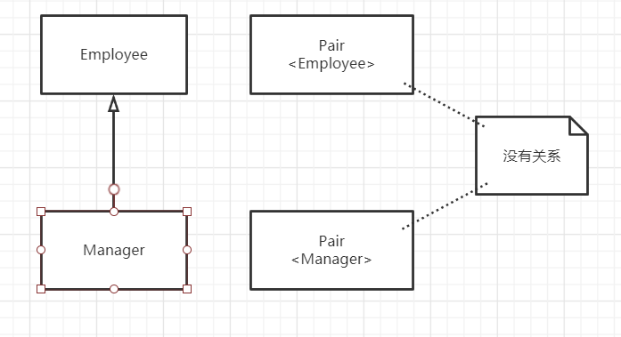

总是可以将参数化类型转换为一个原始类型。例如，Pair\<Employee>是一个原始类型Pair的一个子类型

泛型类可以扩展或实现其他的泛型类

泛型列表类型中子类型间的关系

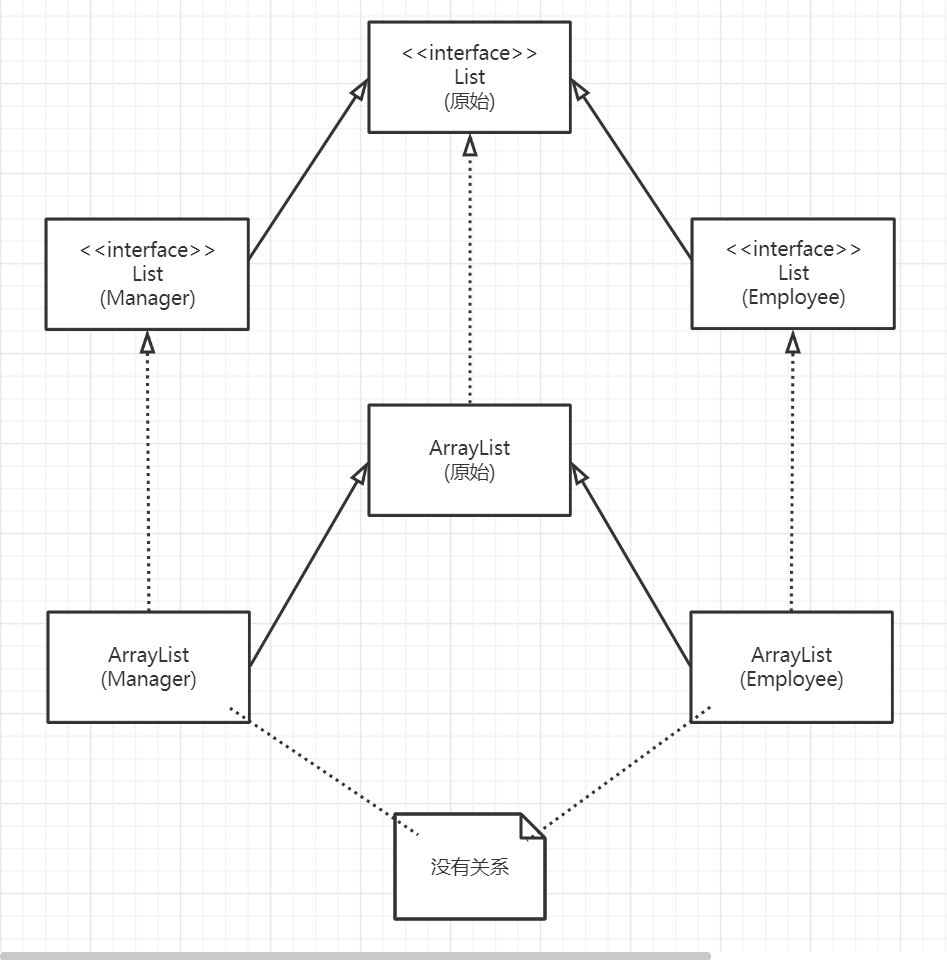

### 8.8、通配符类型

#### 8.8.1、通配符概念

在通配符类型中，允许类型参数变化

```java
Pair<? extends Employee>
```

表示任何泛型Pair类型，它的类型参数是Employee的子类，如：Pair\<Manager>

使用通配符的子类型关系

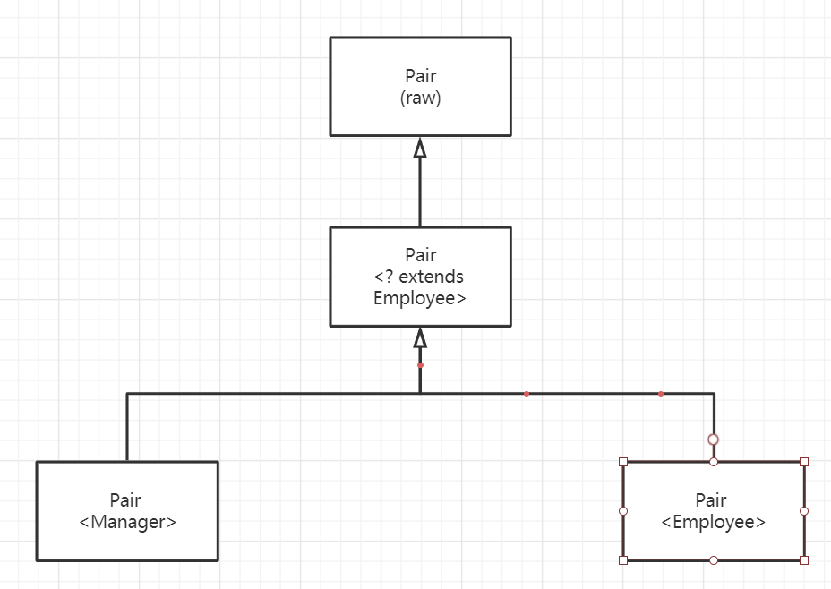

#### 8.8.2、通配符的超类型限定

通配符限定于类型变量限定十分类似，不过，通配符还可以指定一个超类型限定

```java
class Pair<? super Manager> {
    void setFirst(? super Manager);
    ? super Manager getFirst();
}
```

这个通配符限制为Manager的所有超类

带有超类型限定的通配符

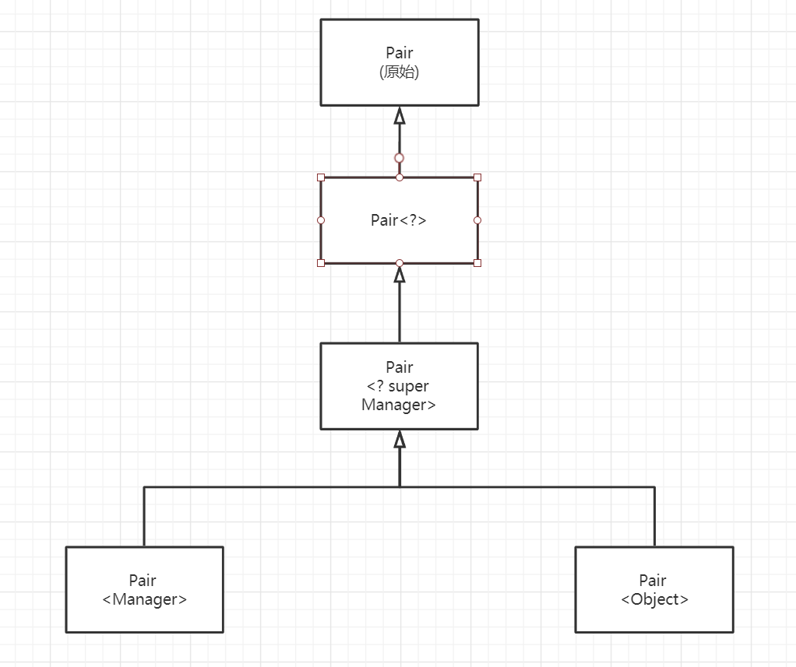

直观地讲，带有超类型限定的通配符允许你写入一个泛型对象，而带有子类型限定的通配符允许你读取一个泛型对象

超类型限定的另一种应用

```java
public static <T extends Comparable<? super T> T min(T[] a)>;
```

这样写可以声明为使用类型T的对象，或者也可以使用T的一个超类型的对象

子类型限定用法：作为一个函数式接口的参数类型，例如Conllection接口的一个方法

```java
default boolean removeIf(Predicaate<? super E> filler)
```

这个方法会删除所有满足给定谓词条件的元素

#### 8.8.3、无限定通配符

可以使用根本无限定的通配符

```java
class Pair<?>{
    ? getFirst();
    void setFirst();
}
```

getFirst的返回值只能赋给一个Object。serFirst方法不能被调用，甚至不能用Object调用，可以调用setFirst(null)。Pair\<?>和Pair本质的不同在于：可以用任意Object对象调用原始Pair类的setFirst方法

这种写法主要用于简单判断

```java
public static boolean hasNull(Pair<?> p){
    return p.getFirst() == null || p.getSecond() == null;
}
```

#### 8.8.4、通配符捕获

我们来写一个交换对组的元素

```java
public static void swap(Pair<?> p)
```

通配符不是类型变量，因此，不能在编写代码中使用“?”作为一种类型

不合法写法

```java
？ t = p.getFirst; //✘
p.setFirst(p.getSecond());
p.setSecond(t);
```

替换方案

```java
public static <T> void swapHelper(Pair<T> p){
    T t = p.getFirst();
    p.setFirst(p.getSecond());
    p.setSecond(t);
}
```

### 8.9、反射和泛型

#### 8.9.1、泛型Class类

Class类是泛型的。例如，String.class实际上是一个Class\<String>类的对象

java.lang.Class\<T>

- T newInstance()：返回无参数构造器构造的一个新实例

- T cast(Object obj)：如果obj为null或有可能转换成类型T，则返回obj；否则抛出一个BadCastException异常

- T[] getEnumConstants()：如果T是枚举类型，则返回所有值组成的数组，否则返回null

- Class<? super T> getSuperclass()：

  返回这个类的超类，如果T不是一个类或Object类，则返回null

- Constructor\<T> getConstructor(Class<?>... parameterTypes) 

- Constructor\<T> getDeclaredConstructor(Class<?>... parameterTypes) 

  获得公共构造器，或者有给定参数类型的构造器

java.lang.reflect.Constructor\<T>

- T newInstance(Object... parameters)：返回用指定参数构造的新实例

#### 8.9.2、使用Class\<T>参数进行类型匹配

```java
public static <T> Pair<T> makePair(Class<T> c)throws InstantiationException
    ,IllegalAccessException{
    return new Pair<>(c.newInstance(),c.newInstance());
}
```

当我们如下调用

```java
makePair(Employee.class)
```

Employee.class实际上是Class\<Employee>类型的对象。makePair方法的类型参数T同Employee匹配，编译器可以推断出这个方法将返回一个Pair\<Employee>

#### 8.9.3、虚拟机中的泛型类型信息

可以使用反射API来确定

- 这个泛型方法有一个名为T的类型参数
- 这个类型参数有一个子类型限定，其自身优势一个泛型类型
- 这个限定类型有一个通配符参数
- 这个通配符参数有一个超类型限定
- 这个泛型方法有一个泛型数组参数

你可以重新构造实现者声明的泛型类和方法的所有有关内容。但是，你不会知道对于特定的对象或方法调用会如何解析类型参数

为了表述泛型类型的声明，可以使用java.lang.reflect包中的接口Type。这个接口包含以下子类型：

- Class类，描述具体类型
- TypeVariable接口，描述类型变量( 如：T extends Comparable\<? super T>)
- WildcardType接口，描述通配符 (如： ？ super T)
- ParameterizedType接口，描述泛型类或接口类型 (如：Comparable<? super T>)
- GemericArrayType接口，描述泛型数组 (如： T[])

Type接口及其子类

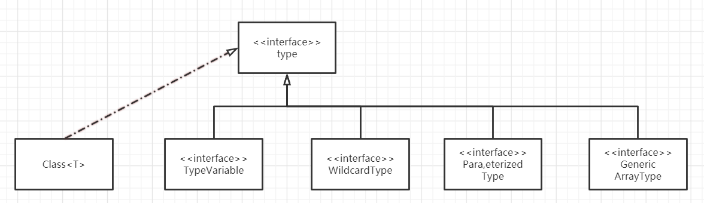

####  8.9.4、类型字面量

如果希望由值的类型决定程序的行为，比如：

```java
ArrayList<Integer>
ArrayList<String>
```

我们希望这两个类型能有不同的动作，但是虚拟机进行类型擦除，使这两个类都擦除为原始类型ArrayList，解决这一问题的方案就是通过捕获Type接口的一个实例。然后构造一个匿名子类

```java
class TypeLiteral{
    public TypeLiteral(){
        Type parentType = getClass().getGenericSuperclass();
        if (parentType instanceof ParameterizedType){
            type = ((ParameterizedType) parentType).getActualTypeArguments()[0];
        }else{
            throw new UnsupportedOperationExcption
                ("Construct as new TypeLiteral<...>(){}");
        }
    }
}
```


java.lang.Class\<T>

- TypeVariable[] getTypeParameters()：

  如果这个类型被声明为泛型类型，则获得泛型类型变量，否则获得一个长度为0的数组

- Type getGenericSuperclass() :

  获得这个类型所声明超类的泛型类型；如果这个类型是Object或者不是类类型(class type),则返回null

- Type[] getGenericInterfaces() ：

  获得这个类型所声明接口的泛型类型(按照声明的次序)，否则，如果这个类型没有实现接口，则返回长度为0的数组

java.lang.reflect.Method:

- TypeVariable[] getTypeParameters():

  如果这个方法被声明为一个泛型方法，则获得泛型类型变量，否则返回长度为0的数组

- Type getGenericReturnType() :

  获得这个方法声明的泛型返回类型

- Type[] getGenericParameterTypes() ：

  获得这个方法声明的泛型参数类型。如果这个方法没有参数，返回长度为0的数组

java.lang.reflect.TypeVariable

- String getName()：获得这个类型变量的名字
- Type[] getBounds()：获得这个类型变量的子类限定，否则，如果该变量无限定，则返回长度为0的数组。

java.lang.reflect.WildcardType

- Type[] getUpperBounds()：

  获得这个类型变量的子类型(extends)限定，否则，如果没有子类型限定，则返回长度为0的数组

- Type[] getLowerBounds() 

  获得这个类型变量的超类(super)限定，否则，如果没有子类型限定，则返回长度为0的数组

java.lang.reflect.ParameterizedType

- Type getRawType() ：获得这个参数化类型的原始类型

- Type[] getActualTypeArguments() ：

  获得这个参数化类型声明的类型参数

- Type getOwnerType()：

  如果是内部类型，则返回其内外部类类型；如果是一个顶级类型，则返回null

java.lang.reflect.GenericArrayType

- Type getGenericComponentType() ：

  获得这个数组类型声明的泛型元素类型

## 第九章、集合

### 9.1、Java集合框架

#### 9.1.1集合接口与实现分离

与现代的数据结构类库的常见做法一样，Java集合类库也将接口与实现分离

队列接口指出可以在队列的尾部添加元素，在队列的头部删除元素，并且可以查找队列中元素的个数。当需要收集对象，并按照“先进先出”方式检索对象是就应该使用队列

队列通常有两种实现方式：

- 循环数组
- 链表

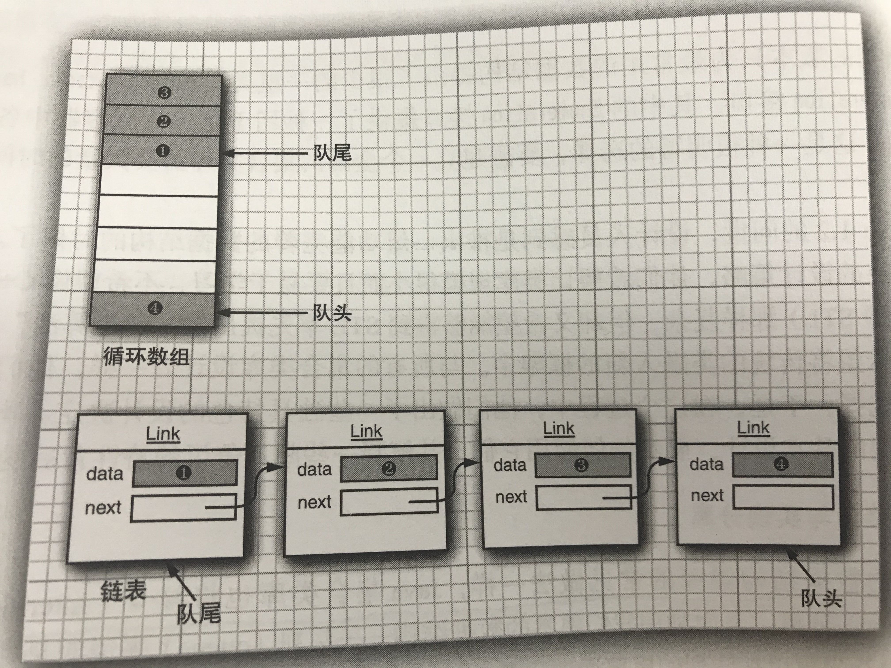

循环数组效率要比链表更高效，不过循环数组是一个有界集合，即容量有限。如果程序中要收集的对象数量没有上限，就最好使用链表来实现

#### 9.1.2、Collection接口

集合类的基本接口是Collection接口。这个接口有两个基本方法

```java
public interfacle Collection<E>{
    boolean add(E element);
    Iterator<E> iterator();
    ...
}
```

add方法用于向集合中添加元素。如果添加元素确实改变了集合就返回true；反之则返回false

iterator方法用于返回一个实现了Iterator接口的对象。可以使用这个迭代器对象依次访问集合中的元素

#### 9.1.3、迭代器

Iterator接口包含4个方法

```java
public interface Iterator<E> {
    boolean hasNext();
    E next();
    default void remove {
        throw new UnsupportedOperationException("remove");
    }
    default void forEachRemaining(Consumer<? super E> action) {
        Objects.requireNonNull(action);
        while (hasNext())
            action.accept(next());
    }
}
```

通过反复调用next方法，可以逐个访问集合中的每个元素。但是，如果到达了集合的末尾，next方法将抛出一个NoSuchElementException。因此，需要在调用next之前调用hahNext方法。如果迭代器对象还有多个可以访问的元素，这个方法就返回true。如果想要查看集合中的所有元素，就请求一个迭代器，当hasNext返回true时就反复地调用next方法

编译器简单地将“for each”循环转换为带有迭代器的循环

"for each"循环可以处理任何实现了Iterable接口的对象，这个接口只包含一个抽象方法

```java
public interface Iterable<E>{
    Iterator<E> Iterator();
}
```

Collection接口扩展了Iteravle接口。因此，对于标准类库中的任何集合都可以使用“for each”循环。

也可以调用forEachRemaining方法并提供一个lambda表达式。将对迭代器的每一个元素调用这个lambda表达式，直到再没有元素为止

```java
Iterator.forEachRemaining(element -> do somthing with element);
```

可以认为Java迭代器位于两个元素之间，当调用next时，迭代器就会越过下一个元素，并返回刚刚越过的那个元素的引用。

Iterator接口的remove方法将会删除上次调用的next方法时返回的元素，如果调用remove之前没有调用next，将是不合法的

#### 9.1.4、泛型实用方法

java.util. Collection\<E>

- Iterator\<E> iterator()：返回一个用于访问集合中各个元素的迭代器

- int size()：返回当前存储在集合中的元素个数

- boolean isEmpty()：如果集合中没有元素，则返回true

- boolean contains(Object o)：

  如果集合中包含了一个与obj相等的对象，返回true

- boolean containsAll(Collection<?> c)：

  如果这个集合包含other集合中的所有元素，返回true

- boolean add(E element)：

  将一个元素添加到集合中。如果由于这个调用改变了集合，返回true

- boolean addAll(Collection<? extends E> other)：

  将other集合中的所有元素添加到这个集合。如果由于这个调用改变了集合，返回true

- boolean remove(Object obj) ：

  从这个集合中删除等于obj的对象。如果有匹配的对象被删除。返回true

- boolean removeAll(Collection<?> c) 

  从这个集合中删除other集合中存在的所有元素。如果由于这个调用改变了集合，返回true

- default boolean removeIf(Predicate<? super E> filter) ==8==：

  从这个集合删除filter返回true的所有元素。如果由于这个调用改变了集合，返回true

- void clear() ：从这个集合中删除所有的元素。

- boolean retainAll(Collection<?> other)：

  从这个集合中删除所有与other集合中元素不同的元素。如果由于这个调用改变了集合，返回true

- Object[] toArray() ：返回这个集合中的对象的数组

- \<T> T[] toArray(T[] arrayToFill)：

  返回这个集合中的对象的数组。如果arrayToFill足够大，就将集合中的元素填入这个数组中。剩余空间填补null；否则，分配一个新数组，其成员类型与arrayTofiil的成员类型相同，其长度等于集合的大小，并填充集合元素

java.util.Iterator\<E>

- boolean hasNext() ：

  如果存在另一个可访问的元素，返回true。

- E next()：

  返回将要访问的下一个对象。如果已经到达了集合的末尾，将抛出一个NoSuchElementException

- default void remove()：

  删除上次访问的对象。这个方法必须紧跟在访问一个元素之后执行。如果上次访问之后集合已经发生了变化，这个方法将抛出一个IllegalStateException

- default void forEachRemaining(Consumer<? super E> action)==8==：

  访问元素，并传递到指定的动作，直到在没有更多元素，或者这个动作排除一个异常

### 9.2、集合框架中的接口

集合框架的接口

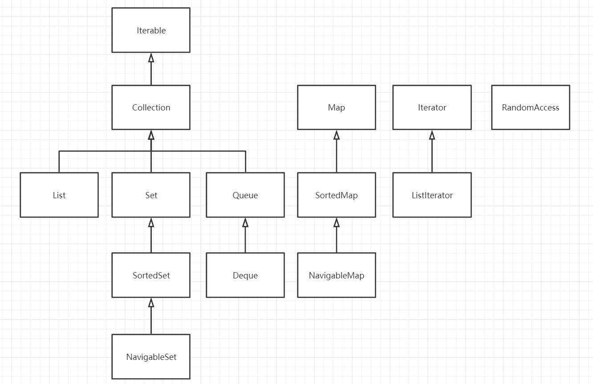

 集合有两个基本接口：Conllection和Map，在集合中插入元素

`boolean add(E element)`

映射集合包含键/值对，所以要用put方法来插入

`v put(Key,V value)`

从集合读取元素，可以用迭代器访问元素，映射集合中读取值则要使用get方法

`V get(K key)`

List是一个有序集合，元素会增加到容器中特定位置，有两种方式访问元素：

- 使用迭代器访问
- 使用一个整数索引来访问

使用整数索引来访问被称为随机访问

List接口定义了多个用于随机访问的方法

```java
public interface List<E> extends Collection<E> {
    void add(int index, E element);
    E remove(int index);
    E get(int index);
    E set(int index, E element);
}
```

ListIterator接口是Iterator的一个字接口。它定义了一个方法用于在迭代器位置前面增加一个元素

```java
void add(E element)
```

Set接口等同于Collection接口，不过其方法的行为有更严谨的定义。集(set)的add方法不允许正价重复的元素。要适当定义集的equals方法：只要两个集包含同样的元素就认为它们是相等的，而不要求这些元素有同样的顺序。hashCode方法的定义要保证包含相同元素的两个集会得到相同的散列码

### 9.3、具体集合

| 集合类型        | 描述                                         |
| --------------- | -------------------------------------------- |
| ArrayList       | 可以动态增长和缩减的一个索引序列             |
| LinkedList      | 可以在任何位置高效插入和删除的一个有序序列   |
| ArrayDeque      | 实现为循环数组的一个双端队列                 |
| HashSet         | 没有重复元素的一个无序集合                   |
| TreeSet         | 一个有序集                                   |
| EnumSet         | 一个包含枚举类型值的集                       |
| LinkedHashSet   | 一个可以记住元素插入次序的集                 |
| PriorityQueue   | 允许高效删除最小元素的一个集合               |
| HashMap         | 存储键/值关联的一个数据结构                  |
| TreeMap         | 键有序的一个映射                             |
| EnumMap         | 键数据枚举类型的一个映射                     |
| LinkedHashMap   | 可以记住键/值项添加次序的一个映射            |
| WeakHashMap     | 值不会再别处使用时就可以被垃圾回收的一个映射 |
| IdentityHashMap | 用==而不是用equals比较键的一个映射           |

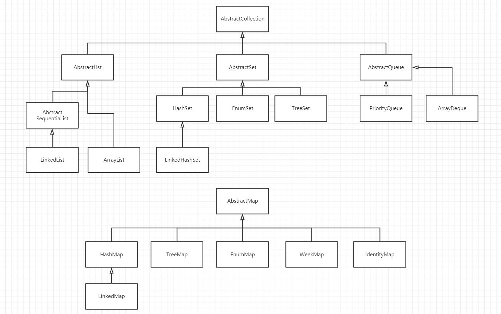

#### 9.3.1、链表

从数组中间删除一个元素开销很大，因为数组中未予被删除元素之后的所有元素都要向数组的前端移动。在数组中插入一个元素也是如此。

链表不存在这样的问题，因为链表是将每个对象存放在单独的链接中。每个链接还存放着序列中下一个链接的引用。java中，所有链表实际上都是双向链接的，即每个链接还存放着器前驱的引用

从链表中间删除一个元素是一个很轻松的操作，只需要更新所删除元素周围的链接即可

链表是一个有序集合。LinkedList.add方法将对象添加到链表的尾部。但是，常常需要将元素添加到链表的中间。由于迭代器描述了集合中的位置，所以这种依赖于位置的add方法将有迭代器负责。只有对自然有序的集合使用迭代器添加元素才有意义

集合类库提供了一个Iterator的子接口ListIterator，其中包含add方法，用于使用迭代器对有序集合添加元素

```java
interface ListIterator<E> extends Iterator<E>{
    void add(E element);
}
```

与Collection.add方法不同，这个方法不返回boolean类型的值，它假定add操作总会改变链表

ListIterator接口有两个方法可用来反向遍历链表：

```java
interface ListIterator<E> extends Iterator<E>{
    E previous();
    boolean hasPrevious();
}
```

与next方法一样，previous方法返回越过的对象。

LinkedList类的listIterator方法返回一个实现了ListIterator接口的迭代器对象。

```java
LinkedIterator<String> iter = staff.listIterator();
```

add方法在迭代器位置之前添加一个新对象，如果多次调用add方法，将按照提供的次序把元素添加到链表中。它们被依次添加到迭代器当前位置之前。

当用一个刚由listIterator方法返回并指向链表表头的迭代器调用add操作时，新添加的元素将变成列表的新表头。当迭代器越过链表的最后一个元素是，添加的元素将成为列表的新表尾，这就意味着可添加的位置为元素个数的n+1个位置

remove始终删除的是迭代器越过的对象，具体来说调用next后，remove删除的是迭代器前的元素，调用previous后，remove删除的是迭代器后的元素

set方法用一个新的元素替换调用next或previous方法返回的上一个元素

如果一个迭代器发现他的集合被另一个迭代器修改了，或者被该集合自身的某个方法修改了，就会抛出一个ConcurrentModificationException异常

避免发生并发修改异常的规则：可以根据需要为一个集合关联多个迭代器，前提是这些迭代器只能读取集合。或者，可以再关联一个能同时读写的迭代器

集合可以跟踪更改操作的次数，每个迭代器都会为它负责的更改操作维护一个单独的更改操作数。在每个迭代器方法的开始处，迭代器都会检查它自己的更改操作数是否与集合的更改操作数相等，如果不相等则抛出ConcurrentModificationException异常

链表值跟踪对列表的结构性修改，set方法不被视为结构性修改

LinkedList类的get方法用来方位某个特定元素，不过这个方法效率不太高，如果频繁使用get方法，建议使用ArrayList类

get方法做了一个微小的优化：如果索引大于等于size()/2，就从列表末尾开始搜索元素

列表迭代器接口有两个方法提供当前迭代器位置的索引，迭代器指向的是两个元素之间的位置，nextIndex方法返回下次调用next方法所返回元素的整数索引，previousIndex方法返回下次调用previous方法所返回元素的整数索引

如果有一个整数索引n， list.listInterator(n)将返回一个迭代器，这个迭代器指向索引为n的元素前面的位置

java.util.Interface List\<E>

- ListIterator\<E> listIterator() ：

  返回一个列表迭代器，用来访问列表中的元素

- ListIterator\<E> listIterator(int index)：

  返回一个列表迭代器，用来访问列表中的元素，第一次调用这个迭代器的next会返回给定索引的元素

- void add(int i,E element)：在给定位置添加一个元素

- boolean addAll(int i, Collection<? extends E> elements) ：

  将一个集合中的所有元素添加到给定位置

- E remove(int i)：删除并返回给定位置的元素

- E get(int i)：获取给定位置的元素

- E set(int i, E element)：用一个新的元素替换给定位置的元素，并返回原来那个元素

- int indexOf(Object element)：

  返回与指定元素相等的元素在列表中第一次出现的位置，如果没有这样的元素将返回-1

- int lastIindexOf(Object element)：

  返回与指定元素相等的元素在列表中最后一次出现的位置，如果没有这样的元素将返回-1

java.util.ListIterator\<E>

- void add(E newElement) ：在当前位置前添加一个元素

- void set(E newElement) ：

  用新元素替换next或previous访问的上一个元素。如果在上一个next或previous调用之后列表被修改了，将抛出一个IllegalStateException异常

- boolean hasPrevious() ：

  当反向迭代列表时，如果还有可以访问的元素，返回true

- E previous() ：

  返回前一个对象。如果已经到达了列表的头部，就抛出一个NoSuchElementException异常

- int nextIndex() ：

  返回下一次调用next方法是将返回的元素的索引

- int previousIndex()：

  返回笑一次调用previous方法是将返回的元素的索引

java.util.LinkedList\<E>

- LinkedList()：构造一个空链表

- LinkedList(Collection<? extends E> elements)：

  构造一个链表，并将集合中所有的元素添加到这个链表中

- void addFirst(E element)

- void addLast(E element)：

  将某个元素添加到列表的头部或尾部

- E getFirst()

- E getLast()：

  返回列表头部或尾部的元素

- E removeFirst() 

- E removeLast() 

  删除并返回列表头部或尾部的元素

#### 9.3.2、数组列表

ArrayList是Java集合类库提供的一个对象数组，这个类也实现了List接口，相比LinkedList，调用get和set方法更快，ArrayList封装了一个动态再分配的对象数组。

Vector类的所有方法都是同步的

#### 9.3.3、散列集

散列集：散列集可以用于快速地查找对象。散列表为每个对象计算整数，称为散列码。散列码是由对象的实例字段得出的一个整数。更准确地说，有不同数据的对象将产生不同的散列码。

如果定义自己的散列集类，需要实现自己的hashCode方法，hashCode方法应该与equals方法兼容，即如果a.equals(b)为true，a与b必须有相同的散列码。

散列表用链表数组实现。每个列表被称为桶。要想查找表中对象的位置，就要先计算它的散列码，然后与桶的总数取余，所得到的结果就是保存这个元素的桶的索引

有时候会遇到同已经被填充的情况。这种现象被称为散列冲突。这时，需要将新对象与桶中的所有对象进行比较，查看这个对象是否已经存在

在java8中，桶满时会从链表变为平衡二叉树

如果想更多地控制散列表的性能，可以指定一个初始的桶数。同属是指用于手机有相同散列值的桶的数目。如果要插入到散列表中的元素太多，就会增加冲突数量，降低检索性能。

如果大致知道最终会有多少个元素要插入到散列表中，就可以设置桶数。通常，将桶数设置为预计元素个数的75%~150%

如果散列表太满，就需要再散列。如果要对散列表再散列，就需要创建一个桶数更多的表，并将所有元素插入到这个新表中，然后丢弃原来的表。装填因子可以确定合适对散列表进行再散列。

散列表可以实现集类型，集是没有重复元素的元素集合。集的add方法首先在这个这个集中查找要添加的对象，如果不存在，就添加这个对象

Java集合类库提供了一个HashSet类，它实现了基于散列表的集。可以用add方法添加元素。contains方法已经被重新定义，用来快速查找某个元素是否已经在集中。它只查看一个桶中的元素，而不必查看集合中的所有元素。

散列集迭代器将以此访问所有的桶。由于散列将元素分散在表中，所以会以一种看起来随机的顺序访问元素。只有不关心集合中元素的顺序时才应该使用HashSet

java.util.HashSet\<E>

- HashSet()：构造一个空散列集

- HashSet(Collection<? extends E> elements)：

  构造一个散列集，并将集合中的所有元素添加到这个散列集中

- HashSet(int initialCapacity)：

  构造一个空的具有指定容量(桶数)的散列集。

- HashSet(int initialCapacity, float loadFactor)：

  构造一个有指定容量和装填因子(0.0~1.0之间的一个数，确定散列表填充的百分比，当大于这个百分比时，散列表进行再散列)的空散列集

java.lang.Object

- int hashCode()：
- 返回这个对象的散列码。散列码可以是任何整数，包括正数或负数。equals和hashCode的定义必须兼容，即如果x.equals(y)为true，x.hashCode()必须等于y.hashCode()

#### 9.3.4、树集

树集是一个有序集合。可以以任意顺序将元素插入到集合中。在对数据进行遍历是，值将自动地按照排序后的顺序呈现。

将元素添加到树种要比添加到散列表中慢，但是与检查数组或链表中的重复元素相比，使用树会快很多

树的排序必须是全序。也就是说，在任意两个元素都必须是可比的，并且只有在两个元素相等时结果才为0

java.util.TreeSet\<E>

- TreeSet()：构造一个空树集

- TreeSet(Comparator<? super E> comparator)：

  构造一个空树集，根据指定比较器进行排序

- TreeSet(Collection<? extends E> elements)

- TreeSet(SortedSet\<E> s)：

  构造一个树集，并增加一个集合或有序集中的所有元素(对于后一种情况，要使用同样的顺序)

java.util.SortedSet\<E>

- Comparator<? super E> comparator() ：

  返回用于对元素进行排序的比较器。如果元素用于Comparable接口的compareTo方法进行比较则返回null

- E first()

- E last()

  返回有序集合中的最小元素或最大元素

java.util.NavigableSet\<E>

- E hegher(E value)

- E lower(E value)

  返回大于value的最小元素或小于value的最大元素，如果没有这样的元素则返回null

- E ceiling(E value)

- E floor(E value)

   返回大于等于value的最小元素或小于等于value的最大元素，如果没有这样的元素则返回null

- E pollFirst()

- E pollLast()

  删除并返回这个集中的最大元素或最小元素，这个集为空时返回null

- Iterator\<E> descendingIterator() ：

  返回一个按照递减顺序遍历集中元素的迭代器

#### 9.3.5、队列与双端队列

队列允许你高效地在尾部添加元素，并且在头部删除元素。双端队列(即deuqe)允许在头部和尾部都高效地添加或删除元素。不支持在队列中间添加元素。ArrayDeque和LinkedList实现了Deque接口。这两个类都可以提供双端队列，其大小可以根据需要扩展。

java.util.Queue\<E>

- boolean add(E element)

- boolean offer(E element)

  如果队列没有满，将给定的元素添加到这个队列的队尾并返回true。如果队列已满，第一个方法将抛出一个IllegalStateException，而第二个方法返回false。

- E remove()

- E poll()

  假如队列不为空，删除并返回这个队列队头的元素。如果队列是空的，第一个方法抛出NoSuchElementException，而第二个方法返回null

- E element()

- E peek()

  如果队列不为空，返回这个队列队头的元素，但不删除。如果队列空，第一个方法将抛出一个NoSuchElementException异常，而第二个方法返回null

java.util.Deque\<E>

- void addFirst(E e) 

- void addLast(E e) 

- boolean offerFirst(E e) 

- boolean offerLast(E e) 

  将给定的对象添加到双端队列的队头或队尾。如果这个双端队列已满，前面两个方法将抛出一个IllegalStateException，而后面两个方法返回false

- E removeFirst() 

- E removeLast() 

- E pollFirst() 

- E pollLast() 

  如果这个双端队列不为空，删除并返回双端队列队头的元素。如果双端队列为空，前面两个方法将抛出一个NosuchElementException，而后面两个方法返回null

- E getFirst() 

- E getLast() 

- E peekFirst() 

- E peekLast() 

  如果这个双端队列非空，返回双端队列队头的元素，但不删除。如果双端队列为空，前面两个方法将抛出一个NosuchElementException，而后面两个方法返回null

#### 9.3.6、优先队列

优先队列中的元素可以按照任意的顺序插入，但会按照有序的顺序进行检索。也就是说，无论何时调用remove方法，总会获得当前优先队列中最小的元素。优先队列并没有对所有元素进行排序

优先队列使用了一个数据结构，称为堆。堆是一个可以自组织的二叉树，其添加和删除操作可以让最小元素移动到根，而不必话费时间对元素进行排序。

优先队列即可以保存实现了Comparable接口的类对象，也可以保存构造器中提供的Comparator对象

java.util.PriorityQueue

- PriorityQueue()

- PriorityQueue(int initialCapacity) 

  构造一个存放Comparable对象的优先队列

- PriorityQueue(int initialCapacity, Comparator<? super E> comparator) 

  构造一个优先队列，并使用指定的比较器对元素进行排序

### 9.4、映射

当我们知道某些关键信息，希望查找预支关联的元素，就需要映射这种数据结构。映射用来存放键/值对。如果提供了键，就能够查找到值

#### 9.4.1、基本映射操作

Java类库为映射提供了两个通用的实现：HashMap和TreeMap。这两个类都实现了Map接口

散列映射对键进行散列，树映射根据键值的顺序将元素组织为一个搜索树。散列或比较函数只应用于键。与键关联的值不进行散列或比较

每当往映射中添加一个对象时，必须同时提供一个键

如果映射中没有存储给定键对应的信息，get将返回null

null返回值可能并不方便。有时对应没有出现在映射中的键，可以使用一个好的默认值。然后使用getOrdefault方法

键必须是唯一的。不能对同一个键存放两个值。如果对同一个键调用两次put方法，第二个值就会取代第一个值，put会返回与这个键参数关联的上一个值

remove方法从映射中删除给定键对应的元素。size方法返回映射中的元素数

要迭代处理映射的键和值，最容易的方法是是使用forEach方法。可以提供一个接收键和值的lambda表达式。映射中的每一项会依序调用这个表达式

```java
scores.foreach((k,v) -> System.out.println("key=" +k+ "，value" +v));
```

java.util.Map<K,V>

- V get(Object key)：

  获取与键关联的值；返回与键关联的对象，或者如果映射中没有这个对象，则返回null。实现类可以禁止键为null

- default V getOrDefault(Object key, V defaultValue) ：

  获得与键关联的值；返回与键关联的对象，或者如果未在映射中找到这个键，则返回defaultValue

- V put(K key,V value)：

  将关联的一对键和值放到映射中。如果这个键已经存在，新的对象将取代与这个键关联的就对象。这个方法将返回键关联的旧值。如果之前没有这个键，则返回null。实现类可以禁止键或值为null

- void putAll(Map<? extends K,? extends V> entries)：

  将给定映射中的所有映射条目添加到这个映射中

- boolean containsKey(Object key) ：如果在映射中已经有这个键，返回true

- boolean containsValue(Object value) ：如果在映射中已经有这个值，返回true

- default void forEach(BiConsumer<? super K,? super V> action) ==8==

  对这个映射中的所有键/值对应用这个动作

java.util.HashMap<K,V> 

- HashMap()

- HashMap(int initialCapacity)

- HashMap(int initialCapacity, float loadFactor)

  用给定的容量和装填因子构造一个空散列映射(装填因子是一个0.0~1.0之间的数。这个数决定散列表填充的百分比。一旦到了这个比例，就要将其再散列到更大的散列表中)。默认的装填因子是0.75

java.util.TreeMap<K,V> 

- TreeMap()：

  为实现Comparable接口的键构造一个空的树映射

- TreeMap(Comparator<? super K> c)：

  构造一个树映射，并使用一个指定的比较器对键进行排序

- TreeMap(Map<? extends K,? extends V> entries)：

  构造一个树映射，并将某个映射中的所有映射条目添加到树映射中

- TreeMap(SortedMap<K,? extends V> entries)：

  构造一个树映射，将某个有序映射中的所有映射条目添加到树映射中，并使用给定的有序映射相同的比较器

java.util.SortedMap<K,V>

- Comparator<? super K> comparator() ：

  返回对键进行排序的比较器。如果键是用Comparable接口的compateTo方法进行比较，则返回null

- K firstKey() 

- K lastKey()

  返回映射中的最小或最大键

#### 9.4.2、更新映射条目

当我们想要更新映射条目，一般获取与键关联的原值，将这个值更新之后，再放回更新后的值。

```java
counts.put(word,counts.get(word)+1);
```

但是，如果我们第一次看到这个键word时，get方法会返回null，因此会出现一个NullPointerException异常

解决这个问题的方法就是使用getOrDefault方法：

```java
counts.put(word,counts.getOrdefault(word,0)+1);
```

另一个方法是首先调用putIfAbsent方法。只有当键原先存在(或者映射到null)时才会放入一个值

```java
counts.putIfAbsent(word,0);
counts.put(word,counts.get(word)+1);
```

merge方法可以简化一部分操作

```java
counts.merge(word,1,Integer::sum);
```

java.util.Map<K,V>

- default V merge(K key, V value, BiFunction<? super V,? super V,? extends V> remappingFunction) ==8==：

  如果key与一个非null值v关联，将函数应用到v和value，将key与结果管理那，或者如果结果为null，则删除这个键，否则，将key与value关联，返回get(key)

- default V compute(K key, BiFunction<? super K,? super V,? extends V> remappingFunction) ==8==：

  将函数应用到key和get(key)。将key与结果关联，或者如果结果为null，则删除这个键。返回get(key)

- default V computeIfPresent(K key, BiFunction<? super K,? super V,? extends V> remappingFunction) ==8==

  如果key与一个非null值v关联，将函数应用到key和v，将key与结果关联，或者如果结果为null，则删除这个键，返回get(key)

- default V computeIfAbsent(K key, Function<? super K,? extends V> mappingFunction)==8==：

  将这个函数应用到key，除非key与一个非null值关联。将key与结果关联，或者如果结果为null，则删除这个键。返回get(key)

- default void replaceAll(BiFunction<? super K,? super V,? extends V> function)==8==

  在所有映射条目上应用这个函数。将键与非null结果关联，对于null结果，则将相应的键删除

- default V putIfAbsent(K key, V value)==8==：

  如果key不存在或者与null关联，则将它与value关联，并返回null。否则返回关联的值

#### 9.4.3、映射视图

集合框架框架不认为映射本身是一个集合，所以Map接口没有继承Collection接口，但是可以得到映射的视图，视图是实现了Collection接口或某个子接口的对象。

有三种视图：键集、值集合以及键/值对集

```java
Set<String> keySet();//键集
Collection<V> values();//值集合
Set<Map.Entry<K,V>> entrySet();//键/值对集
```

keySet不是HashSet或TreeSet，而是实现了Set接口的另外某个类的对象。Set接口扩展了Collection接口。因此可以像使用任何集合一样使用keySet

例如，可以枚举一个映射的所有键：

```java
Set<String> keys = map.keySet();
for(String key : keys){
    do something with key;
}
```

如果想同时查看键和值，可以通过枚举映射条目来避免查找值

```java
for(Map.Entry<String,Employee> entry : staff.entrySet()){
    String k = entry.getKey();
    Employee v = entry.getValue();
    System.out.println(k);
    System.out.println(v);
}

staff.forEach((String k,Employee v) -> {
    System.out.println(k);
    System.out.println(v);
});
```

如果在链集视图上调用迭代器的remove方法，实际上会映射中删除这个键和与它关联的值。不过，不能像键集视图中添加元素，如果调用add方法，会抛出UnsupportedOperationException。映射条目集视图也不能添加元素

java.util.Map<K,V>

- Set<Map.Entry<K,V>> entrySet() ：

  返回Map.Entry对象(映射中的键/值对)的一个集视图。可以从这个集中删除元素，它们将从映射中删除，但是不能添加任何元素。

- Set\<K> keySet() ：

  返回映射中所有键的一个集视图。可以从这个集中删除元素，键和相关联的值将从映射中删除，但是不能添加任何元素。

- Collection\<V> values() ：

  返回映射中所有值的一个集合视图。可以从这个集合中删除元素，所删除的值及相应的键将从映射中删除，但是不能添加任何元素。

java.util.Map.Entry<K,V>

- K getKey()

- V getValue()

  返回这个映射条目的键或值

- V setValue(V newValue)

  将相关映射中的值改为新值，并返回原来的值

#### 9.4.4、弱散列映射

WeakHashMap是若散列映射，当对键的唯一引用来自散列表映射条目是，这个数据结构将与垃圾回收器协同工作一起删除键/值对

WeakHashMap使用弱引用WeakReference保存键。WeakReference对象将包含另一个对象的引用，在这里，就是一个散列表键。对于这种类型的对象，垃圾回收器采用一种特有的方式进行处理。正常情况下，如果垃圾回收器发现某个特定的对象已经没有他人引用了，就将其回收。然而，如果某个对象只能由WeekReference引用，垃圾回收器也会将其回收，但会将引用这个对象的弱引用放入一个队列。WeakHashMap将周期性的检查队列，以便找出新添加的弱引用。一个弱引用进入队列以为着这个键不在被他人使用，并且已经回收。于是，WeakHashMap将删除相关联的映射条目。

#### 9.4.5、链接散列集与映射

LinkedHashSet和LinkedMap类会记住插入元素项的顺序。这样就可以避免散列表中的项看起来顺序是随机的。在表中插入元素项时，就会并入到双向链表中

链接散列映射可以使用访问顺序而不是插入顺序来迭代处理映射条目。每次调用get或put时，受到影响的项将从当前位置删除，并放到项链表的尾部(只影响项在链表中的位置，而散列表中的桶不会受影响。映射条目总是在键散列码对应的桶中)

```java
LinkedHashMap<K,V>(initialCapacity,loadFactor,true)
```

访问顺序对于实现缓存的“最近最少使用”原则十分重要。

我们可以构造LinkedHashMap的一个子类，然后覆盖removeEldestEntry方法，这样就能实现将老元素删除的功能

```java
protected boolean removeEldestEntry(Map.Entry<K,V> eldest) 
```

每当这个方法返回true时，添加一个新的映射条目就会导致删除eldest项

```java
var cache = new LinkedHashMao<K,V>(128,0.75F,true){//缓存最多存放100个元素
    protected boolean removeEldestEntry(Map.Entry<K,V> eldest) {
        return size() > 100;
    }
}
```

也可以考虑eldest元素，来决定是否将它删除。

#### 9.4.6、枚举集与映射

EnumSet是一个枚举类型元素集的高效实现。由于枚举类型只有有限个实例，所以EnumSet内部用位序列实现。如果对应的值在集中，则相应的为被置为1.

EnumSet类没有公共的构造器。要使用静态工厂方法构造这个集

```java
enum Weekday{MONDAY,TUESDAY,WEDNESDAY,THURSDAY,FRIDAY,SATURDAY,SUNDAY};

EnumSet<Weekday> always = EnumSet.allOf(Weekday.class);
EnumSet<Weekday> never = EnumSet.noneOf(Weekday.class);
EnumSet<Weekday> workday = EnumSet.range(Weekday.MONDAY, Weekday.FRIDAY);
EnumSet<Weekday> mvf = EnumSet.of(Weekday.MONDAY, Weekday.WEDNESDAY, Weekday.FRIDAY);
```

可以使用Set接口的常用方法来修改EnumSet。

EnumMap是一个键类型为枚举类型的映射。它可以直接且高效地实现为一个值数组。需要在构造器中指定键类型

```java
var personInCharge = new EnumMap<Weekday,Employee>(Weekday.class);
```

#### 9.4.7、标识散列映射

IdentityHashMap类，键的散列值使用System.identityHashCode方法计算的。这是Object.hashCode根据对象的内存地址计算散列码是所使用的的方法。IdentityHashMap类使用==，而不使用equals，也就是说不同的键对象即使内容相同，也被视为不同的对象

java.util.WeakHashMap<K,V> 

- WeakHashMap() 

- WeakHashMap(int initialCapacity) 

- WeakHashMap(int initialCapacity, float loadFactor) 

  用给定的容量和填充因子构造一个空的散列映射

- WeakHashMap(Map<? extends K,? extends V> m) 

  构造一个新散列映射，其映射与指定映射相同

java.util.LinkedHashSet\<E> 

- LinkedHashSet() 

- LinkedHashSet(int initialCapacity) 

- LinkedHashSet(int initialCapacity, float loadFactor) 

  用给定的容量和填充因子构造一个空链接散列集

- LinkedHashSet(Collection<? extends E> c) 

  构造一个新的链接哈希集，其具有与指定集合相同的元素。 

java.util.LinkedHashMap<K,V> 

- LinkedHashMap()

- LinkedHashMap(int initialCapacity)

- LinkedHashMap(int initialCapacity, float loadFactor) 

- LinkedHashMap(int initialCapacity, float loadFactor, boolean accessOrder) 

  用给定的容量、填充因子和顺序构造一个空的链接散列映射。accessOrder参数为true时表示访问顺序，为false时表示插入顺序

- LinkedHashMap(Map<? extends K,? extends V> m) ：

  构造一个插入有序的 LinkedHashMap实例，其实例与指定的映射相同。 


- protected boolean removeEldestEntry(Map.Entry<K,V> eldest) 

  如果想要删除eldest元素，就要覆盖为返回true。eldest参数是预期可能删除的元素。这个方法在想映射中添加一个元素之后调用。其默认实现会返回false。即在默认情况下，老元素不会被删除。不过，可以重新定义这个方法，以便有选择地返回true。例如，如果最老的元素符合一个条件，或者映射超过了一定大小，则返回true

java.util.EnumSet\<E> 

- static <E extends Enum\<E>> EnumSet\<E> allOf(Class\<E> elementType) 

  返回一个包含给定枚举类型的所有值的可变集

- static <E extends Enum\<E>> EnumSet\<E> noneOf(Class\<E> elementType) 

  返回一个初始为空的可变集

- static <E extends Enum\<E>> EnumSet\<E> range(E from, E to) 

  返回一个包含from~to之间的所有集(包括两个边界元素)的可变集

- static <E extends Enum\<E>> EnumSet\<E> of(E e) 

  . . .

- static <E extends Enum\<E>> EnumSet\<E> of(E e1, E e2, E e3, E e4, E e5) 

- static <E extends Enum\<E>> EnumSet\<E> of(E first, E... rest) 

  返回包括不为null的给定元素的可变集

java.util.EnumMap<K,V> 

- EnumMap<Class\<K> keyType>：

  构造一个键为给定类型的空的可变映射

java.util.IdentityHashMap<K,V> 

- IdentityHashMap()

- IdentityHashMap(int expectedMaxSize) 

  构造一个空的标识散列映射集，其容量是大于1.5*expectedMaxSize的2的最小幂值(expectedMaxSize的默认值是21)

java.lang.System 

- static int identityHashCode(Object obj) 

  返回Object.hashCode计算的相同散列码(根据对象的内存地址得出)，即使obj所属的类已经重新定义了hashCode方法

### 9.5、视图与包装器

使用视图可以获得其他实现了Collection接口或Map接口的对象，Map的keySet方法返回一个实现了Set接口的类对象，由这个类的方法操纵原映射。这种集合称为视图

#### 9.5.1、小集合

Java9引入了一些静态方法，可以生成给定元素的集或列表，以及给定键/值对的映射。

```java
List<String> names = List.of("Peter","Paul","Mary");
Set<Integer> numbers = Set.of(2,3,5);
```

上面两个方法会分别生成包含三个元素的一个列表和一个集。对于映射，需要制定键和值

```java
Map<String,Integer> scores = Map.of("Peter",2,"Paul",3,"Mary",5);
```

元素、键或值不能为null

List和Set接口有11个方法，分别有0到10个参数，另外还有一个参数个数可变的of方法。提供这种特性是为了提高效率

对于Map接口，则无法提供一个参数可变的版本，因为参数类型会在键和值之间交替。不过它有一个静态方法ofEntries，能接受任意多个Map.Entry<K,V>对象

```java
Map<String,Integer> scores = ofEntries(
entry("Peter",2),
entry("Paul",3),
entry("Mary",5));
```

of和ofEntries方法可以生成某些类的对象，这些类对于每个元素会有一个实例变量，或者有一个后备数组提供支持。

这些集合对象是不可修改的。如果试图改变他们的内容，会导致一个UnsupportedOperationException异常

如果需要一个可以更改的集合，可以把这个不可修改的集合传递到构造器

```java
var names = new ArrayList<>(List.of("Peter","Paul","Mary"));
```

Collections.nCopies(n,anObject)方法会返回一个实现了List接口的不可变的对象，给人一种错觉：就像有n个元素，每个元素都是一个anObject。这样存储开销很小，对象只存储一次

#### 9.5.2、子范围

子范围视图是集合的一个数据范围的视图，可以使用subList方法来获得这个列表的子范围视图，包含第一个索引，不包含最后一个(左闭右开)

```java
List<Employee> group2 = staff.subList(10,20);//第10~第19元素
```

可以对子范围应用任何操作，而且操作会自动反应到整个列表

NavigableSet接口允许更多地控制这些子范围操作

```java
NavigableSet<E> subSet​(E fromElement, boolean fromInclusive, E toElement, boolean toInclusive) 
NavigableSet<E> headSet​(E toElement, boolean inclusive) 
NavigableSet<E> tailSet​(E fromElement, boolean inclusive) 
```

#### 9.5.3、不可修改的视图

Collections类几个方法可以生成集合的不可修改视图。如果试图对集合修改，就会抛出一个UnsupportedOperationException异常

下面8个方法来获得不可修改视图

```java
static <T> Collection<T> unmodifiableCollection(Collection<? extends T> c) 
static <T> List<T> unmodifiableList(List<? extends T> list) 
static <K,V> Map<K,V> unmodifiableMap(Map<? extends K,? extends V> m) 
static <K,V> NavigableMap<K,V> unmodifiableNavigableMap(NavigableMap<K,? extends V> m) 
static <T> NavigableSet<T> unmodifiableNavigableSet(NavigableSet<T> s) 
static <T> Set<T> unmodifiableSet(Set<? extends T> s) 
static <K,V> SortedMap<K,V> unmodifiableSortedMap(SortedMap<K,? extends V> m) 
static <T> SortedSet<T> unmodifiableSortedSet(SortedSet<T> s) 
```

视图只是包装了接口而不是具体的集合对象，所以只能访问接口中定义的方法

unmodifiableCollection方法、synchronizedCollection方法和checkedCollection方法返回的集合，它们的equals方法实现继承自Object类的equals方法。

unmodifiableNavigableSet和unmodifiableList方法会使用底层集合的equals方法和hashCode方法

#### 9.5.4、同步视图

除了Vector和HashTable以外，所有集合类都不是线程安全的，但是可以通过视图来确保视图安全。

例如，Collections类的静态synchronizedMap方法可以将任何一个映射转换成有同步访问方法的Map

````java
var map = Collections.synchronizedMap(new HashMap<String,Employee>);
````

#### 9.5.5、检查型视图

“检查型”视图用来对泛型类型可能出现的错误类型的元素问题提供调试支持

```java
List<String> safeStrings = Collections.checkdList(strings,String.class);
```

这个视图的add方法将检查插入的对象是否属于给定的类。如果不属于给定的类，就会抛出一个ClassCastException异常。这样方便定位错误的位置。

#### 9.5.6、关于可选操作的说明

在集合和迭代器接口的API文档中，许多方法描述为“可选操作”，虽然有悖于接口的概念，但是如果试图区分开这些接口，代码量将成倍的增加，对于使用者而言，学习成本也会增加

java.util.List

- static \<E> List\<E> of()==9==

- static \<E> List\<E> of(E e1) ==9==

  . . . 

- static \<E> List\<E> of(E e1, E e2, E e3, E e4, E e5, E e6, E e7, E e8, E e9, E e10)==9==

- static \<E> List\<E> of(E... elements)==9==：

  生成给定元素的一个不可变的列表，元素不能为null

java.util.Set

- static \<E> Set\<E> of()==9==

- static \<E> Set\<E> of(E e1) ==9==

  . . . 

- static \<E> Set\<E> of(E e1, E e2, E e3, E e4, E e5, E e6, E e7, E e8, E e9, E e10)==9==

- static \<E> Set\<E> of(E... elements)==9==：

  生成给定元素的一个不可变的集，元素不能为null

java.util.Map

- static <K,V> Map<K,V> of() ==9==

- static <K,V> Map<K,V> of(K k1, V v1) ==9==
  . . .

- static <K,V> Map<K,V> of(K k1, V v1, K k2, V v2, K k3, V v3, K k4, V v4, K k5, V v5, K k6, V v6, K k7, V v7, K k8, V v8, K k9, V v9, K k10, V v10)  ==9==

  生成给定键和值的一个不可变的映射，键和值不能为null

- static <K,V> Map.Entry<K,V> entry(K k, V v) ==9==

  生成给定键和值的一个不可变的映射条目，键和值不能为null

- static <K,V> Map<K,V> ofEntries(Map.Entry<? extends K,? extends V>... entries) ==9==

  生成给定映射条目的一个不可变的映射

java.util.Collections

- static \<T> Collection\<T> unmodifiableCollection(Collection<? extends T> c)

- static \<T> List\<T> unmodifiableList(List<? extends T> list) 

- static <K,V> Map<K,V> unmodifiableMap(Map<? extends K,? extends V> m) 

- static <K,V> NavigableMap<K,V> unmodifiableNavigableMap(NavigableMap<K,? extends V> m)==8==

- static \<T> NavigableSet\<T> unmodifiableNavigableSet(NavigableSet\<T> s)==8==

- static \<T> Set\<T> unmodifiableSet(Set<? extends T> s)

- static <K,V> SortedMap<K,V> unmodifiableSortedMap(SortedMap<K,? extends V> m)

- static \<T> SortedSet\<T> unmodifiableSortedSet(SortedSet\<T> s) 

  构造一个集合视图：视图的更改器方法抛出一个UnsupportedOperationException 

- static \<E> Collection\<E> checkedCollection(Collection\<E> c, Class\<E> type)

- static \<E> List\<E> checkedList(List\<E> list, Class\<E> type)

- static <K,V> Map<K,V> checkedMap(Map<K,V> m, Class\<K> keyType, Class\<V> valueType) 

- static <K,V> NavigableMap<K,V> checkedNavigableMap(NavigableMap<K,V> m, Class\<K> keyType, Class\<V> valueType) ==8==

- static \<E> NavigableSet\<E> checkedNavigableSet(NavigableSet\<E> s, Class\<E> type) ==8==

- static \<E> Queue\<E> checkedQueue(Queue\<E> queue, Class\<E> type) ==8==

- static \<E> Set\<E> checkedSet(Set\<E> s, Class\<E> type) 

- static <K,V> SortedMap<K,V> checkedSortedMap(SortedMap<K,V> m, Class\<K> keyType, Class\<V> valueType) 

- static \<E> SortedSet\<E> checkedSortedSet(SortedSet\<E> s, Class\<E> type) 

  构造一个集合视图；如果插入一个错误的元素，视图的方法抛出一个ClassCastException

- static \<T> List\<T> nCopies(int n, T o)：

  生成一个不可变的列表，包含n个相等的值

- static \<T> Set\<T> singleton(T o) 

- static \<T> List\<T> singletonList(T o) 

- static <K,V> Map<K,V> singletonMap(K key, V value) 

  生成一个单例列表、集或映射。在Java9中，要使用相应的of方法

- static \<T> Enumeration\<T> emptyEnumeration() 

- static \<T> Iterator\<T> emptyIterator()

- static \<T> List\<T> emptyList() 

- static \<T> ListIterator\<T> emptyListIterator() 

- static <K,V> Map<K,V> emptyMap() 

- static <K,V> NavigableMap<K,V> emptyNavigableMap() 

- static \<E> NavigableSet\<E> emptyNavigableSet() 

- static \<T> Set\<T> emptySet() 

- static <K,V> SortedMap<K,V> emptySortedMap() 

- static \<E> SortedSet\<E> emptySortedSet() 

  生成一个空集合、映射或迭代器

java.util.Arrays

- static \<T> List\<T> asList(T... a) 

  返回一个数组中元素的列表视图。这个数组是可修改的，但其大小不可变。

java.util.List\<E>

- Lis\<E> subList(int fromIndex, int toIndex) 

  返回给定位置范围内的所有元素的列表视图

java.util.SortSet\<E>

- SortedSet\<E> subSet(E fromElement, E toElement) 

- SortedSet\<E> headSet(E toElement) 

- SortedSet\<E> tailSet(E fromElement) 

  返回给定范围内元素的视图

java.util.NavigableSet\<E>

- NavigableSet\<E> subSet(E fromElement, boolean fromInclusive, E toElement, boolean toInclusive) 

- NavigableSet\<E> headSet(E toElement, boolean inclusive) 

- NavigableSet\<E> tailSet(E fromElement, boolean inclusive) 

  返回给定范围内元素的视图。boolean标志决定视图是否包含边界。

java.util.SortedMap<K,V>

- SortedMap<K,V> subMap(K fromKey, K toKey) 

- SortedMap<K,V> headMap(K toKey) 

- SortedMap<K,V> tailMap(K fromKey) 

  返回键在给定范围内的映射条目的映射视图

java.util.NavigableMap<K,V>

- NavigableMap<K,V> subMap(K fromKey, boolean fromInclusive, K toKey, boolean toInclusive) 

- NavigableMap<K,V> headMap(K toKey, boolean inclusive) 

- NavigableMap<K,V> tailMap(K fromKey, boolean inclusive) 

  返回键在给定范围内的映射条目的映射视图。boolean标志决定视图是否包含边界

### 9.6、算法

#### 9.6.1、为什么使用泛型算法

泛型集合接口的优点，即算法只需要实现一次

#### 9.6.2、排序与混排

Collections类中的sort方法可以对实现了List接口的集合进行排序

```java
var staff = new LinkedList<String>();
fill collection
Collections。sort(staff);
```

这个方法假定列表元素实现了Comparable接口，如果想采用其他方式对列表进行排序，可以使用List接口的sort方法并传入一个Compaator对象

```java
staff.sort(Comparator.comparing(Employee::getSalary));
```

如果想按照降序对列表进行排序，可以使用静态的便利方法Collections.reverseOrder()。这个方法将返回一个比较器，比较器则返回b.compareTo(a)。

```java
staff.sort(Comparator.reversOrder());
```

这个方法将根据元素类型的CompateTo方法所给定的排序顺序，按逆序对列表staff中的元素进行排序。

集合类库使用的是TimSort排序和归并排序，集合小于32使用TimSort排序法，大于等于32则使用归并排序，相比快速排序要慢一些，但是更稳定

列表必须是可修改的，但不一定可以改变大小

- 如果列表支持set方法，则是可修改的
- 如果列表支持add和remove方法，则是可改变大小的

Collections类有一个算法shuffle，其功能与排序刚好相反，它会随机地混排列表中元素的顺序

```java
ArrayList<Card> cards = ...;
Collections.shuffle(cards);
```

java.util.Collections

- static <T extends Comparable<? super T>> void sort(List\<T> list)：

  使用稳定的排序算法对列表中的元素进行排序。这个算法的时间复杂度是O(n log n)，其中n为列表长度

- static void shuffle(List<?> list)

- static void shuffle(List<?> list, Random rnd) 

  随机地打乱列表中元素的顺序。这个算法的时间复杂度是O(n a(n))，n是列表的长度，a(n)是访问元素的平均时间

java.util.List\<E>

- default void sort(Comparator<? super E> c) ==8==：

  使用给定比较器对列表排序

java.util.Comparator\<T>

- static <T extends Comparable<? super T>> Comparator\<T> reverseOrder()  ==8==：

  生成一个比较器，将逆置Comparable接口提供的顺序

- default Comparator\<T> reversed()  ==8==：

  生成一个比较器，将逆置这个比较器提供的顺序

#### 9.6.3、二分查找

Collections类的binarySearch方法实现了二分查找算法，使用这个方法的集合必须是有序的

想要查找某个元素，必须提供集合以及要查找的元素。如果集合没有采用Comparable接口的compareTo方法进行排序，那么还要提供一个比较器对象

```java
i = Collections.binarySearch(c.element);
i = Collections.binarySearch(c.element,comparator);
```

如果binarySearch方法返回一个非负的值，这表示匹配对象的索引，如果为负的值，则表示没有匹配的索引。可以利用返回值来计算应该将element插入到集合的哪个位置，以保持集合的有序性。插入位置是insertionPoint = -i-1

只有采用随机访问，二分查找才有意义，如果为binarySearch算法提供一个链表，它将自动地退化为线性查找，因为如果二分查找使用在链表上，必须利用迭代的方式查找链表一半元素来找到中间元素

java.util.Collections

- static \<T> int binarySearch(List<? extends Comparable<? super T>> list, T key)

- static \<T> int binarySearch(List<? extends T> list, T key, Comparator<? super T> c) 

  从有序列表中搜索一个键，如果元素类型实现了RandomAccess接口，就使用二分法查找，其他情况下都使用线性查找。这个方法的时间复杂度为O(a(n) log n)，n是列表的长度，a(n)是访问一个元素的平均时间。这个方法将返回这个键在列表中的索引，如果在列表中不存在这个键将返回负值i。在这种情况下，这个键应该插入到索引-i-i的位置上，以保持列表的有序性

#### 9.6.4、简单算法

java.util.Collections

- static <T extends Object & Comparable<? super T>> T max(Collection<? extends T> coll) 

- static \<T> T max(Collection<? extends T> coll, Comparator<? super T> comp) 

- static <T extends Object & Comparable<? super T>> T min(Collection<? extends T> coll)

- static \<T> T min(Collection<? extends T> coll, Comparator<? super T> comp) 

  返回集合中最小的或最大的元素

- static \<T> void copy(List<? super T> dest, List<? extends T> src)：

  将原列表中的所有元素复制到目标列表的相应位置上。目标列表的长度至少与原列表一样

- static \<T> void fill(List<? super T> list, T obj)：

  将列表中所有位置设置为相同的值

- static \<T> boolean addAll(Collection<? super T> c, T... elements) 

  将所有值添加到给定的集合中。如果集合改变了，则返回true

- static \<T> boolean replaceAll(List\<T> list, T oldValue, T newValue) 

  用newValue替换所有值为oldValue

- static int indexOfSubList(List\<?> source, List<?> target)

- static int lastIndexOfSubList(List\<?> source, List<?> target) 

  返回source中第一个或最后一个等于target的子列表的索引，如果1中不存在等于target的子列表，则返回-1.例如source为[s,t,a,r]，s为[t,a,r]，两个方法都将返回索引1。

- static void swap(List<?> list, int i, int j) 
  
  交换给定偏移位置的两个元素
  
- static void reverse(List<?> list) 

  逆置列表中元素的顺序。例如，逆置列表[t,a,r]后将得到列表[r,a,t]。这个方法的时间复杂度为O(n)，n为列表的长度

- static void rotate(List<?> list, int distance)：

  旋转列表中的元素，将索引i的元素位置移动到位置(i+d)%list.size()。例如，将列表[t,a,r]旋转移2个位置后得到[a,r,t]。这个方法的时间复杂度为O(n)，n为列表的长度

- static int frequency(Collection<?> c, Object o)：

  返回c中的对象o相等的元素的个数

- static boolean disjoint(Collection\<?> c1, Collection<?> c2) 

  如果两个集合没有共同的元素，则返回true

java.util.Collections\<T>

- default boolean removeIf(Predicate<? super E> filter) ==8==：

  删除所有匹配的元素

java.util.List\<E>

- default void replaceAll(UnaryOperator\<E> operator)==8==：

  对这个列表的所有元素应用这个操作 

#### 9.6.5、批处理

```java
coll1.removeAll(coll2);
```

coll1中删除coll2中出现的所有元素

```java
coll1.retainAll(coll2);
```

coll1中删除所有未在coll2中出现的元素

#### 9.6.6、集合与数组的转换

如果需要把一个数组转换为集合，List.of包装器可以达到这个目的

```java
String[] values = ...;
var staff = new HashSet<>(List.of(values));
```

把集合转换为数组可以使用toArray方法

```java
Object[] values = staff.toArray();
```

不过，这样做只能得到一个对象数组，并且无法强制类型转换

如果想要具体类型数组，可以使用toArray方法的一个变体，提供一个指定类型而且长度为0的数组。

```java
String[] value = staff.toArray(new String[0]);
```

也可以构造具体大小的数组

```java
String[] value = staff.toArray(new String[staff.size()]);
```

#### 9.6.7、编写自己的算法

如果编写自己的算法，应该尽可能地使用接口，而不要使用具体的实现

### 9.7、遗留的集合

#### 9.7.1、Hashtable类

Hashtable类与HashMap类作用一样，而且方法同步，相比同样线程同步的ConcurrentHashMap，Hashtable是全表锁，而ConcurrentHashMap是分段锁，ConcurrentHashMap效率会更高一些

所以，一般情况下，不需要并发用HashMap，需要并发用ConcurrentHashMap

#### 9.7.2、枚举

Enumeration接口可以用来遍历元素序列，这个接口有两个方法hasMoreElements和nextElements，这两个方法完全类似于Iterator接口的hasNext方法和next方法

如果发现遗留的类实现了这个接口，可以使用Collections.list将元素收集到一个ArrayList中

```java
ArrayList<String> loggerNames = Collections.list(LogManager.getLoggerNames());
```

在Java9中，可以把一个枚举转换为一个迭代器

```java
LogManager.getLoggerNames().asIterator().forEachRemaining(n -> {. . .});
```

如果遗留的方法希望得到枚举参数。静态方法Collections.enumeration将产生一个枚举对象，枚举集合中的元素

```java
List<InputStream> streams = . . .;
var in = new SequenceInputStream(Collections.enumeration(streams));
```

java.util.Enumeration\<E>

- boolean hasMoreElements()：

  如果还有更多的元素可以查看，则返回true

- E nextElement()：

  返回要检测的下一个元素。如果hasMoreElements()返回false，则不要调用这个方法

- default Iterator\<E> asIterator()==9==：

  生成一个迭代器，可以迭代处理枚举的元素 

java.util.Collections

- static \<T> Enumeration\<T> enumeration(Collection\<T> c)：

  返回一个枚举，可以枚举c的元素

- static \<T> ArrayList\<T> list(Enumeration\<T> e)：

  返回一个数组列表，其中包含e枚举的元素

#### 9.7.3、属性映射

属性映射是一个特殊类型的映射结构。有3个特性：

- 键与值都是字符串
- 这个映射可以很容易地保存到文件以及文件加载
- 有一个二级表存放默认值

实现属性映射的类为Properties

```java
var settings = new Properties();
settings.setProperty("width","600.0");
```

可以使用store方法将属性映射列表保存到一个文件中

```java
var out = new FileOutputStream("program.properties");
settings.store(out,"Program Properties")
```

从文件加载属性

```java
var in = new FileInputStream("program.properties");
settings.load(in);
```

System.getProperties方法会生成Properties对象描述系统信息

```java
String userDir = System.getProperty("user.home");//获取jre目录
```

Properties类实际上继承自Hashtable<Object,Object>，也就是说实现了Map<Object,Object>接口，因此可以使用Map接口的get和put方法，而get返回返回是Object类型，put可以放入任意对象，所以我们最好使用get和put，而不使用封装过的getProperty和setProperty

Properties提供默认值有两种方法

第一个方法，查找一个字符串的值，可以指定一个默认值

```java
String filename = settings.getProperty("filename","");
```

第二个方法，可以把所有默认值都放在一个耳机属性映射中，并在主属性映射的构造器中提供这个二级映射

```java
var defaultSettings = new Properties();
defaultSettings.setProperty("width","600");
defaultSettings.setProperty("height","400");
defaultSettings.setProperty("filename","");
...
var settings = new Properties(defaultSettings);
```

在java9之前，属性文件使用7位ASCII编码，如今则使用UTF-8

java.util.Properties 

- Properties()：创建一个空属性映射

- Properties(Properties defaults)：

  用一组默认值创建一个空属性映射

- String getProperty(String key)：

  获得一个属性。返回与键(key)关联的值，或者如果这个键未在表中出现，则返回默认值表中与这个键关联的值，或者如果键在默认值表中也未出现，则返回null

- String getProperty(String key, String defaultValue) ：

  如果键未找到，获得有默认值的属性，返回与键关联的字符串，或者如果键在表中为出现，则返回默认字符串

- Object setProperty(String key, String value)：

  设置一个属性。返回给定键之前设置的值

- void load(InputStream inStream) 

  从一个输入流加载一个属性映射

- void store(OutputStream out, String header)：

  将一个属性映射保存到一个输出流。header是所存储文件的第一行 

java.lang.System

- static Properties getProperties()：

  获取所有系统属性。应用必须有权限获取所有属性，否则会抛出一个安全异常

- static String getProperty(String key)：

  获取给定键名对应的系统属性。应用必须有权限获取这个属性，否则会抛出一个安全异常。以下属性总是允许获取：

  java.version:java运行时版本
  java.vendor:java运行时环境供应商
  java.vendor.url:java供应商url
  java.home;java安装目录
  java.class.path:java类路径
  java.library.path:加载库是搜索的路径列表
  java.class.version:java类格式版本
  os.name:操作系统的名称
  os.arch:操作系统的架构
  os.version:操作系统的版本
  file.separator:文件分隔符（在unix系统中是“/”）
  path.separator:路径分隔符（在unix系统中是“:”）
  line.separator:行分隔符（在unix系统中是“/n”）
  java.io.tmpdir:默认的临时文件路径
  user.name:用户的账户名称
  user.home:用户的主目录
  user.dir:用户的当前工作目录
  java.compiler:要使用的JIT编译器的路径
  java.specification.version:java运行时环境规范版本
  java.specification.vendor:java运行时环境规范运营商
  java.specification.name:java运行时环境规范名称
  java.vm.version:java虚拟机实现版本
  java.vm.vendor:java虚拟机实现供应商
  java.vm.name:java虚拟机实现名称

#### 9.7.4、栈

Stack类包含push方法和pop方法，Stack类扩展了Vector类

#### 9.7.5、位集

BitSet类用于高效地存储位序列。

获取第i位，如果返回true则是“开”状态，否则返回false

````java
bucketOfBits.get(i);
````

将第i位置为“开”状态

```java
bucketOfBits.set(i);
```

将第i位置为“关”状态

```java
bucketOfBits.clear(i);
```

java.util.BitSet 

- BitSet(int initialCapacity)

  创建一个位集

- int length() 

  返回位集的“逻辑长度”，即1加上位集的最高位的索引

- boolean get(int bitIndex) 

  获得一个位

- void set(int bitIndex) 

  设置一个位

- void clear() 

  清除一个位

- void and(BitSet set) 

  这个位集与另一个位集进行逻辑“与”

- void or(BitSet set) 

  这个位集与另一个位集进行逻辑“或”

- void xor(BitSet set) 

  这个位集与另一个位集进行逻辑“异或”

- void andNot(BitSet set) 

  对应另一个位集中设置为1的所有为。将这个位集中相应的位清除为0

## 第十二章、并发

多线程概念：单个程序看起来在同事完成多个任务。每个任务在一个线程(thread)中执行，线程是控制线程的简称。如果一个程序可以同时运行多个线程，则称这个程序时多线程的(multithreaded)。

多线程与多进程的区别：每个进程都拥有自己的一整套变量，而线程则共享数据

### 12.1、什么是线程

一个单独线程中运行一个任务的步骤

1. 将需要执行的任务放在一个实现Runnable接口的run方法中

   ```java
   public interface Runnable{
       void run();
   }
   ```

   由于Runnable是一个函数式接口，可以用lambda表达式创建

   ```java
   Runnable r = () -> {task code}
   ```

2. 从这个Runnable构造一个Thread对象

   ```java
   var t = new Thread(r);
   ```

3. 启动线程

   ```java
   t.start();
   ```

还可以通过建立Thread类的一个子类来定义线程

```java
class MyThread extends Thread{
    public void run(){
        task code
    }
}
```

不过不推荐这种方法。应当把要并运行的任务与运行机制解耦合，如果有多个任务，可以使用线程池

警告：不要调用Thread类或Runnable对象的run方法。直接调用run方法只会在同一线程中执行这个任务，而没有开启新的线程。应当调用Thread.start方法

java.lang.Thread

- Thread(Runnable target)：

  构造一个新线程，调用指定目标的run()方法

- void start()：

  启动这个线程，从而调用run()方法。这个方法会立即返回。新线程会并发运行。

- void run()：

  调用相关Runnable的run方法

- static void sleep(long millis)：

  休眠指定的毫秒数

java.lang.Runnable

- void run()

  必须覆盖这个方法，提供你希望执行的任务指令

### 12.2、线程状态

线程可以有6种状态：

- NEW：新建
- RUNNABLE：可运行
- BLOCKED：阻塞
- WAITING：等待
- TIMED_WAITING：计时等待
- TERMINATED：终止

可以通过getState方法，查看当前状态

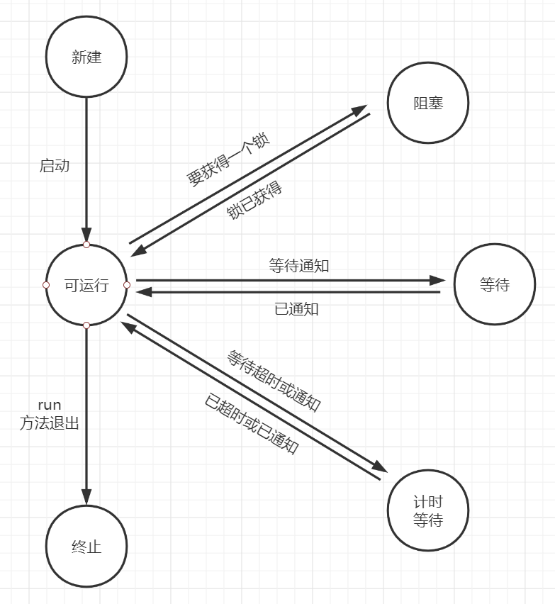

#### 12.2.1、新建线程

当用new操作符创建一个新线程是，如new Thread(r)，这个线程还没有开始运行。这以为着它的状态是新建(NEW)

#### 12.2.2、可运行线程

一旦调用start方法，线程就处于可运行(runnable)状态。一个可运行的线程可能正在运行也可能没有运行。要由操作系统为线程提供具体的运行时间

运行中的线程有时需要暂停，让其他线程有机会运行。线程调度是由操作系统决定的抢占式调度系统给每一个可运行线程一个时间片来执行任务。当时间片用完时，操作系统剥夺该线程的运行权，并给另一个线程一个机会来运行。当选择下一个线程是，操作系统会考虑线程的优先级

目前所有的桌面以及服务器操作系统都是抢占式调度。手机等一些小型设备可能使用协作式调度，在这样的设备中，一个线程只有在调用yield方法或被阻塞或等待时才失去控制权

java.lang.Thread

- static void yield()：

  使当前正在执行的线程向另一个线程交出运行权。

#### 12.2.3、阻塞和等待线程

当线程处于阻塞或等待状态时，它暂时是不活动的。它不运行任何代码，而且消耗最少的资源。要由线程调度器重新激活这个线程

- 当一个线程试图获取一个内部对象锁，而这个锁目前被其他线程占有，该线程会被阻塞。当所有其他线程都释放了这个锁，并且线程调度器允许该线程持有这个锁时，它将变成非阻塞状态。
- 当线程等待另一个线程通知调度器出现一个条件时，这个线程会进入等待状态。调用Object.wait方法或Thread.join方法，或者是等待java.util.concurrent库中的Lock或Condition时，就会出现这种情况。实际上，阻塞状态与等待状态并没有太大区别
- 调用以下这些方法会让线程进入计时等待状态。这一状态将一直保持到超时期满或者接收到适当的通知。带有超时参数的方法有Thread.sleep和计时版的Object.wait、Thread.join、Lock.tryLock、以及Condition.await

当一个线程阻塞或等待或终止时，可以调度另一个线程运行。当一个线程被重新激活，调度器检查是否具有比当前运行线程更高的优先级。如果是这样，调度器会剥夺某个当前运行线程的运行权，选择一个新线程运行。

#### 12.2.4、终止线程

终止线程的两个原因

- run方法正常退出，线程自然终止
- 因为一个没有捕获的异常终止了run方法，使线程意外终止

Thread的stop方法会抛出一个ThreadDeath错误对象来杀死线程，这个方法已经被废弃了

java.lang.Thread

- void join()：等待终止指定的线程

- void join(long millis)：

  等待指定的线程终止或者等待经过指定的毫秒数

- Thread.State getState()：

  得到这个线程的状态；取值为NEW、RUNNABLE、BLOCKED、WAITING、TIMED_WAITING、TERMINATED

- void stop()

  停止该线程。这个方法已废弃

- void suspend()

  暂停这个线程的执行。这个方法已废弃

- void resume()

  恢复线程。这个方法只能在调用suspend()之后使用，这个方法已废弃

### 12.3、线程属性

#### 12.3.1、中断线程

当线程的run方法执行方法体中最后一条语句后再执行return语句返回时，或者出现了方法中没有捕获的异常时，线程将终止。

除了已经废弃的stop方法，没有办法可以强制线程终止。不过，interrupt方法可以用来请求终止一个线程。

当对一个线程调用interrupt方法时，就会设置线程的中断状态。这是每个线程都有的boolean标志。每个线程都应该不时地检查这个标志，以判断线程是否被中断。

想要得到是否设置了中断状态，首先调用静态的Thread.currentThread方法获得当前线程，然后调用isInterrupted方法

```java
while(!Thread.currentThread().isInterrupted() && more work to do){
    do more work
}
```

但是，如果线程被阻塞，就无法检查中断状态。这里就要引入InterruptionException异常。当在一个被sleep或wait调用阻塞的线程上调用interrupt方法是，那个阻塞调用将被一个InterruptionException异常中断(有一些阻塞I/O调用不能被中断，对此应该考虑选择可中断的调用)

没有任何语言要求被中断的线程应当终止，被中断的线程可以决定如何响应中断

如果线程只希望将中断截石位一个终止请求，这种线程的run方法：

```java
Runnable r = () -> {
    try{
        while(!Thread.currentThread().isInterrupted() && more work to do){
            do more work
        }
    } catch (InterruptedException e) {
        //thread was interrupted during sleep or wait
    }finally{
        cleanup,if required
    }
    //exiting the run method terminates the thhread
};
```

如果设置了中断状态，再调用sleep方法，它会清除中断方法，并抛出InterruptedException。

如果循环调用了sleep，那就不要检测中断状态，直接捕获InterruptedException异常

```java
Runnable r = () -> {
    try{
        while(more work to do){
            do more work
            Thread.sleep(delay);
        }
    } catch (InterruptedException e) {
        //thread was interrupted during sleep or wait
    }finally{
        cleanup,if required
    }
    //exiting the run method terminates the thhread
};
```

区分interrupted方法和isInterrupted：

- interrupted：interrupted是一个静态方法，用于检查当前线程是否被中断，调用interrupted方法会清除该线程的中断状态。
- isInterrupted：isInterrupted是一个实例方法，可以用来检查是否有线程被中断

不要抑制InterruptionException异常

```java
void mySubTask{
    try{Thread.sleep(delay);}
    catch(InterruptedException e){}//don`t ignore!
    ...
}
```

如果不知道如何利用InterruptedException异常，可以用下面两个选择

- 在catch子句中调用Thread.interrupt()来设置中断状态。这样一来调用者就可以检测中断状态

  ```java
  void mySubTask{
      try{Thread.sleep(delay);}
      catch(InterruptedException e){Thread.currentThread().interrupt();}
      ...
  }
  ```

- 用throws InterruptedException标记方法，去掉try语句块。这样一来调用者(或者最终的run方法)就可以捕获这个异常

  ```java
  void mySubTask throws InterruptedException{
      ...
      Thread.sleep(delay;
      ...                 
  }
  ```

java.lang.Thread

- void interrupt()：

  向线程发出中断请求。线程的中断状态将被设置为true。如果当前线程被一个sleep调用阻塞，则抛出一个InterruptedException异常

- static boolean interrupted()：

  测试当前线程(即正在执行这个指令的线程)是否被中断。这个调用同时会将当前线程中断状态重置为false

- boolean isInterrupted()：

  测试线程是否被中断

- static Thread currentThread()

  返回表示当前正在执行的线程的Thread对象。

#### 12.3.2、守护线程

下面方法可以将线程转换为守护线程：

```java
t.setDaeMon(true);
```

守护线程的唯一用途就是为其他线程提供服务，比如计时器，日常可以应用到CG等

java.lang.Thread

- void setDaemon(boolean isDaemon)：

  标识该线程为守护线程或用户线程。这一方法必须在线程启动之前调用

#### 12.3.3、线程名

可以用setName方法为线程设置任何名字

```java
var t = new Thread(runnable);
t.setName("Web crawler");
```

#### 12.3.4、未捕获异常的处理器

线程的run方法不能抛出任何检查型异常，但是，非检查型异常可能会导致线程终止，在这种情况下，线程会死亡。

对于可以传播的异常，并没有任何catch子句。实际上，在线程死亡之前，异常会传递到一个用于处理未捕获异常的处理器。

这个处理器必须属于一个实现了Thread.UncaughtExceptionHandler接口的类。这个接口只有一个方法

```java
void uncaughtException(Thread t,Throwable e)
```

可以用setUncaughtExceptionHandler方法为任何线程安装一个处理器。也可以用Tread类的静态方法setDefaultUncaughtExceptionHandler为所有线程安装一个默认的处理器

如果没有安装默认处理器，默认处理器则为null。但是，如果没有为单个线程安装处理器，那么处理器就是该线程的ThreadGroup对象。

线程组是可以一起管理的线程的集合。默认情况下，创建的所有线程都属于一个线程组，但是也可以建立其他的组。由于现在引入了更好的特性来处理线程集合，所以建议不要在你自己的程序中使用线程组

ThreadGroup类实现了Thread.UncaughtExceptionHandler接口。它的uncaughtException方法执行以下操作：

1. 如果该线程组有父线程组，那么调用父线程组的uncaughtException方法
2. 否则，如果Thread.getDefaultExceptionHandler方法返回一个非null的处理器，则调用处理器
3. 否则，如果Throwable是ThreadDeath的一个实例，什么都不做
4. 否则，将线程的名字以及Throwable的栈轨迹输出到System.err

java.lang.Thread

- static void setDefaultUncaughtExceptionHandler(Thread.UncaughtExceptionHandler eh) 

- static Thread.UncaughtExceptionHandler getDefaultUncaughtExceptionHandler() 

  设置或获取未捕获异常的默认处理器

- void setUncaughtExceptionHandler(Thread.UncaughtExceptionHandler eh) 

- Thread.UncaughtExceptionHandler getUncaughtExceptionHandler() 

  设置或获取未捕获异常的处理器。如果没有安装处理器，则将线程组对象作为处理器

java.lang.Thread.UncaughtExceptionHandler

- void uncaughtException(Thread t, Throwable e)：

  当线程因一个未捕获异常而终止时，要记录一个定制报告

java.lang.ThreadGroup

- void uncaughtException(Thread t, Throwable e)：

  如果有父线程组，调用父线程组的这个方法，或者，如果Thread类有默认处理器，就调用该处理器，否则，将栈轨迹打印到标准错误流(不过，如果e是一个ThreadDeath对象，则会抑制栈轨迹。ThreadDeath对象由已经废弃的stop方法产生)

#### 12.3.5、线程优先级

Java中，每一个线程都有一个优先级。默认情况下，一个线程会继承构造它的那个线程的优先级。可以用setPriority方法提高过降低任何一个线程的优先级。可以将优先级设置为MIX_PRIORITY(定义为1)与MAX_PRIORITY(定义为10)之间的任何值，NORM_PRIORITY 定义为5

线程优先级高度依赖于系统，所以尽量不要使用线程优先级

java.lang.Thread 

- void setPriority(int newPriority) 

  设置线程的优先级。优先级必须在Thread.MAX_PRIORITY与Thread_MIN_PRIORITY之间，一般使用NORM_PRIORITY优先级

- static int MAX_PRIORITY 

  Thread可以有的最小优先级，最小优先级的值为1

- static int NORM_PRIORITY 

  Thread默认优先级，值为5

- static int MIN_PRIORITY 

  Thread可以有的最大优先级，最大优先级的值为10

### 12.4、同步

如果两个线程存取同一个对象，并且每个线程分别调用了一个修改该对象状态的方法，这两个线程会相互覆盖。取决于线程访问数据的次序，可能会导致对象被破坏。这种情况通常称为竞态条件

#### 12.4.1、静态条件的一个例子

为了避免多线程破坏共享数据，在操作数据时必须做到同步存取。

举个例子，我们模拟银行存取业务

```java
public class Bank {
    private final double[] accounts;
    public Bank(int n,double initialBalance){
        accounts = new double[n];
        Arrays.fill(accounts,initialBalance);
    }
    public void transfer(int from,int to,double amount){
        if (accounts[from] < amount){return;}
        System.out.println(Thread.currentThread());
        accounts[from] -= amount;//取款amount
        System.out.printf(" %10.2f from %d to %d" , amount , from, to);
        accounts[to] += amount;//存款amount
        System.out.printf(" Total Balance: %10.2f%n",getTotalBalance());
    }
    public double getTotalBalance(){
        double sum = 0;
        for (double a: accounts){
            sum += a;
        }
        return sum;
    }
    public int size(){
        return accounts.length;
    }
}
```

run方法在每次迭代中选择一个随机的目标账户和一个随机金额，调用bank对象的transfer方法，然后休眠

```java
public class UnsynchBankTest {
    public static final int NACCOUNTS = 100;//账户个数
    public static final double INITIAL_BALANCE = 1000;//初始金额
    public static final double MAX_AMOUNT = 1000;//最大存取金额
    public static final int DELAY = 10;//延迟时间
    public static void main(String[] args) {
        Bank bank = new Bank(NACCOUNTS, INITIAL_BALANCE);
        for (int i = 0;i < NACCOUNTS;i++){
            int fromAccount = i;//取款账户
            Runnable r = () -> {
                try {
                    while (true){
                        int toAccount = (int)(bank.size() * Math.random());//存款账户
                        double amount = MAX_AMOUNT * Math.random();//随机存取金额
                        bank.transfer(fromAccount,toAccount,amount);//转账
                        Thread.sleep((long) (DELAY * Math.random()));//线程休眠
                    }
                }catch (InterruptedException e){}
            };
            var t = new Thread(r,"多线程");
            t.start();
        }
    }
}

```

当我们启动多个线程执行这个run方法后，会发现，到后面账户总计的金额会少于1000

#### 12.4.2、竞态条件详解

当两个线程试图同时更新同一个账户时，就会导致账户总额错误，因为这两个线程的操作不是原子操作

```java
accounts[to] += amount;
```

1. 将accounts[to]加载到寄存器
2. 增加amount
3. 将结果写灰accounts[to]

假定线程1执行步骤1和2，然后，它的运行权被抢占。这时线程2被唤醒，更新account数组中的同一个元素。然后，线程1被唤醒并完成其第3步。

这个动作会抹去线程2所做的更新


#### 12.4.3、锁对象

有两种机制可防止并发访问代码块。可以用synchronized关键字，它会自动提供一个锁以及相关的“条件”

也可以引用ReentrantLock类，用ReentrantLock保护代码块的基本结构：

```java
myLock.lock();
try{
    critical section;
}finnally{
    myLock.unlock();
}
```

这个结构确保任何时刻只有一个线程进入临界区。一旦一个线程锁定了锁对象，其他任何线程都无法通过lock语句。当其他线程调用lock时，他们会暂停，直到第一个线程释放这个锁对象。

一定要把unlock操作包括在finnally子句中。如果在临界区的代码抛出一个异常，锁必须释放，否则，其他线程将永远阻塞

使用锁时，无法使用try-with-resources语句来释放锁

加锁后的转账方法

```java
private ReentrantLock bankLock = new ReentrantLock(); 
public void transfer(int from, int to, double amount) throws InterruptedException
{
    bankLock.lock();
    try
    {
        while (accounts[from] < amount){return;}
        System.out.print(Thread.currentThread());
        accounts[from] -= amount;
        System.out.printf(" %10.2f from %d to %d", amount, from, to);
        accounts[to] += amount;
        System.out.printf(" Total Balance: %10.2f%n", getTotalBalance());
    }
    finally
    {
        bankLock.unlock();
    }
}
```

注意每个Bank对象都有自己的ReentrantLock对象。如果两个线程试图访问同一个Bank对象，那么锁可以用来保证串行化访问。不过，如果两个线程访问不同的Bank对象，每个线程会得到不同的锁对象，两个线程都不会阻塞。

这个锁称为重入锁，因为线程可以反复喝的已拥有的锁。锁有一个持有计数器来跟踪对lock方法的嵌套调用。线程每一次调用lock后都要调用unlock来释放锁。由于这个特性，被一个锁保护的代码可以调用另一个使用相同锁的方法

要注意确保临界区的代码不要因为抛出异常而跳出临界区，如果在临界区代码结束之前抛出异常，finnally子句将释放锁，但是对象可能处于被破坏状态。

java.util.concurrent.locks.Lock

- void lock()：

  获得这个锁：如果锁当前被另一个线程占有，则阻塞

- void unlock()：

  释放这个锁

java.util.concurrent.locks.ReentrantLock

- ReentrantLock()

  构造一个重入锁，可以用来保护临界区

- ReentrantLock(boolean fair)：

  构造一个采用公平策略的锁。一个公平锁倾向于等待时间最长的线程。不过，这种公平保证可能严重影响性能。所以，默认情况下，不要求锁是公平的

所谓公平锁，就是指每个线程排队获取锁，非公平锁有可能会有一个线程一直都获取不到锁的情况。

#### 12.4.4、条件对象

通常，线程进入临界区后却发现只有满足了某个条件之后它才能执行。可以使用一个条件对象来管理哪些已经获得了一个锁却不能做有用工作的线程。条件对象经常被称为条件变量(conditional variable)

在上一节中，当我们转出时，如果转出金额大于账户余额，我们直接退出了转账方法，实际上打开了一个线程什么都没干就退出了。

现在，如果金额不足时，我们要等待，直到另一个线程向账户中增加了资金。但是这个线程刚刚获得了对bankLock的排他性访问权，因此别的线程没有存款的机会。这里就要引入条件对象。

一个锁对象可以有一个或多个相关联的条件对象。你可以用newCondition方法获得一个条件对象。

```java
class Bank{
    private Condition sufficientFunds;
    public Bank(){
        sufficientFunds = bankLock.newCondition();
    }
}
```

如果transfer方法发现资金不足，它就会调用

```java
sufficientFunds.await();
```

当前线程现在暂停，并放弃锁。这就允许另一个线程执行，我们希望它能增加账户余额。用了await方法，它就进入这个条件的等待集。当锁可用是，该线程并不会变成可运行状态。实际上它仍保持非活动状态，直到另一个线程在同一条件上调用signalAll方法。

当另一个线程完成转账时，它应该调用：

```java
sufficientFunds.signalAll();
```

这个调用会重新激活等待这个条件的所有线程。当这些线程从等待集中移出时，它们再次成为可运行的线程，调度器最终将再次将它们激活。同时，它们会常识重新进入该对象。一旦锁可用，它们中的某个线程将从await调用返回，得到这个锁，并从之前暂停的地方继续执行。

实际上signal方法仅仅是通知等待的线程：现在有可能满足条件，值得再次检查条件。

通常，await调用应该放在如下形式的循环中：

```java
while(!(OK to processd)){
    condition.await;
}
```

最终需要有某个其他线程调用signal方法，这一点至关重要。当一个线程调用await时，它没有办法重新自行激活。它寄希望于其他线程。如果没有其他线程来重新激活等待的线程，它就永远不再运行了。这将导致令人不快的死锁现象。如果没有其他线程来重新激活等待的线程，它就永远不再运行了，这将导致令人不快的死锁(deadlock)现象。如果所有其他线程都被阻塞，最后一个活动线程调用了await方法但没有先解除另外某个线程的阻塞，现在这个线程也会阻塞。此时没有线程可以解除其他线程的阻塞状态，程序会永远挂起。

我们应该在只要一个对象的状态有变化，而且有可能有利于等待的线程，就可以调用signalAll。

signalAll方法只是解除等待线程的阻塞，使这些线程可以在当前线程释放锁之后竞争访问对象。

另一个方法signal只是随机选择等待集中的一个线程，并解除这个线程的阻塞状态。但是，如果随机选择的线程发现自己仍然不能运行，它就会再次阻塞。

只有当线程拥有一个条件的锁时，它才能在这个条件上调用await、signlAll或signal方法。

java.util.concurrent.locks.Lock

- Condition newCondition()：

  返回一个与这个锁相关联的条件对象

java.util.concurrent.locks.Condition

- void await()：

  将该线程放在这个条件的等待集中

- void signalAll()：

  解除该条件等待集中所有线程的阻塞状态

- void signal()：

  从该条件的等待集中随机选择一个线程，解除其阻塞状态

#### 12.4.5、synchronized关键字

锁和条件对象总结：

- 锁时用来保护代码片段，一次只能有一个线程执行被保护的代码
- 锁可以管理试图进入被保护代码段的线程
- 一个锁可以有一个或多个相关联的条件对象
- 每个条件对象管理哪些已经进入被保护代码段但还不能运行的线程。

Java中的每个对象都有一个内部锁。如果一个方法声明时有synchronized关键字，那么对象的锁将保护整个方法。也就是说，要调用这个方法，线程必须获得内部对象锁。

```java
public synchronized void method(){
    method body
}
```

等价于

```java
public void method(){
    this.intrinsicLock.lock();
    try{
        method body
    }finally{
        this.intrinsicLock.unlock();
    }
}
```

内部对象锁只有一个关联条件。wait方法将一个线程增加到等待集中，notifyAll/notify方法可以解除等待线程的阻塞。等价于：

```java
intrinsicLock.await();
intrinsicLock.signalAll();
```

wait、notifyAll以及notify是Object类的final方法。Condition方法不能与Object方法重名

将静态方法声明为同步也是合法的。如果调用这样一个方法，它会获得相关类对象的内部锁。

内部锁和条件存在一些限制

- 不能中断一个正在尝试获得锁的线程
- 不能指定尝试获得锁时的超时时间
- 每个锁仅有一个条件可能是不够的

synchronized与Lock对比

- synchronized可以给类、方法、代码块加锁，而Lock只能给代码块加锁

- Lock提供了超时机制，而synchronized没有，超时机制可以解决一些死锁的问题

- Lock可以响应中断

  1. lockInterruptibly方法如果没有获得锁将会等待(wait)
  2. 获得锁后会继续执行
  3. 如果没有获得锁但是线程被中断(interrupt)，会抛出InterruptedException异常

- Lock支持非阻塞的获取锁

- Lock+Condition可以支持多个条件

使用建议

- 最好既不使用Lock/Condition也不使用synchronized关键字。可以使用java.uitl.concurrent包中的某种机制，它会为你处理所有锁定
- 优先使用synchronized关键字，因为简单且高效，而且可以减少出错概率
- 如果特别需要Lock/Condition结构的额外能力，那就用吧

java.lang.Object 

- void notifyAll()：

  解除在这个对象上调用wait方法的那些线程的阻塞状态。该方法只能同步方法或同步块中调用。如果当前线程不是对象锁的所有者，该方法会抛出一个IllegalMonitorStateException异常。

- void notify() ：

  随机选择一个在这个对象上调用wait方法的线程，解除其阻塞状态。该方法只能在一个同步方法或同步块中调用。如果当前线程不是对象锁的所有者，该方法会抛出一个IllegalMonitorStateException异常。

- void wait() 

  导致一个线程进入等待状态，直到它得到通知。该方法只能在一个同步的方法或同步块中调用。如果当前线程不是对象锁的所有者，该方法会抛出一个IllegalMonitorStateException异常。

- void wait(long timeoutMillis) 

- void wait(long timeoutMillis, int nanos) 

  导致一个线程进入等待状态，直到它得到通知或者经过了指定的时间。这些方法只能在一个同步的方法或同步块中调用。如果当前线程不是对象锁的所有者，该方法会抛出一个IllegalMonitorStateException异常。纳秒数不能超过1 000 000

#### 12.4.6、同步块

可以通过进入一个同步块获得锁

```java
synchronized(obj){
    critical section
}
```

使用一个对象锁来实现额外的原子操作，这种做法称为客户端锁定。

这个对象在同步块使用的方法必须都使用内部锁，客户端锁定是非常脆弱的，通常不推荐使用

#### 12.4.7、监视器概念

监视器

用java的术语来讲，监视器具有如下特性：

- 监视器是指包含私有字段的类
- 监视器类的每个对象有一个关联的锁
- 所有方法有这个锁锁定。换句话说，如果客户端调用obj.method()，那么obj对象的锁在方法调用开始是自动获得，并且当前方法返回时自动释放该锁。因为所有的字段时私有的，这样的安排可以确保一个线程处理字段时，没有其他线程能够访问这些字段
- 锁可以有任意多个相关联的条件

Java中的每一个对象都有一个内部锁和一个内部条件。如果一个方法用synchronized关键字声明，那么，它表现得就像是一个监视器方法。可以通过调用wait/notifyAll/notify来访问条件变量。

Java对象在以下3个重要方面不同于监视器，削弱了线程的安全性

- 字段不要求是private
- 方法不要求是synchronized
- 内部锁对客户是可用的

#### 12.4.8、volatile字段

- 有多处理器的计算机能够暂时在寄存器或本地内存缓存中保存内存值。其结果是，运行在不同处理器上的线程可能看到同一个内存位置有不同的值
- 编译器可以改变指令的顺序以使吞吐量最大化。编译器不会选择可以改变代码语义的顺序，但是编译器有一个规定，认为内存值只在代码中有显式的修改指令时才会改变。然而，内存值有可能被另一个线程改变！

如果写一个变量，而这个变量接下来可能会被另一个线程读取，或者，如果读一个变量，而这个变量可能已经被另一个线程写入值，那么必须使用同步

volatile关键字为实例字段的同步访问提供了一个免锁机制。如果声明一个字段为volatile，那么编译器和虚拟机就知道该字段可能被另一个线程并发更新

volatile变量不能提供原子性

#### 12.4.9、final变量

当一个字段声明为fanal时，可以安全地访问这个共享字段

```java
final var account = new HashMap<String,Doubl>();
```

其他线程会在构造器完成构造之后才会看到这个accounts变量

如果不使用final，就不能保证其他线程看到的是accounts更新后的值，它们可能都只是看到null，而不是新构造的HashMap。

不过对这个映射的操作并不是线程安全的

#### 12.4.10、原子性

假设对共享变量除了赋值之外并不做其他操作，那么可以将这些共享变量声明为volatile。

java.util.concurrent.atomic包中有很多类使用了很高效的机器级指令(而没有使用锁)来保证其他操作的原子性

AtomicBoolean、AtomicInteger、AtomicIntegerArray、AtomicIntegerFieldUpdater\<T>、AtomicLong、AtomicLongArray、AtomicLongFieldUpdater\<T>、AtomicMarkableReference\<V> AtomicMarkableReference、AtomicReference\<V>、AtomicReferenceArray\<E>、AtomicReferenceFieldUpdater<T,V>、AtomicStampedReference\<V> 

如果有大量线程要访问相同的原子值，性能会大幅下降，因为乐观更新需要太多次重试

#### 12.4.11、死锁

上面的例子，如果两个线程同时通过两个账户互相转钱，有可能会因为每一个线程要等待更多的钱款存入而导致所有线程都被阻塞。这样的状态称为死锁

#### 12.4.12、线程局部变量

使用ThreadLocal辅助类为各个线程提供各自的实例，可以避免共享变量

```java
public static final ThreadLocal<SimpleDateFormat> dateFormat
    = ThreadLocal.withInitial(() -> new SimpleDateFormat("yyyy-MM-dd"));
String dateStamp = dateFormat.get().format(new Date());
```

可以使用ThreadLocal辅助类为各个线程提供一个单独的生成器，不过Java7还另外提供了一个便利类

```java
int random = ThreadLocalRandom.current().nextInt(upperBound);
```

ThreadLocalRandom.current()调用会返回特定于当前线程的Random类的实例

java.lang.ThreadLocal\<T>

- T get()：

  得到这个线程的当前值。如果是首次调用get，会调用initialize来得到这个值

- void set(T t)：

  为这个线程设置一个新值

- void remove()：

  删除对应这个线程的值

- static \<S> ThreadLocal\<S> withInitial(Supplier<? extends S> supplier) ==8==：

  创建一个线程局部变量，其初始值通过调用给定的提供者(supplier)生成

java.util.concurrent.ThreadLocalRandom 

- static ThreadLocalRandom current()==7==：

  返回特定于当前线程的Random类的实例

### 12.5、线程安全的集合

如果多线程要并发地修改一个数据结构，那么很容易破坏这个数据结构，我们依然可以通过锁来保护共享的数据结构，不过Java类库提供了另外一些线程安全的集合。

#### 12.5.1、阻塞队列

使用队列，可以安全地从一个线程向另一个线程传递数据。

当试图向队列添加元素而队列已满，或是想从队列移出元素而队列为空的时候，*阻塞队列*(blocking queue)将导致线程阻塞。工作线程可以周期性地将中间结果存储在阻塞队列中。其他工作线程移出中间结果，并进一步进行修改。队列会自动地平衡负载。如果第一组线程运行得比第二组慢，第二组在等待结果时会阻塞。如果第一组线程运行的更快，队列会填满，直到第二组赶上来

阻塞队列的方法

| 方法    | 正常动作               | 特殊情况下的动作                             |
| ------- | ---------------------- | -------------------------------------------- |
| add     | 添加一个元素           | 如果队列满，则抛出IllegalStateException异常  |
| element | 返回队头元素           | 如果队列空，则抛出NoSuchElementException异常 |
| offer   | 添加一个元素并返回true | 如果队列满，则返回false                      |
| peek    | 返回队头元素           | 如果队列空，则返回null                       |
| poll    | 移出并返回队头元素     | 如果队列空，则返回null                       |
| put     | 添加一个元素           | 如果队列满，则阻塞                           |
| remove  | 移除并返回队头元素     | 如果队列空，则抛出NoSuchElementException异常 |
| take    | 移除并返回队头元素     | 如果队列空，则阻塞                           |

peek和poll用返回null来表示失败，因为队列不能插入null值

offer方法和poll方法可以带超时时间参数，offer如果超时没有成功则返回false，poll如果超时没有成功则返回null

默认情况下LinkedBlockingQueue的容量没有上限，但是，也可以选择指定一个最大容量。LinkedBlockQueue是一个双端队列。

ArrayBlockingQueue是一个优先队列，而不是先进先出队列。元素按照它们的优先级顺序移除。这个队列没有容量上限，但是，如果队列是空的，获取元素的操作会阻塞

DelayQueue包含实现了Delayed接口的对象

```java
interface Delayed extends Comparable<Delayed>{
    getDelay(TimeUnit unit);
}
```

getDelay方法返回对象的剩余延迟。负值表示延迟已经结束。元素只有在延迟结束的情况下才能从DelayQueue移除。还需要实现comparaTo方法。DelayQueue使用该方法对元素排序

TransferQueue接口是Java7添加的，允许生产者线程等待，直到消费者准备就绪可以接收元素。如果生产者调用`q.transfer(item);`这个调用会阻塞，直到另一个线程将元素删除。LinkedTransferQueue类实现了这个接口

java.util.concurrent.ArrayBlockingQueue\<E>

- ArrayBlockingQueue(int capacity)

- ArrayBlockingQueue(int capacity,boolean fair)：

  构造一个有指定的容量和公平性设置的阻塞队列。队列实现为一个循环数组

java.util.concurrent.LinkedBlockingQueue\<E> 
java.util.concurrent.LinkedBlockingDeque\<E>

- LinkedBlockingQueue

- LinkedBlockingDeque

  构造一个无上限的阻塞队列或双向队列，实现为一个链表

- LinkedBlockingQueue(int capacity)

- LinkedBlockingDeque(int capacity)：

  根据指定容量构建一个有限的阻塞队列或双向队列，实现为一个链表。

java.util.concurrent.DelayQueue\<E extends Delayed>

- DelayQueue()：

  构造一个包含Delayed元素的无上限阻塞队列。只有那些延迟已经到期的元素可以从列表中移除。

java.util.concurrent.Delayed

- long getDelay(TimeUnit unit)：

  得到该对象的延迟，用给定的时间单位度量

java.util.concurrent.PriorityBlockingQueue\<E> 

- PriorityBlockingQueue()

- PriorityBlockingQueue(int initialCapacity)

- PriorityBlockingQueue(int initialCapacity, Comparator<? super E> comparator)：

  构造一个无上限阻塞优先队列，实现为一个堆。优先队列的默认初始容量为11。如果没有指定比较器。则元素必须实现Comparable接口。

java.util.concurrent.BlockingQueue\<E>

- void put(E e) ：

  添加元素，在必要时阻塞。

- E take()：

  移除并返回队列头元素，必要时阻塞

- boolean offer(E e, long timeout, TimeUnit unit)：

  添加给定的元素，如果成功返回true，必要时阻塞，直至元素已经添加或超时。

- E poll(long timeout, TimeUnit unit)：

  移除并返回队头元素，必要时阻塞，直至元素可用或超时用完。失败时返回null

java.util.concurrent.BlockingDeque\<E>

- void putFirst(E e)

- void putLast(E e)：

  添加元素，必要时阻塞

- E takeFirst()

- E takeLast()：

  移除并返回队头或队尾元素，必要时阻塞

- boolean offerFirst(E e, long timeout, TimeUnit unit) 

- boolean offerLast(E e, long timeout, TimeUnit unit) ：

  添加给定的元素，成功是返回true，必要时阻塞，直至元素已经添加或超时

- E pollFirst(long timeout, TimeUnit unit)

- E pollLast(long timeout, TimeUnit unit) 

  移除并返回队头或队尾元素，必要时阻塞，直至元素可用或超时。失败时返回null

java.util.concurrent.TransferQueue\<E>==7==

- void transfer(E element)

- boolean tryTransfer(E e, long timeout, TimeUnit unit)：

  传输一个值，或者尝试在给定的一个超时时间内传输这个值，这个调用将阻塞，直到另一个线程将元素删除。第二个方法会在调用成功时返回true

#### 12.5.2、高效的映射、集和队列

java.util.concurrent包提供了映射、有序集和队列的高效实现：ConcurrentHashMap、ConcurrentSkipListMap、ConcurrentSkipListSet和ConcurrentLinkedQueue

这些集合使用复杂的算法、通过允许并发地访问数据结构的不同部分尽可能减少竞争

集合返回一个弱一致性的迭代器。这意味着迭代器不一定能反映出它们构造之后的所有更改，但是，它们不会将同一个值返回两次，也不会抛出ConcurrentModificationException异常

并发散列映射可以高效地支持大量阅读器和一定数量的书写器。默认情况下认为可以有至多16个同时运行的书写器线程。当然可以有更多的书写器线程，但是，同一时间如果多于16个，其他线程将暂时阻塞。可以在构造器中指定更大数目

java.util.concurrent.ConcurrentLinkedQueue\<E>

- ConcurrentLinkedQueue()\<E>：

  构造一个可以被多线程安全访问的无上限非阻塞的队列

java.util.concurrent.ConcurrentSkipListSet\<E>

- ConcurrentSkipListSet\<E>()

- ConcurrentSkipListSet\<E>(Comparator<? super E> comparator)：

  构造一个可以被多线程安全访问的有序集。第一个构造器要求元素实现Comparable接口。

java.util.concurrent.ConcurrentHashMap<K,V> 
java.util.concurrent.ConcurrentSkipListMap<K,V> 

- ConcurrentHashMap()

- ConcurrentHashMap(int initialCapacity)

- ConcurrentHashMap(int initialCapacity, float loadFactor, int concurrencyLevel) 

  构造一个可以被多线程安全访问的散列映射表。默认的初始容量为16。如果每个桶的平均负载超过了装载因子，表的大小会重新调整。默认值为0.75.并发级别是估计的并发书写器的线程数

- ConcurrentSkipListMap()

- ConcurrentSkipListMap(Comparator<? super K> comparator) 

  构造一个可以被多线程安全访问的有序映像。第一个构造器要求键实现Comparable接口

#### 12.5.3、映射条目的原子更新

ConcurrentHashMap的get和put代码永远不会破坏数据结构。不过操作序列不是原子的，所以结果不可预知。

调用comput方法时可以提供一个键和一个计算新值的函数。这个函数接收键和相关联的值(如果没有值，则为null)，它会计算新值。

```java
map.compute(word,(k,v) -> v==null ? 1 : v+1);
```

ConcurrentHashMap中不允许有null值。很多方法都用null值来只是映射中某个给定的键不存在

computeIfPresent和computeIfAbsent方法，它们分别只在已经有原值的情况下计算新值，或者只在没有原值的情况下计算新值

merge方法有一个参数表示键不存在时使用初始值。否则，就会调用你提供的甘薯来结合原值的初始值

如果传入compute或merge的函数返回null，将从映射中删除现有的条目

使用compute或merge时，要记住你提供的函数不能做太多工作。这个函数运行时，可能会阻塞对映射的其他更新。当然，这个函数也不能更新映射的其他部分。

#### 12.5.4、对并发散列映射的批操作

Java API为并发散列映射提供了批操作，即使有其他线程在处理映射，这些操作也能安全地执行。批操作会便利映射，处理遍历过程中找到的元素。这里不会冻结映射的当前快照。除非你恰好知道批操作运行时映射不会被修改，否则就要把结果看作是映射状态的一个近似。

有三种不同的操作：

- search(搜索)为每个键或值应用一个函数，直到函数生成一个非null的结果。然后搜索终止，返回这个函数的结果
- reduce(归约)组合所有键或值，这里要使用所提供的一个累加函数
- forEach为所有键或值应用一个函数

每个操作有4个版本

- operationKeys：处理键
- operationValues：处理值
- operation：处理键和值
- operationEntries：处理Map.Entry对象

对于上述各个操作，需要指定一个参数化阈值。如果映射包含的元素多于这个阈值，就会并行完成批操作。如果希望批操作在一个线程中运行，可以使用阈值long.MAX_VALUE。如果希望用尽可能多的线程运行批操作，可以使用阈值1。

#### 12.5.5、并发集视图

JUC中没有ConcurrentHashSet类，但是我们可以使用包含“假”值的ConcurrentHashMap，静态newKeySet方法会生成一个Set\<K>，这实际上是ConcurrentHashMap<K,boolean>的一个包装器。

#### 12.5.6、写数组的拷贝

CopyOnWriteArrayList和CopyOnWriteArraySet是线程安全的集合，其中所有更改器会建立底层数组的一个副本。如果迭代访问集合的线程数超过更改集合的线程数，这样的安排是很有用的，当构造一个迭代器的时候，它包含当前数组的一个引用。如果这个数组后来被更改了，迭代器仍然引用旧数组，但是，集合的数组已经替换。因而，原来的迭代器可以访问一致的(但可能过时的)视图，而且不存在任何同步开销

#### 12.5.7、并行数组算法

Arrays类提供了大量并行化操作。静态Arrays.parallelSort方法可以对一个基本类型值或对象的数组排序。

parallelSetAll方法会用一个函数计算得到的值填充一个数组。这个函数接收元素索引，然后计算相应位置上的值

#### 12.5.8、较早的线程安全集合

任何集合类都可以通过使用同步包装器变成线程安全的

```java
List<E> synchArrayList = Collections.synchronizedList(new ArrayList<E>());
Map<K, V> synchHashMap = Collections.synchronizedMap(new HashMap<K, V>());
```

结果集合的方法使用锁加以保护，可以提供线程安全的访问。

应该确保没有任何线程通过原始的非同步方法访问数据结构。要确保这一点，最容易的方法是确定不保存原始对象的任何引用，简单地构造一个集合并立即传递给包装器

如果希望迭代访问一个集合，同时另一个线程仍有机会更改这个集合，那么仍然需要使用代码块锁定(客户端锁定)

如果使用“for each”循环，就必须使用同样的代码，因为循环使用了一个迭代器。

注意：在迭代过程中，如果另一个线程更改了集合，迭代器会失败，抛出ConcurrentModificationException异常。同步仍然是需要的，这样才能可靠地检测出并发修改

尽量优先使用JUC中的集合，而不是同步包装器

java.util.Collections

- static \<T> Collection\<T> synchronizedCollection(Collection\<T> c)

- static \<T> List\<T> synchronizedList(List\<T> list)

- static <K,V> Map<K,V> synchronizedMap(Map<K,V> m)

- static \<T> Set\<T> synchronizedSet(Set\<T> s) 

- static <K,V> SortedMap<K,V> synchronizedSortedMap(SortedMap<K,V> m)

- static \<T> SortedSet\<T> synchronizedSortedSet(SortedSet\<T> s) 

  构造集合视图，其方法是同步的。

### 12.6、任务和线程池

线程池(thread pool)中包含许多准备的线程。

#### 12.6.1、Callable与Future

Callable与Runnable类似，可以把它想象成一个没有参数但是有返回值的异步方法。Callable接口是一个参数化的类型，只有一个方法call

```java
public interface Callable<V>{
    V call() throws Exception;
}
```

Future保存异步计算的结果。可以启动一个计算，将Future对象交给某个线程，然后忘掉它。这个Future对象的所有者在结果计算好之后就可以得到结果。

执行Callable的一种方式是使用FutureTask

```java
Callable<Integer> task = ...;
var futureTask = new FuntureTask<Integer>(task);
var t = new Thread(funtureTask);
t.start;
...
Integer result = task.get();    
```

还可以将一个Callable传递到一个执行器来执行它。

可以用cancel取消运算，取消一个任务涉及两个步骤。必须找到并中断底层线程。另外任务实现(在call方法中)必须感知到中断，并放弃它的工作。如果一个Future对象不知道任务在哪个线程中执行，或者如果任务没有监视执行该任务的线程中断状态，那么取消任务没有任何效果。

java.util.concurrent.Callable<V>

- V call()：

  运行一个将产生结果的任务。

- V get() 

- V get(long timeout, TimeUnit unit) 

  获取结果，这个方法会阻塞，直到结果可用或者超过了指定的时间。如果不成功，第二个方法会抛出TimeoutException异常

- boolean cancel(boolean mayInterrupt) ：

  尝试取消这个任务的运行。如果任务已经开始，并且mayInterrupt参数值为true，它就会被中断。如果成功执行了取消操作，则返回true。

- boolean isCancelled()：

  如果任务在完成前被取消，则返回true。

- boolean isDone()：

  如果任务结束，无论是正常完成、中途取消，还是发生异常，都返回true。

java.util.concurrent.FutureTask\<V>

- FutureTask(Callable\<V> callable)

- FutureTask(Runnable runnable, V result)：

  构造一个既是Future\<V>又是Runnable的对象

#### 12.6.2、执行器

执行器(Executors)类有许多静态工厂方法，用来构造线程池

| 方法                            | 描述                                                         |
| ------------------------------- | ------------------------------------------------------------ |
| newCachedThreadPool             | 必要时创建新线程；空闲线程会保持60秒                         |
| newFixedThreadPool              | 池中包含固定数目的线程；空闲线程会一直保留                   |
| newWorkStealingPool             | 一种适合“fork-join”任务的线程池，其中复杂的任务会分解为更简单的任务，空闲线程会“密取”较简单的任务 |
| newSingleThreadExcutor          | 只有一个线程的“池”，会顺序的执行所提交的任务                 |
| newScheduledThreadPool          | 用于调动执行的固定线程池                                     |
| newSingleThreadScheduledExcutor | 用于调动执行的单线程“池”                                     |

可以用下面的方式之一将Runnable或Callable对象提交给ExecutorService：

- Future\<T>  submit(Callable\<T> task)
- Future\<?> submit(Runnable task)
- Future\<T> submit(Runnable task,T result) 

线程池会在方便的时候尽早执行提交的任务，使用完一个线程池时，调用shutdown。这个方法启动线程池关闭序列。被关闭的执行器不再接收新的任务。当所有任务都完成时，线程池中的线程会死亡。另一种方法是调用shutdownNow。线程池会取消所有尚未开始的任务。

线程池使用流程：

1. 调用Executors类的静态方法newCachedThreadPool或newFixedThreadPool
2. 调用submit提交Runnable或Callable对象
3. 保存好返回的Future对象，以便得到结果或取消任务
4. 当不想再提交任何任务时，调用shutdown

ScheduledExecutorService接口为调度执行或重复执行任务提供了一些方法。这是对建立线程池的java.util.Timer的泛化。

java.util.concurrent.Executors

- ExecutorService newCachedThreadPool()：

  返回一个缓存线程池，会在必要的时候创建线程，如果线程已经空闲60秒则终止该线程

- ExecutorService newFixedThreadPool(int threads)：

  返回一个线程池，使用给定数目的线程执行任务

- ExecutorService newSingleThreadExecutor()：

  返回一个执行器，它在一个单独的线程中顺序地执行任务

- ScheduledExecutorService newScheduledThreadPool(int threads)：

  返回一个线程池，使用给定数目的线程调度任务

- ScheduledExecutorService newSingleThreadScheduledExecutor()：

  返回一个执行器，在一个单独的线程中调度任务

java.util.concurrent.ExecutorService

- Function\<T> submit(Callable\<T> task)

- Function\<T> submit(Runnable\<T> task，T result)

- Function\<T> submit(Runnable\<T> task)

  提交指定的任务来执行

- void shutdown()

  关闭服务，完成已经提交的任务但不再接受新的任务

java.util.concurrent.ThreadPoolExecutorCollector

- int getLargestPoolSize()：

  返回该执行器生命周期中线程池的最大大小

java.util.concurent.ScheduledExecutorService

- ScheduledFuture\<V> schedule(Callable\<V> task, long time, TimeUnit unit)

- ScheduledFuture\<?> schedule(Runnable task, long time, TimeUnit unit)

  调度在指定的时间之后执行任务

- ScheduleFuture\<?> scheduleAtFixedDelay(Runnable task, long initialDelay, long period, TimeUnit unit)

  调度在初始延迟之后，周期性地运行给定的任务，周期长度是period个单位

- ScheduleFuture\<?> scheduleWhitFixedDelay(Runnable task, long initialDelay, long delay, TimeUnit unit)

  调度在初始延迟之后，周期性地运行给定的任务，在一次调用完成和下一次调用开始之间有长度为delay个单位的延迟

#### 12.6.3、控制任务组

执行器可以控制一组相关的任务

shutdownNow方法可以取消所有任务

invokeAny方法提交一个Callable对象集合中的所有对象，并返回某个已完成任务的结果。我们不知道返回的究竟是哪一个任务的结果，这往往是最快完成的那个任务。对于搜索问题，如果我们愿意接受任何一种答案，就可以使用这个方法。

invokeAll方法提交一个Callable对象的集合中所有对象，这个方法会阻塞，直到所有任务都完成，并返回所有任务答案的一个Future对象列表。得到计算结果后，还可以像下面这样对结果进行处理

```java
List<Callable<T>> tasks = ...;
List<Future<T>> results = executor.invokeAll(task);
for(Future<T> result : results){
    processFurther(result.get());
}
```

在for循环中，第一个result.get()调用会阻塞，直到第一个结果可用，如果所有任务几乎同时完成，这不会有问题。不过有必要按计算出的结果的顺序得到这些结果。可以利用ExecutorCompletionService来管理。

首先以通常的方式得到一个执行器。然后构造一个ExecutorCompletionService。将任务提交到这个完成服务。该服务会管理Future对象的一个阻塞队列。其中包含所提交任务的结果(一旦结果可用，就会放入队列)。因此，要完成之前的计算，以下组织更为高效：

```java
var service = new ExecutorCompletionService<T>(executor);
for(Callable<T> task : tasks){
    service.submit(task);
}
for(int i = 0; i < tasks.size(); i++){
    processFurther(service.take().get());
}
```

#### 12.6.4、fork-join框架

fork-join框架是专门用来支持对每个处理器内核分别使用一个线程，以完成计算密集型任务

假设有一个处理任务，它可以很自然地分解为子任务

```java
if(problemSize < threshold)
    solve problem directly
else{
    break problem into subproblems
    recursively solve each subproblem
    combine the results
}
```

要采用框架可用的一种方式完成这种递归计算，需要提供一个扩展RecursiveTask\<T>的类(如果计算会生成一个类型为T的结果)或者提供一个扩展RecursiveAction的类(如果不生成任何结果)。再覆盖compute方法来生成并调用子任务，然后合并其结果。

fork-join框架用工作密取(work stealing)来平衡可用线程的工作负载。每个工作线程都有一个双端队列来完成任务。一个工作线程空闲时，它会从另一个双端队列的队尾"密取"一个任务。由于大的子任务都在队尾，这种密取很少出现

注意：fork-join池是针对非阻塞工作负载优化的。如果向一个fork-join池增加很多阻塞任务，会让它无法有效工作。可以让任务实现ForkJoinPool.ManagedBlocker接口来解决这个问题

### 12.7、异步计算

#### 12.7.1、可完成Future

CompletableFuture类实现了Future接口，它提供了获得结果的另一种机制。你要注册一个回调，一旦结果可用，就会(在某个线程中)利用该结果调用这个回调。

```java
CompetitionFuture\<String> f = ...;
f.thenAccept(s -> Process the result string s);
```

通过这种方式，无须阻塞就可以在结果可用时对结果进行处理。

有些API方法会返回CompletableFuture对象，不过，大多数情况下，都需要建立自己的CompletableFuture。要想异步运行任务并得到CompletableFuture，不要把它直接提交给执行器服务，而应当调用静态方法CompletableFuture.supplyAsync。

如果省略执行器，任务会在一个默认执行器(具体就是ForkJoinPool.commonPool()返回的执行器)上运行。通常你可能并不希望这么做。

CompletableFuture可以采用两种方式完成：得到一个结果，或者有一个未捕获的异常。要处理这两种情况，可以使用whenComplete方法。要对结果(或者如果没有就为null)和异常(或者如果没有就为null)调用所提供的函数

```java
f.whenComplete((s,t) -> {
	if(t == null){
        Process the result s;
    }else{
        Process the Throwable t;
    }    
});
```

CompletableFuture之所以被称为是可完成的，是因为你可以手动地设置一个完成值(在其他并发库中，这样的对象称为承诺(promise))。当然，用supplyAsync创建一个CompletableFuture时，任务完成时就会隐式第设置完成值。不过，显式地设置结果可以提供更大的灵活性。

注释：可以在多个线程中在同一个future上安全地调用complete或completeExceptionnally。如果这个future已经完成，这些调用没有任何作用

isDone方法指出一个Future对象是否已经完成(正常完成或产生一个异常)。如果结果已经由另一个方法得出，workHard和workSmart方法可以使用这个信息停止工作。

警告：与普通的Future不同，调用cancel方法时，CompletableFuture的计算不会中断。取消只会把这个Future对象设置为以异常方式完成(有一个CancallationException异常)。一般来讲，这是有道理的，因为CompletableFuture可能没有一个线程负责它的完成。不过这个限制也适用于supplyAsync等方法返回的CompletableFuture实例，而这些对象原则上讲是可以中断的

#### 12.7.2、组合可完成Future

CompletableFuture类可以将异步任务组合为一个处理管线。

```java
public CompletableFuture<String> readPage(URL url){...}
public List<URL> getImageURLs(String webPage){...}
CompletableFuture<String> contents = readPage(url);
CompletableFuture<List<URL>> imageURLs = contents.thenApply(this::getImageURLs);
```

thenApply方法不会阻塞。它会返回另一个future。第一个future完成时，其结果会提供给getImageURLs方法，这个方法的返回值就是最终的结果。

下表是为CompletableFuture\<T>对象增加一个动作值的方法，这里所示的每一个方法，还有相应的两个Async形式，不过这里没有给出，其中一种形式使用一个共享**ForkJoinPool**，另一种形式有一个**Executor**参数。

| 方法              | 参数                       | 描述                                   |
| ----------------- | -------------------------- | -------------------------------------- |
| thenApply         | T -> U                     | 对结果应用一个函数                     |
| thenAccept        | T -> void                  | 类似于thenApply，不过结果为void        |
| thenCompse        | T -> CompletableFuture\<U> | 对结果调用函数并执行返回的future       |
| handle            | (T, Throwable) -> U        | 处理结果或错误，生成一个新结果         |
| whenComplete      | (T, Throwable) -> void     | 类似于handle。，不过结果为void         |
| exceptionally     | Throwable -> T             | 从错误计算一个结果                     |
| completeOnTimeout | T, long, TimeUnit          | 如果超时，生成给定值作为结果           |
| orTimeout         | long, TimeUnit             | 如果超时，生成一个TimeoutException异常 |
| thenRun           | Runnable                   | 执行Runnable，结果为void               |

如上面的thenApply方法。假设f是一个函数，接收类型为T的值，并返回类型为U的值。

```java
 CompletableFuture<U> future.thenApply(f);
 CompletableFuture<U> future.thenApplyAsync(f);
```

它会返回一个future，结果可用湿，会对future的结果应用f。第二个调用会在另一个线程中运行f

thenCompose方法没有取将T映射到U的函数，而是接收一个将T映射到 CompletableFuture\<U>的函数

处理异常的方法有以下三种：

- whenComplete

- handle：可以传给它一个函数来处理结果或异常，并计算一个新结果

- exceptionally：出现一个异常时，这个方法会计算一个假值

  ```java
  CompletableFuture<List<URL>> imageURLs = readPage(url)
      .exceptionally(ex -> "<html></html>")
      .thenApply(this::getImageURLs)
  ```

  也可以处理超时

  ```java
  CompletableFuture<List<URL>> imageURLs = readPage(url)
      .exceptionally("<html></html>", 30, TimeUnit.SECONDS)
      .thenApply(this::getImageURLs)
  ```

  或者，也可以在超时的时候抛出一个异常

  ```java
  CompletableFuture<List<URL>> imageURLs = readPage(url).orTimeout(30, TimeUnit.SECONDS)
  ```

下图为组合多个future对象的方法

| 方法           | 参数                                  | 描述                                     |
| -------------- | ------------------------------------- | ---------------------------------------- |
| thenCombine    | CompletableFuture\<U>, (T, U) -> V    | 执行两个动作并给定函数组合结果           |
| thenAcceptBoth | CompletableFuture\<U>, (T, U) -> void | 与thenCombine类似，不过结果为void        |
| runAfterBoth   | CompletableFuture\<?>, Runnable       | 两个都完成后执行runnable                 |
| applyToEither  | CompletableFuture\<T>, T -> V         | 得到其中一个的结果时，传入给定的函数     |
| acceptEither   | CompletableFuture\<T>, T -> void      | 与applyToEither类似，不过结果为void      |
| runAfterEither | CompletableFuture\<?> Runnable        | 其中一个完成后执行runnable               |
| static allOf   | CompletableFuture<?>...               | 所有给定的future都完成后完成，结果为void |
| static anyOf   | CompletableFuture\<?>...              | 任意给定的future完成后则完成，结果为void |

### 12.8、进程

可以使用ProcessBuilder和Process类去执行多个程序。Process类在一个单独的操作系统进程中执行一个命令，允许我们与标准输入、输出和错误流交互。ProcessBuilder类则允许我们配置Process对象。

ProcessBuilder类可以取代Runtime.exec调用，而且更为灵活

#### 12.8.1、建立一个线程

首先指定你想执行的命令。可以提供一个List\<String>，或者直接体用命令字符串。

```java
var builder = new ProcessBuilder("gcc","myapp.c");
```

警告：第一个字符串必须是一个可执行的命令，而不是一个shell内置命令。例如，要在Windows中运行dir命令，就需要提供字符串"cmd.exe""/C"和"dir"来建立进程

每个进程都有一个工作目录，用来解析相对目录名。默认情况下，进程的工作目录与虚拟机相同，通常是启动java程序的那个目录。可以用directory方法改变工作目录：

```java
builder = builder.directory(path.toFile());
```

处理进程的标准输入、输出和错误流

```java
OutputStream processIn = p.getOutputStream();
InputStream processOut = p.getInputStream();
InputStream processError = p.getErrorStream();
```

注意，进程的输入流是JVM的一个输出流。我们会写入一个流，而我们写的内容会成为进程的输入。与之相反，我们会读取进程写入输出的错误流的内容。对我们来说，它们都是输入流。

可以指定新进程的输入、输出和错误流与JVM相同。如果用户在一个控制台运行JVM，所有用户输入都会转发到进程，而进程的输出将显示在控制台上。可以调用IO方法

为这3个流建立这个设置，如果你只想继承某些流，可以把值传入到redirectInput、redirectOutput或redirectError方法

```java
builder.redirectInput(ProcessBuilder.Redirect.INHERIT);
```

通过提供File对象，可以将进程流重定向到文件。

```java
builder.redirectInput(inputFile).redirectOutput(outputFile).redirectError(errorFile);
```

进程启动时，会创建或删除输出和错误文件。要追加到现有的文件，可以使用：

```java
builder.redirectOutput(ProcessBuilder.Redirect.appendTo(outputFile));
```

合并输出和错误流通常很有用，这样就能按进程生成这些消息和顺序显示输出和错误消息。

```java
builder.redirectErrorStream(true);
```

但是合并输出和错误流后，就不能再在ProcessBuilder上调用redirectError，也不能在Process调用getErrorStream。

如果想要修改进程的环境变量，构建器的串链语法就不能用了。需要得到构建器的环境(由运行JVM的那个进程的环境变量初始化)，然后加入或删除环境变量条目。

```java
Map<String, String> env = builder.environment();
env.put("LANG","fr_FR");
env.remove("JAVA_HOME");
Process p = builder.start();
```

如果希望利用管道将一个进程的输出作为另一个进程的输入(类似于Shell中的 | 操作符)，Java 9 提供了一个startPipeline方法。可以传入一个进程构建器列表，并从最后一个进程读取结果

```java
List<Process> processes = ProcessBuilder.startPipeline(
    List.of(new ProcessBuilder("find", "opt/jdk-9"),
            new ProcessBuilder("grep","-o","\\.[^./]*$"),
            new ProcessBuilder("sort"),
            new ProcessBuilder("uniq")
           ));
Process last = processes.get(processes.size() - 1);
String result = new String(last.getInputStream().readAllBytes());
```

#### 12.8.2、运行一个进程

配置了构建器之后，要调用它的start方法启动进程。

```java
Process p = new ProcessBuilder("gcc", "myapp.c").start();
```

警告：进程流的缓冲空间有限。不能写入太多输入，而且要及时读取输出。如果有大量输入和输出，可能要在单独的线程中生产和消费这些输入和输出。

要等待进程完成，可以调用：

```java
int result = process.waitFor();
```

如果不想无限期等待

```java
int delay = ...;
if (process.waitFor(delay, TimeUnit.SECONDS)){
    int result = process.exitValue();
    ...
}else {
    process.destroyForcibly();
}
```

第一个waitFor调用返回过程的退出值(0表示成功，非0为错误码)。如果进程没有超时，第二个调用返回true。然后需要调用exitValue方法获取退出值

不时调用isAlive来查看进程是否仍然存活。可以调用destory或destoryForcibly杀死这个进程，这两个调用之间的区别取决于平台。UNIX上，前者回以SIGTEAM终止进程，后者回以SIGKILL终止进程。(如果destory方法可以正常终止进程，supportsNormalTermination方法将返回true。)

最后会在进程完成时接收到一个异步通知。onExit方法会得到一个CompletableFuture\<Process>，可以用来调用任何动作

```java
CompletableFuture<Void> future = process.onExit().thenAccept(p -> System.out.println("Exit value: " + p.exitValue()));
```

#### 12.8.3、进程句柄

要获得程序启动的一个进程的更多信息，或者逍遥更多地了解你的计算机上正在运行的任何其他进程，可以使用ProcessHandler接口，有四种方式得到它：

1. 给定一个Process对象p，p.toHandle()会生成它的ProcessHandler。
2. 给定一个long类型的操作系统进程ID，ProcessHandle.of(id)可以生成这个进程的句柄。
3. Process.current()是运行这个Java虚拟机的进程的句柄。
4. ProcessHandle.allProcesses()可以生成对当前进程可见的所有操作系统进程的Stream\<ProcessHandle>

给定一个进程句柄，可以得到它的进程ID、父进程、子进程和后代进程：

```java
long pid = handle.pid();
Optional<ProcessHandle> parent = handle.parent();
Stream<ProcessHandle> children = handle.children();
Stream<ProcessHandle> descendants = handle.descendants();
```

info方法可以生成一个ProcessHandle.Info对象，它体统了一些方法来获得进程的有关信息。

```java
Optional<String[]> arguments()
Optional<String> command()
Optional<String> commandLine()
Optional<String> startInstant()
Optional<String> totalCpuDuration()
Optional<String> user()
```

所有这些方法都返回Optional值，因为可能某个特定的操作系统不能报告这个信息。

要监视或强制进程终止，与Process类一样，ProcessHandle接口也有isAlive、supportsNormalTermintion、destroy、destroyForcibly和onExit方法。不过，没有对应waitFor的方法。


