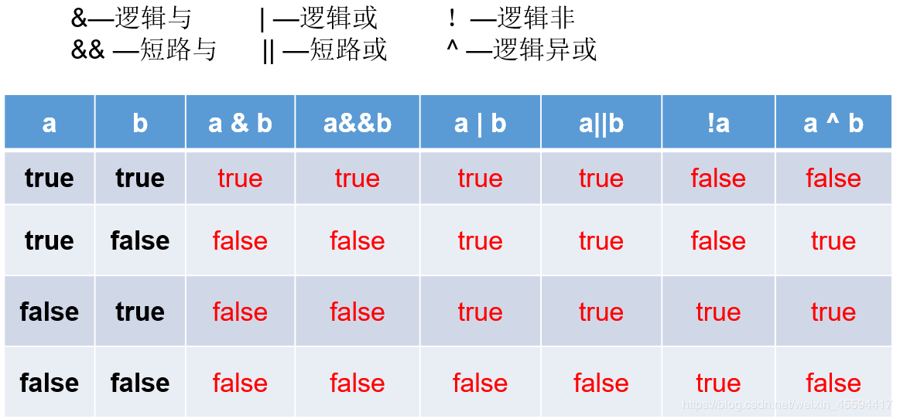
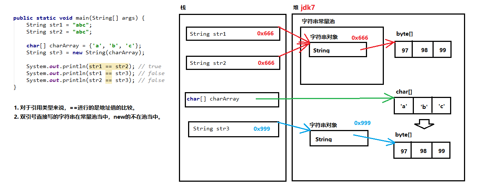

# Core Java Study Notes


## 第一章 Java程序设计概述

### 1.2、JAVA"白皮书"的关键术语

1. 简单性
2. 面向对象
3. 分布式
4. 健壮性
5. 安全性
6. 体系结构中立
7. 可移植性
8. 解释型
9. 高性能
10. 多线程
11. 动态性

## 第二章 Java程序设计环境

###### 工具包术语

- JDK: Java开发工具包
- JRE: Java运行环境
- Server JRE: 服务器JRE
- SE: 标准版
- EE: 企业版
- ME: 微型版


###### :star2:**环境变量配置**

JAVA_HOME c:Java\jdk-11.0.2

Path后面加%JAVA_HOME%\bin;


######  命令行

win+r cmd 

javac Welcome.java //将java文件编译为class文件

java Welcome //执行

###### JShell

## 第三章 Java的基本程序设计结构

### 3.1、一个简单的Java应用程序

```java
public class FirstSample{
	public static void main(String[] args){
        System.out.plainln("Hello,World!");
    }
}
```

### 3.2、注释

//单行注释

/* */多行注释

/** */自动生成文档注释 ==4.9详细讲解==

### 3.3、:star2:基本数据类型

4种整型、2种浮点型、1种字符类型、1种boolean型

| 类型    | 存储空间 | 取值范围                                                     |
| ------- | -------- | ------------------------------------------------------------ |
| int     | 4b       | -2147483648~2147483647                                       |
| short   | 2b       | -32768~32767                                                 |
| long    | 8b       | -9223372036854775808~9223372036854775807                     |
| byte    | 1b       | -128~127                                                     |
| float   | 4b       | 大约&plusmn;3.40282347E&plusmn;38F(有效位数为6~7位)          |
| double  | 8b       | 大约&plusmn;1.79769313486231570E&plusmn;308F(有效位数为15位) |
| char    | 2b       | UTF-16编码中的一个**代码单元**                               |
| boolean | 1b       |                                                              |

| 转义序列 | 名称   | Unicode值 |
| -------- | ------ | --------- |
| \b       | 退格   | \u0008    |
| \t       | 制表   | \u0009    |
| \n       | 换行   | \u000a    |
| \r       | 回车   | \u000d    |
| \\"      | 双引号 | \u0022    |
| \\'      | 单引号 | \u0027    |
| \\\      | 反斜杠 | \u005c    |


### 3.4、变量与常量

```java
int i , j; //不建议声明变量时写在一行，降低可读性
```

变量声明尽可能靠近变量第一次使用的地方

#### 3.4.3、常量

关键词为final表示这个变量只能被赋值一次，常量名使用全大写

````java
final double CM_PER_INCH=2.54;
````

可以在一个类的多个方法中使用的常量，类常量

```java
public static final double CM_PER_INCH=2.54;
```

#### 3.4.4、枚举类型

```java
enum Size {SMALL,MEDIUM,LARGE,EXTRA_LARGE};

Size s = Size.MEDIUM;
```


### 3.5、运算符

\+ - * / % 加减乘除和整数求余

#### 3.5.2、数学函数

Math

sqrt(double a) 平方根

pow(double a,double b) a的b次方

floodMod

#### 3.5.3、类型转换


#### 3.5.6、自增与自减运算

++n与n++

```java
int n = 7;
int m = 7;
int a = 2*++m; 
int b = 2*n++;
```

int a = 2*++m; ==等价于 int a = 2\*(m+1)==

int b = 2*n++; ==等价于 int b = 2\*n+1==

### 3.5.7、运算符



& 与 && 的区别：& 和 | 左右两边的式子一定会执行（比较笨），&& 和 || 只要左边的式子能得出结果，右边的式子就不会执行（比较聪明）。

三元运算符

condition ? expression<sub>1</sub> : expression<sub>2</sub>

condition 为true 值为expression<sub>1</sub>反之为expression<sub>2</sub>

#### 3.5.8、位运算符

&:	1 0010 & 1 0000 = 1 0000 两个操作数中位都为1，结果才为1，否则结果为0

|:	1 0010 & 1 0000 = 1 0010 两个位只要有一个为1，那么结果就是1，否则就为0

^:	1111 ^ 0010 = 1101 如果位为0，结果是1，如果位为1，结果是0

~:	~1101 = 0010 两个操作数的位中，相同则结果为0，不同则结果为1

\> \>	 <<

运算符优先级


### 3.6、字符串

```java
String str1 = "abc";
String str2 = "abc";
String str3 = new String("abc");
```



#### 3.6.2、拼接

字符串间插入

```java
String str = "Hello";
System.out.println(String.join(" /","S","M","L","XL") );
```

输出结果为:S /M /L /XL


JAVA11新增，复制拼接字符串

```java
String str = "Hello";
System.out.println(str.repeat(4));
```

输出结果为：HelloHelloHelloHello

#### 3.6.3、不可变字符串

不可变字符串优点：编译器可以让字符串共享

缺点效率低

#### 3.6.4、字符串是否相等

```java
String str1 = "Hello";
String str2 = "Hello";
String str3 = "hello";
System.out.println(str1.equals(str2));//true
System.out.println(str1.equalsIgnoreCase(str3));//true，不校验大小写区分
System.out.println(str1+""==str2);//false
System.out.println(str1.comparaTo(str2));//0,效率不如equals
```

==str1+""\=\=str2判断这两个字符串是否存在同一个位置==

#### 3.6.6、码点与代码单元

代码点（Code Point）：在 Unicode 代码空间中的一个值，取值 0x0 至 0x10FFFF，代表一个字符。

代码单元（Code Unit）：在具体编码形式中的最小单位。比如 UTF-16 中一个 code unit 为 16 bits，UTF-8 中一个 code unit 为 8 bits。一个 code point 可能由一个或多个 code unit(s) 表示。在 U+10000 之前的 code point 可以由一个 UTF-16 code unit 表示，U+10000 及之后的 code point 要由两个 UTF-16 code units 表示

#### 3.6.7、String API

```java
String greeting = "Hello World!";
greeting.charAt(3);//返回指定位置的代码单元
int i = greeting.codePointAt(4);//返回从给定位置开始的码点
greeting.offsetByCodePoints(1,4);//返回从1码点开始，4个码点之后的码点索引
"sd".compareTo("sd");//按字典顺序比较两个字符串,如果两个字符串内容相同返回0
greeting.codePoints().toArray();//将这个字符串作为一个流返回
"".isEmpty();//如果字符串为空返回true
"  ".isBlank();//如果字符串为空或空格组成返回true
greeting.startsWith("H");//如果字符串以H为开头返回true
greeting.endsWith("o");//如果字符串以o为结尾返回true

//返回与字符串或码点匹配的第一个字串开始的位置
greeting.indexOf("e");
greeting.indexOf("l",5);
greeting.indexOf(111);
greeting.indexOf(111,6);

//返回与字符串或码点匹配的末尾字串开始的位置
greeting.lastIndexOf("e");
greeting.lastIndexOf("l",5);
greeting.lastIndexOf(111);
greeting.lastIndexOf(111,6);

greeting.length();
greeting.codePointCount(1,5);//返回1和4之间的码点个数
greeting.replace("lo","a");//返回新字符串，这个字符串替换lo
greeting.substring(3);
greeting.substring(3,7);//截取字符串
greeting.toLowerCase();//返回一个原字符串全小写字符串
greeting.toUpperCase();//返回一个原字符串全大写字符串
"   Hello   ".trim();//去除收尾空格
"   Hello   ".strip();//去除收尾空格，包括Unicode的空格
```

#### 3.6.9、构建字符串

StringBuilder效率高但线程不安全

StringBuffer效率低线程安全

```java
StringBuilder builder = new StringBuilder();//构造空的构建字符串
builder.append("Hello World");//追加一个字符串并返回一个this
builder.append('c');//追加一个字节并返回一个this
builder.appendCodePoint(97);//追加一个码点并返回一个this
builder.setCharAt(0,'h');//将第0位设置为h
builder.insert(6,'a');//在第6位插入一个字符串并返回this
builder.delete(6,7);//删除偏移量6到6-1的代码单元并返回this
String str = builder.toString();//返回一个与构建器或缓冲器内容相同的字符串
```

### 3.7、输入与输出

```java
Scanner in = new Scanner(System.in);
System.out.println("What is your name");
String name = in.nextLine();
System.out.println("How old are you");
int age = in.nextInt();
System.out.println("Hello, "+name+". Next year , you,ll be" + (age+1));
```

#### 3.7.2、格式化输出

```java
System.out.printf("%+,.2f",-10000.0/3.0);
String name = "William ";
int age = 28;
String message = String.format("Hello,%s. Next year you'll be %d",name,age);
System.out.printf(message);
System.out.printf("%tc", new Date());
System.out.printf("%1$s %2$tB %2$te %2$tY","Due date:",new Date());
System.out.printf("%s %tB %<te %<tY","Due date:",new Date());
```

#### 3.7.3、文件输入与输出

```java
Scanner in = new Scanner(Path.of("C:\\myfile.txt"), StandardCharsets.UTF_8);
PrintWriter out = new PrintWriter("myfile.txt",StandardCharsets.UTF_8);
```


### 3.8、控制流程

#### 3.8.1、块作用域

#### 3.8.2、条件语句

if(choice){}

if(){}else{}

if(){}else if(){}else{}

#### 3.8.3、循环

while(){}

do{}while()

#### 3.8.4、确定循环

for(int i=0;i<=10;i++){}

#### 3.8.5、多重选择: switch

```java
switch(choice){

	case 1:
        ...
        break;
    case 2:
        ...
        break;
    default:
        ...
        break;    
}
```

case标签可以是：

- 类型为char、byte、short或int的常量表达式
- 枚举常量
- 从==Java7==开始，case标签还可以是字符串字面量

#### 3.8.6、中断控制流程语句

break：不执行代码块后面代码，直接退出循环语句

read_data:while(){break read_data;}：带标签的break，用于跳出多重嵌套的循环语句

continue：不执行代码块后面代码，回到循环首部再执行循环

### 3.9、大数

BigInteger：实现任意精度的整数运算

BigDecimal：实现任意精度的浮点数运算

BigInteger方法：

- BigInteger add(BigInteger  other)：求和
- BigInteger subtract(BigInteger  other)：求差
- BigInteger multiply(BigInteger  other)：求积
- BigInteger divide(BigInteger  other)：求商
- BigInteger mod(BigInteger  other)：求余
- BigInteger sqrt(BigInteger  other)：JDK9 平方根
- int compareTo(BigInteger  other)：如果两个大数相等则返回0，小于返回负数，大于返回正数
- static BigInteger valueOf(long x)：返回值等于X的大整数

BigDecimal方法

- BigDecimal add(BigDecimalother)：求和
- BigDecimal subtract(BigDecimalother)：求差
- BigDecimal multiply(BigDecimalother)：求积
- BigDecimal divide(BigDecimalother)：求商 如果商是一个无限循环小数则会抛出一个异常
- BigDecimal divide(BigDecimalother,RoundingMode mode)：RoundingMode为枚举，求上根据mode舍入
- int compareTo(BigInteger  other)：如果两个大数相等则返回0，小于返回负数，大于返回正数
- static BigInteger valueOf(long x)：返回值等于x的大整数
- static BigInteger valueOf(long x,int scale)：返回值等于x/10<sup>scale</sup>的大整数

### 3.10、数组

#### 3.10.1、声明数组

一旦创建数组就不能再改变它的大小

int[] a;	声明数组

int[] a = new int[100];	初始化数组

int[] a = {2,3,4,5,1};	初始化数组简写形式

new int[]{2,3,4,5,1};	匿名数组

int[] a = new int[]{{2,3,4,5,1}} 	初始化数组并直接设置数组大小

int[] b = {2,3,4,5,1};	与上面等价

#### 3.10.2、访问数组元素

创建一个数组时，所有元素都初始化为0。boolean数组的元素会初始化为false，对象数组的元素则初始化为一个特殊值null

#### 3.10.3、for each 循环

增强for循环语句

for(variable : collection) statement

#### 3.10.4、数组拷贝

```java
        int[] a = {1,2,3};
        int[] b = {1,2,3};

        a = b;
        System.out.println(a == b);
        System.out.println(a);
        System.out.println(b);

        int[] a1 = {1,2,3};
        int[] b1 = {1,2,3};

        a1 = Arrays.copyOf(b1,b1.length);
        System.arraycopy(b1, 0, a1, 0, b1.length);
        System.out.println(a1 == b1);
        System.out.println(a1);
        System.out.println(b1);
```

a  =  b指向相同的内存地址

a1 = b1 指向不同的内存地址

#### 3.10.5、命令行参数

3.10.6、数组排序

viod Arrays.sort(xxx[] a): 源码为双枢轴快速排序，不改变内存路径

Arrays API

static String toString(xxx[] a)：返回包含a中元素的一个字符串，a只能是基本数据类型数组

static xxx[] copyOf(xxx[] a,int end)：返回与a类型相同数组，范围为0~end，如果end超过a.length，则会填充默认值

static xxx[] copyOfRange(xxx[] a,int start,int end)：返回与a类型相同数组，范围为start~end，如果end超过a.length，则会填充默认值

static void sort(xxx[] a)：快速排序

static int binarySearch(xxx[] a,xxx v)：

static int binarySearch(xxx[] a,int start,int end,xxx v)：使用二分法查找在有序数组a中查找值v，如果找到v则返回相应下标，否则返回一个负数r，-r-1是v应插入的位置

static void full(xxx[] a,xxx v)：将数组的所有元素都设置为v

static boolean equals(xxx[] a,xxx[] b)：如果两个数组大小相同，并且下标相同的元素都对应相等，返回true

#### 3.10.7、多维数组

```java
double[][] balances;
```

#### 3.10.8、不规则数组

## 第四章 对象与类

### 4.1、面向对象程序设计概述

面向对象程序设计(object-oriented programming,OOP)

#### 4.1.1、类

类：构造对象的模板或蓝图

创建类的实例：由类构造的对象的过程为创建类的实例

封装(或称为数据隐藏)：将数据和行为组合在一个包中，并对对象的使用者隐藏具体实现方式

实例字段：对象中的数据称为实例字段

方法：操作数据的过程为方法

对象的状态：特定对象都有一组特定的实例字段值，这些值的集合就是这个对象的当前状态

无论何时，只要在对象上调用一个方法，他的状态就有可能发生改变

继承：通过扩展一个类来建立另外一个类的过程称为继承

#### 4.1.2 、对象

对象的三个主要特征：

- 对象的行为：可以对对象完成那些操作，或者可以对对象应用哪些方法
- 对象的状态：当调用那些方法时，对象会如何响应
- 对象的标识：如何区分具有相同行为与状态的不同对象

#### 4.1.3、识别类

#### 4.1.4、类之间的关系

常见关系有：

- 依赖（“uses-a”）
- 聚合（“has-a”）
- 继承（“is-a”）

### 4.2、使用预定类

#### 4.2.1、对象与对象变量

想要使用对象，首先必须构造对象，并指定其初始状态，然后对对象应用方法

#### 4.2.2、Java类库中的localDate类

- static LocalDate now()：构造一个表示当前日期的对象
- static LocalDate of(int year,int month,int day)：构造一个表示给定日期的对象
- int getYear()
- int getMonthValue()
- int getDayofMonth()：得到当前日期的年、月、日
- DayOfWeek getDayOfWeek：得到当前日期是星期几，作为一个DayOfWeek的实例返回，调用getValue来得到1~7之间的一个数，表示这是星期几，1表示星期一，7表示星期日
- LocalDate plusDays(int n)
- LocalDate miusDays(int n)：生成当前日期之后或之前n天的日期

#### 4.2.3、更改器方法与访问器方法

更改器方法：改变对象的状态的方法，例如set方法

访问器方法：只访问对象而不修改对象的方法，例如get方法

### 4.3、用户自定义类

#### 4.3.1、Employee类

#### 4.3.2、多个源文件的使用

javac Employee*.java

javac EmployeeTest.java：如果Employee被调用，编译器会自动编译Employee，反之则不会编译

#### 4.3.3、剖析Employee类

==强烈建议将实例字段标记为private==

#### 4.3.4、从构造器开始

在构造Employee类的对象时，构造器会运行，从而将实例字段初始化为所希望的初始状态

构造器：

- 构造器与类名相同
- 每个类有一个或多个参数
- 构造器可以有0个、1个或多个参数
- 构造器没有返回值
- 构造器总伴随着new操作符一起调用

#### 4.3.5、用var声明局部变量

在==Java10==中

```java
Emloyee harry = new Employee("Herry Hacker",50000,1989,10,1);
var harry = new Employee("Herry Hacker",50000,1989,10,1);
```

var关键字只能用于方法中的局部变量。参数和字段的类型必须声明

#### 4.3.6、使用null引用

==Java9==中Objects类提供的null判断方法：

- static <T\> T requireNonNull(T obj,String message)：检查指定的对象引用是否为null ，如果是，则抛出自定义的NullPointerException。
- static <T\>T requireNotNullElse(T obj,T defaultObj)：如果它是非 null ，则返回第一个参数，否则返回非 null第二个参数。 

#### 4.3.7、隐式参数与显式参数

```java
public void raiseSalary(double byPercent){
    double raise = salary * byPercent / 100;
    salary += raise;
}
```

显式参数：又称为方法调用的目标或接收者，位于方法名后面的括号中，上面byPercent就是显式参数

隐式参数：是出现方法名前的对象，上面salary就是显式参数

#### 4.3.8、封装的优点

```java
public String getName(){
    return name;
}
public double getSalary(){
    return salary;
}
public LocalDate getHireDay(){
    return hireDay
}
```

字段访问器：只返回实例字段值的方法

想要获取或设置实例字段的值，需要提供三项内容：

- 一个私有的数据字段
- 一个公共的字段访问器方法
- 一个公共的字段修改器方法

==不要编写返回可变对象引用的访问器方法==

```java
class Employee{
    private Date hireDay;
    public Date getHireDay(){
        return hireDay;
    }
}
```

由于Date是可变的，harry和d引用的是同一对象，所以这样写破坏了封装性

```java
Employee2 harry = new Employee2();
Date d = harry.getHireDay();
double tenYears = 10*365.25*24*60*60*1000;
Date date = d.setTime(d.getTime() - (long)tenYears);
```

直接导致在对d做修改时会同时修改harry的值

```java
class Employee{
    private Date hireDay;
    public Date getHireDay(){
        return (Date)hireDay.clone();
    }
}
```

解决方案为克隆，对象克隆是指存放在另一个新位置上的对象副本

#### 4.3.9、基于类的访问权限

一个方法可以访问所属类的所有对象的私有数据

#### 4.3.10、私有方法

只要方法是私有的，类的设计者就可以确信它不会再别处使用，所以可以将其删除，而不影响其他代码

#### 4.3.11、final实例字段

final修饰的字段必须在构造对象时初始化

final修饰符常用于修饰基本类型或者不可变类的字段

```java
class Employee{
    private final String name;
}
```


### 4.4静态方法

#### 4.4.1、静态字段

静态字段又称为类字段，如果将一个字段定义为static，每个类只有一个这样的字段

```java
class Employee{
    private static int nextId = 1;
    private int id;
}
```

#### 4.4.2、静态常量

```java
public static final double PI = 3.141592653589323846
```

由于每个类对象都可以修改公共字段，所以，最好不要有公共字段。然而，公共常量(final)可以声明为公共，因为它不能被重新赋值

#### 4.4.3、静态方法

静态方法是不在对象上执行的方法

```java
public static int getNextId(){
    retrun nextId;
}
int n = Employee.getNextId();
```

可以使用Employee对象调用静态方法，但不建议这样做，因为会与非静态方法混淆

两种情况下可以使用静态方法

- 方法不需要访问对象状态，因为它需要的所有参数都是通过显示参数提供(例如：Math.pow)
- 方法只需要访问类的静态字段(例如：Employee.getNextId)

#### 4.4.4、工厂方法

#### 4.4.5、main方法

static <T\> void requireNonNull(T obj)

static <T\> void requireNonNull(T obj,String message)

static <T\> void requireNonNull(T obj,Supplier<String\> messageSupplier)：java8

如果obj为null，这些方法会抛出一个NullPointerException异常而没有消息或者给定的消息

static <T\> T requireNonNullElse(T obj,T defaultObj)

static <T\> T requireNonNullElseGet(T obj,Supplier<T\> defaultSupplier)

如果obj不为null则返回obj，或者如果obj为null则返回默认对象

### 4.5、方法参数

按值调用：表示方法接受的是调用者提供的值

按引用调用：表示方法接收的是调用者提供的变量地址

==Java程序设计语言总是采用按值调用==

Java中对方法参数能做什么和不能做什么：

- 方法不能修改基本数据类型的参数(即数值型或布尔值)
- 方法可以改变对象参数的状态
- 方法不能让一个对象参数引用一个新的对象

### 4.6、对象构造

#### 4.6.1、重载

重载：多个方法，有相同的名字、不同的参数。

#### 4.6.2、默认字段初始化

如果构造器中没有显式地为字段设置初始值，那么就会被自动地赋为默认值：数值为0、布尔值为false、对象引用为null，即使想要的值为默认值也应初始化字段

#### 4.6.3、无参数的构造器

public Employee(){

​	name = "";

​	salary = 0;

​	hireDay = LocalDate.now();

}

如果写一个类时没有编写构造器，就会为你提供一个无参数构造器。这个构造器将所有的实例字段设置为默认值。

当类没有其他任何构造器时，会有一个默认的无参构造器。如果你已经写了一个有参构造器，那么如果你想要构造一个无参对象，则必须写一个无参构造器

#### 4.6.4、显式字段初始化

一般常量static final 声明字段在声明时直接初始化

其他字段建议在构造器中初始化

比如类Demo有个Map类型成员变量，如果直接赋值，那么就必须要指定这个Map是何种Map,而通过构造函数赋值，这个就不确定了，有可能是各种Map的实现。所以，通过构造函数与set方法赋值，能够使程序更加的灵活，也能够体现多态的面向对象的特征。

==有点看不懂回头再看==<https://coolshell.cn/articles/1106.html>

#### 4.6.5、参数名

#### 4.6.6、调用另一个构造器

如果构造器的第一个语句形如this(...)，这个构造器将调用同一个类的另一个构造器

```java
public Employee(double s){
    this("Employee #" + nextId, s);
    nextId++;
}
```

#### 4.6.7、初始化块

初始化数据三种方法：

- 在构造器中设置值
- 在声明中赋值
- 在初始化块中赋值

初始化块：只要构造这个类的对象，这些块就会被执行

在一个类声明中，可以包含任意多个代码块

为了避免字段重复定义，建议总是将初始化块放在字段定义之后

Random()：构造一个新的随机数生成器

int nextInt(int i)：返回一个0~n-1之间的随机数

#### 4.6.8、对象析构与finalize方法

### 4.7、包

#### 4.7.1、包名

使用包的主要原因是确保类名的唯一性

#### 4.7.2、类的导入

一个类可以使用所属包中的所有类，以及其他包中的公共类(public class)

两种方式访问一个包中的公共类：

- 完全限定名：java.time.LocalDate today = java.time.LocalDate.now();
- import语句

#### 4.7.3、静态导入

静态导入允许导入静态方法和静态字段，而不只是类

```java
import static java.lang.StrictMath.random;
random();
```

#### 4.7.4、在包中增加类

想要将类放入包中，就必须将包的名字放在源文件的开头，即放在定义这个包中各个类的代码之前

如果没有在源文件中放置package语句，这个源文件中的类就属于无名包

编译器不检查目录结构，虚拟机需要通过目录找到类

#### 4.7.5、包访问

public：任意类使用

private：只能由它们定义的类使用

(defaul)：同一个包下的类使用

 protected：子类使用

#### 4.7.6、类路径

#### 4.7.7、设置类路径

### 4.8、JAR文件

#### 4.8.1、创建JAR文件

#### 4.8.2、清单文件

#### 4.8.3、可执行JAR文件

#### 4.8.4、多版本JAR文件

#### 4.8.5、关于命令行选项的说明

### 4.9、文档注释

#### 4.9.1、注释的插入

#### 4.9.2、类注释

#### 4.9.3、方法注释

- @param variable description：参数
- @return description：返回
- @throws class description：可能抛出的异常

#### 4.9.4、字段注释

#### 4.9.5、通用注释

- @since text：始于，text可以是引入这个特性的版本的任何描述，@since 1.7.1
- @author name：作者
- @version text：版本
- @see reference：参见
- @Link：链接
- @index：搜索框条目

#### 4.9.6、包注释

#### 4.9.7、注释抽取

### 4.10、类设计技巧

1. 一定要保证数据私有

2. 一定要对数据进行初始化

3. 不要在类中使用过多的基本数据类型

4. 不是所有的字段都需要单独的字段访问器和字段更改器

5. 分解有过多职责的类

6. 类名和方法名要能够体现它们的职责：

   类名应当是一个名词(Order)，或者是前面有形容词修饰的名词(RushOrder)，或者是有动名词(有"-ing"后缀)修饰的名词

   访问器方法用小写的get开头

   更改器方法用小写的set开头

7. 优先使用不可变得类

   如果多个线程试图同时更新一个对象，就会发生并发更改

## 第五章、继承

继承的基本思想是，可以基于已有的类创建新的类

反射是指在程序运行期间更多地了解类及其属性的能力

### 5.1、类、超类、和子类

#### 5.1.1、定义子类

关键字**extends**表明正在构造的新类派生于一个已存在的类

这个已存在的类称为***超类、基类或父类***

新类称为***子类或孩子类***

子类中没有显式地定义超类的方法，但是可以对子类的对象使用这些方法，这是因为子类类自动地继承了超类中的方法

应该将最一般的方法放在超类中，而将更特殊的方式放在子类中

#### 5.1.2、覆盖方法

超类的方法并不一定适用于子类，为此需要一个新的方法***覆盖***超类中的方法

子类已经覆盖了超类的方法，但是又需要调用超类的方法，这时候需要使用super关键字

```java
super.getSalary;
```

在子类中可以增加字段、增加方法或覆盖超类的方法，不过继承绝对不会删除任何字段或方法

#### 5.1.3、子类构造器

多态：一个对象变量可以指示多种实际类型的现象称为多态

动态绑定：在运行时能够自动选择适当的方法称为动态绑定

#### 5.1.4、继承层次

继承层次：由一个公共超类派生出来的集合称为继承层次

继承链：从某个特定的类到其祖先的路径称为该类的继承链

#### 5.1.5、多态

替换原则：程序中出现超类对象的任何地方都可以使用子类的对象替换

对象变量是多态的，一个超类的变量既可以引用一个超类的对象，也可以引用任何一个子类的对象

#### 5.1.6、理解方法调用

假设要调用.f(args)，x声明为C类的一个对象，调用的详细描述：

1. 编译器查看对象的声明类型和方法名

2. 编译器确定方法调用中提供的参数类型。如果在所有名为f的方法中存在一个与所提参数类型完全匹配的方法，就选这个方法，这个过程称为***重载解析***

   签名：方法的名字和参数列表称为方法的签名

   子类方法覆盖超类方法并修改返回类型，则称为这两个方法有***可协变***的返回类型

3. 如果是private方法、static方法、final方法或者构造器，那么编译器将可以准确地知道应该调用哪个方法。这个称为***静态绑定***

4. 程序运行并且采用动态绑定调用方法时，虚拟机必须调用与x所引用对象的实际类型对应的那个方法

调用e.getSalary()的解析过程为：

1. 首先，虚拟机获取e的实际类型的方法表
2. 之后，虚拟机查找定义了getSalary签名的类
3. 最后，虚拟机调用这个方法

动态绑定重要特性：无序对现有的代码进行修改就可以对程序进行扩展

在覆盖方法的时候，子类的方法不能低于超类方法的可见性。

#### 5.1.7、阻止继承：final类和方法

不允许扩展的类被称为final类

类中的某个方法也可以被声明为final。如果这样做，子类就不能覆盖这个方法，final类中的所有方法自动地成为final方法，但字段不会被声明为final

如果一个方法没有被覆盖并且很短，编译器就能够对它进行优化处理，这个过程称为***内联***，比如说e.getName()，编译器会将其替换为e.name

#### 5.1.8、强制类型转换

将一个类型强制转换成另一个类型的过程称为强制类型转换

强制类型转换的作用是，要在暂时忽视对象的实际类型之后使用对象的全部功能

instanceof关键字：判断一个对象是否为这个类的实例

```java
Student s = new Student;
s instanceof Student //true
```

强制类型转换使用注意事项：

- 只能在继承层次内进行强制类型转换
- 在将超类强制类型转换为子类之前，应该使用instanceof进行检查

注意：

```java
s = null;
s instanceof Student//false
```

如果s为null，判断不会发生异常，因为null没有引用任何对象

尽量少使用强制类型转换和instanceof关键字

#### 5.1.9、抽象类

父类中的方法，被它的子类们重写，子类各自的实现都不尽相同。那么父类的方法声明和方法主体，只有声明还有意义，而方法主体则没有存在的意义了。我们把没有方法主体的方法称为抽象方法，用abstract关键字声明抽象类。Java语法规定，包含抽象方法的类就是抽象类。

定义：

1. 抽象方法：没有方法体的方法。
2. 抽象类：包含抽象方法的类。

```java
public abstract class Person{
    public abstract String getDescription();
}
```

有抽象方法的类必须声明为抽象类，但是即便不含抽象方法的类，也可以声明抽象类

超类为抽象类的子类，声明时必须重写父类方法

抽象类不能实例化

#### 5.1.10、受保护访问

1. private：仅对本类可见
2. public：对外部完全可见
3. protected：对本包和所有子类可见
4. 默认：对本包可用

### 5.2、Object：所有类的超类

Object类是Java所有类的始祖

如果没有明确地指出超类，Object就被认为是这个类的超类

#### 5.2.1、Object类型的变量

Java当中，只有基本数据类型不是对象

所有数组类型，不管对象数组还是基本数据类型的数组都扩展了Object类

#### 5.2.2、equals方法

Object类中的equals方法用于检测一个对象是否等于另一个对象

#### 5.2.3、相等测试与继承

Java语言规范要求equals方法具有的特性：

1. 自反性：对于任何非空引用x，x.equals(x)应该返回true
2. 对称性：对于任何引用x和y，当且仅当y.equals(x)返回true时，x.equals(y)返回true
3. 传递性：对于任何引用x，y和z，如果x.equals(y)返回true，y.equals(z)返回true，x.equals(z)也应该返回true。
4. 一致性：如果x和y引用的对象没有发生变化，反复调用x.equals(y)应该返回同样的结果。
5. 对于任意非空引用x，x.equals(null)应该返回false

```JAVA
public class Empolyee{
    public boolean equals(Object otherObject){
        //a quick test to see if the Objects are identical
        if(this == otherObject) return true;
        //must return false if the explicit paramenter is null
        if(otherObject == null) return false;
        //if the classes don`t match,they can`t equal
        if(getClass() != otherObject.getClass())
            return false;
        //now we know otherObject is a non-null Employee
        Employee other = (Employee)otherObject;
        //test whether the fields have identical values
        return name.equals(other.name)
            && salary == other.salary 
            && hireDay.equals(other.hireDay);
    }
}
```

编写一个完美的equals方法的建议：

1. 显式参数命名为otherObject，稍后需要将他强制转换成另一个名为other的变量

2. 检测this与otherObject是否相等：意思是检测otherObject是否为该对象本身

   if(this == otherObject) return true;

3. 检测otherObject是否为null

   if(otherObject == null) return false;

4. 比较this与otherObject的类：

   - 如果equals的语义可以在子类中改变，就使用getClass检测

     if(getClass() != otherObject.getClass()) return false;

   - 如果所有子类都有相同的相等性语义，可以使用instanceof检测

     if(!(otherObject instanceof ClassName)) return false;

5. 将otherObject强制转换为相应类类型的变量

   Employee other = (Employee)otherObject;

6. 根据相等性概念的要求改比较字段。使用 == 比较基本类型字段。使用Objects.equals比较对象字段。

   如果所有字段都匹配，就返回true，否则返回false

   return name.equals(other.name)
               && salary == other.salary 
               && hireDay.equals(other.hireDay);

   如果在子类中重新定义equals，就要在其中包含一个super.equals(other)调用


可以使用@Override标记要覆盖超类方法的那些子类方法，如果签名不一致就会报错

java.util.Arrays:

- static boolean equals(xxx[] a,xxx[] b) ==5==：如果两个数组长度相同，并且在对应的位置上数据元素也相同，将返回true

java.util.Objects

- static boolean equals(Object a,Object b) ==7== ：如果a和b都为null，返回true；如果只有其中之一为null，返回false；否则返回a.equals(b)

#### 5.2.4、hashCode方法

散列码(hash code)是由对象导出的一个整型值

String类使用计算散列码：

```java
int hash = 0;
for(int i = 0;i < lenth(); i++){
    hash =31 * hash + charAt(i);
}
```

如果重新定义了equals方法，就必须为用户可能插入散列表的对象重新定义hashcode方法

equals与hashCode的定义必须相容：如果x.equals(y) 返回true，那么x.hashCode()就必须与y.hashCode()返回相同的值

java.lang.Object:

- int hashCode()：返回对象的散列码。散列码可以是任意的整数，包括正数或负数。两个相等的对象要求返回相等的散列码

java.util.Objects: ==7==

- static int hash(Object... objects)：返回一个散列码，由提供的所对象的散列码组合而得到
- static int hashCode(Object a)：如果a为null返回0，否则返回a.hashCode()

java.lang.(Integer|Long|Short|Byte|Double|Float|Character|Boolean)

- static int hashCode(xxx value)：==8==返回给定制的散列码。这里xxx是对应给定包装类型的基本类型。

java.util.Arrays

- static int hashCode(xxx[] a)：==5==计算数组a的散列码。组成这个数组的元素类型xxx可以是Object、int、long、short、char、byte、boolean、float或double

#### 5.2.5、toString方法

toString方法：返回表示对象值的一个字符串

java.lang.Object:

- Class getClass()：返回包含对象信息的类对象
- boolean equals(Object otherObject)：比较两个对象是否相等，如果两个对象指向同一块存储取余，返回true，否则返回false，要在自定义的类中覆盖这个方法
- String toString()：返回表示该对象值的字符串，要在自定义的类中覆盖这个方法

java.lang.Class：

- String getName()：返回这个类的名字
- Class getSuperClass()：以Class对象的形式返回这个类的超类

### 5.3、泛型数组列表

ArrayList是一个有类型参数的泛型类

#### 5.3.1、声明数组列表

java.util.ArrayList<E\> 

- ArrayList<E\>()：构造一个空数组列表
- ArrayList<E\>(int initialCapacity)
- boolean add(E obj)：一旦加了一个元素，数组列表就会将容量定为10
- int size()
- void ensureCapacity(int capacity)：确保数组列表在不重新分配内部存储数组的情况下有足够的容量存储给定数量的元素
- void trimTosize()：可将数组列表的存储容量削减到当前大小

#### 5.3.2、访问数组列表元素

java.util.Arrays<E\>

- E set(int index,E obj)
- E get(int index)
- void add(int index,E obj)
- E remove(int index)

#### 5.3.3、类型化与原始数组列表的兼容性

声明ArrayList时，如果没有声明类型参数，则默认为Object

```java
public class EmployeeDB{
    public void update(ArrayList list){}
    public ArrayList find(String query){}
}
```

```java
ArrayList<EmployeeDB> staff = ...;
employee.update(staff);
```

这时不需要将staff强制转换，但是依然是有风险的，update方法有可能无法处理EmployeeDB类型

```java
ArrayList<Employee> result = employeeDB.find(query);
```

这时返回的数组列表的类型参数是未知的，如果返回类型无法强转为Employee则会报java.lang.ClassCastException强制转换异常错误

```java
@SuppressWarnings("unchecked")
```

用上述注解，可以标记接受强制类型转换的变量，暂时忽略编译器的警告

### 5.4、对象包装器与自动装箱

包装器：将基本类型转换为对象的类称为包装器

ArrayList的类型参数不允许是基本数据类型

ArrayList<Integer\>效率远低于int[]，所以除非必须要ArrayList，否则用int[]

自动装箱：调用list.add(3)编译器会自动变换为list.add(Integer.valueOf(3))，这种变换称为自动装箱

自动拆箱：int n = list.get(i) ==> int n = list,get(i).intValue();

尽量避免频繁自动装拆箱，虽然自动拆装箱是编译器的工作，但是频繁的创建对象会占用虚拟机内存

java.lang.Integer：

- int inValue
- static String toString(int i)
- static String toString(int i,int radix)：返回数值i基于radix参数指定进制的表示
- static int parseInt(String s)
- static int parseInt(String s,int radix)：返回字符串s表示整数，采用radix参数指定的进制
- static Integer valueOf(String s)
- static Integer valueOf(String,int radix)

java.text.NumberFormat

- Number parse(String s)：假设s表示的是一个数值，返回数字值

### 5.5、参数数量可变的方法

变参方法：可以提供参数数量可变的方法

```java
public static double max(double... values){
    double largest = Double.NeGTIVE_INFNITY;
    for(double v:values){
        if(v>largest){
            largest = v;
        }
    }
    return largest;
}
```

### 5.6、枚举类

```java
public enum Size{SMALL,MEDIUM,LARGE,EXTRA_LARGE}
```

可以为枚举类型增加构造器、方法和字段

枚举的构造器总是私有的，可以省略private修饰符

### 5.7、==反射==

反射：能够分享类能力的程序称为反射

反射使用场景：

- 在运行时分析类的能力
- 在运行时检查对象
- 实现泛型数组操作代码
- 利用Method对象

#### 5.7.1、Class类

Java运行时系统始终为所有对象维护一个运行时的类型标识，保存这些类型标识的类名为Class

获得Class类对象的三种方法：

```java
var generator = new Random();
Class c1 = generator.getClass();

String className = "java.util.Random";
Class c2 = Class.forName(className);

Class c4 = Random.class;
```

虚拟机为每个类型管理一个唯一的Class对象。因此，可以利用 == 运算符实现两个类对象的比较

```java
var c1 = Class.forName("java.util.Random");
Object obj = c1.getConstructor().newInstance();
```

Class类型对象，调用getConstructor方法获得Constructor类型对象，再调用newInstance方法来构造一个实例

java.lang.Class

- string getName()：返回这个类的类名及包名

- static Class forName(String className)：返回一个Class对象，表示名为className的类
- Constructor getConstructor(Class... parameterType)：生成一个对象，描述有指定参数类型的构造器

java.lang.reflect.Constructor

- Object newInstance(Object... params)：将params传递到构造器，来构造这个构造器声明类的一个新实例

java.lang.Throwable

- void printStackTrace()：将Throwable对象和堆栈轨迹打印到标准错误流

#### 5.7.2、声明异常入门

处理器可以捕获异常并进行处理

检查型异常：建议其将会检查你是否知道这个异常并做好准备来处理后果

非检查型异常：编译器并不期望你为这些异常提供处理器

#### 5.7.3、资源

java.lang.Class

- URL getResource(String name)

- InputStream getResourceAsStream(String name)

  找到与类位于同一位置的资源，返回一个可以用来加载资源的URL或输入流

#### 5.7.4、利用反射分析类的能力

java.lang.Class：

- Field[] getFields()：返回一个包含Field对象的数组，这些对象对应这个类或其他超类的公共字段

- Field[] getDeclaredFields()：只返回当前类的公共字段，不返回超类的公共字段

- Method[] getMethods()：返回包含Method对象的数组，包含该类及继承自超类的所有公共方法

- Method[] getDeclaredMethods()

- Constructor[] getConstructors()：返回包含Constructor对象的数组，包含该类及继承自超类的所有公共构造器

- Constructor[] getDeclaredConstructors();

- String getPackageName()：==9==得到包含这个类型的包的包名，如果这个类型是一个数组类型，则返回元素类型所属的包，或者如果这个类型是一个基本数据类型，则返回“java.lang”

java.lang.reflect.Field

java.lang.reflect.Method

java.lang.reflect.Constructor

- Class getDeclaringClass()：返回一个Class对象，表示定义了这个构造器、方法或字段的类

- Class getExceptionType()(在Constructor和Method classes类中)

  返回一个Class对象数组，其中各个对象表示这个方法所抛出的异常的类型

- int getModifiers()：返回一个整数，描述这个构造器、方法或字段的修饰符。使用Modifier类中的方法来分析这个返回值

- String getName()

- Class[] getParameterTypes()(在Constructor和Method classes类中)

  返回一个Class对象数组，其中各个对象表示参数的类型

- Class getReturnType()(在Method类中)

java.lang.reflect.Modifier

- static String toString(int modifiers)：返回一个字符串，包含对应modifiers中位设置的修饰符

- static boolean isAbstract(int modifiers)
- static boolean isAbstract(int modifiers)
- static boolean isFinal(int modifiers)
- static boolean isInterface(int modifiers)
- static boolean isNative(int modifiers)
- static boolean isPrivate(int modifiers)
- static boolean isProtected(int modifiers)
- static boolean isPublic(int modifiers)
- static boolean isStatic(int modifiers)
- static boolean isStrict(int modifiers)
- static boolean isSynchronized(int modifiers)
- static boolean isVolatile(int modifiers)

这些方法将检测modifiers值中与方法明中修饰符对应的二进制位

#### 5.7.5、使用反射在运行时分析对象

利用反射机制可以查看在编译时还不知道的对象字段

java.lang.reflect.AccessibleObject

- void setAccessible(boolean flag)：设置或取消这个可访问对象的可访问标志，如果拒绝访问则抛出一个IllegalAccessException异常
- boolean trySetAccessible()：==9==为这个可访问的对象设置可访问标志，如果拒绝则返回false
- boolean isAccessible()：得到这个可访问对象的可访问标志值
- static void setAccessible(AccessibeObject[] array,boolean flag)：设置一个对象数组的可访问标志

java.lang.Class

- Field getField(String name)：得到指定名的公共字段
- Field[] getFields()：所有这些字段的一个数组
- Field getDeclaredField(String name)
- Fields getDeclaredFields()

java.lang.reflect.Field

- Object get(Object obj)：返回obj对象中用这个Field对象描述的字段的值
- void set(Object obj,Object newValue)：将Obj对象中这个Field对象描述的字段设置为一个新值

#### 5.7.6、使用反射编写泛型数组代码

java.lang.reflect.Array

- static Object get(Object array,int index)

- static xxx getXxx(Object array,int index)

  (xxx 是boolean、byte、char、double、float、int、long、short中的一种基本类型)这些方法将返回存储给定数组中给定索引位置上的值

- static void set(Object array,int index,xxx newValue)

- static void setXxx(Object array,int index,xxx newValue)

#### 5.7.7、调用任意方法和构造器

java.lang.reflect.Method

- public Object invoke(Object implicitParamenter,Object[] explicitParamenter)

  调用这个对象描述的方法，传入给定参数，并返回方法的返回值。对于静态方法，传入null作为隐式参数。使用包装器传递基本类型值。基本类型的返回值必须是未包装的

### 5.8、继承的设计技巧

1. 将公共操作和字段放在超类中
2. 不要使用受保护的字段
3. 使用继承实现“is-a”关系
4. 除非所有继承的方法都有意义，否则不要使用继承
5. 在覆盖方法时，不要改变预期的行为
6. 使用多台，而不要使用类型信息
7. 不要滥用反射

## 第六章、接口、lambda表达式与内部类

### 6.1、接口

接口：接口用来描述类应该做什么，而不是指定他们应该具体做什么

一个类可以实现一个或多个接口

#### 6.1.1、接口的概念

```java
class Employee implements Comparable<Employee>{
    public int compareTo(Employee other){
        return Double.compare(salary,other.salary);
    }
}

Arrays.sort(new Employee[3]);
```

想要调用Arrays.sort方法，显式参数类型必须实现接口Comparable，因为Arrays.sort必须调用compareTo方法

接口不是类，而是对希望符合这个接口的类的一组需求

接口中的所有方法都自动是public方法，因此，在接口中声明方法时，不必提供关键字public

接口绝不会有实例字段

让类实现接口步骤：

1. 将类声明为实现给定的接口，关键字为implements
2. 对接口中的所有方法提供定义

实现接口时，必须把方法声明为public

实现接口的主要原因是，Java是一种强类型语言，在调用方法的时候，编译器要能检查这个方法确实存在

java.lang.Comparable<T\>

- int copareTo(T other)：用这个对象与other进行比较，小于other返回负整数，等于返回0，大于返回正整数

java.util.Arrays

- static void sort(Object[] a)：对数组a中的元素排序，a中元素必须实现Comparable接口，并且元素之间必须可比较

java.Iang.Integer

- static int compare(int x,int y)：x<y返回负整数，x=y返回0，x>y返回正整数

java.lang.Double

- static int compate(double x,double y)

#### 6.1.2、接口的属性

接口不是类，不能通过new实例化接口

接口变量必须应用实现了这个接口的类对象

可以使用instanceof检查一个对象是否实现了某个特定的接口

接口中不能包含实例字段，但可以包含常量

接口中的方法都自动被设置为public一样，接口中的字段总是public static final

#### 6.1.3、接口与抽象类

每个类只能扩展一个类，但是每个类可以实现多个接口

#### 6.1.4、静态和私有方法

允许在接口中增加静态方法

#### 6.1.5、默认方法

可以为接口方法提供一个默认实现，必须用default修饰符标记这样一个方法

```java
public interface Iterator<E>{
    boolean hashNext();
    E next();
    defualt void remove(){
        throw new UnsupportedOperationException("remove");
    }
}
```

默认方法的一个重要用法是“接口演化”，如果接口增加了一个方法，只能通过默认方法来扩展，否则不能保证“源代码兼容”

#### 6.1.6、解决默认方法冲突

1. 如果这个类的超类与接口定义了同样签名的方法，超类优先

   

2. 如果这个类的两个接口中，其中一个接口定义了默认方法，另一个接口定义了同样签名的方法（不管这个方法是不是默认方法），这个类必须覆盖这个方法。但是当这两个接口都没有为共享方法提供默认实现，就不会引起冲突

#### 6.1.7、接口与回调

回调是一种常见的设计模式。在这种模式中，可以指定某个特定事件发生时应该采取的动作

#### 6.1.8、Comparator接口

#### 6.1.9、==对象克隆==

```java
var original = new Employee("John Public",50000);
Employee copy = original;
copy.raiseSalary(10);
```

当original对象建立copy副本后，copy修改salary值，同时original的salary的值也会改变，这时就需要clone

```java
Employee copy = original.clone();
copy.raiseSalary(10);
```

默认的克隆操作是“浅拷贝”，并没有克隆对象中引用的其他对象。如果引用的对象是可变的，那么浅克隆出的对象所引用的对象还是会一同改变，如Date类的对象

如果原对象的浅克隆对象共享的子对象是不可变的，那么这种共享就是安全的，如String对象

浅拷贝同时克隆所有可变的引用对象就是深拷贝

对于每一个类，需要确定：

1. 默认的clone方法是否满足需求
2. 是否可以在可变的子对象上调用clone来修补默认的clone方法
3. 是否不该使用克隆

第三项为默认选项，如果选择一二项，类必须：

1. 实现Cloneable接口
2. 重新定义clone方法，并指定public访问修饰符

Object类中的clone方法声明为protected

Cloneable接口的出现与接口的正常使用，这个接口的作用是，当一个对象请求克隆，但是没有实现这个接口，那么就会生成一个检查型异常

Cloneable是一个少有的**标记接口**(或称为**记号接口**)，标记接口不包含任何方法，它的唯一作用就是允许在类型查询中使用instanceof

### 6.2、lambda表达式

lambda表达式是一个可传递的代码块，可以在一个执行一次或多次

#### 6.2.1、为什么引入lambda表达式

在引入lambda表达式之前，由于java是一种面向对象语言，传递一段代码块并不容易，必须构造一个对象，然后引用这个对象实现的方法来传递，所以引入lambda表达式来处理代码块

#### 6.2.2、lambda表达式的语法

1. 有参表达式：(参数) -> {表达式}

```java
(String first,String second) -> {first.length() - second.length()}
```

2. 无参表达式：() -> {表达式}

```java
() -> {
    for (int i = 100; i>=0; i++){
        System.out.println(i);
    }
}
```

3. 可推导出参数类型，可省略参数类型

```java
Comparator comp = (first , second) -> {
    first.length() - second.length();
}
```

4. 只有一个参数，且参数类型可推导，可以省略空格

```java
ActionListener listener = event -> 
    System.out.println("The time is " + INstant.ofEpochMilli(event.getWhen()));
```

5. 无序指定lambda表达式的返回类型

```java
(String first,String second) -> {first.length() - second.length()}
```

#### 6.2.3、函数式接口

函数式接口：对于只有一个抽象方法的接口，需要这种接口的对象是，就可以提供一个lambda表达式

```java
public class Test {
    static IntCall intcall;
    public static void main(String[] args) {
        intcall = i -> {
            if(i<10){
                return i+intcall.call(i+1);
            }else{
                return i;
            }
        };
        int i2 = intcall.call(1);
    }
}
interface IntCall{
    int call(int x);
}
```

在java中，对lambda表达式所能做的也只是转换为函数式接口

#### 6.2.4、方法引用

```java
var timer = new Timer(1000,event -> System.out.println(event));
//lambda简写为
var timer = new Timer(1000,System.out::println);
```

方法引用指示编译器生成一个函数式接口的实例，覆盖这个接口的抽象方法来调用给定的方法

用 :: 运算符分割方法名与对象或类名：

1. object :: instanceMethod
2. Class :: instanceMethod
3. Class :: staticMethod

只有当lambda表达式的体只调用一个方法而不做其他操作时，才能把lambda表达式重写为方法引用

#### 6.2.5、构造器引用

构造器引用与方法引用很类似，只不过方法名为new。例如，Person::new是Person构造器的一个引用

```java
Arraylist<String> names = ...;
Stream<Person> stream = names.stream().map(Person::new);
List<Person> people =stream.collect(Collectors.toList());
```

Java有一个限制，无法构造泛型类型T的数组。数组构造器引用对于克服这个限制很有用。表达式new T[n]会产生错误，因为这会改为new Object[n]

```java
Person[] people = stream.toArray(Person[]::new);
```

#### 6.2.6、变量作用域

lambda表达式中可以捕获外围作用域中的变量的值，但要确保所捕获的值是明确定义的。在lambda表达式中，只能引用值不会改变的变量。

下面做法为不合法的，因为start是会改变的变量：

```java
public static void countDown(int start,int delay){
    ActionListener listener = event -> {
        start--;
        System.out.println(start);
    };
    new Timer(delay,listener).start();
}
```

如果在lambda表达式中引用一个变量，而这个变量可能在外部改变，这也是不合法的

下面做法是不合法的，因为i在外部发生了改变：

```java
public static void repeat(String text,int count){
    for(int i = 1; i <= count; i++){
        ActionListener listener = event -> {
            System.out.println(i + ":" + text);
        };
        new Timer(1000,listener.start());
    }
}
```

lambda表达式中捕获的变量必须实际上是事实最终变量，事实最终变量是指，这个变量初始化之后就不会再为它赋新值。

lambda表达式的体育嵌套块有相同的作用域

#### 6.2.7、处理lambda表达式

使用lambda表达式的重点是延迟执行

这样做的原因有：

- 在一个单独的线程中运行代码
- 多次运行代码
- 在算法的适当位置运行代码
- 发生某种情况是执行代码
- 只在必要时才运行代码

如果设计你自己的接口，其中只有一个抽象方法，可以用@FunctionalInterface注解来标记这个接口。这样做有两个优点。如果你无意中增加了另一个抽象方法，编译器会产生一个错误消息。另外javadoc页会指出你的接口是一个函数式接口

#### 6.2.8、再谈Comparator

### 6.3、内部类

内部类是定义在另一个类中的类

使用内部类的两个原因：

- 内部类可以对同一个包中的其他类隐藏
- 内部类方法可以访问定义这个类的作用域中的数据，包括原本私有的数据

#### 6.3.1、使用内部类访问对象的状态

一个内部类方法可以访问自身的数据，也可以访问创建它的外围对象的数据字段

内部类的对象总有一个隐式引用，指向创建它的外部类对象

类的可声明权限修饰符

外部类：public、(defualt)

内部类：public、protected、(defualt)、private

#### 6.3.2、内部类的特殊语法规则

使用外围类引用：OuterClass.this

外围类的作用域之外引用内部类：OuterClass.InnerClass

内部类不能有static方法

#### 6.3.3、内部类是否有用、必要和安全

内部类是一个编译器现象，与虚拟机无关。编译器将会把内部类转换为常规的类文件，用$分隔外部类名与内部类名，而虚拟机则对此一无所知

内部类可以访问外围类的私有数据，但外部类则不能访问内部类的的私有数据

如果内部类访问了私有数据字段，就有可能通过外围类所在包中增加的其他类访问那些字段

#### 6.3.4、局部内部类

声明局部类是不能有访问说明符。局部类的作用域被限定在声明这个局部类的块中

局部类有个很大的优势，即对外部世界完全隐蔽

#### 6.3.5、由外部方法访问变量

局部类还有一个优点。它们不仅能够访问外部类的字段，还可以访问局部变量。不过局部变量必须是**事实最终变量**

#### 6.3.6、匿名内部类

假如只想创建这个类的对象，甚至不需要为类指定名字。这样一个类被称为匿名内部类

```java
new SuperType(construction parameters){
    inner class methods and data
}
```

SuperType如果是接口，匿名内部类就要实现这个接口；如果是类，匿名内部类就要扩展这个类

```java
var count = new Person("Dracula"){{initalization}};
```

尽管匿名类不能有构造器，但可以提供一个对象初始化块

外层括号建立了ArrayList的一个匿名子类。内层括号则是一个对象初始化块

#### 6.3.7、静态内部类

使用内部类只是为了把一个隐藏在另一个类的内部，并不需要内部类有外围类对象的一个引用。为此，可以将内部类声明为static，这样就不会生成那个引用。

只要内部类不需要方位外围类对象，就应该使用静态内部类。有些程序员用嵌套类表示静态内部类

与常规类不同，静态内部类可以有静态字段可方法

在接口中声明的内部类自动是static和public

### 6.4、==服务加载器==

### 6.5、==代理==

