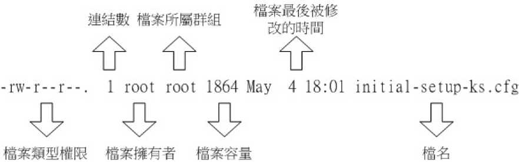
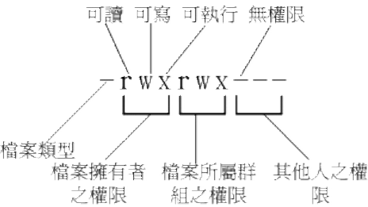
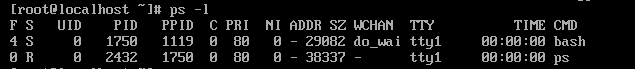
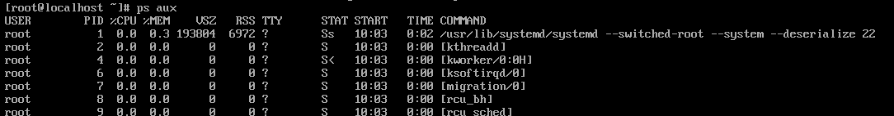
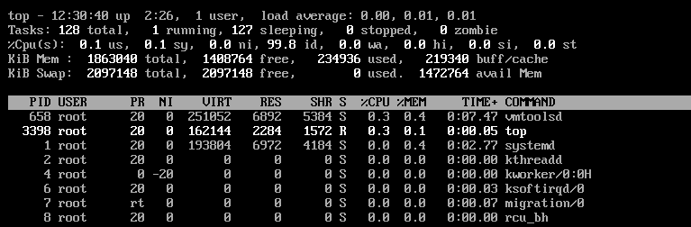

# 鸟哥的Linux私房菜(基础篇)

## 五、Linux文件权限及目录配置

### 5.2、Linux文件权限概念

#### 5.2.1、Linux文件权限概念




第一栏、文件类型及权限



- 第一个字符代表这个文件是“目录、文件或链接文件等等”：
  - 当为[ d ]则是目录，例如上表文件名为“.config”的那一行；
  - 当为[ - ]则是文件，例如上表文件名为“initial-setup-ks.cfg”那一行；
  - 若是[ l ]则表示为链接文件（link file）；
  - 若是[ b ]则表示为设备文件里面的可供储存的周边设备（可随机存取设备）；
  - 若是[ c ]则表示为设备文件里面的序列埠设备，例如键盘、鼠标（一次性读取设
    备）。
- 接下来的字符中，以三个为一组，且均为“rwx” 的三个参数的组合。其中，[ r ]代表可读
  （read）、[ w ]代表可写（write）、[ x ]代表可执行（execute）。要注意的是，这三个
  权限的位置不会改变，如果没有权限，就会出现减号[ - ]而已。
  - 第一组为“文件拥有者可具备的权限”，以“initial-setup-ks.cfg”那个文件为例，该文件
    的拥有者可以读写，但不可执行；
  - 第二组为“加入此群组之帐号的权限”；
  - 第三组为“非本人且没有加入本群组之其他帐号的权限”。

第二栏、表示有多少文件名链接到此节点（i-node）：
每个文件都会将他的权限与属性记录到文件系统的i-node中，不过，我们使用的目录树却是使
用文件名来记录，因此每个文件名就会链接到一个i-node啰！这个属性记录的，就是有多少
不同的文件名链接到相同的一个i-node号码去就是了。关于i-node的相关数据我们会在第七章
谈到文件系统时再加强介绍的。

第三栏、表示这个文件（或目录）的“拥有者帐号”

第四栏、表示这个文件的所属群组

第五栏、为这个文件的容量大小，默认单位为Bytes；
第六栏、为这个文件的创建日期或者是最近的修改日期：

第七栏、为这个文件的文件名

#### 5.2.2、改变文件属性及权限

- chgrp ：改变文件所属群组

  ```shell
  [root@study ~]# chgrp [-R] dirname/filename ...
  选项与参数：
  -R : 进行递回（recursive）的持续变更，亦即连同次目录下的所有文件、目录
  都更新成为这个群组之意。常常用在变更某一目录内所有的文件之情况。
  ```

- chown ：改变文件拥有者

  ```shell
  [root@study ~]# chown [-R] 帐号名称文件或目录
  [root@study ~]# chown [-R] 帐号名称:群组名称文件或目录
  选项与参数：
  -R : 进行递回（recursive）的持续变更，亦即连同次目录下的所有文件都变更
  ```

- chmod ：改变文件的权限, SUID, SGID, SBIT等等的特性

  权限对照表：>r:4>w:2>x:1

  用户对照表：user：u，group：g，other：o

  ```shell
  [root@study ~]# chmod [-R] xyz 文件或目录
  选项与参数：
  xyz : 就是刚刚提到的数字类型的权限属性，为rwx 属性数值的相加。
  -R : 进行递回（recursive）的持续变更，亦即连同次目录下的所有文件都会变更
  #也可以用字母
  [root@study ~]# chmod u=rwx,go=rx .bashrc
  # 注意喔！那个u=rwx,go=rx 是连在一起的，中间并没有任何空白字符！
  ```

### 5.3、Linux目录配置

#### 5.3.1、Linux目录配置依据FHS

|                      | 可分享的（shareable）        | 不可分享的（unshareable） |
| -------------------- | ---------------------------- | ------------------------- |
| 不变的（static）     | /usr （软件放置处）          | /etc （配置文件）         |
|                      | /opt （第三方协力软件）      | /boot （开机与核心档）    |
| 可变动的（variable） | /var/mail （使用者邮件信箱） | /var/run （程序相关）     |
|                      | /var/spool/news （新闻群组） | /var/lock （程序相关）    |

第一部分：FHS要求必须要存在的目录

| 目录   | 应放置文件内容                                               |
| ------ | ------------------------------------------------------------ |
| /bin   | 系统有很多放置可执行文件的目录，但/bin比较特殊。因为/bin放置的是在单人维护模式下还能够被操作的指令。在/bin下面的指令可以被root与一般帐号所使用，主要有：cat, chmod, chown, date, mv, mkdir, cp, bash等等常用的指令。 |
| /boot  | 这个目录主要在放置开机会使用到的文件，包括Linux核心文件以及开机菜单与开机所需配置文件等等。Linux kernel常用的文件名为：vmlinuz，如果使用的是grub2这个开机管理程序，则还会存在/boot/grub2/这个目录喔！ |
| /dev   | 在Linux系统上，任何设备与周边设备都是以文件的型态存在于这个目录当中的。你只要通过存取这个目录下面的某个文件，就等于存取某个设备啰～比要重要的文件有/dev/null, /dev/zero, /dev/tty, /dev/loop, /dev/sd等等 |
| /etc   | 系统主要的配置文件几乎都放置在这个目录内，例如人员的帐号密码档、各种服务的启始档等等。一般来说，这个目录下的各文件属性是可以让一般使用者查阅的，但是只有root有权力修改。FHS建议不要放置可可执行文件（binary）在这个目录中喔。比较重要的文件有：/etc/modprobe.d/,/etc/passwd, /etc/fstab, /etc/issue 等等。另外FHS 还规范几个重要的目录最好要存在/etc/ 目录下喔：/etc/opt（必要）：这个目录在放置第三方协力软件/opt 的相关配置文件/etc/X11/（建议）：与X Window 有关的各种配置文件都在这里，尤其是xorg.conf 这个X Server 的配置文件。/etc/sgml/（建议）：与SGML 格式有关的各项配置文件/etc/xml/（建议）：与XML格式有关的各项配置文件 |
| /lib   | 系统的函数库非常的多，而/lib放置的则是在开机时会用到的函数库，以及在/bin或/sbin下面的指令会调用的函数库而已。什么是函数库呢？你可以将他想成是“外挂”，某些指令必须要有这些“外挂”才能够顺利完成程序的执行之意。另外FSH 还要求下面的目录必须要存在：/lib/modules/：这个目录主要放置可抽换式的核心相关模块（驱动程序）喔！ |
| /media | media是“媒体”的英文，顾名思义，这个/media下面放置的就是可移除的设备啦！包括软盘、光盘、DVD等等设备都暂时挂载于此。常见的文件名有：/media/floppy, /media/cdrom等等 |
| /mnt   | 如果你想要暂时挂载某些额外的设备，一般建议你可以放置到这个目录中。在古早时候，这个目录的用途与/media相同啦！只是有了/media之后，这个目录就用来暂时挂载用了。 |
| /opt   | 这个是给第三方协力软件放置的目录。什么是第三方协力软件啊？举例来说，KDE这个桌面管理系统是一个独立的计划，不过他可以安装到Linux系统中，因此KDE的软件就建议放置到此目录下了。另外，如果你想要自行安装额外的软件（非原本的distribution提供的），那么也能够将你的软件安装到这里来。不过，以前的Linux系统中，我们还是习惯放置在/usr/local目录下呢！ |
| /run   | 早期的FHS 规定系统开机后所产生的各项信息应该要放置到/var/run 目录下，新版的FHS 则规范到/run 下面。由于/run 可以使用内存来仿真，因此性能上会好很多！ |
| /sbin  | Linux有非常多指令是用来设置系统环境的，这些指令只有root才能够利用来“设置”系统，其他使用者最多只能用来“查询”而已。放在/sbin下面的为开机过程中所需要的，里面包括了开机、修复、还原系统所需要的指令。至于某些服务器软件程序，一般则放置到/usr/sbin/当中。至于本机自行安装的软件所产生的系统可执行文件（system binary），则放置到/usr/local/sbin/当中了。常见的指令包括：fdisk, fsck, ifconfig, mkfs等等。 |
| /srv   | srv可以视为“service”的缩写，是一些网络服务启动之后，这些服务所需要取用的数据目录。常见的服务例如WWW, FTP等等。举例来说，WWW服务器需要的网页数据就可以放置在/srv/www/里面。不过，系统的服务数据如果尚未要提供给网际网络任何人浏览的话，默认还是建议放置到/var/lib下面即可。 |
| /tmp   | 这是让一般使用者或者是正在执行的程序暂时放置文件的地方。这个目录是任何人都能够存取的，所以你需要定期的清理一下。当然，重要数据不可放置在此目录啊！因为FHS甚至建议在开机时，应该要将/tmp下的数据都删除唷！ |
| /usr   | 第二层FHS 设置，后续介绍                                     |
| /vsr   | 第二曾FHS 设置，主要为放置变动性的数据，后续介绍             |
第二部份：FHS建议可以存在的目录

| 目录        | 应放置文件内容                                               |
| ----------- | ------------------------------------------------------------ |
| /home       | 这是系统默认的使用者主文件夹（home directory）。在你新增一个一般使用者帐号时，默认的使用者主文件夹都会规范到这里来。比较重要的是，主文件夹有两种代号喔：~：代表目前这个使用者的主文件夹~dmtsai ：则代表dmtsai 的主文件夹！ |
| /lib\<qual> | 用来存放与/lib 不同的格式的二进制函数库，例如支持64 位的/lib64 函数库等 |
| /root       | 系统管理员（root）的主文件夹。之所以放在这里，是因为如果进入单人维护模式而仅挂载根目录时，该目录就能够拥有root的主文件夹，所以我们会希望root的主文件夹与根目录放置在同一个分区中。 |

FHS没有提到过且比较重要的目录
| 目录        | 应放置文件内容                                               |
| ----------- | ------------------------------------------------------------ |
| /lost+found | 这个目录是使用标准的ext2/ext3/ext4文件系统格式才会产生的一个目录，目的在于当文件系统发生错误时，将一些遗失的片段放置到这个目录下。不过如果使用的是xfs 文件系统的话，就不会存在这个目录了！ |
| /proc       | 这个目录本身是一个“虚拟文件系统（virtual filesystem）”喔！他放置的数据都是在内存当中，例如系统核心、行程信息（process）、周边设备的状态及网络状态等等。因为这个目录下的数据都是在内存当中，所以本身不占任何硬盘空间啊！比较重要的文件例如：/proc/cpuinfo, /proc/dma,/proc/interrupts, /proc/ioports, /proc/net/* 等等。 |
| /sys        | 这个目录其实跟/proc非常类似，也是一个虚拟的文件系统，主要也是记录核心与系统硬件信息较相关的信息。包括目前已载入的核心模块与核心侦测到的硬件设备信息等等。这个目录同样不占硬盘容量喔！ |

/usr 的意义与内容

依据FHS的基本定义，/usr里面放置的数据属于可分享的与不可变动的（shareable,
static），如果你知道如何通过网络进行分区的挂载（例如在服务器篇会谈到的NFS服务
器），那么/usr确实可以分享给区域网络内的其他主机来使用

第一部份：FHS 要求必须要存在的目录

| 目录        | 应放置文件内容                                               |
| ----------- | ------------------------------------------------------------ |
| /usr/bin    | 所有一般用户能够使用的指令都放在这里！目前新的CentOS 7 已经将全部的使用者指令放置于此，而使用链接文件的方式将/bin 链接至此！也就是说，/usr/bin 与/bin 是一模一样了！另外，FHS 要求在此目录下不应该有子目录！ |
| /usr/bin    | 基本上，与/lib 功能相同，所以/lib 就是链接到此目录中的！     |
| /usr/local  | 系统管理员在本机自行安装自己下载的软件（非distribution默认提供者），建议安装到此目录，这样会比较便于管理。举例来说，你的distribution提供的软件较旧，你想安装较新的软件但又不想移除旧版，此时你可以将新版软件安装于/usr/local/目录下，可与原先的旧版软件有分别啦！你可以自行到/usr/local去看看，该目录下也是具有bin, etc,include, lib...的次目录喔！ |
| /usr/sbin   | 非系统正常运行所需要的系统指令。最常见的就是某些网络服务器软件的服务指令（daemon）啰！不过基本功能与/sbin 也差不多，因此目前/sbin 就是链接到此目录中的。 |
| /usr./share | 主要放置只读架构的数据文件，当然也包括共享文件。在这个目录下放置的数据几乎是不分硬件架构均可读取的数据，因为几乎都是文字文件嘛！在此目录下常见的还有这些次目录：/usr/share/man：线上说明文档/usr/share/doc：软件杂项的文件说明/usr/share/zoneinfo：与时区有关的时区文件 |
第二部份：FHS 建议可以存在的目录


| 目录             | 应放置文件内容                                               |
| ---------------- | ------------------------------------------------------------ |
| /usr/games/      | 与游戏比较相关的数据放置处                                   |
| /usr/include/    | c/c++等程序语言的文件开始（header）与包含档（include）放置处，当我们以tarball方式（*.tar.gz 的方式安装软件）安装某些数据时，会使用到里头的许多包含档喔！ |
| /usr/libexec/    | 某些不被一般使用者惯用的可执行文件或脚本（script）等等，都会放置在此目录中。例如大部分的X 窗口下面的操作指令，很多都是放在此目录下的。 |
| /usr/lib\<qual>/ | 与/lib\<qual>/功能相同，因此目前/lib\<qual> 就是链接到此目录中 |
| /usr/src/        | 一般源代码建议放置到这里，src有source的意思。至于核心源代码则建议放置到/usr/src/linux/目录下。 |

/var 的意义与内容：

如果/usr是安装时会占用较大硬盘容量的目录，那么/var就是在系统运行后才会渐渐占用硬盘
容量的目录。因为/var目录主要针对常态性变动的文件，包括高速缓存（cache）、登录文件
（log file）以及某些软件运行所产生的文件，包括程序文件（lock file, run file），或者例如
MySQL数据库的文件等等

第一部份：FHS 要求必须要存在的目录


| 目录        | 应放置文件内容                                               |
| ----------- | ------------------------------------------------------------ |
| /var/cache/ | 应用程序本身运行过程中会产生的一些暂存盘；                   |
| /var/lib/   | 程序本身执行的过程中，需要使用到的数据文件放置的目录。在此目录下各自的软件应该要有各自的目录。举例来说，MySQL的数据库放置到/var/lib/mysql/而rpm的数据库则放到/var/lib/rpm去！ |
| /var/lock/  | 某些设备或者是文件资源一次只能被一个应用程序所使用，如果同时有两个程序使用该设备时，就可能产生一些错误的状况，因此就得要将该设备上锁（lock），以确保该设备只会给单一软件所使用。举例来说，烧录机正在烧录一块光盘，你想一下，会不会有两个人同时在使用一个烧录机烧片？如果两个人同时烧录，那片子写入的是谁的数据？所以当第一个人在烧录时该烧录机就会被上锁，第二个人就得要该设备被解除锁定（就是前一个人用完了）才能够继续使用啰。目前此目录也已经挪到/run/lock 中！ |
| /var/log/   | 重要到不行！这是登录文件放置的目录！里面比较重要的文件如/var/log/messages, /var/log/wtmp（记录登陆者的信息）等。 |
| /var/mail/  | 放置个人电子邮件信箱的目录，不过这个目录也被放置到/var/spool/mail/目录中！通常这两个目录是互为链接文件啦！ |
| /var/run/   | 某些程序或者是服务启动后，会将他们的PID放置在这个目录下喔！至于PID的意义我们会在后续章节提到的。与/run 相同，这个目录链接到/run去了！ |
| /var/spool/ | 这个目录通常放置一些伫列数据，所谓的“伫列”就是排队等待其他程序使用的数据啦！这些数据被使用后通常都会被删除。举例来说，系统收到新信会放置到/var/spool/mail/中，但使用者收下该信件后该封信原则上就会被删除。信件如果暂时寄不出去会被放到/var/spool/mqueue/中，等到被送出后就被删除。如果是工作调度数据（crontab），就会被放置到/var/spool/cron/目录中！ |

## 六、Linux文件与目录管理

### 6.1、目录与路径

#### 6.1.2、目录的相关操作

```
. 代表此层目录
.. 代表上一层目录
- 代表前一个工作目录
~ 代表“目前使用者身份”所在的主文件夹
~account 代表account 这个使用者的主文件夹（account是个帐号名称）
```

- cd：变换目录

- pwd：显示目前所在目录

  ```shell
  [root@study ~]# pwd [-P]
  选项与参数：
  -P ：显示出确实的路径，而非使用链接（link）路径。
  ```

- mkdir：创建新目录

  ```shell
  [root@study ~]# mkdir [-mp] 目录名称
  选项与参数：
  -m ：设置文件的权限喔！直接设置，不需要看默认权限（umask）的脸色～
  -p ：帮助你直接将所需要的目录（包含上层目录）递回创建起来！
  ```

- rmdir：删除“空”的目录

  ```shell
  [root@study ~]# rmdir [-p] 目录名称
  选项与参数：
  -p ：连同“上层”“空的”目录也一起删除
  ```


### ls：文件与目录检视

```shell
[root@study ~]# ls [-aAdfFhilnrRSt] 文件名或目录名称..
[root@study ~]# ls [--color={never,auto,always}] 文件名或目录名称..
[root@study ~]# ls [--full-time] 文件名或目录名称..
选项与参数：
-a ：全部的文件，连同隐藏文件（开头为. 的文件）一起列出来（常用）
-A ：全部的文件，连同隐藏文件，但不包括. 与.. 这两个目录
-d ：仅列出目录本身，而不是列出目录内的文件数据（常用）
-f ：直接列出结果，而不进行排序（ls 默认会以文件名排序！）
-F ：根据文件、目录等信息，给予附加数据结构，例如：
*:代表可可执行文件；/:代表目录；=:代表socket 文件；;:代表FIFO 文件；
-h ：将文件大小以人类较易读的方式（例如GB, KB 等等）列出来；
-i ：列出inode 号码，inode 的意义下一章将会介绍；
-l ：长数据串行出，包含文件的属性与权限等等数据；（常用）
-n ：列出UID 与GID 而非使用者与群组的名称（UID与GID会在帐号管理提到！）
-r ：将排序结果反向输出，例如：原本文件名由小到大，反向则为由大到小；
-R ：连同子目录内容一起列出来，等于该目录下的所有文件都会显示出来；
-S ：以文件大小大小排序，而不是用文件名排序；
-t ：依时间排序，而不是用文件名。
--color=never ：不要依据文件特性给予颜色显示；
--color=always ：显示颜色
--color=auto ：让系统自行依据设置来判断是否给予颜色
--full-time ：以完整时间模式（包含年、月、日、时、分）输出
--time={atime,ctime} ：输出access 时间或改变权限属性时间（ctime）
而非内容变更时间（modification time）

```

### mkdir：创建新目录

```shell
[root@study ~]# mkdir [-mp] 目录名称
选项与参数：
-m ：设置文件的权限喔！直接设置，不需要看默认权限（umask）的脸色～
-p ：帮助你直接将所需要的目录（包含上层目录）递回创建起来！
范例：请到/tmp下面尝试创建数个新目录看看：
[root@study ~]# cd /tmp
[root@study tmp]# mkdir test &lt;==创建一名为test 的新目录
[root@study tmp]# mkdir test1/test2/test3/test4
mkdir: cannot create directory ‘test1/test2/test3/test4’: No such file or directory
# 话说，系统告诉我们，没可能创建这个目录啊！就是没有目录才要创建的！见鬼嘛？
[root@study tmp]# mkdir -p test1/test2/test3/test4
# 原来是要建test4 上层没先建test3 之故！加了这个-p 的选项，可以自行帮你创建多层目录！
范例：创建权限为rwx--x--x的目录
[root@study tmp]# mkdir -m 711 test2
[root@study tmp]# ls -ld test*
drwxr-xr-x. 2 root root 6 Jun 4 19:03 test
drwxr-xr-x. 3 root root 18 Jun 4 19:04 test1
drwx--x--x. 2 root root 6 Jun 4 19:05 test2
# 仔细看上面的权限部分，如果没有加上-m 来强制设置属性，系统会使用默认属性。
# 那么你的默认属性为何？这要通过下面介绍的[umask](../Text/index.html#umask) 才能了解喔！^_^
```

### tar：打包指令

```shell
[dmtsai@study ~]$ tar [-z|-j|-J] [cv] [-f 待建立的新檔名] filename... <==打包与压缩
[dmtsai@study ~]$ tar [-z|-j|-J] [tv] [-f 既有的 tar檔名]             <==察看文件名
[dmtsai@study ~]$ tar [-z|-j|-J] [xv] [-f 既有的 tar檔名] [-C 目錄]   <==解压缩
选项与参数：
-c ：创建打包文件，可搭配-v 来察看过程中被打包的文件名（filename）
-t ：察看打包文件的内容含有哪些文件名，重点在察看“文件名”就是了；
-x ：解打包或解压缩的功能，可以搭配-C （大写）在特定目录解开
特别留意的是，-c, -t, -x 不可同时出现在一串命令行中。
-z ：通过gzip 的支持进行压缩/解压缩：此时文件名最好为*.tar.gz
-j ：通过bzip2 的支持进行压缩/解压缩：此时文件名最好为*.tar.bz2
-J ：通过xz 的支持进行压缩/解压缩：此时文件名最好为*.tar.xz
特别留意，-z, -j, -J 不可以同时出现在一串命令行中
-v ：在压缩/解压缩的过程中，将正在处理的文件名显示出来！
-f filename：-f 后面要立刻接要被处理的文件名！建议-f 单独写一个选项啰！（比较不会忘记）
-C 目录：这个选项用在解压缩，若要在特定目录解压缩，可以使用这个选项。
其他后续练习会使用到的选项介绍：
-p（小写）：保留备份数据的原本权限与属性，常用于备份（-c）重要的配置文件
-P（大写）：保留绝对路径，亦即允许备份数据中含有根目录存在之意；
--exclude=FILE：在压缩的过程中，不要将FILE 打包
```

简单记忆：

- 压　缩：tar -j\<u>c\</u>v -f filename.tar.bz2 要被压缩的文件或目录名称
- 查　询：tar -j\<u>t\</u>v -f filename.tar.bz2
- 解压缩：tar -j\<u>x\</u>v -f filename.tar.bz2 -C 欲解压缩的目录

### nohup：忽略挂起

```shell
[root@study ~]# nohup [指令与参数] <==在终端机前景中工作
[root@study ~]# nohup [指令与参数] & <==在终端机背景中工作
```

### ps

ps 是撷取一个时间点的程序状态

```shell
ps -ef <==查看进程
ps -ef|grep A <==查看进程A
ps aux <==观察系统所有的程序数据
ps -lA <==也是能够观察所有系统的数据
ps axjf <==连同部分程序树状态
选项与参数：
-A ：所有的process 均显示出来，与-e 具有同样的效用；
-a ：不与terminal 有关的所有process ；
-u ：有效使用者（effective user）相关的process ；
x ：通常与a 这个参数一起使用，可列出较完整信息。
输出格式规划：
l ：较长、较详细的将该PID 的的信息列出；
j ：工作的格式（jobs format）
-f ：做一个更为完整的输出。
```

#### ps -l：

仅观察自己的bash(操作系统)相关程序



- F：代表这个程序旗标（process flags），说明这个程序的总结权限，常见号码有：
若为4 表示此程序的权限为root ；
若为1 则表示此子程序仅进行复制（fork）而没有实际执行（exec）。
- S：代表这个程序的状态（STAT），主要的状态有：
- R （Running）：该程序正在运行中；
- S （Sleep）：该程序目前正在睡眠状态（idle），但可以被唤醒（signal）。
- D ：不可被唤醒的睡眠状态，通常这支程序可能在等待I/O 的情况（ex>打印）
- T ：停止状态（stop），可能是在工作控制（背景暂停）或除错（traced）状态；
- Z （Zombie）：僵尸状态，程序已经终止但却无法被移除至内存外。
- UID/PID/PPID：代表“此程序被该UID 所拥有/程序的PID 号码/此程序的父程序PID 号
码”
- C：代表CPU 使用率，单位为百分比；
- PRI/NI：Priority/Nice 的缩写，代表此程序被CPU 所执行的优先顺序，数值越小代表该
程序越快被CPU 执行。详细的PRI 与NI 将在下一小节说明。
- ADDR/SZ/WCHAN：都与内存有关，ADDR 是kernel function，指出该程序在内存的哪
个部分，如果是个running 的程序，一般就会显示“ - ” / SZ 代表此程序用掉多少内存/
- WCHAN 表示目前程序是否运行中，同样的，若为- 表示正在运行中。
- TTY：登陆者的终端机位置，若为远端登陆则使用动态终端接口（pts/n）；
- TIME：使用掉的CPU 时间，注意，是此程序实际花费CPU 运行的时间，而不是系统时
间；
- CMD：就是command 的缩写，造成此程序的触发程序之指令为何。

#### ps aux

观察系统所有程序



- USER：该process 属于那个使用者帐号的？
- PID ：该process 的程序识别码。
- %CPU：该process 使用掉的CPU 资源百分比；
- %MEM：该process 所占用的实体内存百分比；
- VSZ ：该process 使用掉的虚拟内存量（KBytes）
- RSS ：该process 占用的固定的内存量（KBytes）
- TTY ：该process 是在那个终端机上面运行，若与终端机无关则显示?，另外，tty1-tty6
是本机上面的登陆者程序，若为pts/0 等等的，则表示为由网络连接进主机的程序。
- STAT：该程序目前的状态，状态显示与ps -l 的S 旗标相同（R/S/T/Z）
- START：该process 被触发启动的时间；
- TIME ：该process 实际使用CPU 运行的时间。
- COMMAND：该程序的实际指令为何？

### kill：移除工作

```shell
[root@study ~]# kill -signal %jobnumber
[root@study ~]# kill -l
选项与参数：
-l ：这个是L 的小写，列出目前kill 能够使用的讯号（signal）有哪些？
signal ：代表给予后面接的那个工作什么样的指示啰！用man 7 signal 可知：
-1 ：重新读取一次参数的配置文件（类似reload）；
-2 ：代表与由键盘输入[ctrl]-c 同样的动作；
-9 ：立刻强制删除一个工作；
-15：以正常的程序方式终止一项工作。与-9 是不一样的。
范例一：找出目前的bash 环境下的背景工作，并将该工作“强制删除”。
[root@study ~]# jobs
[1]+ Stopped vim ~/.bashrc
[2] Stopped find / -print
[root@study ~]# kill -9 %2; jobs
[1]+ Stopped vim ~/.bashrc
[2] Killed find / -print
# 再过几秒你再下达jobs 一次，就会发现2 号工作不见了！因为被移除了！
范例二：找出目前的bash 环境下的背景工作，并将该工作“正常终止”掉。
[root@study ~]# jobs
[1]+ Stopped vim ~/.bashrc
[root@study ~]# kill -SIGTERM %1
# -SIGTERM 与-15 是一样的！您可以使用kill -l 来查阅！
# 不过在这个案例中，vim 的工作无法被结束喔！因为他无法通过kill 正常终止的意思！
```


### 4、top

持续侦测程序运行的状态

```
top [-d 数字] top [-bnp]
选项与参数：
-d ：后面可以接秒数，就是整个程序画面更新的秒数。默认是5 秒；
-b ：以批次的方式执行top ，还有更多的参数可以使用喔！
通常会搭配数据流重导向来将批次的结果输出成为文件。
-n ：与-b 搭配，意义是，需要进行几次top 的输出结果。
-p ：指定某些个PID 来进行观察监测而已。
在top 执行过程当中可以使用的按键指令：
? ：显示在top 当中可以输入的按键指令；
P ：以CPU 的使用资源排序显示；
M ：以Memory 的使用资源排序显示；
N ：以PID 来排序喔！
T ：由该Process 使用的CPU 时间累积（TIME+）排序。
k ：给予某个PID 一个讯号（signal）
r ：给予某个PID 重新制订一个nice 值。
q ：离开top 软件的按键。
```



- 第一行（top...）：这一行显示的信息分别为：
  - 目前的时间，亦即是12:30:40 那个项目；
  - 开机到目前为止所经过的时间，亦即是up 2:26, 那个项目；
  - 已经登陆系统的使用者人数，亦即是1 users, 项目；
  - 系统在1, 5, 15 分钟的平均工作负载。我们在第十五章谈到的batch 工作方式为负载
  - 小于0.8 就是这个负载啰！代表的是1, 5, 15 分钟，系统平均要负责运行几个程序
    （工作）的意思。越小代表系统越闲置，若高于1 得要注意你的系统程序是否太过
    繁复了！
- 第二行（Tasks...）：显示的是目前程序的总量与个别程序在什么状态（running,
sleeping, stopped, zombie）。比较需要注意的是最后的zombie 那个数值，如果不是0
！好好看看到底是那个process 变成僵尸了吧？
- 第三行（%Cpus...）：显示的是CPU 的整体负载，每个项目可使用? 查阅。需要特别注
意的是wa 项目，那个项目代表的是I/O wait，通常你的系统会变慢都是I/O 产生的问题
比较大！因此这里得要注意这个项目耗用CPU 的资源喔！另外，如果是多核心的设
备，可以按下数字键“1”来切换成不同CPU 的负载率。
- 第四行与第五行：表示目前的实体内存与虚拟内存（Mem/Swap）的使用情况。再次重
申，要注意的是swap 的使用量要尽量的少！如果swap 被用的很大量，表示系统的实体
内存实在不足！
- 第六行：这个是当在top 程序当中输入指令时，显示状态的地方。

至于top 下半部分的画面，则是每个process 使用的资源情况。比较需要注意的是：

- PID ：每个process 的ID 啦！
- USER：该process 所属的使用者；
- PR ：Priority 的简写，程序的优先执行顺序，越小越早被执行；
- NI ：Nice 的简写，与Priority 有关，也是越小越早被执行；
- %CPU：CPU 的使用率；
- %MEM：内存的使用率；
- TIME+：CPU 使用时间的累加；
top 默认使用CPU 使用率（%CPU）作为排序的重点，如果你想要使用内存使用率排序，则
可以按下“M”，若要回复则按下“P”即可。如果想要离开top 则按下“ q ”吧！如果你想要将top
的结果输出成为文件时，可以这样做：

```shell
范例二：将top 的信息进行2 次，然后将结果输出到/tmp/top.txt
[root@study ~]# top -b -n 2 > /tmp/top.txt
这样一来，嘿嘿！就可以将top 的信息存到/tmp/top.txt 文件中了。
```

### 5、sed


### 6、grep


### 7、awk

awk是一款小型的数据处理工具

```shell
[dmtsai@study ~]$ awk '条件类型1{动作1} 条件类型2{动作2} ...' filename
```

awk 后面接两个单引号并加上大括号{} 来设置想要对数据进行的处理动作。awk 可以处理后
续接的文件，也可以读取来自前个指令的standard output 

### 图形化界面切换设置

```shell
#设置为命令行界面
systemctl set-default multi-user.target
#设置为图形化界面
systemctl set-default graphical.target
```


### 全部代码：


6. scp
7. rm
8. watch
9. df
10. tcpdump
11. lsof
12. nc
13. netstat
14. vmstat
15. mpstat
16. split
17. wc -c +filename
18. more/less
19. head/tail
20. diff
23. cd
25. cp
26. pwd
27. tree
28. touch
29. chmod 
30. file
31. cat
32. tr
33. sort
34. find
35. which
36. whereis
37. locate
39. service
40. curl
41. wget
42. ping
43. telnet
44. nslookup
45. ss
46. ifconfig
47. su
48. sudo
49. du
50. free
51. sar
52. lsof
53. ulimit
54. iostat

