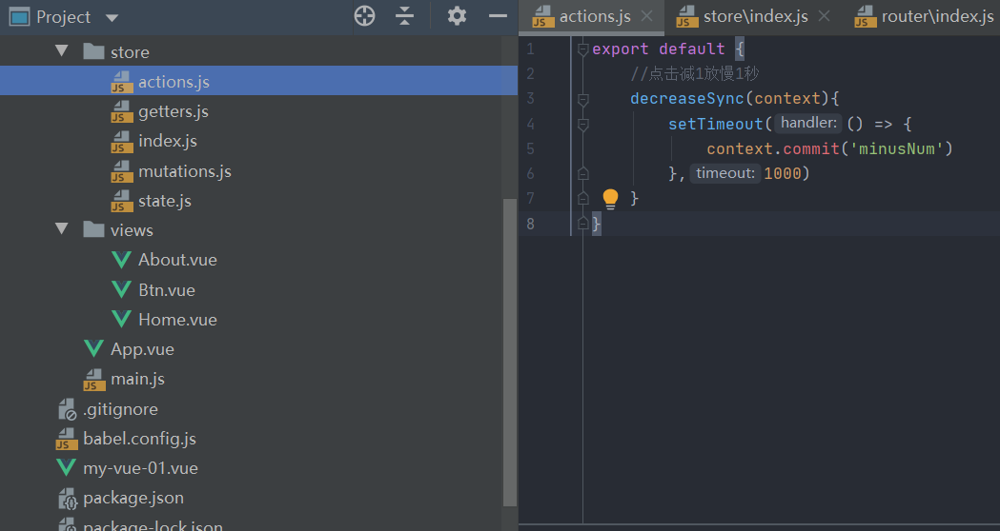
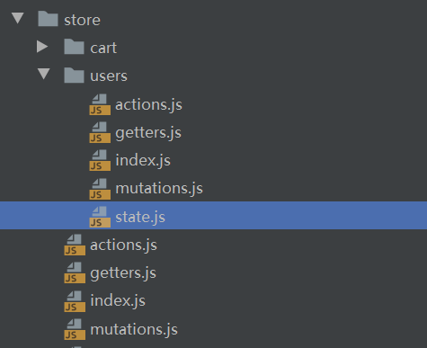

# Vuex快速入门

https://www.bilibili.com/video/BV1dp4y1S7G6

Vuex是vue的一种状态管理模式

## 1、state

在state中定义数据，在组件中直接使用

目录：store/index.js

```js
import Vuex  from 'vuex'
import Vue from "vue";

Vue.use(Vuex)
export default new Vuex.Store({
    // state相当于组件的data，专门用来存放全局的数据
    state : {
        num : 0
    },
    getters : {},
    mutations : {},
    actions : {},
    modules : {}
})
```

目录：view/About.vue

```html
<template>
  <div class="about">
    <h1>About页面的数字：{{$store.state.num}}</h1>
  </div>
</template>
```

目录：view/Home.vue

```html
<template>
  <div class="home">
    <h1>Home页面的数字：{{num}}</h1>
  </div>
</template>
<script>
export default {
  name: 'Home',
  components: {
  },
  computed : {
    num(){
      return this.$store.state.num
    }
  },
}
</script>
```

## 2、getters

将组件中统一使用的computed都放到getters里面来操作

目录：store/index.js

```js
import Vuex  from 'vuex'
import Vue from "vue";
Vue.use(Vuex)
export default new Vuex.Store({
    // state相当于组件的data，专门用来存放全局的数据
    state : {
        num : 0
    },
    //getters相当于组件中的compute，getters是全局的，而compute是组件内使用的
    getters : {
        getNum(state){
            return state.num
        }
    },
    mutations : {},
    actions : {},
    modules : {}
})
```

目录：view/Home.vue

```vue
<template>
  <div class="home">
    <h1>Home页面的数字：{{$store.getters.getNum}}</h1>
  </div>
</template>
<script>
export default {
  name: 'Home',
}
</script>
```

```vue
<template>
  <div class="about">
    <h1>About页面的数字：{{$store.getters.getNum}}</h1>
  </div>
</template>
```

## 3、mutations

更改 Vuex 的 store 中的状态的唯一方法是提交 mutation

目录：store/index.js

```js
import Vuex  from 'vuex'
import Vue from "vue";
Vue.use(Vuex)
export default new Vuex.Store({
    // state相当于组件的data，专门用来存放全局的数据
    state : {
        num : 0
    },
    //getters相当于组件中的compute，getters是全局的，而compute是组件内使用的
    getters : {
        getNum(state){
            return state.num
        }
    },
    //mutations相当于组件中的methods，但他不能使用异步方法（定时器、axios）
    //payload是一个形参，如果组件在commit时，有传这个参数过来，就存在，如果没传则是undefind
    mutations : {
        addNum(state,payload){
            state.num += payload ? payload : 1;
        }
    },
    actions : {},
    modules : {}
})
```

目录：view/Home.vue

```vue
<template>
  <div class="home">
    <h1>Home页面的数字：{{$store.getters.getNum}}</h1>
  </div>
</template>
<script>
export default {
  name: 'Home',
}
</script>
```

目录：view/Btn.vue

```vue
<template>
    <div>
        <button @click="addBtn">点击加1</button>
    </div>
</template>

<script>
    export default {
        name: "Btn",
        methods : {
            addBtn : function () {
                this.$store.commit('addNum',3)
            }
        }
    }
</script>
```

## 4、actions

actions是store中专门处理异步的，实际修改状态值的，还是mutations

目录：store/index.js

```js
import Vuex  from 'vuex'
import Vue from "vue";

Vue.use(Vuex)


export default new Vuex.Store({
    // state相当于组件的data，专门用来存放全局的数据
    state : {
        num : 0
    },
    //getters相当于组件中的compute，getters是全局的，而compute是组件内使用的
    getters : {
        getNum(state){
            return state.num
        }
    },
    //mutations相当于组件中的methods，但他不能使用异步方法（定时器、axios）
    mutations : {
        addNum(state,payload){
            state.num += payload ? payload : 1;
        },
        minusNum(state,payload){
            state.num -= payload ? payload : 1;
        }
    },
    //actions专门修改异步，实际修改值的，依然是mutations
    actions : {
        //点击减1放慢1秒
        decreaseSync(context){
            setTimeout(() => {
                context.commit('minusNum')
            },1000)
        }
    },
    modules : {}
})
```

目录：view/Btn.vue

```vue
<template>
    <div>
        <button @click="$store.commit('addNum')">点击加1</button>
        <button @click="$store.commit('decreaseSync')">点击减1</button>
    </div>
</template>

<script>
    export default {
        name: "Btn",
        methods : {
        }
    }
</script>
```

## 5、辅助函数

mapState和mapGetters都是写在computed中

```vue
<template>
  <div class="home">
    <h1>Home页面的数字：{{num}}</h1>
    <h1>About页面的数字：{{getNum}}</h1>
  </div>
</template>
<script>
import { mapState,mapGetters } from 'vuex'
export default {
  name: 'Home',
  computed : {
    ...mapState(['num']),
    ...mapGetters(['getNum'])
  },
}
</script>
```

mapMutations和mapActions都是写在methods中

```vue
<template>
    <div>
        <button @click="addNum(2)">点击加1</button>
        <button @click="decreaseSync()">点击减1</button>
    </div>
</template>
<script>
    import {mapMutations,mapActions} from 'vuex'
    export default {
        name: "Btn",
        computed:{

        },
        methods : {
            ...mapMutations(['addNum']),
            ...mapActions(['decreaseSync'])
        }
    }
</script>
```

## 6、拆分写法

store中所有属性都可以拆分成单独的js文件来书写

```js
import Vuex  from 'vuex'
import Vue from "vue";

import state from "./state";
import getters from "./getters";
import mutations from "./mutations";
import actions from "./actions";

Vue.use(Vuex)

export default new Vuex.Store({
    // state相当于组件的data，专门用来存放全局的数据
    state,
    //getters相当于组件中的compute，getters是全局的，而compute是组件内使用的
    getters,
    //mutations相当于组件中的methods，但他不能使用异步方法（定时器、axios）
    mutations,
    //actions专门修改异步，实际修改值的，依然是mutations
    actions,
    modules : {}
})
```



## 7、modules

store可以视为一个主模块，可以分解为多个子模块

子模块同样可以拥有状态和属性，甚至是孙模块



目录：store/users/state.js

```js
export default {
    nickName : '张三',
    token : 'iuhzsfmijafhhwekld'
}
```

目录：store/users/index.js

```js
import state from "./state";
import getters from "./getters";
import mutations from "./mutations";
import actions from "./actions";

export default{
    namespaced : true,
    state,
    getters,
    mutations,
    actions,
    modules : {}
}
```

目录：store/index.js

```js
import Vuex  from 'vuex'
import Vue from "vue";
import state from "./state";
import getters from "./getters";
import mutations from "./mutations";
import actions from "./actions";
import users from './users/index'
Vue.use(Vuex)
export default new Vuex.Store({
    // state相当于组件的data，专门用来存放全局的数据
    state,
    //getters相当于组件中的compute，getters是全局的，而compute是组件内使用的
    getters,
    //mutations相当于组件中的methods，但他不能使用异步方法（定时器、axios）
    mutations,
    //actions专门修改异步，实际修改值的，依然是mutations
    actions,
    modules : {
        users
    }
})
```

```vue
<template>
  <div class="home">
    <h1>Home页面的数字：{{num}}</h1>
    <h1>Users里面的数据：{{$store.state.users.nickName}}</h1>
    <button @click="changeNickName()">点我改名</button>
  </div>
</template>

<script>
import { mapState,mapMutations } from 'vuex'
export default {

  name: 'Home',
  computed : {
    ...mapState(['num'])
  },
  methods : {
    ... mapMutations(
      {
        'changeNickName':'users/changeNickName'
      }
    ),
  }

}
</script>
```

## 8、MUTATIONS_TYPE

将mutations中的方法归纳起来的一种写法

目录：store/mutations_type.js

```js
export const MUTATIONS_TYPE = {
    ADDNUM : 'addNum',
    MINUSNUM : 'minusNum'
}
export default {
    [MUTATIONS_TYPE.ADDNUM](state,payload){
        state.num += payload ? payload : 1;
    },
    [MUTATIONS_TYPE.MINUSNUM](state,payload){
        state.num -= payload ? payload : 1;
    }
}
```

目录：store/index.js

```js
...
import mutations from "./mutations_type";
...
export default new Vuex.Store({
...
    //mutations相当于组件中的methods，但他不能使用异步方法（定时器、axios）
    mutations,
...
})
```

目录：store/About.vue

```vue
<template>
  <div class="about">
    <h1>About页面的数字：{{getNum}}</h1>
    <button @click="addNum()">About点击加1</button>
  </div>
</template>
<script>
  import {mapGetters,mapMutations} from 'vuex'
  import { MUTATIONS_TYPE } from "../store/mutations_type";
  export default {
    computed : {
      ...mapGetters(['getNum'])
    },
    methods : {
      ...mapMutations([MUTATIONS_TYPE.ADDNUM])
      // addNum : function () {
      //   this.$store.commit(MUTATIONS_TYPE.ADDNUM)
      // }
    }
  }
</script>
```


