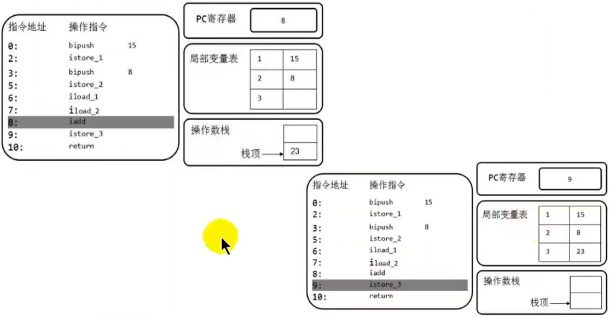
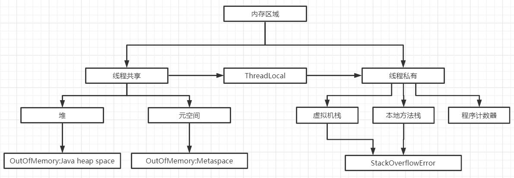
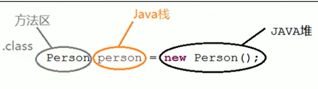
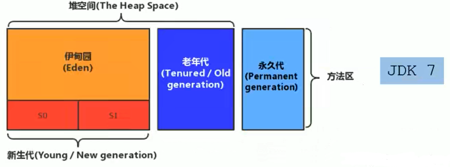
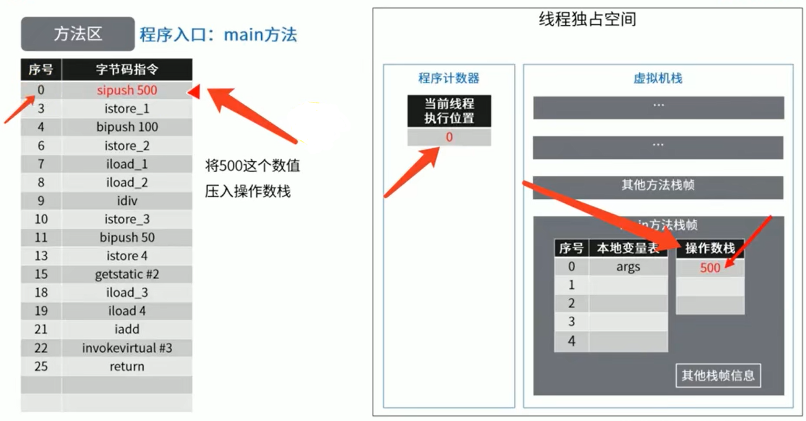

# 尚硅谷JVM

P1 - P203

## 一、Java虚拟机概述

### 1.1、什么是Java虚拟机

Java虚拟机是一台执行Java字节码的虚拟计算机，它拥有独立的运行机制，其运行的Java字节码也未必由Java语言编译而成

JVM平台的各种语言可以共享Java虚拟机的跨平台性、优秀的垃圾回收器，以及可靠的即时编译器

Java的技术核心就是Java虚拟机(JVM Java VIrtual Machine)，因为所有Java程序都运行在Java虚拟机内部

Java虚拟机就是二进制字节码的运行环境，负责装载字节码到其内部，解释/编译为对应平台上的机器指令执行。

优点：

- 一次编译，到处运行
- 自动内存管理
- 自动垃圾回收功能

缺点：

- 过于无脑，如果虚拟机没有管理好内存，Java程序员可能不会解决内存溢出问题

### 1.2、JVM的位置


JVM包含在JDK当中

### 1.3、JVM整体结构


### 1.4、Java代码执行流程


### 1.5、JVM的架构模型

Java编译器输入的指令流基本上是基于栈的指令集架构，另一种指令集架构则是基于寄存器的指令集架构

基于栈式架构的特点：

- 设计和实现更简单，适用于资源受限的系统
- 避开了寄存器的分配难题：使用零地址指令方式分配
- 指令流中的指令大部分是零地址指令，其执行过程依赖于操作栈。指令集更少，编译器更容易
- 不需要硬件支持，可移植性更好，更好实现跨平台

基于寄存器架构的特点：

- 典型的应用是x86的二进制指令集：比如传统的PC以及Android的Devlik虚拟机
- 指令集架构则完全依赖硬件，可移植性差
- 性能优秀和执行更高效
- 花费更少的指令去完成一项操作
- 在大部分的情况下，基于寄存器架构的指令集往往都以一地址指令、二地址指令和三地址指令为主，而基于栈式架构的指令集却是以零地址指令为主

由于跨平台性的设计，Java的指令都是根据栈来设计的。不同平台CPU架构不同，所以不能基于寄存器的。优点是跨平台，指令集小，编译器容易实现，缺点是性能下降，实现同样的功能需要更多的指令

### 1.6、JVM的生命周期

1. 虚拟机的启动

   Java虚拟机是通过引导类加载器创建一个初始类来完成的，这个类是通过虚拟机的具体实现指定的

2. 虚拟机的执行

   Java程序开始执行它才运行，程序运行结束它就停止

   执行一个Java程序的时候，执行的就是一个Java虚拟机的进程

3. 虚拟机的退出
   - 程序正常执行结束
   - 程序在执行过程中遇到了异常或错误而异常终止
   - 由于操作系统错误导致Java虚拟机进程终止
   - 某线程调用Runtime类或System类的exit方法，或Runtime类的halt方法，并且Java安全管理器也允许这次exit或halt操作
   - 用JNI INVOCATION API来加载或卸载JVM时，JVM退出

### 1.7、JVM发展历程

**Sun Classic VM**

- 第一款Java虚拟机，JDK1.4被淘汰
- 只提供了解释器，没有提供JIT编译器(即时编译器)
- 可外挂JIT编译器，但是运行时只能二选一，所以最开始的Java运行很慢

**Exact VM**

jdk1.2发行，使用了准确式内存管理，通过这种技术，虚拟机可以知道内存中某个位置的数据具体是什么类型的。实现了编译器和解释器混合式工作，还实现了热点代码即时编译的功能(热点探测)，但是Exact VM只在Solaris平台上短暂使用，并且在下一版本被弃用

**HotSpot VM**

JDK1.3成为默认虚拟机，一直到现在

HotSpot就是指它的热点代码探测技术，也就是上面提到的热点探测。

**Jrockit VM**

专注于服务器端应用，所以不包含解释器实现，Jrockit是目前最快的JVM。

JRockit面向延迟敏感型应用的解决方案JRockit Real Time提供以毫秒及微秒级的JVM响应时间

MissionControl服务套件，它是一组以极低的开销来监控、管理和分析生产环境中的应用程序的工具

**J9**

J9是IBM开发的虚拟机，市场定位与HotSpot类似，属于多用途的虚拟机，也号称为世界上最快的虚拟机，但是在IBM之外的设备上，BUG比较多

**KVM和CDC/CLDC HotSpot**

这两个虚拟机主要面向移动端市场，目前市场份额几乎被Android和ios瓜分

KVM在一些不发达的地区还有一席之地

**Azul VM**

Azul公司针对专有硬件Vega系统开发的虚拟机，2010年发布了Zing JVM，可以在通用x86平台上提供接近于Vega系统的特性

**Liquid VM**

BEA 公司针对自家Hypervisor系统上开发的虚拟机，已停止更新

**Apache Harmony**

IBM和Intel联合开发的一款虚拟机

**Microsoft JVM**

只能在window平台运行，97年Sun公司以该虚拟机涉嫌垄断为由，状告了微软公司，因此被淘汰

**Taobao JVM**

由Ali JVM团队发布

- 创新的GCIH技术实现了off-heap，即将生命周期较长的Java对象从heap中移到heap外，并且GC不能管理GCIH内部的Java对象，以此达到降低GC的回收频率和提升GC的回收效率的目的
- GCIH中的对象还能够在多个Java虚拟机进程中实现共享
- 使用crc32指令实现JVM intrinsic降低JNI的调用开销
- PMU hardware的Java profiling tool和诊断协助功能
- 针对大数据场景的ZenGC

**Dalvik VM**

谷歌开发，应用于Android系统，由于没有遵循Java虚拟机规范，所以不能称为Java虚拟机，并且也不能直接执行Class文件

基于寄存器架构，不是jvm的栈架构

执行的是编译后的dex文件，执行效率比较高

Android5.0 被支持提前编译(AOT)的ART VM替换**Graal VM**

2018年4月Oracle公司公开的虚拟机

- 跨语言的全栈虚拟机，可以作为"任何语言"的运行平台使用
- 支持不同语言中混用对方的接口和对象，支持这些语言使用已经编写好的本地库文件
- 工作原理是将这些语言的源代码或源代码编译后的中间格式，通过解释器转换为Graal VM接受的中间表示。

## 二、类加载子系统

### 2.1、内存结构概述


### 2.2、类加载器与类的加载过程

#### 2.2.1、类加载器概述


1. 类加载子系统负责从文件系统或者网络中加载Class文件，class文件在文件开头有特定的文件标识
2. ClassLoader只负责class文件加载，至于它是否可以运行，则由Execution Engine决定
3. 加载的类信息存放于一块称为方法区的内存空间。除了类的信息外，方法区中还会存放运行时常量池信息，可能字符串的字面量和数字常量(这部分常量信息是Class文件中常量池部分的内存映射)

#### 2.2.2、类加载过程


##### 加载

通过一个类的全限定名获取定义此类的二进制字节流

将这个字节流所代表的静态存储结构转化为方法区的运行时数据结构

在内存中生成一个代表这个类的java.lang.Class对象，作为方法区这个类的各种数据的访问入口

##### 链接

1. 验证：

   确保Class文件的字节流中包含的信息符合当前虚拟机要求，保证被加载类正确性，不会危害虚拟机安全

   主要包括四种验证：文件格式验证、元数据验证、字节码验证、符号引用验证

2. 准备：

   为类变量分配内存并设置该类变量的默认初始值，如0,null

   这里不包含用final修饰的static，因为final在编译的时候就会分配了，准备阶段会显示初始化

   这里不会为实例变量分配初始化，类变量会分配在方法区中，而实例变量是会随着对象一起分配到Java堆中

3. 解析：

   将常量池内的符号引用转换为直接引用的过程

   事实上，解析操作往往会伴随着JVM在执行完初始化之后再执行

   符号引用就是一组符号来描述所引用的目标。符号引用的字面量形式明确定义在《java虚拟机规范》的Class文件格式中。直接引用就是直接指向目标的指针、相对偏移量或一个间接定位到目标的句柄

   解析动作主要针对类或接口、字段、类方法、接口方法、方法类型等。

##### 初始化

初始化阶段就是执行类构造器方法\<clinit>()的过程

```java
public class ClassInitTest {
    private static int num = 1;
    static {
        num = 3;
    }
    public static void main(String[] args) {
        System.out.println(ClassInitTest.num);
    }
}
```


此方法不需定义，是javac编译器自动收集类中的所有类变量的赋值动作和静态代码块中的语句合并而来的

构造方法中指令按语句在源文件中出现的顺序执行。

```java
public class ClassInitTest {
    private static int num = 1;
    static {
        num = 3;
        number = 20;
    }
    private static int number = 10;
    public static void main(String[] args) {//linking prepare：number = 0 -> initial:20 -> 10
        System.out.println(ClassInitTest.num);//2
        System.out.println(ClassInitTest.number);//10
    }
}
```


\<clinit>()不同于类的构造器。(关联：构造器是虚拟机视角下的\<init>())

若该类具有父类，JVM会保证子类的\<clinit>()执行前，父类的\<clinit>()已经执行完毕。

```java
public class ClinitTest1 {
    static class Father{
        public static int A = 1;//1. 先去执行父类的<clinit>
        static {                //2. 执行父类静态代码块
            A = 2;
        }
    }
    static class Son extends Father{
        public static int B = A;//3. 执行子类的<clinit>,此时A在内存中的数据就为2了
    }

    public static void main(String[] args) {
        System.out.println(Son.B); //打印结果为2
    }
}
```

虚拟机必须保证一个类的\<clinit>()方法在多线程下被同步加锁。

```java
public class DeadThreadTest {
    public static void main(String[] args) {
        Runnable r = () ->{
            System.out.println(Thread.currentThread().getName() + "开始");
            DeadThread dead = new DeadThread();
            System.out.println(Thread.currentThread().getName() + "结束");
        };
        Thread t1 = new Thread(r, "线程1");
        Thread t2 = new Thread(r, "线程2");
        t1.start();
        t2.start();
    }
}
class DeadThread{
    static {
        if (true){
            //由于静态代码块在<clint>()方法中，这个代码块被同步加锁，所以只有一个线程可以进入该方法
            System.out.println(Thread.currentThread().getName() + "初始化当前类");
            while (true){

            }
        }
    }
}
```

\<clinit>与\<init>区别在于

\<clinit>：

### 2.3、类加载器的分类


JVM支持两种类型的类加载器，分别为引导类加载器(BootstrapClassLoader)和自定义类加载器(User-Defined ClassLoader)

从概念上来讲，自定义类加载器一般指的是程序中由开发人员自定义的一类加载器，但是Java虚拟机规范却没有这么定义，而是将所有派生于抽象类ClassLoader的类加载器都划分为自定义加载器

无论类加载器的类型如何划分，在程序中我们最常见的类加载器始终只有Bootstap ClassLoader、Extension ClassLoader、System ClassLoader

##### 引导类加载器

引导类加载器也称为启动类加载器(Bootstrap Classloader)

这个类加载使用C/C++语言实现的，嵌套在JVM内部

它用来加载Java的核心库(JAVA_HOME/jre/lib/rt.jar、resources.jar或sun.boot.classpath路径下的内容)，用于提供JVM自身需要的类

并不继承自java.lang.ClassLoader，没有父加载器

加载扩展类和应用程序类加载器，并指定为它们的父类加载器

出于安全考虑，Bootstrap启动类加载器只加载java、javax、sun等开头的类

##### 扩展类加载器

扩展类加载器(Extension ClassLoader)

Java语言编写，由sun.misc.Launcher$ExtClassLoader实现派生于抽象类ClassLoader类

父类加载器为引导类加载器

从java.ext.dirs系统属性所指定的目录中加载类库，或从JDK的安装目录的jre/lib/ext子目录(扩展目录)下加载类库。如果用户创建的JAR放在此目录下，也会自动由扩展类加载器加载

##### 系统类加载器

系统类加载器也称为应用程序类加载器(App ClassLoader)

java语言编写，由sun.misc.Launcher$AppClassLoader实现

派生于ClassLoader类

父类加载器为扩展类加载器

它负责加载环境变量classpath或系统属性java.class.path指定路径下的类库

该类加载是程序中默认的类加载器

通过ClassLoader#getSystemClassLoader()方法，可以获取到该类加载器

##### 用户自定义类加载器

在Java的日常应用程序开发中，类的加载几乎是由上述三种类加载器相互配合执行的，在必要时，我们还可以自定义类加载器，来定制类的加载方式

以下几种情况需要自定义类加载器

- 隔离加载类

- 修改类加载的方式

- 扩展加载源

- 防止源码泄漏

自定义类加载器实现步骤

1. 可以继承java.lang.ClassLoader类的方式，实现自定义类加载器
2. JDK1.2之前需要重写ClassLoader的loadClass()方法，JDK1.2之后不再建议覆盖loadClass()方法，而是重写findClass()方法
3. 如果没有太过复杂的需求，可以直接继承URLClassLoader类，可以不用编写findClass()方法及其获取字节码流的方式，使自定义类加载器编写更简洁

### 2.4、ClassLoader使用说明

##### Java.lang.ClassLoader

- getParent()：返回委托的父类加载器。 
- loadClass(String name)：加载名为name的类，返回结果为java.lang.Class类的实例
- findClass(String name)：加载名为name的类，返回结果为java.lang.Class类的实例
- findLoadedClass(String name)：查找名为name的已经被加载过的类，返回结果为java.lang.Class类的实例
- defineClass(String name,byte[] b,int off,int len)：将字节数组转换为类，返回结果为java.lang.Class类的实例
- resolveClass(Class\<?> c)：连接指定的一个Java类

##### 获取ClassLoader途径

1. class.getClassLoader();
2. Thread.currentThread().getContextClassLoader()
3. ClassLoader.getSystemClassLoader()
4. DriverManager.getCallerClassLoader()

### 2.5、双亲委派机制

Java虚拟机对class文件采用的是按需加载的方式。而且加载某个类的class文件时，Java虚拟机采用的是双亲委派模式，即把请求交由父类处理，它是一种任务委派模式


原理：

1. 如果一个类加载器收到了类加载请求，它并不会自己先去加载，而是委托给父类加载器进行加载
2. 如果父类加载器还存在其父类加载器，则进一步向上委托，以此类推，请求最终会到达引导类加载器
3. 如果父类加载器可以完成类加载任务，就成功返回，若未完成加载任务，则有该子加载器尝试去完成加载

jdbc.jar中的类加载过程


双亲委派机制目的在于避免类重复被加载，保护程序安全，防止核心API被随意篡改，如：无法自定义java.lang.String

### 2.6、沙箱安全机制

自定义String类，但是在加载自定义String类的时候会率先使用引导类加载器加载，而引导类加载器在加载过程中会先加载jdk自带的文件(rt包中java\lang\String.class)，报错信息说没有main方法，就是因为加载的是rt.jar包中的String类。这样可以保证对java核心源代码的保护，这就是沙箱安全机制

### 2.7、其他

在JVM中表示两个class对象是否为同一个类，存在两个必要条件

1. 类的完整类名必须一致，包括包名
2. 加载这个类的ClassLoader(指ClassLoader实例对象)必须相同

JVM必须知道一个类型是由引导类加载器还是由用户类加载器加载的。如果一个类型是由用户类加载器加载的，那么JVM会将这个类加载器的一个引用作为类型信息的一部分保存在方法区中。当解析一个类型到另一个类型的引用的时候，JVM需要保证这两个类型的类加载器是相同的

java程序对类的使用方式分为：主动使用和被动使用

主动使用：

- 创建实例
- 访问某个类或接口的静态变量，或者对该静态变量赋值
- 调用类的静态方法
- 反射
- 初始化一个类的子类
- Java虚拟机启动时被标明为启动类的类
- JDK7开始提供的动态语言支持：java.lang.invoke.MethodHandle实例的解析结果REF_getStatic、REF_putStatic、REF_invokeStatic句柄的类没有初始化，则初始化

除了主动使用，其他使用Java类的方式都被视为类的被动使用，都不会导致类的初始化

## 三、运行时数据区域概述及线程

### 3.1、运行时数据区域概述

内存是非常重要的系统资源，是硬盘和CPU的中间仓库和桥梁，承载着操作系统和应用程序的实时运行。JVM内存布局规定了Java在运行过程中内存申请、分配、管理的策略，保证了JVM的高效运行。不同的JVM对于内存的划分方式和管理机制存在着部分差异 


Java虚拟机定义了若干种程序运行期间会使用到的运行时数据区，其中有一些会随着虚拟机启动而创建，随着虚拟机创建而销毁。另外一些则是与线程一一对应的，这些与线程对应的区域会随着线程开始和结束而创建和销毁

上图灰色部分是单独线程私有的，红色的部分是多个线程共享的

- 每一个线程包含独立的程序计数器、栈、本地方法栈
- 线程间共享堆和堆外内存(永久代\元空间、代码缓存)

每个JVM只有一个java.lang.Runtime实例。即运行时环境。

### 3.2、线程

线程是一个程序的运行单元

在HotSpot JVM里，每一个线程都与操作系统的本地线程直接映射，当一个Java线程准备好执行后，此时一个操作系统的本地线程也同时创建。Java线程执行终止后，本地线程也会回收

操作系统负责所有线程的安排调度到任何一个可用CPU上。一旦本地线程初始化成功，它就会调用Java线程中的run()方法

如果使用jconsole等调试工具，能看到后台有许多线程在运行，这些线程不包括调用main方法的线程以及所有这个main线程自己创建的线程

后台系统线程在Hotspot JVM里主要是以下几个：

- 虚拟机线程：虚拟机线程的操作是需要JVM达到安全点才会出现，这种线程的执行类型包括“stop-the-world”的垃圾收集，线程栈收集，线程挂起以及偏向锁撤销
- 周期任务线程：这种线程是时间周期事件的体现，它们一般用于周期性操作的调度执行。
- GC线程：这种线程对在JVM里不同种类的垃圾收集行为提供了支持
- 编译线程：这种线程在运行时会将字节码编译成本地代码
- 信号调度线程：这种线程接收信号并发送给JVM，在它内部通过调用适当方法进行处理

## 四、程序计数器(PC寄存器)

程序计数寄存器(Program Counter Register)，这是它直译的称呼，在功能层面翻译为程序计数器，简单直译为PC寄存器，也有翻译为程序钩子，它并非物理意义上的寄存器，JVM的程序计数器是对物理寄存器的一种抽象模型

它的作用是用来存储指向下一条指令的地址。再由执行引擎读取下一条指令

它使用的内存空间极小，运行速度也非常快

在JVM规范中，每个线程都有它自己的程序计数器，是线程私有的，生命周期与线程的生命周期保持一致

任何时间一个线程都只有一个方法在执行，也就是所谓的当前方法。程序计数器会存储当前线程正在执行Java方法的JVM指令地址；或者，如果是在执行native方法，则是未指定值(undefined)

分支、循环、跳转、异常处理、线程恢复等基础功能都需要依赖这个计数器来完成

它是唯一一个在Java虚拟机规范中没有规定任何OutOfMemoryError情况的区域

##### 常见问题

1. 为什么使用程序计数器记录当前线程的执行地址？

   因为CPU需要不停的切换各个线程，切换到另一个线程再切换回这个线程需要知道线程执行到哪一步

2. 程序计数器为什么会被设定为线程私有

   如果是公有的话，线程会互相干扰，比如说线程1执行到5，这时切换至线程2执行到30，然后切换回线程1，如果程序计数器共享，会导致线程1从30继续执行，线程1中5~30之间的程序没有执行了

## 五、虚拟机栈

### 5.1、虚拟机栈概述

为什么使用虚拟机栈？

前面提到过基于栈的指令集：更适合跨平台，指令集小，编译容易实现，缺点就是性能下降，实现同样的功能需要更多指令

而基于寄存器的指令集则无法跨平台

**Java虚拟机栈**：早期也叫作Java栈，每一个线程在创建时都会创建一个虚拟机栈，其内部保存一个个栈帧，对应着一次次的Java方法调用，是线程私有的。

与程序计数器一样，生命周期与线程一致

虚拟机栈主管Java程序的运行，它保存方法的局部变量、部分结果，并参与方法的调用与返回。

栈的访问速度仅次于程序计数器，JVM直接对Java栈的操作有两个，其一为每个方法执行，伴随着进栈(入栈、压栈)，其二为执行结束后的出栈工作。栈不存在垃圾回收问题

Java虚拟机栈允许Java栈的大小是动态的或者是固定不变的

- 如果采用固定大小的Java虚拟机栈，那每一个线程的Java虚拟机栈容量可以在线程创建的时候独立选定。如果线程请求分配的栈容量超过Java虚拟机栈允许的最大容量，Java虚拟机将会抛出一个StackOverflowError异常
- 如果Java虚拟机栈可以动态扩展，并且在尝试扩展的时候无法申请到足够的内存，或者在创建新的线程时没有足够的内存去创建对应的虚拟机栈，那么Java虚拟机会抛出一个OutOfMemeoryError异常

[Java主要工具和参数官网](https://docs.oracle.com/en/java/javase/11/tools/java.html#GUID-3B1CE181-CD30-4178-9602-230B800D4FAE)

##### 设置栈的大小

我们可以使用参数-Xss选项来设置线程的最大栈空间，栈的大小直接决定了函数调用的最大可执行深度，windows系统默认值与虚拟内存有关，其他系统默认值为1024k

```java
/**
 * 默认-Xss：11245
 * -Xss256k：2291
 */
public class StackErrorTest {
    static int i = 0;
    public static void main(String[] args) {
        i++;
        System.out.println(i);
        main(args);
    }
}
```

### 5.2、栈的存储单位

每个线程都有自己的栈，栈中的数据都是以栈帧(Stack Frame)的格式存储的

在这个线程上正在执行的每一个方法都各自对应一个栈帧

栈帧是一个内存区块，是一个数据集，维系着方法执行过程中的各种数据信息

##### Java栈的运行原理

在一条活动线程中，一个时间点上，只会有一个活动的栈帧。即只有当前在执行的方法的栈帧(栈顶栈帧)是有效的，这个栈帧被称为当前栈帧(Current Frame)，与当前栈帧相对应的方法就称为当前方法(Current Method)，定义这个方法的类就是当前类(Current Class)

执行引擎运行的所有字节码指令只针对当前栈帧进行操作

如果在该方法中调用了其他方法，对应的新的栈帧会被创建出来，放在栈的顶端，成为新的当前栈

注意：不同线程中所包含的栈帧是不允许存在相互引用的，即不可能在一个栈帧之中引用另一个线程的栈帧

如果当前方法调用了其他方法，方法返回时，当前栈帧会传回此方法的执行结果给前一个栈帧，接着，虚拟机会丢弃当前栈帧，使得前一个栈帧重新成为当前栈帧

Java方法有两种返回函数的方式，一种是正常函数返回，使用return指令；另外一种是抛出异常。不管使用哪种方式，都会导致栈帧被弹出


##### 栈帧的内部结构


- 局部变量表
- 操作数栈(或表达式栈)
-  动态链接(或指向运动时常量池的方法引用)
- 方法返回地址(或方法正常退出或者异常退出的定义)
- 一些附加信息

### 5.3、局部变量表

##### 概述

局部变量表(Local Variable Table)也被称为局部变量数组或本地变量表

定义为一个数字数组，主要用于存储方法参数和定义在方法体内的局部变量，这些数据类型包括各类基本数据类型、对象引用(reference)，以及returnAddress类型

由于虚拟机栈是线程私有，所有不存在安全问题

局部变量表所需的容量大小是在编译期确定下来的，并保存在方法的Code属性的Maximum local veriables数据项中。在方法运行期间是不会改变局部变量表的大小的

方法嵌套调用的次数由栈的大小决定。而对于一个函数而言，它的参数和局部变量越多，同时局部变量表越大，它的栈帧也就越大，进而导致嵌套调用次数就会减少

局部变量表中的变量只在当前方法调用中有效，当方法调用结束后，随着方法栈帧的销毁，局部变量表也随之销毁

##### Slot

局部变量表，最基本的存储单元是Slot(变量槽)

局部变量表中存放编译器可知的各种基本数据类型，引用数据类型，returnAddress类型的变量

在局部变量表里，32位以内的类型只占用一个slot(包括returnAddress类型)，64位类型(long和double)占用两个Slot


JVM会为局部变量表中的每一个slot分配一个索引，通过这个索引即可成功访问到局部变量表中指定的局部变量值

当一个实例方法被调用的时候，它的方法参数和方法体内部定义的局部变量将会按照顺序被复制到局部变量表中的每一个slot上

如果需要访问局部变量表中一个64bit的局部变量值时，只需要使用前一个索引即可

如果当前帧是由构造方法或者实例方法创建的，那么该对象引用**this**将会存放在index为0的slot处，其余的参数按照参数表顺序继续排列

在栈帧中，与性能调优关系最为密切的部分就是局部变量表。在方法执行时，虚拟机使用局部变量表完成方法的传递

局部变量表中的变量也是重要的垃圾回收根节点，只要被局部变量表中直接或间接引用的对象都不会被回收。

### 5.4、操作数栈

操作数栈(Operand Stack)又称为表达式栈(Expression Stack)：有点类似逆波兰计算器的原理，主要用于保存计算过程的中间结果，通过作为计算过程中变量临时的存储空间

操作数栈，在方法执行过程中，根据字节码指令，往栈中写入数据或提取数据，即入栈和出栈

操作数栈就是执行引擎的一个工作区，当一个方法刚开始执行，一个新的栈帧随之创建，这个新栈帧中的操作数栈是空的

每一个操作数栈都会有一个明确的栈深度用于存储数值，其所需的最大深度在编译器就已经定义好，保存在方法的Code属性中，为max_stack的值

栈中的任何一个元素都可以是任意的Java类型，同局部变量表类似，32bit类型占一个单位深度，64bit类型占两个单位深度

操作数栈并非采用访问索引的方式来进行数据访问的，而是通过出栈和入栈进行数据访问

如果被调用方法带有返回值，其返回值会被压入当前栈帧的操作数栈中，并更新程序计数器中下一条需要执行的字节码指令

操作数栈中元素的数据类型必须与字节码指令的序列严格匹配，这由编译器在编译期间进行验证，同时在类加载过程中的类检验阶段的数据流分析阶段要再次验证

前面所提到的JVM的解释引擎是基于栈的执行引擎，其中栈就是指的操作数栈

### 5.5、代码追踪

```java
public void testAddOperand(){
    byte i = 15;
    int j = 8;
    int k = i + j;
}
```




### 5.6、栈顶缓存技术

基于栈式架构的虚拟机所使用的零地址指令更加紧凑，但是完成一项操作的时候必然使用更多的入栈和出栈指令，这同时也意味着将需要更多的指令分派次数和内存读写次数

由于操作数是存储在内存中的，因此频繁地执行内存读写操作必然会影响执行速度。为了解决这个问题HotSpot的设计者们提出了栈顶缓存(Tos, Top-of-Stack Cashing)技术，将栈顶元素全部缓存在物理CPU的寄存器当中，以此降低对内存的读写次数，提升执行引擎的执行效率

### 5.7、动态链接

动态链接(Dynamic Linked)：也称为指向运行时常量池的方法引用

运行时常量池是方法区当中的概念，这里先讲一下，否则难以理解动态链接的概念：当一个类转换为字节码文件时，会生成一个常量池，这个常量池会存放所有对象的引用，然后JVM运行时，类加载器会将这个常量池存放在方法区，方法区中的常量池就被称为运行时常量池了，动态链接就是去运行时常量池查找对象引用的技术，由于方法区是线程共享的，而虚拟机栈是线程不共享的，所以如果由栈帧存放常量池会造成引用浪费


每一个方法都包含一个指向**运行时常量池**中该栈帧所属的方法的引用。包含这个引用的目的就是为了支持当前方法代码能够实现动态链接。

在Java源文件被编译到字节码文件中时，所有的变量和方法引用都作为符号引用保存在class文件常量池里。

比如：描述一个方法调用了另一个方法时，就是通过常量池中指向方法的符号引用来表示的。

**动态链接**的作用就是为了将这些符号引用转换为调用方法的直接引用。

### 5.8、方法的调用：解析与分派

##### 静态链接与动态链接

在JVM中，将符号引用转换为调用方法的直接引用与方法的绑定机制有关

- 静态链接：

  当一个字节码文件被装载进JVM内部时，如果被调用的目标方法在编译期可知，且运行期保持不变时。这种情况下调用方法的符号引用转换为直接引用的过程称之为静态链接

- 动态链接：

  如果被调用的方法在编译期无法被确定下来，也就是说，只能够在程序运行期将调用方法的符号引用转换为直接引用，由于这种转换过程具备动态性，因此也就被称之为动态链接

##### 早期绑定与晚期绑定

对应的方法绑定机制分别被称为**早期绑定**(Early Binding)和**晚期绑定**(Late Binding)。绑定是一个字段、方法或者类在符号引用被替换为直接引用的过程，这仅仅发生一次

- 早期绑定：

  早期绑定就是指被调用的目标方法如果在编译期可知，且运行期保持不变时，即可将这个方法与所属的类型进行绑定，这样一来，由于明确了被调用的目标方法究竟是哪一个，因此也就可以使用静态链接的方式将符号引用转换为直接引用

- 晚期绑定：

  如果被调用的方法在编译器无法被确定下来，只能在程序运行期根据实际的类型绑定相关的方法，这种绑定的方法也就被称之为晚期绑定

面向对象的高级编程语言具备多态性，自然也就具备早期绑定和晚期绑定两种绑定方式

Java中任何一个普通的方法其实都具备虚函数的特征，它们相当于C++中的虚函数(C++中则需要使用关键字virtual来显式定义)。如果在Java程序中不希望某个方法拥有虚函数的特征时，则可使用关键字final来标记这个方法

##### 虚方法与非虚方法

非虚方法：如果方法在编译期就确定了具体的调用版本，这个版本在运行时是不变的。这样的方法称为非虚方法

静态方法、私有方法、final方法、实例构造器、父类方法都是非虚方法

虚拟机方法调用指令

1. invokestatic：调用静态方法，解析阶段确定唯一方法版本
2. invokespecial：调用\<init>方法、私有及父类方法，解析阶段确定唯一方法版本
3. invokevirtual：调用所有虚方法
4. invokeinterface：调用接口
5. invokedynamic：动态解析出调用方法，然后执行

前四条指令固化在虚拟机内部，方法的调用执行不可人为干预，而invokedynamic指令则支持用户确定方法调用版本。其中invokestatic和invokespecial指令调用的方法称为非虚方法，其余的(final修饰的除外)称为虚方法

invokedynamic是JDK7中增加的指令，这是Java为了实现“动态类型语言”支持而做的一种改进。

但是JDK7中并没有提供直接生成invokedynamic指令的方法，需要借助ASM这种底层字节码工具来产生invokedynamic指令。直到JDK8的Lambda表达式的出现，才有了invokedynamic指令直接生成的方式

##### 静态类型语言与动态类型语言

静态类型语言与动态类型语言区别在于类型检查是在编译期还是在运行期，满足前者就是静态类型语言，反之则是动态类型语言

再直白些就是，静态类型语言是判断变量自身的类型信息，动态类型语言是判断变量值的类型信息，变量没有类型信息，变量值才有类型信息，这是动态类型语言的一个重要特性

##### 方法重写的本质

1. 找到操作数栈顶的第一个元素所执行的对象实际类型，记作C
2. 如果在类型C中找到与运行时常量池中描述符合简单名称都相符的方法，则进行访问权限的校验，
   - 通过校验，则返回这个方法的直接引用，查找过程结束
   - 没有通过校验，则返回java.lang,IllegalAccessError异常
3. 如果没有在常量池中找到，按照继承关系从下往上依次对C的各个父类进行第二步的搜索和验证过程。
4. 如果始终没有找到合适的方法，则抛出java.lang.AbstractMethodError异常。

IllegalAccessError：程序试图访问或修改一个属性或调用一个方法，这个属性或方法，你没有权限访问，一般情况下会引起编译器异常。这个错误如果发生在运行时，就说明一个类发生了不兼容的改变，多发生于Maven不兼容

##### 虚方法表

在面向对象的编程中，会频繁的使用到动态分派，如果在每次的动态分派的过程中都要重新在类的方法元数据中搜索合适的目标的话就可能影响到执行效率。因此为了提高性能，JVM采用在类的方法区建立一个虚方法表(virtual method table)(非虚方法不会出现在表中)来实现。使用索引表来代替查找

每个类中都有一个虚方法表，表中存放各个方法的实际入口

虚方法表会在类加载的链接阶段被创建并初始化，类的变量初始值准备完成后，JVM会把该类的方法表也初始化完毕


### 5.9、方法返回地址

方法返回地址用于存放调用该方法的程序计数器的值

就是说一个方法调用另一个方法时，方法返回地址保存原方法调用另一个方法的位置，以用于被调用方法运行结束后，继续运行原方法

一个方法的结束，有两种方式，一种是正常执行结束；一种是出现未处理的异常，非正常退出。

无论哪种方式退出，在方法退出后都返回到该方法被调用的位置。方法正常退出时，调用者的程序计数器的值作为返回地址，即调用该方法的指令的下一条指令地址。而通过异常退出的，返回地址是要通过异常表来确定，栈帧中一般不会保存这部分信息

正常完成出口：执行引擎遇到任意一个方法返回的字节码指令(return)，会有返回值传递给上层的方法调用者，简称**正常完成出口**

具体使用哪一个返回指令是根据方法返回值的实际数据类型确定的：

ireturn(boolean、byte、char、short和int类型)、lreturn(long)、freturn(float)、dreturn(double)以及areturn(引用类型)，另外还有一个return指令声明void方法、实例初始化方法、类和接口初始化方法使用

异常完成出口：在方法执行的过程中遇到了异常(Exception)，并且这个异常没有在方法内进行处理，也就是只要在本方法的异常表中没有搜索到匹配的异常处理器，就会导致方法退出，简称**异常完成出口**

方法执行过程中抛出异常时的异常处理，存储在一个异常处理表，方便在发生异常的时候找到处理异常的代码


异常完成出口退出不会给他上层调用者产生任何的返回值，也不会保存方法返回地址

### 5.10、一些附加信息

栈帧中还允许携带与Java虚拟机实现相关的一些附加信息。例如：对程序调试提供支持的信息

### 5.11、栈的相关面试题

1. 举例栈溢出情况？(StackOverFlow)

   通过-Xss设置栈的大小：OOM

2. 调整栈大小，就能保证不出现栈溢出？不能

3. 分配的栈内存越大越好吗？不好，浪费空间

4. 垃圾回收是否会涉及到虚拟机栈？不会

5. 方法中定义的局部变量是否线程安全？

   何为线程安全？线程安全就是在方法并发的情况下，内部的对象是否会发生改变，不会出现数据污染等意外情况

   ```java
   //s1的声明方式是线程安全的
   public static void method1(){
       //StringBuilder线程不安全
       StringBuilder s1 = new StringBuilder();
       s1.append("a");
       s1.append("b");
       //...
   }
   ```

   ```java
   //sBuilder的操作过程：是线程不安全的
   public static void method2(StringBuilder sBuilder){
       sBuilder.append("a");
       sBuilder.append("b");
       //...
   }
   public static void main(String[] args) {
       StringBuilder stringBuilder = new StringBuilder();
       Thread thread1 = new Thread(() -> {
           stringBuilder.append("c");
           stringBuilder.append("d");
       });
       thread1.start();
       method2(stringBuilder);
   	//这时stringBuilder里，是无法确定字符串组成的
   }
   ```

   ```java
   //s1的操作：是线程不安全的，并发下s1出方法后依然会有被修改的风险
   public static StringBuilder method3(){
       StringBuilder s1 = new StringBuilder();
       s1.append("e");
       s1.append("f");
       return s1;
   }
   ```

   ```java
   //s1的操作：是线程安全的，因为StringBuilder对象，在这个方法运行结束之后就会被销毁，而返回值是一个新建的String对象
   public static String method4(){
       StringBuilder s1 = new StringBuilder();
       s1.append("e");
       s1.append("f");
       return s1.toString();
   }
   ```

## 六、本地方法栈

### 6.1、本地方法接口

本地方法：简单地讲，一个Native Method就是一个Java调用非Java语言代码实现的接口，比如Java可以通过Native Method调用一个由C语言实现的功能，这种功能非Java独有，C++中，可以使用extern “C”告知C++编译器去调用一个C的函数

在定义一个Native Method时，并不提供实现体(有些像定义一个interface)，因为实现体是由非Java语言在外面实现的

本地接口的作用是融合不同编程语言为Java所用，它的初衷是融合C/C++语言

##### Native Method目的

Native Method优势在于，有一些层次的任务由Java来实现开发效率或执行效率过低，用其他语言实现效率更高

- 与Java环境交互：

  有时Java应用需要与Java外面的环境交互，这是本地方法存在的主要原因。有时Java需要与Java一些底层系统，如与操作系统或某些硬件交换信息时的情况。本地方法正是这样一种交流机制，它为我们提供了一个非常简明的接口，而我们无需去了解Java应用之外的琐碎细节

- 与操作系统交互：

  JVM是运行在操作系统之上的，本身不是一个完整的系统，通过使用本地方法，我们得以用Java实现了jre与底层系统的交互，甚至JVM的一些部分就是用C写的。还有，如果我们要使用一些Java语言本身没有提供封装的操作系统特性时，我们也需要提供本地方法

- Sun's Java

  Sun的解释器使用C实现的，这使得它能像一些普通的C一样与外部交互。jre大部分是用Java实现的，它也通过一些本地方法与外界交互。例如：Java.lang.Thread的setPriority()方法是用Java实现的，但是它实现是调用本地方法setPriority0()。这个本地方法使用C实现的，并被植入到JVM内部，在windows 95平台上，这个本地方法最终将调用Win32 setsetPriority() API。这是一个本地方法具体实现是由JVM直接提供，更多的情况是本地方法由外部的动态链接库提供，然后被JVM调用

不过目前该方法使用得越来越少了，除非是与硬件有关的应用，比如通过Java程序驱动打印机或Java系统管理生产设备

### 6.2、本地方法栈

本地方法栈用于管理本地方法的调用

本地方法栈是线程私有的

允许被实现成固定或者是可动态扩展的内存大小

- 如果线程请求分配的栈容量超过本地方法栈允许的最大容量，JVM会抛出一个StackOverflowError异常
- 如果本地方法栈可以动态扩展，并且在尝试扩展时无法申请到足够的内存，或者在创建新线程时没有足够的内存去创建对应的本地方法栈，那么JVM将会抛出一个OutOfMemoryError异常

本地方法是使用C语言实现的

它的具体做法是Native Method Stack中登记native方法，在Execution Engine执行时加载本地方法库


当某一个线程调用一个本地方法时，它就进入了一个全新的并且不再受虚拟机限制的世界。它和虚拟机拥有同样的权限

- 本地方法可以通过本地方法接口来访问虚拟机内部的运行时数据区
- 可以直接调用CPU中的寄存器
- 直接从本地内存的堆中分配任意数量的内存

并非所有JVM都支持本地方法。Java虚拟机规范中并没有明确要求本地方法栈的使用语言、具体实现方式、数据结构等。如果JVM产品不打算支持native方法，也可以无需实现本地方法栈

在HotSpot JVM中，直接将本地方法栈和虚拟机栈合二为一

## 七、堆

### 7.1、堆的核心概述

一个JVM实例只存在一个堆内存，堆也是Java内存管理的核心区域
Java堆区在JVM启动的时候即被创建(创建前可调整大小)，其空间大小也就确定了。是JVM最大的一块内存空间。

《Java虚拟机规范》规定，堆可以处于物理上不连续的内存空间中，但在逻辑上它应该被视为连续的

所有线程共享Java堆，在这里还可以划分线程私有的缓冲区(Thread Local Allocation Buffer,TLAB)

《Java虚拟机规范》中对Java堆的描述是，所有的对象实例以及数组都应当运行在运行时分配的堆上(不严谨，并非所有对象实例都在这里分配)。

数组和对象可能永远不会存储在栈上，因为栈帧中保存引用，这个引用指向对象或者数组在堆中的位置

在方法结束后，堆中的对象**不会马上被移除**，仅仅在垃圾收集的时候会被移除

堆，是GC执行垃圾回收的重点区域


##### 堆内存细分

现代垃圾收集器大部分基于分代收集理论设计，堆空间细分为：

Java 7及之前堆内存逻辑上分为：新生区+养老区+永久区

- Young Generation Space     新生区      Young/New

- Tenure generation space     养老区      old/Tenure

- Permanent Space                 永久区      Perm

Java 8及之后堆内存逻辑分为：新生区+养老区+元空间

- Young Generation Space      新生区     Young/New
  - 细分为Eden区和Survivor区

- Tenure generation space      养老区      old/Tenure

- Permanent Space                  元空间      Perm

其中，新生区=新生代=年轻代；养老区=老年区=老年代；永久区=永久代

JDK7内存结构


JDK8内存结构


### 7.2、设置堆大小与OOM

```java
/**
 * 1. 设置堆空间大小的参数
 * -Xms用来设置堆空间(年轻代 + 老年代)的初始内存大小
 *      -X 是指jvm的运行参数
 *      ms 是指memory start
 * -Xmx用来设置堆空间(年轻代 + 老年代)的最大内存大小
 *
 * 2. 默认堆空间大小
 * 初始内存大小：物理电脑内存大小 / 64
 * 最大内存大小：物理电脑内存大小 / 4
 *
 * 3. 手动设置：-Xms600m -Xmx600m
 * 开发中建议将初始堆内存和最大的堆内存设置成相同的值
 * 原因是，如果不相同堆空间会过于频繁的进行扩容和操作GC，造成性能浪费
 */
public class HeapSpaceInitial {
    public static void main(String[] args) {
        long initialMemory = Runtime.getRuntime().totalMemory() /1024 /1024;
        long maxMemory = Runtime.getRuntime().maxMemory() /1024 / 1024;
        System.out.println("-Xms : " + initialMemory + "M");
        System.out.println("-Xmx : " + maxMemory + "M");
//        System.out.println("系统内存大小为" + initialMemory * 64.0/ 1024 + "G");
//        System.out.println("系统内存大小为" + maxMemory * 4.0 / 1024 + "G");
    }
}
```


```java
public class OOMTest {
    public static void main(String[] args) {
        ArrayList<Picture> list = new ArrayList<>();
        while (true){
            list.add(new Picture(new Random().nextInt(1024 * 1024)));
        }
    }
}
class Picture{
    private byte[] pixels;
    public Picture(int length){
        this.pixels = new byte[length];
    }
}
```

上面代码不断创建Picture的对象就会导致堆空间溢出

```
Exception in thread "main" java.lang.OutOfMemoryError: Java heap space
	at cn.heap.Picture.<init>(OOMTest.java:22)
	at cn.heap.OOMTest.main(OOMTest.java:15)
```

### 7.3、年轻代与老年代

存储在JVM中的对象可以被划分为两类：

- 一类是生命周期较短的瞬时对象，这类对象的创建和消亡都非常迅速，比如说一个方法中的局部变量对象，如果没有在返回中暴露局部变量对象，那么方法结束，该对象也随之销毁
- 另外一类对象的声明周期却非常长，在某些极端情况下还能够与JVM的生命周期保持一致，比如说数据库连接池

Java堆区进一步细分的话，可以划分为年轻代(YoungGen)和老年代(OldGen)

其中年轻代又可以划分为Eden空间、Survivor0空间和Survivor1空间(有时也叫做from区和to区)


配置年轻代与老年代在堆结构中的占比(一般不会修改配置)

- 默认 -XX:NewRatio=2，表示年轻代占1，老年代占2，年轻代占整个堆空间的1/3
- 可以修改 -XX:NewRatio=4，表示年轻代占1，老年代占4，年轻代占整个堆空间的1/5

在HotSpot中，Eden空间和另外两个Survivor空间缺省所占比例为8:1:1

可以通过选项“-XX:SurvivorRatio”调整这个比例的大小，比如：-XX:SurvivorRatio=5，比例则是5:1:1

几乎所有的Java对象都是在Eden区被new出来的

绝大部分的Java对象的销毁都在新生代进行了

- IBM公司研究表明，新生代中80%的对象都是"朝生暮死"的

可使用选项“-Xmn”设置新生代最大内存大小，一般情况下不会修改这个值

- 这个值优先级比-XX:SurvivorRatio优先级要高

有时上面配置不生效，可能是由于UseAdaptiveSizePolicy(自适应的内存分配策略)JVM默认开启导致的，可通过配置：-XX:-UseAdaptiveSizePolicy，将其关闭

### 7.4、图解对象分配过程


为新对象分配内存是非常严谨和复杂的任务，JVM设计者们不仅需要考虑内存如何分配、在哪里分配等问题，并且由于内存分配算法和内存回收算法密切相关，所以还需要考虑GC执行完内存回收后是否会在内存空间中产生内存碎片。

1. new的对象先放Eden区，此区有大小限制

2. 当Eden空间填满时，程序又需要创建对象，JVM的垃圾回收器将对Eden区垃圾回收(Minor GC)，将Eden区中不不再被其他对象所引用的对象进行销毁。再加载新的对象放入到Eden区

3. 然后将Eden中剩余对象移入到Survivor0区

4. 如果Eden区再次触发垃圾回收，此时上次幸存下来被放入Survivor0区的对象，如果没有回收，就会放入到Survivor1区

5. 如果再次经历垃圾回收，此时会重新放入到Survivor0区，再放入到Survivor1区...

6. 放入到Survivor区的对象会记录幸存次数，默认15次就会被放入到老年代，当然可以通过下面设置修改次数

   ````
   -XX:MaxTenuringThreshold=<N>
   ````

7. 当养老区内存不足时，将再次触发GC：Major GC，进行养老区的内存清理

8. 若养老区执行了Major GC之后发现依然无法进行对象的保存，就会产生OOM异常

   java.lang.OutOfMemoryError: Java heap space

总结：

- 针对幸存者s0，s1区总结：复制之后有交换，谁空谁是to
- 关于垃圾回收，频繁在年轻代收集，较少在老年代收集，几乎不在永久区/元空间收集


### 7.5、Minor GC、Major GC、Full GC

JVM在进行GC时，并非每次都对上面的三个内存(年轻代、老年代、方法区/元空间)一起回收的，大部分回收都在年轻代

针对HotSpot VM的实现，它里面的GC按照回收区域又分为两大种类型：一种部分收集(Partial GC)，一种整堆收集(Full GC)

- 部分收集：不是完整收集整个Java堆的垃圾收集。其中又分为：

  - 新生代收集(Minor GC/Young GC)：只是新生代(Eden，S0/S1)的垃圾搜集

  - 老年代收集(Major GC/Old GC)：只是老年代的垃圾收集。

    目前，只有CMS GC会有单独收集老年代的行为。

    注意，很多时候Major GC和Full GC混淆使用，需要具体分辨老年代回收还是整堆回收

  - 混合收集(Mixed GC)：收集整个新生代和部分老年代的垃圾收集

    目前只有G1 GC会有这种行为

- 整堆收集(Full GC)：收集整个堆和方法区的垃圾收集

##### 年轻代GC(Minor GC)触发机制

当年轻代空间不足时，就会触发Minor GC，这里的年轻代满指的是Eden区满，Survivor区满不会触发GC。(每次 Minor GC会清理年轻代内存)

因为Java对象大多都具备朝生暮死的特性，所以Minor GC非常频繁，一般回收速度也比较快。这一定义即清晰又便于理解

Minor GC会引发Stop-The-World(STW)，暂停其他用户的线程，等垃圾回收结束，用户线程才恢复运行


##### 老年代GC(Major GC/Full GC)触发机制

指发生在老年代的GC，对象从老年代消失时，我们说Major GC或Full GC发生了

出现Major GC，经常会伴随至少一次的Minor GC(并非绝对，在Parallel Scavenge收集器的收集策略里就有直接进行Major GC的策略选择过程)，也就是在老年代空间不足时，会先尝试触发Minor GC。如果之后空间还不足，则触发Major GC

Major GC的速度一般会比Minor GC慢10倍以上，STW的时间更长。

如果Major GC后，内存仍然不足，就会报OOM了

##### Full GC触发机制

此处略讲，触发Full GC执行的情况有如下五种：

1. 调用system.gc()时，系统建议执行Full GC，但是不必然执行
2. 老年代空间不足
3. 方法区空间不足
4. 通过Minor GC后进入老年代的平均大小大于老年代的可用内存
5. 由Eden区和Survivor space0(From Space)区向Survivor space1(To Space)区复制时，对象大小大于To Space可用内存，则把该对象转存到老年代，且老年代的可用内存小于该对象大小，其实和情况2一样

注意：Full GC是开发或调优中尽量要避免的。这样暂停时间会短一些

### 7.6、堆空间的分代思想

Java堆分代目的

分代的唯一理由就是优化GC性能。如果没有分代，那所有的对象都在一块，就如同学校不分年级全部在一个教室上课。GC的时候要搜索哪些对象没用，就要对整个堆空间都进行扫描。而且很多对象都是朝生暮死的，如果分代的话，把新创建的对象放到某一地方，当GC的时候，先把这块存储“朝生暮死”对象的区域进行回收，这样就会腾出很大的空间出来	


### 7.7、内存分配策略

如果对象在Eden区出生并经过第一次Minor GC后仍然存活，并且能被Suvivor区容纳，将被移送到Survivor区，并且将对象年龄置为1。对象在Survivor区中每经过一次Minor并存活，年龄将增加1岁，当它的年龄增加到一定程度(默认是15岁，其实每个JVM、每个GC都有所不同)，就会被晋升到老年区中

对象晋升老年区的年龄阈值，可以通过选项：-XX:MaxTenuringThreshold来设置

针对不同年龄段的对象分配原则如下所示：

1. 优先分配到Eden区

2. 如果一个大对象无法存放到Eden区，则直接放入到Old区

   尽量避免程序中出现过多的大对象

3. 长期存活的对象分配到老年区

4. 动态对象年龄判断

   如果Suvivor区中相同年龄的所有对象大小的总和大于Suvivor空间的一半，年龄大于或等于该年龄对象可以直接进入老年代，无需等到MaxTenuringThreshold中要求的年龄

   

5. 空间分配担保，如果一次Minor GC，Eden区有大量对象存活，但是Survivor区无法存放，设置以下参数，将会转而存放到Old区

   -XX:HandlePromotionFailure

### 7.8、为对象分配内存：TLAB

堆区是线程共享区域，任何线程都可以访问到堆区中的共享数据

由于对象实例的创建在JVM中非常频繁，因此在并发环境下从堆区中划分内存空间是线程不安全的

为避免多个线程操作同一地址，需要使用加锁等机制，进而影响分配速度。

TLAB(Thread Local Allocation Buffer)：直译过来就是堆空间为线程分配的缓存区，从内存模型而不是垃圾回收的角度来讲，TLAB就是对Eden区继续进行划分，JVM为每一个线程分配的一个私有缓存区域，TLAB包含在Eden区。


多线程同时分配内存时，使用TLAB可以避免一系列的非线程安全问题，同时还能够提升内存分配的吞吐量，因此我们可以将这种分配方式称之为快速分配策略

目前所知的OpenJDK衍生出来的JVM都提供了TLAB设计。

尽管不是所有的对象实例都能够在TLAB中成功分配内存(TLAB内存空间太小，导致比较大的内存无法分配进TLAB中)，但JVM确实将TLAB作为内存分配的首选。

在程序中，开发人员可以通过选项“-XX:±UseTLAB”设置是否开启TLAB空间，默认是开启的。

默认情况下，TLAB空间的内存非常小，仅占有Eden空间的1%，我们可以通过选项“-XX:TLABWasteTargetPercent”设置TLAB空间所占用Eden空间的百分比大小

一旦对象在TLAB空间分配内存失败时，JVM就会尝试着通过使用加锁机制确保数据操作的原子性，从而直接在Eden空间中分配内存


### 7.9、堆空间的参数设置

https://docs.oracle.com/javase/8/docs/technotes/tools/unix/java.html

- -XX:+PrintFlagsInitial：查看所有的参数的默认初始值

- -XX:+PrintFlagsFinal：查看所有参数的最终值(可能会存在修改，不再是初始值)

- -Xms：初始堆空间内存(默认为物理内存的1/64)

- -Xmx：最大堆空间内存(默认为物理内存的1/4)

- -Xmn：设置新生代大小(初始值及最大值)

- -XX:NewRatio：配置新生代与老年代在堆结构的占比

- -XX:SurvivorRatio:设置新生代中Eden和S0/S1空间的比例

- -XX:MaxTenuringThreshold：设置新生代的最大年龄

- -XX:PrintGCDetails：输出详细的GC处理日志

  打印gc简要信息：

  - -XX:+PrintGC
  - -verbose:gc

- -XX:HandlePromotionFailure：是否设置空间分配担保

##### 空间分配担保细说

在发生Minor GC之前，JVM会检查老年代最大可用连续空间是否大于新生代所有对象所占用的总空间

- 如果大于，则此次Minor GC是安全的
- 如果小于，则JVM会查看-XX:HandlePromotionFailure是否设置为允许担保失败
  - 如果HandlePromotionFailure=true，那么会继续检查老年代最大可用连续空间是否大于历次晋升到老年代的对象的平均大小
    - 如果大于，则尝试进行一次Minor GC，但这次Minor GC依然是有风险的
    - 如果小于，则改为进行一次Full GC
  - 如果HandlePromotionFailure=false，则直接进行一次Full GC

在JDK6 Update24之后(也可以记为JDK7之后)，HandlePromotionFailure参数不会再影响到虚拟机的空间分配担保策略，观察OpenJDK中的源码变化，虽然源码还定义了HandlePromotionFailure参数，但是在代码中已经不会再使用它。JDK6 Update24之后的规则变为只要老年代的连续空间大于新生代中对象总大小或者历次晋升的平均大小就会进行Minor GC，否则进行Full GC

### 7.10、堆外存储对象方式

随着JIT编译器的发展与逃逸分析技术逐渐成熟，栈上分配、标量替换优化技术将会导致一些微妙的变化，所有对象都分配到堆上也渐渐变得不那么“绝对”了

在Java虚拟机中，对象是在Java堆中分配的内存，这是一个普遍的常识。但是有一种特殊情况，那就是如果经过逃逸分析(Escape Analysis)后发现，一个对象并没有逃逸出方法的话，那么就有可能被优化成栈上分配。这样就无需在堆上分配内存，也无需进行垃圾回收了。这也是最常见的堆外存储技术。

此外，前面提到的基于OpenJDK深度定制的TaoBaoVM，其中创新的GCIH(GC invisible heap)技术实现off-heap，将生命周期较长的对象从heap中移至heap外，并且GC不能管理GCIH内部的Java对象，以此达到降低GC的回收频率和提升GC的回收效率的目的

##### 逃逸分析

如何将堆上的对象分配到栈，需要使用逃逸分析手段。这是一种可以有效减少Java程序中同步负载和内存堆分配压力的跨函数全局数据流分析算法，通过逃逸分析，Java HotSpot编译器能够分析出一个新对象的引用的使用范围从而决定是否要将这个对象分配到堆上

逃逸分析的基本行为就是分析对象动态作用域，当一个对象在方法中被定义后，对象只在方法内部使用，则认为没有发生逃逸。反之，如果对象被外部方法所引用，则认为发生了逃逸。

```java
public class EscapeAnalysis {
    public EscapeAnalysis obj;
    /**
     * 方法返回EscapeAnalysis对象，发生逃逸
     */
    public EscapeAnalysis getInstance(){
        return obj==null ? new EscapeAnalysis() : obj;
    }
    /**
     * 为成员属性赋值，发生逃逸
     */
    public void setObj(){
        this.obj = new EscapeAnalysis();
    }
    /**
     * 对象的作用域仅在当前方法中有效，没有发生逃逸
     */
    public void useEscapeAnalysis(){
        EscapeAnalysis e = new EscapeAnalysis();
    }
    /**
     * 引用成员变量，发生逃逸
     */
    public void useEscapeAnalysis1(){
        EscapeAnalysis e = getInstance();
    }
}
```

在JDK 6u23版本之后，HotSpot中就已经默认开启了逃逸分析。

如果是使用了早期版本，可通过“-XX:+DoEscapeAnalysis”显示开启逃逸分析，
通过“-XX:PrintEscapeAnalysis”查看逃逸分析的筛选结果

通过逃逸分析，编译器可对代码做如下优化：

##### 栈上分配

将堆分配转化为栈分配。如果一个对象在子系统中被分配，要使指向该对象的指针永远不会逃逸，对象可能是栈分配的候选，而不是堆分配。

JIT编译器在编译期间根据逃逸分析的结果，发现如果一个对象并没有逃逸出方法的话，就可能被优化为栈上分配。分配完成后，继续在调用栈内执行，最后线程结束，栈空间被回收，局部变量对象也被回收。这样就无需进行垃圾回收了

```java
public class StackAllocation {
    public static void main(String[] args) {
        long start = System.currentTimeMillis();
        for (int i = 0; i < 1000000000; i++) {
            alloc();
        }
        long end = System.currentTimeMillis();
        System.out.println("花费的时间：" + (end - start) + "ms");
        try {
            Thread.sleep(1000000);
        } catch (InterruptedException e) {
            e.printStackTrace();
        }
    }
    private static void alloc(){
        User user = new User();
    }
    static class User{}
}
```

当我们设置"-XX:+DoEscapeAnalysis"选项，新建的User对象就会被存储在栈空间当中，而不会进入到堆空间

##### 同步省略(消除)

如果一个对象被发现只能从一个线程被访问到，那么对于这个对象的操作可以不考虑同步

线程同步的代价是相当高的，同步的后果是降低并发性和性能

在动态编译同步块的时候，JIT编译器可以借助逃逸分析来判断同步块所使用的锁对象是否只能够被一个线程访问而没有被发布到其他线程。如果没有，那么JIT编译器在编译这个同步块的时候就会取消对这部分代码的同步。这样就能大大提高并发性和性能。这个取消同步的过程就叫同步省略，也叫锁消除

```java
public class SychronizedTest{
    public void f(){
        Object hollis = new Object();
        sychronized(hollis){
            System.out.print(hollis);
        }
    }
}
```

在JIT(即时编译器)过程中这个锁就会被消除掉

##### 分离对象或标量替换

有的对象可能不需要作为一个连续的内存结构存在也可以被访问到，那么对象的部分(或全部)可以不存储在内存，而是存储在CPU寄存器中

标量(Scalar)是指一个无法再分解成更小的数据的数据。Java中的原始数据类型就是标量。

相对地，那些还可以分解的数据叫做聚合量(Aggregate)，Java中的对象就是聚合量，因为它可以分解成其他聚合量和标量。

在JIT阶段，如果经过逃逸分析，发现一个对象不会被外界访问的话，那么经过JIT优化，就会把这个对象拆解成若干个其中包含的若干个成员变量来代替。这个过程就是标量替换

```java
public static void main(String[] args){
    alloc();
}
private static void alloc(){
    Point point = new Point(1,2);
}
class Point{
    private int x;
    private int y;
}
```

以上代码经过替换后

```java
private static void alloc(){
    int x = 1;
    int y = 2;
}
```

可以看到，Point这个聚合量经过逃逸分析后，发现它并没有逃逸，就被替换成了两个标量，这样可以大大减少堆内存的占用。因为一旦不需要创建对象了，那么就不再需要分配堆内存了。

标量替换参数配置"-XX:+EliminateAllocations"，默认是开启状态，允许将对象打散分配在栈上

注意该配置必须在Server模式(-server)下才能使用，默认情况下在64位操作系统下开启的是server模式，而在32位操作系统下开启的是client模式，二者区别在于server模式启动速度较慢，但运行速度更快，更适合服务器使用

```java
public class ScalarReplace {
    public static class User{
        public int id;
        public String name;
    }
    public static void alloc(){
        User user = new User();
        user.id = 5;
        user.name = "shary";
    }

    public static void main(String[] args) {
        long start = System.currentTimeMillis();
        for (int i = 0; i < 10000000; i++) {
            alloc();
        }
        long end = System.currentTimeMillis();
        System.out.println("花费的时间：" + (end - start) + "ms");
    }
}
```

逃逸分析技术并不成熟，其根本原因是无法保证逃逸分析性能消耗一定能高于直接使用堆空间消耗。虽然经过逃逸分析可以做标量替换、栈上分配、和锁消除。但是逃逸分析自身也需要进行一系列复杂的分析，这其实也很耗费资源

当我们对一个不会发生逃逸分析的对象进行逃逸分析时，这个分析的过程就白白浪费了

HotSpot虚拟机并不会使用栈上分配技术，而完全使用的是标量替换，被替换为标量的对象也就无法被称为对象了

JDK7以前版本，intern字符串的缓存和静态变量曾经都被分配在永久代上，而JDK7以后的版本，永久代被替换为元空间，而intern字符串的缓存和静态变量则被分配到了堆空间中

综上所述，至少目前JDK8 HotSpot虚拟机中所有对象还是分配在堆空间中的，而此时此刻的其他虚拟机或者是未来，对象是否还保存在堆空间还不得而知

## 八、方法区

### 8.1、栈、堆、方法区的交互关系






### 8.2、方法区的理解

《Java虚拟机规范》中明确说明：“尽管所有的方法区在逻辑上是属于堆的一部分，但一些简单的实现可能不会选择去进行垃圾回收或者进行压缩。”但对于HotSpot VM而言，方法区还有一个别名叫做Non-Heap(非堆)，目的就是与堆分开。所以，方法区可以看作是一块独立于Java堆的内存空间。

方法区(Method Area)与Java堆一样，是各个线程共享的内存区域

方法区在JVM启动的时候被创建，并且它的实际的物理内存空间中和Java堆区一样都可以是不连续的

方法区的大小，跟堆空间一样，可以选择固定大小或者可扩展。

方法区的大小决定了系统可以保存多少个类，如果系统定义了太多的类(加载大量第三方jar包；Tomcat部署的工程过多；大量动态的生成反射类等情况)，导致方法区溢出，虚拟机同样会抛出内存溢出错误：java.lang.OutOfMemoryError:PermGen space或者java.lang.OutOfMemoryError:Metaspace

关闭JVM就会释放这个区域的内存

在JDK7及之前，习惯上把方法区，本质上方法区和永久代并不等价。仅是对HotSpot而言。《Java虚拟机规范》对如何实现方法区，不做统一要求：例如：BEA JRockit/IBM J9中就不存在永久代的概念

现在看来，当年使用永久代并不好。导致Java程序更容易OOM(超过XX:MaxPermSIze上限)

而到了JDK8，终于完全废弃了永久代的概念，改用与JRockit、J9一样在本地内存中实现的元空间(MetaSpace)来代替

元空间的本质和永久代类似，都是对JVM规范中方法区的实现。不过元空间与永久代最大的区别在于：永久代是在虚拟机设置的内存中，而元空间使用的是本地内存

永久代、元空间二者并不只是名字变了，内部结构也调整了

根据《Java虚拟机规范》的规定，如果方法区无法满足新的内存分配需求时，将抛出OOM异常




### 8.3、设置方法区大小与OOM

方法区的大小不必是固定的，jvm可以根据应用的需要动态调整。

- JDK7及以前：

  通过-XX:PermSize来设置永久代初始分配空间。默认值是20.75M

  通过-XX:MaxPermSize来设置永久代最大可分配空间。32位机器默认是64M，64位机器默认是82M

  当JVM加载的类信息容量超过了这个值，会报OutOfMemoryError:PermGen space

- JDK8及以后：

  元空间大小可以使用参数-XX:MetaspaceSize和-XX:MaxMetaspaceSize指定，替代上述原有的两个参数

  默认值依赖于平台。windows下，-XX:MetaspaceSize是21M，-XX:MaxMetaspaceSize是-1，即没有限制

  与永久代不同，如果不指定大小，默认情况下，虚拟机会耗尽所有可用的系统内存。如果元空间区发生溢出，虚拟机一样会抛出异常OutOfMemoryError:Metaspace

  -XX:MetaspaceSize：设置初始的元空间大小，对于一个64位的服务器端JVM来说，其默认的-XX:MetaspaceSize值为21M。这就是初始的高水位线，一旦触及这个水位线，Full GC将会被触发并卸载没用的类(即这些类对应的类加载器不再存活)，然后这个高水位线将会被重置。新的高水位线的值取决于GC后释放了多少元空间。如果释放的空间不足，那么在不超过MaxMetaspaceSize时，适当提高该值。如果释放空间过多，则适当降低该值。

  如果初始化的高水位线设置过低，上述高水位线调整情况会发生很多次。通过垃圾回收器的日志可以观察到Full GC多次调用。为了避免频繁的调用Full GC，建议将-XX:MetaspaceSize设置为一个相对较高的值

##### OOM解决方案

要解决OOM异常或heap space的异常，一般的手段是首先通过内存映像分析工具(如Eclipse Memory Analyzer)对dump出来的堆转储快照进行分析，重点是确认内存中的对象是否是必要的，也就是要先分清楚到底是出现了内存泄漏(Memory Leak)还是内存溢出(Memory Overflow)

如果是内存泄漏，可进一步通过工具查看泄漏对象到GC Roots的引用链。于是就能找到泄漏对象是通过怎样的路径与GC Roots相关联并导致垃圾收集器无法自动回收它们的。掌握了泄漏对象的类型信息，以及GC Roots引用链的信息，就可以比较准确地定位出泄漏代码的位置

如果不存在内存泄漏，换句话说就是内存中的对象确实都还必须存活着，那就应当检查虚拟机的堆参数(-Xms与-Xmx)，与机器物理内存剩余空间对比看是否还可以调大，从代码上检查是否存在某些对象生命周期过长、持有状态时间过长的情况，尝试减少程序运行期的内存消耗

### 8.4、方法区的内部结构


《深入理解Java虚拟机》中对方法区(Method Area)存储内容有如下描述：

它用于存储已被虚拟机加载的类信息、常量、静态变量、即时编译器编译后的代码缓存等。


#### 8.4.1、类型信息

对每个加载的类型(类class、接口interface、枚举enum、注解annotation)，JVM必须在方法区中存储以下类型信息

1. 这个类型的完整有效名称(全名 = 包名.类名)
2. 这个类型直接父类的完整有效名(对于interface或是java.lang.Object，都没有父类)
3. 这个类型的修饰符(public，abstract，final的某个子集)
4. 这个类型直接接口的一个有序列表

#### 8.4.2、域信息

JVM必须在方法区中保存类型的所有域(Field)的相关信息以及域的声明顺序。(域也就是我们常说的属性)

域的相关信息包括：

- 域名称
- 域类型
- 域修饰符(public，private、protected，static，final，volatile，transient的某个子集)

#### 8.4.3、方法信息

JVM必须保存所有方法的以下信息，同域信息一样包括声明顺序：

- 方法名称
- 方法的返回类型
- 方法参数的数量和类型(按顺序)
- 方法的修饰符(public，private，protected，static，final，synchronized，native，abstract的一个子集)
- 方法的字节码(bytecodes)、操作数栈、局部变量表及大小(abstract和native方法除外)
- 异常表(abstract和native方法除外)：每个异常处理的开始位置、结束位置、代码处理在程序计数器中的偏移地址、被捕获的异常类的常量池索引

#### 8.4.4、non-final的类变量

静态变量和类关联在一起，随着类的加载而加载，它们成为类数据在逻辑上的一部分。

类变量被类的所有实例共享，即使没有类实例时也可以访问它

```java
class MethodAreaTest {
    public static void main(String[] args) {
        Order order = null;
        order.hello();
        System.out.println(order.count);
    }
}
class Order{
    public static int count = 1;
    public static void hello(){
        System.out.println("Hello");
    }
}
```

#### 8.4.5、全局常量：static final

被声明为final的类变量的处理方式则不同，每个区安居常量在编译的时候就会被分配了

#### 8.4.6、运行时常量池

方法区，内部包含了运行时常量池，它来自于编译后的字节码文件中的常量池，要弄清楚方法区，需要理解清除ClassFile，因为加载类的信息都在方法区。而要弄清楚方法区的运行时常量池，需要理解清楚ClassFile中的常量池

##### 常量池


一个有效的字节码文件中除了包含类的版本信息、字段、方法以及接口等描述信息外，还包含一项信息那就是常量池表(Constant Pool Table)，包含各种字面量和对类型、域和方法的符号引用

一个java源文件中的类、接口，编译后产生一个字节码文件。而Java中的字节码需要数据支持，通常这种数据会很大以至于不能直接存到字节码文件里。所以，通过存入常量池的方式，这个字节码包含了指向常量池的引用。在动态链接的时候会用到运行时常量池

```java
public class SimpleClass{
    public void sayHello(){
        System.out.println("hello");
    }
}
```

将这个java文件编译为字节码文件只有194字节，但是里面却使用了String、System、PrintStream及Object等结构，这里代码量其实已经很小了。如果代码多，引用到的结构会更多，这就凸显了常量池的重要性


几种在常量池内存储的数据类型包括：

- 数量值：#21
- 字符串值：#10
- 类引用：#1
- 字段引用：#16
- 方法引用：#7

常量池可以看做是一张表，虚拟机指令根据这张常量表找到要执行的类名、方法名、参数类型、字面量等类型

##### 运行时常量池

运行时常量池(Runtime Constant Pool)是方法区的一部分

常量池表(Constant Pool Table)是Class文件的一部分，用于存放编译期生成的各种字面量与符号引用，这部分内容将在类加载后存放到方法区的运行时常量池中

在加载类和接口到虚拟机后，就会创建对应的运行时常量池

JVM为每个已加载的类型(类或接口)都维护一个运行时常量池。池中的数据项像数组项一样，是通过索引访问的

运行时常量池中包含多种不同的常量，包括编译器就已经明确的数值字面量，也包括到运行期解析后才能够获得的方法或者字段引用。此时不再是常量池中的符号地址了，这里换为真实地址

运行时常量池，相对于Class文件常量池的另一重要特征就是，具备动态性，比如：如果运行时常量池中没有String的引用，我们可以通过String.intern()方法将其放入到运行时常量池

运行时常量池类似于传统编译语言中的符号表(symbol table)，但是它所包含的数据却比符号表要更加丰富一些

当创建类或接口的运行时常量池时，如果构造运行时常量池所需的内存空间超过了方法区所能提供的最大值，则JVM会抛出OOM异常

### 8.5、方法区的使用举例

```java
public class MethodAreaDemo {
    public static void main(String[] args) {
        int x = 500;
        int y = 100;
        int a = x / y;
        int b = 50;
        System.out.println(a + b);
    }
}
```





### 8.6、方法区的演进细节

首先明确，只有HotSpot才有永久代

BEA JRockit、IBM J9等来说，是不存在永久代的概念的。原则上如何实现方法区属于虚拟机实现细节，不受《Java虚拟机规范》管束，并不要求统一。

HotSpot中方法区的变化

- JDK1.6及之前：有永久代(permanent generation)，静态变量存放在永久代上

  

- JDK7：有永久代，但已经逐步“去永久代”，字符串常量池、静态变量移除，保存在堆中

  

- JDK8及之后：无永久代，类型信息、字段、方法、常量保存在本地内存的元空间，但字符串常量池、静态变量仍在堆

  

**HotSpot将永久代替换为元空间的原因**

JDK8之后，HotSpot VM中再也见不到永久代。但是这并不意味着元数据信息也消失了，这些数据被移到了一个与堆不相连的本地内存区域，这个区域就叫做元空间(MetaSpace)

由于类的元数据分配在本地内存中，元空间的最大可分配空间就是系统可用内存空间

也是因为永久代为虚拟机内的内存空间，为永久代设置空间大小是很难确定的，在某些场景下，如果动态加载类过多，容易产生Perm区的OOM。比如某个实际Web工程中，因为功能点比较多，在运行过程中，要不断动态加载很多类，经常出现致命错误

而元空间和永久代之间最大的区别在于：元空间并不在虚拟机中，而是使用本地内存。因此，默认情况下，元空间的大小受本地内存限制

还有对永久代进行调优是很困难的

**StringTable调整原因**

JDK7中将StringTable放到了堆空间中。因为永久代的回收效率很低，在Full GC的时候才会触发。而Full GC是老年代的空间不足、永久代不足时才会触发。这就导致StringTable回收效率不高。而我们开发中会有大量的字符串被创建，回收效率低，导致永久代内存不足。放到堆里，能及时回收内存

静态变量存放位置


staticObj随着Test的类型信息存放在方法区，instanceObj随着Test对象实例存放在Java堆，localObject则是存放在foo()方法栈帧的局部变量表中


测试发现：三个对象的数据在内存中的地址都落在Eden区范围内，所以结论：只要是对象实例必然会在Java堆中分配

接着，找到了一个引用该staticObj对象的地方，是在一个java。lang。Class实例里，并且给出了这个实例的地址，通过Inspector查看该对象实例，可以清楚看到这确实是一个java.lang.Class类型的对象实例，里面有一个名为staticObj的实例字段


从《Java虚拟机规范》所定义的概念模型来看，所有Class相关的信息都应该存放在方法区之中，但方法区该如何实现，《Java虚拟机规范》并未做出规定，这就成了一件允许不同虚拟机自己灵活把握的事情，JDK7及其以后版本的HotSpot虚拟机选择把静态变量与类型在Java语言一端的映射Class对象存放在一起，存储于Java堆之中，从我们实验中也明确验证了这一点

### 8.7、方法区的垃圾回收

《Java虚拟机规范》中对方法区是否需要垃圾收集和压缩没有硬性规定。所以有些虚拟机没有实现或部分实现方法区类型卸载，比如ZGC收集器就不支持类卸载

一般来说这个区域的回收效果比较难令人满意，尤其是类型的卸载，条件相当苛刻。但是部分区域的回收有时又确实是必要的。

方法区的垃圾收集主要回收两部分内容：常量池中废弃的常量和不再使用的类型

判定一个常量是否"废弃"还相对简单，而要判定一个类型是否属于“不再被使用的类”的条件就比较苛刻了。需要同时满足以下三个条件：

- 该类所有的实例都已经被回收，也就是Java堆中不存在该类及其任何派生子类的实例
- 加载该类的类加载器已经被回收，这个条件除非是经过精心设计的可替换类加载器的场景，如OSGI、JSP的重加载等，否则通常很难达成的
- 该类对应的java.lang.Class对象没有在任何地方被引用，无法在任何地方通过反射访问该类的方法

Java虚拟机被允许对满足上述三个条件的无用类进行回收，这里说的仅仅是“被允许”，而并不是和对象一样，没有引用了就必然会回收。关于是否要对类型进行回收，HotSpot虚拟机提供了“-Xnoclassgc”参数进行控制，还可以使用“-verbose:class”以及“-XX:+TraceClass-Loading”、“-XX:+TraceClassUnLoading查看类加载和卸载信息”

在大量使用反射、动态代理、CGLib等字节码框架，动态生成JSP以及OSGI这类频繁自定义类加载器的场景中，通常都需要Java虚拟机具备类型卸载的能力，以保证不会对方法区造成过大的内存压力

### 8.8、总结


## 九、对象实例化内存布局与访问定位

### 9.1、对象的实例化


```java
javap -v -p ObjectTest.class
```

创建对象的步骤：

1. 判断对象对应的类是否加载、链接、初始化

   虚拟机遇到一条new指令，首先去检查这个指令的参数能否在Metaspace的常量池中定位到一个类的符号引用，并且检查这个符号引用代表的类是否已经被加载、解析和初始化。(即判断类元信息是否存在)。如果没有，那么在双亲委派模式下，使用当前类加载器以ClassLoader+包名+类名为KEY查找对应的.class文件。如果没有找到文件，则抛出ClassNotFoundException异常，如果找到，则进行类加载，并生成对应的Class类对象

2. 为对象分配内存

   首先计算对象占用空间大小，接着在堆中划分一块内存给新对象

   - 如果内存规整，使用指针碰撞

     如果内存是规整的，那么虚拟机将采用的是指针碰撞法(Bump The Pointer)来为对象分配内存。意思是所有用过的内存在一边，空闲的内存在另一边，中间放着一个指针作为分界点的指示器，分配内存就仅仅是把指针向空闲的那边移动一段与对象大小相等的距离罢了。如果垃圾收集器选择的是Serial、ParNew这种基于压缩算法的，虚拟机采用这种分配方式。一般使用带有compact(整理)过程的收集器时，使用指针碰撞

   - 如果内存不规整，虚拟机需要维护一个列表，使用空闲列表分配

     如果内存不是规整的，已使用的内存和未使用的内存相互交错，那么虚拟机将采用空闲列表法来为对象分配内存。意思是虚拟机维护了一个列表，记录上哪些内存块是可用的，再分配的时候从列表中找到一块足够大的空间划分给对象实例，并更新列表内容。这种分配方式称为"空闲列表(Free List)"\

   虚拟机选用哪种分配方式由Java堆是否规整决定的，而Java堆是否规整又由所采用的垃圾收集器是否带有压缩整理功能决定

3. 处理安全并发问题

   在分配内存空间时，另外一个问题是及时保证new对象的时候的线程安全性：创建对象是非常繁琐的操作，虚拟机需要解决并发问题。虚拟机采用两种方式解决并发问题

   - CAS(Compare And Swap)：失败重试、区域加锁：保证指针更新的原子性
   - TLAB(Thread Local Allocation Buffer)：把内存分配的动作按照线程划分在不同的空间之中进行，即每个线程在Java堆中预先分配一小块内存，称为本地线程分配缓冲区，虚拟机是否使用TLAB，可以通过-XX:+/-UseTLAB参数来设定

4. 初始化分配到的内存空间

   内存分配结束，虚拟机将分配到的内存空间都初始化为零值(不包括对象头)。这一步保证了对象的实例字段在Java代码中可以不用赋初始值就可以直接使用，程序能访问到这些字段的数据类型所对应的零值

5. 设置对象的对象头

   将对象的所属类(即类的元数据信息)、对象的HashCode和对象的GC信息、锁信息等数据存储在对象的对象头中。这个过程的具体设置方式取决于JVM实现

6. 执行init方法进行初始化

   在Java程序的视角看来，初始化才正式开始。初始化成员变量，执行实例化代码块，调用类的构造方法，并把堆内对象的首地址赋值给引用变量。

   因此一般来说(由字节码中是否跟随有invokespecial指令所决定)，new指令之后会接着就是执行方法，把对象按照程序员的意愿进行初始化，这样一个真正可用的对象才算完全创建出来

### 9.2、对象的内存布局


```java
public class Customer{
    int id = 1001;
    String name;
    Account acct;
    
    {
        name = "匿名用户";
    }
    public Customer(){
        acct = new Account();
    }
}
class Account{
    
}
```

```java
Customer cust = new Customer(); 
```


### 9.3、对象的访问定位

JVM是如何通过栈帧中的对象引用访问到其内部的对象的实例的？

定位，通过栈上reference访问


#### 9.3.1、对象访问的两种方式

句柄访问

好处：reference中存储稳定句柄地址，对象被移动(垃圾收集)时，只会改变句柄中实例数据指针即可，refernce本身不需要被修改


直接指针访问(Hotspot采用)

好处：节省空间


## 十、直接内存

### 10.1、直接内存概述

- 不是虚拟机运行时数据区的一部分，也不是Java虚拟机规范中定义的内存区域
- 直接内存是在Java堆外的、直接向系统申请的内存区间
- 来源于NIO，通过存在堆中的DirectByteBuffer操作Native内存
- 通常，访问直接内存的速度会优于Java堆，即读写性能高
  - 因此出于性能考虑，读写频繁的场合可能会考虑使用直接内存
  - Java的NIO库允许Java程序使用直接内存，用于数据缓冲区

## 十一、执行引擎

## 十二、StringTable

## 十三、垃圾回收概述

## 十四、垃圾回收相关算法

## 十五、垃圾回收相关概念

## 十六、垃圾回收器

