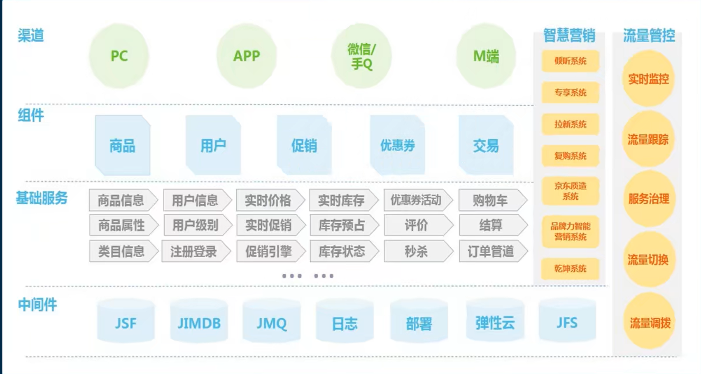
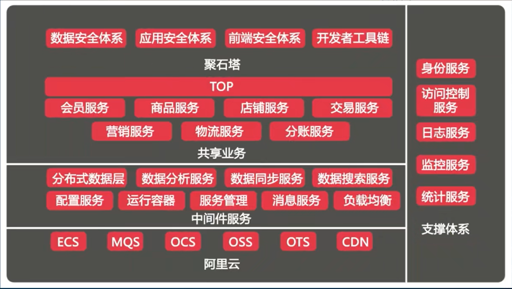
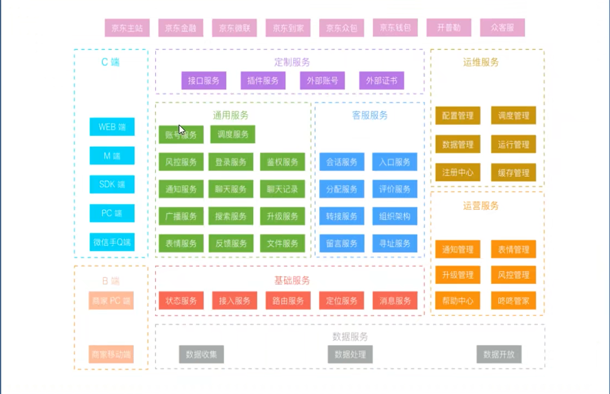
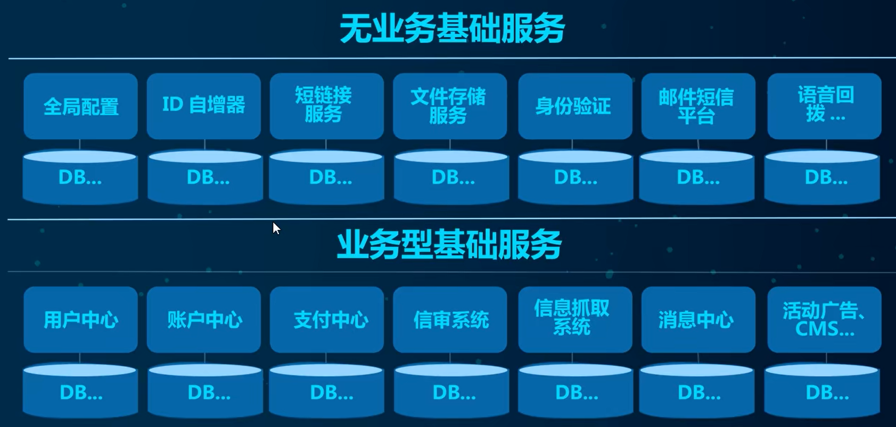

# 尚硅谷Spring Cloud

## 第一章、Spring Cloud概述

### 1.1、微服务架构概述

微服务：微服务强调的是单服务的大小(个体服务)，关注的是某一个点，具体解决某一个问题/提供落地对应服务的一个服务应用；狭义的看，可以看成Eclipse里面的一个个微服务工程或module，一个微服务工程负责一件事情

微服务架构是一种架构模式，它提倡将单一应用程序划分为一组小的服务，服务之间相互协调、互相配合，为用户提供最终价值。每个服务运行在其独立的进程中，服务与服务间采用轻量级的通讯机制互相协作(通常是基于HTTP协议的RESTful API)。每个服务都围绕着具体业务进行构建，并且能够被独立的部署到生产环境、类生产环境等。另外，应当尽量避免统一的、集中式的服务管理机制，对具体的一个服务而言，应根据业务上下文，选择合适的语言、工具对其进行构建。

### 1.2、分布式架构概述

分布式根据业务需求拆分成N个子系统，多个子系统相互协作才能完成业务流程子系统之间通讯使用RPC或HTTP等远程通讯技术

分布式架构知识点：

1. 服务注册与发现：Eureka
2. 服务调用：Netflix
3. 服务熔断：HYSTRIX
4. 负载均衡：NETFLIX OSS RIBBON
5. 服务降级：HYSTRIX
6. 服务消息队列
7. 配置中心管理：Spring Cloud Config
8. 服务网关：Zuul
9. 服务监控
10. 全链路追踪
11. 自动化构建部署
12. 服务定时任务调度操作

### 1.2、Spring Cloud概述

Spring Cloud是Spring提供的分布式微服务架构的一站式解决方案，是多种微服务架构落地技术的集合体，俗称微服务全家桶

Spring Cloud包含技术栈：

1. Spring Cloud Config
2. Spring Cloud Bus
3. Eureka
4. Hystrix
5. Zuul
6. Archaius
7. Consul
8. Spring Cloud Sleuth
9. Spring Cloud Data Flow
10. Spring Cloud Security
11. Spring Cloud Zookeeper
12. Spring Cloud Stream
13. Spring Cloud CLI
14. Ribbon
15. Feign
16. Spring Cloud Task
17. Spring Cloud Connectors
18. Spring Cloud Cluster
19. Spring Cloud Starters
20. Spring Cloud for Cloud Foundry
21. Turbine

### 1.3、各个大厂分布式架构

京东架构

阿里架构

京东物流

基础架构

