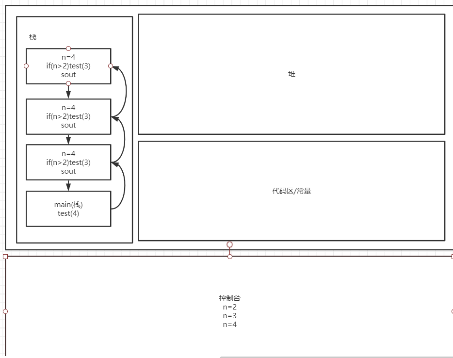
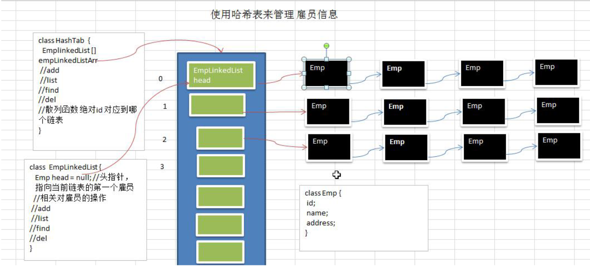
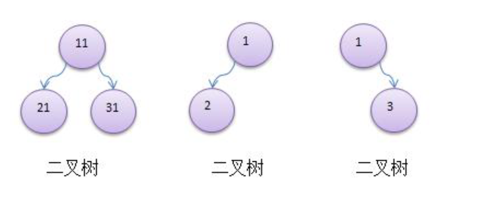
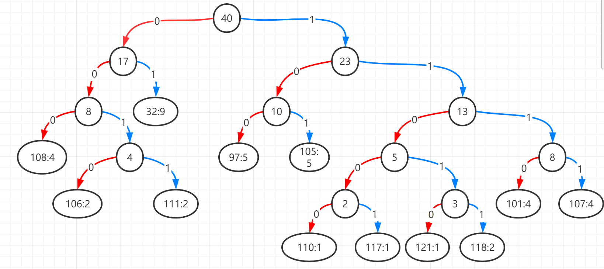
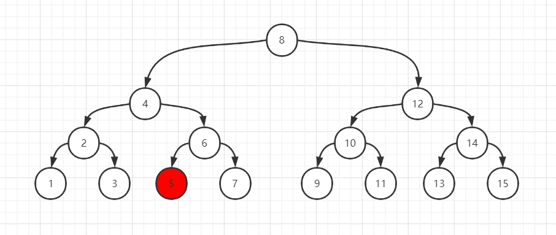
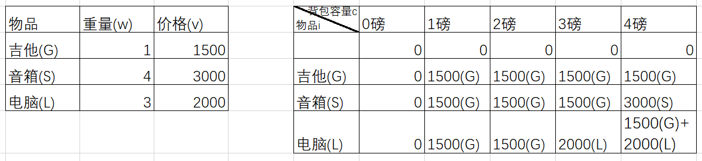
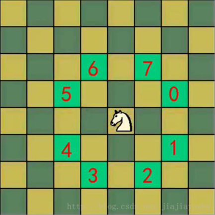

# 数据结构与算法

## 一、数据结构

### 1.1、线性结构与非线性结构

#### 线性结构

1. 线性结构作为最常用的数据结构，其特点是数据元素之间存在一对一的线性关系

2. 线性结构有两种不同的存储结构，即顺序存储结构和链式存储结构。顺序存储的线性表称为顺序表，顺序表中的存储元素是连续的

3. 链式存储的线性表称为链表，链表中的存储元素不一定是连续的，元素节点中存放数据元素以及相邻元素的地址信息

4. 线性结构常见的有：数组、队列、链表和栈

#### 非线性结构

非线性结构包括：二维数组，多维数组，广义表，树结构，图结构

## 二、稀疏数组和队列

### 2.1、稀疏数组(SparseArray)

#### 2.1.1、介绍

编写五子棋程序


因为该二位数组的很多值默认为0，所以该记录保留了很多无意义的数据

稀疏数组的处理方式：

1. 记录数组有几行几列，有多少不同的值
2. 把具有不同值的元素的行列及值记录在一个小规模的数组中，从而缩小程序规模


```java
public static void main(String[] args) {
    //生成普通二位数组
    int chessArr1[][] = new int[11][11];
    chessArr1[1][2]=1;
    chessArr1[2][3]=2;
    for (int[] row : chessArr1){
        for (int data : row){
            System.out.printf("%d\t" , data);
        }
        System.out.println();
    }


    //普通数组转换为稀疏数组
    int sum = 0;
    for (int i = 0; i < chessArr1.length; i++) {
        for (int j = 0; j < chessArr1[0].length; j++) {
            if (chessArr1[i][j] != 0){
                sum++;
            }
        }
    }
    int sparseArr[][] = new int[sum+1][3];
    sparseArr[0][0] = chessArr1.length;
    sparseArr[0][1] = chessArr1[0].length;
    sparseArr[0][2] = sum;

    int count = 0;
    for (int i = 0; i < chessArr1.length; i++) {
        for (int j = 0; j < chessArr1[0].length;j++) {
            if (chessArr1[i][j] !=0){
                count++;
                sparseArr[count][0] = i;
                sparseArr[count][1] = j;
                sparseArr[count][2] = chessArr1[i][j];
            }
        }
    }
    System.out.println();
    System.out.println("得到的稀疏数组为~~~~~");
    for (int i = 0; i < sparseArr.length; i++) {
        System.out.printf("%d\t%d\t%d\t\n",sparseArr[i][0],sparseArr[i][1],sparseArr[i][2]);
    }
    System.out.println();

    //稀疏数组转换为普通数组
    int chessArr2[][] = new int[sparseArr[0][0]][sparseArr[0][1]];
    for (int i = 1; i <= sparseArr[0][2]; i++) {
        chessArr2[sparseArr[i][0]][sparseArr[i][1]] = sparseArr[i][2];
    }

    for (int[] row : chessArr2){
        for (int data : row){
            System.out.printf("%d\t" , data);
        }
        System.out.println();
    }
}
```

### 2.2、队列

#### 2.2.1、队列介绍

1. 队列是一个有序列表，可以用数组或是链表来实现
2. 遵循先入先出原则

#### 2.2.2、数组模拟队列思路

1. 队列本身是有序列表，若使用数组的结构来存储列表的数据，则队列数组的声明如下图，其中maxSize是该队列的最大容量
2. 因为队列的输出，输入时分别从前后端来处理，因此需要两个变量front及rear分别记录队列的前后端的下标，front会随着数据输出而改变，而rear则是随着数据输入而改变


3. 当我们将数据存入队列时称为“addQueue”，addQueue的处理需要两个步骤：
   1. 将尾指针后移：rear+1，当front == rear [空]
   2. 若尾指针rear小于队列的最大下标maxSize-1，则将数据存入rear所指的数组元素中，否则无法存入数据。rear==maxSize-1[队列满]

```java
public class ArrayQueueDemo {
    public static void main(String[] args) {
        ArrayQueue queue = new ArrayQueue(3);
        char key = ' ';
        Scanner scanner = new Scanner(System.in);
        boolean loop = true;
        while (loop){
            System.out.println("s(show):显示队列");
            System.out.println("e(exit):退出程序");
            System.out.println("a(add):添加数据到队列");
            System.out.println("g(get):从队列取出数据");
            System.out.println("h(head):查看队列头的数据");
            key = scanner.next().charAt(0);
            switch (key){
                case 's':
                    queue.showQueue();
                    break;
                case 'a':
                    System.out.println("输入一个数");
                    int value = scanner.nextInt();
                    queue.addQueue(value);
                    break;
                case 'g':
                    try {
                        int res = queue.getQueue();
                        System.out.printf("取出的数据是%d\n",res);
                    }catch (Exception e){
                        System.out.println(e.getMessage());
                    }
                    break;
                case 'h':
                    try {
                        int res = queue.headQueue();
                        System.out.printf("队列头数据是%d\n",res);
                    }catch (Exception e){
                        System.out.println(e.getMessage());
                    }
                    break;
                case 'e':
                    scanner.close();
                    loop = false;
                    break;
                default:
                    break;
            }
            System.out.println("程序退出");
        }
    }
}
class ArrayQueue{
    private int maxSize;
    private int front;
    private int rear;
    private int[] arr;
    public ArrayQueue(int arrMaxSize){
        maxSize = arrMaxSize;
        arr = new int[maxSize];
        front = -1;
        rear = -1;
    }
    public boolean isFull(){
        return rear == maxSize-1;
    }
    public boolean isEmpty(){
        return rear == front;
    }

    public void addQueue(int n){
        if(isFull()){
            System.out.println("队列满，不能加入数据");
            return;
        }
        rear++;
        arr[rear] = n;
    }
    public int getQueue(){
        if (isEmpty()){
            throw new RuntimeException("队列空，不能取数据");
        }
        front++;
        return arr[front];
    }
    public void showQueue(){
        if (isEmpty()){
            System.out.println("队列空，没有数据~");
            return;
        }
        for (int i = 0; i < arr.length; i++) {
            System.out.printf("arr[%d]=%d\n",i,arr[i]);
        }
    }
    public int headQueue(){
        if (isEmpty()){
            throw new RuntimeException("队列空，没有数据");
        }
        return arr[front+1];
    }
}
```

#### 2.2.3、数组模拟环形队列

上面队列的一个问题就是，队列无法重复使用，当队列插入满，之后将队列数据取出后，队列无法再插值，这就需要使用到环形队列

环形队列设计思路

1. front变量重定义：front指向队列的第一个元素，也就是说arr[front]就是队列的第一个元素，front初始值为0
2. rear变量重定义：rear指向队列的最后一个元素的后一个位置，因为希望空出一个空间作为约定，初始值为0
3. 当队列满时，条件是(rear+1)%maxSize == front
4. 队列为空的条件，rear == front
5. 队列有效数据的个数，(rear+maxSize-front)%maxSize


```java
public class CircleArrayQueue {
    public static void main(String[] args) {
        CircleArray queue = new CircleArray(4);
        char key = ' ';
        Scanner scanner = new Scanner(System.in);
        boolean loop = true;
        while (loop){
            System.out.println("s(show):显示队列");
            System.out.println("e(exit):退出程序");
            System.out.println("a(add):添加数据到队列");
            System.out.println("g(get):从队列取出数据");
            System.out.println("h(head):查看队列头的数据");
            key = scanner.next().charAt(0);
            switch (key){
                case 's':
                    queue.showQueue();
                    break;
                case 'a':
                    System.out.println("输入一个数");
                    int value = scanner.nextInt();
                    queue.addQueue(value);
                    break;
                case 'g':
                    try {
                        int res = queue.getQueue();
                        System.out.printf("取出的数据是%d\n",res);
                    }catch (Exception e){
                        System.out.println(e.getMessage());
                    }
                    break;
                case 'h':
                    try {
                        int res = queue.headQueue();
                        System.out.printf("队列头数据是%d\n",res);
                    }catch (Exception e){
                        System.out.println(e.getMessage());
                    }
                    break;
                case 'e':
                    scanner.close();
                    loop = false;
                    break;
                default:
                    break;
            }
            System.out.println("程序退出");
        }
    }
}
class CircleArray {
    private int maxSize;
    private int front;
    private int rear;
    private int[] arr;
    public CircleArray(int arrMaxSize) {
        maxSize = arrMaxSize;
        arr = new int[maxSize];
        front = 0;
        rear = 0;
    }

    public boolean isFull() {
        return (rear + 1) % maxSize == front;
    }

    public boolean isEmpty() {
        return rear == front;
    }

    public void addQueue(int n) {
        if (isFull()) {
            System.out.println("队列满，不能加入数据");
            return;
        }
        arr[rear] = n;
        rear = (rear + 1) % maxSize;
    }
    public int getQueue(){
        if (isEmpty()){
            throw new RuntimeException("队列空，不能取数据");
        }
        int value = arr[front];
        front = (front + 1) % maxSize;
        return value;
    }
    public void showQueue(){
        if (isEmpty()){
            System.out.println("队列空，没有数据~");
            return;
        }
        for (int i = front; i < front + size(); i++) {
            System.out.printf("arr[%d]=%d\n",i % maxSize,arr[i % maxSize]);
        }
    }
    public int size(){
        return (rear + maxSize - front) % maxSize;
    }
    public int headQueue(){
        if (isEmpty()){
            throw new RuntimeException("队列空，没有数据");
        }
        return arr[front];
    }
}
```

## 三、链表

### 3.1、单链表介绍

链表是有序列表，但是在内存中并非是有序的


1. 链表是以节点的方式来储存，是链式存储
2. 每个节点包含data域，naxt域(指向下一个节点)
3. 链表的各个节点不一定是连续存储
4. 链表分带头节点的链表和不带头节点的链表，根据实际需求来确定

单链表(带头节点)逻辑示意图


### 3.2、单链表实例

使用带head的单链表实现增删改查

- 添加创建链表
  1. 先创建一个头，表示单链表的头
  2. 之后每添加一个节点，就直接加入到链表的最后
  3. 通过辅助变量遍历链表


- 根据排名添加

1. 首先找到新添加节点位置，通过辅助变量(指针)遍历来实现
2. newHeroNode.next = temp.next
3. temp.next = newHeroNode


- 修改节点
  1. 直接找到节点位置并将数据修改即可
- 删除节点
  1. 找到要删除节点的前一个节点
  2. temp.next = temp.next.next
  3. 被删除节点会被垃圾回收机制回收


```java
public class SingleLinkedListDemo {
    public static void main(String[] args) {
        HeroNode heroNode1 = new HeroNode(1,"松江","及时雨");
        HeroNode heroNode2 = new HeroNode(4,"卢俊义","玉麒麟");
        HeroNode heroNode3 = new HeroNode(3,"吴用","智多星");
        HeroNode heroNode4 = new HeroNode(2,"林冲","豹子头");
        SingleLinkedList singleLinkedList = new SingleLinkedList();
        singleLinkedList.addByOrder(heroNode1);
        singleLinkedList.addByOrder(heroNode2);
        singleLinkedList.addByOrder(heroNode3);
        singleLinkedList.addByOrder(heroNode4);
        singleLinkedList.list();
//        singleLinkedList.update(new HeroNode(2,"小卢","玉麒麟~~"));
//        singleLinkedList.list();
        System.out.println("删除链表元素");
        singleLinkedList.remove(1);
        singleLinkedList.remove(4);
        singleLinkedList.remove(3);
        singleLinkedList.remove(2);
        singleLinkedList.list();
    }
}

class SingleLinkedList{
    private HeroNode head = new HeroNode(0,"","");

    public void add(HeroNode heroNode){
        HeroNode temp = head;
        while (true){
            if (temp.next == null){
                break;
            }
            temp = temp.next;
        }
        temp.next = heroNode;
    }
    public void addByOrder(HeroNode heroNode){
        HeroNode temp = head;
        boolean flag = false;//标记添加的编号是否存在
        while(true){
            if (temp.next == null){//说明已经到链表尾部
                break;
            }
            if (temp.next.no > heroNode.no){//位置找到，在temp后插入
                break;
            }else if (temp.next.no > heroNode.no){//编号已存在
                flag = true;
                break;
            }
            temp = temp.next;
        }
        if (flag){//编号存在不能插入
            System.out.printf("准备插入的英雄编号%d已经存在，不能加入\n",heroNode.no);
        }else {
            heroNode.next = temp.next;
            temp.next = heroNode;
        }
    }
    public void update(HeroNode newHeroNode){
        if (head.next == null){
            System.out.println("链表为空~");
            return;
        }
        HeroNode temp = head.next;
        boolean flag = false;
        while (true){
            if (temp == null){
                break;
            }
            if (temp.no == newHeroNode.no){
                flag = true;
                break;
            }
            temp = temp.next;
        }
        if (flag){
            temp.name = newHeroNode.name;
            temp.nickName = newHeroNode.nickName;
        }else {
            System.out.printf("没有找到 编号%d 的节点，不能修改\n",newHeroNode.no);
        }
    }
    public void remove(int no){
        HeroNode temp = head;
        boolean flag = false;
        while (true){
            if (temp.next == null){//已经到链表最后
                break;
            }
            if (temp.next.no == no){
                flag = true;
                break;
            }
            temp = temp.next;
        }
        if (flag){
            temp.next = temp.next.next;
        }else {
            System.out.printf("要删除的%d 节点不存在",no);
        }
    }
    public void list(){
        if (head.next == null){
            System.out.println("链表为空");
            return;
        }
        HeroNode temp = head.next;
        while (true){
            if (temp == null){
                break;
            }
            System.out.println(temp);
            temp = temp.next;
        }
    }

}
class HeroNode{
    public int no;
    public String name;
    public String nickName;
    public HeroNode next;
    public HeroNode(int hNo,String hName,String hNickName){
        this.no = hNo;
        this.name = hName;
        this.nickName = hNickName;
    }
    @Override
    public String toString() {
        return "HeroNode [no = " + no + ",name = " + name + ",nickName = " + nickName + "]";
    }
}
```

### 3.3、单链表面试题

#### 3.3.1、单链表有效个数

```java
public static int getLength(HeroNode head){
    if (head.next == null){
        return 0;
    }
    HeroNode cur = head.next;
    int length = 1;
    while (cur.next != null){
        length++;
        cur = cur.next;
    }
    return length;
}
```

#### 3.3.2、单链表取倒数第N个

```java
public static HeroNode findLastIndexNode(HeroNode head,int index){
    if (head.next == null){
        return null;
    }
    int length = getLength(head);
    if (index <= 0 || index > length){
        return null;
    }
    HeroNode temp = head.next;
    for (int i = 0; i < length-index; i++) {
        temp = temp.next;
    }
    return temp;
}
```

#### 3.3.3、单链表反转


1. 如果链表为空或者只有一个节点则无法反转
2. 设置辅助链表头，辅助节点，辅助数据
3. 遍历链表，temp.next = newHead.next

```java
public static void reversalList(HeroNode head){
    if (head.next == null || head.next.next==null){
        return;
    }
    HeroNode temp = head.next;
    HeroNode newHead = new HeroNode(0,"","");
    HeroNode next = null;
    while (temp != null){
        next = temp.next;
        temp.next = newHead.next;
        newHead.next = temp;
        temp = next;
    }
    head.next = newHead.next;
}
```

#### 3.3.4、从尾到头打印单链表

使用栈先进后出的特性

```java
public static void reversPrint(HeroNode head){
    if (head.next == null){
        System.out.println("链表为空");
        return;
    }
    Stack<HeroNode> stack = new Stack<>();
    HeroNode cur = head.next;
    while (cur != null){
        stack.push(cur);
        cur = cur.next;
    }
    while (stack.size()>0){
        System.out.println(stack.pop());
    }
}
```

### 3.4、双向链表

单向链表与双向链表对比：

1. 单向链表，查找的方向只能是一个方向，而双向链表可以向前或后查找
2. 单向链表不能自我删除，需要辅助节点，而双向链表，可以自我删除，所以前面我们单链表删除节点，总是找到temp，temp是待删除节点的前一个节点


### 3.5、双向链表实例

1. 增加节点与单链表唯一的区别就是需要在增加的时候，记录pro
2. 修改与单链表相同
3. 删除节点，不需要像单链表的辅助节点，

```java
public class DoubleLinkedListDemo {
    public static void main(String[] args) {
        HeroNode2 heroNode1 = new HeroNode2(1,"松江","及时雨");
        HeroNode2 heroNode2 = new HeroNode2(4,"卢俊义","玉麒麟");
        HeroNode2 heroNode3 = new HeroNode2(3,"吴用","智多星");
        HeroNode2 heroNode4 = new HeroNode2(2,"林冲","豹子头");
        DoubleLinkedList doubleLinkedList = new DoubleLinkedList();
        doubleLinkedList.add(heroNode1);
        doubleLinkedList.add(heroNode2);
        doubleLinkedList.add(heroNode3);
        doubleLinkedList.add(heroNode4);
        doubleLinkedList.list();
        doubleLinkedList.update(new HeroNode2(4,"公孙胜","入云龙~~"));
        System.out.println("修改后的链表");
        doubleLinkedList.list();
        doubleLinkedList.remove(3);
        System.out.println("删除后的链表");
        doubleLinkedList.list();
    }
}
class DoubleLinkedList{
    private HeroNode2 head = new HeroNode2(0,"","");
    public void add(HeroNode2 heroNode){
        HeroNode2 temp = head;
        while (true){
            if (temp.next == null){
                break;
            }
            temp = temp.next;
        }
        temp.next = heroNode;
        heroNode.pro = temp;
    }
    public void update(HeroNode2 newHeroNode){
        if (head.next == null){
            System.out.println("链表为空~");
            return;
        }
        HeroNode2 temp = head.next;
        boolean flag = false;
        while (true){
            if (temp == null){
                break;
            }
            if (temp.no == newHeroNode.no){
                flag = true;
                break;
            }
            temp = temp.next;
        }
        if (flag){
            temp.name = newHeroNode.name;
            temp.nickName = newHeroNode.nickName;
        }else {
            System.out.printf("没有找到 编号%d 的节点，不能修改\n",newHeroNode.no);
        }
    }
    public void remove(int no){
        HeroNode2 temp = head.next;
        boolean flag = false;
        while (true){
            if (temp == null){//已经到链表最后
                break;
            }
            if (temp.no == no){
                flag = true;
                break;
            }
            temp = temp.next;
        }
        if (flag){
            temp.pro.next = temp.next;
            if (temp.next != null){
                temp.next.pro = temp.pro;
            }
        }else {
            System.out.printf("要删除的%d 节点不存在",no);
        }
    }
    public void list(){
        if (head.next == null){
            System.out.println("链表为空");
            return;
        }
        HeroNode2 temp = head.next;
        while (true){
            if (temp == null){
                break;
            }
            System.out.println(temp);
            temp = temp.next;
        }
    }
}
class HeroNode2{
    public int no;
    public String name;
    public String nickName;
    public HeroNode2 next;
    public HeroNode2 pro;
    public HeroNode2(int hNo,String hName,String hNickName){
        this.no = hNo;
        this.name = hName;
        this.nickName = hNickName;
    }
    @Override
    public String toString() {
        return "HeroNode2 [no = " + no + ",name = " + name + ",nickName = " + nickName + "]";
    }
}
```

### 3.6、单向环形链表

创建单向环形链表

1. 创建第一个元素，让first指向该节点，并形成闭环
2. 创建新的节点，将该节点加入到已有环形链表中

```java
class CircleSingleLinkedList{
    //当前节点位置
    private Boy first = new Boy(-1);
    public void addBoy(int nums){
        if (nums < 1){
            System.out.println("输入数字错误");
            return;
        }
        Boy curBoy = null;
        for (int i = 1; i <= nums; i++) {
            Boy boy = new Boy(i);
            if (i == 1){
                first = boy;
                first.setNext(first);
                curBoy = first;
            }else {
                curBoy.setNext(boy);
                boy.setNext(first);
                curBoy = boy;
            }
        }
    }
    public void showBoy(){
        if (first == null){
            System.out.println("没有任何小孩");
            return;
        }
        Boy curBoy = first;
        while (true){
            System.out.printf("小孩的编号是 %d \n",curBoy.getNo());
            if (curBoy.getNext() == first){
                break;
            }
            curBoy=curBoy.getNext();
        }
    }
}
class Boy{
    private int no;
    private Boy next;
    Boy(int no){
        this.no = no;
    }

    public void setNext(Boy next) {
        this.next = next;
    }

    public Boy getNext() {
        return next;
    }

    public int getNo() {
        return no;
    }

    public void setNo(int no) {
        this.no = no;
    }
}
```


### 3.7、约瑟夫问题

编号为1,2,……,n的n个人按顺时针方向围坐一圈，每人持有一个密码（正整数）。一开始任选一个正整数作为报数上限值m，从第一个人开始按顺时针方向自1开始顺序报数，报到m时停止报数。报m的人出列，将他的密码作为新的m值，从他在顺时针方向上的下一个人开始重新从1报数，如此下去，直至所有人全部出列为止。试设计一个程序求出出列顺序。基本要求 利用单向循环链表存储结构模拟此过程,按照出列的顺序印出各人的编号。

1. 创建一个辅助节点helper，将这个节点指向队列最后一位，报数前，需先确定报数开始位置(startNo)，first和helper先向前移动startNo-1位
2. 当小孩开始报数时，helper和first同时向前移动(startNo-1)次
3. 然后让这个小孩出圈，first指向first.next，此时first已经变为原本的下一位，helper.next指向新的first

```java
public class Josephus {
    public static void main(String[] args) {
        CircleSingleLinkedList circleSingleLinkedList = new CircleSingleLinkedList();
        circleSingleLinkedList.addBoy(5);
        circleSingleLinkedList.showBoy();
        circleSingleLinkedList.countBoy(1,2,5);
    }
}
class CircleSingleLinkedList{
    //当前节点位置
    private Boy first = new Boy(-1);
    public void addBoy(int nums){
        if (nums < 1){
            System.out.println("输入数字错误");
            return;
        }
        Boy curBoy = null;
        for (int i = 1; i <= nums; i++) {
            Boy boy = new Boy(i);
            if (i == 1){
                first = boy;
                first.setNext(first);
                curBoy = first;
            }else {
                curBoy.setNext(boy);
                boy.setNext(first);
                curBoy = boy;
            }
        }
    }
    public void showBoy(){
        if (first == null){
            System.out.println("没有任何小孩");
            return;
        }
        Boy curBoy = first;
        while (true){
            System.out.printf("小孩的编号是 %d \n",curBoy.getNo());
            if (curBoy.getNext() == first){
                break;
            }
            curBoy=curBoy.getNext();
        }
    }
    /**
     *
     * @param startNo 开始小孩编号
     * @param countNum 数几下出圈
     * @param nums 最初有几个小孩
     */
    public void countBoy(int startNo,int countNum,int nums){
        if (first == null || startNo < 1 || startNo > nums){
            return;
        }
        Boy helper = first;
        while (true){
            if (helper.getNext() == first){
                break;
            }
            helper = helper.getNext();
        }
        for (int i = 0; i < startNo - 1; i++) {
            first = first.getNext();
            helper = helper.getNext();
        }
        while (true){
            if (first == helper){
                break;
            }
            for (int i = 0; i < countNum-1; i++) {
                first = first.getNext();
                helper = helper.getNext();
            }
            System.out.printf("小孩 %d 出圈\n",first.getNo());
            first = first.getNext();
            helper.setNext(first);
        }
        System.out.printf("最后留在圈中的小孩编号%d \n",first.getNo());
        
    }
}
class Boy{
    private int no;
    private Boy next;
    Boy(int no){
        this.no = no;
    }

    public void setNext(Boy next) {
        this.next = next;
    }

    public Boy getNext() {
        return next;
    }

    public int getNo() {
        return no;
    }

    public void setNo(int no) {
        this.no = no;
    }
}
```

## 四、栈

### 4.1、栈介绍

1. 栈的英文位(stack)
2. 栈时一个先入后出的有序列表
3. 栈时限制线性表中元素的插入和删除只能在线性表的同一端进行的一种特殊线性表。允许插入和删除的一端，为变化的一端，被称为栈顶(Top)，另一端为固定的一端，称为栈底(Bottom)
4. 根据栈的定义可知，最先放入栈中元素在栈底，最后放入的元素在栈顶，而删除元素刚好相反，最后放入的元素最先删除，最先放入的元素最后删除
5. 出栈(pop)和入栈(push)的概念


### 4.2、栈的应用

1. 子程序的调用：在跳往子程序前，会先将下个指令的地址存到堆栈中，直到子程序执行完后再将地址取出，以回到原来的程序中。
2. 处理递归调用：和子程序的调用类似，只是除了储存下一个指令的地址外，也将参数、区域变量等数据存入堆栈中。
3. 表达式的转换[中缀表达式转后缀表达式]与求值(实际解决)。
4. 二叉树的遍历。5)图形的深度优先(depth一first)搜索法。

### 4.3、用数组模拟栈

用数组模拟栈的使用，由于栈是一种有序列表，当然可以使用数组的结构来储存栈的数据内容


```java
class ArrayStack{
    private int maxSize = 0;
    private int[] stack;
    private int top = -1;
    public ArrayStack(int maxSize){
        this.maxSize = maxSize;
        stack = new int[maxSize];
    }
    public boolean isFull(){
        return top == maxSize-1;
    }
    public boolean isEmpty(){
        return top == -1;
    }
    public void push(int value){
        if (isFull()){
            System.out.println("栈满");
            return;
        }
        top++;
        stack[top] = value;
    }
    public int pop(){
        if (isEmpty()){
            throw new RuntimeException("栈空");
        }
        int value = stack[top];
        top--;
        return value;
    }
    public void list(){
        if (isEmpty()){
            System.out.println("栈空没有数据");
        }
        for (int i = top; i >= 0 ; i--) {
            System.out.printf("stack[%d] = %d \n",i,stack[i]);
        }
    }
}
```

### 4.4、栈实现综合计算器(中缀表达式)


思路分析

使用栈完成计算一个表达式的结果

3+2\*6-2


1. 通过一个index值(索引)，来遍历我们的表达式

2. 如果我们发现是一个数字，就直接入数栈
3. 如果发现扫描到是一个符号，就如下分析
   1. 如果发现当前符号栈为空，就直接入栈
   2. 如果符号栈有符号，就进行比较，当前的操作符的优先级小于或等于栈中的操作符，就需要从数栈中pop出两个数，在从符号栈中pop出一个符号，进行运算，将得到结果，入数栈，然后将当前的操作符入符号栈，如果当前的操作符的优先级大于栈中的操作符，就直接入符号栈
4. 当表达式扫描完毕，就顺序的从数栈和符号栈中pop出相应的数和符号，并运行
5. 最后在数栈只有一个数字，就是表达式的结果

```java
public class Calculator {
    public static void main(String[] args) {
        String expression = "300+2*6-2";
        ArrayStack2 numStack = new ArrayStack2(10);
        ArrayStack2 operStack = new ArrayStack2(10);
        int index = 0;//
        int num1 = 0;
        int num2 = 0;
        int oper = 0;
        int res = 0;
        char ch = ' ';
        String keepNum = "";
        while (true){
            ch = expression.substring(index,index+1).charAt(0);
            if (operStack.isOper(ch)){
                if (!operStack.isEmpty()){
                    if (operStack.priority(ch) <= operStack.priority(operStack.peek())){
                        num1 = numStack.pop();
                        num2 = numStack.pop();
                        oper = operStack.pop();
                        res = numStack.cal(num1,num2,oper);
                        numStack.push(res);
                        operStack.push(ch);
                    }else {
                        operStack.push(ch);
                    }
                }else {
                    operStack.push(ch);
                }
            } else {
//                numStack.push(ch - 48);
                keepNum += ch;

                if (index == expression.length()-1){
                    numStack.push(Integer.parseInt(keepNum));
                }else {
                    if (operStack.isOper(expression.substring(index+1,index+2).charAt(0))){
                        numStack.push(Integer.parseInt(keepNum));
                        keepNum = "";
                    }
                }
            }
            index++;
            if (index >= expression.length()){
                break;
            }
        }
        while (true){
            if (operStack.isEmpty()){
                break;
            }
            num1 = numStack.pop();
            num2 = numStack.pop();
            oper = operStack.pop();
            res = numStack.cal(num2,num1,oper);
            numStack.push(res);
        }
        System.out.printf("表达式%s = %d",expression,numStack.pop());
    }
}
class ArrayStack2{
    private int maxSize = 0;
    private int[] stack;
    private int top = -1;
    public ArrayStack2(int maxSize){
        this.maxSize = maxSize;
        stack = new int[maxSize];
    }
    public int peek(){
        return stack[top];
    }
    public boolean isFull(){
        return top == maxSize-1;
    }
    public boolean isEmpty(){
        return top == -1;
    }
    public void push(int value){
        if (isFull()){
            System.out.println("栈满");
            return;
        }
        top++;
        stack[top] = value;
    }
    public int pop(){
        if (isEmpty()){
            throw new RuntimeException("栈空");
        }
        int value = stack[top];
        top--;
        return value;
    }
    public void list(){
        if (isEmpty()){
            System.out.println("栈空没有数据");
        }
        for (int i = top; i >= 0 ; i--) {
            System.out.printf("stack[%d] = %d \n",i,stack[i]);
        }
    }
    public int priority(int oper){
        if (oper == '*' || oper == '/'){
            return 1;
        }else if (oper == '+' || oper == '-'){
            return 0;
        }else {
            return -1;
        }
    }
    public boolean isOper(char val){
        return val == '+' || val == '-' || val == '*' || val == '/';
    }
    public int cal(int num1,int num2,int oper){
        int res = 0;
        switch (oper){
            case '+':
                res = num1+num2;
                break;
            case '-':
                res = num1-num2;
                break;
            case '*':
                res = num1*num2;
                break;
            case '/':
                res = num1/num2;
                break;
            default:
                break;
        }
        return res;
    }
}
```

### 4.5、逆波兰计算器

后缀表达式又称**逆波兰表达式**,与前缀表达式相似，只是运算符位于操作数之后

例：(3+4)*5-6对应逆波兰表达式就是3 4 + 5 * 6 -


#### 4.5.1、使用栈求逆波兰表达式

从左至右扫描表达式，遇到数字时，将数字压入堆栈，遇到运算符时，弹出栈顶的两个数，用运算符对它们做相应的计算（次顶元素 和 栈顶元素），并将结果入栈；重复上述过程直到表达式最右端，最后运算得出的值即为表达式的结果

例如: (3+4)×5-6 对应的后缀表达式就是 3 4 + 5 × 6 -  针对后缀表达式求值步骤如下：

1. 从左至右扫描，将3和4压入堆栈；

2. 遇到+运算符，因此弹出4和3（4为栈顶元素，3为次顶元素），计算出3+4的值，得7，再将7入栈；

3. 将5入栈；

4. 接下来是×运算符，因此弹出5和7，计算出7×5=35，将35入栈；

5. 将6入栈；

6. 最后是-运算符，计算出35-6的值，即29，由此得出最终结果 

```java
public class PolandNotion {
    public static void main(String[] args) {
        String suffixExpression = "4 5 * 8 - 60 + 8 2 / +";
        List<String> listString = getListString(suffixExpression);
        int calculate = calculate(listString);
        System.out.println("计算的结果是："+calculate);
    }
    public static List<String> getListString(String suffixExpression){
        String[] split = suffixExpression.split(" ");
        List<String> list = new ArrayList<>();
        for (String ele : split) {
            list.add(ele);
        }
        return list;
    }
    public static int calculate(List<String> list){
        Stack<String> stack = new Stack<>();
        for (String item : list) {
            if (item.matches("\\d+")){
                stack.push(item);
            }else {
                int num2 = Integer.parseInt(stack.pop());
                int num1 = Integer.parseInt(stack.pop());
                int res = 0;
                if (item.equals("+")){
                    res = num1 + num2;
                }else if (item.equals("-")){
                    res = num1 - num2;
                }else if (item.equals("*")){
                    res = num1 * num2;
                }else if (item.equals("/")){
                    res = num1 / num2;
                }else {
                    throw new RuntimeException("运算符有误");
                }
                stack.push(String.valueOf(res));
            }
        }
        return Integer.parseInt(stack.pop());
    }
}
```

#### 4.5.2、中缀表达式转后缀表达式

转换思路：

1. 初始化两个栈：运算符栈s1和储存中间结果的栈s2
2. 从左至右扫描中缀表达式
3. 遇到操作数时，将其压s2
4. 遇到运算符时，比较其与s1栈顶运算符的优先级
   1. 如果s1为空，或栈顶运算符为左括号"("，则直接将次运算符入栈
   2. 否则，若优先级比栈顶运算符的高，也将其运算符压入s1
   3. 否则，将s1栈顶的运算符弹出并压入到s2中，再次转到(4-1)与s1中新的栈顶运算符相比较；
5. 遇到括号时：
   1. 如果是左括号“(”，则直接压入s1
   2. 如果是右括号“)”，则依次弹出s1栈顶的运算符，并压入s2，直到遇到左括号为止，此时将这一对括号丢弃
6. 重复步骤2至5，直到表达式的最右边
7. 将s1中剩余的运算符依次弹出并压入s2
8. 依次弹出s2中的元素并输出，**结果的逆序即为中缀表达式对应的后缀表达式**

**1+((2+3)×4)-5**转换思路解析


```java
package com.shary.stack;

import java.util.ArrayList;
import java.util.List;
import java.util.Optional;
import java.util.Stack;

public class PolandNotion {
    public static void main(String[] args) {
        String expression = "1+((2+3)*4)-5";
        List<String> list = toInfixExpressionList(expression);
        System.out.println(list);
        List<String> list1 = parseSuffixExpressionList(list);
        System.out.println(list1);
        int calculate = calculate(list1);
        System.out.println(calculate);
    }
    //中缀表达式转逆波兰表达式
    public static List<String> parseSuffixExpressionList(List<String> ls){
        Stack<String> s1 = new Stack<>();//中缀表达式
        ArrayList<String> s2 = new ArrayList<>();//逆波兰表达式
        for (String item : ls) {
            //如果是数字直接加入s2
            if (item.matches("\\d+")){
                s2.add(item);
            }else if (item.equals("(")){
                s1.push(item);
            }else if (item.equals(")")){
                while (!s1.peek().equals("(")){
                    s2.add(s1.pop());
                }
                s1.pop();
            }else {
                while (s1.size() != 0 && Operation.getValue(s1.peek()) >= Operation.getValue(item)){
                    s2.add(s1.pop());
                }
                s1.push(item);
            }
        }
        while (s1.size() != 0){
            s2.add(s1.pop());
        }
        return s2;
    }

    public static List<String> toInfixExpressionList(String expression){
        List<String> list = new ArrayList<>();
        int i = 0;
        String str;
        char c;
        do {
            if ((c = expression.charAt(i)) < 48 || (c = expression.charAt(i)) > 57){
                list.add(String.valueOf(c));
                i++;
            }else {
                str = "";
                while (i < expression.length() && (c = expression.charAt(i)) >= 48 && (c = expression.charAt(i)) <= 57){
                    str += c;
                    i++;
                }
                list.add(str);
            }
        }while (i < expression.length());
        return list;
    }
    public static List<String> getListString(String suffixExpression){
        String[] split = suffixExpression.split(" ");
        List<String> list = new ArrayList<>();
        for (String ele : split) {
            list.add(ele);
        }
        return list;
    }
    public static int calculate(List<String> list){
        Stack<String> stack = new Stack<>();
        for (String item : list) {
            if (item.matches("\\d+")){
                stack.push(item);
            }else {
                int num2 = Integer.parseInt(stack.pop());
                int num1 = Integer.parseInt(stack.pop());
                int res = 0;
                if (item.equals("+")){
                    res = num1 + num2;
                }else if (item.equals("-")){
                    res = num1 - num2;
                }else if (item.equals("*")){
                    res = num1 * num2;
                }else if (item.equals("/")){
                    res = num1 / num2;
                }else {
                    throw new RuntimeException("运算符有误");
                }
                stack.push(String.valueOf(res));
            }
        }
        return Integer.parseInt(stack.pop());
    }
}
class Operation2{
    private static int ADD = 1;
    private static int SUB = 1;
    private static int MUL = 2;
    private static int DIV = 2;
    public static int getValue(String operation){
        int result = 0;
        switch (operation){
            case "+":
                result = ADD;
                break;
            case "-":
                result = SUB;
                break;
            case "*":
                result = MUL;
                break;
            case "/":
                result = DIV;
                break;
            default:
                System.out.println(result+"不是一个符号");
                break;
        }
        return result;
    }
}
```

## 五、递归

### 5.1、递归的概念

递归就是方法自己调用自己，每次调用时传入不同的变量，递归有助于编程者解决复杂的问题，同时可以让代码变得简洁

### 5.2、递归实际案例讲解

1. 打印问题

```java
public static void main(String[] args) {
    test(4);
}
public static void test(int n){
    if (n > 2){
        test(n-1);
    }else {
        System.out.println("n = " + n);
    }
}
```



### 5.3、递归需要遵守的重要规则

1. 执行一个方法时，就创建一个新的受保护空间(栈)
2. 方法的局部变量是独立的，不会相互影响，比如n变量
3. 如果方法中使用的是引用类型变量(比如数组)，就会共享引用类型的数据
4. 递归必须向退出递归的条件逼近，否则就是无限递归
5. 当一个方法执行完毕，或者遇到return，就会返回，遵守谁调用，就将结果返回给谁，同时当方法执行完毕或者返回时，该方法也就执行完毕

### 5.4、迷宫问题


```java
	public class MiGong {
    public static void main(String[] args) {
        //创建一个二维数组模拟迷宫
        int[][] map = new int[8][7];
        //设置1为迷宫墙，小球无法穿过墙行走
        for (int i = 0; i < 7; i++) {
            map[0][i] = 1;
            map[7][i] = 1;
        }
        for (int i = 0; i < 8; i++) {
            map[i][0] = 1;
            map[i][6] = 1;
        }
        map[3][1] = 1;
        map[3][2] = 1;
        System.out.println("地图的情况");
        for (int i = 0; i < 8; i++) {
            for (int j = 0; j < 7; j++) {
                System.out.print(map[i][j] + " ");
            }
            System.out.println();
        }
        setWay(map,1,1);

        System.out.println("小球走过的路");
        for (int i = 0; i < 8; i++) {
            for (int j = 0; j < 7; j++) {
                System.out.print(map[i][j] + " ");
            }
            System.out.println();
        }
    }
    //1.map表示地图
    // 2.i,j表示从地图的哪个位置开始出发(1,1)
    // 3.如果小球能到map[6][5]位置，则说明通路找到.
    // 4.约定：当map[i][j]为0表示该点没有走过当为1表示墙；2表示通路可以走；3表示该点已经走过，但是走不通
    //5.在走迷宫时，需要确定一个策略(方法)下->右->上->左,如果该点走不通，再回溯
    public static boolean setWay(int[][] map,int i,int j){
        //小球目的地坐标
        if (map[6][5] == 2){
            return true;
        }else{
            if (map[i][j] == 0){//如果这个点能走通
                map[i][j] = 2;//假定这个点能走通
                if (setWay(map,i+1,j)){//向下
                    return true;
                }else if (setWay(map,i,j+1)){//向右
                    return true;
                }else if (setWay(map,i-1,j)){//向上
                    return true;
                }else if (setWay(map,i,j-1)){//向左
                    return true;
                }else {
                    //此路不通返回
                    map[i][j] = 3;
                    return false;
                }
            }else {
                //map[i][j]不等于0，可能是1、2、3
                return false;
            }
        }
    }
}
```


也可以改变策略，右 -> 下 -> 左 -> 上

思考题：找出路线最短策略
思路，统计2的个数，个数最少为最短路径

### 5.5、八皇后问题

八皇后问题，是一个古老而著名的问题，是回溯算法的典型案例。该问题是国际西洋棋棋手马克斯·贝瑟尔于1848年提出：在8×8格的国际象棋上摆放八个皇后，使其不能互相攻击，即：任意两个皇后都不能处于同一行、同一列或同一斜线上，问有多少种摆法(92)。


思路分析

1. 第一个皇后先放第一行第一列
2. 第二个皇后先放第二行第一列，然后判断是否OK，如果不OK，则放第二列、第三列、第四列，依次把所有列放完，找到一个合适
3. 再放第三个皇后，重复2操作，直到第八个皇后也能放在不冲突的位置，算是找到一个正确的解
4. 当得到正确的解时，在栈回退到上一个栈时，就开始回溯，即将第一个皇后，放到第一列的所有正确解，全部得到
5. 然后继续第一个皇后放第二列，后面继续循环执行1、2、3、4的步骤

理论上应创建一个二维数组来表示棋盘，但实际上，由于本题设计，皇后各占一行，所以用一个一维数组即可解决问题

```java
public class Queue8 {
    //定义一共有多少个皇后
    int max = 8;
    static int count = 0;
    //定义数组array，皇后摆放的位置
    int[] array = new int[8];
    public static void main(String[] args) {
        new Queue8().check(0);
        System.out.println(count);
    }
    /**
     * @param n：当前皇后
     */
    public void check(int n){
        //如果放到第9个皇后则返回
        if (n == max){
            count++;
            print();
            return;
        }
        //依次放入皇后并判断是否冲突
        for (int i = 0; i < max; i++) {
            //把当前皇后n放到第i列
            array[n] = i;
            if(judge(n)){//判断是否冲突
                check(n+1);//如果不冲突，则放下一个皇后
            }
        }
        //如果冲突，就回到array[n] = i，继续尝试下一个位置
    }
    //查看我们第n个皇后，就去检测该皇后是否和前面已经摆放的皇后冲突
    /**
     *
     * @param n：当前皇后编号
     * @return
     */
    private boolean judge(int n){
        //遍历所有皇后
        for (int i = 0; i < n; i++) {
            //array[i] == array[n]：判断当前皇后位置与其他皇后位置是否在同一列
            //Math.abs(n-i) == Math.abs(array[n]-array[i])：判断当前皇后与其他皇后是否在同一斜线
            if (array[n] == array[i] || Math.abs(n-i) == Math.abs(array[n]-array[i])){
                return false;
            }
        }
        return true;
    }
    private void print(){
        for (int i = 0; i < array.length; i++) {
            System.out.print(array[i] + " ");
        }
        System.out.println();
    }
}
```

## 六、排序算法

排序算法：根据指定的顺序进行排列的过程

排序算法分为内部排序和外部排序

内部排序：将需要处理的所有数据都加载到内部存储器(内存)中进行排序

外部排序：数据量较大，无法全部加载到内存中，需要借助外部存储进行排序


### 6.1、算法复杂度分析

#### 度量方法

1. 事后统计法

   要先运行程序，浪费时间；计算机硬件对算法运行速度影响较大

2. 事前估算法

   通过分析某个算法的时间复杂度来判断哪个算法更优

#### 时间频度

时间频度：一个算法花费的时间与算法中语句的执行次数成正比，哪个算法执行的次数多，它花费的时间就多。一个算法中的语句执行次数称为时间频度或语句频度，记为T(n)

```java
//该语句的时间频度位T(n) = n + 1
int total = 0;
int end = 100;
//使用for循环
for(int i=1;i <=end; i++){
    total += 1;
}
//该语句的时间频度为T(n) = 1
total = (1 + end) * end / 2;
```

当我们分析算法时，可以忽略常数项、忽略低次序、忽略系数，因为当数据无穷大时，时间复杂度无限接近，所以可以忽略不计


#### 时间复杂度

1. 一般情况下，算法中的基本操作语句的重复执行次数是问题规模n的某个函数，用T(n)表示，若有某个辅助函数f(n)，使得当n趋近于无穷大时，T(n)/f(n)的极限值为不等于零的常数，则称f(n)是T(n)的同数量级函数。记作T(n)=Ｏ(f(n))，称Ｏ(f(n))为算法的渐进时间复杂度，简称时间复杂度。
2. T(n)不同，但时间复杂度可能相同。如：T(n)=n²+7n+6与T(n)=3n²+2n+2它们的T(n)不同，但时间复杂度相同，都为O(n²)。
3. 计算时间复杂度的方法：
   - 用常数1代替运行时间中的所有加法常数T(n)=n²+7n+6=>T(n)=n²+7n+1
   - 修改后的运行次数函数中，只保留最高阶项T(n)=n²+7n+1=>T(n)=n²
   - 去除最高阶项的系数T(n)=n²=>T(n)=n²=>O(n²)

常见的时间复杂度

1. 常数阶：O(1)

   ```java
   int i = 1;
   int j = 1;
   ++i;
   j++;
   int m = i + j;
   ```

2. 对数阶：O(log<sub>2</sub>n)

   ```java
   int i = 1;
   while(i < n){
       i = i * 2;
   }
   ```

   在这个循环中，每次都将i乘以2，结果会越来越接近n，假设循环了x次，i大于n并退出了循环，那么x实际上就等于log<sub>2</sub>n

3. 线性阶：O(n)

   ```java
   for(i = 0;i < n;i++){
       j = i;
       i++;
   }
   ```

   这个循环会执行n遍，所以时间复杂度为O(n)

4. 线性对数阶：O(nlog<sub>2</sub>n)

   ```java
   for(m = 1; m<n; m++){
       while(i<n){
           i = i * 2;
       }
   }
   ```

5. 平方阶：O(n^2^)

   ```java
   for(x = 1; x <= n; x++){
       for(i = 1; i <= n; i++){
           j = i;
           j++;
       }
   }
   ```

6. 立方阶：O(n^3^)

7. k次方阶：O(n^k^)

8. 指数阶：O(2^n^)


常见的算法时间复杂度由小到大依次为：Ο(1)＜Ο(log2n)＜Ο(n)＜Ο(nlog2n)＜Ο(n2)＜Ο(n3)＜Ο(nk)＜Ο(2n)，随着问题规模n的不断增大，上述时间复杂度不断增大，算法的执行效率越低

从图中可见，我们应该尽可能避免使用指数阶的算法

#### 平均时间复杂度和最坏时间复杂度

平均时间复杂度是指所有可能的输入实例均以等概率出现的情况下，该算法的运行时间。

最坏情况下的时间复杂度称最坏时间复杂度。一般讨论的时间复杂度均是最坏情况下的时间复杂度。这样做的原因是：最坏情况下的时间复杂度是算法在任何输入实例上运行时间的界限，这就保证了算法的运行时间不会比最坏情况更长。


#### 算法的空间复杂度

类似于时间复杂度的讨论，一个算法的空间复杂度(SpaceComplexity)定义为该算法所耗费的存储空间，它也是问题规模n的函数。

空间复杂度(SpaceComplexity)是对一个算法在运行过程中临时占用存储空间大小的量度。有的算法需要占用的临时工作单元数与解决问题的规模n有关，它随着n的增大而增大，当n较大时，将占用较多的存储单元，例如快速排序和归并排序算法,基数排序就属于这种情况

在做算法分析时，主要讨论的是时间复杂度。从用户使用体验上看，更看重的程序执行的速度。一些缓存产品(redis,memcache)和算法(基数排序)本质就是用空间换时间.

###  6.2、冒泡排序

冒泡排序（BubbleSorting）的基本思想是：通过对待排序序列从前向后（从下标较小的元素开始）,依次比较相邻元素的值，若发现逆序则交换，使值较大的元素逐渐从前移向后部，就象水底下的气泡一样逐渐向上冒。

优化：因为排序的过程中，各元素不断接近自己的位置，如果一趟比较下来没有进行过交换，就说明序列有序，因此要在排序过程中设置一个标志flag判断元素是否进行过交换。从而减少不必要的比较。(这里说的优化，可以在冒泡排序写好后，再进行)


```java
public class BubbleSort {
    public static void main(String[] args) {
        RandomArray randomArray = new RandomArray(80000);
        int[] arr1 = randomArray.getArr();
        int[] arr = {3,9,-1,10,20};
        bubbleSort(arr);
    }
    public static void bubbleSort(int[] arr){
        int temp = 0;
        boolean flag = false;
        for (int i = 0; i < arr.length-1; i++) {
            for (int j = 0; j < arr.length-1-i; j++) {
                if (arr[j] > arr[j + 1]) {
                    flag = true;
                    temp = arr[j];
                    arr[j] = arr[j + 1];
                    arr[j + 1] = temp;
                }
            }
            System.out.println("第"+(i+1)+"趟排序后的数组");
            System.out.println(Arrays.toString(arr));
            if (!flag){
                break;
            }else {
                flag = false;
            }
        }
    }
}
```

### 6.3、选择排序


选择排序：选择式排序也属于内部排序法，是从欲排序的数据中，按指定的规则选出某一元素，再依规定交换位置后达到排序的目的。

选择排序（selectsorting）也是一种简单的排序方法。它的基本思想是：第一次从arr[0]\~arr[n-1]中选取最小值，与arr[0]交换，第二次从arr[1]\~arr[n-1]中选取最小值，与arr[1]交换，第三次从arr[2]\~arr[n-1]中选取最小值，与arr[2]交换，...，第i次从arr[i-1]\~arr[n-1]中选取最小值，与arr[i-1]交换，...,第n-1次从arr[n-2]~arr[n-1]中选取最小值，与arr[n-2]交换，总共通过n-1次，得到一个按排序码从小到大排列的有序序列。

```java
public class SelectSort {
    public static void main(String[] args) {
        int[] arr = {101,34,119,1};
        selectSort(arr);
    }
    public static void selectSort(int[] arr){
        for (int i = 0; i < arr.length-1; i++) {
            int mixIndex = i;
            int min = arr[i];
            for (int j=i+1; j < arr.length; j++){
                if (min > arr[j]){
                    min = arr[j];
                    mixIndex = j;
                }
            }
            if (mixIndex != i){
                arr[mixIndex] = arr[i];
                arr[i] = min;
            }
            System.out.println(Arrays.toString(arr));
        }
    }
}
```

### 6.4、插入排序

插入排序：插入式排序属于内部排序法，是对于欲排序的元素以插入的方式找寻该元素的适当位置，以达到排序的目的。

插入排序（InsertionSorting）的基本思想是：把n个待排序的元素看成为一个有序表和一个无序表，开始时有序表中只包含一个元素，无序表中包含有n-1个元素，排序过程中每次从无序表中取出第一个元素，把它的排序码依次与有序表元素的排序码进行比较，将它插入到有序表中的适当位置，使之成为新的有序表。


```java
public class InsertSort {
    public static void main(String[] args) {
        int[] arr = {101, 34, 119, 1};
        insertSort(arr);
    }
    public static void insertSort(int[] arr){
        for (int i = 0; i < arr.length; i++) {
            int insertVal = arr[i];
            int insertIndex = i - 1;
            //insertIndex >= 0：没有找到比他小的数据则保持原位
            //insertVal < arr[insertIndex]：insertVal待插入数据还没有找到比他小的数据，则继续循环
            while (insertIndex >= 0 && insertVal < arr[insertIndex]){
                arr[insertIndex + 1] = arr[insertIndex];
                insertIndex--;
            }
            //如果待插入位置是原位置，也就是说没有比当前数据大的数据，则不必插入
            if(insertIndex + 1 == i){
                //将待插入数据插入到指定位置
                arr[insertIndex + 1] = insertVal;
            }
            System.out.println("当前数组"+i);
            System.out.println(Arrays.toString(arr));
        }
    }
}
```

### 6.5、希尔排序

插入排序可能出现以下问题

当最小的数在队尾时，比如arr={2,3,4,5,6,1}，这时整个数组要位移5次才能将1插入到队头，这显然耗费过多的效率，而希尔排序就是解决这个问题的

希尔排序：希尔排序是插入排序的一种又称“缩小增量排序”，是直接插入排序算法的一种更高效的改进版本。希尔排序是非稳定排序算法

希尔排序思想：希尔排序是把记录按下标的一定增量分组，对每组使用直接插入排序算法排序；随着增量逐渐减少，每组包含的关键词越来越多，当增量减至1时，整个文件恰被分成一组，算法便终止

希尔排序又分为交换法和位移法

下图为位移法


```java
public class ShellSort {
    public static void main(String[] args) {
        int[] arr = {8,9,1,7,2,3,5,4,6,0};
        shellSort(arr);
    }
    //希尔排序交换法
    public static void shellSort(int[] arr){
        int temp = 0;
        int count = 0;
        for (int gap = arr.length / 2; gap > 0;gap /= 2){
            for (int i = gap; i < arr.length; i++) {
                for (int j = i - gap; j >= 0 ; j -= gap) {
                    if (arr[j] > arr[j+gap]){
                        temp = arr[j];
                        arr[j] = arr[j+gap];
                        arr[j+gap] = temp;
                    }
                }
            }
            System.out.println("希尔排序第"+ (++count) +"轮");
            System.out.println(Arrays.toString(arr));
        }
    }
}
```

```java
public class ShellSort {
    public static void main(String[] args) {
        int[] arr = {8,9,1,7,2,3,5,4,6,0};
        shellSort2(arr);
    }
    //希尔排序移位法
    //说白了就是跨位的插入排序
    public static void shellSort2(int[] arr){
        int count = 0;
        for (int gap = arr.length / 2; gap > 0;gap /= 2){
            for(int i = gap; i < arr.length; i++){
                int j = i;
                int temp = arr[j];
                //如果当前位比上一位小，则进入跨界后移
                if (arr[j] < arr[j-gap]){
                    while (j - gap >= 0 && temp < arr[j - gap]){
                        arr[j] = arr[j - gap];//跨位后移
                        j -= gap;
                    }
                    arr[j] = temp;//最终插入
                }
            }
            System.out.println("希尔排序第"+ (++count) +"轮");
            System.out.println(Arrays.toString(arr));
        }
    }
}
```

### 6.6、快速排序

快速排序：快速排序（Quicksort）是对冒泡排序的一种改进。基本思想是：通过一趟排序将要排序的数据分割成独立的两部分，其中一部分的所有数据都比另外一部分的所有数据都要小，然后再按此方法对这两部分数据分别进行快速排序，整个排序过程可以递归进行，以此达到整个数据变成有序序列


```java
public class QuickSort {
    public static void main(String[] args) {
        int[] arr={-9,78,0,23,-567,70,-1,900,4561};
        int[] arr1={2,7,4,5,1,6,3,9,8};
        quickSort(arr1,0,arr1.length-1);
        System.out.println(Arrays.toString(arr1));
    }
    public static void quickSort(int[] arr, int left, int right){
        int l = left;//左下标
        int r = right;//右下标
        int pivot = arr[(left+right)/2];//中间基准值
        int temp = 0;
        //如果左边角标小于右边角标，表明还没有完成分组，则继续循环
        while (l < r){
            //在pivot的左边一直找,找到大于等于pivot值,才退出
            while (arr[l] < pivot){
                l++;
            }
            //在pivot的右边一直找,找到小于等于pivot值,才退出
            while (arr[r] > pivot){
                r--;
            }
            //如果l>=r说明pivot的左右两的值，已经按照左边全部是
            // 小于等于pivot值，右边全部是大于等于pivot值
            if (l >= r){
                break;
            }
            //交换位置
            temp = arr[r];
            arr[r] = arr[l];
            arr[l] = temp;
            //如果交换完后，发现这个arr[l]==pivot值相等r--，前移
            if (arr[l] == pivot){
                r--;
            }
            //如果交换完后，发现这个arr[r]==pivot值相等l++，后移
            if (arr[r] == pivot){
                l++;
            }
            //如果l==r,必须l++,r--,否则为出现栈溢出
            if (arr[l] == arr[r]){
                l++;
                r--;
            }
            //左递归
            if (left < r){
                quickSort(arr,left,r);
            }
            //右递归
            if (right > r){
                quickSort(arr,l,right);
            }
        }
    }
}
```

### 6.7、归并排序

归并排序：归并排序（MERGE-SORT）是利用归并的思想实现的排序方法，该算法采用经典的分治（divide-and-conquer）策略（分治法将问题分(divide)成一些小的问题然后递归求解，而治(conquer)的阶段则将分的阶段得到的各答案"修补"在一起，即分而治之)


```java
public class MergerSort {
    public static void main(String[] args) {
        int[] arr = {8, 4, 5, 7, 1, 3, 6, 2};
        int[] temp = new int[arr.length];
        mergeSort(arr, 0, arr.length-1, temp);
        System.out.println("归并后排序");
        System.out.println(Arrays.toString(arr));
    }
    //分+合方法
    public static void mergeSort(int[] arr, int left, int right, int[] temp){
        if (left < right){
            int mid = (left + right) / 2;
            //向左递归进行分解
            mergeSort(arr,left,mid,temp);
            //向右递归进行分解
            mergeSort(arr,mid+1,right,temp);
            //按规则合并数组
            merge(arr,left,mid,right,temp);
        }
    }
    /**
     *
     * @param arr:待排序原始数组
     * @param left：左边索引
     * @param mid：中间索引
     * @param right：右边索引
     * @param temp：中转数组
     */
    public static void merge(int[] arr, int left, int mid, int right, int[] temp) {
        int i = left;//左边有序序列初始索引
        int j = mid + 1;//右边有序序列初始索引
        int t = 0;//temp数组索引
        //先把左右两边(有序)的数据按照规则填充到temp数组
        //直到左右两边的有序序列，有一边处理完为止
        while (i <= mid && j <= right){
            if(arr[i] <= arr[j]){
                temp[t] = arr[i];
                t++;
                i++;
            } else {
                temp[t] = arr[j];
                t++;
                j++;
            }
        }
        //把有剩余数据的一边的数据依次全部填充到temp
        while (i <= mid){
            temp[t] = arr[i];
            t++;
            i++;
        }
        while (j <= right){
            temp[t] = arr[j];
            t++;
            j++;
        }
        //将temp数组元素拷贝到arr
        t = 0;
        int tempLeft = left;
        while (tempLeft <= right){
            arr[tempLeft] = temp[t];
            t++;
            tempLeft++;
        }
    }
}
```

### 6.8、基数排序

基数排序（radixsort）属于“分配式排序”（distributionsort），又称“桶子法”（bucketsort）或binsort，顾名思义，它是通过键值的各个位的值，将要排序的元素分配至某些“桶”中，达到排序的作

基数排序法是属于稳定性的排序，基数排序法的是效率高的稳定性排序法

基数排序(RadixSort)是桶排序的扩展4)基数排序是1887年赫尔曼·何乐礼发明的。它是这样实现的：将整数按位数切割成不同的数字，然后按每个位数分别比较。

基数排序基本思想：将所有待比较数值统一为同样的数位长度，数位较短的数前面补零。然后，从最低位开始，依次进行一次排序。这样从最低位排序一直到最高位排序完成以后,数列就变成一个有序序列。


```java
public class RadixSort {
    public static void main(String[] args) {
        int[] arr = {53, 3, 542, 748, 14, 214};
        radixSort(arr);
    }
    public static void radixSort(int[] arr){
        //得到数组中最大的数的位数
        int max = arr[0];//假设第一个数就是最大的数
        //找到数组中最大的数
        for (int i = 0; i < arr.length; i++) {
            if (arr[i] > max){
                max = arr[i];
            }
        }
        int maxLength = (max + "").length();

        for (int i = 0,n = 1; i < maxLength; i++,n *= 10) {
            //定义一个二维数组，表示10个桶，每个桶就是一个一维数组
            //二维数组包含十个一维数组，表示十个数
            //防止数据溢出的极端情况，比如说某一位数完全相同，每个桶的大小定为arr.length
            int[][] bucket = new int[10][arr.length];
            //记录每个桶元素的个数
            int[] bucketElementCounts = new int[10];
            for (int j = 0; j < arr.length; j++) {
                int digitOfElement = arr[j]/ n % 10;
                bucket[digitOfElement][bucketElementCounts[digitOfElement]] = arr[j];
                bucketElementCounts[digitOfElement]++;
            }
            //桶序号
            int index = 0;
            //遍历每一个桶，放回原数组
            for (int k = 0; k < bucketElementCounts.length; k++){
                //如果桶中有数据，再尝试放回数据
                if (bucketElementCounts[k] != 0){
                    //循环该桶放回原数组
                    for (int l = 0; l < bucketElementCounts[k]; l++) {
                        arr[index] = bucket[k][l];
                        index++;
                    }
                }
                bucketElementCounts[k] = 0;
            }
            System.out.println("第"+ (i+1) +"轮对"+ (i+1) +"位数的排序处理");
            System.out.println(Arrays.toString(arr));
        }
    }
}
```

## 七、查找算法

常用的4中查找算法：

1. 线性(顺序)查找
2. 二分法查找
3. 插值查找
4. 斐波那契查找

### 7.1、线性查找

线性查找：线性查找又称顺序查找，是一种最简单的查找方法，它的基本思想是从第一个记录开始，逐个比较记录的关键字，直到和给定的K值相等，则查找成功；若比较结果与文件中n个记录的关键字都不等，则查找失败。

数组可无序，遍历数组，比较每个元素与目标元素是否相同，相同则返回该元素索引

```java
public class SeqSearch {
    public static void main(String[] args) {
        int[] arr = {1,8,10,89,1000,1234};
        int index = seqSearch(arr,89);
        System.out.println(index);

    }
    public static int seqSearch(int[] arr,int value){
        for (int i = 0; i < arr.length; i++) {
            if (arr[i] == value){
                return i;
            }
        }
        return -1;
    }
}
```

### 7.2、二分查找

二分查找：二分查找也称折半查找（Binary Search），它是一种效率较高的查找方法。但是，折半查找要求线性表必须采用顺序存储结构，而且表中元素按关键字有序排列。

二分查找思路分析

{1, 8, 10, 89, 1000, 1234}

1. 首先确定该数组的中间下标：mid = (left + right) /2 = 2
2. 然后让需要查找的数findVal和arr[mid]比较
   - findVal>arr[mid]：说明你要查找的数在mid的右边，因此需要递归的向右查找
   - findVal<arr[mid]：说明你要查找的数在mid的左边，因此需要递归的向左查找
   - findVal==arr[mid]：说明已找到，返回结果
3. 结束递归判断
   1. 找到结果，结束递归
   2. 递归完整个数组，仍然没有找到findVal，则结束递归，也就是说left > right时结束

```java
public class BinarySearch {
    public static void main(String[] args) {
        int[] arr = {1,8,10,89,1000,1234};
        int i = binarySearch(arr, 0, arr.length, 2);
        System.out.println(i);
        List<Integer> integers = binarySearch2(arr, 0, arr.length, 1000);
        System.out.println(integers);
    }
    /**
     *
     * @param arr：数组
     * @param left：左边的索引
     * @param right：右边的索引
     * @param findVal：要查找的值
     * @return: 找到返回下标，没有找到返回-1
     */
    public static int binarySearch(int[] arr,int left,int right,int findVal){
        //当 left > right 时，说明递归了整个数组，但是没有找到
        if (left > right){
            return -1;
        }
        int mid = (left + right) / 2;
        int midVal = arr[mid];
        //递归左边
        if (findVal > midVal){
            return binarySearch(arr, mid + 1, right, findVal);
        }
        //递归右边
        if (findVal < midVal){
            return binarySearch(arr, left, mid - 1, findVal);
        }else {
            //找到目标
            return mid;
        }
    }
    //查找多个相同的数据索引
    //比如查找{1,8,10,89,1000,1000,1000,1000,1234}中“1000”的索引
    public static List<Integer> binarySearch2(int[] arr, int left, int right, int findVal) {
        //当 left > right 时，说明递归了整个数组，但是没有找到
        if (left > right) {
            return new ArrayList<>();
        }
        int mid = (left + right) / 2;//基准值
        int midVal = arr[mid];//基准值返回
        //递归左边
        if (findVal > midVal) {
            return binarySearch2(arr, mid + 1, right, findVal);
        }
        //递归右边
        if (findVal < midVal) {
            return binarySearch2(arr, left, mid - 1, findVal);
        } else {
            List<Integer> resIndexList = new ArrayList<>();
            //向mid索引值左边扫描，将所有满足的元素下标，加入到resIndexList集合
            int temp = mid - 1;
            while (true){
                if (temp < 0 || arr[temp] != findVal){
                    break;
                }
                resIndexList.add(temp);
                temp--;
            }
            resIndexList.add(mid);
            temp = mid + 1;
            while (true){
                if (temp > arr.length -1 || arr[temp] != findVal){
                    break;
                }
                resIndexList.add(temp);
                temp++;
            }
            return resIndexList;
        }
    }
}
```

### 7.3、插值查找

插值查找：有序表的一种查找方式。插值查找是根据查找关键字与查找表中最大最小记录关键字比较后的查找方法。插值查找基于二分查找，将查找点的选择改进为自适应选择，提高查找效率。

二分查找基准值计算公式


插值查找基准值计算公式

tar : 目标值

D：有序数组


简化思考就是插值查找，根据目标值在数组中的比率，而计算出目标值的大概位置，比如[10,20,30,40,50,60,70,80,90,100]，如果想要在这个数组中找到70，用这个公式mid更接近于tar的位置，第一次递归mid就等于tar，而二分查找则需要递归两次

实际上插值查找只有在分布比较均匀并且数量较大的情况下，才比二分法查找更有效率，而且没有查找到和最坏情况的递归次数与二分查找的递归次数是相同的

注意：

1. 插值算法本质是二分查找的一种优化，所以数组必须是有序的
2. 查找的值必须在这个数组的范围内，也就是说 D[left] < tar < D[right]

```java
public class InsertValueSearch {
    public static void main(String[] args) {
        int[] arr = new int[100];
        for (int i = 0; i < arr.length; i++) {
            arr[i] = i + 1;
        }
    }
    public static int insertValueSearch(int[] arr,int left,int right,int findVal) {
        //当 left > right 时，说明递归了整个数组，但是没有找到
        if (left > right || findVal < arr[0] || findVal > arr[arr.length-1]){
            return -1;
        }
        //只需改变mid的计算公式
        int mid = left + (right - left) * (findVal - arr[left]) / (arr[right] - arr[left]);
        int midVal = arr[mid];
        //递归左边
        if (findVal > midVal){
            return insertValueSearch(arr, mid + 1, right, findVal);
        }
        //递归右边
        if (findVal < midVal){
            return insertValueSearch(arr, left, mid - 1, findVal);
        }else {
            //找到目标
            return mid;
        }
    }
}
```

### 7.4、斐波那契查找

斐波那契查找也称为黄金分割查找法：斐波那契查找就是在二分查找的基础上根据斐波那契数列进行分割的

黄金分割点是指把一条线段分割为两部分，使其中一部分与全长之比等于另一部分与这部分之比。取其前三位数字的近似值是0.618。由于按此比例设计的造型十分美丽，因此称为黄金分割，也称为中外比。这是一个神奇的数字，会带来意向不到的效果。

斐波那契数列{1,1,2,3,5,8,13,21,34,55}发现斐波那契数列的两个相邻数的比例，无限接近黄金分割值0.618

斐波那契查找原理与前两种相似，仅仅改变了中间结点（mid）的位置，mid不再是中间或插值得到，而是位于黄金分割点附近，即mid=low+F(k-1)-1（F代表斐波那契数列）


```java
public class FibonacciSearch {
    public static int maxSize = 20;
    public static void main(String[] args) {
        int[] arr = {1,8,10,89,1000,1234};
        int i = fibSearch(arr, 89);
        System.out.println(i);
    }
    public static int[] fib(){
        int[] f = new int[maxSize];
        f[0] = 1;
        f[1] = 1;
        for (int i = 2; i < maxSize; i++) {
            f[i] = f[i - 1] + f[i - 2];
        }
        return f;
    }
    public static int fibSearch(int[] arr,int findVal){
        int left = 0;
        int right = arr.length - 1;
        int mid;//基准值
        int k = 0;//斐波那契分割数值的下标
        int[] f = fib();
        //获得斐波那契分割数值下标
        while (right > f[k] - 1){
            k++;
        }
        //因为f[k]值可能大于a的长度，因此我们需要使用Arrays类，构造一个新的数组，并指向temp[]
        // 不足的部分会使用0填充
        int[] temp = Arrays.copyOf(arr,f[k]);
        //把填充数0换为最右边数填充
        for (int i = right + 1; i < temp.length; i++){
            temp[i] = arr[right];
        }
        //与二分法查找相同，开始遍历数组，当left > right表明数组已全部遍历，没有找到目标
        while (left <= right){
            //获取mid，也就是黄金分割点
            mid = left + f[k - 1] - 1;
            if (findVal < temp[mid]){
                right = mid - 1;
                // 没有找到再进行分割
                // 因为k表示的是斐波那契分割数组下标
                // F[k] = F[k-1] + F[k-2]
                // 实际上这里切了个大的部分
                k -= 1;
            }else if (findVal > temp[mid]){
                left = mid + 1;
                // 这里切了个小的部分
                k -= 2;
            }else {
                //如果目标元素为最大元素，则需要排除最开始填充的元素
                if (mid <= right){
                    return mid;
                }else {
                    return right;
                }
            }
        }
        return -1;
    }
}
```

## 八、散列表

散列表（Hashtable，也叫哈希表），是根据关键码值(Keyvalue)而直接进行访问的数据结构。也就是说，它通过把关键码值映射到表中一个位置来访问记录，以加快查找的速度。这个映射函数叫做散列函数，存放记录的数组叫做散列表。


google公司的一个上机题

有一个公司,当有新的员工来报道时,要求将该员工的信息加入(id,性别,年龄,名字,住址..),当输入该员工的id时,要求查找到该员工的所有信息.

要求:

1. 不使用数据库,,速度越快越好=>哈希表(散列)
2. 添加时，保证按照id从低到高插入[课后思考：如果id不是从低到高插入，但要求各条链表仍是从低到高，怎么解决?]
3. 使用链表来实现哈希表,该链表不带表头[即:链表的第一个结点就存放雇员信息]



```java
public class HashTableDemo {
    public static void main(String[] args) {
        HashTable hashTable = new HashTable(7);
        String key = "";
        Scanner scanner = new Scanner(System.in);
        while (true){
            System.out.println("add：添加雇员");
            System.out.println("list：显示雇员");
            System.out.println("find：查找雇员");
            System.out.println("delete：删除雇员");
            System.out.println("exit：退出系统");
            key = scanner.next();
            switch (key){
                case "add":
                    System.out.println("输入ID");
                    int id = scanner.nextInt();
                    System.out.println("输出名字");
                    String name = scanner.next();
                    Emp emp = new Emp(id, name);
                    hashTable.add(emp);
                    break;
                case "list":
                    hashTable.list();
                    break;
                case "find":
                    System.out.println("输入ID");
                    int findId = scanner.nextInt();
                    hashTable.findEmpById(findId);
                    break;
                case "delete":
                    System.out.println("输入要删除雇员的ID");
                    int deleteId = scanner.nextInt();
                    hashTable.delete(deleteId);
                    break;
                case "exit":
                    scanner.close();
                    System.exit(0);
                default:
                    break;
            }
        }
    }
}
class HashTable{
    private EmpLinkedList[] empLinkedListArray;
    private int size;
    public HashTable(int size){
        this.size = size;
        empLinkedListArray = new EmpLinkedList[size];
        for (int i = 0; i < size; i++) {
            empLinkedListArray[i] = new EmpLinkedList();
        }
    }

    public void add(Emp emp){
        int empLinkedListNO = hashFun(emp.id);
        empLinkedListArray[empLinkedListNO].add(emp);
    }

    public void list(){
        for (int i = 0; i < size; i++) {
            empLinkedListArray[i].list(i);
        }
    }

    public void findEmpById(int id){
        int empLinkedListNO = hashFun(id);
        Emp emp = empLinkedListArray[empLinkedListNO].findEmpById(id);
        if (emp != null){
            System.out.printf("在第 %d 条链表中找到该雇员 id = %d \n",(empLinkedListNO + 1),id);
        }else {
            System.out.println("在哈希表中没有找到该雇员");
        }
    }
    public void delete(int id){
        int empLinkedListNO = hashFun(id);
        empLinkedListArray[empLinkedListNO].delete(id);
    }

    public int hashFun(int id){
        return id % size;
    }
}
class Emp{
    public int id;
    public String name;
    public Emp next;
    public Emp(int id,String name){
        super();
        this.id = id;
        this.name = name;
    }
}
class EmpLinkedList{
    private Emp head;
    public void add(Emp emp){
        if (head == null){
            head = emp;
            return;
        }else {
            Emp curEmp = head;
            while (true){
                if (curEmp.next == null){
                    break;
                }else {
                    curEmp = curEmp.next;
                }
            }
            curEmp.next = emp;
        }
    }
    public void list(int no){
        if (head == null){
            System.out.println("第"+ (no+1) +"链表为空");
            return;
        }
        System.out.print("第"+ (no+1) +"链表信息为:");
        Emp curEmp = head;
        while (true){
            System.out.printf("=> id=%d name=%s\t\n",curEmp.id,curEmp.name);
            if (curEmp.next == null){
                break;
            }
            curEmp = curEmp.next;
        }
    }
    public Emp findEmpById(int id){
        if (head == null){
            System.out.println("链表为空");
            return null;
        }
        Emp curEmp = head;
        while (true){
            if (curEmp.id == id){
                break;
            }
            if (curEmp.next == null){
                System.out.println("没有找到该雇员");
                curEmp = null;
            }
            curEmp = curEmp.next;
        }
        return curEmp;
    }
    public void delete(int id){
        Emp curEmp = new Emp(head.id,head.name);
        curEmp.next = head;
        boolean flag = false;
        while (true){
            if (curEmp.next == null){
                break;
            }
            if (curEmp.next.id == id){
                flag = true;
                break;
            }
            curEmp = curEmp.next;
        }
        if (flag){
            curEmp.next = curEmp.next.next;
            head = curEmp;
            if (head.id == id){
                if (head.next == null){
                    head = null;
                }else {
                    head = head.next;
                }
            }
            System.out.printf("已删除编号为%d的雇员\n",id);
        }else {
            System.out.println("要删除的节点不存在");
        }
    }
}
```

## 九、树结构基础

### 9.1、树结构简介

数组数据结构性能：

优势：查找速度快

劣势：插入效率会变低，比如当一个数组已经达到最大长度，这时想要再插入数据，就需要新建一个扩容数组，把原数组所有数据放入到新数组，再将该数据插入

链表数据结构性能：

优势：相比数组，链表可以随意插入或删除

劣势：查找速度慢，因为必须要从两侧遍历链表

能提高数据存储，读取的效率,比如利用二叉排序树(BinarySortTree)，既可以保证数据的检索速度，同时也可以保证数据的插入，删除，修改的速度。


树常用术语


1. 节点：
2. 根节点(root节点)：第一个节点
3. 父节点：
4. 子节点：
5. 叶子节点：没有子节点的节点
6. 节点的权：节点中存储的元素
7. 路径：从根节点到目标节点的路线
8. 层：根节点时一层，根节点的子节点是二层，以此类推
9. 子树：根节点以下的树结构都称为根节点的子树
10. 树的高度：最大层数
11. 森林：多个子树构成的树结构

### 9.2、二叉树

#### 9.2.1、二叉树简介

二叉树：树有很多种，每个节点最多只能有两个子节点的一种形式称为二叉树。

二叉树的子节点分为左节点和右节点



满二叉树：如果该二叉树的所有叶子节点都在最后一层，并且结点总数=2^n-1,n为层数，则我们称为满二叉树。


完全二叉树：如果该二叉树的所有叶子节点都在最后一层或者倒数第二层，而且最后一层的叶子节点在左边连续，倒数第二层的叶子节点在右边连续，我们称为完全二叉树


#### 9.2.2、二叉树遍历

遍历二叉树分为3中方法：前序、中序、后序。

1. 前序遍历:先输出父节点，再遍历左子树和右子树
2. 中序遍历:先遍历左子树，再输出父节点，再遍历右子树
3. 后序遍历:先遍历左子树，再遍历右子树，最后输出父节点

简单的讲，就是看父节点输出位置


```java
public class BinaryTreeDemo {
    public static void main(String[] args) {
        BinaryTree binaryTree = new BinaryTree();
        HeroNode root = new HeroNode(1, "宋江");
        HeroNode node2 = new HeroNode(2, "吴用");
        HeroNode node3 = new HeroNode(3, "卢俊义");
        HeroNode node4 = new HeroNode(4, "林冲");
        HeroNode node5 = new HeroNode(5, "关胜");
        root.setLeft(node2);
        root.setRight(node3);
        node3.setLeft(node5);
        node3.setRight(node4);
        binaryTree.setRoot(root);
        System.out.println("前序遍历");
        binaryTree.preOrder();
//        binaryTree.infixOrder();
//        binaryTree.postOrder();
    }
}
class BinaryTree{
    private HeroNode root;

    public void setRoot(HeroNode root) {
        this.root = root;
    }

    public void preOrder(){
        if (this.root != null){
            this.root.preOrder();
        }else {
            System.out.println("当前二叉树为空，无法遍历");
        }
    }
    public void infixOrder(){
        if (this.root != null){
            this.root.infixOrder();
        }else {
            System.out.println("当前二叉树为空，无法遍历");
        }
    }
    public void postOrder(){
        if (this.root != null){
            this.root.postOrder();
        }else {
            System.out.println("当前二叉树为空，无法遍历");
        }
    }
}

class HeroNode{
    private int no;
    private String name;
    private HeroNode left;
    private HeroNode right;
    public HeroNode(int no,String name){
        this.no = no;
        this.name = name;
    }
    public int getNo() {
        return no;
    }
    public void setNo(int no) {
        this.no = no;
    }
    public String getName() {
        return name;
    }
    public void setName(String name) {
        this.name = name;
    }
    public HeroNode getLeft() {
        return left;
    }
    public void setLeft(HeroNode left) {
        this.left = left;
    }
    public HeroNode getRight() {
        return right;
    }
    public void setRight(HeroNode right) {
        this.right = right;
    }
    @Override
    public String toString() {
        return "HeroNode{" +
                "no=" + no +
                ", name='" + name + '\'' +
                '}';
    }
    //前序遍历
    public void preOrder(){
        System.out.println(this);
        if(this.left != null){
            this.left.preOrder();
        }
        if (this.right != null){
            this.right.preOrder();
        }
    }
    //中序遍历
    public void infixOrder(){
        if (this.left != null){
            this.left.infixOrder();
        }
        System.out.println(this);
        if (this.right != null){
            this.right.infixOrder();
        }
    }
    //后序遍历
    public void postOrder(){
        if (this.left != null){
            this.left.postOrder();
        }
        if (this.right != null){
            this.right.postOrder();
        }
        System.out.println(this);
    }
}
```

#### 9.2.3、二叉树查找

根据前序、中序、后序查找，找到5结点，并分析各方法分别查找了几次


思路分析

前序查找：

1. 先判断当前结点是否等于要查找的，相等则返回该结点
2. 如果不等，则判断当前结点的左节点是否为空，如果不为空则递归前序查找
3. 如果左递归前序查找，找到结点，则返回，否则继续判断，当前节点的右结点是否为空，如果不为空，则继续右递归前序查找

中序查找

1. 判断当前节点的左子节点是否为空，如果不为空，则递归中序查找
2. 如果找到，则返回，如果没找到，就和当前节点比较，如果是该节点则返回，不是则向右递归中序查找
3. 如果右递归中序查找，找到就返回，没找到，则返回null

后序查找

1. 判断当前节点的左子节点是否为空，如果不为空，则递归后序查找
2. 如果找到，则返回，如果没找到，则进行右递归后序查找
3. 判断右递归是否为空，如果不为空则返回，如果为空，就和当前节点比较，如果是就返回，如果不是则返回空

```java
public class BinaryTreeDemo {
    public static void main(String[] args) {
        BinaryTree binaryTree = new BinaryTree();
        HeroNode root = new HeroNode(1, "宋江");
        HeroNode node2 = new HeroNode(2, "吴用");
        HeroNode node3 = new HeroNode(3, "卢俊义");
        HeroNode node4 = new HeroNode(4, "林冲");
        HeroNode node5 = new HeroNode(5, "关胜");
        root.setLeft(node2);
        root.setRight(node3);
        node3.setLeft(node5);
        node3.setRight(node4);
        binaryTree.setRoot(root);
        HeroNode heroNode = binaryTree.preOrderSearch(4);
        if (heroNode != null){
            System.out.printf("已找到编号为%d的%s\n",heroNode.getNo(),heroNode.getName());
        }else {
            System.out.println("没有找到编号"+5);
        }
//        HeroNode heroNode = binaryTree.infixOrderSearch(5);
//        if (heroNode != null){
//            System.out.printf("已找到编号为%d的%s\n",heroNode.getNo(),heroNode.getName());
//        }else {
//            System.out.println("没有找到编号"+5);
//        }
//        HeroNode heroNode = binaryTree.postOrderSearch(6);
//        if (heroNode != null){
//            System.out.printf("已找到编号为%d的%s\n",heroNode.getNo(),heroNode.getName());
//        }else {
//            System.out.println("没有找到编号"+5);
//        }
    }
}
class BinaryTree{
    private HeroNode root;
    public void setRoot(HeroNode root) {
        this.root = root;
    }
    public HeroNode preOrderSearch(int no){
        if (root != null){
            return root.preOrderSearch(no);
        }else {
            return null;
        }
    }
    public HeroNode infixOrderSearch(int no){
        if (root != null){
            return root.infixOrderSearch(no);
        }else {
            return null;
        }
    }
    public HeroNode postOrderSearch(int no){
        if (root != null){
            return root.postOrderSearch(no);
        }else {
            return null;
        }
    }
}

class HeroNode{
    private int no;
    private String name;
    private HeroNode left;
    private HeroNode right;

    public HeroNode(int no,String name){
        this.no = no;
        this.name = name;
    }

    public int getNo() {
        return no;
    }

    public void setNo(int no) {
        this.no = no;
    }

    public String getName() {
        return name;
    }

    public void setName(String name) {
        this.name = name;
    }

    public HeroNode getLeft() {
        return left;
    }

    public void setLeft(HeroNode left) {
        this.left = left;
    }

    public HeroNode getRight() {
        return right;
    }

    public void setRight(HeroNode right) {
        this.right = right;
    }

    @Override
    public String toString() {
        return "HeroNode{" +
                "no=" + no +
                ", name='" + name + '\'' +
                '}';
    }
    /**
     * 前序遍历查找
     * @param no：查找no
     * @return：找到返回节点，没找到返回null
     */
    public HeroNode preOrderSearch(int no){
        //比较当前节点是不是目标
        System.out.printf("与编号为%d进行比较\n",this.no);
        if(this.no == no){
            return this;
        }
        //判断左子节点是否为空，如果不为空，则递归前序查找
        //如果找到则返回节点
        HeroNode resNode = null;
        if (this.left != null){
            resNode = this.left.preOrderSearch(no);
        }
        if(resNode != null){//说明左子树中的一个节点中找到了
            return resNode;
        }
        //否则判断右结点是否存在，如果存在则递归前序查找
        if(this.right != null){
            resNode = this.right.preOrderSearch(no);
        }
        //最后在递归右子树时如果找到了resNode就是结果，否则resNode就是Null
        return resNode;
    }

    //中序遍历查找
    public HeroNode infixOrderSearch(int no){
        HeroNode resNode = null;
        if (this.left != null){
            resNode = this.left.infixOrderSearch(no);
        }
        if (resNode != null){
            return resNode;
        }
        System.out.printf("与编号为%d进行比较\n",this.no);
        if (this.no == no){
            return this;
        }
        if (this.right != null){
            resNode = this.right.infixOrderSearch(no);
        }
        return resNode;
    }
    //后序遍历查找
    public HeroNode postOrderSearch(int no){
        HeroNode resNode = null;
        if (this.left !=null){
            resNode = this.left.postOrderSearch(no);
        }
        if (resNode != null){
            return resNode;
        }
        if (this.right !=null){
            resNode = this.right.postOrderSearch(no);
        }
        if (resNode != null){
            return resNode;
        }
        System.out.printf("与编号为%d进行比较\n",this.no);
        if (this.no == no){
            return this;
        }
        return resNode;
    }
}
```

#### 9.2.3、二叉树删除

1. 如果删除的节点是叶子节点，则删除该节点

2. 如果删除的节点是非叶子节点，则删除该子树

思路

1. 如果树是空树，也就是说没有根节点，则没有删除的意义
2. 因为二叉树是单向的，所以我们需判断当前节点的子节点是否为要删除的节点，而不能判断当前节点是否为要删除的节点
3. 如果当前节点的左子节点不为空，并且左子节点就是要删除的节点，我们就将当前节点的左子节点置空即可，
4. 如果当前节点的右子节点不为空，并且右子节点就是要删除的节点，我们就将当前节点的右子节点置空即可
5. 如果3、4没有删除成功，我们就进行左递归
6. 如果左递归依然没有删除成功，我们就进行右递归

```java
package com.shary.tree;

public class BinaryTreeDemo {
    public static void main(String[] args) {
        BinaryTree binaryTree = new BinaryTree();
        HeroNode root = new HeroNode(1, "宋江");
        HeroNode node2 = new HeroNode(2, "吴用");
        HeroNode node3 = new HeroNode(3, "卢俊义");
        HeroNode node4 = new HeroNode(4, "林冲");
        HeroNode node5 = new HeroNode(5, "关胜");
        root.setLeft(node2);
        root.setRight(node3);
        node3.setLeft(node5);
        node3.setRight(node4);
        binaryTree.setRoot(root);
        System.out.println("删除前,前序遍历");
        binaryTree.preOrder();//1,2,3,5,4
        binaryTree.delNode(5);
        //binaryTree.delNode(3);
        System.out.println("删除后，前序遍历");
        binaryTree.preOrder();//1,2,3,4
    }
}
class BinaryTree{
    private HeroNode root;

    public void setRoot(HeroNode root) {
        this.root = root;
    }
    public void delNode(int no){
        if (root != null){
            if (root.getNo() == no){
                root = null;
            }else {
                root.delNode(no);
            }
        }else {
            System.out.println("空树不能被删除");
        }
    }
}

class HeroNode{
    private int no;
    private String name;
    private HeroNode left;
    private HeroNode right;
    public HeroNode(int no,String name){
        this.no = no;
        this.name = name;
    }
    public void delNode(int no){
        if (this.left != null && this.left.no == no){
            this.left = null;
            return;
        }
        if (this.right != null && this.right.no == no){
            this.right = null;
            return;
        }
        if (this.left != null){
            this.left.delNode(no);
        }
        if (this.right != null){
            this.right.delNode(no);
        }
    }
}
```

### 9.3、顺序存储二叉树

顺序存储二叉树是二叉树的一种存储方式。

从数据存储来看，数组存储方式和树的存储方式可以相互转换，即数组可以转换成树，树也可以转换成数组


二叉树的结点，要求以数组的方式来存放arr:[1,2,3,4,5,6,6]

要求在遍历数组arr时，仍然可以以前序遍历，中序遍历和后序遍历的方式完成结点的遍历

顺序存储二叉树的特点

1. 顺序存储二叉树通常只考虑完全二叉树
2. 第n个元素的左子节点的下标为2n + 1
3. 第n个元素的右子节点的下标为2n + 2
4. 第n个元素的父节点为(n - 1) / 2
5. n:表示二叉树的第几个元素

```java
public class ArrBinaryTreeDemo {
    public static void main(String[] args) {
        int[] arr = {1,2,3,4,5,6,7};
        ArrBinaryTree arrBinaryTree = new ArrBinaryTree(arr);

        arrBinaryTree.preOrder();
    }
}
class ArrBinaryTree{
    private int[] arr;

    public ArrBinaryTree(int[] arr){
        this.arr = arr;
    }
    public void preOrder(){
        preOrder(0);
    }
    /**
     * 完成顺序存储二叉树的前序遍历
     * @param index：数组的下标
     */
    public void preOrder(int index){
        if (arr == null || arr.length == 0){
            System.out.println("数组为空，不能进行遍历");
        }
        System.out.println(arr[index]);
        if ((index * 2 + 1) < arr.length){
            preOrder(index * 2 + 1);
        }
        if ((index * 2 +2) < arr.length){
            preOrder(index * 2 + 2);
        }
    }
}
```

### 9.4、线索化二叉树

线索二叉树：在二叉树的结点上加上线索的二叉树称为线索二叉树，对二叉树以某种遍历方式（如先序、中序、后序或层次等）进行遍历，使其变为线索二叉树的过程称为对二叉树进行线索化

相较于普通二叉树的叶子结点或单子结点的左指针和右指针为null，并没有利用上，线索二叉树，利用了叶子结点或单子结点的左指针和右指针让它们分别指向前驱结点和后驱结点，以提高检索效率，并且能节省内存空间

在前序、中序、后序遍历当中，当前结点的前一个结点称为前驱结点，而后一个结点则称为后子结点

注意：二叉树线索化必须是完全二叉树


思路分析


1. left指向的是左子树，也可能是指向的前驱节点.比如①节点left指向的左子树,而⑩节点的left指向的就是前驱节点.

2. right指向的是右子树，也可能是指向后继节点，比如①节点right指向的是右子树，而⑩节点的right指向的是后继节点.

```java
public class ThreadedBinaryTreeDemo {
    public static void main(String[] args) {
        HeroNode root=new HeroNode(1,"tom");
        HeroNode node2=new HeroNode(3,"jack");
        HeroNode node3=new HeroNode(6,"smith");
        HeroNode node4=new HeroNode(8,"mary");
        HeroNode node5=new HeroNode(10,"king");
        HeroNode node6=new HeroNode(14,"dim");
        //二叉树，后面我们要递归创建,现在简单处理使用手动创建
        root.setLeft(node2);
        root.setRight(node3);
        node2.setLeft(node4);
        node2.setRight(node5);
        node3.setLeft(node6);
        //测试中序线索化
        ThreadedBinaryTree threadedBinaryTree=new ThreadedBinaryTree();
        threadedBinaryTree.setRoot(root);
        threadedBinaryTree.threadedNodes();
        //测试:以10号结点测试
        HeroNode leftNode=node5.getLeft();
        HeroNode rightNode=node5.getRight();
        System.out.println("10号结点的前驱结点是="+leftNode);//3
        System.out.println("10号结点的后继结点是="+rightNode);// 1
    }
}
class ThreadedBinaryTree{
    private HeroNode root;
    //为了实现线索化，需要创建要给指向当前结点的前驱节点的指针
    //在递归进行线索化时，pre总保留前一个结点
    private HeroNode pre;
    public void setRoot(HeroNode root) {
        this.root = root;
    }
    public void threadedNodes(){
        threadedNodes(root);
    }
    //二叉树中序线索化
    public void threadedNodes(HeroNode node){
        //如果当前节点不存在，则直接退出即可
        if (node == null){
            return;
        }
        //线索化左子树
        threadedNodes(node.getLeft());
        //线索化当前结点
        if (node.getLeft() == null){
            node.setLeft(pre);
            node.setLeftType(1);
        }
        if (pre != null && pre.getRight() == null){
            pre.setRight(node);
            pre.setRightType(1);
        }
        //在线索化右子树时，当前节点就是右子树的前驱结点
        pre = node;
        //线索化右子树
        threadedNodes(node.getRight());
    }
    public void preOrder(){
        if (this.root != null){
            this.root.preOrder();
        }else {
            System.out.println("当前二叉树为空，无法遍历");
        }
    }
    public void infixOrder(){
        if (this.root != null){
            this.root.infixOrder();
        }else {
            System.out.println("当前二叉树为空，无法遍历");
        }
    }
    public void postOrder(){
        if (this.root != null){
            this.root.postOrder();
        }else {
            System.out.println("当前二叉树为空，无法遍历");
        }
    }
}
```

遍历线索化二叉树

因为线索化后，各个结点指向有变化，因此原来的遍历方式不能使用，这时需要使用新的方式遍历线索化二叉树，各个节点可以通过线型方式遍历，因此无需使用递归方式，这样也提高了遍历的效率。遍历的次序应当和中序遍历保持一致。

```java
public class ThreadedBinaryTreeDemo {
    public static void main(String[] args) {
        HeroNode root=new HeroNode(1,"tom");
        HeroNode node2=new HeroNode(3,"jack");
        HeroNode node3=new HeroNode(6,"smith");
        HeroNode node4=new HeroNode(8,"mary");
        HeroNode node5=new HeroNode(10,"king");
        HeroNode node6=new HeroNode(14,"dim");
        //二叉树，后面我们要递归创建,现在简单处理使用手动创建
        root.setLeft(node2);
        root.setRight(node3);
        node2.setLeft(node4);
        node2.setRight(node5);
        node3.setLeft(node6);
        //测试中序线索化
        ThreadedBinaryTree threadedBinaryTree=new ThreadedBinaryTree();
        threadedBinaryTree.setRoot(root);
        threadedBinaryTree.threadedNodes();
        //当线索化二叉树后，能在使用原来的遍历方法
        //threadedBinaryTree.infixOrder();
        System.out.println("使用线索化的方式遍历线索化二叉树");
        threadedBinaryTree.threadedList();//8,3,10,1,14,6
    }
}

class ThreadedBinaryTree{
    private HeroNode root;
    //为了实现线索化，需要创建要给指向当前结点的前驱节点的指针
    //在递归进行线索化时，pre总保留前一个结点
    private HeroNode pre;
    public void setRoot(HeroNode root) {
        this.root = root;
    }

    //遍历线索化二叉树
    public void threadedList(){
        //定义一个变量，存储当前遍历的结点，从root开始
        HeroNode node = root;
        while (node != null){
            //循环找到leftType为1的结点，
            //后面随着遍历而变化，因为当leftType为1时，说明该结点是按照线索化处理后的有效结点
            while (node.getLeftType() == 0){
                node = node.getLeft();
            }
            //打印当前结点
            System.out.println(node);
            //如果当前结点的右指针指向的是后继结点，则一直输出
            while (node.getRightType() == 1){
                //获取到当前结点的后继结点
                node = node.getRight();
                System.out.println(node);
            }
            //替换这个遍历的结点
            node = node.getRight();
        }
    }
    public void threadedNodes(){
        threadedNodes(root);
    }
    //二叉树中序线索化
    public void threadedNodes(HeroNode node){
        //如果当前节点不存在，则直接退出即可
        if (node == null){
            return;
        }
        //线索化左子树
        threadedNodes(node.getLeft());
        //线索化当前结点
        if (node.getLeft() == null){
            node.setLeft(pre);
            node.setLeftType(1);
        }
        if (pre != null && pre.getRight() == null){
            pre.setRight(node);
            pre.setRightType(1);
        }
        //在线索化右子树时，当前节点就是右子树的前驱结点
        pre = node;
        //线索化右子树
        threadedNodes(node.getRight());
    }
}
```

## 十、树结构实际应用

### 10.1、堆排序

#### 10.1.1、概念介绍

堆：是一种用完全二叉树来维护的数组结构，分为大顶堆和小顶堆

大顶堆：所有结点的子节点都小于或等于当前节点，称之为大顶堆

arr[i] >= arr[2\*i+1] && arr[i] >= arr[2\*i+2]


小顶堆：所有结点的子节点都大于或等于当前节点，称之为小顶堆

arr[i] <= arr[2\*i+1] && arr[i] <= arr[2\*i+2]


堆排序是利用堆这种数据结构而设计的一种排序算法，堆排序是一种选择排序，它的最坏，最好，平均时间复杂度均为O(nlogn)，它也是不稳定排序。

#### 10.1.2、堆排序基本思想

1. 以升序为例，将待排序序列构造成一个大顶堆
2. 此时，整个序列的最大值就是堆顶的根结点
3. 将其与末尾元素交换，此时末尾就是最大值
4. 然后将剩余的n-1个元素重新构造成一个大顶堆，这样会得到n-1个元素的最大值，也就是整个数组第二大的值
5. 如此往复，便得到一个有序序列了

步骤一构造初始堆。将给定无序序列构造成一个大顶堆（一般升序采用大顶堆，降序采用小顶堆)。原始的数组[4,6,8,5,9]1).假设给定无序序列结构如下


此时我们从最后一个非叶子结点开始（叶结点自然不用调整，第一个非叶子结点arr.length/2-1=5/2-1=1，也就是下面的6结点），从左至右，从下至上进行调整。


找到第二个非叶节点4，由于[4,9,8]中9元素最大，4和9交换。


这时，交换导致了子根[4,5,6]结构混乱，继续调整，[4,5,6]中6最大，交换4和6。


此时，我们就将一个无序序列构造成了一个大顶堆。步骤二将堆顶元素与末尾元素进行交换，使末尾元素最大。然后继续调整堆，再将堆顶元素与末尾元素交换，得到第二大元素。如此反复进行交换、重建、交换。

将堆顶元素9和末尾元素4进行交换


重新调整结构，使其继续满足堆定义


再将堆顶元素8与末尾元素5进行交换，得到第二大元素8


后续过程，继续进行调整，交换，如此反复进行，最终使得整个序列有序


总结

1. 将无序序列构建成一个堆，根据升序降序需求选择大顶堆或小顶堆;
2. 将堆顶元素与末尾元素交换，将最大元素"沉"到数组末端;
3. 重新调整结构，使其满足堆定义，然后继续交换堆顶元素与当前末尾元素，反复执行调整+交换步骤，直到整个序列有序。

```java
public class HeapSort {
    public static void main(String[] args) {
        int[] arr = {4,6,8,5,9};
        heapSort(arr);
        System.out.println(Arrays.toString(arr));
    }
    public static void heapSort(int[] arr){
        int temp = 0;
        //将无序序列构建成一个堆，根据升序降序需求选择大顶堆或小顶堆
        for (int i = arr.length / 2 - 1; i >= 0; i--) {
            adjustHeap(arr,i,arr.length);
        }
        //将堆顶元素与末尾元素交换，将最大元素“沉”到数组末端
        //重新调整结构，使其满足堆定义，然后继续交换对顶元素与当前末尾元素，反复执行调整和交换步骤，直到整个序列有序
        for (int j = arr.length - 1; j > 0; j--) {
            temp = arr[j];
            arr[j] = arr[0];
            arr[0] = temp;
            adjustHeap(arr,0,j);
        }
    }
    /**
     * 将一个数组(二叉树)，调整成一个大顶堆
     *
     * @param arr：待调整的数组
     * @param i：表示非叶子节点在数组中的索引
     * @param length：表示多少个元素继续调整，length是在逐渐减少
     */
    public static void adjustHeap(int[] arr,int i,int length){
        int temp = arr[i];//先取出当前元素的值，保存在临时变量
        //开始调整
        //int k = i * 2 + 1中k是i结点的左子结点
        for (int k = i * 2 + 1; k < length; k = k * 2 + 1) {
            if (k + 1 < length && arr[k] < arr[k+1]){//说明左子结点的值小于右子结点的值
                k++; //k指向右子结点
            }
            if (arr[k] > temp){//子结点大于当前节点
                arr[i] = arr[k];//将子结点赋给当前节点
                i = k;//i指向k继续循环比较
            } else {
                break;
            }
        }
        //当for循环结束后，我们已将以i为根节点的树的最大值，放在了最顶端(局部)
        arr[i] = temp;//将temp放在调整后的值
    }
}
```

### 10.2、赫夫曼树

#### 10.2.1、概念介绍

赫夫曼树（Huffman Tree）：给定n个权值作为n个叶子结点，构造一棵二叉树，若该树的带权路径长度(wpl)达到最小，称这样的二叉树为最优二叉树，也称赫夫曼树，有些还翻译为哈夫曼树或霍夫曼树

带权路径长度：从根结点到该结点之间的路径长度与该结点的权的乘积称为带权路径长度

树的带权路径长度(WPL)：树的带权路径长度规定为所有叶子结点的带权路径长度之和，记为WPL(weightedpathlength)

WPL最小者称之为最优二叉树，也就是赫夫曼树


#### 10.2.2、创建赫夫曼树

将一个数组转变为赫夫曼树，{13,7,8,3,29,6,1}

1. 先将数组由小到大排序，将每个数据转变为树的结点

2. 取出最小的两个数，作为左子结点和右子结点，将它们的和作为父节点，这样就形成了一个新的二叉树

3. 再将父节点放回到数组中，重复1、2操作，直到数列中，所有数据都被处理

   

```java
public class HuffmanTree {
    public static void main(String[] args) {
        int[] arr = {13,7,8,3,29,6,1};
        Node huffmanTree = createHuffmanTree(arr);
        preOrder(huffmanTree );
    }
    public static void preOrder(Node root){
        if (root != null){
            root.preOrder();
        }else {
            System.out.println("这棵树是空树，无法遍历");
        }
    }
    //创建赫夫曼树
    public static Node createHuffmanTree(int[] arr){
        //遍历arr数组，将arr元素构成一个个Node，最后将Node放入到ArrayList当中
        List<Node> nodes = new ArrayList<>();
        for (int value : arr) {
            nodes.add(new Node(value));
        }

        while (nodes.size()>1){
            //从小到大排序
            Collections.sort(nodes);
            System.out.println(nodes);
            //取出根结点权值最小的二叉树  
            //取出权值最小的结点
            Node leftNode = nodes.get(0);
            //取出权值第二小的结点
            Node rightNode = nodes.get(1);
            //构建一个新的二叉树
            Node parent = new Node(leftNode.value + rightNode.value);
            parent.left = leftNode;
            parent.right = rightNode;
            //删除数组中处理过的数据
            nodes.remove(leftNode);
            nodes.remove(rightNode);
            //将parent再放入到数组中
            nodes.add(parent);
        }
        return nodes.get(0);

    }
}
class Node implements Comparable<Node>{
    int value;//结点权值
    Node left;//左子结点
    Node right;//右子结点
    public Node(int value){
        this.value = value;
    }
    @Override
    public String toString() {
        return "Node{" +
                "value=" + value +
                '}';
    }
    @Override
    public int compareTo(Node o) {
        return this.value - o.value;
    }

    public void preOrder(){
        System.out.println(this);
        if (this.left != null){
            this.left.preOrder();
        }
        if(this.right != null){
            this.right.preOrder();
        }
    }
}
```

### 10.3、赫夫曼编码

#### 10.3.1、赫夫曼编码简介

赫夫曼编码是一种编码方式，属于一种程序算法

赫夫曼编码广泛应用于数据文件压缩，压缩率20%~90%

赫夫曼码是可变字长编码(VLC)的一种，Huffman于1952年提出的一种编码方法，称之为最佳编码

#### 10.3.2、原理剖析


用赫夫曼编码压缩这个字符串的思路

1. i like like like java do you like a java

2. 将这条字符串转换成字节数组

   [105, 32, 108, 105, 107, 101, 32, 108, 105, 107, 101, 32, 108, 105, 107, 101, 32, 106, 97, 118, 97, 32, 100, 111, 32, 121, 111, 117, 32, 108, 105, 107, 101, 32, 97, 32, 106, 97, 118, 97]

3. 统计每个字节出现次数

   d:1y:1u:1j:2v:2o:2l:4k:4e:4i:5a:5:9//各个字符对应的个数

4. 按照上面字符出现的次数构建一颗赫夫曼树,次数作为权值

   

5. 根据赫夫曼树，给各个字符,规定编码(前缀编码)，向左的路径为0向右的路径为1

   {空格:32=01, a:97=100, d:100=11000, u:117=11001, e:101=1110, v:118=11011, i:105=101, y:121=11010, j:106=0010, k:107=1111, l:108=000, o:111=0011}

6. 按照上面的赫夫曼编码，我们的"i like like like java do you like a java"字符串对应的编码为(注意这里我们使用的无损压缩)

   1010100010111111110010001011111111001000101111111100100101001101110001110000011011101000111100101000101111111100110001001010011011100

   长度为113，这个长度就是赫夫曼树的带权路径长度(WPL)

7. 这样就完成了压缩，但是大多数情况下，我们会再将这串二进制字符串转成字节数组再进行传输

8. 将二进制字符串每8个分组，最后如果不足8位，则用0补齐，这样就组成了一个新的字节数组

#### 10.3.3、数据压缩代码实现

```java
public class HuffmanCode {
    public static void main(String[] args) {
        String content = "i like like like java do you like a java";
        //将字符串转为字节数组
        byte[] contentBytes = content.getBytes();
        byte[] bytes = huffmanZip(contentBytes);
        System.out.println(Arrays.toString(bytes));
    }
    public static byte[] huffmanZip(byte[] contentBytes) {
        List<Node> nodes = getNode(contentBytes);
        //根据字节数组创建赫夫曼树
        Node huffmanTree = createHuffmanTree(nodes);
        //根据赫夫曼树获取对应赫夫曼编码
        Map<Byte, String> huffmanCodes = getCodes(huffmanTree);
        //根据赫夫曼编码，转码压缩，压缩得到压缩后的赫夫曼编码字节数组
        byte[] zip = zip(contentBytes, huffmanCodes);
        return zip;
    }
    /**
     * @param bytes：接收字节数组
     * @return：Node数组
     */
    private static List<Node> getNode(byte[] bytes) {
        //创建ArrayList
        List<Node> nodes = new ArrayList<>();
        //遍历bytes,统计每一个byte出现的次数
        Map<Byte, Integer> counts = new HashMap<>();
        for (byte b : bytes) {
            Integer count = counts.get(b);
            if (count == null) {
                counts.put(b, 1);
            } else {
                counts.put(b, count + 1);
            }
        }
        //把每一个键值对转换成一个Node对象，并加入到nodes集合
        for (Map.Entry<Byte, Integer> entry : counts.entrySet()) {
            nodes.add(new Node(entry.getKey(), entry.getValue()));
        }

        return nodes;
    }
    /**
    *创建赫夫曼树
    */
    private static Node createHuffmanTree(List<Node> nodes) {
        while (nodes.size() > 1) {
            Collections.sort(nodes);
            Node leftNode = nodes.get(0);
            Node rightNode = nodes.get(1);
            Node parent = new Node(null, leftNode.weight + rightNode.weight);
            parent.left = leftNode;
            parent.right = rightNode;
            nodes.remove(leftNode);
            nodes.remove(rightNode);
            nodes.add(parent);
        }
        return nodes.get(0);
    }
    public static void preOrder(Node root) {
        if (root != null) {
            root.preOrder();
        } else {
            System.out.println("树为空，无法遍历");
        }
    }
    /**
     * 生成赫夫曼树所对应的赫夫曼编码
     * 1.将赫夫曼编码表存放在Map中
     * 32 -> 01,97 -> 100, 100 -> 10000
     */
    static Map<Byte, String> huffmanCodes = new HashMap<>();
    //2.生成赫夫曼编码表示，需要去拼接路径，定义一个StringBuilder，存储某个叶子节点路径
    //2.ASCII码转变为赫夫曼编码，定义一个StringBuilder拼接路径并存储叶子节点路径，这个拼接后的路径就是对应的赫夫曼编码
    static StringBuilder stringBuilder = new StringBuilder();

    //重载getCodes
    public static Map<Byte, String> getCodes(Node root) {
        if (root == null) {
            return null;
        } else {
            getCodes(root, "", stringBuilder);
            return huffmanCodes;
        }
    }
	/**
     * 编写一个方法，将字符串对应的byte[] 数组，通过生成的赫夫曼编码表，返回一个赫夫曼编码压缩		后的byte[]
     *
     * @param bytes        原始字符串所对应的byte[]
     * @param huffmanCodes 赫夫曼编码表
     * @return 返回赫夫曼编码处理后的byte[]
     */
    private static byte[] zip(byte[] bytes, Map<Byte, String> huffmanCodes) {
        //利用huffmanCodes 将bytes转成 赫夫曼编码对应的字符串
        StringBuilder stringBuilder = new StringBuilder();
        for (byte b : bytes) {
            stringBuilder.append(huffmanCodes.get(b));
        }
        System.out.println(stringBuilder.toString());
		//int len = (stringBuilder.length() + 7) /8;
        int len;
        if (stringBuilder.length() % 8 == 0) {
            len = stringBuilder.length() / 8;
        } else {
            len = stringBuilder.length() / 8 + 1;
        }
        //创建存储压缩后的byte数组
        byte[] huffmanCodeBytes = new byte[len];
        int index = 0;//记录是第几个huffmanCodeBytes
        for (int i = 0; i < stringBuilder.length(); i += 8) {
            String strByte;
            if (i + 8 > stringBuilder.length()) {
                strByte = stringBuilder.substring(i);
            } else {
                strByte = stringBuilder.substring(i, i + 8);
            }
            //将strByte 转成byte，放入到huffmanCodeBytes中
            huffmanCodeBytes[index] = (byte) Integer.parseInt(strByte, 2);
            index++;
        }
        return huffmanCodeBytes;
    }
}
```

#### 10.3.4、数据解压代码实现

```java
public class HuffmanCode {
    public static void main(String[] args) {
        byte[] decode = decode(huffmanCodes, bytes);
        System.out.println("原来的字符串=" + new String(decode));
    }
        /**
     * @param huffmanCodes 赫夫曼编码表
     * @param huffmanBytes 赫夫曼编码得到的字节数组
     * @return 原来的字符串对应的数组
     */
    private static byte[] decode(Map<Byte, String> huffmanCodes, byte[] huffmanBytes) {
        //1.先得到 huffmanBytes 对应的二进制的字符串
        StringBuilder stringBuilder = new StringBuilder();
        //将byte数组转成二进制的字符串
        for (int i = 0; i < huffmanBytes.length; i++) {
            boolean flag = !(i == huffmanBytes.length - 1);//最后一位转成二进制不需要补8位
            stringBuilder.append(byteToBitString(flag, huffmanBytes[i]));
        }
        //把字符串按照指定的赫夫曼编码进行解码
        //把赫夫曼编码进行调换，进行反向查找
        Map<String, Byte> map = new HashMap<>();
        for (Map.Entry<Byte, String> entry : huffmanCodes.entrySet()) {
            map.put(entry.getValue(), entry.getKey());
        }
        //将解码后的字节码放入到list
        List<Byte> list = new ArrayList<>();
        //stringBuilder现在还是一串连续的二进制的字符串
        //现在我们要用赫夫曼编码与这串字符串比较
        //由于赫夫曼编码开头不会重复的特性
        //我们可以一一匹配，匹配到就转码，匹配不到就加上下一位
        for (int i = 0; i < stringBuilder.length(); ) {
            int count = 1;//记录匹配到第几位
            boolean flag = true;//记录是否匹配到
            Byte b = null;//匹配并转义的字节码暂存
            while (flag) {
                String key = stringBuilder.substring(i, i + count);//开始获取二进制字符串
                b = map.get(key);//逐位匹配
                if (b == null) {//判断是否匹配
                    count++;//没有匹配到获取下一位
                } else {
                    flag = false;//匹配到停止循环
                }
            }
            list.add(b);//将匹配到的字节码放入到list
            i += count;//开始匹配下一个字节码
        }
        //将list转换成byte数组存放，方便之后转成字符串
        byte[] b = new byte[list.size()];
        for (int i = 0; i < b.length; i++) {
            b[i] = list.get(i);
        }
        return b;
    }
    /**
     * 压缩数据解码
     *
     * @param b：huffmanCodeBytes
     * @param flag：标志是否需要补高位，true需要补高位，false不需要补高位
     * @return 是该b对应的二进制的字符串(是按补码返回)
     */
    private static String byteToBitString(boolean flag, byte b) {
        //使用变量保存b
        //将b转成int
        int temp = b;
        if (flag) {
            temp |= 256;//按位与 1000 0000 | 0000 0001 = 1000 0001
        }
        String str = Integer.toBinaryString(temp);//返回的是temp对应的二进制的补码
        if (flag) {
            return str.substring(str.length() - 8);
        } else {
            return str;
        }
    }
}
```

#### 10.3.5、文件压缩

给你一个图片文件，要求对其进行无损压缩,看看压缩效果如何。

思路：读取文件->得到赫夫曼编码表->完成压缩

```java
/**
 * 将文件进行赫夫曼编码压缩
 *
 * @param srcFile
 * @param dstFile
 */
public static void zipFile(String srcFile, String dstFile) {
    FileInputStream is = null;
    OutputStream os = null;
    ObjectOutputStream oos = null;
    try {
        //创建文件输入流
        is = new FileInputStream(srcFile);
        //创建与原文件大小一样的byte数组
        byte[] b = new byte[is.available()];
        //读取文件
        is.read(b);
        //直接对原文件压缩
        byte[] huffmanBytes = huffmanZip(b);
        //创建文件输出流，存放压缩文件
        os = new FileOutputStream(dstFile);
        //创建一个和文件输出流相关联的ObjectOutputStream
        oos = new ObjectOutputStream(os);
        //把赫夫曼编码后的字节数组写入压缩文件
        oos.writeObject(huffmanBytes);
        //以对象流的方式写入赫夫曼编码，用于以后恢复源文件
        oos.writeObject(huffmanCodes);
    } catch (Exception e) {
        e.printStackTrace();
    } finally {
        try {
            assert is != null;
            assert os != null;
            assert oos != null;
            os.close();
            oos.close();
            is.close();
        } catch (IOException e) {
            e.printStackTrace();
        }
    }
}
```

#### 10.3.6、文件解压

```java
/**
 * 解压压缩文件
 *
 * @param zipFile 要解压的文件
 * @param dstFile 解压后的文件
 */
public static void unZipFile(String zipFile, String dstFile) {
    InputStream is = null;
    ObjectInputStream ois = null;
    OutputStream os = null;
    try {
        is = new FileInputStream(zipFile);
        ois = new ObjectInputStream(is);
        Object o = ois.readObject();
        byte[] huffmanBytes = (byte[]) o;
        System.out.println(Arrays.toString(huffmanBytes));
        Map<Byte, String> huffmanCodes = (Map<Byte, String>) ois.readObject();
        byte[] bytes = decode(huffmanCodes, huffmanBytes);
        os = new FileOutputStream(dstFile);
        os.write(bytes);
    } catch (IOException | ClassNotFoundException e) {
        e.printStackTrace();
    } finally {
        assert os != null;
        try {
            os.close();
            ois.close();
            is.close();
        } catch (IOException e) {
            e.printStackTrace();
        }
    }
}
```

### 10.4、二叉排序树(BST)

什么数据结构可以将这个数列[7,3,10,12,5,1,9]高效的查询、添加和插入

数组：添加速度快，查询速度一般，插入速度慢

链表：添加速度比数组还快，查询速度慢，插入速度慢

二叉树：添加速度快，查询速度不稳定，最好情况比数组快，但最坏情况比链表还要慢，插入速度快

二叉排序树则是在二叉树的基础上的一个优化

#### 10.4.1、二叉排序树介绍

二叉排序树：BST:(BinarySort(Search)Tree)，也叫二叉搜索树，二叉查找树，定义为，对于二叉排序树的任何一个非叶子节点，要求左子节点的值比当前节点的值小，右子节点的值比当前节点的值大。

特别说明：如果有相同的值，可以放在任意一个子节点，但应尽量避免有相同值的情况


#### 10.4.2、添加和删除二叉排序树

```java
public class BinarySortTreeDemo {
    public static void main(String[] args) {
        int[] arr = {7,3,10,12,5,1,9,2};
        BinarySortTree binarySortTree = new BinarySortTree();
        for (int i : arr) {
            Node node = new Node(i);
            binarySortTree.add(node);
        }
        binarySortTree.infixOrder();
    }
}
class BinarySortTree{
    private Node root;
    /**
     * 查找结点
     * @param value
     * @return
     */
    public Node search(int value){
        if (root == null){
            return null;
        }else {
            return root.search(value);
        }
    }
    public void add(Node node){
        if (root == null){
            root = node;
        }else {
            root.add(node);
        }
    }

    public void infixOrder(){
        if (root != null){
            root.infixOrder();
        }else {
            System.out.println("当前二叉排序树为空");
        }
    }
}
class Node{
    public int value;
    public Node leftNode;
    public Node rightNode;
    public Node(int value){
        this.value = value;
    }
    @Override
    public String toString() {
        return "Node{" +"value=" + value +'}';
    }
    //查找结点
    public Node search(int value){
        //找到并返回
        if (value == this.value){
            return this;
            //判断待查找结点权值是否小于当前结点权值
            //如果小于则再判断左节点是否为空，为空就是没找到，返回null
            //左节点有值则向左子树递归
        } else if (value < this.value){
            if (this.leftNode == null){
                return null;
            }
            return this.leftNode.search(value);
        }else{
            if (this.rightNode == null){
                return null;
            }
            return this.rightNode.search(value);
        }
    }
    //按照二叉排序树的要求添加节点
    public void add(Node node){
        if (node == null){
            return;
        }
        if(node.value < this.value){
            if (this.leftNode == null){
                this.leftNode = node;
            }else {
                this.leftNode.add(node);
            }
        }
        if (node.value >= this.value){
            if (this.rightNode == null){
                this.rightNode = node;
            }else {
                this.rightNode.add(node);
            }
        }
    }
    public void infixOrder(){
        if (this.leftNode!=null){
            this.leftNode.infixOrder();
        }
        System.out.println(this);
        if (this.rightNode!=null){
            this.rightNode.infixOrder();
        }
    }
}
```

二叉排序树删除结点思路分析

1. 删除结点为叶子结点

   1. 先查找到该结点 targetNode
   2. 再找到targetNode的父结点parentNode
   3. 判断父结点是否为空，为空则该结点就是根结点，直接删除即可
   4. 确定targetNode是parentNode的左子结点还是右子结点
   5. 删除parentNode对应的子结点

   

2. 删除结点只有一个结点

   1. 先查找到该结点 targetNode
   2. 再找到targetNode的父结点parentNode
   3. 判断父结点是否为空，如果为空则该结点就是根结点，将子结点作为根结点即可
   4. 确定targetNode是parentNode的左子结点还是右子结点
   5. 将该结点的父结点的左子结点或右子结点替换为targetNode的左子结点或右子结点即完成删除

   

3. 删除结点有两个结点

   1. 先查找到该结点 targetNode
   2. 再找到targetNode的父结点parentNode
   3. 从targetNode的左子树中找到最大值，也就是在左子树中最右边的叶子节点，也可以是右子树的最小值，也就是在右子树中最左边的叶子节点
   4. 将这个叶子节点权值保存，并删除这个叶子节点
   5. 将待删除的结点权值替换为刚刚删除的叶子结点权值，即完成删除

   

下面例子中删除含有两个子结点的结点，采用删除右子树的最小值策略

```java
public class BinarySortTreeDemo {
    public static void main(String[] args) {
        int[] arr = {7,3,10,12,5,1,9,2};
        BinarySortTree binarySortTree = new BinarySortTree();
        for (int i : arr) {
            Node node = new Node(i);
            binarySortTree.add(node);
        }
        System.out.println("删除前");
        binarySortTree.infixOrder();
        binarySortTree.delNode(2);
        System.out.println("删除后");
        binarySortTree.infixOrder();
    }
}
class BinarySortTree{
    private Node root;
    /**
     *
     * @param node 子树根节点
     * @return 以node为根结点的二叉排序树最小值，也就是二叉排序树中最左叶子结点
     */
    public int delRightTreeMin(Node node){
        Node target = node;
        //循环查找左结点
        while (target.leftNode != null){
            target = target.leftNode;
        }
        delNode(target.value);//删除
        return target.value;//
    }    
	/**
     * 查找结点
     * @param value
     * @return
     */
    public Node search(int value){
        if (root == null){
            return null;
        }else {
            return root.search(value);
        }
    }
    /**
     * 查找父结点
     * @param value
     * @return
     */
    public Node searchParent(int value){
        if (root == null){
            return null;
        }else {
            return root.searchParent(value);
        }
    }
    //删除结点
    public void delNode(int value){
        if (root == null){
            return;
        }else {
            //找到要删除的节点
            Node targetNode = search(value);
            //没有找到就返回空
            if (targetNode == null){
                return;
            }     
            //目标结点父节点
            Node parentNode = searchParent(value);
            //判断要删除的结点是否为叶子节点
            if (targetNode.leftNode == null && targetNode.rightNode == null){
                if (parentNode != null){
                    //判断删除的是左子结点还是右子结点
                    if (parentNode.leftNode !=null && parentNode.leftNode.value == value){
                        parentNode.leftNode = null ;
                    }else if (parentNode.rightNode !=null && parentNode.rightNode.value == value){
                        parentNode.rightNode = null;
                    }
                }else {
                    root = null;
                }
            }else if (targetNode.leftNode != null && targetNode.rightNode !=null){//删除的结点有两个子结点
                //用待删除结点的右子树的最小值替换该结点，以达到删除该节点的目的
                //也可以用左子树的最大值替换该节点
                int rightTreeMin = delRightTreeMin(targetNode.rightNode);
                targetNode.value = rightTreeMin;
            }else {//删除的结点有一个子结点
                //如果只有左子结点
                if (targetNode.leftNode != null){
                    if (parentNode != null){
                        if (parentNode.leftNode.value == value){
                            parentNode.leftNode = targetNode.leftNode;
                        }else {
                            parentNode.rightNode = targetNode.leftNode;
                        }
                    }else {
                        root = targetNode.leftNode;
                    }
                //如果只有右子结点
                }else {
                    if (parentNode != null){
                        if (parentNode.leftNode.value == value){
                            parentNode.leftNode = targetNode.rightNode;
                        }else {
                            parentNode.rightNode = targetNode.rightNode;
                        }
                    }else {
                        root = targetNode.rightNode;
                    }
                }
            }
        }
    }
}
```

### 10.5、平衡二叉树(AVL)

给你一个数列{1,2,3,4,5,6}，要求创建一颗二叉排序树(BST)


创建出来的BST树就是想上图一样，像一个链表，但是比链表效率还要低，因为还要判断左结点是否有值，这就引出了平衡二叉树的概念

#### 10.5.1、平衡二叉树定义

平衡二叉树(AVL)：平衡二叉树也叫**平衡二叉搜索树**（Self-balancingbinarysearchtree）又被称为AVL树(AVL树得名于它的发明者G. M. Adelson-Velsky和E. M. Landis)，可以保证查询效率较高

它是一棵空树或它的左右两个子树的高度差的绝对值不超过1，并且左右两个子树都是一棵平衡二叉树。平衡二叉树的常用实现方法有红黑树、AVL、替罪羊树、Treap、伸展树等。


#### 10.5.2、单旋转-左旋转

右子树高度 - 左子树高度 > 1时，使用左旋转，看起来像是把整个树向左旋转了一个结点

将数列{4,3,6,5,7,8}转变为平衡二叉树

思路分析


1. 将数组创建为二叉排序树
2. 新建一个结点newNode，该结点权值设置为root结点权值
3. newNode左结点指向root左结点
4. newNode右结点指向root右结点的左节点
5. root结点权值定义为root的右结点权值
6. root右结点指向右结点的右结点
7. root左结点指向新结点newNode
8. 完毕

#### 10.5.3、单旋转-右旋转

与左旋转类似，当左子树高度 - 右子树高度 > 1时，使用右旋转

{10,12,8,9,7,6}


#### 10.5.4、双旋转

有时，一次旋转并不能保证二叉排序树转变为平衡二叉树

比如说{10,11,7,6,8,9}这个数组


这时，需要将左子树进行一次左旋转，然后再将整个树进行右旋转才能得到一颗AVL树，这样的旋转方式称之为双旋转


```java
public class AvlTreeDemo {
    public static void main(String[] args) {
//        int[] arr = {4,3,6,5,7,8};
//        int[] arr = {10,12,8,9,7,6};
        int[] arr = {10,11,7,6,8,9};
        AVLTree avlTree = new AVLTree();
        for (int i : arr) {
            Node node = new Node(i);
            avlTree.add(node);
        }
        System.out.println("树的高度"+avlTree.height());
        System.out.println("左子树的高度"+avlTree.getRoot().leftHeight());
        System.out.println("右子树的高度"+avlTree.getRoot().rightHeight());
    }
}
class AVLTree {
    private Node root;

    public int height(){
        if (root != null){
            return root.height();
        }else {
            return 0;
        }
    }
    public Node getRoot() {
        return root;
    }
    public void add(Node node){
        if (root == null){
            root = node;
        }else {
            root.add(node);
        }
    }
    public void infixOrder(){
        if (root != null){
            root.infixOrder();
        }else {
            System.out.println("当前二叉排序树为空");
        }
    }
}
class Node{
    public int value;
    public Node leftNode;
    public Node rightNode;
    public Node(int value){
        this.value = value;
    }

    @Override
    public String toString() {
        return "Node{" +"value=" + value +'}';
    }
    //返回左子树高度
    public int leftHeight(){
        if (leftNode == null){
            return 0;
        }
        return leftNode.height();
    }
    //返回右子树高度
    public int rightHeight(){
        if (rightNode == null){
            return 0;
        }
        return rightNode.height();
    }

    //返回当前结点高度，以该结点的为根结点的树的高度
    public int height(){
        int leftHeight = leftNode == null ? 0 : leftNode.height();
        int rightHeight = rightNode == null ? 0 :rightNode.height();
        return Math.max(leftHeight, rightHeight) + 1;
    }

    //左旋转
    private void leftRotate(){
        //创建新的结点，以当前根结点的值
        Node newNode = new Node(value);
        //把根结点的左子树设置为新结点的左子树
        newNode.leftNode = leftNode;
        //把根结点的右子树的左子树，设置为新结点的左子树
        newNode.rightNode = rightNode.leftNode;
        //把根结点的权值替换为右子结点权值
        value = rightNode.value;
        //把根结点的右子树指向右子树的右子树
        rightNode = rightNode.rightNode;
        //把根结点的左子树指向新结点
        leftNode = newNode;
    }
    private void rightRotate(){
        Node newNode = new Node(value);
        newNode.rightNode = rightNode;
        newNode.leftNode = leftNode.rightNode;
        value = leftNode.value;
        leftNode = leftNode.leftNode;
        rightNode = newNode;
    }
    //查找结点
    public Node search(int value){
        //找到并返回
        if (value == this.value){
            return this;
            //判断待查找结点权值是否小于当前结点权值
            //如果小于则再判断左节点是否为空，为空就是没找到，返回null
            //左节点有值则向左子树递归
        } else if (value < this.value){
            if (this.leftNode == null){
                return null;
            }
            return this.leftNode.search(value);
        }else{
            if (this.rightNode == null){
                return null;
            }
            return this.rightNode.search(value);
        }
    }
    public Node searchParent(int value){
        //如果当前结点就是要查找结点的父节点就返回
        if ((this.leftNode != null && this.leftNode.value == value) ||
                (this.rightNode != null && this.rightNode.value == value)){
            return this;
        }else {
            //如果查找的值小于当前结点的值，并且当前结点的左子结点不为空，则向左子树递归
            if (value < this.value && this.leftNode !=null){
                return this.leftNode.searchParent(value);
                //相反则向右子树递归
            }else if (value >= this.value && this.rightNode != null){
                return this.rightNode.searchParent(value);
            }else {
                return null;
            }
        }
    }
    //按照二叉排序树的要求添加节点
    public void add(Node node){
        if (node == null){
            return;
        }
        if(node.value < this.value){
            if (this.leftNode == null){
                this.leftNode = node;
            }else {
                this.leftNode.add(node);
            }
        }
        if (node.value >= this.value){
            if (this.rightNode == null){
                this.rightNode = node;
            }else {
                this.rightNode.add(node);
            }
        }
        //当添加完一个结点后，如果：(右子树高度-左子树高度) > 1,就进行左旋转
        if (rightHeight() - leftHeight() > 1){
            //如果当前根结点的右子结点的右子树高度大于该右子结点的左子树高度，进行一次左旋转会发现，新树的(左子树高度 - 右子树高度 > 1)
            //遇到上述情况，需先将右子树进行一次右旋转，再进行左旋转，才能保证左子树和右子树高度差的绝对值小于1
            if (rightNode != null && rightNode.leftHeight() > rightNode.rightHeight()){
                rightNode.rightRotate();
            }
            leftRotate();
            return;
        }
        if (leftHeight() - rightHeight() > 1){
            if (leftNode != null && leftNode.rightHeight() > leftNode.leftHeight()){
                leftNode.leftRotate();
            }
            rightRotate();
        }
    }
    public void infixOrder(){
        if (this.leftNode!=null){
            this.leftNode.infixOrder();
        }
        System.out.println(this);
        if (this.rightNode!=null){
            this.rightNode.infixOrder();
        }
    }
}
```

## 十一、多路查找树

二叉树的操作效率较高，但是也存在问题


二叉树需要加载到内存，如果二叉树结点少没什么问题，如果结点非常多(一亿结点)，就会存在以下问题

1. 在构建二叉树时，需要多次进行I/O操作(海量数据存在数据库或文件中)，节点海量，构建二叉树时，速度有影响
2. 节点海量，也会造成二叉树的高度很大，会降低操作速度.

### 11.1、多叉树

在二叉树中，每个节点有数据项，最多有两个子节点。如果允许每个节点可以有更多的数据项和更多的子节点，就是多叉树（multiwaytree）

2-3树，2-3-4树就是多叉树，多叉树通过重新组织节点，减少树的高度，能对二叉树进行优化


B树通过重新组织节点，降低树的高度，并且减少i/o读写次数来提升效率。


如图B树通过重新组织节点，降低了树的高度

文件系统及数据库系统的设计者利用了磁盘预读原理，将一个节点的大小设为等于一个页(页的大小通常为4k)，这样每个节点只需要一次I/O就可以完全载入

将树的度M设置为1024，在600亿个元素中最多只需要4次I/O操作就可以读取到想要的元素,B树(B+)广泛应用于文件存储系统以及数据库系统中

结点的度：结点的子结点(不包括孙子结点)个数

树的度：树中最大结点的度，比如二叉树最大结点的度为2，2-3树最大结点的度为3

### 11.2、2-3树

2-3树是最简单的B树结构

定义：

1. 2-3树的所有叶子节点都在同一层.(只要是B树都满足这个条件)
2. 有两个子节点的节点叫二节点，二节点要么没有子节点，要么有两个子节点.
3. 有三个子节点的节点叫三节点，三节点要么没有子节点，要么有三个子节点.
4. 2-3树是由二节点和三节点构成的树。

应用案例

将数列{16,24,12,32,14,26,34,10,8,28,38,20}构建成2-3树，并保证数据插入的大小顺序。(演示一下构建2-3树的过程.)


1. 2-3树的所有叶子节点都在同一层.(只要是B树都满足这个条件)
2. 有两个子节点的节点叫二节点，二节点要么没有子节点，要么有两个子节点.
3. 有三个子节点的节点叫三节点，三节点要么没有子节点，要么有三个子节点
4. 当按照规则插入一个数到某个节点时，不能满足上面三个要求，就需要拆，先向上拆，如果上层满，则拆本层，拆后仍然需要满足上面3个条件。
5. 对于三节点的子树的值大小仍然遵守(BST二叉排序树)的规则

2-3-4树也是一种B树，与2-3树概念类似

### 11.3、B树、B+树和B*树

#### 11.3.1、B树

B-tree树即B树，B即Balanced，平衡的意思。有人把B-tree翻译成B-树，容易让人产生误解。会以为B-树是一种树，而B树又是另一种树。实际上，B-tree就是指的B树


B树的定义

1. B树的阶：节点的最多子节点个数。比如2-3树的阶是3，2-3-4树的阶是4
2. B树的搜索，从根结点开始，对结点内的关键字（有序）序列进行二分查找，如果命中则结束，否则进入查询关键字所属范围的儿子结点；重复，直到所对应的儿子指针为空，或已经是叶子结点
3. 关键字集合分布在整颗树中,即叶子节点和非叶子节点都存放数据.
4. 搜索有可能在非叶子结点结束
5. 其搜索性能等价于在关键字全集内做一次二分查找

#### 11.3.2、B+树

B+树是B树的变体，也是一种多路搜索树。


1. B+树的搜索与B树也基本相同，区别是B+树只有达到叶子结点才命中（B树可以在非叶子结点命中），其性能也等价于在关键字全集做一次二分查找
2. 所有关键字都出现在叶子结点的链表中（即数据只能在叶子节点【也叫稠密索引】），且链表中的关键字(数据)恰好是有序的。
3. 不可能在非叶子结点命中
4. 非叶子结点相当于是叶子结点的索引（稀疏索引），叶子结点相当于是存储（关键字）数据的数据层
5. 更适合文件索引系统
6. B树和B+树各有自己的应用场景，不能说B+树完全比B树好，反之亦然.

#### 11.3.3、B*树

B*树是B+树的变体，在B+树的非根和非叶子结点再增加指向兄弟的指针。


1. B\*树定义了非叶子结点关键字个数至少为(2/3)\*M，即块的最低使用率为2/3，而B+树的块的最低使用率为的1/2。
2. 从第1个特点我们可以看出，B\*树分配新结点的概率比B+树要低，空间使用率更高

## 十二、图

### 12.1、图的概念

图是一种数据结构，其中结点可以具有零个或多个相邻元素。两个结点之间的连接称为边。结点也可以称为顶点。


#### 12.1.1、图的基本术语

1. 顶点(vertex)：类似树的结点

2. 边(edge)

3. 路径

4. 无向图：顶点之间的链接没有方向，比如A-B，即可以是A -> B也可以B -> A

   路径：比如D -> C的路径有D -> B -> C，D -> A -> B -> C

   

5. 有向图：顶点之间的连接有方向，比如A到B，只能是A -> B，不能B -> A

   

6. 带权图：边带权值的图称为**带权图**，也被称为**网**

   

#### 12.1.2、图的表示方式

图的表示方式有两种：二维数组表示（邻接矩阵）；链表表示（邻接表）。

##### 邻接矩阵

邻接矩阵是表示图形中顶点之间相邻关系的矩阵，对于n个顶点的图而言，矩阵是的row和col表示的是1....n个点。


##### 邻接表

邻接矩阵需要为每个顶点都分配n个边的空间，其实有很多边都是不存在,会造成空间的一定损失.

邻接表的实现只关心存在的边，不关心不存在的边。因此没有空间浪费，邻接表由数组+链表组成


### 12.2、构造邻接矩阵图

```java
public class Graph {
    public static void main(String[] args) {
        int n = 5;
        String[] vertexes = {"A","B","C","D","E"};
        Graph graph = new Graph(n);
        for (String vertex : vertexes) {
            graph.insertVertex(vertex);
        }
        graph.insertEdge(0,1,1);
        graph.insertEdge(0,2,1);
        graph.insertEdge(1,2,1);
        graph.insertEdge(1,3,1);
        graph.insertEdge(1,4,1);
        graph.showGraph();
    }
    private final List<String> vertexList;//存储顶点集合
    private final int[][] edges;//存储图对应的邻结矩阵
    private int numOfEdges;//表示边的数量
     /**
     * @param n 顶点个数
     */
    public Graph(int n){
        //初始化矩阵和vertexList
        edges = new int[n][n];
        vertexList = new ArrayList<String>(n);
        numOfEdges = 0;
    }
    //插入顶点
    public void insertVertex(String vertex){
        vertexList.add(vertex);
    }
    /**
     * 插入边
     * @param v1 顶点坐标
     * @param v2 顶点坐标
     * @param weight 边的权值
     */
    public void insertEdge(int v1,int v2,int weight){
        edges[v1][v2] = weight;
        edges[v2][v1] = weight;
        numOfEdges++;
    }
    //打印
    public void showGraph(){
        for (int[] edge : edges) {
            System.out.println(Arrays.toString(edge));
        }
    }
}
```

### 12.3、图的深度优先遍历算法

图遍历：图的遍历，既是对顶点的访问，一个顶点访问另一个顶点需要靠边来相连访问，这个顶点与另一个相连顶点互为邻接顶点，遍历所有顶点需要特定的策略，一般有两种策略，深度优先遍历和广度优先遍历

#### 深度优先遍历基本思想：

深度优先遍历(Depth First Search)简称DFS：

从初始访问顶点出发，初始访问顶点至少有一个邻接顶点，深度优先遍历的策略就是首先访问第一个邻接顶点，再以这个被访问的邻接顶点作为初始顶点去访问它邻接顶点

我们可以看到，这样的访问策略是优先往纵向挖掘深入，而不是对一个结点的所有邻接结点进行横向访问。

#### 实例分析：

1. 访问初始顶点v，打印并标记顶点v为已访问
2. 查找顶点v的第一个邻接顶点w
3. 判断w是否已访问，如果未访问，将w作为顶点v进行递归
4. 若w已访问，则查找v的下一个邻接顶点w，再回到3判断w是否已访问，直到找不到v的邻接顶点为止
5. 1-4全部递归完成后，检查是否还有顶点没有访问，如果有顶点未访问，则将该顶点置为v进行1-4


```java
public class Graph {
    public static void main(String[] args) {
        int n = 5;
        String[] vertexes = {"A","B","C","D","E"};
        Graph graph = new Graph(n);
        for (String vertex : vertexes) {
            graph.insertVertex(vertex);
        }
        graph.insertEdge(0,1,1);
        graph.insertEdge(0,2,1);
        graph.insertEdge(1,2,1);
        graph.insertEdge(1,3,1);
        graph.insertEdge(1,4,1);
        graph.showGraph();
        graph.dfs();
    }
    private final List<String> vertexList;//存储顶点集合
    private final int[][] edges;//存储图对应的邻结矩阵
    private int numOfEdges;//表示边的数量
    //定义给数组boolean[],记录某个顶点是否被访问过
    private boolean[] isVisited;
    /**
     * @param n 顶点个数
     */
    public Graph(int n){
        //初始化矩阵和vertexList
        edges = new int[n][n];
        vertexList = new ArrayList<String>(n);
        numOfEdges = 0;
        isVisited = new boolean[n];
    }
    /**
     * 得到第一个邻接顶点
     * @param index 当前顶点下标
     * @return 邻接顶点下标，如果没找到返回-1
     */
    public int getFirstNeighbor(int index){
        for (int j = 0; j < vertexList.size(); j++) {
            if (edges[index][j] == 1){
                return j;
            }
        }
        return -1;
    }
    //根据前一个邻接顶点的下标来获取下一个邻接顶点
    /**
     *
     * @param v1 当前顶点下标
     * @param v2 当前顶点的邻接顶点下标
     * @return 下一个邻接顶点下标
     */
    public int getNextNeighbor(int v1,int v2){
        //v2 + 1,将v1的当前邻接顶点排除，去查找下一个邻接顶点
        for (int j = v2 + 1; j < vertexList.size(); j++) {
            if (edges[v1][j] == 1){
                return j;
            }
        }
        return -1;
    }
    //深度优先遍历
    public void dfs(boolean[] isVisited,int v){
        //首先我们访问该顶点
        System.out.print(getValueByIndex(v) + " -> ");
        //将该顶点设置为已经访问
        isVisited[v] = true;
        //查找顶点v的第一个邻接顶点
        int w = getFirstNeighbor(v);
        while (w != -1){
            if (!isVisited[w]){
                dfs(isVisited,w);
            }
            w = getNextNeighbor(v,w);
        }
    }
    //对dfs进行重载
    public void dfs(){
        //遍历所有结点，进行dfs
        for (int i = 0; i < getNumOfVertex(); i++) {
            if (!isVisited[i]){
                dfs(isVisited,i);
            }
        }
    }
    //返回顶点总数
    public int getNumOfVertex(){
        return vertexList.size();
    }
    //返回边的总数
    public int getNumOfEdges(){
        return numOfEdges;
    }
    //返回顶点信息
    public String getValueByIndex(int i){
        return vertexList.get(i);
    }
    //返回v1和v2的边的权值
    public int getWeight(int v1,int v2){
        return edges[v1][v2];
    }
    public void showGraph(){
        for (int[] edge : edges) {
            System.out.println(Arrays.toString(edge));
        }
    }
    //插入结点
    public void insertVertex(String vertex){
        vertexList.add(vertex);
    }
    /**
     * 插入边
     * @param v1 顶点坐标
     * @param v2 顶点坐标
     * @param weight 边的权值
     */
    public void insertEdge(int v1,int v2,int weight){
        edges[v1][v2] = weight;
        edges[v2][v1] = weight;
        numOfEdges++;
    }
}
```

### 12.4、图的广度优先遍历算法

#### 广度优先遍历基本思想

图的广度优先搜索(Broad First Search)，简称BFS

广度优先遍历：类似于一个分层搜索的过程，广度优先遍历需要使用一个队列以保持访问过的顶点的顺序，以便按这个顺序来访问这些结点的邻接顶点

#### 实例分析：

1. 访问初始顶点v，并标记为已访问
2. 将顶点v的下标放入到队列
3. 当队列不为空时继续执行，否则结束
4. 出队列，取出队头顶点，定义为u，其实这里第一次循环u就是v
5. 查找u的第一个邻接顶点w
6. 若顶点u没有邻接顶点，则返回步骤3，如果有则继续执行
7. 若顶点u的邻接顶点w没有被访问，则访问w顶点，并标记为已访问
8. 将顶点w放入队列尾部
9. 再继续查找顶点u继w后的下一个邻接顶点w，转到6循环，直至队列为空
10. 1-9全部循环完成后，检查是否还有顶点没有访问，如果有顶点未访问，则将该顶点置为v进行1-9


```java
package com.shary.graph;

import java.util.ArrayList;
import java.util.Arrays;
import java.util.LinkedList;
import java.util.List;

public class Graph {
    public static void main(String[] args) {
        int n = 5;
        String[] vertexes = {"A","B","C","D","E"};
        Graph graph = new Graph(n);
        for (String vertex : vertexes) {
            graph.insertVertex(vertex);
        }
        graph.insertEdge(0,1,1);
        graph.insertEdge(0,2,1);
        graph.insertEdge(1,2,1);
        graph.insertEdge(1,3,1);
        graph.insertEdge(1,4,1);
        graph.showGraph();
        graph.bfs();
    }
    private final List<String> vertexList;//存储顶点集合
    private final int[][] edges;//存储图对应的邻结矩阵
    private int numOfEdges;//表示边的数量
    //定义给数组boolean[],记录某个顶点是否被访问过
    private boolean[] isVisited;
    /**
     * @param n 顶点个数
     */
    public Graph(int n){
        //初始化矩阵和vertexList
        edges = new int[n][n];
        vertexList = new ArrayList<String>(n);
        numOfEdges = 0;
        isVisited = new boolean[n];
    }
    /**
     * 得到第一个邻接顶点
     * @param index 当前顶点下标
     * @return 邻接顶点下标，如果没找到返回-1
     */
    public int getFirstNeighbor(int index){
        for (int j = 0; j < vertexList.size(); j++) {
            if (edges[index][j] == 1){
                return j;
            }
        }
        return -1;
    }
    //根据前一个邻接顶点的下标来获取下一个邻接顶点

    /**
     *
     * @param v1 当前顶点下标
     * @param v2 当前顶点的邻接顶点下标
     * @return 下一个邻接顶点下标
     */
    public int getNextNeighbor(int v1,int v2){
        //v2 + 1,将v1的当前邻接顶点排除，去查找下一个邻接顶点
        for (int j = v2 + 1; j < vertexList.size(); j++) {
            if (edges[v1][j] == 1){
                return j;
            }
        }
        return -1;
    }
    //对一个顶点进行广度优先遍历
    private void bfs(boolean[] isVisited,int v){
        int u;//队列的头顶点对应的下标
        int w;//邻接顶点下标
        //队列，记录顶点的访问顺序
        LinkedList<Integer> queue = new LinkedList<>();
        //访问顶点，输出顶点信息
        System.out.print(vertexList.get(v) + " -> ");
        //标记为已访问
        isVisited[v] = true;
        //将顶点加入队列
        queue.addLast(v);
        while (!queue.isEmpty()){
            //取出队列头顶点下标
            u = queue.removeFirst();
            //得到第一个邻接顶点下标
            w = getFirstNeighbor(u);
            while (w != -1){
                //是否访问过
                if (!isVisited[w]){
                    System.out.print(vertexList.get(w) + " -> ");
                    //标记已访问
                    isVisited[w] =true;
                    //将其加入队列
                    queue.addLast(w);
                }
                //下一个邻接顶点继续尝试循环
                w = getNextNeighbor(u,w);
            }
        }
    }
    public void bfs(){
        for (int i = 0; i < getNumOfVertex(); i++) {
            if (!isVisited[i]){
                bfs(isVisited,i);
            }
        }
    }

    public int getNumOfVertex(){
        return vertexList.size();
    }
    public int getNumOfEdges(){
        return numOfEdges;
    }
    public String getValueByIndex(int i){
        return vertexList.get(i);
    }
    public int getWeight(int v1,int v2){
        return edges[v1][v2];
    }
    public void showGraph(){
        for (int[] edge : edges) {
            System.out.println(Arrays.toString(edge));
        }
    }
    public void insertVertex(String vertex){
        vertexList.add(vertex);
    }
    public void insertEdge(int v1,int v2,int weight){
        edges[v1][v2] = weight;
        edges[v2][v1] = weight;
        numOfEdges++;
    }

}
```

深度优先遍历与广度优先遍历的区别：

1. 深度优先遍历是不停的去找顶点的邻接顶点的邻接顶点，如此往复
2. 广度优先遍历则是优先找到顶点的全部邻接顶点，再继续找其中一个邻接顶点的全部邻接顶点，如此往复


## 十三、常用的十种算法

### 13.1、二分查找算法(非递归)

二分查找法只适用于从有序的数列中进行查找(比如数字和字母等)，将数列排序后再进行查找

二分查找法的运行时间为对数时间O(㏒₂n)，即查找到需要的目标位置最多只需要㏒₂n步，假设从[0,99]的队列(100个数，即n=100)中寻到目标数30，则需要查找步数为㏒₂100,即最多需要查找7次(2^6<100<2^7)

```java
public class BinarySearchNoRecur {
    public static void main(String[] args) {
        int[] arr={1,3,8,10,11,67,100};
        int index=binarySearch(arr,100);
        System.out.println("index="+index);
    }
    public static int binarySearch(int[] arr,int target){
        int left = 0;
        int right = arr.length-1;
        while (left <= right){
            int mid = (left + right) / 2;
            if (arr[mid] == target){
                return mid;
            }else if (arr[mid] > target){
                right = mid - 1;
            }else {
                left = mid + 1;
            }
        }
        return - 1;
    }
}
```

### 13.2、分治算法

#### 分治算法介绍

分治算法，字面上的意思就是"分而治之"，就是把复杂的问题分成或更多的相同或相似的子问题，再把子问题分成更小的子问题......直到最后子问题可以简单的直接求解，原问题的解就是子问题解的合并

这个算法可以解决多个问题

- 二分搜索
- 大整数乘法
- 棋盘覆盖
- 合并排序
- 快速排序
- 线性时间选择
- 最接近点对问题
- 循环赛日程表
- 汉诺塔 

#### 分治算法基本步骤

分治算法在每层递归上都有三个步骤

1. 分解：将原问题分解成若干个规模较小，相互独立，与原问题形式相同的子问题
2. 解决：若子问题较小而容易被解决，则直接解，否则递归地解各个子问题
3. 合并，将各个子问题的解合并为原问题的解

```
Divide-and-Conquer(P)
    1. if |P|≤n0
    2. then return(ADHOC(P))
    3. 将P分解为较小的子问题 P1 ,P2 ,...,Pk
    4. for i←1 to k
    5. do yi ← Divide-and-Conquer(Pi) △ 递归解决Pi
    6. T ← MERGE(y1,y2,...,yk) △ 合并子问题
    7. return(T)
     其中|P|表示问题P的规模；n0为一阈值，表示当问题P的规模不超过n0时，问题已容易直接解出，不必再继续分解。ADHOC(P)是该分治法中的基本子算法，用于直接解小规模的问题P。因此，当P的规模不超过n0时直接用算法ADHOC(P)求解。算法MERGE(y1,y2,...,yk)是该分治法中的合并子算法，用于将P的子问题P1 ,P2 ,...,Pk的相应的解y1,y2,...,yk合并为P的解。
```

#### 汉诺塔分析


思路分析：

1. 如果是有一个盘，将A柱上的盘移动到C即可，A -> C

如果我们盘的数量 >= 2，我们总是可以看做是两个盘，最下面的盘，和上面的所有盘

2. 先把上面的盘，A -> B
3. 把下面的盘， A -> C
4. 把B柱上的所有盘， B -> C

```java
public class HanoiTower {
    public static void main(String[] args) {
        hanoiTower(5 ,'A','B','C');
    }
    /**
     * 汉诺塔的移动方法
     * 分治算法
     * @param num 塔的层数
     * @param a
     * @param b
     * @param c
     */
    public static void hanoiTower(int num,char a,char b,char c){
        if(num == 1){
            System.out.println("第一个盘从" + a + " -> "+ c);
        }else {
            //如果num > 2,都可以看做是两个盘，最底下的盘，和上面的盘
            //1. 先把上面的所有盘A -> B,移动过程会使用到C
            hanoiTower(num-1, a, c, b);
            //2. 把最下面的盘移动到c
            System.out.println("第" + num + "个盘从" + a + " -> " + c);
            //3. 把B塔所有盘b -> c，移动过程中会使用到a塔
            hanoiTower(num-1, b, a, c);
        }
    }
}
```

### 13.3、动态规划算法

#### 动态规划算法介绍

动态规划算法(Dynamic Programming)的核心思想是：将大问题划分为小问题进行解决，从而一步步获取最优解的处理方法

动态规划算法与分治算法类似，其基本思想也是将待求解的问题分解成若干个子问题，先求解子问题，然后从这些子问题的解得到原问题的解

与分治算法不同的是，适合于用动态规划求解的问题，经分解得到的**子问题往往不是互相独立的**。(即下一个子阶段的求解是建立在上一个子阶段的解的基础之上，进一步求解的)

动态规划可以通过填表的方式逐步推进，得到最优解

#### 背包问题分析 

背包问题：有一个背包，容量为4磅，现有如下物品


1. 要求达到的目标为装入的背包的总价值最大，并且重量不超出
2. 要求装入的物品不能重复

背包问题主要是指给定容量的背包，若干具有一定价值和重量的物品，如果选择物品放入背包使物品的价格最大，其中又分为01背包和完全背包(完全背包是指，每种背包都有无限件可用)

这里的问题属于01背包，即每个物品最多放一个。而无限背包也可转换成01背包

主要思想：

每次遍历到的第i个物品，根据 w[i]\(重量) 和 v[i]\(价格) 来确定是否需要将该物品放入背包中，即对给定的n个物品，设定c为背包的容量，再令v\[i]\[j]表示在前i个物品中能够装入的容量为j的背包中最大价值



1. v\[i][0]=v\[0][j]=0  //表示填入表第一行和第一列是0
2. 当 w[i] > c 时，v\[i][c] = v\[i - 1][c] //当准备加入新增的商品的容量大于当前背包的容量时，就直接使用上一个单元格的装入策略
3. 当 c >= w[i] 时，v\[i][c] = max( v\[i - 1][c], v[i] + v\[i - 1][c - w[i]] )

```java
public class KnapsackProblem {
    public static void main(String[] args) {
        int[] w = {1, 4, 3}; //物品的重量
        int[] val = {1500, 3000, 2000}; //物品的价值
        int m = 8; //背包容量
        int n = val.length; //物品的个数
        int[][] path = new int[n+1][m+1];
        //创建二维数组
        //v[i][j] 表示在前i个物品中，能够装入容量为j的背包中的最大价值
        int[][] v = new int[n+1][m+1];
        //初始化第一行和第一列
        for (int i = 0; i < v.length; i++) {
            v[i][0]  = 0;
        }
        for (int i = 0; i < v[0].length; i++) {
            v[0][i] = 0;
        }
        //动态规划处理
        for (int i = 1; i < v.length; i++) {//i和j从1开始，不处理第一行和第一列
            if (i == v.length-1);
            for (int j = 1; j < v[i].length; j++) {
                if (j == v[i].length-1);
                if (w[i - 1] > j){
                    v[i][j] = v[i - 1][j];
                }else {
                    if (v[i - 1][j] < val[i - 1] + v[i-1][j - w[i-1]]){
                        v[i][j] = val[i - 1] + v[i-1][j - w[i-1]];
                        path[i][j] = 1;
                    } else {
                        v[i][j] = v[i - 1][j];
                    }
                }
            }
        }
        for (int i = 0; i < v.length; i++) {
            for (int j = 0; j < v[i].length; j++) {
                System.out.print(path[i][j] + " ");
            }
            System.out.println();
        }
        int i = path.length - 1;
        int j = path[0].length - 1;
        while (i > 0 && j > 0){
            if (path[i][j] == 1){
                System.out.println("添加第"+i+"位商品，价格为"+val[i-1]);
                j = j - w[i - 1];
            }
            i--;
        }
    }
}
```

### 13.4、KMP算法

KMP算法应用场景

有一个字符串str1=""硅硅谷 尚硅谷你尚硅 尚硅谷你尚硅谷你尚硅你好""，和一个子串str2="尚硅谷你尚硅你"

现在要判断str1是否含有str2,如果存在，就返回第一次出现的位置,如果没有，则返回-1

#### 13.4.1、暴力匹配算法

如果用暴力匹配的思路，并假设现在str1匹配到i位置，子串str2匹配到j位置，则有:

1. 如果当前字符匹配成功（即str1[i]==str2[j]），则i++，j++，继续匹配下一个字符
2. 如果失配（即str1[i]!=str2[j]），令i=i-(j-1)，j=0。相当于每次匹配失败时，i回溯，j被置为0。
3. 用暴力方法解决的话就会有大量的回溯，每次只移动一位，若是不匹配，移动到下一位接着判断，浪费了大量的时间。(不可行!)
4. 暴力匹配算法实现.

```java
public class ViolenceMatch {
    public static void main(String[] args) {
        String str1="硅硅谷 尚硅谷你尚硅 尚硅谷你尚硅谷你尚硅你好";
        String str2="尚硅谷你尚硅你";
        int i = violenceMatch(str1, str2);
        System.out.println(i);
    }
    public static int violenceMatch(String str1,String str2){
        char[] s1 = str1.toCharArray();
        char[] s2 = str2.toCharArray();
        int s1Len = s1.length;
        int s2Len = s2.length;
        int i = 0;
        int j = 0;
        while (i < s1Len && j < s2Len){
            if (s1[i] == s2[j]){
                i++;
                j++;
            }else {
                i = i - (j - 1);
                j = 0;
            }
        }
        if (j == s2Len){
            return i - j;
        }
        return -1;
    }
}
```

#### 13.4.2、KMP算法介绍

KMP算法是一个解决模式串在文本串是否出现过，如果出现过，最早出现的位置的经典算法‘

Knuth-Morris-Pratt字符串查找算法，简称为“KMP算法”，常用于在一个文本串S内查找一个模式串P的出现位置，这个算法由DonaldKnuth、VaughanPratt、JamesH.Morris三人于1977年联合发表，故取这3人的姓氏命名此算法

KMP方法算法就利用之前判断过信息，通过一个next数组，保存模式串中前后最长公共子序列的长度，每次回溯时，通过next数组找到，前面匹配过的位置，省去了大量的计算时间

#### 13.4.3、思路分析

有一个字符串str1="BBC ABCDAB ABCDABCDABDE"，和一个子串str2="ABCDABD"

现在要判断str1是否含有str2,如果存在，就返回第一次出现的位置,如果没有，则返回-1

1. 首先用str1第一个字符与str2第一个字符比较，不符合，关键词后移

   

2. 重复第一步

   

3. 一直重复，直到Str1有一个字符与Str2的第一个字符符合为止

   

4. 接着比较字符串和搜索词的下一个字符，还是符合。

   

5. 遇到str1有一个字符与str2对应的字符不符合

   

6. 这时候，如果使用暴力匹配法就是将str1第六个字符与str2第一个字符比较，其实这样很浪费算力，因为BCD已经比较过了，没必要再做重复的工作，，一个基本事实是，当空格与D不匹配时，你已经知道前面六个字符是“ABCDAB”。KMP算法的想法是，设法利用这个已知信息，不要把“搜索位置”移回已经比较过的位置，继续后移，以提高效率

   

7. 如何解决6的效率问题，对str2计算出一张《部分匹配表》

   

8. 已知在步骤5中已知，str1字符11(空格)与str2字符7(D)不匹配，前面6个字符“ABCDAB”是匹配的，最后一个匹配字符B对应的“部分匹配值”为2，因此按照下面的公式算出向后移动的位数

   移动位数 = 已匹配的字符数 - 对应的部分匹配值

   6 - 2 = 4，所以向后移动4位

9. 移动后发现str1字符11(空格)与str2字符3(C)不匹配，搜索词还要继续后移，用上面公式可知 2 - 0 = 2，向后移动2位

   

10. str1字符11(空格)与str2字符1(A)不匹配，继续后移 1 - 0 = 1 一位

    

11. 再逐位比较，str1字符18(C)与str2字符7(D)不匹配，6 - 2 = 4，继续向后移动4位

    

12. 再逐位比较，直到搜索词的最后一位，发现完全匹配，于是搜索完成。如果想要找到全部匹配，可继续移动 7 - 0 = 7 向后移动7位

    

13. 介绍《部分匹配表》怎么产生的先介绍前缀，后缀是什么

    

    “部分匹配值”就是”前缀”和”后缀”的最长的共有元素的长度。以”ABCDABD”为例，

	- ”A”的前缀和后缀都为空集，共有元素的长度为0；
	- ”AB”的前缀为[A]，后缀为[B]，共有元素的长度为0；
	- ”ABC”的前缀为[A,AB]，后缀为[BC,C]，共有元素的长度0；
	- ”ABCD”的前缀为[A,AB,ABC]，后缀为[BCD,CD,D]，共有元素的长度为0；
	- ”ABCDA”的前缀为[A,AB,ABC,ABCD]，后缀为[BCDA,CDA,DA,A]，共有元素为”A”，长度为1；
	- ”ABCDAB”的前缀为[A,AB,ABC,ABCD,ABCDA]，后缀为[BCDAB,CDAB,DAB,AB,B]，共有元素为”AB”，长度为2；
	- ”ABCDABD”的前缀为[A,AB,ABC,ABCD,ABCDA,ABCDAB]，后缀为[BCDABD,CDABD,DABD,ABD,BD,D]，共有元素的长度为0。

14. “部分匹配”的实质，有时候字符串头部和尾部会有重复，比如，“ABCDAB”之中有两个“AB”，那么它的部分匹配值就是2(“AB”的长度)，搜索词移动的时候，第一个“AB”向后移动4位(“匹配字符串长度 - 部分匹配值”)，就可以直接来到第二个“AB”的位置，从而提高检索效率

```java
public class KMPAlgorithm {
    public static void main(String[] args) {
        String str1="BBC ABCDAB ABCDABCDABDE";
        String str2="ABCDABD";
        int[] aas = kmpNext("ABCDABD");
//        System.out.println(Arrays.toString(aas));
        int i = kmpSearch(str1, str2, aas);
        System.out.println(i);

    }
    /**
     *
     * @param str1 源字符串
     * @param str2 字串
     * @param next 部分匹配表，是字串对应的部分比配表
     * @return 如果
     */
    public static int kmpSearch(String str1,String str2,int[] next){
        //遍历
        for (int i = 0,j = 0; i < str1.length() ; i++) {
            //需要处理str1.charAt(i) != str2.charAt(j)
            //KMP算法核心点
            while (j>0 && str1.charAt(i) != str2.charAt(j)){
                j = next[j-1];
            }
            if (str1.charAt(i) == str2.charAt(j)){
                j++;
            }
            if (j == str2.length()){
                return i-j+1;
            }
        }
        return 0;
    }
    //获取到一个字符串的部分匹配值表
    public static int[] kmpNext(String dest){
        //创建一个next数组保存部分匹配值
        int[] next = new int[dest.length()];
        next[0] = 0; //如果字符串长度为1部分匹配值就是0
        for (int i = 1,j = 0; i < dest.length(); i++) {
            //dest.charAt(i) != dest.charAt(j),我们需要从[j-1]获取新的j
            //知道我们发现有dest.charAt(i) == dest.charAt(j)成立才退出
            //这是kmp算法的核心
            while (j > 0 && dest.charAt(i) != dest.charAt(j)){
                j = next[j-1];
            }
            //部分匹配值加1
            if (dest.charAt(i) == dest.charAt(j)){
                j++;
            }
            next[i] = j;//{0,1,2,}
        }
        return next;
    }
}
```

### 13.5、贪心算法

假设存在下面需要付费的广播台，以及广播台信号可以覆盖的地区。如何选择最少的广播台，让所有的地区都可以接收到信号


#### 13.5.1、贪心算法介绍

贪婪算法(贪心算法)是指在对问题进行求解时，在每一步选择中都采取最好或者最优(即最有利)的选择，从而希望能够导致结果是最好或者最优的算法

贪婪算法所得到的结果不一定是最优的结果(有时候会是最优解)，但是都是相对近似(接近)最优解的结果

#### 13.5.2、思路分析

如何找出覆盖所有地区的广播台的集合呢，使用穷举法实现,列出每个可能的广播台的集合，这被称为幂集。假设总的有n个广播台，则广播台的组合总共有2ⁿ-1个,假设每秒可以计算10个子集


1. 目前并没有算法可以快速计算得到准备的值，使用贪婪算法，则可以得到非常接近的解，并且效率高。选择策略上，因为需要覆盖全部地区的最小集合

2. 遍历所有的广播电台,找到一个覆盖了最多未覆盖的地区的电台(此电台可能包含一些已覆盖的地区，但没有关系）

3. 将这个电台加入到一个集合中(比如ArrayList),想办法把该电台覆盖的地区在下次比较时去掉。

4. 重复第1步直到覆盖了全部的地区


```java
public class GreedyAlgorithm {
    public static void main(String[] args) {
        //创建广播电台
        HashMap<String, HashSet<String>> broadcasts = new HashMap<>();
        //将各个电台放入到broadcasts
        HashSet<String> hashSet1 = new HashSet<>();
        hashSet1.add("北京");
        hashSet1.add("上海");
        hashSet1.add("天津");
        HashSet<String> hashSet2 = new HashSet<>();
        hashSet2.add("广州");
        hashSet2.add("北京");
        hashSet2.add("深圳");
        HashSet<String> hashSet3 = new HashSet<>();
        hashSet3.add("成都");
        hashSet3.add("上海");
        hashSet3.add("杭州");
        HashSet<String> hashSet4 = new HashSet<>();
        hashSet4.add("上海");
        hashSet4.add("天津");
        HashSet<String> hashSet5 = new HashSet<>();
        hashSet5.add("杭州");
        hashSet5.add("大连");
        broadcasts.put("K1",hashSet1);
        broadcasts.put("K2",hashSet2);
        broadcasts.put("K3",hashSet3);
        broadcasts.put("K4",hashSet4);
        broadcasts.put("K5",hashSet5);
        //所有地区
        HashSet<String> allAreas = new HashSet<>();
        allAreas.add("北京");
        allAreas.add("上海");
        allAreas.add("天津");
        allAreas.add("广州");
        allAreas.add("深圳");
        allAreas.add("成都");
        allAreas.add("杭州");
        allAreas.add("大连");
        //存放选择的电台集合
        ArrayList<String> selects = new ArrayList<>();
        //定义一个临时的集合，在遍历的过程中，存放遍历过程中的电台覆盖的地区和当前还没有覆盖的地区交集
        HashSet<String> tempSet = new HashSet<>();
        //定义给maxKey，保证在一次遍历过程中，能够覆盖最大未覆盖的地区对应的电台的key
        String maxKey = null;
        //如果maxKey不为null,则会加入到selects
        //如果allAreas不为0，则表示还没有覆盖到所有地区
        while (allAreas.size() != 0){
            maxKey = null;
            //遍历broadcasts，取出对应的key
            for (String key : broadcasts.keySet()) {
                tempSet.clear();
                //当前这个key能够覆盖的地区
                HashSet<String> areas = broadcasts.get(key);
                tempSet.addAll(areas);
                //求出tempSet 和 allAreas 集合的交集，交集会赋给tempSet
                tempSet.retainAll(allAreas);
                //如果当前这个集合包含的未覆盖地区的数量，比maxKey指向的集合地区还多
                //就需要重置maxKey
                if (tempSet.size() > 0 &&
                        (maxKey == null ||
                        tempSet.size() > broadcasts.get(maxKey).size())){
                    maxKey = key;
                }
            }
            //maxKey != null,就应该将maxKey 加入到selects
            if (maxKey != null){
                selects.add(maxKey);
                //将maxKey指向的广播电台覆盖的地区，从allAreas去掉
                allAreas.removeAll(broadcasts.get(maxKey));
            }
        }
        System.out.println("得到的选择结果是" + selects);
    }
}
```

#### 13.5.3、注意事项

1. 贪婪算法所得到的结果不一定是最优的结果(有时候会是最优解)，但是都是相对近似(接近)最优解的结果
2. 比如上题的算法选出的是K1,K2,K3,K5，符合覆盖了全部的地区
3. 但是我们发现K2,K3,K4,K5也可以覆盖全部地区，如果K2的使用成本低于K1,那么我们上题的K1,K2,K3,K5虽然是满足条件，但是并不是最优的.

### 13.6、普里姆算法

修路问题


有胜利乡有7个村庄(A,B,C,D,E,F,G)，现在需要修路把7个村庄连通

各个村庄的距离用边线表示(权)，比如A–B距离5公里

问：如何修路保证各个村庄都能连通，并且总的修建公路总里程最短?

思路:将10条边，连接即可，但是总的里程数不是最小.

正确的思路，就是尽可能的选择少的路线，并且每条路线最小，保证总里程数最少.

#### 13.6.1、最小生成树

生成树：遍历图中所经过的顶点及边所形成的树，称为生成树

最小生成树(MinimumCostSpanningTree)简称MST：给定一个带权的无向连接图，选取一棵生成树,使树上所有边上权的总和为最小,这叫最小生成树

最小生成树特征

1. N个顶点，一定有N-1个边
2. 包含全部顶点
3. N-1条边都在图中
4. 求最小生成树的算法主要是普里姆算法和克鲁斯卡尔算法


#### 13.6.2、普里姆算法介绍

普里姆算法(Prim)：普利姆算法是用来求最小生成树的，也就是在包含n个顶点的连通图中，找出只有(n-1)条边包含所有n个顶点的连通子图，也就是所谓的极小连通子图

#### 13.6.3、普利姆算法思路

1. 设G=(V,E)是连通网，T=(U,D)是最小生成树，V,U是顶点集合，E,D是边的集合
2. 若从顶点u开始构造最小生成树，则从集合V中取出顶点u放入集合U中，标记顶点v的visited[u]=1
3. 若集合U中顶点ui与集合V-U中的顶点vj之间存在边，则寻找这些边中权值最小的边，但不能构成回路，将顶点vj加入集合U中，将边（ui,vj）加入集合D中，标记visited[vj]=1
4. 重复步骤②，直到U与V相等，即所有顶点都被标记为访问过，此时D中有n-1条边


1. 从顶点A开始，找到与A相连最近的顶点

   A-B[5],A-G[2],A-C[7]

   最近的顶点为A-G[2]，将A-G及其边的权值保存进数组

2. 开始检索与A和G相连最近的且未访问过的顶点，这里A和G都已访问过

   A-B[5],A-C[7],G-B[3],G-E[4],G-F[6]

   最近的顶点为G-B[3]，将其保存进数组

3. 以此类推，直至访问完所有顶点为止

4. 最后会得到数组{A-G[2],G-B[3],G-E[4],E-F[5],F-D[4],A-C[7]}

```java
public class PrimAlgorithm {
    public static void main(String[] args) {
        char[] data=new char[]{'A','B','C','D','E','F','G'};
        int vertex=data.length;
        int[][] weight=new int[][]{{10000,5,7,10000,10000,10000,2},
                {5,10000,10000,9,10000,10000,3},
                {7,10000,10000,10000,8,10000,10000},
                {10000,9,10000,10000,10000,4,10000},
                {10000,10000,8,10000,10000,5,4},
                {10000,10000,10000,4,5,10000,6},
                {2,3,10000,10000,4,6,10000},};
        MGraph graph = new MGraph(vertex);
        MinTree minTree = new MinTree();
        minTree.createGraph(graph,vertex,data,weight);
        minTree.showGraph(graph);
        minTree.prim(graph,0);
    }
}
//创建最小生成树 -》 村庄的图
class MinTree{
    /**
     * 创建图的邻接矩阵
     * @param graph 图对象
     * @param vertex 图对应的顶点个数
     * @param data 图的各个顶点的值
     * @param weight 图的邻接矩阵
     */
    public void createGraph(MGraph graph,int vertex,char data[],int[][] weight){
        for (int i = 0; i < vertex; i++) {
            graph.data[i] = data[i];
            for (int j = 0; j < vertex; j++) {
                graph.weight[i][j] = weight[i][j];
            }
        }
    }
    public void showGraph(MGraph graph){
        for (int[] link : graph.weight) {
            System.out.println(Arrays.toString(link));
        }
    }
    /**
     * 编写prim算法，得到最小生成树
     * @param graph 图
     * @param v 表示从图的第几个顶点开始生成'A' -> 0 'B' -> 1...
     */
    public void prim(MGraph graph,int v){
        //标记顶点是否已经被访问过
        int[] visited = new int[graph.vertex];
        //visited[] 默认都是0，表示都没访问过
        //把当前这个顶点表示已访问
        visited[v] = 1;
        //h1和h2记录两个顶点的下标
        int h1 = -1;
        int h2 = -1;
        int minWeight = 10000;//将minWeight初始成一个大数，后面在遍历过程中，会被替换
        //k表示当前边的个数，最小生成树特点之一就是边的个数等于顶点个数减一
        for (int k = 1; k < graph.vertex; k++) {
            //下面两个循环，用来确定已访问的顶点和哪个未访问的顶点距离最近,并将距离最近的顶点放入最小生成树
            //i表示已访问的顶点坐标
            for (int i = 0; i < graph.vertex; i++) {
                //j表示未访问的顶点坐标
                for (int j = 0; j < graph.vertex; j++) {
                    //visited[i] == 1 表示i已访问
                    //visited[j] == 0 表示j未访问
                    //graph.weight[i][j] < minWeight 判断当前路径是否为目前最短路径
                    if (visited[i] == 1 && visited[j] == 0 && graph.weight[i][j] < minWeight){
                        minWeight = graph.weight[i][j];//保存目前最短路径，并准备下次循环比较
                        h1 = i;//已访问顶点坐标
                        h2 = j;//未访问且离i最近的顶点坐标
                    }
                }
            }
            System.out.println("边<" + graph.data[h1] + "," + graph.data[h2] + "> 权值：" +minWeight);
            //将当前这个顶点置为已访问
            visited[h2] = 1;
            //将minWeight重置为10000
            minWeight = 10000;
        }
    }
}
class MGraph{
    int vertex; //表示图的顶点个数
    char[] data;//存放顶点数据
    int[][] weight;//存放边，邻接矩阵
    public MGraph(int vertex){
        this.vertex = vertex;
        data = new char[vertex];
        weight = new int[vertex][vertex];
    }
}
```

### 13.7、克鲁斯卡尔算法


某城市新增7个站点(A,B,C,D,E,F,G)，现在需要修路把7个站点连通

各个站点的距离用边线表示(权)，比如A–B距离12公里

问：如何修路保证各个站点都能连通，并且总的修建公路总里程最短?

其实问题和普利姆算法的修路问题是一样的

#### 13.7.1、克鲁斯卡尔算法介绍

克鲁斯卡尔(Kruskal)算法，是用来求加权连通图的最小生成树的算法。

基本思想：按照权值从小到大的顺序选择n-1条边，并保证这n-1条边不构成**回路**

具体做法：首先构造一个只含n个顶点的森林，然后依权值从小到大从连通网中选择边加入到森林中，并使森林中不产生回路，直至森林变成一棵树为止

#### 13.7.2、克鲁斯卡尔算法思路

1. 首先将所有的边放入数组，然后根据边的权值由大到小进行排序

2. 然后选取数组中的第一个边，也就是图中权值最小的边，E-F[2]

3. 同时开始检查两个顶点的终点是否一致，也就是说是否构成回路，保存到数组，第一条边做这个检查是没有意义的，因为这时，两个顶点的终点就是二者本身，主要是因为在循环中做的

   

2. 继续选第二个C-D[3]，并检查是否形成回路，E、F终点为F，C、D终点为二者本身，没有构成回路，所以保存到数组

   

3. 当在数组中选择第三条边时C-E[5]，发现E的终点为F，与E-F终点重复，所以跳过这条边，再检查第四条边

   

4. 以此类推，直至访问所有顶点

   

   

##### 详细步骤

第1步：将边<E,F>加入R中。边<E,F>的权值最小，因此将它加入到最小生成树结果R中。

第2步：将边<C,D>加入R中。上一步操作之后，边<C,D>的权值最小，因此将它加入到最小生成树结果R中。

第3步：将边<D,E>加入R中。上一步操作之后，边<D,E>的权值最小，因此将它加入到最小生成树结果R中。

第4步：将边<B,F>加入R中。上一步操作之后，边<C,E>的权值最小，但<C,E>会和已有的边构成回路；因此，跳过边<C,E>。同理，跳过边<C,F>。将边<B,F>加入到最小生成树结果R中。

第5步：将边<E,G>加入R中。上一步操作之后，边<E,G>的权值最小，因此将它加入到最小生成树结果R中。

第6步：将边<A,B>加入R中。上一步操作之后，边<F,G>的权值最小，但<F,G>会和已有的边构成回路；因此，跳过边<F,G>。同理，跳过边<B,C>。将边<A,B>加入到最小生成树结果R中。此时，最小生成树构造完成！它包括的边依次是：<E,F><C,D><D,E><B,F><E,G><A,B>

##### 总结：

根据前面介绍的克鲁斯卡尔算法的基本思想和做法，我们能够了解到，克鲁斯卡尔算法重点需要解决的以下两个问题：

问题一：对图的所有边按照权值大小进行排序。

问题二：将边添加到最小生成树中时，怎么样判断是否形成了回路。

问题一很好解决，采用排序算法进行排序即可。

问题二处理方式是：记录顶点在"最小生成树"中的终点，顶点的终点是"在最小生成树中与它连通的最大顶点"。然后每次需要将一条边添加到最小生存树时，判断该边的两个顶点的终点是否重合，重合的话则会构成回路。

```java
public class KruskalCase {
    public static void main(String[] args) {
        char[] vertexes={'A','B','C','D','E','F','G'};
        int matrix[][] = {/*A*//*B*//*C*//*D*//*E*//*F*//*G*/
                /*A*/{0,12,INF,INF,INF,16,14},
                /*B*/{12,0,10,INF,INF,7,INF},
                /*C*/{INF,10,0,3,5,6,INF},
                /*D*/{INF,INF,3,0,4,INF,INF},
                /*E*/{INF,INF,5,4,0,2,8},
                /*F*/{16,7,6,INF,2,0,9},
                /*G*/{14,INF,INF,INF,8,9,0}};
        KruskalCase kruskalCase = new KruskalCase(vertexes, matrix);
        kruskalCase.print();
        EData[] edges = kruskalCase.getEdges();
        System.out.println(Arrays.toString(edges));
        kruskalCase.sortEdge(edges);
        kruskalCase.kruskal();
    }
    private int edgeNum;//边的个数
    private char[] vertexes;//顶点数组
    private int[][] matrix;//邻接矩阵
    private static final int INF = Integer.MAX_VALUE;//表示不能连通
    public KruskalCase(char[] vertexes,int[][] matrix){
        int vlen = vertexes.length;
        this.vertexes = new char[vlen];
        for (int i = 0; i < vertexes.length; i++) {
            this.vertexes[i] = vertexes[i];
        }
        this.matrix = new int[vlen][vlen];
        for (int i = 0; i < vlen; i++) {
            for (int j = 0; j < vlen; j++) {
                this.matrix[i][j] = matrix[i][j];
            }
        }
        //统计边的数量
        for (int i = 0; i < vlen; i++) {
            for (int j = i+1; j < vlen; j++) {
                if (this.matrix[i][j] != INF){//边是否有效
                    edgeNum++;
                }
            }
        }
    }
    //克鲁斯卡尔算法
    public void kruskal(){
        int index = 0;//表示最后结果的数组索引
        int[] ends = new int[edgeNum];//用于保存“已有最小生成树”中的每个顶点在最小生成树的终点
        //创建结果数组，保存最后的最小生成树
        EData[] rets = new EData[edgeNum];
        EData[] edges = getEdges();
        //按照边的权值大小进行排序
        sortEdge(edges);
        //遍历edges数组，将边添加到最小生成树中是，判断是准备加入的边是否形成回路，如果没有回路就加入rets
        for (int i = 0; i < edgeNum; i++) {
            //获取到第i条的第一个顶点(起点)
            int p1 = getPosition(edges[i].start);
            //获取到第i条的第二个顶点
            int p2 = getPosition(edges[i].end);
            //获取p1顶点在已有最小生成树中的终点
            int m = getEnd(ends,p1);
            int n = getEnd(ends,p2);
            //是否构成回路
            if (m!=n){
                ends[m] = n;
                rets[index++] = edges[i]; //有一条边加入到rets数组
            }
        }
        System.out.println("最小生成树为："+Arrays.toString(rets));
    }
    //打印
    public void print(){
        System.out.println("邻接矩阵为：");
        for (int i = 0; i < vertexes.length; i++) {
            for (int j = 0; j < vertexes.length; j++) {
                System.out.printf("%20d",matrix[i][j]);
            }
            System.out.println();
        }
    }
    //对边进行排序处理
    private void sortEdge(EData[] edges){
        for (int i = 0; i < edges.length - 1; i++) {
            for (int j = 0; j < edges.length - i - 1; j++) {
                if (edges[j].weight > edges[j+1].weight){
                    EData temp = edges[j+1];
                    edges[j+1] = edges[j];
                    edges[j] = temp;
                }
            }
        }
    }
    /**
     *
     * @param ch 顶点的值，比如'A' 'B'
     * @return 返回顶点对应的下标
     */
    private int getPosition(char ch){
        for (int i = 0; i < vertexes.length; i++) {
            if (vertexes[i] == ch){
                return i;
            }
        }
        return -1;
    }
    /**
     * 获取图中的边，放到EData[]数组中，后面需要遍历该数组
     * 通过matrix邻接矩阵来获取
     * @return
     */
    private EData[] getEdges(){
        int index = 0;
        EData[] edges = new EData[edgeNum];
        for (int i = 0; i < vertexes.length; i++) {
            for (int j = i + 1; j < vertexes.length; j++) {
                if (matrix[i][j] != INF){
                    edges[index++] = new EData(vertexes[i],vertexes[j],matrix[i][j]);
                }
            }
        }
        return edges;
    }
    /**
     * 获取下标为i的顶点的终点，用于后面判断两个顶点的终点是否相同
     * @param ends 数组就是记录了各个顶点对应的终点是哪个，ends数组是在遍历过程中，逐步形成的
     * @param i 表示传入的顶点对应的下标
     * @return 返回的就是下标为i的这个顶点对应的终点的下标
     */
    private int getEnd(int[] ends,int i){
        while (ends[i] !=  0){
            i = ends[i];
        }
        return i;
    }
}
//创建一个类EData，它的对象实例就表示一条边
class EData{
    char start;//边的一个点
    char end;//边的另一个点
    int weight;//边的权值
    public EData(char start,char end,int weight){
        this.start = start;
        this.end = end;
        this.weight = weight;
    }
    @Override
    public String toString() {
        return "EData{" +
                "start=" + start +
                ", end=" + end +
                ", weight=" + weight +
                '}';
    }
}
```

### 13.8、迪杰斯特拉算法


战争时期，胜利乡有7个村庄(A,B,C,D,E,F,G)，现在有六个邮差，从G点出发，需要分别把邮件分别送到A,B,C,D,E,F六个村庄

各个村庄的距离用边线表示(权)，比如A–B距离5公里

问：如何计算出G村庄到其它各个村庄的最短距离?

如果从其它点出发到各个点的最短距离又是多少?

#### 13.8.1、迪杰斯特拉算法介绍

迪杰斯特拉算法(Dijkstra)：迪杰斯特拉算法是典型最短路径算法，用于计算一个顶点到其他顶点的最短路径。它主要特点是以起始点为中心向外层层扩展(广度优先搜索思想)，直到扩展到终点位置

#### 13.8.2、迪杰斯特拉算法思路分析

1. 设置出发顶点为v，顶点集合V{v1,v2,vi...}(这里是图中全部顶点，包括v)，v到V中各个顶点的距离构成距离合集Dis，Dis{d1,d2,di...}，需要注意的是，这里的集合暂时不包括不相邻的顶点距离，还有到自己本身的距离为0，比如说G的距离合集为{A(2),B(3),C[N],D[N],E[4],F[6],G[0]，其中N表示不相连
2. 从Dis中选择最小的di并移除Dis集合，同时移除V集合中对应的顶点vi，此时的v到vi即为最短路径
3. 更新Dis集合，更新规则为：比较v到V集合的顶点距离值，与v通过vi到V集合中顶点的距离值，保留值较小的一个，同时也应更新顶点的前驱顶点为vi，表明是通过vi到达的
4. 重复执行两步骤，直到最短路径顶点为目标顶点即可结束

##### 详细步骤

vertex = 'A','B','C','D','E','F','G'

already_arr数组表示当前顶点是否已经访问过 1：已访问，0：未访问

pre_visited数组表示当前顶点的前驱顶点是多少

dis数组表示当前顶点相邻的顶点距离，不相邻则用N来表示，自己与自己则是0

1. 以G为起点，初始表示G已访问，暂时没有前驱顶点，只有自己相连

   

2. 开始遍历所有顶点，如果当前顶点未访问，并且 G与当前顶点的距离 加上 当前顶点距离与其他顶点的距离 小于记录中dis的距离，则保存当前顶点与各个顶点现阶段距离和其前驱顶点

   

3. 开始循环2，选择一个未访问且dis中最小的顶点，顶点A，将其记录为已访问，开始判断与其他未访问顶点距离

   这里与A相邻的有B、C、G，其中G已访问，G与A的距离+A与B的距离为7，与dis中保存的3距离大，所以不用保存，G与A的距离+A与C的距离为9，小于dis保存中的n，所以记录C的距离为9，前驱顶点为0(0即代表为A)

   

4. 继续循环2，顶点B，BG+BD = 12 < dis[3] = n 符合条件，记录dis[3] = 12;pre_visited[3] = 1

   

5. 顶点E，CE+EG = 12 > dis[2] = 9，不符合条件

   

6. 顶点F，DF+FG = 10 < dis[3] = 12，符合条件，将D更新为前驱顶点为F，距离为10

   

7. 最后是顶点C和顶点D，这两个顶点未访问且相邻顶点已访问，所以直接置为已访问即可

   

8. 最终结果其实就是下面的两个数组

   ```
   pre_visited：6,6,0,1,6,6,0
   dis：        2,3,9,10,4,6,0
   ```

   ```java
   public class DijkstraAlgorithm {
       public static void main(String[] args) {
           char[] vertex = {'A','B','C','D','E','F','G'};
           //邻接矩阵
           int[][] matrix = new int[vertex.length][vertex.length];
           final int N = 65535;//表示不可以连接
           matrix[0] = new int[]{N,5,7,N,N,N,2};
           matrix[1] = new int[]{5,N,N,9,N,N,3};
           matrix[2] = new int[]{7,N,N,N,8,N,N};
           matrix[3] = new int[]{N,9,N,N,N,4,N};
           matrix[4] = new int[]{N,N,8,N,N,5,4};
           matrix[5] = new int[]{N,N,N,4,5,N,6};
           matrix[6] = new int[]{2,3,N,N,4,6,N};
           Graph graph = new Graph(vertex, matrix);
           graph.showGraph();
           graph.dsj(6);
       }
   }
   class Graph{
       private char[] vertex;
       private int[][] matrix;
       private VisitedVertex vv;//已经访问的顶点坐标
       public Graph(char[] vertex,int[][] matrix){
           this.vertex = vertex;
           this.matrix = matrix;
       }
       public void showGraph(){
           for (int[] link : matrix) {
               System.out.println(Arrays.toString(link));
           }
       }
       /**
        * 迪杰斯特拉算法实现
        * @param index 表示出发顶点对应的下标
        */
       public void dsj(int index){
           vv = new VisitedVertex(vertex.length, index);
           update(index);//更新index顶点到周围顶点的距离和前驱顶点的距离
           for (int j = 1; j < vertex.length; j++) {
               index = vv.updateArr();//选择并返回新取得访问顶点
               update(index);//更新index顶点到周围顶点的距离和前驱顶点的距离
           }
           vv.show();
       }
       //更新index下标顶点到周围顶点的距离和周围顶点的前驱顶点
       private void update(int index){
           int len = 0;
           //根据遍历我们的邻接矩阵的 matrix[index]行
           for (int j = 0; j < matrix[index].length; j++) {
               //出发顶点到index顶点的距离+从index顶点到j顶点的距离的和
               len = vv.getDis(index) + matrix[index][j];
               //如果j顶点没有被访问过，并且len小于出发顶点到j顶点的距离，就需要更新
               if(!vv.in(j) && len < vv.getDis(j)){
                   vv.updatePre(j,index);
                   vv.updateDis(j,len);
               }
           }
   
       }
   }
   //已访问顶点集合
   class VisitedVertex{
       public int[] already_arr;//记录各个顶点是否已访问 1：已访问，2：未访问，会动态更新
       public int[] pre_visited;//每个下标对应的值为前一个顶点下标，会动态更新
       public int[] dis;//记录出发顶点到其他所有顶点的距离，比如G为出发顶点，就会记录G到其他顶点的距离，会动态更新，求的最短距离就会放入到dis
       /**
        * 构造器
        * @param length 顶点的个数
        * @param index 出发顶点对应的下标，比如G下标为6
        */
       public VisitedVertex(int length,int index){
           this.already_arr = new int[length];
           this.pre_visited = new int[length];
           this.dis = new int[length];
           Arrays.fill(dis,65535);
           already_arr[index] = 1;//设置出发顶点已访问
           dis[index] = 0;//出发顶点访问距离为0
       }
       /**
        * 判断index顶点是否被访问过
        * @param index
        * @return 如果访问过就返回true
        */
       public boolean in(int index){
           return already_arr[index] == 1;
       }
       /**
        * 更新出发顶点到index顶点的距离
        * @param index
        * @param len
        */
       public void updateDis(int index,int len){
           dis[index] = len;
       }
       /**
        * 更新顶点的前驱为index顶点
        * @param pre
        * @param index
        */
       public void updatePre(int pre,int index){
           pre_visited[pre] = index;
       }
       /**
        * 返回出发顶点到index顶点的距离
        * @param index
        * @return
        */
       public int getDis(int index){
           return dis[index];
       }
       //继续选择并返回新的访问顶点
       public int updateArr(){
           int min = 65535,index = 0;
           for (int i = 0; i < already_arr.length; i++) {
               //already_arr[i] == 0 是否未访问
               //dis[i] < min 判断当前顶点与目标顶点的距离是否为当前最小
               if (already_arr[i] == 0 && dis[i] < min){
                   min = dis[i];//设置为当前最小顶点距离
                   index = i;//记录该顶点坐标
               }
           }
           //记录已访问
           already_arr[index] = 1;
           return index;
       }
       //将三个数组的情况输出即可
       public void show(){
           System.out.println("=========================");
           for (int i : already_arr) {
               System.out.print(i + " ");
           }
           System.out.println();
           for (int i : pre_visited) {
               System.out.print(i + " ");
           }
           System.out.println();
           for (int i : dis) {
               System.out.print(i + " ");
           }
           char[] vertex = {'A','B','C','D','E','F','G'};
           int count = 0;
           System.out.println();
           for (int i : dis) {
               if (i != 65535){
                   System.out.print(vertex[count] + "("+i+")");
               }else {
                   System.out.print("N");
               }
               count++;
           }
           System.out.println();
       }
   }
   ```

### 13.9、弗洛伊德算法

#### 13.9.1、弗洛伊德算法介绍

弗洛伊德(Floyd)：和Dijkstra算法一样，弗洛伊德(Floyd)算法也是一种用于寻找给定的加权图中顶点间最短路径的算法。该算法名称以创始人之一、1978年图灵奖获得者、斯坦福大学计算机科学系教授罗伯特·弗洛伊德命名

弗洛伊德算法(Floyd)计算图中各个顶点之间的最短路径

迪杰斯特拉算法用于计算图中某一个顶点到其他顶点的最短路径。

弗洛伊德算法VS迪杰斯特拉算法：迪杰斯特拉算法通过选定的被访问顶点，求出从出发访问顶点到其他顶点的最短路径；弗洛伊德算法中每一个顶点都是出发访问点，所以需要将每一个顶点看做被访问顶点，求出从每一个顶点到其他顶点的最短路径。

#### 13.9.2、弗洛伊德算法思路

设置顶点vi到顶点vk的最短路径已知为Lik，顶点vk到vj的最短路径已知为Lkj，顶点vi到vj的路径为Lij，则vi到vj的最短路径为：min((Lik+Lkj),Lij)，vk的取值为图中所有顶点，则可获得vi到vj的最短路径

至于vi到vk的最短路径Lik或者vk到vj的最短路径Lkj，是以同样的方式获得

#### 13.9.3、详细步骤


1. 这个算法会算出所有顶点间的最短距离，按照顶点顺序遍历，结果保存在dis和pre两个数组中

   其中dis保存顶点间的最短距离，pre保存当前顶点与目标顶点的前驱顶点

2. 初始化所有数组，dis初始化就是图的邻接矩阵，pre初始化就是各个顶点本身

   

3. 开始从顶点A遍历，将A顶点视为中间顶点计算各个顶点间的最短距离，一共有三条路线要经过A

   1. C-A-G

      从dis表中看C-G的距离是N，C-A-G的距离为9，这时判断C-G 与C-A-G距离大小，C-A-G更小，所以更新dis表中C-G的距离为9，pre表中C-G的前驱顶点为A

   2. C-A-B

      从dis表中看C-B的距离是N，C-A-B的距离为12，这时判断C-B 与C-A-B距离大小，C-A-B更小，所以更新dis表中C-B的距离为12，pre表中C-B的前驱顶点为A

   3. G-A-B

      从dis表中看G-B的距离是3，G-A-B的距离为7，这时判断G-B 与G-A-B距离大小，G-B更小，所以不用改动

   综上可得新的dis和pre数组

   

4. 继续以B，C，D...顶点为中心点遍历，即可得到最终的结果

```java
public class FloydAlgorithm {
    public static void main(String[] args) {
        char[] vertex={'A','B','C','D','E','F','G'};
        int[][] matrix=new int[vertex.length][vertex.length];
        final int N=65535;
        matrix[0] = new int[]{N,5,7,N,N,N,2};
        matrix[1] = new int[]{5,N,N,9,N,N,3};
        matrix[2] = new int[]{7,N,N,N,8,N,N};
        matrix[3] = new int[]{N,9,N,N,N,4,N};
        matrix[4] = new int[]{N,N,8,N,N,5,4};
        matrix[5] = new int[]{N,N,N,4,5,N,6};
        matrix[6] = new int[]{2,3,N,N,4,6,N};
        Graph graph = new Graph(vertex.length, matrix, vertex);
        graph.floyd();
        graph.show();
    }
}
class Graph{
    private char[] vertex;
    private int[][] dis;//从各个顶点出发到其他顶点的距离
    private int[][] pre;//到达目标顶点的前驱顶点
    /**
     *
     * @param length 大小
     * @param matrix 邻接矩阵
     * @param vertex 顶点数组
     */
    public Graph(int length,int[][] matrix,char[] vertex){
        this.vertex = vertex;
        this.dis = matrix;
        this.pre = new int[length][length];
        for (int i = 0; i < length; i++) {
            Arrays.fill(pre[i],i);
        }
    }
    public void floyd(){
        int len = 0;//保存距离
        //对中间顶点遍历，k就是中间顶点的下标
        for (int k = 0; k < dis.length; k++) {
            //从i顶点开始出发
            for (int i = 0; i < dis.length; i++) {
                for (int j = 0; j < dis.length; j++) {
                    len = dis[i][k] + dis[k][j];//
                    if (len < dis[i][j]){
                        dis[i][j] = len;
                        pre[i][j] = pre[k][j];
                    }
                }
            }
        }
    }
    public void show(){
        char[] vertex={'A','B','C','D','E','F','G'};
        for (int k = 0; k < dis.length; k++) {
            //pre数组的一行数据
            for (int i = 0; i < dis.length; i++) {
                System.out.print(vertex[pre[k][i]] + " ");
            };
            System.out.println();
            //dis数组的一行数据
            for (int i = 0; i < dis.length; i++) {
                System.out.print("("+ vertex[k] +"到"+ vertex[i] +"的最短路径是"+dis[k][i] + ")");
            }
            System.out.println();
        }
    }
}
```

### 13.10、马踏棋盘算法

#### 13.10.1、马踏棋盘算法介绍

马踏棋盘算法也被称为骑士周游问题

将马随机放在国际象棋的8×8棋盘Board\[0～7]\[0～7]的某个方格中，马按走棋规则(马走日字)进行移动。要求每个方格只进入一次，走遍棋盘上全部64个方格



#### 13.10.2、马踏棋盘算法思路

马踏棋盘问题(骑士周游问题)实际上是图的深度优先搜索(DFS)的应用。

如果使用回溯（就是深度优先搜索）来解决，假如马儿踏了53个点，如图：走到了第53个，坐标（1,0），发现已经走到尽头，没办法，那就只能回退了，查看其他的路径，就在棋盘上不停的回溯......

1.  创建棋盘 chessBoard , 是一个二维数组
2.  将当前位置设置为已经访问，然后根据当前位置，计算马儿还能走哪些位置，并放入到一个集合中(ArrayList), 最多有8个位置， 每走一步，就使用step+1
3. 遍历ArrayList中存放的所有位置，看看哪个可以走通 , 如果走通，就继续，走不通，就回溯.
4.  判断马儿是否完成了任务，使用   step 和应该走的步数比较 ， 如果没有达到数量，则表示没有完成任务，将整个棋盘置0


注意：马儿不同的走法（策略），会得到不同的结果，效率也会有影响(优化)

//创建一个Point
Point p1 = new Point();
if((p1.x = curPoint.x - 2) >= 0 && (p1.y = curPoint.y -1) >= 0) {
	ps.add(new Point(p1));
}

使用贪心算法对原来的算法优化

1. 我们获取当前位置，可以走的下一个位置的集合
   //获取当前位置可以走的下一个位置的集合 
   ArrayList\<Point> ps = next(new Point(column, row));

2. 我们需要对 ps 中所有的Point 的下一步的所有集合的数目，进行非递减排序,就ok

```java
public class HorseChessboard {
    public static void main(String[] args) {
        X = 8;
        Y = 8;
        int row = 1;
        int column = 1;
        int[][] chessboard = new int[X][Y];
        visited = new boolean[X * Y];
        traversalChessBoard(chessboard, row - 1, column - 1, 1);
        for (int[] rows : chessboard) {
            for (int step : rows) {
                System.out.print(step + "\t");
            }
            System.out.println();
        }
    }
    private static int X;//棋盘的列数
    private static int Y;//棋盘的行数
    //标记棋盘的各个位置是否被访问过
    private static boolean visited[];
    //标记棋盘的所有位置是否都被访问过了
    private static boolean finished;
    /**
     * 骑士周游问题算法
     *
     * @param chessboard 棋盘
     * @param row        马当前位置的行 初始0
     * @param column     马当前位置的列 初始0
     * @param step       第几步 初始1
     */
    public static void traversalChessBoard(int[][] chessboard, int row, int column, int step) {
        chessboard[row][column] = step;
        //棋盘从左至右，从上至下的第几个元素，8*8棋盘的左上角就是0，右下角就是64
        //标记该位置已访问
        visited[row * X + column] = true;
        //获取当前位置可以走的下一个位置的集合
        ArrayList<Point> ps = next(new Point(column, row));
        sort(ps);
        while (!ps.isEmpty()) {
            Point p = ps.remove(0);
            if (!visited[p.y * X + p.x]) {//说明没有访问过
                traversalChessBoard(chessboard, p.y, p.x, step + 1);
            }
        }
        //判断马是否完成任务，使用step 和应走的步数比较
        //如果没有达到数量，则表示没有完成任务，将整个棋盘置为0
        if (step < X * Y && !finished) {
            chessboard[row][column] = 0;
            visited[row * X + column] = false;
        } else {
            finished = true;
        }
    }
    /**
     * 根据当前位置(Point对象)，技算马还能走哪些位置(Point)，并放入到集合中(ArrayList)，最多8个位置
     *
     * @param curPoint
     * @return
     */
    public static ArrayList<Point> next(Point curPoint) {
        //创建一个ArrayList
        ArrayList<Point> ps = new ArrayList<>();
        Point p1 = new Point();
        //5
        if ((p1.x = curPoint.x - 2) >= 0 && (p1.y = curPoint.y - 1) >= 0) {
            ps.add(new Point(p1));
        }
        //6
        if ((p1.x = curPoint.x - 1) >= 0 && (p1.y = curPoint.y - 2) >= 0) {
            ps.add(new Point(p1));
        }
        //7
        if ((p1.x = curPoint.x + 1) < X && (p1.y = curPoint.y - 2) >= 0) {
            ps.add(new Point(p1));
        }
        //0
        if ((p1.x = curPoint.x + 2) < X && (p1.y = curPoint.y - 1) >= 0) {
            ps.add(new Point(p1));
        }
        //1
        if ((p1.x = curPoint.x + 2) < X && (p1.y = curPoint.y + 1) < Y) {
            ps.add(new Point(p1));
        }
        //2
        if ((p1.x = curPoint.x + 1) < X && (p1.y = curPoint.y + 2) < Y) {
            ps.add(new Point(p1));
        }
        //3
        if ((p1.x = curPoint.x - 1) >= 0 && (p1.y = curPoint.y + 2) < Y) {
            ps.add(new Point(p1));
        }
        //4
        if ((p1.x = curPoint.x - 2) >= 0 && (p1.y = curPoint.y + 1) < Y) {
            ps.add(new Point(p1));
        }

        return ps;
    }

    public static ArrayList<Point> next2(Point curPoint) {
        //创建一个ArrayList
        ArrayList<Point> ps = new ArrayList<Point>();
        //创建一个Point
        Point p1 = new Point();
        //表示马儿可以走5这个位置
        if ((p1.x = curPoint.x - 2) >= 0 && (p1.y = curPoint.y - 1) >= 0) {
            ps.add(new Point(p1));
        }
        //判断马儿可以走6这个位置
        if ((p1.x = curPoint.x - 1) >= 0 && (p1.y = curPoint.y - 2) >= 0) {
            ps.add(new Point(p1));
        }
        //判断马儿可以走7这个位置
        if ((p1.x = curPoint.x + 1) < X && (p1.y = curPoint.y - 2) >= 0) {
            ps.add(new Point(p1));
        }
        //判断马儿可以走0这个位置
        if ((p1.x = curPoint.x + 2) < X && (p1.y = curPoint.y - 1) >= 0) {
            ps.add(new Point(p1));
        }
        //判断马儿可以走1这个位置
        if ((p1.x = curPoint.x + 2) < X && (p1.y = curPoint.y + 1) < Y) {
            ps.add(new Point(p1));
        }
        //判断马儿可以走2这个位置
        if ((p1.x = curPoint.x + 1) < X && (p1.y = curPoint.y + 2) < Y) {
            ps.add(new Point(p1));
        }
        //判断马儿可以走3这个位置
        if ((p1.x = curPoint.x - 1) >= 0 && (p1.y = curPoint.y + 2) < Y) {
            ps.add(new Point(p1));
        }
        //判断马儿可以走4这个位置
        if ((p1.x = curPoint.x - 2) >= 0 && (p1.y = curPoint.y + 1) < Y) {
            ps.add(new Point(p1));
        }
        return ps;
    }
    //根据当前这一步的所有的下一步的选择位置，进行非递减排序
    public static void sort(ArrayList<Point> ps){
        ps.sort(new Comparator<Point>() {
            @Override
            public int compare(Point o1, Point o2) {
                int count1 = next(o1).size();
                int count2 = next(o2).size();
                if (count1 < count2){
                    return -1;
                }else if (count1 == count2){
                    return 0;
                }else {
                    return 1;
                }
            }
        });
    }
}
```


