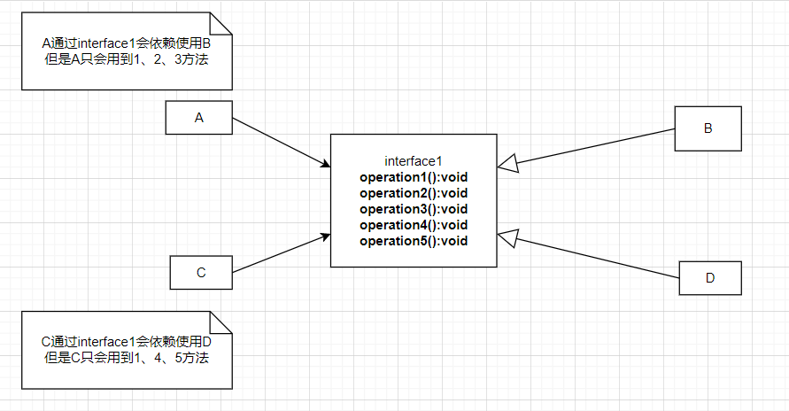
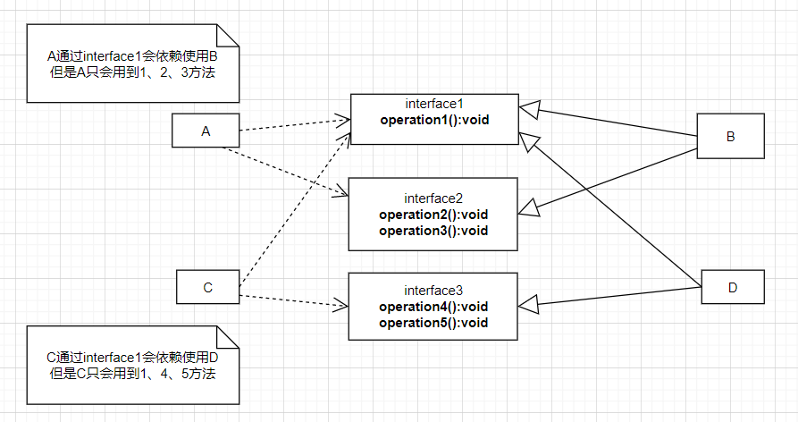
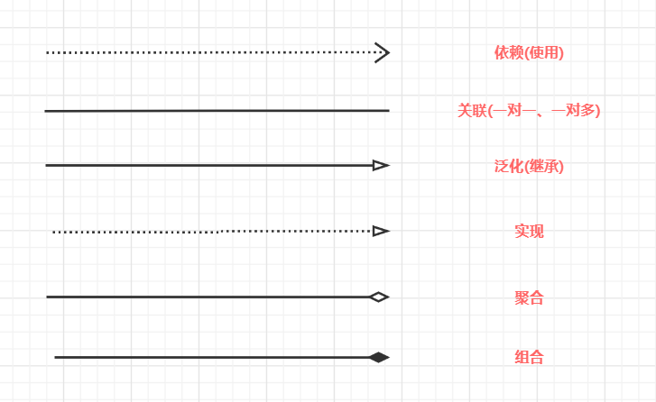

# 尚硅谷设计模式

## 第一章、设计模式概述

设计模式是程序员面对同类软件工程设计问题所总结出来的有用的经验，设计模式不是代码，而是某类问题的通用解决方案，设计模式代表了最佳的实践，这些解决方案是众多软件开发人员经过相当长的一段时间的试验和错误终结出来的

设计模式的本质提高软件的维护性，通用性和扩展性，并降低软件的复杂度

设计模式类型：

- 创建型模式：单例模式、抽象工厂模式、原型模式、建造者模式、工厂模式
- 结构型模式：适配器模式、桥接模式、装饰模式、组合模式、外观模式、享元模式、代理模式
- 行为型模式：模板方法模式、命令模式、访问者模式、迭代器模式、观察者模式、中介者模式、备忘录模式、解释器模式、状态模式、策略模式、职责链模式(责任链模式)

## 第二章、七大设计原则

### 2.1、单一职责原则

单一职责原则：一个类只负责一项职责

如果类A负责两个不同职责：职责1，职责2，当职责1需求变更而改变A时，可能造成职责2执行错误，所以要将类A的粒度分解为A1，A2

### 2.2、接口隔离原则

接口隔离原则：客户端不应依赖它不需要的接口，即一个类对另一个类的依赖应建立在最小接口上



根据接口隔离原则，应该将接口interface1拆分为独立的几个接口(这里最少要拆分成三个接口)，类A和类C分别与他们需要的接口建立依赖关系



### 2.3、依赖倒转原则

依赖倒转原则：

1. 高层模块不应该依赖底层模块，二者应该依赖其抽象
2. 抽象不应该依赖细节，细节应该依赖抽象
3. 依赖倒转的中心思想是面向接口编程
4. 依赖倒转原则是基于：相对于细节的多变性，抽象的东西要稳定的多，以抽象为基础搭建的架构比细节为基础的架构要稳定的多，在Java中，抽象是指结构或抽象类，细节就是具体的实现类
5. 使用接口或抽象类的目的是指定好规范，而不涉及具体的操作，把展现细节的任务交给他们的实现类去完成

依赖关系传递的三种方式

1. 接口传递
2. 构造方法传递
3. setter方法传递

注意事项

1. 低层模块尽量都要有抽象类或接口，或者两者都有，程序稳定性更好
2. 变量的声明类型尽量是抽象类或接口，这样我们的变量引用和实际对象间，就存在一个缓冲层，利于程序扩展和优化
3. 继承时遵循里氏替换原则

### 2.4、里氏替换原则

继承会给程序带来侵入性，比如一个类被其他的类所继承，则当这个类需要修改时，必须要考虑到所有的子类，并且父类修改后，所有涉及到子类的功能都有可能产生故障

里氏替换原则：

1. 如果对每个类型为T1的对象o1，都有类型为T2的对象o2，使得以T1定义的所有程序P在所有的对象o1都代换成o2时，程序P的行为没有发生变化，那么类型T2是类型T1的子类型，换句话说，所有引用基类的地方必须能够透明地使用其子类的对象
2. 在使用继承时，遵循里氏替换原则，在子类中尽量不要重写父类的方法
3. 里氏替换原则告诉我们，继承实际上让两个类耦合性增强了，在适当的情况下，可以通过聚合、组合、依赖，来解决问题

### 2.5、开闭原则

1. 开闭原则：一个软件实体(如：类)，模块和函数应该对扩展开放(对提供方)，对修改关闭(对使用方)。用抽象构建框架，用实现扩展细节
2. 当软件需要变化时，尽量通过修改软件实体的行为来实现变化，而不是通过修改已有的代码来实现变化

### 2.6、迪米特法则

1. 迪米特法则又叫最少知道原则：即一个类对自己依赖的类知道的越少越好。也就是说对于被依赖的类不管多么复杂，都尽量将逻辑封装在类的内部。对外除了public方法，不对外提供任何信息
2. 类与类关系越密切，耦合度越大
3. 只能与直接朋友通信：每个对象都会与其他对象有耦合关系，只要两个对象之间有耦合关系，我们就说这两个对之间是朋友关系。耦合的方式很多，依赖、关联、组合、聚合等，其中，我们称出现成员变量，方法参数，方法返回值中的类为直接朋友，而出现在局部变量的类不是直接朋友。也就是说，陌生的类，最好不要以局部变量的形式出现在类的内部

### 2.7、合成复用原则

合成复用原则：尽量使用合成/聚合的方式，而不是使用继承

## 第三章、UML类图基础



类之间的关系：依赖、泛化(继承)、实现、关联、组合、聚合

### 3.1、依赖

只要是在类中用到了对方，那么他们之间就存在依赖关系

```java
public class PersonServiceBean{
	private PersonDao personDao;//全局变量
    public void save(Person person){}//形式参数
    public IDCard getIDCard(Integer personId){}//返回参数
    public void modify(){
        Department department = new Department();//局部变量
    }
}
```

### 3.2、泛化关系

泛化关系：是依赖关系的一种特例

```java
public abstract class DaoSupport{
    public void save(Object entity);
    public void delete(Object id);
}
public class PersonServiceBean extends DaoSupport{}
```

### 3.3、实现关系

实现关系：是泛化关系的一种特例，也是依赖关系，就是A类实现B接口

```java
public interface PersonService{
    public void delete(Interger id);
}
public PsersonServiceBean implements PersionService{
    public void delete(Interger id){...}
}
```

### 3.4、关联关系

关联关系就是类与类之间的联系，它是依赖关系的特例

关联具有导航性：即双向关系或单向关系

关联具有多重性：

```java
class Person{//单向关系
    private IDCard idcard;
}
```

```java
class Person{//双向关系
    private IDCard idcard;
}
class IDCard{
    private Person person;
}
```

### 3.5、聚合关系

聚合关系：表示整体和部分的关系，整体与部分可以分开。聚合关系是关联关系的特例，所以它具有导航性和多重性。

```java
public class Computer{
    private Mouse mouse;
    private Monitor monitor;
}
```

### 3.6、组合

组合关系：也是整体与部分的关系，但是与聚合关系不同的是，整体与部分不可以分开

```java
public class Person{
    private IDCard card;
    private Head head = new Head();
}
```

Person删除后head也级联删除了，但是card不会被删除

## 第四章、创建型模式

### 3.1、单例模式

单例模式有八中方式：

1. 饿汉式(静态常量)
2. 饿汉式(静态代码块)
3. 懒汉式(线程不安全)
4. 懒汉式(线程安全，同步方法)
5. 懒汉式(线程安全，同步代码块)
6. 双重检查
7. 静态内部类
8. 枚举

#### 3.1.1、饿汉式(静态常量)

```java
public class SingletonTest01 {
    public static void main(String[] args) {
        Singleton instance = Singleton.getInstance();
        Singleton instance2 = Singleton.getInstance();
        System.out.println(instance == instance2);
    }
}
class Singleton{
    //构造器私有化
    private Singleton(){}
    
    private final static Singleton instance = new Singleton();

    public static Singleton getInstance() {
        return instance;
    }
}
```

优点：写法简单，基于ClassLoader机制，在类加载的时候就完成实例化。避免了线程同步的问题

缺点：在类装载的时候就完成实例化，没有达到Lazy Loading的效果。如果从始至终都没有用过这个实例，则会造成内存浪费

#### 3.1.2、饿汉式(静态代码块)

```java
class Singleton{
    //1、构造器私有化，外部无法new
    private Singleton(){}
    //2、在本类中创建对象实例
    private static Singleton instance;
    //3、在静态代码块中创建单例对象
    static {
        instance = new Singleton();
    }
    //4、提供一个公有的静态方法，返回实例对象
    public static Singleton getInstance() {
        return instance;    
    }
}
```

优缺点：与上面方式类似，优缺点与上面是一样的

#### 3.1.3、懒汉式(线程不安全)

起到了Lazy Loading的效果，但只能在单线程下使用

如果在多线程下，一个线程进入了if(instance == null)判断语句块，还未来得及创建对象，另一个线程也进入了判断语句块，这时便会产生多个实例。所以在多线程环境下不可使用这种方式

在实际开发中，不要使用这种方式

```java
class Singleton{
    private Singleton(){}

    private static Singleton instance;
    
    //提供一个静态公有方法，当使用到该方法时，才去创建instance
    public static Singleton getInstance() {
        if (instance == null){
            instance = new Singleton();
        }
        return instance;    
    }
}
```

#### 3.1.4、懒汉式(线程安全，同步方法)

解决了线程不安全问题

效率太低，每个线程在想获得类的实例时，执行getInstance()方法都要进行同步。而其实这个代码只执行一次实例化代码就够了，后面的想获得该类实例，直接return就行了，方法进行同步效率太低。

```java
class Singleton{
    private Singleton(){}

    private static Singleton instance;
    
    //提供一个静态公有方法，加入同步处理的代码，解决线程安全问题
    public static synchronized Singleton getInstance() {
        if (instance == null){
            instance = new Singleton();
        }
        return instance;    
    }
}
```

#### 3.1.5、双重检查

Double-Check概念是多线程开发中常使用到的，如代码所示，我们进行了两次 if (instance == null)检查，这样就可以保证线程安全了

这样，实例化代码只用执行一次，后面再次访问时，判断if (instance == null)，直接return实例化对象，也避免了反复进行方法同步

这种方法线程安全，懒加载，效率较高，推荐使用这种单例模式

```java
class Singleton{
    private Singleton(){}

    private static volatile Singleton instance;
    
    //提供一个静态公有方法，加入双重检查代码，解决线程安全问题，同时解决懒加载问题
    public static synchronized Singleton getInstance() {
        if (instance == null){
            synchronized (Singleton.class){
                if (instance == null){
                    instance = new Singleton();
                }
            }
        }
        return instance;
    }
}
```

