# 狂神JavaWeb

## 1、基本概念

### 1.1、前言

静态web

动态web

### 1.2、web应用程序

web应用程序组成

- html。css，js
- jsp，servlet
- java程序
- jar包
- 配置文件(Properties)

### 1.3、静态Web

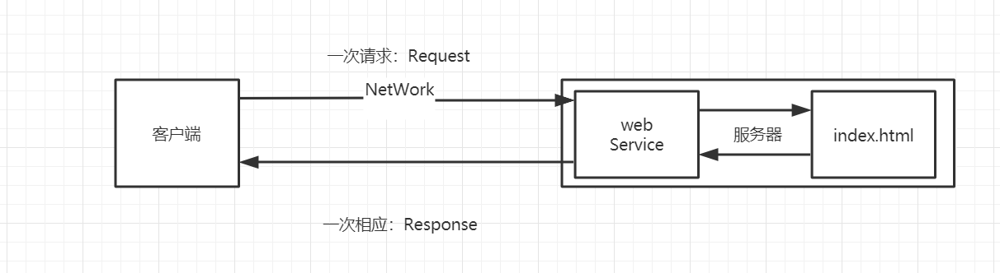

### 1.4、动态Web

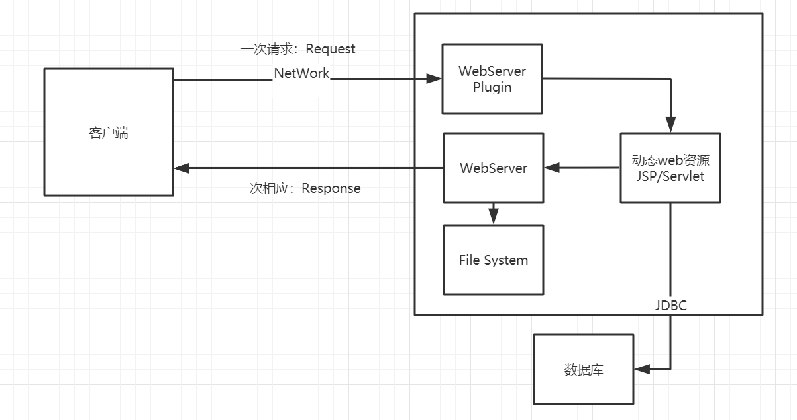

## 2、Web服务器

### 2.1、技术讲解

**ASP:**

- 微软：国内最早流行的就是ASP；

- 在HTML中嵌入了VB的脚本，  ASP + COM；

- 在ASP开发中，基本一个页面都有几千行的业务代码，页面极其换乱

- 维护成本高！

- C# 

- IIS

  ```html
  <h1>
      <h1><h1>
          <h1>
              <h1>
                  <h1>
          <h1>
              <%
              System.out.println("hello")
              %>
              <h1>
                  <h1>
     <h1><h1>
  <h1>
  ```

  

**php：**

- PHP开发速度很快，功能很强大，跨平台，代码很简单 （70% , WP）
- 无法承载大访问量的情况（局限性）


**JSP/Servlet : ** 

B/S：浏览和服务器

C/S:  客户端和服务器

- sun公司主推的B/S架构
- 基于Java语言的 (所有的大公司，或者一些开源的组件，都是用Java写的)
- 可以承载三高问题带来的影响；
- 语法像ASP ， ASP-->JSP , 加强市场强度；


.....


### 2.2、web服务器

服务器是一种被动的操作，用来处理用户的一些请求和给用户一些响应信息；


**IIS**

微软的； ASP...,Windows中自带的

**Tomcat**


面向百度编程；

Tomcat是Apache 软件基金会（Apache Software Foundation）的Jakarta 项目中的一个核心项目，最新的Servlet 和JSP 规范总是能在Tomcat 中得到体现，因为Tomcat 技术先进、性能稳定，而且**免费**，因而深受Java 爱好者的喜爱并得到了部分软件开发商的认可，成为目前比较流行的Web 应用服务器。

Tomcat 服务器是一个免费的开放源代码的Web 应用服务器，属于轻量级应用[服务器](https://baike.baidu.com/item/服务器)，在中小型系统和并发访问用户不是很多的场合下被普遍使用，是开发和调试JSP 程序的首选。对于一个Java初学web的人来说，它是最佳的选择

Tomcat 实际上运行JSP 页面和Servlet。Tomcat最新版本为**9.0。**

....

**工作3-5年之后，可以尝试手写Tomcat服务器；**

下载tomcat：

1. 安装 or  解压
2. 了解配置文件及目录结构
3. 这个东西的作用


## 3、Tomcat

### 3.1、Tomcat安装

官网下载，解压即用

### 3.2、Tomcat启动和配置

文件目录 

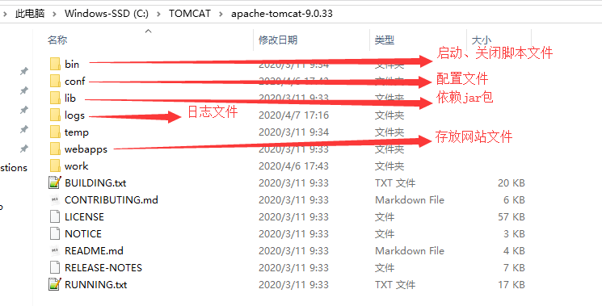

启动关闭服务器

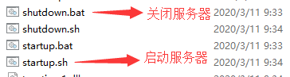

启动服务器可直接访问http://localhost:8080，8080为tomcat默认端口号

可能出现的问题：

1. java环境变量没有配
2. 闪退问题：服务器配置问题
3. 乱码问题：配置文件中设置

### 3.3、配置

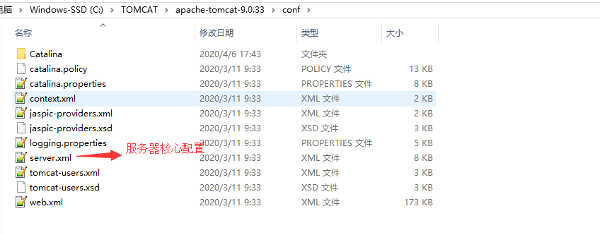

可以配置主机端口号

可以配置主机名称

```xml
    <Connector port="8080" protocol="HTTP/1.1"
               connectionTimeout="20000"
               redirectPort="8443" />
```

- tomcat的默认端口号为：8080
- mysql：3306
- http：80
- https：443

name：主机名

appBase：网站存放位置

```xml
      <Host name="localhost"  appBase="webapps"
            unpackWARs="true" autoDeploy="true">
```

如何访问一个域名的？

1. 在浏览器输入一个域名回车
2. 检查本机C:\Windows\System32\drivers\etc\hosts配置文件下是否有这个域名映射
   1. 有：直接返回对应的ip，然后请求服务器
   2. 没有：去DNS服务器找，找到的话返回ip

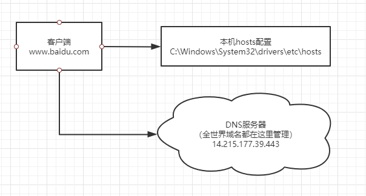

### 3.4、发布一个web网站

网站应该有的结构

```java
--webapps ：Tomcat服务器的web目录
	-ROOT
	-kuangstudy ：网站的目录名
		- WEB-INF
			-classes : java程序
			-lib：web应用所依赖的jar包
			-web.xml ：网站配置文件
		- index.html 默认的首页
		- static 
            -css
            	-style.css
            -js
            -img
         -.....
```

## 4、HTTP协议

### 4.1、什么是HTTP

HTTP(超文本传输协议)是一个简单的请求响应协议，通常运行在TCP上

- 文本：html，字符串 ...
- 超文本：图片、视频、音乐、文件、定位
- 端口80

HTTPS：安全的443

### 4.2、两个时代

http1.0时代：客户端与web连接之后只能获得一个web资源然后断开连接

http1.1时代：客户端与web连接之后可以获得多个web资源然后断开连接

### 4.3、Http请求

- 客户端---发请求（Request）---服务器

百度：

```java
Request URL:https://www.baidu.com/   请求地址
Request Method:GET    get方法/post方法
Status Code:200 OK    状态码：200
Remote（远程） Address:14.215.177.39:443
```

```java
Accept:text/html  
Accept-Encoding:gzip, deflate, br
Accept-Language:zh-CN,zh;q=0.9    语言
Cache-Control:max-age=0
Connection:keep-alive
```

#### 1、请求行

- 请求行中的请求方式：GET
- 请求方式：**Get，Post**，HEAD,DELETE,PUT,TRACT…
  - get：请求能够携带的参数比较少，大小有限制，会在浏览器的URL地址栏显示数据内容，不安全，但高效
  - post：请求能够携带的参数没有限制，大小没有限制，不会在浏览器的URL地址栏显示数据内容，安全，但不高效。

#### 2、消息头

```java
Accept：告诉浏览器，它所支持的数据类型
Accept-Encoding：支持哪种编码格式  GBK   UTF-8   GB2312  ISO8859-1
Accept-Language：告诉浏览器，它的语言环境
Cache-Control：缓存控制
Connection：告诉浏览器，请求完成是断开还是保持连接
HOST：主机..../.
```

### 4.4、Http响应

- 服务器---响应-----客户端

百度：

```java
Cache-Control:private    缓存控制
Connection:Keep-Alive    连接
Content-Encoding:gzip    编码
Content-Type:text/html   类型
```

#### 1.响应体

```java
Accept：告诉浏览器，它所支持的数据类型
Accept-Encoding：支持哪种编码格式  GBK   UTF-8   GB2312  ISO8859-1
Accept-Language：告诉浏览器，它的语言环境
Cache-Control：缓存控制
Connection：告诉浏览器，请求完成是断开还是保持连接
HOST：主机..../.
Refresh：告诉客户端，多久刷新一次；
Location：让网页重新定位；
```

#### 2、响应状态码 

200：请求响应成功  200

3xx：请求重定向 

- 重定向：你重新到我给你新位置去；

4xx：找不到资源   404

- 资源不存在；

5xx：服务器代码错误   500       502:网关错误


**常见面试题：**

当你的浏览器中地址栏输入地址并回车的一瞬间到页面能够展示回来，经历了什么？

## 5、MAVEN

### 5.1、Maven项目架构管理工具

Maven的核心思想：**约定大于配置**

### 5.2、下载安装Maven

官网下载，解压配置环境变量即用

### 5.3、配置环境变量

在我们的系统环境变量中

配置如下配置：

- M2_HOME     maven目录下的bin目录(自动依赖项目，如Spring boot需通过这个配置寻找maven)
- MAVEN_HOME      maven的目录
- 在系统的path中配置  %MAVEN_HOME%\bin

测试：win+r ->  cmd -> mvn -v/mvn -version

### 5.4、阿里云镜像

```xml
<mirror>
    <id>aliyunmaven</id>
    <mirrorOf>*</mirrorOf>
    <name>阿里云公共仓库</name>
    <url>https://maven.aliyun.com/repository/public</url>
</mirror>
<mirror>
    <id>aliyunmaven</id>
    <mirrorOf>*</mirrorOf>
    <name>阿里云谷歌仓库</name>
    <url>https://maven.aliyun.com/repository/google</url>
</mirror>
<mirror>
    <id>aliyunmaven</id>
    <mirrorOf>*</mirrorOf>
    <name>阿里云阿帕奇仓库</name>
    <url>https://maven.aliyun.com/repository/apache-snapshots</url>
</mirror>
<mirror>
    <id>aliyunmaven</id>
    <mirrorOf>*</mirrorOf>
    <name>阿里云spring仓库</name>
    <url>https://maven.aliyun.com/repository/spring</url>
</mirror>
<mirror>
    <id>aliyunmaven</id>
    <mirrorOf>*</mirrorOf>
    <name>阿里云spring插件仓库</name>
    <url>https://maven.aliyun.com/repository/spring-plugin</url>
</mirror>
```

### 5.5、本地仓库

localRepository：本地仓库配置

```xml
<localRepository>C:\MyMaven\maven_repository</localRepository>
```

### 5.6、IDEA使用MAVEN

新建maven项目

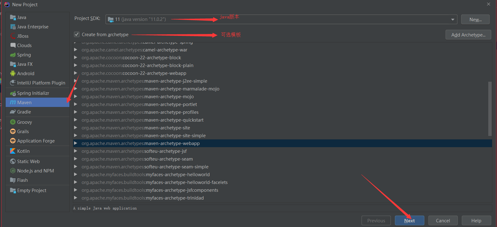

Next

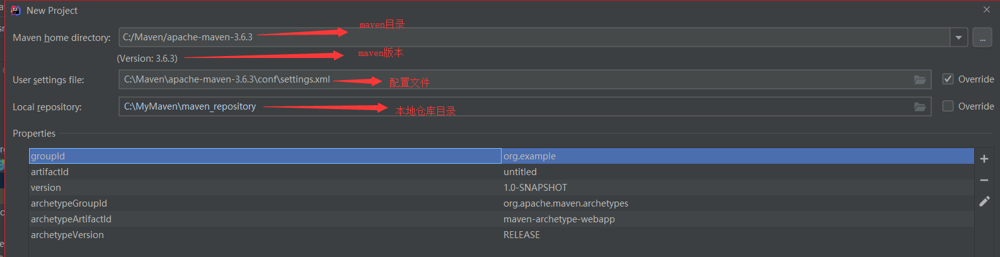

Next

Finish

进入项目优先查看Maven配置，确定为本地目录

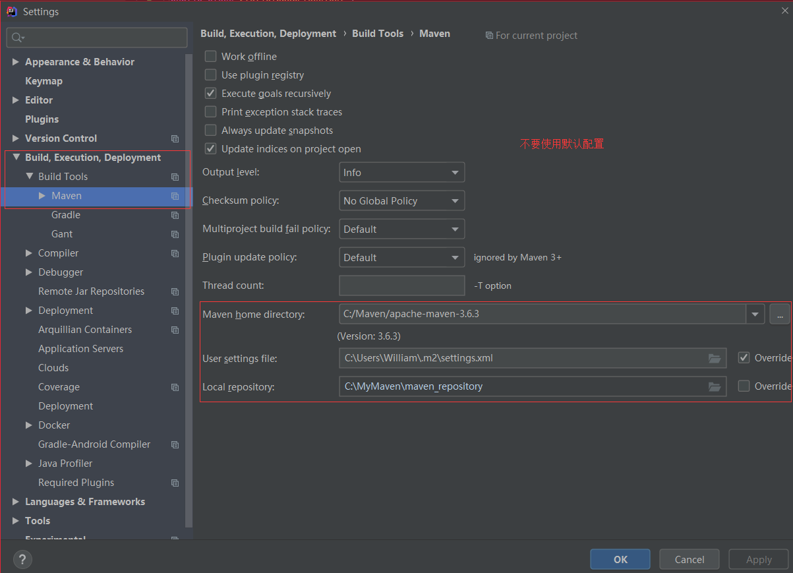

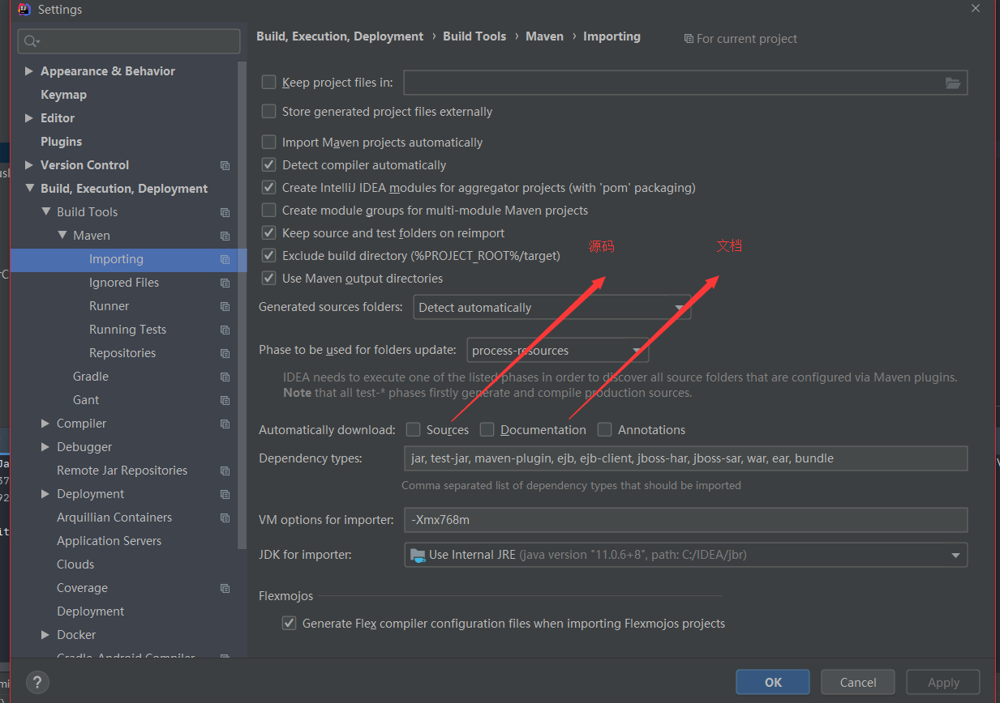

点击ok就完成了配置

### 5.7、创建一个普通的Maven项目

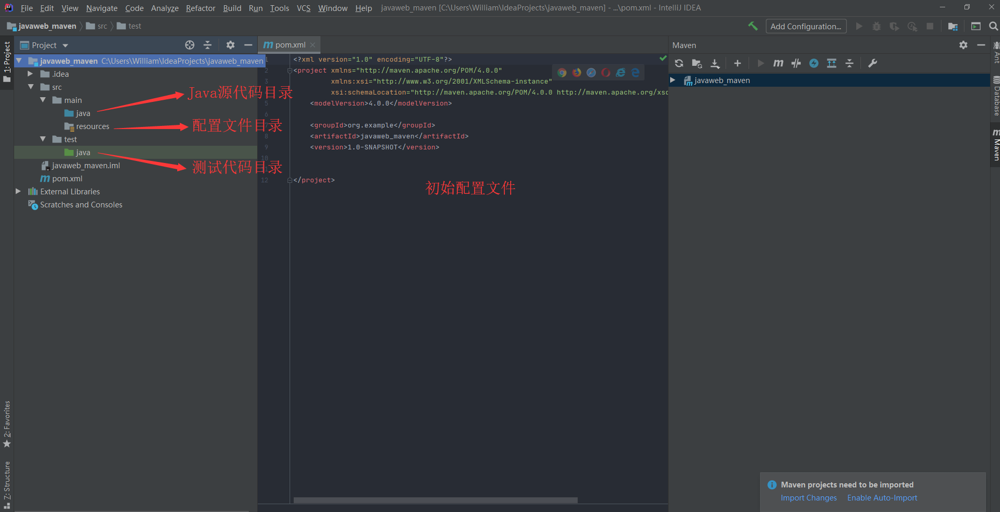

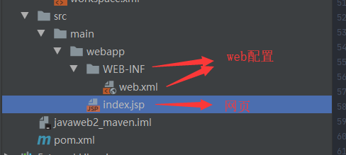

### 5.8 标记文件夹功能


### 5.9、配置TOMCAT


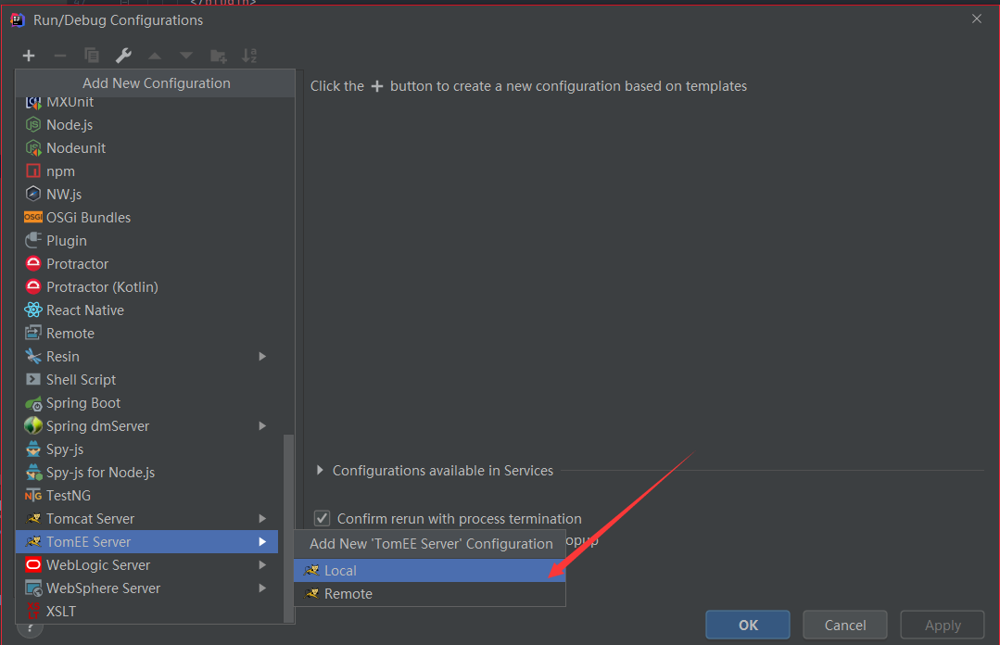

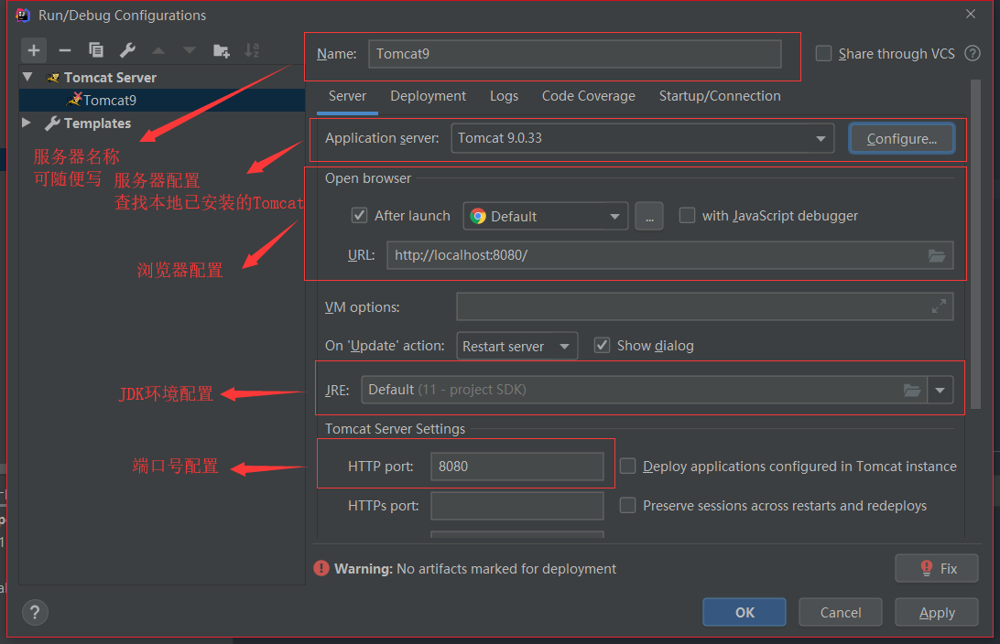

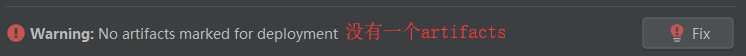

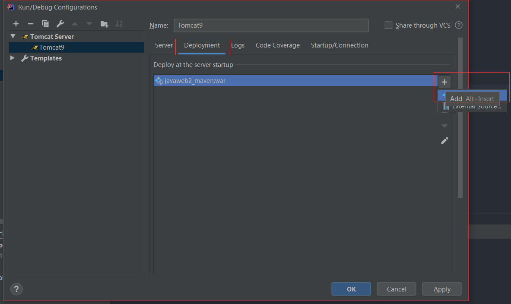

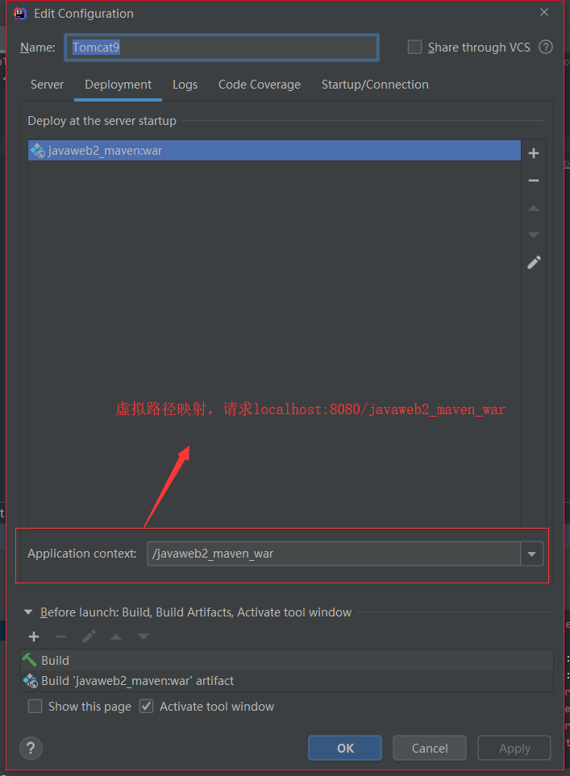

### 5.10、pom文件

pom文件是maven核心配置文件

```xml
<?xml version="1.0" encoding="UTF-8"?>
<!--Maven版本和头文件-->
<project xmlns="http://maven.apache.org/POM/4.0.0" xmlns:xsi="http://www.w3.org/2001/XMLSchema-instance"
  xsi:schemaLocation="http://maven.apache.org/POM/4.0.0 http://maven.apache.org/xsd/maven-4.0.0.xsd">
  <modelVersion>4.0.0</modelVersion>
  <!--配置文件-->
  <groupId>org.example</groupId>
  <artifactId>javaweb2_maven</artifactId>
  <version>1.0-SNAPSHOT</version>
  <!--Package:项目打包方式
  jar：java应用
  war：javaweb应用
  -->
  <packaging>war</packaging>
  <!--项目描述 没什么用，可删-->
  <name>javaweb2_maven Maven Webapp</name>
  <!-- FIXME change it to the project's website -->
  <url>http://www.example.com</url>
  <!--配置-->
  <properties>
    <!--项目的默认构建编码-->
    <project.build.sourceEncoding>UTF-8</project.build.sourceEncoding>
    <!--编码版本-->
    <maven.compiler.source>1.7</maven.compiler.source>
    <maven.compiler.target>1.7</maven.compiler.target>
  </properties>
  <!--项目依赖-->
  <dependencies>
    <!--具体依赖的jar包配置文件-->
    <dependency>
      <groupId>junit</groupId>
      <artifactId>junit</artifactId>
      <version>4.11</version>
      <scope>test</scope>
    </dependency>
  </dependencies>
  <!--项目构建用的东西-->
  <build>
    <finalName>javaweb2_maven</finalName>
    <pluginManagement><!-- lock down plugins versions to avoid using Maven defaults (may be moved to parent pom) -->
      <plugins>
        <plugin>
          <artifactId>maven-clean-plugin</artifactId>
          <version>3.1.0</version>
        </plugin>
        <!-- see http://maven.apache.org/ref/current/maven-core/default-bindings.html#Plugin_bindings_for_war_packaging -->
        <plugin>
          <artifactId>maven-resources-plugin</artifactId>
          <version>3.0.2</version>
        </plugin>
        <plugin>
          <artifactId>maven-compiler-plugin</artifactId>
          <version>3.8.0</version>
        </plugin>
        <plugin>
          <artifactId>maven-surefire-plugin</artifactId>
          <version>2.22.1</version>
        </plugin>
        <plugin>
          <artifactId>maven-war-plugin</artifactId>
          <version>3.2.2</version>
        </plugin>
        <plugin>
          <artifactId>maven-install-plugin</artifactId>
          <version>2.5.2</version>
        </plugin>
        <plugin>
          <artifactId>maven-deploy-plugin</artifactId>
          <version>2.8.2</version>
        </plugin>
      </plugins>
    </pluginManagement>
  </build>
</project>

```

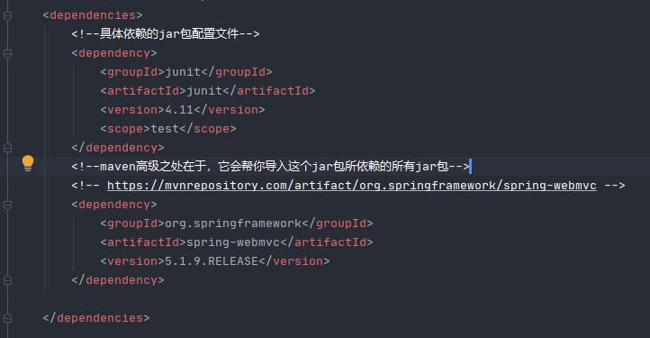

### 5.11、maven导致的资源导出失败问题

maven由于他的约定大于配置，我们之后可以能遇到我们写的配置文件，无法被导出或者生效的问题，解决方案：

```xml
<!--在build中配置resources，来防止我们资源导出失败的问题-->
<build>
    <resources>
        <resource>
            <directory>src/main/resources</directory>
            <includes>
                <include>**/*.properties</include>
                <include>**/*.xml</include>
            </includes>
            <filtering>true</filtering>
        </resource>
        <resource>
            <directory>src/main/java</directory>
            <includes>
                <include>**/*.properties</include>
                <include>**/*.xml</include>
            </includes>
            <filtering>true</filtering>
        </resource>
    </resources>
</build>
```

### 5.12、IDEA操作

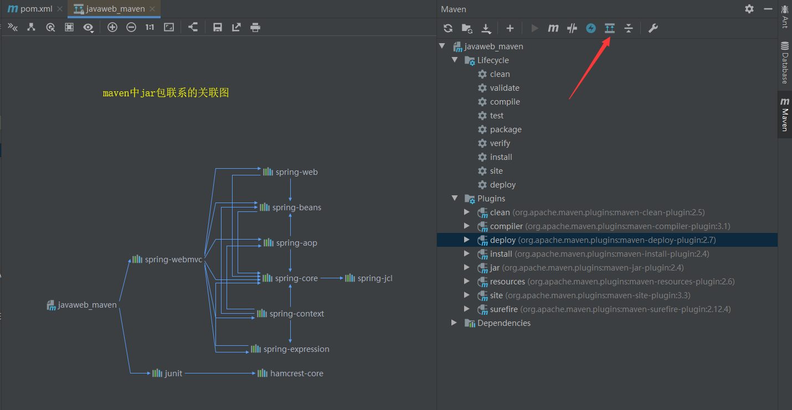

### 5.13 解决遇到的问题

1. Maven 3.6.2

   解决方法：降级为3.6.1

   

2. Tomcat闪退

   

3. IDEA中每次都要重复配置Maven
   在IDEA中的全局默认配置中去配置

   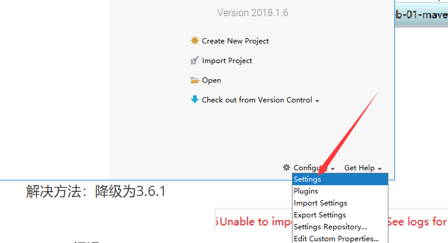

   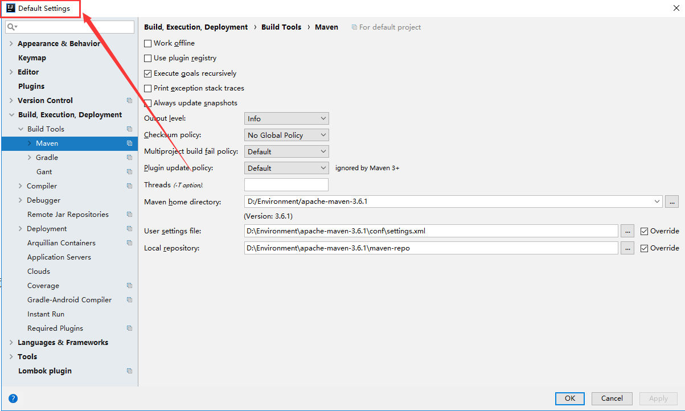

4. Maven项目中Tomcat无法配置

5. maven默认web项目中的web.xml版本问题

   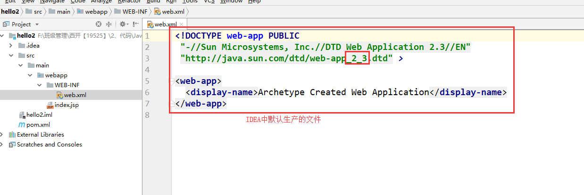

6. 替换为webapp4.0版本和tomcat一致

   ```xml
   <?xml version="1.0" encoding="UTF-8"?>
   <web-app xmlns="http://xmlns.jcp.org/xml/ns/javaee"
            xmlns:xsi="http://www.w3.org/2001/XMLSchema-instance"
            xsi:schemaLocation="http://xmlns.jcp.org/xml/ns/javaee
                         http://xmlns.jcp.org/xml/ns/javaee/web-app_4_0.xsd"
            version="4.0"
            metadata-complete="true">
   
   
   
   </web-app>
   ```

   

7. Maven仓库的使用

   地址：https://mvnrepository.com/

   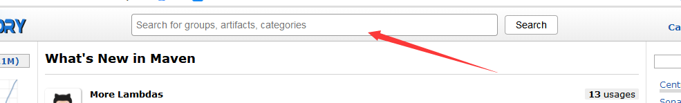

   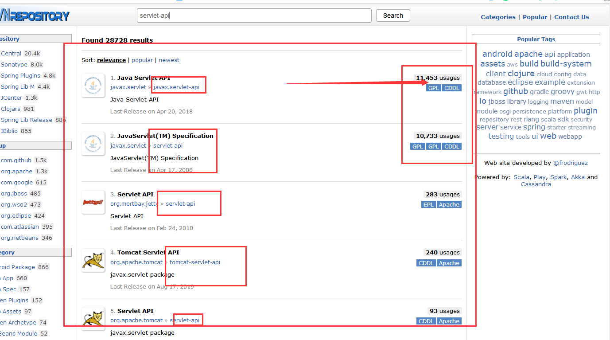

   

   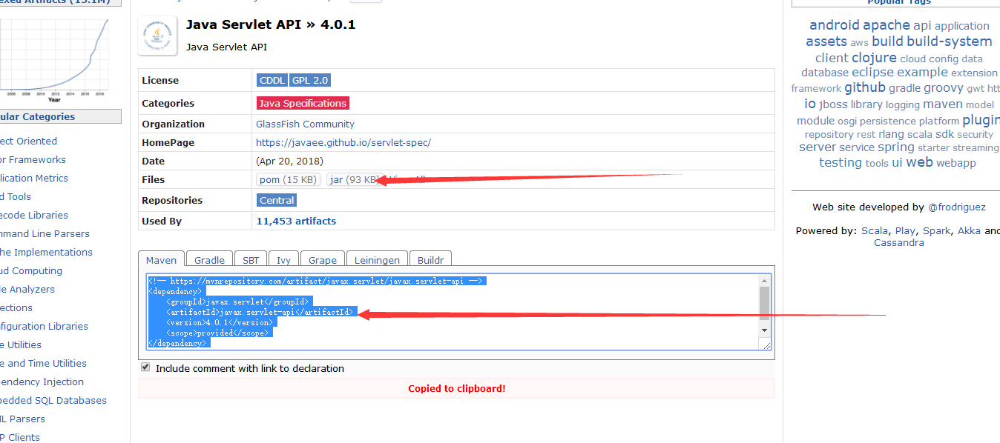

## 6、Servlet

### 6.1、Servlet简介

- Servlet是sun公司开发动态web的一门技术
- sun在这些API中提供一个接口叫做：Servlet，如果你想开发一个Servlet程序，只需要完成两个步骤
  - 编写一个类实现Servlet接口
  - 把开发好的java类部署到web服务器中

把实现了Servlet接口的Java程序叫做，Servlet

Servlet声明周期：

- Servlet通过调用init()方法进行初始化

- Servlet调用service()方法来处理客户端请求

- Servlet调用destroy()方法终止(结束)
- 最后Servlet是由JVM的垃圾回收器进行垃圾回收

### 6.2、HelloServlet

Servlet接口Sun公司有两个默认的实现类：HttpServlet，GenericServlet

1. 构建一个Maven项目，建立一个moudel

2. 关于Maven父子工程理解

父项目

```xml
<modules>
    <module>servlet-01</module>
</modules>
```

子项目

```xml
<parent>
    <artifactId>javaweb-02-servlet</artifactId>
    <groupId>org.example</groupId>
    <version>1.0-SNAPSHOT</version>
</parent>
```

子项目可以直接用父项目的java类

3. Maven环境优化

   1. 修改web.xml为最新的(在tomcat安装目录中)
   2. 将maven的结构搭建完整

4. 编写一个Servlet程序

   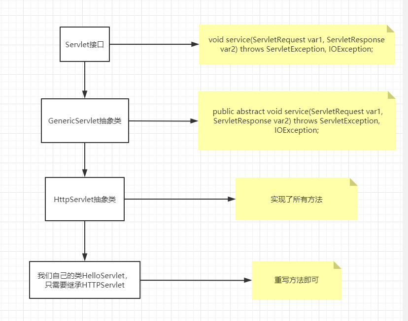

   1. 编写一个普通类

   2. 实现一个Servlet接口，这里我们直接继承HttpServlet

      ```java
      public class HelloServlet extends HttpServlet {
          @Override
          protected void doGet(HttpServletRequest req, HttpServletResponse resp) throws ServletException, IOException {
              System.out.println("进入doGet方法");
              PrintWriter writer = resp.getWriter();//响应流
              writer.print("Hello,servlet");
          }
      
          @Override
          protected void doPost(HttpServletRequest req, HttpServletResponse resp) throws ServletException, IOException {
              doGet(req,resp);
          }
      }
      ```

5. 编写Servlet的映射

   为什么需要映射：我们写的是java程序，但是要通过浏览器访问，而浏览器需要连接web服务器，所以我们需要在web服务中注册我们写的Servlet，还需要给他一个浏览器能够访问的路径

6. 配置Tomcat

   注意：配置项目发布的路径就可以了

7. 启动Tomcat(tomcat日志乱码问题：tomcat安装目录/conf/logging.properties 将java.util.logging.ConsoleHandler.encoding修改为GBK编码)

### 6.3、Servlet原理

Servlet是由Web服务器调用，web服务器在收到浏览器请求之后，会：

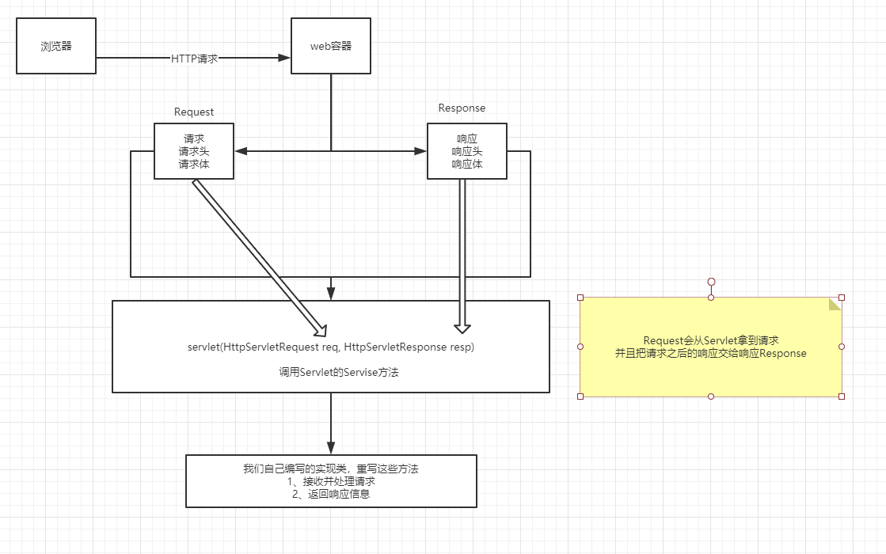


### 6.4、Mapping问题

1. 一个Servlet可以指定一个映射路径

   ```xml
       <servlet-mapping>
           <servlet-name>hello</servlet-name>
           <url-pattern>/hello</url-pattern>
       </servlet-mapping>
   ```

2. 一个Servlet可以指定多个映射路径

   ```xml
       <servlet-mapping>
           <servlet-name>hello</servlet-name>
           <url-pattern>/hello</url-pattern>
       </servlet-mapping>
       <servlet-mapping>
           <servlet-name>hello</servlet-name>
           <url-pattern>/hello2</url-pattern>
       </servlet-mapping>
       <servlet-mapping>
           <servlet-name>hello</servlet-name>
           <url-pattern>/hello3</url-pattern>
       </servlet-mapping>
       <servlet-mapping>
           <servlet-name>hello</servlet-name>
           <url-pattern>/hello4</url-pattern>
       </servlet-mapping>
       <servlet-mapping>
           <servlet-name>hello</servlet-name>
           <url-pattern>/hello5</url-pattern>
       </servlet-mapping>
   
   ```

3. 一个Servlet可以指定通用映射路径

   ```xml
       <servlet-mapping>
           <servlet-name>hello</servlet-name>
           <url-pattern>/hello/*</url-pattern>
       </servlet-mapping>
   ```

4. 默认请求路径

   ```xml
       <!--默认请求路径-->
       <servlet-mapping>
           <servlet-name>hello</servlet-name>
           <url-pattern>/*</url-pattern>
       </servlet-mapping>
   ```

5. 指定一些后缀或者前缀等等….

   ```xml
   <!--可以自定义后缀实现请求映射
       注意点，*前面不能加项目映射的路径
       hello/sajdlkajda.qinjiang
       -->
   <servlet-mapping>
       <servlet-name>hello</servlet-name>
       <url-pattern>*.qinjiang</url-pattern>
   </servlet-mapping>
   ```

6. 优先级问题
   指定了固有的映射路径优先级最高，如果找不到就会走默认的处理请求；

   ```xml
   <!--404-->
   <servlet>
       <servlet-name>error</servlet-name>
       <servlet-class>com.kuang.servlet.ErrorServlet</servlet-class>
   </servlet>
   <servlet-mapping>
       <servlet-name>error</servlet-name>
       <url-pattern>/*</url-pattern>
   </servlet-mapping>
   
   ```


### 6.5、ServletContext

web容器在启动的时候，它会为每个web程序都创建一个对应的ServletContext对象，它代表了当前的web应用

#### 1、共享数据

我在这个Servlet中保存的数据，可以在另外一个Servlet中拿到

```java
public class HelloServlet extends HttpServlet {
    @Override
    protected void doGet(HttpServletRequest req, HttpServletResponse resp) throws ServletException, IOException {
//        this.getServletContext();
//        this.getServletConfig();
//        this.getInitParameter();
        ServletContext servletContext = this.getServletContext();
        String str = "苏茶";
        servletContext.setAttribute("username",str);
        System.out.println("Hello ");
    }
}
```

```java
public class GetServlet extends HttpServlet {
    @Override
    protected void doGet(HttpServletRequest req, HttpServletResponse resp) throws ServletException, IOException {
        ServletContext servletContext = this.getServletContext();
        String username = (String) servletContext.getAttribute("username");
        resp.setContentType("text/html");
        resp.setCharacterEncoding("utf-8");
        PrintWriter writer = resp.getWriter();//.printf(username);
        writer.print(username);
    }
    @Override
    protected void doPost(HttpServletRequest req, HttpServletResponse resp) throws ServletException, IOException {
        super.doPost(req, resp);
    }
}
```

```xml
  <servlet>
    <servlet-name>hello</servlet-name>
    <servlet-class>com.shary.servlet.HelloServlet</servlet-class>
  </servlet>
  <servlet-mapping>
    <servlet-name>hello</servlet-name>
    <url-pattern>/hello</url-pattern>
  </servlet-mapping>
  <servlet>
    <servlet-name>get</servlet-name>
    <servlet-class>com.shary.servlet.GetServlet</servlet-class>
  </servlet>
  <servlet-mapping>
    <servlet-name>get</servlet-name>
    <url-pattern>/get</url-pattern>
  </servlet-mapping>
```

#### 2、获取初始化参数
```xml
<!--配置一些web应用初始化参数-->
<context-param>
  <param-name>url</param-name>
  <param-value>jdbc:mysql://localhost:3306/mybatis</param-value>
</context-param>
```
```java
ServletContext context = this.getServletContext();
String url = context.getInitParameter("url");
resp.getWriter().print(url);
```

#### 3、请求转发

```java
System.out.println("转发了没");
ServletContext context = this.getServletContext();
RequestDispatcher requestDispatcher = context.getRequestDispatcher("/gp");//转发请求路径
requestDispatcher.forward(req,resp);//调用forward实现转发
```

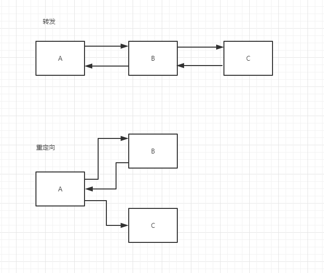

#### 4、读取资源文件

Properties

- 在java目录下新建properties
- 在source目录下新建properties

发现：都被打包到了同一个路径下：classes，我们称这个路径为classpath 

思路：需要一个文件流

```properties
username = shary
password = 32451 
```

```java
package com.shary.servlet;

import javax.servlet.ServletContext;
import javax.servlet.ServletException;
import javax.servlet.http.HttpServlet;
import javax.servlet.http.HttpServletRequest;
import javax.servlet.http.HttpServletResponse;
import java.io.IOException;
import java.io.InputStream;
import java.util.Properties;

public class ServletDemo5 extends HttpServlet {
    @Override
    protected void doGet(HttpServletRequest req, HttpServletResponse resp) throws ServletException, IOException {
        ServletContext context = this.getServletContext();
        InputStream is = context.getResourceAsStream("/WEB-INF/classes/com/shary/servlet/aa.properties");
        Properties prop = new Properties();
        prop.load(is);
        String username = prop.getProperty("username");
        String password = prop.getProperty("password");
        resp.getWriter().println(username);
        resp.getWriter().println(password);
    }

    @Override
    protected void doPost(HttpServletRequest req, HttpServletResponse resp) throws ServletException, IOException {
        doGet(req, resp);
    }
}

```

访问测试即可ok；

### 6.6、HttpServletResponse

web服务器接收到客户端的http请求，针对这个请求，分别创建一个代表请求的HttpServletRequest对象，代表响应一个HttpservletResponse

- 如果要获取客户端请求过来的参数：找HttpServletRequest
- 如果要给客户端响应一些信息：找HttpServletResponse

#### 1、简单分类

负责向浏览器发送数据的方法

```java
ServletOutputStream getOutputStream() throws IOException;
PrintWriter getWriter() throws IOException;
```

负责向浏览器发送响应头的方法

```java
void setCharacterEncoding(String var1);
void setContentLength(int var1);
void setContentLengthLong(long var1);
void setContentType(String var1);
void setDateHeader(String var1, long var2);
void addDateHeader(String var1, long var2);
void setHeader(String var1, String var2);
void addHeader(String var1, String var2);
void setIntHeader(String var1, int var2);
void addIntHeader(String var1, int var2);
```

响应状态码

```java
int SC_CONTINUE = 100;
int SC_SWITCHING_PROTOCOLS = 101;
int SC_OK = 200;
int SC_CREATED = 201;
int SC_ACCEPTED = 202;
int SC_NON_AUTHORITATIVE_INFORMATION = 203;
int SC_NO_CONTENT = 204;
int SC_RESET_CONTENT = 205;
int SC_PARTIAL_CONTENT = 206;
int SC_MULTIPLE_CHOICES = 300;
int SC_MOVED_PERMANENTLY = 301;
int SC_MOVED_TEMPORARILY = 302;
int SC_FOUND = 302;
int SC_SEE_OTHER = 303;
int SC_NOT_MODIFIED = 304;
int SC_USE_PROXY = 305;
int SC_TEMPORARY_REDIRECT = 307;
int SC_BAD_REQUEST = 400;
int SC_UNAUTHORIZED = 401;
int SC_PAYMENT_REQUIRED = 402;
int SC_FORBIDDEN = 403;
int SC_NOT_FOUND = 404;
int SC_METHOD_NOT_ALLOWED = 405;
int SC_NOT_ACCEPTABLE = 406;
int SC_PROXY_AUTHENTICATION_REQUIRED = 407;
int SC_REQUEST_TIMEOUT = 408;
int SC_CONFLICT = 409;
int SC_GONE = 410;
int SC_LENGTH_REQUIRED = 411;
int SC_PRECONDITION_FAILED = 412;
int SC_REQUEST_ENTITY_TOO_LARGE = 413;
int SC_REQUEST_URI_TOO_LONG = 414;
int SC_UNSUPPORTED_MEDIA_TYPE = 415;
int SC_REQUESTED_RANGE_NOT_SATISFIABLE = 416;
int SC_EXPECTATION_FAILED = 417;
int SC_INTERNAL_SERVER_ERROR = 500;
int SC_NOT_IMPLEMENTED = 501;
int SC_BAD_GATEWAY = 502;
int SC_SERVICE_UNAVAILABLE = 503;
int SC_GATEWAY_TIMEOUT = 504;
int SC_HTTP_VERSION_NOT_SUPPORTED = 505;
```

#### 2、下载文件

1. 向浏览器输出消息
2. 下载文件
   1. 要获取下载文件的路径
   2. 下载的文件名是啥
   3. 设置想办法让浏览器能够只是下载我们需要的东西
   4. 获取下载文件的输入流
   5. 创建缓冲区
   6. 获取OutputStream对象
   7. 将FileOutputStream流写入到buffer缓冲区
   8. 使用OutputStream将缓冲区中的数据输出到客户端

```java
@Override
protected void doGet(HttpServletRequest req, HttpServletResponse resp) throws ServletException, IOException {
    //        1. 要获取下载文件的路径
    String realPath = "C:\\Users\\William\\IdeaProjects\\javaweb-02-servlet\\response\\target\\classes\\谷歌.png";
    System.out.println("下载文件的路径" + realPath);
    //        2. 下载的文件名是啥
    String fileName = realPath.substring(realPath.lastIndexOf("\\") + 1);
    System.out.println("fileName=" + fileName);
    //        3. 设置想办法让浏览器能够支持(content-disposition)下载我们需要的东西，中文文件名URLEncoder.encode编码，否则有可能乱码
    resp.setHeader("content-disposition", "attachment;filename=" + URLEncoder.encode(fileName, "UTF-8"));
    //        4. 获取下载文件的输入流
    FileInputStream in = new FileInputStream(realPath);
    //        5. 创建缓冲区
    int len = 0;
    byte[] buffer = new byte[1024];
    //        6. 获取OutputStream对象
    ServletOutputStream out = resp.getOutputStream();
    //        7. 将FileOutputStream流写入到buffer缓冲区
    //        8. 使用OutputStream将缓冲区中的数据输出到客户端
    while ((len = in.read(buffer)) > 0) {
        out.write(buffer, 0, len);
    }
    in.close();
    out.close();
}
```

#### 3、验证码功能

验证怎么来的？

- 前端实现
- 后端实现，需要用到 Java 的图片类，生产一个图片

```java
package com.kuang.servlet;

import javax.imageio.ImageIO;
import javax.servlet.ServletException;
import javax.servlet.http.HttpServlet;
import javax.servlet.http.HttpServletRequest;
import javax.servlet.http.HttpServletResponse;
import java.awt.*;
import java.awt.image.BufferedImage;
import java.io.IOException;
import java.util.Random;

public class ImageServlet extends HttpServlet {

    @Override
    protected void doGet(HttpServletRequest req, HttpServletResponse resp) throws ServletException, IOException {

        //如何让浏览器3秒自动刷新一次;
        resp.setHeader("refresh","3");
        
        //在内存中创建一个图片
        BufferedImage image = new BufferedImage(80,20,BufferedImage.TYPE_INT_RGB);
        //得到图片
        Graphics2D g = (Graphics2D) image.getGraphics(); //笔
        //设置图片的背景颜色
        g.setColor(Color.white);
        g.fillRect(0,0,80,20);
        //给图片写数据
        g.setColor(Color.BLUE);
        g.setFont(new Font(null,Font.BOLD,20));
        g.drawString(makeNum(),0,20);

        //告诉浏览器，这个请求用图片的方式打开
        resp.setContentType("image/jpeg");
        //网站存在缓存，不让浏览器缓存
        resp.setDateHeader("expires",-1);
        resp.setHeader("Cache-Control","no-cache");
        resp.setHeader("Pragma","no-cache");

        //把图片写给浏览器
        ImageIO.write(image,"jpg", resp.getOutputStream());

    }

    //生成随机数
    private String makeNum(){
        Random random = new Random();
        String num = random.nextInt(9999999) + "";
        StringBuffer sb = new StringBuffer();
        for (int i = 0; i < 7-num.length() ; i++) {
            sb.append("0");
        }
        num = sb.toString() + num;
        return num;
    }


    @Override
    protected void doPost(HttpServletRequest req, HttpServletResponse resp) throws ServletException, IOException {
        doGet(req, resp);
    }
}

```

#### 4、实现重定向

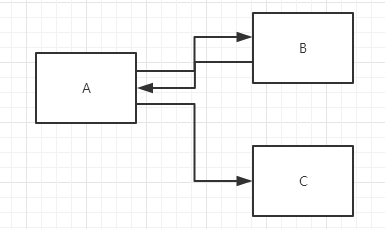

B一个web资源收到客户端A请求后，B他会通知A客户端去访问另外一个web资源C，这个过程叫重定向

常见场景：

- 用户登录

```java
void sendRedirect(String var1) throws IOException;
```

测试：

```java
@Override
protected void doGet(HttpServletRequest req, HttpServletResponse resp) throws ServletException, IOException {

    /*
        resp.setHeader("Location","/r/img");
        resp.setStatus(302);
         */
    resp.sendRedirect("/r/img");//重定向
}
```

面试题：请你聊聊重定向和转发的区别？

相同点

- 页面都会实现跳转

不同点

- 请求转发的时候，url不会产生变化
- 重定向时候，url地址栏会发生变化；

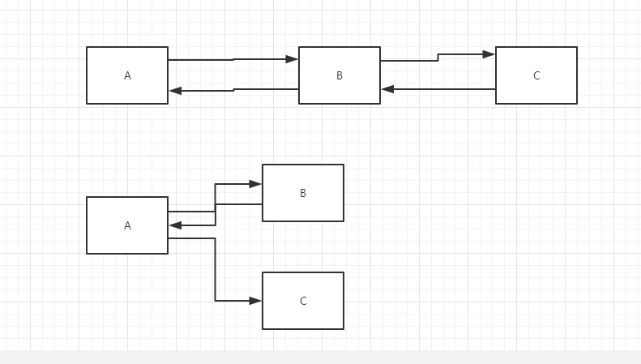

#### 5、简单实现登录重定向

```jsp
<%--这里提交的路径，需要寻找到项目的路径--%>
<%--${pageContext.request.contextPath}代表当前的项目--%>

<form action="${pageContext.request.contextPath}/login" method="get">
    用户名：<input type="text" name="username"> <br>
    密码：<input type="password" name="password"> <br>
    <input type="submit">
</form>

```

```JAVA
    @Override
    protected void doGet(HttpServletRequest req, HttpServletResponse resp) throws ServletException, IOException {
        //处理请求
        String username = req.getParameter("username");
        String password = req.getParameter("password");

        System.out.println(username+":"+password);

        //重定向时候一定要注意，路径问题，否则404；
        resp.sendRedirect("/r/success.jsp");
    }

```

```xml
  <servlet>
    <servlet-name>requset</servlet-name>
    <servlet-class>com.kuang.servlet.RequestTest</servlet-class>
  </servlet>
  <servlet-mapping>
    <servlet-name>requset</servlet-name>
    <url-pattern>/login</url-pattern>
  </servlet-mapping>
```

```jsp
<%@ page contentType="text/html;charset=UTF-8" language="java" %>
<html>
<head>
    <title>Title</title>
</head>
<body>

<h1>Success</h1>

</body>
</html>

```

### 6.7、HttpServletRequest

HttpServletRequest代表客户端的请求，用户通过Http协议访问服务器，HTTP请求中的所有信息会被封装到HttpServletRequest，通过这个HttpServletRequest的方法，获得客户端的所有信息；

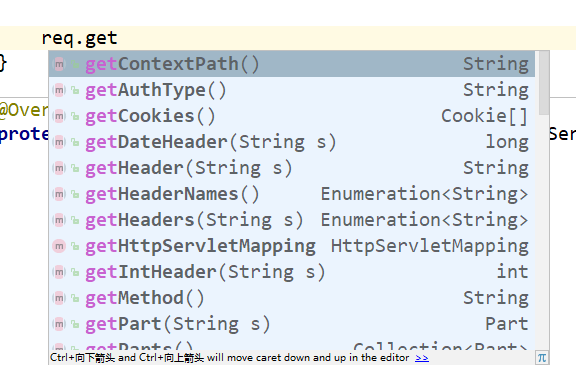

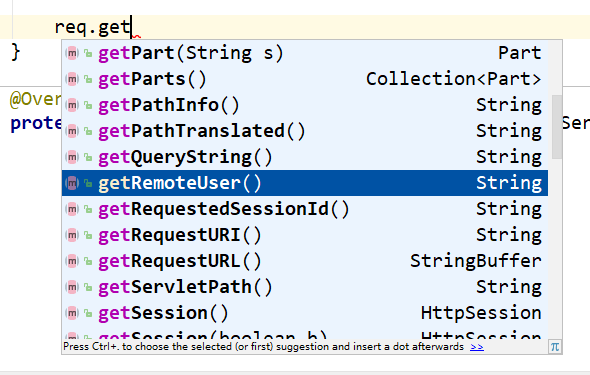

#### 获取参数，请求转发

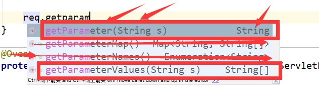

```java
@Override
protected void doGet(HttpServletRequest req, HttpServletResponse resp) throws ServletException, IOException {

    req.setCharacterEncoding("utf-8");
    resp.setCharacterEncoding("utf-8");

    String username = req.getParameter("username");
    String password = req.getParameter("password");
    String[] hobbys = req.getParameterValues("hobbys");
    System.out.println("=============================");
    //后台接收中文乱码问题
    System.out.println(username);
    System.out.println(password);
    System.out.println(Arrays.toString(hobbys));
    System.out.println("=============================");


    System.out.println(req.getContextPath());
    //通过请求转发
    //这里的 / 代表当前的web应用
    req.getRequestDispatcher("/success.jsp").forward(req,resp);

}
```

**面试题：请你聊聊重定向和转发的区别？**

相同点

- 页面都会实现跳转

不同点

- 请求转发的时候，url不会产生变化   307
- 重定向时候，url地址栏会发生变化； 302


## 7、Cookie、Session

### 7.1、会话

**会话**：用户打开一个浏览器，点击了很多超链接，访问多个web资源，关闭浏览器，这个过程可以称之为会话；

**有状态会话**：一个同学来过教室，下次再来教室，我们会知道这个同学，曾经来过，称之为有状态会话；

**你能怎么证明你是西开的学生？**

你              西开

1. 发票                西开给你发票
2. 学校登记        西开标记你来过了

**一个网站，怎么证明你来过？**

客户端              服务端

1. 服务端给客户端一个 信件，客户端下次访问服务端带上信件就可以了； cookie
2. 服务器登记你来过了，下次你来的时候我来匹配你； seesion


### 7.2、保存会话的两种技术

**cookie**

- 客户端技术   （响应，请求）

**session**

- 服务器技术，利用这个技术，可以保存用户的会话信息？ 我们可以把信息或者数据放在Session中！


常见常见：网站登录之后，你下次不用再登录了，第二次访问直接就上去了！

### 7.3、Cookie


1. 从请求中拿到cookie信息
2. 服务器响应给客户端cookie

```java
Cookie[] cookies = req.getCookies(); //获得Cookie
cookie.getName(); //获得cookie中的key
cookie.getValue(); //获得cookie中的vlaue
new Cookie("lastLoginTime", System.currentTimeMillis()+""); //新建一个cookie
cookie.setMaxAge(24*60*60); //设置cookie的有效期
resp.addCookie(cookie); //响应给客户端一个cookie
```

**cookie：一般会保存在本地的 用户目录下 appdata；**


一个网站cookie是否存在上限！**聊聊细节问题**

- 一个Cookie只能保存一个信息；
- 一个web站点可以给浏览器发送多个cookie，最多存放20个cookie；
- Cookie大小有限制4kb；
- 300个cookie浏览器上限


**删除Cookie；**

- 不设置有效期，关闭浏览器，自动失效；
- 设置有效期时间为 0 ；


**编码解码：**

```java
URLEncoder.encode("秦疆","utf-8")
URLDecoder.decode(cookie.getValue(),"UTF-8")
```


### 7.4、Session（重点）


什么是Session：

- 服务器会给每一个用户（浏览器）创建一个Seesion对象；
- 一个Seesion独占一个浏览器，只要浏览器没有关闭，这个Session就存在；
- 用户登录之后，整个网站它都可以访问！--> 保存用户的信息；保存购物车的信息…..

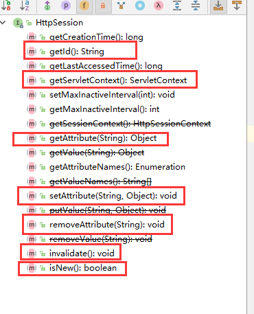

Session和cookie的区别：

- Cookie是把用户的数据写给用户的浏览器，浏览器保存 （可以保存多个）
- Session把用户的数据写到用户独占Session中，服务器端保存  （保存重要的信息，减少服务器资源的浪费）
- Session对象由服务创建；


使用场景：

- 保存一个登录用户的信息；
- 购物车信息；
- 在整个网站中经常会使用的数据，我们将它保存在Session中；


使用Session：

```java
package com.kuang.servlet;

import com.kuang.pojo.Person;

import javax.servlet.ServletException;
import javax.servlet.http.*;
import java.io.IOException;

public class SessionDemo01 extends HttpServlet {
    @Override
    protected void doGet(HttpServletRequest req, HttpServletResponse resp) throws ServletException, IOException {
        
        //解决乱码问题
        req.setCharacterEncoding("UTF-8");
        resp.setCharacterEncoding("UTF-8");
        resp.setContentType("text/html;charset=utf-8");
        
        //得到Session
        HttpSession session = req.getSession();
        //给Session中存东西
        session.setAttribute("name",new Person("秦疆",1));
        //获取Session的ID
        String sessionId = session.getId();

        //判断Session是不是新创建
        if (session.isNew()){
            resp.getWriter().write("session创建成功,ID:"+sessionId);
        }else {
            resp.getWriter().write("session以及在服务器中存在了,ID:"+sessionId);
        }

        //Session创建的时候做了什么事情；
//        Cookie cookie = new Cookie("JSESSIONID",sessionId);
//        resp.addCookie(cookie);

    }

    @Override
    protected void doPost(HttpServletRequest req, HttpServletResponse resp) throws ServletException, IOException {
        doGet(req, resp);
    }
}

//得到Session
HttpSession session = req.getSession();

Person person = (Person) session.getAttribute("name");

System.out.println(person.toString());

HttpSession session = req.getSession();
session.removeAttribute("name");
//手动注销Session
session.invalidate();
```


**会话自动过期：web.xml配置**

```xml
<!--设置Session默认的失效时间-->
<session-config>
    <!--15分钟后Session自动失效，以分钟为单位-->
    <session-timeout>15</session-timeout>
</session-config>
```

## 8、JSP

### 8.1、什么是JSP

Java Server Pages ： Java服务器端页面，也和Servlet一样，用于动态Web技术！

最大的特点：

- 写JSP就像在写HTML
- 区别：
  - HTML只给用户提供静态的数据
  - JSP页面中可以嵌入JAVA代码，为用户提供动态数据；


### 8.2、JSP原理

思路：JSP到底怎么执行的！

- 代码层面没有任何问题

- 服务器内部工作

  tomcat中有一个work目录；

  IDEA中使用Tomcat的会在IDEA的tomcat中生产一个work目录

  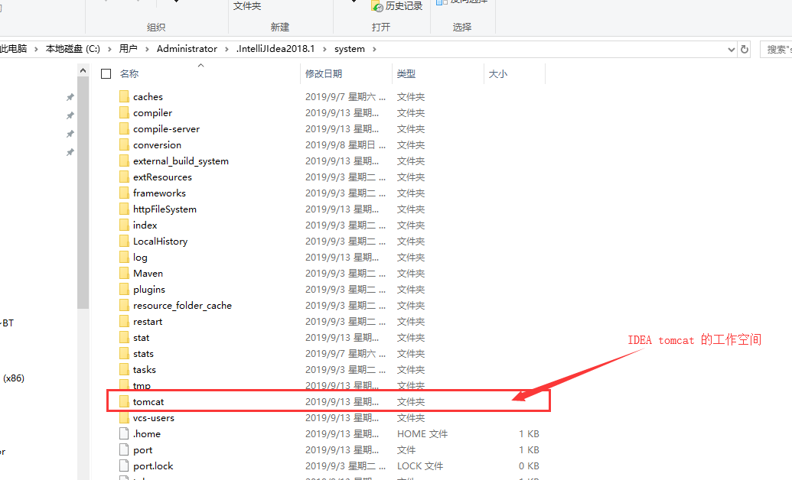

  我电脑的地址：

  ```java
  C:\Users\Administrator\.IntelliJIdea2018.1\system\tomcat\Unnamed_javaweb-session-cookie\work\Catalina\localhost\ROOT\org\apache\jsp
  ```

  发现页面转变成了Java程序！

  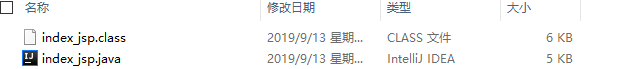


**浏览器向服务器发送请求，不管访问什么资源，其实都是在访问Servlet！**

JSP最终也会被转换成为一个Java类！

**JSP 本质上就是一个Servlet**

```java
//初始化
  public void _jspInit() {
      
  }
//销毁
  public void _jspDestroy() {
  }
//JSPService
  public void _jspService(.HttpServletRequest request,HttpServletResponse response)
      
```

1. 判断请求

2. 内置一些对象

   ```java
   final javax.servlet.jsp.PageContext pageContext;  //页面上下文
   javax.servlet.http.HttpSession session = null;    //session
   final javax.servlet.ServletContext application;   //applicationContext
   final javax.servlet.ServletConfig config;         //config
   javax.servlet.jsp.JspWriter out = null;           //out
   final java.lang.Object page = this;               //page：当前
   HttpServletRequest request                        //请求
   HttpServletResponse response                      //响应
   ```

3. 输出页面前增加的代码

   ```java
   response.setContentType("text/html");       //设置响应的页面类型
   pageContext = _jspxFactory.getPageContext(this, request, response,
                                             null, true, 8192, true);
   _jspx_page_context = pageContext;
   application = pageContext.getServletContext();
   config = pageContext.getServletConfig();
   session = pageContext.getSession();
   out = pageContext.getOut();
   _jspx_out = out;
   ```

4. 以上的这些个对象我们可以在JSP页面中直接使用！

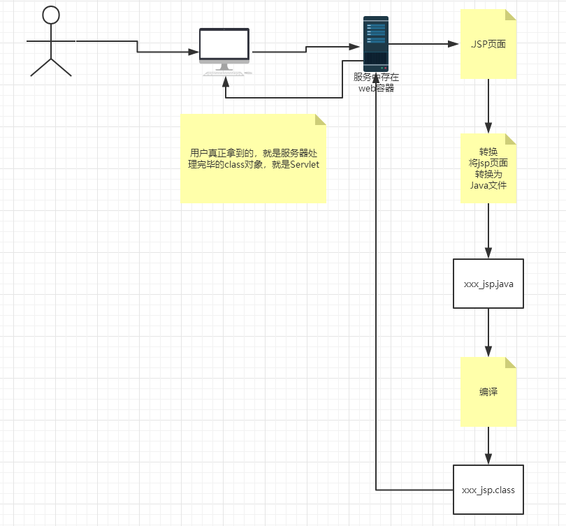


在JSP页面中；

只要是 JAVA代码就会原封不动的输出；

如果是HTML代码，就会被转换为：

```java
out.write("<html>\r\n");
```

这样的格式，输出到前端！


### 8.3、JSP基础语法

任何语言都有自己的语法，JAVA中有,。 JSP 作为java技术的一种应用，它拥有一些自己扩充的语法（了解，知道即可！），Java所有语法都支持！


#### **JSP表达式**

```jsp
  <%--JSP表达式
  作用：用来将程序的输出，输出到客户端
  <%= 变量或者表达式%>
  --%>
  <%= new java.util.Date()%>
```


#### **jsp脚本片段**

```jsp
  <%--jsp脚本片段--%>
  <%
    int sum = 0;
    for (int i = 1; i <=100 ; i++) {
      sum+=i;
    }
    out.println("<h1>Sum="+sum+"</h1>");
  %>

```


**脚本片段的再实现**

```jsp
  <%
    int x = 10;
    out.println(x);
  %>
  <p>这是一个JSP文档</p>
  <%
    int y = 2;
    out.println(y);
  %>

  <hr>


  <%--在代码嵌入HTML元素--%>
  <%
    for (int i = 0; i < 5; i++) {
  %>
    <h1>Hello,World  <%=i%> </h1>
  <%
    }
  %>
```


#### JSP声明

```jsp
  <%!
    static {
      System.out.println("Loading Servlet!");
    }

    private int globalVar = 0;

    public void kuang(){
      System.out.println("进入了方法Kuang！");
    }
  %>
```


JSP声明：会被编译到JSP生成Java的类中！其他的，就会被生成到_jspService方法中！

在JSP，嵌入Java代码即可！

```jsp
<%%>
<%=%>
<%!%>

<%--注释--%>
```

JSP的注释，不会在客户端显示，HTML就会！


### 8.4、JSP指令

```jsp
<%@page args.... %>
<%@include file=""%>

<%--@include会将两个页面合二为一--%>

<%@include file="common/header.jsp"%>
<h1>网页主体</h1>

<%@include file="common/footer.jsp"%>

<hr>


<%--jSP标签
    jsp:include：拼接页面，本质还是三个
    --%>
<jsp:include page="/common/header.jsp"/>
<h1>网页主体</h1>
<jsp:include page="/common/footer.jsp"/>

```


### 8.5、9大内置对象

- PageContext    存东西
- Request     存东西
- Response
- Session      存东西
- Application   【SerlvetContext】   存东西
- config    【SerlvetConfig】
- out
- page ，不用了解
- exception

```java
pageContext.setAttribute("name1","秦疆1号"); //保存的数据只在一个页面中有效
request.setAttribute("name2","秦疆2号"); //保存的数据只在一次请求中有效，请求转发会携带这个数据
session.setAttribute("name3","秦疆3号"); //保存的数据只在一次会话中有效，从打开浏览器到关闭浏览器
application.setAttribute("name4","秦疆4号");  //保存的数据只在服务器中有效，从打开服务器到关闭服务器
```

request：客户端向服务器发送请求，产生的数据，用户看完就没用了，比如：新闻，用户看完没用的！

session：客户端向服务器发送请求，产生的数据，用户用完一会还有用，比如：购物车；

application：客户端向服务器发送请求，产生的数据，一个用户用完了，其他用户还可能使用，比如：聊天数据；

### 8.6、JSP标签、JSTL标签、EL表达式

```xml
<!-- JSTL表达式的依赖 -->
<dependency>
    <groupId>javax.servlet.jsp.jstl</groupId>
    <artifactId>jstl-api</artifactId>
    <version>1.2</version>
</dependency>
<!-- standard标签库 -->
<dependency>
    <groupId>taglibs</groupId>
    <artifactId>standard</artifactId>
    <version>1.1.2</version>
</dependency>

```

EL表达式：  ${ }

- **获取数据**
- **执行运算**
- **获取web开发的常用对象**


**JSP标签**

```jsp
<%--jsp:include--%>

<%--
http://localhost:8080/jsptag.jsp?name=kuangshen&age=12
--%>

<jsp:forward page="/jsptag2.jsp">
    <jsp:param name="name" value="kuangshen"></jsp:param>
    <jsp:param name="age" value="12"></jsp:param>
</jsp:forward>
```


**JSTL表达式**

JSTL标签库的使用就是为了弥补HTML标签的不足；它自定义许多标签，可以供我们使用，标签的功能和Java代码一样！

**格式化标签**

**SQL标签**

**XML 标签**

**核心标签** （掌握部分）


**JSTL标签库使用步骤**

- 引入对应的 taglib
- 使用其中的方法
- **在Tomcat 也需要引入 jstl的包，否则会报错：JSTL解析错误**

c：if

```jsp
<head>
    <title>Title</title>
</head>
<body>


<h4>if测试</h4>

<hr>

<form action="coreif.jsp" method="get">
    <%--
    EL表达式获取表单中的数据
    ${param.参数名}
    --%>
    <input type="text" name="username" value="${param.username}">
    <input type="submit" value="登录">
</form>

<%--判断如果提交的用户名是管理员，则登录成功--%>
<c:if test="${param.username=='admin'}" var="isAdmin">
    <c:out value="管理员欢迎您！"/>
</c:if>

<%--自闭合标签--%>
<c:out value="${isAdmin}"/>

</body>
```

c:choose   c:when

```jsp
<body>

<%--定义一个变量score，值为85--%>
<c:set var="score" value="55"/>

<c:choose>
    <c:when test="${score>=90}">
        你的成绩为优秀
    </c:when>
    <c:when test="${score>=80}">
        你的成绩为一般
    </c:when>
    <c:when test="${score>=70}">
        你的成绩为良好
    </c:when>
    <c:when test="${score<=60}">
        你的成绩为不及格
    </c:when>
</c:choose>

</body>
```

c:forEach

```jsp
<%

    ArrayList<String> people = new ArrayList<>();
    people.add(0,"张三");
    people.add(1,"李四");
    people.add(2,"王五");
    people.add(3,"赵六");
    people.add(4,"田六");
    request.setAttribute("list",people);
%>


<%--
var , 每一次遍历出来的变量
items, 要遍历的对象
begin,   哪里开始
end,     到哪里
step,   步长
--%>
<c:forEach var="people" items="${list}">
    <c:out value="${people}"/> <br>
</c:forEach>

<hr>

<c:forEach var="people" items="${list}" begin="1" end="3" step="1" >
    <c:out value="${people}"/> <br>
</c:forEach>

```

## 9、JavaBean

实体类

JavaBean有特定的写法：

- 必须要有一个无参构造
- 属性必须私有化
- 必须有对应的get/set方法；

一般用来和数据库的字段做映射  ORM；

ORM ：对象关系映射

- 表--->类
- 字段-->属性
- 行记录---->对象

**people表**

| id   | name    | age  | address |
| ---- | ------- | ---- | ------- |
| 1    | 秦疆1号 | 3    | 西安    |
| 2    | 秦疆2号 | 18   | 西安    |
| 3    | 秦疆3号 | 100  | 西安    |

```java
class People{
    private int id;
    private String name;
    private int id;
    private String address;
}

class A{
    new People(1,"秦疆1号",3，"西安");
    new People(2,"秦疆2号",3，"西安");
    new People(3,"秦疆3号",3，"西安");
}
```


- 过滤器
- 文件上传
- 邮件发送
- JDBC 复习 ： 如何使用JDBC ,  JDBC crud， jdbc 事务


## 10、MVC三层架构

什么是MVC：  Model     view     Controller  模型、视图、控制器

### 10.1、早些年

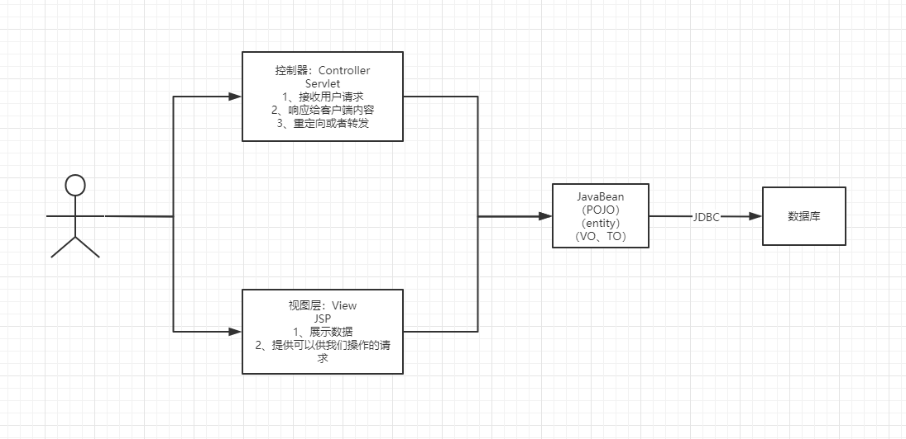

用户直接访问控制层，控制层可以直接操作数据库

Servlet --> CRUD --> 数据库 

Servlet的代码中：处理请求、响应、视图跳转、处理JDBC、处理业务代码、处理逻辑代码

弊端：程序十分臃肿，不利于维护

架构：没有什么是加一层解决不了的，如果不能就在家一层

如：JDBC --> Mysql Oracle Sqlserver 


Model

- 业务处理：业务逻辑(Service)
- 数据持久层：CRUD(Dao)

View

- 展示数据
- 提供链接发起Servlet请求(a,form,img...)

Contorller（Servlet）

- 接收用户的请求：（req：请求参数、Session信息...）

- 交给业务层数据对应的代码

- 控制视图的跳转

  登录 --> 接收用户的登录请求 -->  处理用户的请求(获取用户登录的参数，username，password) --> 交给业务层处理登录业务(判断用户名密码是否正确：事务) --> Dao层查询用户名和密码是否正确 --> 数据库

## 11、Filter(重点)

Filter：过滤器，用来过滤网站的数据

- 处理中文乱码
- 登录验证

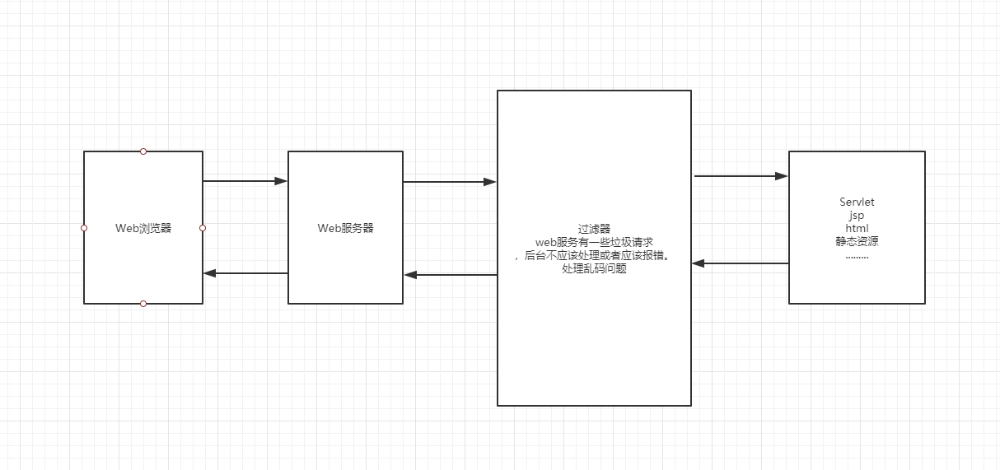

1. 导包：import javax.servlet.Filter;

2. 编写过滤器

   ```java
   package com.shary.filter;
   
   import javax.servlet.*;
   import java.io.IOException;
   
   public class CharacterEncodingFilter implements Filter {
       //初始化：服务器启动的时候，就已经初始化了，随时等待过滤对象出现
       public void init(FilterConfig filterConfig) throws ServletException {
           System.out.println("CharacterEncodingFilter初始化");
       }
       /**
        * 1.过滤所有代码，在过滤特定请求的时候都会执行
        * 2、必须让过滤器继续通行
        * filterChain.doFilter(servletRequest,servletResponse)
        */
       public void doFilter(ServletRequest servletRequest, ServletResponse servletResponse, FilterChain filterChain) throws IOException, ServletException {
           servletRequest.setCharacterEncoding("utf-8");
           servletResponse.setCharacterEncoding("utf-8");
           servletResponse.setContentType("text/html;charset=UTF-8");
           System.out.println("执行前");
           filterChain.doFilter(servletRequest,servletResponse);//转交作用，如果不写程序到这里就会被拦截
           System.out.println("执行后");
       }
       //销毁:web服务器关闭的时候，过滤器会销毁
       public void destroy() {
           System.out.println("CharacterEncodingFilter销毁");
       }
   }
   ```

3. 配置web.xml

```xml
<filter>
    <filter-name>CharacterEncodingFilter</filter-name>
    <filter-class>com.shary.filter.CharacterEncodingFilter</filter-class>
</filter>
<filter-mapping>
    <filter-name>CharacterEncodingFilter</filter-name>
    <!--只要是Servlet请求，都会经过这个过滤器-->
    <url-pattern>/servlet/*</url-pattern>
</filter-mapping>
```

## 12、监听器

实现一个监听器的接口；（有N种）

1. 编写一个监听器

   实现监听器的接口…

   ```java
   //统计网站在线人数 ： 统计session
   public class OnlineCountListener implements HttpSessionListener {
   
       //创建session监听： 看你的一举一动
       //一旦创建Session就会触发一次这个事件！
       public void sessionCreated(HttpSessionEvent se) {
           ServletContext ctx = se.getSession().getServletContext();
   
           System.out.println(se.getSession().getId());
   
           Integer onlineCount = (Integer) ctx.getAttribute("OnlineCount");
   
           if (onlineCount==null){
               onlineCount = new Integer(1);
           }else {
               int count = onlineCount.intValue();
               onlineCount = new Integer(count+1);
           }
   
           ctx.setAttribute("OnlineCount",onlineCount);
   
       }
   
       //销毁session监听
       //一旦销毁Session就会触发一次这个事件！
       public void sessionDestroyed(HttpSessionEvent se) {
           ServletContext ctx = se.getSession().getServletContext();
   
           Integer onlineCount = (Integer) ctx.getAttribute("OnlineCount");
   
           if (onlineCount==null){
               onlineCount = new Integer(0);
           }else {
               int count = onlineCount.intValue();
               onlineCount = new Integer(count-1);
           }
   
           ctx.setAttribute("OnlineCount",onlineCount);
   
       }
   
   
       /*
       Session销毁：
       1. 手动销毁  getSession().invalidate();
       2. 自动销毁
        */
   }
   
   ```

2. web.xml中注册监听器

   ```xml
   <!--注册监听器-->
   <listener>
       <listener-class>com.kuang.listener.OnlineCountListener</listener-class>
   </listener>
   ```

3. 看情况是否使用！

## 13、过滤器、监听器常见应用

**监听器：GUI编程中经常使用；**

```java
public class TestPanel {
    public static void main(String[] args) {
        Frame frame = new Frame("中秋节快乐");  //新建一个窗体
        Panel panel = new Panel(null); //面板
        frame.setLayout(null); //设置窗体的布局

        frame.setBounds(300,300,500,500);
        frame.setBackground(new Color(0,0,255)); //设置背景颜色

        panel.setBounds(50,50,300,300);
        panel.setBackground(new Color(0,255,0)); //设置背景颜色

        frame.add(panel);

        frame.setVisible(true);

        //监听事件，监听关闭事件
        frame.addWindowListener(new WindowAdapter() {
            @Override
            public void windowClosing(WindowEvent e) {
                super.windowClosing(e);
            }
        });


    }
}
```


用户登录之后才能进入主页！用户注销后就不能进入主页了！

1. 用户登录之后，向Sesison中放入用户的数据

2. 进入主页的时候要判断用户是否已经登录；要求：在过滤器中实现！

   ```java
   HttpServletRequest request = (HttpServletRequest) req;
   HttpServletResponse response = (HttpServletResponse) resp;
   
   if (request.getSession().getAttribute(Constant.USER_SESSION)==null){
       response.sendRedirect("/error.jsp");
   }
   
   chain.doFilter(request,response);
   ```

