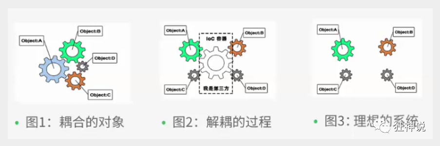

# Spring

## 1、spring简介

pring : 春天 --->给软件行业带来了春天

2002年，Rod Jahnson首次推出了Spring框架雏形interface21框架。

2004年3月24日，Spring框架以interface21框架为基础，经过重新设计，发布了1.0正式版。

很难想象Rod Johnson的学历 , 他是悉尼大学的博士，然而他的专业不是计算机，而是音乐学。

Spring理念 : 使现有技术更加实用 . 本身就是一个大杂烩 , 整合现有的框架技术

官网 : http://spring.io/

官方下载地址 : https://repo.spring.io/libs-release-local/org/springframework/spring/

GitHub : https://github.com/spring-projects

```xml
<!-- https://mvnrepository.com/artifact/org.springframework/spring-webmvc -->
<dependency>
    <groupId>org.springframework</groupId>
    <artifactId>spring-webmvc</artifactId>
    <version>5.2.6.RELEASE</version>
</dependency>
<!-- https://mvnrepository.com/artifact/org.springframework/spring-jdbc -->
<dependency>
    <groupId>org.springframework</groupId>
    <artifactId>spring-jdbc</artifactId>
    <version>5.2.6.RELEASE</version>
</dependency>
```

### 1.1、Spring优点

- Spring是一个开源的免费框架（容器）
- Spring是一个轻量级的、非入侵式的框架
- 控制反转（IOC）,面向切面编程（AOP）
- 支持事务的处理，对框架整合的支持

总结一句话：Spring就是一个轻量级的控制反转(IOC)和面向切面编程{AOP}的框架

弊端：发展了太久之后，违背了原来的理念，配置十分繁琐，人称配置地狱

### 1.2、组成


### 1.3、拓展

**Spring Boot与Spring Cloud**

- Spring Boot 是 Spring 的一套快速配置脚手架，可以基于Spring Boot 快速开发单个微服务;
- Spring Cloud是基于Spring Boot实现的；
- Spring Boot专注于快速、方便集成的单个微服务个体，Spring Cloud关注全局的服务治理框架；
- Spring Boot使用了约束优于配置的理念，很多集成方案已经帮你选择好了，能不配置就不配置 , Spring Cloud很大的一部分是基于Spring Boot来实现，Spring Boot可以离开Spring Cloud独立使用开发项目，但是Spring Cloud离不开Spring Boot，属于依赖的关系。
- SpringBoot在SpringClound中起到了承上启下的作用，如果你要学习SpringCloud必须要学习SpringBoot。


## 2、IOC理论推导

新建一个空白的maven项目

### 2.1、分析实现

我们先用我们原来的方式写一段代码 .

1、先写一个UserDao接口

```
public interface UserDao {
   public void getUser();
}
```

2、再去写Dao的实现类

```
public class UserDaoImpl implements UserDao {
   @Override
   public void getUser() {
       System.out.println("获取用户数据");
  }
}
```

3、然后去写UserService的接口

```
public interface UserService {
   public void getUser();
}
```

4、最后写Service的实现类

```
public class UserServiceImpl implements UserService {
   private UserDao userDao = new UserDaoImpl();

   @Override
   public void getUser() {
       userDao.getUser();
  }
}
```

5、测试一下

```
@Test
public void test(){
   UserService service = new UserServiceImpl();
   service.getUser();
}
```

这是我们原来的方式 , 开始大家也都是这么去写的对吧 . 那我们现在修改一下 .

把Userdao的实现类增加一个 .

```
public class UserDaoMySqlImpl implements UserDao {
   @Override
   public void getUser() {
       System.out.println("MySql获取用户数据");
  }
}
```

紧接着我们要去使用MySql的话 , 我们就需要去service实现类里面修改对应的实现

```
public class UserServiceImpl implements UserService {
   private UserDao userDao = new UserDaoMySqlImpl();

   @Override
   public void getUser() {
       userDao.getUser();
  }
}
```

在假设, 我们再增加一个Userdao的实现类 .

```
public class UserDaoOracleImpl implements UserDao {
   @Override
   public void getUser() {
       System.out.println("Oracle获取用户数据");
  }
}
```

那么我们要使用Oracle , 又需要去service实现类里面修改对应的实现 . 假设我们的这种需求非常大 , 这种方式就根本不适用了, 甚至反人类对吧 , 每次变动 , 都需要修改大量代码 . 这种设计的耦合性太高了, 牵一发而动全身 .

**那我们如何去解决呢 ?** 

我们可以在需要用到他的地方 , 不去实现它 , 而是留出一个接口 , 利用set , 我们去代码里修改下 .

```
public class UserServiceImpl implements UserService {
   private UserDao userDao;
// 利用set实现
   public void setUserDao(UserDao userDao) {
       this.userDao = userDao;
  }

   @Override
   public void getUser() {
       userDao.getUser();
  }
}
```

现在去我们的测试类里 , 进行测试 ;

```
@Test
public void test(){
   UserServiceImpl service = new UserServiceImpl();
   service.setUserDao( new UserDaoMySqlImpl() );
   service.getUser();
   //那我们现在又想用Oracle去实现呢
   service.setUserDao( new UserDaoOracleImpl() );
   service.getUser();
}
```

大家发现了区别没有 ? 可能很多人说没啥区别 . 但是同学们 , 他们已经发生了根本性的变化 , 很多地方都不一样了 . 仔细去思考一下 , 以前所有东西都是由程序去进行控制创建 , 而现在是由我们自行控制创建对象 , 把主动权交给了调用者 . 程序不用去管怎么创建,怎么实现了 . 它只负责提供一个接口 .

这种思想 , 从本质上解决了问题 , 我们程序员不再去管理对象的创建了 , 更多的去关注业务的实现 . 耦合性大大降低 . 这也就是IOC的原型 !


### 2.2、IOC本质

**控制反转IoC(Inversion of Control)，是一种设计思想，DI(依赖注入)是实现IoC的一种方法**，也有人认为DI只是IoC的另一种说法。没有IoC的程序中 , 我们使用面向对象编程 , 对象的创建与对象间的依赖关系完全硬编码在程序中，对象的创建由程序自己控制，控制反转后将对象的创建转移给第三方，个人认为所谓控制反转就是：获得依赖对象的方式反转了。




**IoC是Spring框架的核心内容**，使用多种方式完美的实现了IoC，可以使用XML配置，也可以使用注解，新版本的Spring也可以零配置实现IoC。

Spring容器在初始化时先读取配置文件，根据配置文件或元数据创建与组织对象存入容器中，程序使用时再从Ioc容器中取出需要的对象。


采用XML方式配置Bean的时候，Bean的定义信息是和实现分离的，而采用注解的方式可以把两者合为一体，Bean的定义信息直接以注解的形式定义在实现类中，从而达到了零配置的目的。

**控制反转是一种通过描述（XML或注解）并通过第三方去生产或获取特定对象的方式。在Spring中实现控制反转的是IoC容器，其实现方法是依赖注入（Dependency Injection,DI）。**

## 3、HelloSpring 

### 3.1、导入jar包

注 : spring 需要导入commons-logging进行日志记录 . 我们利用maven , 他会自动下载对应的依赖项 .

```xml
<dependency>
    <groupId>org.springframework</groupId>
    <artifactId>spring-webmvc</artifactId>
    <version>5.2.6.RELEASE</version>
</dependency>
```

### 3.2、编写代码

1. 编写一个实体类

   ```java
   public class Hello {
       private String str;
   
       @Override
       public String toString() {
           return "Hello{" +
                   "str='" + str + '\'' +
                   '}';
       }
   
       public String getStr() {
           return str;
       }
   
       public void setStr(String str) {
           this.str = str;
       }
   }
   ```

2. 编写Spring文件，可以随意命名，这里我们命名为beans.xml

   ```xml
   <?xml version="1.0" encoding="UTF-8"?>
   <beans xmlns="http://www.springframework.org/schema/beans"
          xmlns:xsi="http://www.w3.org/2001/XMLSchema-instance"
          xsi:schemaLocation="http://www.springframework.org/schema/beans
           https://www.springframework.org/schema/beans/spring-beans.xsd">
       <!-- 使用spring来创建对象，在spring这些都称为been
       类型名 变量名 = new 类型名();
       Hello hello = new Hello();
   
       id = 变量名
       class = new的对象
       property = 相当于给对象中的属性设置一个值
       -->
       <bean id="hello" class="com.shary.pojo.Hello">
           <property name="str" value="Spring"/>
       </bean>
   </beans>
   ```

3. 测试，通过spring来获取对象

   ```java
   public class MyTest {
       public static void main(String[] args) {
           //获取Spring上下文对象
           ApplicationContext context = new ClassPathXmlApplicationContext("beans.xml");
           Hello hello = (Hello) context.getBean("hello");//如果此处类不对会提示ClassCastException异常
           System.out.println(hello);
       }
   }
   ```

### 3.3、思考

- Hello对象是谁创建的？

  Hello对象是Spring创建的

- Hello对象的属性是怎么设置的

  Hello对象的属性是由Spring容器设置的

**这个过程就叫做控制反转**

- 谁来控制对象的创建，传统应用程序的对象是由程序本身控制创建的，

  使用Spring后，对象是由Spring来创建的

- 反转：程序本身不创建对象，而被动的接收对象

依赖注入就是通过set来注入的

IOC是一种编程思想，由主动的编程变成被动的接收

可以通过new ClassPathXmlApplicationContext去浏览底层源码

### 3.3、修改2.1中的案例

1. 增加一个bean文件

```xml
<?xml version="1.0" encoding="UTF-8"?>
<beans xmlns="http://www.springframework.org/schema/beans"
       xmlns:xsi="http://www.w3.org/2001/XMLSchema-instance"
       xsi:schemaLocation="http://www.springframework.org/schema/beans
        https://www.springframework.org/schema/beans/spring-beans.xsd">

    <bean id="MysqlImpl" class="com.shary.dao.UserDaoMysqlImple"/>
    <bean id="OracleImpl" class="com.shary.dao.UserDaoOracleImpl"/>
    <bean id="UserDaoImpl" class="com.shary.dao.UserDaoImpl"/>

    <bean id="UserServiceImpl" class="com.shary.service.UserServiceImpl">
        <!--
        ref：引用Spring容器中已经创建好的对象
        value：具体的值，基本数据类型
        -->
        <property name="userDao" ref="UserDaoImpl"/>

    </bean>
</beans>
```

2. 测试

   ```java
   public class MyTest {
       public static void main(String[] args) {
           //获取ApplicationContext:拿到Spring容器
           ApplicationContext context = new ClassPathXmlApplicationContext("beans.xml");
   //        UserDaoMysqlImple mysqlImpl = (UserDaoMysqlImple) context.getBean("MysqlImpl");
           UserServiceImpl userServiceImpl = (UserServiceImpl) context.getBean("UserServiceImpl");
           userServiceImpl.getUser();
       }
   }
   ```

   到现在，我们彻底不用在程序中去改动了，要实现不同的操作，只要在xml配置文件中进行修改，所谓IOC，一句话搞定：由Spring进行创建，管理，装配

## 4、IOC创建对象的方式

1. 使用无参构造创建对象，默认

2. 使用有参构造创建对象

   ```java
   public User(String name){
       this.name = name;
   }
   ```

   

   1. 下标赋值

      ```xml
      <!--下标赋值-->
      <bean id="user" class="com.shary.pojo.User">
          <constructor-arg index="0" value="Shary学Java"/>
      </bean>
      ```

   2. 通过类型赋值，不建议使用，因为多个相同类型会混乱

      ```xml
      <bean id="user" class="com.shary.pojo.User">
          <constructor-arg type="java.lang.String" value="Shary"/>
      </bean>
      ```

   3. 直接通过参数名赋值

      ```xml
      <bean id="user" class="com.shary.pojo.User">
          <constructor-arg name="name" value="Shary1223"/>
      </bean>
      ```

   总结：在配置文件加载的时候，容器中管理的对象就已经初始化了

   ```java
   ApplicationContext context = new ClassPathXmlApplicationContext("beans.xml");
   ```

## 5、Spring配置

### 5.1、别名

如果添加了别名，我们也可以使用别名获取到这个对象

```xml
<alias name="user" alias="regtsth"/>
```

### 5.2、Bean的配置

- id：bean的唯一标识符，相当于对象名
- class：bean对象所对应的全限定名：包名 + 类型
- name：也是别名（可以用空格，逗号，分号分割）
- depengs-on：暂定当前bean实例化，优先实例化设置的bean

```xml
<bean id="userT" class="com.shary.pojo.UserT" name="userT2,userT3 userT4;userT5"/>
```

### 5.3、Import

一般用于团队开发使用，他可以将多个配置文件，导入合并为一个

假设，现在项目中有多个人开发，这三个人赋值不同的类开发，不同的类需要注册在不同的bean中，我们可以利用import将所有人的beans.xml合并为一个总的

- 张三
- 李四
- 王五
- applicationContext.xml

```xml
<import resource="beans.xml"/>
<import resource="beans2.xml"/>
<import resource="beans3.xml"/>
```

使用的时候，直接使用总的配置就可以了

## 6、依赖注入

### 6.1、构造器注入


### 6.2、==Set方式注入【重点】==

- 依赖注入：Set注入
  - 依赖：bean对象的创建依赖于容器
  - 注入：bean对象中的所有属性，由容器来注入

【环境搭建】

1. 复杂类型

   ```java
   public class Address {
       private String address;
       //Get Set toString方法 
   }
   ```

2. 真实测试对象

   ```java
   public class Student {
       private String name;
       private int age;
       private Address address;
       private String[] book;
       private List<String> hobbeys;
       private Map<String,String> card;
       private Set<String> games;
       private String wife;
       private Properties info;
       //Get Set toString方法
   }
   ```

3. beans.xml

   ```xml
   <?xml version="1.0" encoding="UTF-8"?>
   <beans xmlns="http://www.springframework.org/schema/beans"
          xmlns:xsi="http://www.w3.org/2001/XMLSchema-instance"
          xsi:schemaLocation="http://www.springframework.org/schema/beans
           https://www.springframework.org/schema/beans/spring-beans.xsd">
       <bean id="address" class="com.shary.pojo.Address">
           <property name="address" value="沈阳"/>
       </bean>
       <bean id="student" class="com.shary.pojo.Student">
   		<!--普通值注入-->
           <property name="name" value="Shary"/>
   
           <property name="age" value="10"/>
   		<!--Bean注入 ref-->
           <property name="address" ref="address"/>
   		<!--数组注入-->
           <property name="book">
               <array>
                   <value>红楼梦</value>
                   <value>西游记</value>
                   <value>三国演义</value>
                   <value>水浒传</value>
               </array>
           </property>
   		<!--List-->
           <property name="hobbeys">
               <list>
                   <value>听歌</value>
                   <value>敲代码</value>
                   <value>看电影</value>
               </list>
           </property>
   		<!--map注入-->
           <property name="card">
               <map>
                   <entry key="身份证" value="456753463453"/>
                   <entry key="银行卡" value="3453454235"/>
               </map>
           </property>
   		<!--set注入-->
           <property name="games">
               <set>
                   <value>LOL</value>
                   <value>COC</value>
                   <value>BOB</value>
               </set>
           </property>
   		<!--null值注入-->
           <property name="wife">
               <null/>
           </property>
   		<!--properties注入-->
           <property name="info">
               <props>
                   <prop key="学号">20190527</prop>
                   <prop key="性别">男</prop>
               </props>
           </property>
       </bean>
   </beans>
   ```

4. 测试类

   ```java
   public class MyTest {
       public static void main(String[] args) {
           ApplicationContext context = new ClassPathXmlApplicationContext("beans.xml");
           Student student = (Student) context.getBean("student");
           System.out.println(student);
       }
   }
   ```

### 6.3、拓展方式注入

我们可以使用p命名空间和c命名空间进行注入

官方解释


使用

```xml
<?xml version="1.0" encoding="UTF-8"?>
<beans xmlns="http://www.springframework.org/schema/beans"
       xmlns:xsi="http://www.w3.org/2001/XMLSchema-instance"
       xmlns:p="http://www.springframework.org/schema/p"
       xmlns:c="http://www.springframework.org/schema/c"
       xsi:schemaLocation="http://www.springframework.org/schema/beans
        https://www.springframework.org/schema/beans/spring-beans.xsd">

    <!--p命名空间注入，可以直接注入属性的值：property-->
    <bean id="user" class="com.shary.pojo.User" p:name="Shary" p:age="12"/>

    <!--c命名空间注入，通过构造器注入：construct-args-->
    <bean id="user2" class="com.shary.pojo.User" c:name="William" c:age="34"/>
</beans>
```

测试

````java
    @Test
    public void test(){
        ApplicationContext context = new ClassPathXmlApplicationContext("userbeans.xml");
        User user = context.getBean("user2",User.class);
        System.out.println(user);
    }
````

注意点：p命名和c命名不能直接使用，需要导入xml约束

```
       xmlns:p="http://www.springframework.org/schema/p"
       xmlns:c="http://www.springframework.org/schema/c"
```

### 6.4、bean的作用域


1. 单例模式（Spring默认机制）

   ```xml
   <bean id="user2" class="com.shary.pojo.User" scope="singleton">
       <property name="name" value="William"/>
   </bean>
   ```

2. 原型模式：每次从容器中get的时候，都会产生一个新对象

   ```xml
   <bean id="user2" class="com.shary.pojo.User" scope="prototype">
       <property name="name" value="William"/>
   </bean>
   ```

3. 其余的request、session、application、websocket这些只能在web开发中使用到

## 7、Bean的自动装配

- 自动装配是Spring满足bean依赖一种方式
- Spring会在上下文中自动寻找，并自动给bean装配属性

在Spring中有三种装配方式

1. 在xml中显式的配置
2. 在java中显式的配置
3. ==隐式的自动装配【重点】==

### 7.1、测试

1. 环境搭建：一个人有两个宠物

### 7.2、byName自动装配

````xml
<!--
        byName：会自动在容器上下文中查找，和自己对象set方法后面的值对应的beanid~
-->
    <bean id="person" class="com.shary.pojo.Person" autowire="byName">
        <property name="name" value="苏茶"/>
    </bean>
````

### 7.3、byType自动装配

```xml
    <!--
        byType：会自动在容器上下文中查找，和自己对象属性相同的bean~
    -->
    <bean id="person" class="com.shary.pojo.Person" autowire="byType">
        <property name="name" value="苏茶"/>
    </bean>
```

小结：

- byName的时候，需要保证所有bean的id唯一，并且这个bean需要和自动注入的属性的set方法的值一致
- byType的时候，需要保证所有bean的class唯一，并且这个bean需要和自动注入的属类型一致

### 7.4、使用注解实现自动装配

jdk1.5支持的注解，spring2.5支持注解

The introduction of annotation-based configuration raised the question of whether this approach is “better” than XML.

要使用注解须知：

1. 导入约束：context约束

2. ==配置注释的支持\<context:annotation-config/\>【重点】==

   ```xml
   <?xml version="1.0" encoding="UTF-8"?>
   <beans xmlns="http://www.springframework.org/schema/beans"
       xmlns:xsi="http://www.w3.org/2001/XMLSchema-instance"
       xmlns:context="http://www.springframework.org/schema/context"
       xsi:schemaLocation="http://www.springframework.org/schema/beans
           https://www.springframework.org/schema/beans/spring-beans.xsd
           http://www.springframework.org/schema/context
           https://www.springframework.org/schema/context/spring-context.xsd">
   
       <context:annotation-config/>
   
   </beans>
   ```

#### @Autowired

直接在属性上使用即可！也可以在set方法上使用

使用Autowired我们可以不用编写set方法了，前提是你这个自动装配的属性在IOC（Spring）容器中存在，且符合byname

科普

```java
@Nullable
```

```java
public @interface Autowired {
    boolean required() default true;
}
```

测试代码

```java
public class Person {
    @Autowired(required = false)
    private Dog dog;
    @Autowired
    @Nullable
    private Cat cat;
    private String name;
```

如果@Autowired自动装配的环境比较复杂，自动装配无法通过一个注解【@Autowired】完成的时候，我们可以使用@Qualifier(value="xxx")去配置@Autowired的使用，指定一个唯一的bean对象注入

```java
public class Person {
    @Autowired
    @Qualifier(value = "dog222")
    private Dog dog;
    @Autowired
    @Qualifier(value = "cat222")
    private Cat cat;
    private String name;
} 
```

@Resource

```java
public class Person {
    @Resource(name = "dog22")
    private Dog dog;
    @Resource()
    private Cat cat;
    private String name;
}
```

小结

@Resource和Autowired的区别

- 都是用来自动装配的，都可以放在属性字段上

- @Autowired通过byType的方式实现，而且必须要求这个对象存在

- @Resource默认通过byName的方式实现，如果找不到名字，则通过byType实现，如果两个都找不到就会报错【常用，但是jdk11已将该注解移除，需通过maven导入】

  ```xml
  <dependency>
      <groupId>javax.annotation</groupId>
      <artifactId>javax.annotation-api</artifactId>
      <version>1.3.2</version>
  </dependency>
  ```

- 执行顺序不同：@Autowired通过byType通过byType的方式实现

## 8、使用注解开发

在Spring4之后，要使用注解开发，必须要保证aop的包导入了

使用注解开发需要导入context约束，增加注解的支持

```xml
<?xml version="1.0" encoding="UTF-8"?>
<beans xmlns="http://www.springframework.org/schema/beans"
       xmlns:context="http://www.springframework.org/schema/context"
       xmlns:xsi="http://www.w3.org/2001/XMLSchema-instance"
       xsi:schemaLocation="http://www.springframework.org/schema/beans
        https://www.springframework.org/schema/beans/spring-beans.xsd
        http://www.springframework.org/schema/context
        https://www.springframework.org/schema/beans/spring-context.xsd">
    <!--指定要扫描的包，这个包下的注解就会生效-->
    <context:component-scan base-package="com.shary.pojo"/>
    <context:annotation-config/>
</beans>
```

1. bean

2. 属性如何注入

   - @Component：相当于bean注入，id为类名首字母小写

     ```xml
     <bean id="user" class="com.shary.pojo.User"/>
     ```

   - @Value("半盏")：相当于property，但是不需要set方法

     ```xml
     <property name="name" value="半盏"/>
     ```

   
```java
   @Component
   public class User {
       @Value("半盏")
       private String name;
   }
```


3. 衍生的注解

   @Componet有几个衍生注解，我们在web开发中，会按照mvn三层架构分层

   - dao：@Repository

   - service：@Service

   - controller：@Controller

     这四个注解功能一致，都是代表将某个类注册到Spring中，装配Bean

4. 自动装配

   @Autowired：自动装配通过类型，名字

   - 如果Autowired不能唯一自动装配上属性，则需要通过@Qualifier(value="xxx")

   @Nullable：字段标记了这个注解，说明这个字段可以为null

   @Resource：自动装配通过名字，类型

5. 作用域

   request, session,application,websocket,singleton,prototype

   ```java

   @Scope("prototype")
   public class User {
       private String name;
   }
   ```

6. 小结

xml与注解：

- xml更加万能，适用于任何场合！维护简单方便
- 注解不是自己的类使用不了，维护相对复杂
- 如果注解和xml同时实现，会优先使用xml

xml与注解最佳实践：

- xml用来管理bean；
- 注解只负责完成属性的注入
- 我们在使用的过程中，只需要注意一个问题：必须让注解生效，就需要开启注解的支持

## 9、使用Java的方式配置Spring

Spring最新特性

我们现在要完全不使用Spring的xml配置了，全权交给Java来做

JavaConfig是Spring的一个子项目，在Spring4之后，它成为了一个核心功能


实体类

```java
@Component
public class User {

    @Value("苏茶")
    private String name;
}
```

配置类

```java
//这个也会被Spring容器托管，注册到容器中，因为它本来就是一个@Component，
//@Configuration代表这是一个配置类，就和我们之前看的beans.xml一样
@Configuration
@ComponentScan("com.shary.pojo")
@Import(MyConfig2.class)
public class MyConfig {

    //注册一个bean，就相当于我们之前写的一个bean标签
    //这个方法的名字，就相当于bean标签中的id属性
    //这个方法的返回值，就相当于bean标签中的class属性
    @Bean
    public User user(){
        return new User();//就是返回要注入到bean的对象
    }
}
```

测试类

```java
public class MyTest {
    @Test
    public void test(){
        //如果完全使用了配置类方式去做，我们就只能通过AnnotationConfig上下文来获取容器，通过配置类的class对象加载
        ApplicationContext context = new AnnotationConfigApplicationContext(MyConfig.class);
        User user = context.getBean("user", User.class);
        System.out.println(user);
    }
}
```

这种纯Java的配置方式，在SpringBoot中随处可见

## 10、代理模式

为什么要学习代理模式？因为这就是SpringAOP的底层


代理模式的分类

### 10.1、静态代理

角色分析：

- 抽象角色：一般会使用接口或者抽象类来解决
- 真实角色：被代理的角色
- 代理角色：代理真实角色，代理真实角色后，我们一般会做一些附属操作
- 客户：访问代理对象的人

代码步骤：

1. 接口

   ```java
   public interface Rent {
       public void rent();
   }
   ```

2. 真实角色

   ```java
       @Override
       public void rent() {
           System.out.println("房东要出租房子");
       }
   ```

   

3. 代理角色

   ```java
   public class Proxy implements Rent{
       private Host host;
   
       public Proxy() {
       }
   
       public Proxy(Host host) {
           this.host = host;
       }
   
   
       @Override
       public void rent() {
           host.rent();
           seeHouse();
           contract();
           fee();
       }
   
       public void seeHouse(){
           System.out.println("中介带你看房子");
       }
       public void contract(){
           System.out.println("签合同");
       }
       public void fee(){
           System.out.println("收中介费 ");
       }
   }
   ```

4. 客户端访问代理角色

   ```java
   public class Client {
       public static void main(String[] args) {
           Rent rent = new Proxy(new Host());
           rent.rent();
       }
   }
   ```


代理模式的好处：

- 可以使真实角色的操作更加纯粹，不用去关注公共的业务
- 公共的业务交给代理角色，实现了业务的分工
- 公共业务发生扩展的时候，方便集中管理

缺点：

- 一个真实角色就会产生一个代理角色，代码量会翻倍-开发效率会变低

### 10.2、Aop功能理解


### 10.3、动态代理

- 动态代理和静态代理角色一样
- 动态代理的代理类是动态生成的，不是我们直接写好的
- 动态代理分为两大类
  - 基于接口的动态代理：JDK动态代理
  - 基于类的动态代理：cglib
  - java字节码实现：javasist

需要了解两个类：Proxy：代理，InvocationHandler：调用处理程序

动态代理模式的好处：

- 可以使真实角色的操作更加纯粹，不用去关注公共的业务
- 公共的业务交给代理角色，实现了业务的分工
- 公共业务发生扩展的时候，方便集中管理
- 一个动态代理类代理的是一个接口，一般就是对应的一类业务
- 一个动态代理类可以代理多个类，只要是实现了同一个接口即可

## 11、AOP

### 11.1、什么是AOP

AOP（Aspect Oriented Programming）意为：面向切面编程，通过预编译方式和运行期动态代理实现程序功能的统一维护的一种技术。AOP是OOP的延续，是软件开发中的一个热点，也是Spring框架中的一个重要内容，是函数式编程的一种衍生范型。利用AOP可以对业务逻辑的各个部分进行隔离，从而使得业务逻辑各部分之间的耦合度降低，提高程序的可重用性，同时提高了开发的效率。


### 11.2、Aop在Spring中的作用

提供声明式事务；允许用户自定义切面

以下名词需要了解下：

- 横切关注点：跨越应用程序多个模块的方法或功能。即是，与我们业务逻辑无关的，但是我们需要关注的部分，就是横切关注点。如日志 , 安全 , 缓存 , 事务等等 ....
- 切面（ASPECT）：横切关注点 被模块化 的特殊对象。即，它是一个类。
- 通知（Advice）：切面必须要完成的工作。即，它是类中的一个方法。
- 目标（Target）：被通知对象。
- 代理（Proxy）：向目标对象应用通知之后创建的对象。
- 切入点（PointCut）：切面通知 执行的 “地点”的定义。
- 连接点（JointPoint）：与切入点匹配的执行点。


SpringAOP中，通过Advice定义横切逻辑，Spring中支持5种类型的Advice:


即 Aop 在 不改变原有代码的情况下 , 去增加新的功能 .

### 11.3、使用Spring实现AOP

【重点】使用AOP植入，需要导入依赖包

```xml
<dependency>
    <groupId>org.aspectj</groupId>
    <artifactId>aspectjweaver</artifactId>
    <version>1.9.5</version>
</dependency>
```

```java
public interface UserService {
    public void add();
    public void delete();
    public void update();
    public void select();
}
```

```java
package com.shary.service;

public class UserServiceImpl implements UserService {
    @Override
    public void add() {
        System.out.println("增加了一个用户");
    }

    @Override
    public void delete() {
        System.out.println("删除了一个用户");
    }

    @Override
    public void update() {
        System.out.println("修改了一个用户");
    }

    @Override
    public void select() {
        System.out.println("查询了一个用户");
    }
}
```


方式一：使用Spring的API接口【主要SpringAPI接口】

```java
public class Log implements MethodBeforeAdvice {
    @Override
    public void before(Method method, Object[] args, Object target) throws Throwable {
        System.out.println(target.getClass().getName()+"的"+method.getName()+"方法被执行了");
    }
}
```

```java
public class AfterLog implements AfterReturningAdvice {
    @Override
    public void afterReturning(Object returnValue, Method method, Object[] args, Object target) throws Throwable {
        System.out.println("执行了"+target.getClass().getName()+"的"+method.getName()+"方法被执行了，返回结果为"+returnValue);
    }
}
```

```xml
<bean id="userServiceImpl" class="com.shary.service.UserServiceImpl"/>
<bean id="log" class="com.shary.log.Log"/>
<bean id="afterlog" class="com.shary.log.AfterLog"/>
<aop:config>
    <aop:pointcut id="pointcut" expression="execution(* com.shary.service.UserServiceImpl.*(..))"/>
    <aop:advisor advice-ref="log" pointcut-ref="pointcut"/>
    <aop:advisor advice-ref="afterlog" pointcut-ref="pointcut"/>
</aop:config>
```

方式二：自定义来实现AOP【主要实现切面定义】

```java
public class DiyPointCut {
    public void before(){
        System.out.println("方法执行前");
    }
    public void after(){
        System.out.println("方法执行后");
    }
}
```

```xml
<bean id="diyPointCut" class="com.shary.diy.DiyPointCut"/>
<aop:config>
    <aop:aspect ref="diyPointCut">
        <aop:pointcut id="point" expression="execution(* com.shary.service.UserServiceImpl.*(..))"/>
        <aop:before method="before" pointcut-ref="point"/>
        <aop:after method="after" pointcut-ref="point"/>
    </aop:aspect>
</aop:config>
```

方式三：使用注解的方式

```xml
<context:component-scan base-package="com.shary"/>
<context:annotation-config/>   
<bean id="AnnotationPointCut" class="com.shary.diy.AnnotationPointCut"/>
<aop:aspectj-autoproxy/>
```

```java
@Aspect
public class AnnotationPointCut {

    @Before("execution(* com.shary.service.UserServiceImpl.*(..))")
    public void before(){
        System.out.println("方法执行前");
    }

    @After("execution(* com.shary.service.UserServiceImpl.*(..))")
    public void after(){
        System.out.println("方法执行后");
    }

    @Around("execution(* com.shary.service.UserServiceImpl.*(..))")
    public void around(ProceedingJoinPoint pj) throws Throwable {
        System.out.println("环绕前");
        Object proceed = pj.proceed();
        System.out.println("环绕后");
    }
}
```


## 12、整合Mybatis

步骤：

1. 导入相关jar包
   - junit
   - mybatis
   - mysql数据库
   - spring相关
   - aop织入
   - mybatis-spring【new】

```xml
        <dependency>
            <groupId>org.springframework</groupId>
            <artifactId>spring-webmvc</artifactId>
            <version>5.2.6.RELEASE</version>
        </dependency>
        <dependency>
            <groupId>junit</groupId>
            <artifactId>junit</artifactId>
            <version>4.12</version>
            <scope>test</scope>
        </dependency>
        <dependency>
            <groupId>javax.annotation</groupId>
            <artifactId>javax.annotation-api</artifactId>
            <version>1.3.2</version>
        </dependency>
        <dependency>
            <groupId>org.aspectj</groupId>
            <artifactId>aspectjweaver</artifactId>
            <version>1.9.5</version>
        </dependency>
        <dependency>
            <groupId>mysql</groupId>
            <artifactId>mysql-connector-java</artifactId>
            <version>8.0.11</version>
        </dependency>
        <dependency>
            <groupId>org.mybatis</groupId>
            <artifactId>mybatis</artifactId>
            <version>3.5.2</version>
        </dependency>
        <dependency>
            <groupId>org.springframework</groupId>
            <artifactId>spring-jdbc</artifactId>
            <version>5.2.6.RELEASE</version>
        </dependency>
        <dependency>
            <groupId>org.mybatis</groupId>
            <artifactId>mybatis-spring</artifactId>
            <version>2.0.4</version>
        </dependency>
```

2. 编写配置文件

3. 测试

### 12.1、回忆mybatis

1. 编写实体类
2. 编写核心配置文件
3. 编写Mapper接口
4. 编写Mapper.xml
5. 测试

### 12.2、Mybatis-Spring

#### 方式一

1. 编写数据源

   ```xml
   <bean id="datasource" class="org.springframework.jdbc.datasource.DriverManagerDataSource">
       <property name="driverClassName" value="com.mysql.jdbc.Driver"/>
       <property name="url" value="jdbc:mysql://localhost:3306/mybatisdb?useSSL=false&amp;useUnicode=true&amp;characterEncoding=UTF-8"/>
       <property name="username" value="root"/>
       <property name="password" value="123456"/>
   </bean>
   ```

2. sqkSessionFactory

   ```xml
       <bean id="sqlSessionFactory" class="org.mybatis.spring.SqlSessionFactoryBean">
           <property name="dataSource" ref="datasource" />
           <property name="configLocation" value="classpath:mybatis-config.xml"/>
           <property name="mapperLocations" value="classpath:com/shary/mapper/UserMapper.xml"/>
       </bean>
   ```

3. sqlSessionTemplate：相当于Mybatis的sqlSession

   ```xml
   <bean id="sqlSession" class="org.mybatis.spring.SqlSessionTemplate">
       <constructor-arg index="0" ref="sqlSessionFactory"/>
   </bean>
   ```

4. Mapper接口实现类

   ```java
   public class UserMapperImpl implements UserMapper{
       private SqlSessionTemplate sqlSessionTemplate;
   
       public void setSqlSessionTemplate(SqlSessionTemplate sqlSessionTemplate) {
           this.sqlSessionTemplate = sqlSessionTemplate;
       }
   
       @Override
       public List<User> getUser() {
           UserMapper mapper = sqlSessionTemplate.getMapper(UserMapper.class);
   
           return mapper.getUser();
       }
   }
   ```

5. 将实现类注入到Spring

   ```xml
   <bean id="userMapper" class="com.shary.mapper.UserMapperImpl">
       <property name="sqlSessionTemplate" ref="sqlSession"/>
   </bean>
   ```

6. 测试

   ```java
   @Test
   public void getUserBySpring(){
       ApplicationContext context = new ClassPathXmlApplicationContext("applicationContext.xml");
       UserMapper userMapper = context.getBean("userMapper2", UserMapper.class);
       List<User> users = userMapper.getUser();
       for (User user : users) {
           System.out.println(user);
       }
   }
   ```

#### 方式二

1. 编写数据源

   ```xml
   <bean id="datasource" class="org.springframework.jdbc.datasource.DriverManagerDataSource">
       <property name="driverClassName" value="com.mysql.jdbc.Driver"/>
       <property name="url" value="jdbc:mysql://localhost:3306/mybatisdb?useSSL=false&amp;useUnicode=true&amp;characterEncoding=UTF-8"/>
       <property name="username" value="root"/>
       <property name="password" value="123456"/>
   </bean>
   ```

2. sqkSessionFactory

   ```xml
       <bean id="sqlSessionFactory" class="org.mybatis.spring.SqlSessionFactoryBean">
           <property name="dataSource" ref="datasource" />
           <property name="configLocation" value="classpath:mybatis-config.xml"/>
           <property name="mapperLocations" value="classpath:com/shary/mapper/UserMapper.xml"/>
       </bean>
   ```

3. 调用SqlSessionDaoSupport

   ```java
   public class UserMapperImpl2 extends SqlSessionDaoSupport implements UserMapper{
       @Override
       public List<User> getUser() {
           SqlSession sqlSession = getSqlSession();
           UserMapper mapper = sqlSession.getMapper(UserMapper.class);
           return mapper.getUser();
       }
   }
   ```

4. 将实现类注入到Spring

   ```xml
   <bean id="userMapper2" class="com.shary.mapper.UserMapperImpl2">
       <property name="sqlSessionFactory" ref="sqlSessionFactory"/>
   </bean>
   ```

5. 测试

## 13、事务

### 13.1、回顾事务

- 把一组业务当成一个业务来做，要么都成功，要么都失败
- 事务在项目开发中，十分重要，涉及到数据的一致性问题，不能马虎
- 确保完整性和一致性

事务的ACDI原则：

- 原子性（Atomicity）
  原子性是指事务是一个不可分割的工作单位，事务中的操作要么都发生，要么都不发生。
  比如：转账转过去的加和转时候的减必须一次发生

- 一致性（Consistency）
  事务必须使数据库从一个一致性状态变换到另外一个一致性状态。
  比如：转账时双方的总数在转账的时候保持一致

- 隔离性（Isolation）
  事务的隔离性是多个用户并发访问数据库时，数据库为每一个用户开启的事务，不能被其他事务的操作数据所干扰，多个并发事务之间要相互隔离。
  比如：多个用户操纵，防止数据干扰，就要为每个客户开启一个自己的事务；

- 持久性（Durability）
  持久性是指一个事务一旦被提交，它对数据库中数据的改变就是永久性的，接下来即使数据库发生故障也不应该对其有任何影响。
  比如：如果我commit提交后 无论发生什么都 都不会影响到我提交的数据；

### 13.2、Spring中的事务管理

Spring在不同的事务管理API之上定义了一个抽象层，使得开发人员不必了解底层的事务管理API就可以使用Spring的事务管理机制。Spring支持编程式事务管理和声明式的事务管理。

**编程式事务管理**

- 将事务管理代码嵌到业务方法中来控制事务的提交和回滚
- 缺点：必须在每个事务操作业务逻辑中包含额外的事务管理代码

**声明式事务管理**

- 一般情况下比编程式事务好用。
- 将事务管理代码从业务方法中分离出来，以声明的方式来实现事务管理。
- 将事务管理作为横切关注点，通过aop方法模块化。Spring中通过Spring AOP框架支持声明式事务管理。

**使用Spring管理事务，注意头文件的约束导入 : tx**

```xml
<beans xmlns:tx="http://www.springframework.org/schema/tx"

http://www.springframework.org/schema/tx
http://www.springframework.org/schema/tx/spring-tx.xsd">
```

**事务管理器**

- 无论使用Spring的哪种事务管理策略（编程式或者声明式）事务管理器都是必须的。
- 就是 Spring的核心事务管理抽象，管理封装了一组独立于技术的方法。

**JDBC事务**

```xml
<bean id="transactionManager"class="org.springframework.jdbc.datasource.DataSourceTransactionManager">
       <property name="dataSource" ref="dataSource" />
</bean>
```

**配置好事务管理器后我们需要去配置事务的通知**

```xml
<!--配置事务通知-->
<tx:advice id="txAdvice" transaction-manager="transactionManager">
   <tx:attributes>
       <!--配置哪些方法使用什么样的事务,配置事务的传播特性-->
       <tx:method name="add" propagation="REQUIRED"/>
       <tx:method name="delete" propagation="REQUIRED"/>
       <tx:method name="update" propagation="REQUIRED"/>
       <tx:method name="search*" propagation="REQUIRED"/>
       <tx:method name="get" read-only="true"/>
       <tx:method name="*" propagation="REQUIRED"/>
   </tx:attributes>
</tx:advice>
```

**spring事务传播特性：**

事务传播行为就是多个事务方法相互调用时，事务如何在这些方法间传播。spring支持7种事务传播行为：

- propagation_requierd：如果当前没有事务，就新建一个事务，如果已存在一个事务中，加入到这个事务中，这是最常见的选择。
- propagation_supports：支持当前事务，如果没有当前事务，就以非事务方法执行。
- propagation_mandatory：使用当前事务，如果没有当前事务，就抛出异常。
- propagation_required_new：新建事务，如果当前存在事务，把当前事务挂起。
- propagation_not_supported：以非事务方式执行操作，如果当前存在事务，就把当前事务挂起。
- propagation_never：以非事务方式执行操作，如果当前事务存在则抛出异常。
- propagation_nested：如果当前存在事务，则在嵌套事务内执行。如果当前没有事务，则执行与propagation_required类似的操作

Spring 默认的事务传播行为是 PROPAGATION_REQUIRED，它适合于绝大多数的情况。

假设 ServiveX#methodX() 都工作在事务环境下（即都被 Spring 事务增强了），假设程序中存在如下的调用链：Service1#method1()->Service2#method2()->Service3#method3()，那么这 3 个服务类的 3 个方法通过 Spring 的事务传播机制都工作在同一个事务中。

就好比，我们刚才的几个方法存在调用，所以会被放在一组事务当中！

**配置AOP**

导入aop的头文件！

```xml
<!--配置aop织入事务-->
<aop:config>
   <aop:pointcut id="txPointcut" expression="execution(* com.kuang.dao.*.*(..))"/>
   <aop:advisor advice-ref="txAdvice" pointcut-ref="txPointcut"/>
</aop:config>
```

**进行测试**

删掉刚才插入的数据，再次测试！

```java
@Test
public void test2(){
   ApplicationContext context = new ClassPathXmlApplicationContext("beans.xml");
   UserMapper mapper = (UserMapper) context.getBean("userDao");
   List<User> user = mapper.selectUser();
   System.out.println(user);
}
```