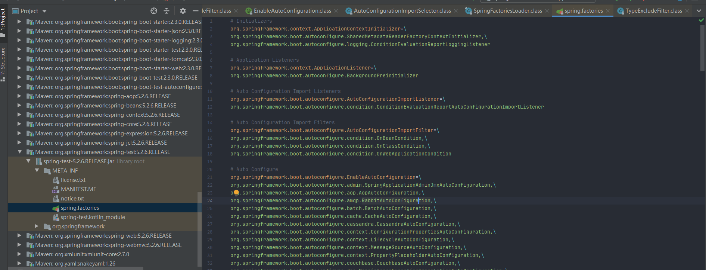
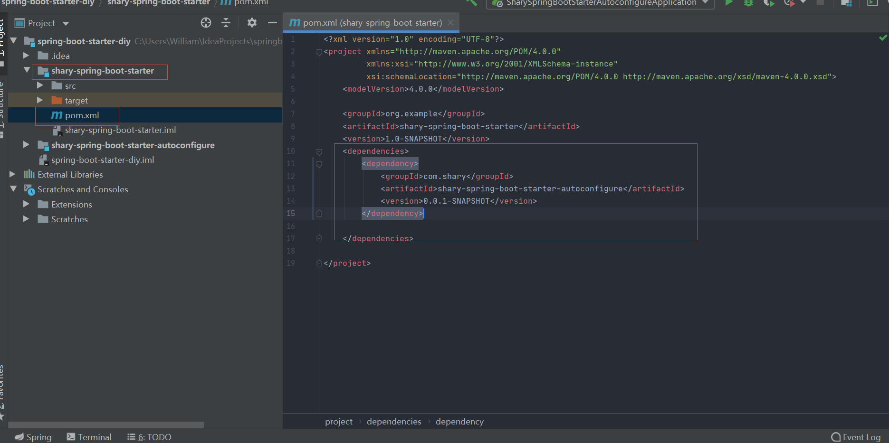

# 狂神SpringBoot

## 一、Hello,SpringBoot!

### 1、SpringBoot简介

#### 回顾什么是Spring

Spring是一个开源框架，2003年兴起的一个轻量级的Java开发框架，作者：Rod Johnson.

Spring是为了解决企业级应用开发的复杂性而创建的，简化开发。

#### Spring是如何简化Java开发的

为了降低Java开发的复杂性，Spring采用了以下4种关键策略：

1. 基于POJO的轻量级和最小侵入性编程，所有东西都是bean；
2. 通过IOC，依赖注入（DI）和面向接口实现松耦合
3. 基于切面（AOP）和惯例进行声明式编程
4. 通过切面和模板减少样式代码，RedisTemplate，xxxTemplate

#### 什么是SpringBoot

SpringBoot是基于SpringFramework的javaweb的开发框架，与SpringMVC类似，对比其他javaweb框架的好处就是能简化开发，约定大于配置。

Spring Boot的主要优点：

- 为所有Spring开发者更快的入门
- 开箱即用，提供各种默认配置来简化项目配置
- 内嵌式容器简化Web项目
- 没有冗余代码生成和XML配置的要求

### 2、第一个SpringBoot项目

#### 准备工作

java版本：11.0.2

maven：3.6.3

springboot：2.3.0.RELEASE

IDEA：2020.1.1

#### 创建基础项目

方式一：可以直接通过Spring官网创建Springboot项目

1. 打开Spring Initializr：https://start.spring.io/

2. 填写项目信息
3. 点击GENERATE按钮生成项目，下载项目
4. 解压项目包，并用IDEA以MAVEN项目导入，直接下一步完成即可
5. 如果第一次使用，Maven需要下包比较慢

方式二：使用IDEA直接创建项目，与方式一基本相同

1. 创建一个新项目
2. 选择spring initalizr
3. 填写项目信息
4. 选择初始化主键，勾选Spring Web
5. 填写项目路径
6. 等待项目创建成功

项目结构分析：

通过上面步骤完成了基础项目的创建，就会自动生成以下文件

1. 程序的主启动器
2. 一个application.properties配置文件
3. 一个测试类
4. 一个pom.xml


#### pom.xml分析

打开pom.xml，看看Spring Boot项目的依赖：

```xml
<!--父依赖-->
<?xml version="1.0" encoding="UTF-8"?>
<project xmlns="http://maven.apache.org/POM/4.0.0" xmlns:xsi="http://www.w3.org/2001/XMLSchema-instance"
         xsi:schemaLocation="http://maven.apache.org/POM/4.0.0 https://maven.apache.org/xsd/maven-4.0.0.xsd">
    <modelVersion>4.0.0</modelVersion>
    <parent>
        <groupId>org.springframework.boot</groupId>
        <artifactId>spring-boot-starter-parent</artifactId>
        <version>2.3.0.RELEASE</version>
        <relativePath/> <!-- lookup parent from repository -->
    </parent>
    <groupId>com.shary</groupId>
    <artifactId>springboot-01-helloworld</artifactId>
    <version>0.0.1-SNAPSHOT</version>
    <name>springboot-01-helloworld</name>
    <description>shary first springboot project</description>

    <properties>
        <java.version>11</java.version>
    </properties>

    <dependencies>
        <!--web场景启动器-->
        <dependency>
            <groupId>org.springframework.boot</groupId>
            <artifactId>spring-boot-starter-web</artifactId>
        </dependency>
		<!--spring单元测试-->
        <dependency>
            <groupId>org.springframework.boot</groupId>
            <artifactId>spring-boot-starter-test</artifactId>
            <scope>test</scope>
            <!--剔除依赖-->
            <exclusions>
                <exclusion>
                    <groupId>org.junit.vintage</groupId>
                    <artifactId>junit-vintage-engine</artifactId>
                </exclusion>
            </exclusions>
        </dependency>


    </dependencies>

    <build>
        <plugins>
            <plugin>
                <groupId>org.springframework.boot</groupId>
                <artifactId>spring-boot-maven-plugin</artifactId>
            </plugin>
        </plugins>
    </build>

</project>
```

#### 编写一个http接口

1. 在主程序的同级目录下，新建一个controller包

   注意：一定要在“xxxApplication”类的同级目录下，否则识别不到

2. 在包中新建一个HelloController类

   ```java
   @Controller
   @RequestMapping("/hello")
   public class HelloController {
       @GetMapping("/hello")
       @ResponseBody
       public String hello(){
           return "hello";
       }
   }
   ```

3. 编写完毕后，从主程序启动项目，浏览器发起丁秋，看页面返回；控制台输出了Tomcat访问端口号


看到hello就是成功了

#### 将项目打成jar包

点击maven的package


```xml
<!--    在工作中,很多情况下我们打包是不想执行测试用例的    可能是测试用例不完事,或是测试用例会影响数据库数据    跳过测试用例执    --><plugin>    <groupId>org.apache.maven.plugins</groupId>    <artifactId>maven-surefire-plugin</artifactId>    <configuration>        <!--跳过项目运行测试用例-->        <skipTests>true</skipTests>    </configuration></plugin>
```

如果打包成功，则会在target目录下生成一个 jar 包


打成了jar包后，就可以在任何地方运行了！OK

#### 更改启动时的banner图

到项目下的 resources 目录下新建一个banner.txt 即可。

图案可以到：https://www.bootschool.net/ascii 这个网站生成，然后拷贝到文件中即可！

****

## 二、运行原理初探

### 1、父依赖

pom.xml

父工程：调用SpringBoot内部的配置

```xml
<parent>
    <groupId>org.springframework.boot</groupId>
    <artifactId>spring-boot-starter-parent</artifactId>
    <version>2.3.0.RELEASE</version>
    <relativePath/> <!-- lookup parent from repository -->
</parent>
```

spring-boot-starter-parent：SpringBoot启动器父工程

```xml
<parent>
  <groupId>org.springframework.boot</groupId>
  <artifactId>spring-boot-dependencies</artifactId>
  <version>2.3.0.RELEASE</version>
</parent>
```

springboot

这里才是真正管理SpringBoot应用里面所有依赖版本的地方，SpringBoot的版本控制中心

以后我们导入依赖默认是不需要写版本；但如果导入的包没有在依赖中管理着，就需要手动配置版本了

### 2、启动器 spring-boot-starter

```xml
<dependency>
    <groupId>org.springframework.boot</groupId>
    <artifactId>spring-boot-starter-web</artifactId>
</dependency>
```

**springboot-boot-starter-xxx**：就是spring-boot的场景启动器

**spring-boot-starter-web**：帮我们导入了web模块正常运行所依赖的组件；

SpringBoot将所有的功能场景都抽取出来，做成一个个的starter （启动器），只需要在项目中引入这些starter即可，所有相关的依赖都会导入进来 ， 我们要用什么功能就导入什么样的场景启动器即可 ；我们未来也可以自己自定义 starter；

可以在官网上找到各种启动器

https://docs.spring.io/spring-boot/docs/2.3.0.RELEASE/reference/html/using-spring-boot.html#using-boot-starter

### 3、主启动器

#### 1、默认的主启动器

用@SpringBootApplication注解来标注这个类为SpringBoot的主程序

```java
@SpringBootApplication
public class Springboot01HelloworldApplication {

    public static void main(String[] args) {
        SpringApplication.run(Springboot01HelloworldApplication.class, args);
    }
}
```

##### 2、注解


1. @SpringBootApplication

   标注在某个类上说明这个类是SpringBoot的主配置类，SpringBoot就应该运行这个类的main方法来启动SpringBoot应用

2. @ComponentScan

   自动扫描并加载符合条件的组件或bean，将这个bean定义加载到IOC容器中

3. @SpringBootConfiguration

   SpringBoot配置类，标注在某个类上，表示这个类是一个SpringBoot的配置类

   1. @Configuration：标注这个类为Spring配置类
      1. @Component：标注这个类为Spring的组件

4. @EnableAutoConfiguration

   标注这个类开启由SpringBoot自动帮我们配置

   1. @AutoConfigurationPackage ：自动配置包

      1. @import ：Spring底层注解@import ， 给容器中导入一个组件
         1. Registrar.class 作用：将主启动类的所在包及包下面所有子包里面的所有组件扫描到Spring容器 

   2. @import ：Spring底层注解@import ， 给容器中导入一个组件

      1. AutoConfigurationImportSelector ：自动配置导入选择器

         它是通过读取spring.factories自动配置的

         

##### 3、spring.factories

自动配置源




WebMvcAutoConfiguration：MVC的自动配置类

可以看出，就是JavaConfig配置类

这些AutoConfiguration自动配置类通过@ConditionalOnxxx注解来判定是否加载，如果这个注解中的目标文件没有加载，则这个配置类也不会加载，注解中的文件由启动器来加载


##### 4、总结

1. SpringBoot启动时，从类路径下的META-INF/spring.factories中获取EnableAutoConfiguration指定的值
2. 将这些值作为自动配置类导入容器，自动配置类就生成了，帮助我们自动配置工作
3. 整个J2EE的整体解决方案和自动配置都在springboot-autoconfigure的jar包中
4. 它会给容器中导入非常多的自动配置类（xxxAutoConfiguration），就是给容器中导入场景需要的所有组件，并配置好这些组件
5. 有了自动配置类 ， 免去了我们手动编写配置注入功能组件等的工作；

### 4、SpringApplication类

SpringApplication.run分析：

SpringApplication实例化主要做了4件事：

1. 推断应用的类型是普通项目还是web项目
2. 查找并加载所有可用初始化器 ， 设置到initializers属性中
3. 找出所有的应用程序监听器，设置到listeners属性中
4. 推断并设置main方法的定义类，找到运行的主类


## 三、配置注入

### 1、yaml介绍

SpringBoot使用一个全局的配置文件，配置文件名称是固定的

- application.properties

  - 语法结构：key=value

    ```properties
    key=value
    ```

    

- application.yaml

  - 语法结构：key:空格 value

    ````yaml
    key: value
    ````

配置文件可以修改SpringBoot自动配置的默认值，SpringBoot底层帮我们做了大量默认配置

如tomcat默认端口号为8080，如果想要修改端口号，需要在application.yaml配置文件中设置

```yaml
server: 
	port: 80801
```

YAML是 "YAML Ain't a Markup Language" （YAML不是一种标记语言）的递归缩写。在开发的这种语言时，YAML 的意思其实是："Yet Another Markup Language"（仍是一种标记语言）

这种语言以数据作为中心，而不是以标记语言为重点

以前的配置文件，大多数都是使用xml来配置；比如一个简单的端口配置，我们来对比下yaml和xml

传统xml配置：

```xml
<server>
	<port>8081<port>
</server>
```

yaml配置：

```yaml
server：  
	prot: 8080
```

### 2、yaml基础语法

语法要求严格：

1、空格不能省略

2、以缩进来控制层级关系，只要是左边对齐的一列数据都是同一个层级的。

3、属性和值的大小写都是十分敏感的。

```yaml
#1、字面量 数字，布尔，字符串
k: v
#双引号不会转义 如下输出为 hello 换行 world
name: "hello \n world"
#单引号会转义 如下输出为 hello \n world
name: 'hello \n world'
#2、对象、Map
student:
	name: shary
	age: 3
#行内写法
student: {name: shary,age: 3}
#3、数组：用-表示元素
pets: 
 - cat
 - dog
 - pig
#行内写法
pets: [cat,dog,pig]
```

### 3、注入配置文件

yaml文件可以给我们的实体类直接注入配置值

yaml注入配置文件步骤：

1. 在springboot项目中的resources目录下新建一个文件application.yaml

2. 编写实体类Dog和实体类Person：

   ```java
   @Component
   public class Dog {
       private String name;
       private int age;
       
       //gets、et方法，实体类
   }
   ```

   ```java
   @Component
   @ConfigurationProperties(prefix = "person")
   public class Person {
       private String name;
       private Integer age;
       private Boolean happy;
       private Date birth;
       private Map<String,Object> maps;
       private List<Object> lists;
       private Dog dog;
        //gets、et方法，实体类 
   }
   ```

3. 编写yaml配置文件

   ```yaml
   person:
     name: qinjiang
     age: 3
     happy: false
     birth: 2000/01/01
     maps: {k1: v1,k2: v2}
     lists:
       - code
       - girl
       - music
     dog:
       name: 旺财
       age: 1
   ```

4. 测试

   ````java
       @Autowired
       private Person person;
   
       @Test
       void contextLoads() {
           System.out.println(person);
       }
   ````

### 4、加载指定的配置文件

@ConfigurationProperties(prefix = "person")：默认从全局配置文件中获取值

@PropertySource(value = "classpath:person.properties")：加载指定的配置文件

1. 在ressources目录下新建一个person.properties文件

   ```properties
   name=shary
   age=6
   ```

2. 在实体类中找到并加载指定的配置文件，通过@Value将配置文件值设置

   ```java
   @Component
   @PropertySource(value = "classpath:person.properties")
   public class Person {
   
       @Value("${name}")
       private String name;
       @Value("${age}")
       private Integer age;
       private Boolean happy;
       private Date birth;
       private Map<String,Object> maps;
       private List<Object> lists;
       private Dog dog;
   
   ```

3. 测试

   ```java
   @Autowired
   private Person person;
   
   @Test
   void contextLoads() {
       System.out.println(person);
   }
   ```

### 5、配置文件占位符

配置文件还可以编写占位符生成随机数

```yaml
person:
    name: qinjiang${random.uuid} # 随机uuid
    age: ${random.int}  # 随机int
    happy: false
    birth: 2000/01/01
    hello: hello
    maps: {k1: v1,k2: v2}
    lists:
      - code
      - girl
      - music
    dog:
    #查找person下的hello，如果有值则输出hello_旺财
    #如果没有值则输出other_旺财
      name: ${person.hello:other}_旺财
      age: 1
```

### 6、回顾properties配置

我们上面采用的yaml方法都是最简单的方式，开发中最常用的；也是springboot所推荐的！那我们来唠唠其他的实现方式，道理都是相同的；写还是那样写；配置文件除了yml还有我们之前常用的properties ， 我们没有讲，我们来唠唠！

【注意】properties配置文件在写中文的时候，会有乱码 ， 我们需要去IDEA中设置编码格式为UTF-8；

settings-->FileEncodings 中配置；


**测试步骤：**

1. 新建一个实体类User

```java
@Component //注册bean
public class User {
    private String name;
    private int age;
    private String sex;
}
```

2. 编辑配置文件 user.properties

```properties
user1.name=kuangshenuser1.age=18user1.sex=男
```

3. 我们在User类上使用@Value来进行注入！

```java
@Component //注册bean
@PropertySource(value = "classpath:user.properties")
public class User {
    //直接使用@value
    @Value("${user.name}") //从配置文件中取值
    private String name;
    @Value("#{9*2}")  // #{SPEL} Spring表达式
    private int age;
    @Value("男")  // 字面量
    private String sex;
}
```

4. Springboot测试

```java
@SpringBootTest
class DemoApplicationTests {
    @Autowired
    User user;

    @Test
    public void contextLoads() {
        System.out.println(user);
    }
}
```

结果正常输出：


### 7、yaml与properties对比小结

@Value这个使用起来并不友好！我们需要为每个属性单独注解赋值，比较麻烦；我们来看个功能对比图


1. @ConfigurationProperties只需要写一次即可 ， @Value则需要每个字段都添加

2. 松散绑定：这个什么意思呢? 比如我的yml中写的last-name，这个和lastName是一样的， - 后面跟着的字母默认是大写的。这就是松散绑定。可以测试一下

3. JSR303数据校验 ， 这个就是我们可以在字段是增加一层过滤器验证 ， 可以保证数据的合法性

4. 复杂类型封装，yml中可以封装对象 ， 使用value就不支持

**结论：**

配置yml和配置properties都可以获取到值 ， 强烈推荐 yml；

如果我们在某个业务中，只需要获取配置文件中的某个值，可以使用一下 @value；

如果说，我们专门编写了一个JavaBean来和配置文件进行一一映射，就直接@configurationProperties，不要犹豫！

## 四、JSR303数据校验

JSR-303是java标准的验证框架，已有的实现由 Hibernate validator

SpringBoot集成JSR303校验：

```xml
<dependency>
    <groupId>org.springframework.boot</groupId>
    <artifactId>spring-boot-starter-validation</artifactId>
</dependency>
```


```java
@Component //注册bean
@ConfigurationProperties(prefix = "person")
@Validated  //数据校验
public class Person {

    @Email(message="邮箱格式错误") //name必须是邮箱格式
    private String name;
} 
```

运行结果 ：default message [不是一个合法的电子邮件地址];


全部校验

Bean Validation 中内置的 constraint


Hibernate Validator 附加的 constraint


## 五、多环境切换

profile是Spring对不同环境提供不同配置功能的支持，可以通过激活不同的环境版本，实现快速切换环境；

### 1、多配置文件

我们在主配置文件编写的时候，文件名可以是 application-{profile}.properties/yml , 用来指定多个环境版本；

**例如：**

application-test.properties 代表测试环境配置

application-dev.properties 代表开发环境配置

但是Springboot并不会直接启动这些配置文件，它**默认使用application.properties主配置文件**；

我们需要通过一个配置来选择需要激活的环境：

```properties
#比如在配置文件中指定使用dev环境，我们可以通过设置不同的端口号进行测试；
#我们启动SpringBoot，就可以看到已经切换到dev下的配置了；
spring.profiles.active=dev
```

### 2、yaml的多文档块

和properties配置文件中一样，但是使用yml去实现不需要创建多个配置文件，更加方便了 !

```yaml
server:
  port: 8081
#选择要激活那个环境块
spring:
  profiles:
    active: prod

---
server:
  port: 8083
spring:
  profiles: dev #配置环境的名称


---

server:
  port: 8084
spring:
  profiles: prod  #配置环境的名称
```

注意：如果yml和properties同时都配置了端口，并且没有激活其他环境 ， 默认会使用properties配置文件的！

### 3、配置文件加载位置


springboot 启动会扫描以下位置的application.properties或者application.yml文件作为Spring boot的默认配置文件：

- 优先级1：项目路径下的config文件夹配置文件
- 优先级2：项目路径下配置文件
- 优先级3：资源路径下的config文件夹配置文件
- 优先级4：资源路径下配置文件

优先级由高到底，高优先级的配置会覆盖低优先级的配置；

SpringBoot会从这四个位置全部加载主配置文件；互补配置；

我们在最低级的配置文件中设置一个项目访问路径的配置来测试互补问题；

```properties
#配置项目的访问路径
server.servlet.context-path=/kuang
```


##### 拓展，运维小技巧

指定位置加载配置文件

我们还可以通过spring.config.location来改变默认的配置文件位置

项目打包好以后，我们可以使用命令行参数的形式，启动项目的时候来指定配置文件的新位置；这种情况，一般是后期运维做的多，相同配置，外部指定的配置文件优先级最高

```cmd
java -jar spring-boot-config.jar --spring.config.location=F:/application.properties
```

## 六、自动配置原理

[SpringBoot官方文档配置](https://docs.spring.io/spring-boot/docs/2.3.0.RELEASE/reference/html/appendix-application-properties.html#common-application-properties)

官方文档配置过多，全靠记忆并非上策

### 1、分析自动配置原理

我们以**HttpEncodingAutoConfiguration（Http编码自动配置）**为例解释自动配置原理；

```java
//表示这是一个配置类，和以前编写的配置文件一样，也可以给容器中添加组件；
@Configuration 

//启动指定类的ConfigurationProperties功能；
  //进入这个HttpProperties查看，将配置文件中对应的值和HttpProperties绑定起来；
  //并把HttpProperties加入到ioc容器中
@EnableConfigurationProperties({HttpProperties.class}) 

//Spring底层@Conditional注解
  //根据不同的条件判断，如果满足指定的条件，整个配置类里面的配置就会生效；
  //这里的意思就是判断当前应用是否是web应用，如果是，当前配置类生效
@ConditionalOnWebApplication(
    type = Type.SERVLET
)

//判断当前项目有没有这个类CharacterEncodingFilter；SpringMVC中进行乱码解决的过滤器；
@ConditionalOnClass({CharacterEncodingFilter.class})

//判断配置文件中是否存在某个配置：spring.http.encoding.enabled；
  //如果不存在，判断也是成立的
  //即使我们配置文件中不配置pring.http.encoding.enabled=true，也是默认生效的；
@ConditionalOnProperty(
    prefix = "spring.http.encoding",
    value = {"enabled"},
    matchIfMissing = true
)

public class HttpEncodingAutoConfiguration {
    //他已经和SpringBoot的配置文件映射了
    private final Encoding properties;
    //只有一个有参构造器的情况下，参数的值就会从容器中拿
    public HttpEncodingAutoConfiguration(HttpProperties properties) {
        this.properties = properties.getEncoding();
    }
    
    //给容器中添加一个组件，这个组件的某些值需要从properties中获取
    @Bean
    @ConditionalOnMissingBean //判断容器没有这个组件？
    public CharacterEncodingFilter characterEncodingFilter() {
        CharacterEncodingFilter filter = new OrderedCharacterEncodingFilter();
        filter.setEncoding(this.properties.getCharset().name());
        filter.setForceRequestEncoding(this.properties.shouldForce(org.springframework.boot.autoconfigure.http.HttpProperties.Encoding.Type.REQUEST));
        filter.setForceResponseEncoding(this.properties.shouldForce(org.springframework.boot.autoconfigure.http.HttpProperties.Encoding.Type.RESPONSE));
        return filter;
    }
    //。。。。。。。
}
```

一句话总结：根据当前不同的条件判断，决定这个配置类是否生效

- 一旦这个配置类生效，这个配置类就会给容器中添加各种组件
- 这些组件的属性是对应properties类中获取的，这些类里面的每一个属性又是和配置文件绑定的
- 所有在配置文件中能配置的属性都是在xxxproperties类中封装着
- 配置文件能配置什么就可以参照某个功能对应的这个属性类

```java
@ConditionalOnProperty(prefix = "server.servlet.encoding", value = "enabled", matchIfMissing = true)
public class HttpEncodingAutoConfiguration {
```


精髓

1. SpringBoot启动会加载大量的自动配置类
2. 我们看需要的功能有没有在SpringBoot默认写好的自动配置类当中
3. 我们再来看这个自动配置类中到底配置了哪些组件；(只要我们要用的组件在其中，我们就不需要再手动配置了)
4. 给容器中自动配置类添加组件的时候，会从properties类中获取某些属性。我们只需要在配置文件中指定这些属性值即可

xxxAutoConfiguration:自动配置类；给容器中添加组件

xxxProperties:封装配置文件中相关属性

### 2、@Conditional

自动配置类需要满足@Conditional注解才能生效


那么多的自动配置类，必须在一定的条件下才能生效；也就是说，我们加载了这么多的配置类，但不是所有的都生效了。

我们可以开启debug模式来查看配置是否生效

```properties
#开启springboot的调试类
debug=true
```

这样启动时就可以在控制台查看配置信息了

Positive matches:（自动配置类启用的：正匹配）

Negative matches:（没有启动，没有匹配成功的自动配置类：负匹配）

Unconditional classes: （没有条件的类）

## 七、自定义Starter

### 1、创建Starter

1. 新建空项目spring-boot-starter-diy

   

2. 新建Maven模块shary-spring-boot-starter作为自动配置启动器模块

3. 新建SpringBoot模块shary-spring-boot-starter-autoconfigure作为自动配置模块

4. 将autoconfigure模块导入到starter模块

   

5. 自动配置模块引入spring-boot-starter

   ```xml
    <!--引入spring-boot-starter；所有starter的基本配置-->
   <dependency>
      <groupId>org.springframework.boot</groupId>
      <artifactId>spring-boot-starter</artifactId>
   </dependency>
   ```

   

6. 在自动配置模块中编写服务类

   ```java
   package com.shary.starter;
   
   public class HelloService {
   
       private HelloProperties helloProperties;
   
       public HelloProperties getHelloProperties() {
           return helloProperties;
       }
   
       public void setHelloProperties(HelloProperties helloProperties) {
           this.helloProperties = helloProperties;
       }
   
       public String sayHello(String name){
           return helloProperties.getPrefix()+name+helloProperties.getSuffix();
       }
   }
   ```

7. 编写配置类

   ```java
   package com.shary.starter;
   
   
   import org.springframework.boot.context.properties.ConfigurationProperties;
   import org.springframework.boot.context.properties.EnableConfigurationProperties;
   
   @ConfigurationProperties(prefix = "shary.hello")
   public class HelloProperties {
   
       private String prefix;
       private String suffix;
   
       public String getPrefix() {
           return prefix;
       }
   
       public void setPrefix(String prefix) {
           this.prefix = prefix;
       }
   
       public String getSuffix() {
           return suffix;
       }
   
       public void setSuffix(String suffix) {
           this.suffix = suffix;
       }
   }
   ```

8. 编写自动配置类

   ```java
   package com.shary.starter;
   
   import org.springframework.beans.factory.annotation.Autowired;
   import org.springframework.boot.autoconfigure.condition.ConditionalOnWebApplication;
   import org.springframework.boot.context.properties.EnableConfigurationProperties;
   import org.springframework.context.annotation.Bean;
   import org.springframework.context.annotation.Configuration;
   
   @Configuration
   @ConditionalOnWebApplication
   @EnableConfigurationProperties(HelloProperties.class)
   public class HelloServiceAutoConfiguration {
   
       @Autowired
       HelloProperties helloProperties;
       
       @Bean
       public HelloService helloService(){
           HelloService service = new HelloService();
           service.setHelloProperties(helloProperties);
           return service;
       }
   }
   ```

9. 在resources中创建/META-INF/spring.factories

   ```properties
   org.springframework.boot.autoconfigure.EnableAutoConfiguration=\
   com.shary.starter.HelloServiceAutoConfiguration
   ```

10. 将两个模块打包

    

    显示BUILD SUCCESS则为成功

### 2、测试

1. 引入Starter

   

   ```xml
   <dependency>
       <groupId>org.example</groupId>
       <artifactId>shary-spring-boot-starter</artifactId>
       <version>1.0-SNAPSHOT</version>
   </dependency>
   ```

   可以在lib下看到

   

2. 编写Controller类

   ```java
   @RestController
   public class HelloController {
   
       @Autowired
       HelloService helloService;
   
   
       @GetMapping("/hello")
       public String hello(){
           return helloService.sayHello("Shary");
       }
   }
   ```

3. 编写配置文件application.yaml

   ```yaml
   shary:
     hello:
       prefix: ppp
       suffix: sss
   ```

4. 启动项目http://www.localhost:8080/hello


运行成功！

## 八、整合JDBC

### 8.1、整合JDBC

对于数据层访问，无论关系型数据库还是非关系型数据库，都是采用Spring Data框架进行统一处理

Sping Data 官网：https://spring.io/projects/spring-data

1. 创建基础项目，依然使用Spring Initializr创建，默认依赖勾选Spring Web，JDBC API，MySQL Driver

2. 连接数据库配置

   ```yaml
   spring:
     datasource:
       username: root
       password: 123456
       url: jdbc:mysql://localhost:3306/mybatisdb?useSSL=false&amp&useUnicode=false&amp&characterEncoding=UTF-8&serverTimezone=GMT
       driver-class-name: com.mysql.cj.jdbc.Driver
   ```

3. 这样就可以直接编写测试类了

   ```java
   @SpringBootTest
   class SpringbootDataJdbcApplicationTests {
   
       //DI注入数据源
       @Autowired
       DataSource dataSource;
   
       @Test
       public void contextLoads() throws SQLException {
           //看一下默认数据源
           System.out.println(dataSource.getClass());
           //获得连接
           Connection connection =   dataSource.getConnection();
           System.out.println(connection);
           //关闭连接
           connection.close();
       }
   }
   ```


这里可以看到使用的数据库连接池是hikari，我们并没有做其他配置，这是Spring Data自带的数据库连接池，也是现今速度最快的连接池

### 8.2、JDBCTemplate

JDBCTemplate是Spring对jdbc的简单封装，并非像Hibernate和Mybatis这样的持久层框架

数据库操作的CRUD方法都在JDBCTemplate中

JDBCTemplate主要提供以下方法：

- execute：可以用于执行任何SQL语句，一般用于执行DDL语句
- update及batchUpdate：update用于执行新增、修改、删除等语句，batchUpate用于执行批处理
- query及queryForxxx：用于执行查询相关方法
- call：用于执行存储过程及函数相关方法

测试

```java
@RestController
public class JDBCController {

    @Autowired
    JdbcTemplate jdbcTemplate;

    @GetMapping("/userList")
    public List<Map<String,Object>> userList(){
        String sql = "select * from mybatisdb.user";
        List<Map<String, Object>> list = jdbcTemplate.queryForList(sql);
        return list;
    }

    @GetMapping("/addUser")
    public String addUser(){
        String sql = "insert into mybatisdb.user(id,name,pwd) values (3,'三三','4252352')";
        jdbcTemplate.update(sql);
        return "update-ok";
    }

    @GetMapping("/updateUser/{id}")
    public String updateUser(@PathVariable("id")Integer id){
        String sql = "update mybatisdb.user set name=?,pwd=? where id="+id;
        Object[] objects = new Object[2];
        objects[0] = "苏茶";
        objects[1] = "456342";
        jdbcTemplate.update(sql,objects);
        return "updateUser-ok";
    }

    @GetMapping("/deleteUser/{id}")
    public String delete(@PathVariable("id")Integer id){
        String sql = "delete from mybatisdb.user where id=?";
        jdbcTemplate.update(sql,id);
        return "deleteUser-ok";
    }
}
```

## 九、整合Druid

Druid是一款alibaba开源的数据库连接池

其性能仅次于Hikari，但是配置更灵活，功能更强大

Github地址：https://github.com/alibaba/druid/

com.alibaba.druid.pool.DruidDataSource 基本配置参数如下：

| 配置                                      | 缺省值             | 说明                                                         |
| ----------------------------------------- | ------------------ | ------------------------------------------------------------ |
| name                                      |                    | 配置这个属性的意义在于，如果存在多个数据源，监控的时候可以通过名字来区分开来。如果没有配置，将会生成一个名字，格式是："DataSource-" + System.identityHashCode(this). 另外配置此属性至少在1.0.5版本中是不起作用的，强行设置name会出错。[详情-点此处](http://blog.csdn.net/lanmo555/article/details/41248763) |
| url                                       |                    | 连接数据库的url，不同数据库不一样。例如： mysql : jdbc:mysql://10.20.153.104:3306/druid2 oracle : jdbc:oracle:thin:@10.20.149.85:1521:ocnauto |
| username                                  |                    | 连接数据库的用户名                                           |
| password                                  |                    | 连接数据库的密码。如果你不希望密码直接写在配置文件中，可以使用ConfigFilter。[详细看这里](https://github.com/alibaba/druid/wiki/使用ConfigFilter) |
| driverClassName                           | 根据url自动识别    | 这一项可配可不配，如果不配置druid会根据url自动识别dbType，然后选择相应的driverClassName |
| initialSize                               | 0                  | 初始化时建立物理连接的个数。初始化发生在显示调用init方法，或者第一次getConnection时 |
| maxActive                                 | 8                  | 最大连接池数量                                               |
| maxIdle                                   | 8                  | 已经不再使用，配置了也没效果                                 |
| minIdle                                   |                    | 最小连接池数量                                               |
| maxWait                                   |                    | 获取连接时最大等待时间，单位毫秒。配置了maxWait之后，缺省启用公平锁，并发效率会有所下降，如果需要可以通过配置useUnfairLock属性为true使用非公平锁。 |
| poolPreparedStatements                    | false              | 是否缓存preparedStatement，也就是PSCache。PSCache对支持游标的数据库性能提升巨大，比如说oracle。在mysql下建议关闭。 |
| maxPoolPreparedStatementPerConnectionSize | -1                 | 要启用PSCache，必须配置大于0，当大于0时，poolPreparedStatements自动触发修改为true。在Druid中，不会存在Oracle下PSCache占用内存过多的问题，可以把这个数值配置大一些，比如说100 |
| validationQuery                           |                    | 用来检测连接是否有效的sql，要求是一个查询语句，常用select 'x'。如果validationQuery为null，testOnBorrow、testOnReturn、testWhileIdle都不会起作用。 |
| validationQueryTimeout                    |                    | 单位：秒，检测连接是否有效的超时时间。底层调用jdbc Statement对象的void setQueryTimeout(int seconds)方法 |
| testOnBorrow                              | true               | 申请连接时执行validationQuery检测连接是否有效，做了这个配置会降低性能。 |
| testOnReturn                              | false              | 归还连接时执行validationQuery检测连接是否有效，做了这个配置会降低性能。 |
| testWhileIdle                             | false              | 建议配置为true，不影响性能，并且保证安全性。申请连接的时候检测，如果空闲时间大于timeBetweenEvictionRunsMillis，执行validationQuery检测连接是否有效。 |
| keepAlive                                 | false （1.0.28）   | 连接池中的minIdle数量以内的连接，空闲时间超过minEvictableIdleTimeMillis，则会执行keepAlive操作。 |
| timeBetweenEvictionRunsMillis             | 1分钟（1.0.14）    | 有两个含义： 1) Destroy线程会检测连接的间隔时间，如果连接空闲时间大于等于minEvictableIdleTimeMillis则关闭物理连接。 2) testWhileIdle的判断依据，详细看testWhileIdle属性的说明 |
| numTestsPerEvictionRun                    | 30分钟（1.0.14）   | 不再使用，一个DruidDataSource只支持一个EvictionRun           |
| minEvictableIdleTimeMillis                |                    | 连接保持空闲而不被驱逐的最小时间                             |
| connectionInitSqls                        |                    | 物理连接初始化的时候执行的sql                                |
| exceptionSorter                           | 根据dbType自动识别 | 当数据库抛出一些不可恢复的异常时，抛弃连接                   |
| filters                                   |                    | 属性类型是字符串，通过别名的方式配置扩展插件，常用的插件有： 监控统计用的filter:stat 日志用的filter:log4j 防御sql注入的filter:wall |
| proxyFilters                              |                    | 类型是List<com.alibaba.druid.filter.Filter>，如果同时配置了filters和proxyFilters，是组合关系，并非替换关系 |

配置数据源

1. 添加Druid依赖

   ```xml
   <dependency>
       <groupId>com.alibaba</groupId>
       <artifactId>druid-spring-boot-starter</artifactId>
       <version>1.1.22</version>
   </dependency>
   ```

2. 修改数据源配置

   ```yaml
   spring:
     datasource:
       username: root
       password: 123456
       url: jdbc:mysql://localhost:3306/springboot?serverTimezone=UTC&useUnicode=true&characterEncoding=utf-8
       driver-class-name: com.mysql.cj.jdbc.Driver
       type: com.alibaba.druid.pool.DruidDataSource # 自定义数据源
   ```

3. 测试一下数据源是否配置成功

   ```java
   @SpringBootTest
   class Springboot05DataApplicationTests {
   
       @Autowired
       DataSource dataSource;
       @Test
       public void contextLoads2() throws SQLException {
           //看一下默认数据源
           System.out.println(dataSource.getClass());
           //获得连接
           Connection connection =   dataSource.getConnection();
           System.out.println(connection);
           //关闭连接
           connection.close();
       }
   }
   ```

   

4. 配置数据源连接初始化大小、最大连接数、等待时间、最小连接数 等设置项；可以查看源码

   ```yaml
   spring:
     datasource:
       username: root
       password: 123456
       url: jdbc:mysql://localhost:3306/mybatisdb?useSSL=false&amp&useUnicode=false&amp&characterEncoding=UTF-8&serverTimezone=GMT
       driver-class-name: com.mysql.cj.jdbc.Driver
       type: com.alibaba.druid.pool.DruidDataSource
       #Spring Boot 默认是不注入这些属性值的，需要自己绑定
       #druid 数据源专有配置
       druid:
         initial-size: 5
         min-idle: 5
         max-active: 20
         max-wait: 60000
         time-between-eviction-runs-millis: 60000
         validationQuery: SELECT 1 FROM DUAL
         test-while-idle: true
         test-on-borrow: false
         test-on-return: false
         pool-prepared-statements: true
         #配置监控统计拦截的filters，stat:监控统计、log4j：日志记录、wall：防御sql注入
         #如果允许时报错  java.lang.ClassNotFoundException: org.apache.log4j.Priority
         #则导入 log4j 依赖即可，Maven 地址：https://mvnrepository.com/artifact/log4j/log4j
   #      filters: stat,wall,log4j
         max-pool-prepared-statement-per-connection-size: 20
         use-global-data-source-stat: true
         connection-properties: druid.stat.mergeSql=true;druid.stat.slowSqlMillis=500
         filters: stat,wall,log4j
   ```

5. 导入log4j的依赖，自带的日志可能会报错

   ```xml
   <dependency>
       <groupId>log4j</groupId>
       <artifactId>log4j</artifactId>
       <version>1.2.17</version>
   </dependency>
   ```

6. 将SpringBoot自带的数据源配置替换为，Druid数据源配置


   ```java
   @Configuration
   public class DruidConfig {
   
       @ConfigurationProperties(prefix = "spring.datasource")
       @Bean
       public DataSource druidDataSource(){
           return new DruidDataSource();
       }
   
       @Bean
       public ServletRegistrationBean statViewServlet(){
           ServletRegistrationBean<StatViewServlet> bean 
               = new ServletRegistrationBean<>(new StatViewServlet(), "/druid/*");
           HashMap<String, String> initParameters = new HashMap<>();
           initParameters.put("loginUsername","admin");
           initParameters.put("loginPassword","123456");
           initParameters.put("allow","");
   //        initParameters.put("shary","192.168.123.123");
           bean.setInitParameters(initParameters);
           return bean;
       }
   
       @Bean
       public FilterRegistrationBean druidStatFilter(){
           FilterRegistrationBean filterRegistrationBean 
               = new FilterRegistrationBean(new WebStatFilter());
           filterRegistrationBean.addUrlPatterns("/*");
   		filterRegistrationBean.addInitParameter
               ("exclusions","*.js,*.gif,*.jpg,*.png,*.css,*.ico,/druid/*");
           return filterRegistrationBean;
       }
   }
   ```

7. 测试

   ```java
   @SpringBootTest
   class Springboot05DataApplicationTests {
   
       @Autowired
       DataSource dataSource;
   
       @Test
       void contextLoads() throws SQLException {
           Connection connection = dataSource.getConnection();
           DruidDataSource druidDataSource = (DruidDataSource) dataSource;
           System.out.println("druidDataSource 数据源最大连接数：" + druidDataSource.getMaxActive());
           System.out.println("druidDataSource 数据源初始化连接数：" + druidDataSource.getInitialSize());
   
           System.out.println(connection);
           connection.close();
       }
   }
   ```

## 十、整合Mybatis

官方文档：http://mybatis.org/spring-boot-starter/mybatis-spring-boot-autoconfigure/

1. 导入Mybatis依赖

   ```xml
   <dependency>
       <groupId>org.mybatis.spring.boot</groupId>
       <artifactId>mybatis-spring-boot-starter</artifactId>
       <version>2.1.2</version>
   </dependency>
   ```

2. 配置数据库，同上面Druid配置

3. 测试是否能连接成功

4. 创建实体类

   ```java
   @Data
   @AllArgsConstructor
   @NoArgsConstructor
   public class User {
       private int id;
       private String name;
       private String pwd;
   }
   ```

5. 创建Mapper接口

   ```java
   @Mapper
   @Repository
   public interface UserMapper {
       List<User> getUserList();
       User getUserById(int id);
       int insertUser(User user);
       int updateUserById(User user);
       int deleteUser(int id);
   }
   ```

6. Mapper映射

   ```xml
   <?xml version="1.0" encoding="UTF-8" ?>
   <!DOCTYPE mapper
           PUBLIC "-//mybatis.org//DTD Mapper 3.0//EN"
           "http://mybatis.org/dtd/mybatis-3-mapper.dtd">
   <mapper namespace="com.shary.mapper.UserMapper">
       <!--查询全部用户-->
       <select id="getUserList" resultType="com.shary.pojo.User">
           select * from mybatisdb.user
       </select>
       <!--根据id查询用户-->
       <select id="getUserById" resultType="com.shary.pojo.User" parameterType="int">
           select * from mybatisdb.user where id = #{id}
       </select>
       <!--插入用户-->
       <insert id="insertUser" parameterType="com.shary.pojo.User">
           insert into mybatisdb.user (id,name,pwd) values (#{id},#{name},#{pwd})
       </insert>
       <!--用map插入用户-->
       <insert id="insertUserByMap" parameterType="map">
           insert into mybatisdb.user (id,name,pwd) values (#{id},#{userName},#{userPassword})
       </insert>
       <!--修改用户-->
       <update id="updateUser" parameterType="com.shary.pojo.User">
           update mybatisdb.user set name = #{name},pwd = #{pwd} where id = #{id}
       </update>
       <!--删除用户-->
       <delete id="deleteUser" parameterType="int">
           delete from mybatisdb.user where id = #{id}
       </delete>
   </mapper>
   ```

7. 编写Controller，通过前端展示出来

   ```java
   @RestController
   public class UserController {
       @Autowired
       UserMapper userMapper;
   
       @GetMapping("/queryUserList")
       public List<User> queryList(){
           List<User> userList = userMapper.getUserList();
           for (User user : userList) {
               System.out.println(user);
           }
           return userList;
       }
   }
   ```

8. 启动，测试请求

## 十一、Web开发静态资源处理

### 11.1、静态资源映射规则

在SpringBoot中SpringMVC的配置都在WebMvcAutoConfiguration这个配置类中

在这个类里的addResourceHandlers方法

```java
@Override
public void addResourceHandlers(ResourceHandlerRegistry registry) {
    if (!this.resourceProperties.isAddMappings()) {
        logger.debug("Default resource handling disabled");
        return;
    }
    Duration cachePeriod = this.resourceProperties.getCache().getPeriod();
    CacheControl cacheControl = this.resourceProperties.getCache().getCachecontrol().toHttpCacheControl();
    if (!registry.hasMappingForPattern("/webjars/**")) {
        customizeResourceHandlerRegistration(registry.addResourceHandler("/webjars/**")
                                             .addResourceLocations("classpath:/META-INF/resources/webjars/")
                                             .setCachePeriod(getSeconds(cachePeriod)).setCacheControl(cacheControl));
    }
    String staticPathPattern = this.mvcProperties.getStaticPathPattern();
    if (!registry.hasMappingForPattern(staticPathPattern)) {
        customizeResourceHandlerRegistration(registry.addResourceHandler(staticPathPattern)
                                             .addResourceLocations(getResourceLocations(this.resourceProperties.getStaticLocations()))
                                             .setCachePeriod(getSeconds(cachePeriod)).setCacheControl(cacheControl));
    }
}
```

可以看到所有的 /webjars/** ， 都需要去 classpath:/META-INF/resources/webjars/ 找对应的资源

### 11.2、通过webjars引入静态资源

webjars本质就是以jar包的方式引入我们的静态资源

可以通过https://www.webjars.org/这个网站来查找需要的静态资源所依赖的jar包

如：JQuery所对应的pom依赖

```xml
<dependency>
    <groupId>org.webjars</groupId>
    <artifactId>jquery</artifactId>
    <version>3.5.1</version>
</dependency>
```

### 11.3、自动配置静态资源映射规则

在上面方法中除了webjars的if判断中还有另一组if判断

而这个判断中，就是我们项目中自己创建的静态资源所存放的目录配置

```java
if (!registry.hasMappingForPattern(staticPathPattern)) {
    customizeResourceHandlerRegistration(registry.addResourceHandler(staticPathPattern)
                                         .addResourceLocations(getResourceLocations(this.resourceProperties.getStaticLocations()))
                                         .setCachePeriod(getSeconds(cachePeriod)).setCacheControl(cacheControl));
}
```

```java
public class ResourceProperties {

	private static final String[] CLASSPATH_RESOURCE_LOCATIONS = { "classpath:/META-INF/resources/",
			"classpath:/resources/", "classpath:/static/", "classpath:/public/" };
	private String[] staticLocations = CLASSPATH_RESOURCE_LOCATIONS;
	public String[] getStaticLocations() {
		return this.staticLocations;
	}
}
```

通过源码可以看出，静态资源主要存储在这四个目录下：

1. "classpath:/META-INF/resources/"

2. "classpath:/resources/"

3. "classpath:/static/"

4. "classpath:/public/"

根据静态资源加载顺序排序

### 11.4、自定义静态资源路径

通过以下配置，设置静态资源映射路径，自定义配置后自动配置都会失效

```yaml
spring: 
	resources: 
		static-locations: classpath:/coding/,classpath:/shary/
```

### 11.5、欢迎页处理

WebMvcAutoConfiguration中还有一个welcomePageHandlerMapping方法，这个方法就是配置我们首页用的

```java
@Bean
public WelcomePageHandlerMapping welcomePageHandlerMapping(ApplicationContext applicationContext,
                                                           FormattingConversionService mvcConversionService, ResourceUrlProvider mvcResourceUrlProvider) {
    WelcomePageHandlerMapping welcomePageHandlerMapping = new WelcomePageHandlerMapping(
        new TemplateAvailabilityProviders(applicationContext), applicationContext, getWelcomePage(),
        this.mvcProperties.getStaticPathPattern());
    welcomePageHandlerMapping.setInterceptors(getInterceptors(mvcConversionService, mvcResourceUrlProvider));
    welcomePageHandlerMapping.setCorsConfigurations(getCorsConfigurations());
    return welcomePageHandlerMapping;
}
```

```java
private Optional<Resource> getWelcomePage() {
    String[] locations = getResourceLocations(this.resourceProperties.getStaticLocations());
    return Arrays.stream(locations).map(this::getIndexHtml).filter(this::isReadable).findFirst();
}

private Resource getIndexHtml(String location) {
    return this.resourceLoader.getResource(location + "index.html");
}
```

可以看到，默认配置下会把index.html作为欢迎页，并且映射路径为/**

## 十二、Thymeleaf模板引擎

### 12.1、Thymeleaf模板引擎介绍

模板引擎（这里特指用于Web开发的模板引擎）是为了使用户界面与业务数据（内容）分离而产生的，它可以生成特定格式的文档，用于网站的模板引擎就会生成一个标准的HTML文档。

我们在学习Java Web的过程当中使用的jsp是模板引擎的前身，它同样可以帮助我们生成特定格式的文档，但是并不能生成HTML


SpringBoot中是不支持JSP的

常见的模板引擎jinja、freemarker、velocity、juicer等

Spring官方推荐的是这款Thymeleaf模板引擎

Thymeleaf 官网：https://www.thymeleaf.org/

Thymeleaf 在Github 的主页：https://github.com/thymeleaf/thymeleaf

Spring官方文档：找到我们对应的版本

https://docs.spring.io/spring-boot/docs/2.3.1.RELEASE/reference/html/using-spring-boot.html#using-boot

直接导入启动器即可，SpringBoot会帮助我们找到并下载合适的jar包

```xml
<dependency>
<groupId>org.springframework.boot</groupId>
<artifactId>spring-boot-starter-thymeleaf</artifactId>
</dependency>
```

### 12.2、Thymeleaf分析使用

Spring boot中自带ThymeleafAutoConfiguration自动配置类，它所引用的配置模板ThymeleafProperties类

```java
@ConfigurationProperties(prefix = "spring.thymeleaf")
public class ThymeleafProperties {

	private static final Charset DEFAULT_ENCODING = StandardCharsets.UTF_8;

	public static final String DEFAULT_PREFIX = "classpath:/templates/";

	public static final String DEFAULT_SUFFIX = ".html";
}
```

可以看到默认的前缀和后缀"classpath:/templates/"、".html"，我们只需要将文件放入templates并以后缀为html就可以使用thymeleaf

下面来测试一下：

1. Controller

```java
@Controller
public class TestController {
    
    @RequestMapping("/t1")
    public String test1(){
        //classpath:/templates/test.html
        return "test";
    }
}
```

2. 编写一个html放在templates中

```html
<!DOCTYPE html>
<html lang="en">
<head>
    <meta charset="UTF-8">
    <title>Title</title>
</head>
<body>
<h1>测试页面</h1>
</body>
</html>
```

3. 启动项目请求测试

### 12.3、thymeleaf语法学习

全部内容可以通过官网学习https://www.thymeleaf.org/

1、修改测试请求，增加数据传输；

```java
@RequestMapping("/t1")public String test1(Model model){    
    //存入数据    			
    model.addAttribute("msg","Hello,Thymeleaf");    
    //classpath:/templates/test.html    
    return "test";
}
```

2、我们要使用thymeleaf，需要在html文件中导入命名空间的约束，方便提示。

我们可以去官方文档的#3中看一下命名空间拿来过来：

```html
<html lang="en" xmlns:th="http://www.thymeleaf.org">
```

3、我们去编写下前端页面

```html
<!DOCTYPE html>
<html lang="en" xmlns:th="http://www.thymeleaf.org">
<head>    
    <meta charset="UTF-8">    
    <title>测试</title>
</head>
<body>
        <h1>测试页面</h1>
<!--th:text就是将div中的内容设置为它指定的值，和之前学习的Vue一样-->
        <div th:text="${msg}"></div>
    </body>
</html>
```

4、启动测试！


##### 常用属性

1. th:text：文本替换；
2. th:utext：支持html的文本替换。
3. th:value：属性赋值 
4. th:each：遍历循环元素
5. th:if：判断条件，类似的还有th:unless，th:switch，th:case
6. th:insert：代码块引入，类似的还有th:replace，th:include，常用于公共代码块提取的场景
7. th:fragment：定义代码块，方便被th:insert引用
8. th:object：声明变量，一般和*{}一起配合使用，达到偷懒的效果。
9. th:attr：设置标签属性，多个属性可以用逗号分隔

##### 标准表达式语法：

1. ${...}`变量表达式，Variable Expressions

2. @{...} 链接表达式，Link URL Expressions

3. #{...} 消息表达式，Message Expressions

4. ~{...}`代码块表达式，Fragment Expressions

5. *{...}`选择变量表达式，Selection Variable Expressions

##### 常用的内置对象

1. ctx ：上下文对象。

2. vars ：上下文变量。

3. locale：上下文的语言环境。

4. request：（仅在web上下文）的 HttpServletRequest 对象。

5. response：（仅在web上下文）的 HttpServletResponse 对象。

6. session：（仅在web上下文）的 HttpSession 对象。

7. servletContext：（仅在web上下文）的 ServletContext 对象

##### 常用的内置方法

1. strings：字符串格式化方法，常用的Java方法它都有。比如：equals，equalsIgnoreCase，length，trim，toUpperCase，toLowerCase，indexOf，substring，replace，startsWith，endsWith，contains，containsIgnoreCase等

2. numbers：数值格式化方法，常用的方法有：formatDecimal等

3. bools：布尔方法，常用的方法有：isTrue，isFalse等

4. arrays：数组方法，常用的方法有：toArray，length，isEmpty，contains，containsAll等

5. lists，sets：集合方法，常用的方法有：toList，size，isEmpty，contains，containsAll，sort等

6. maps：对象方法，常用的方法有：size，isEmpty，containsKey，containsValue等

7. dates：日期方法，常用的方法有：format，year，month，hour，createNow等


