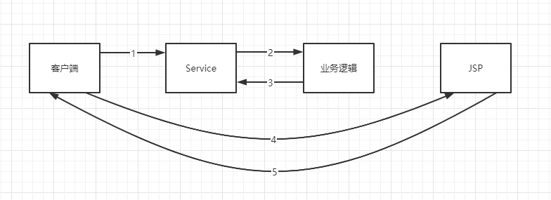
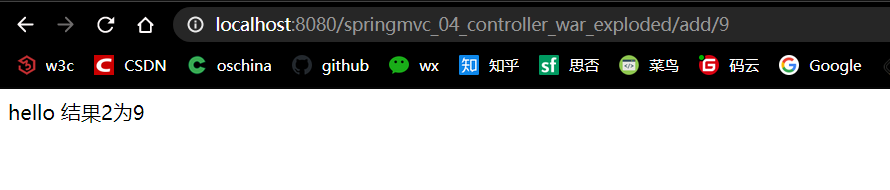

# 狂神SpringMVC

学习自：https://www.bilibili.com/video/BV1aE41167Tu/

## 一、什么是MVC

### 1、回顾MVC

#### 1.1、什么是MVC

- MVC是模型（Model），视图（View），控制器（Controller）的简写，是一种软件设计规范
- 是将业务逻辑、数据、显式分离的方法组织代码
- MVC不是设计模式，MVC是一种架构模式，不同的MVC存在差异

**Model（模型）：**数据模型，提供要展示的数据，因此包含数据和行为，可以认为是领域模型或JavaBean组件（包含数据和行为），不过现在一般都分离开来：Value Object（数据Dao） 和 服务层（行为Service）。也就是模型提供了模型数据查询和模型数据的状态更新等功能，包括数据和业务。

**View（视图）：**负责进行模型的展示，一般就是我们见到的用户界面，客户想看到的东西。

**Controller（控制器）：**接收用户请求，委托给模型进行处理（状态改变），处理完毕后把返回的模型数据返回给视图，由视图负责展示。也就是说控制器做了个调度员的工作。

**最典型的MVC就是JSP + servlet + javabean的模式。**


#### 1.2、Model1时代

- 在web早期的开发中，通常采用Model1

- Model1中主要分为两层，视图层和模型层

  

  优点：架构简单，比较适合小型项目开发

  缺点：JSP职责不单一，不便于维护

#### 1.3、Model2时代

Model2把一个项目分成三部分，包括视图、控制、模型



1. 用户发请求
2. Servlet接收请求数据，并调用对应的业务逻辑方法
3. 业务处理完毕，返回更新后的数据给servlet
4. servlet转向到JSP，由JSP来渲染页面
5. 响应给前端更新后的页面

##### 职责分析：

###### Controller：控制器

1. 取得表单数据
2. 调用业务逻辑
3. 转向指定的页面

###### Model：模型

1. 业务逻辑
2. 保存数据的状态

###### View：视图

1. 显式页面

Model2这样不仅提高了代码的复用率与项目的扩展性，且大大降低了项目的维护成本。

Model1模式的实现比较简单，适用于快速开发小规模项目，Model1种JSP页面身兼View和Controller两种角色，将控制代码逻辑和表现逻辑混杂在一起，从而导致代码的重用性非常低，增加了应用的扩展性和维护的难度。Model2消除了Model1的缺点。

#### 1.4、回顾Servlet 

1. 新建一个Maven工程

```xml
<dependencies>
    <!--Junit测试-->
   <dependency>
       <groupId>junit</groupId>
       <artifactId>junit</artifactId>
       <version>4.12</version>
   </dependency>
    <!--SpringMVC依赖-->
   <dependency>
       <groupId>org.springframework</groupId>
       <artifactId>spring-webmvc</artifactId>
       <version>5.1.9.RELEASE</version>
   </dependency>
    <!--servlet依赖-->
   <dependency>
       <groupId>javax.servlet</groupId>
       <artifactId>servlet-api</artifactId>
       <version>2.5</version>
   </dependency>
    <!--JSP依赖-->
   <dependency>
       <groupId>javax.servlet.jsp</groupId>
       <artifactId>jsp-api</artifactId>
       <version>2.2</version>
   </dependency>
    <!--JSP标准标签库jstl依赖-->
   <dependency>
       <groupId>javax.servlet</groupId>
       <artifactId>jstl</artifactId>
       <version>1.2</version>
   </dependency>
</dependencies>
```

2. 建立一个Moudle：springmvc-01-servlet ， 添加Web app的支持

3. 编写一个Servlet类，用来处理用户的请求

   ```java
   package com.shary.servlet;
   
   import javax.servlet.ServletException;
   import javax.servlet.http.HttpServlet;
   import javax.servlet.http.HttpServletRequest;
   import javax.servlet.http.HttpServletResponse;
   import java.io.IOException;
   
   public class HelloServlet extends HttpServlet {
       @Override
       protected void doGet(HttpServletRequest req, HttpServletResponse resp) throws ServletException, IOException {
           System.out.println(1111);
           String method = req.getParameter("method");
           if (method.equals("add")){
               req.getSession().setAttribute("msg","执行了add方法");
           }
           if (method.equals("delete")){
               req.getSession().setAttribute("msg","执行了delete方法");
           }
           req.getRequestDispatcher("/WEB-INF/jsp/test.jsp").forward(req,resp);
       }
   
       @Override
       protected void doPost(HttpServletRequest req, HttpServletResponse resp) throws ServletException, IOException {
           doGet(req, resp);
       }
   
   }
   
   ```

4. 编写test.jsp，在WEB-INF目录下新建一个jsp的文件夹，新建test.jsp

   ```jsp
   <%--
     Created by IntelliJ IDEA.
     User: William
     Date: 2020/5/7
     Time: 19:04
     To change this template use File | Settings | File Templates.
   --%>
   <%@ page contentType="text/html;charset=UTF-8" language="java" %>
   <html>
   <head>
       <title>Title</title>
   </head>
   <body>
       ${msg}
   </body>
   </html>
   
   ```

5. 在web.xml中注册Servlet

   ```xml
   <?xml version="1.0" encoding="UTF-8"?>
   <web-app xmlns="http://xmlns.jcp.org/xml/ns/javaee"
            xmlns:xsi="http://www.w3.org/2001/XMLSchema-instance"
            xsi:schemaLocation="http://xmlns.jcp.org/xml/ns/javaee http://xmlns.jcp.org/xml/ns/javaee/web-app_4_0.xsd"
            version="4.0">
       <servlet>
           <servlet-name>hello</servlet-name>
           <servlet-class>com.shary.servlet.HelloServlet</servlet-class>
       </servlet>
       <servlet-mapping>
           <servlet-name>hello</servlet-name>
           <url-pattern>/hello</url-pattern>
       </servlet-mapping>
   
       <session-config>
           <session-timeout>15</session-timeout>
       </session-config>
       <welcome-file-list>
           <welcome-file>index.jsp</welcome-file>
       </welcome-file-list>
   </web-app>
   ```

6. 配置Tomcat，并启动测试

##### MVC框架要做哪些事情

1. 将url映射到java类或java类的方法
2. 封装用户提交的数据
3. 处理请求--调用相关的业务处理--封装响应数据
4. 将响应的数据进行渲染 。jsp / html 等表示层数据

说明：

常见的服务器端MVC框架有：Struts、Spring MVC、ASP.NET MVC、Zend Framework，JSF；

常见前端MVC框架：vue、angularjs、react、backbone；

由MVC演化出的一些模式：MVP、MVVM等...

## 二、什么是SpringMVC

### 2.1、概述


SpringMVC是Spring Framework的一部分，是基于Java实现MVC的轻量级Web框架

官方文档https://docs.spring.io/spring/docs/5.2.6.RELEASE/spring-framework-reference/web.html#spring-web

**我们为什么要学习SpringMVC呢?**

 Spring MVC的特点：

1. 轻量级，简单易学
2. 高效 , 基于请求响应的MVC框架
3. 与Spring兼容性好，无缝结合
4. 约定优于配置
5. 功能强大：RESTful、数据验证、格式化、本地化、主题等
6. 简洁灵活

Spring的web框架围绕**DispatcherServlet** [ 调度Servlet ] 设计。

DispatcherServlet的作用是将请求分发到不同的处理器。从Spring 2.5开始，使用Java 5或者以上版本的用户可以采用基于注解形式进行开发，十分简洁；

正因为SpringMVC好 , 简单 , 便捷 , 易学 , 天生和Spring无缝集成(使用SpringIoC和Aop) , 使用约定优于配置 . 能够进行简单的junit测试 . 支持Restful风格 .异常处理 , 本地化 , 国际化 , 数据验证 , 类型转换 , 拦截器 等等......所以我们要学习 .

**最重要的一点还是用的人多 , 使用的公司多 .** 

### 2.2、中心控制器

​	Spring的web框架围绕DispatcherServlet设计。DispatcherServlet的作用是将请求分发到不同的处理器。从Spring2.5开始，使用Java5 或者以上版本的用户可以采用基于注解的controller声明方式


### 2.3、SpringMVC的原理图

当发起其你去是被前置的控制器拦截到请求，根据请参数生成代理请求，找到请求对应的实际控制器，控制器处理请求，创建数据模型，访问数据库，将模型响应给中心控制器，控制器使用模型与视图渲染视图结果，将结果返回给中心控制器，再将结果返回给请求者。


### 2.4、SpringMVC执行原理


#### 简要分析执行流程

1. DispatcherServlet表示前端控制器，是整个SpringMVC的控制中心。用户发送请求，DispatcherServlet接收请求并拦截请求。

   我们假设请求的url为：http://localhost:8080/SpringMVC/hello

   如上url拆分成三部分：

   http://localhost:8080服务器域名

   SpringMVC部署在服务器上的web站点

   hello表示控制器

   通过分析，如上url表示为：请求位于服务器localhost：8080上的SpringMVC站点的hello控制器。

2. HandlerMapping为处理器映射。DispatchServlet调用

   HandlerMapping根据请求url查找Handler

3. HandlerExecution表示具体的Handler，其主要作用是根据url查找控制器，如上url被查找控制器为：hello
4. HandlerExecution将解析后的信息传递给DispathcerServlet，如解析控制器映射等。
5. HandlerAdapter表示处理器适配器，其按照特定的规则去执行Handler。
6. Handler让具体的Controller执行。
7. Controller将具体的执行信息返回给HandlerAdapter，如ModelAndView。
8. HandlerAdapter将视图逻辑名或模型传递给DispatcherServlet
9. DispatcherServlet调用视图解析器(ViewResolver)来解析HandlerAdapter传递的逻辑视图名
10. 视图解析器将解析的逻辑视图名传给DispatcherServlet。
11. DispatcherServlet根据视图解析的视图结果，调用具体的视图
12. 最终视图呈现给用户

## 三、第一个MVC程序

### 3.1、配置版

1. 新建Moudle

2. 确定导入SpringMVC依赖

3. 配置web.xml，注册DispatcherServlet

   ```xml
   <?xml version="1.0" encoding="UTF-8"?>
   <web-app xmlns="http://xmlns.jcp.org/xml/ns/javaee"
            xmlns:xsi="http://www.w3.org/2001/XMLSchema-instance"
            xsi:schemaLocation="http://xmlns.jcp.org/xml/ns/javaee http://xmlns.jcp.org/xml/ns/javaee/web-app_4_0.xsd"
            version="4.0">
   
       <!--1.注册DispatcherServlet-->
       <servlet>
           <servlet-name>springmvc</servlet-name>
           <servlet-class>org.springframework.web.servlet.DispatcherServlet</servlet-class>
           <!--关联一个springmvc的配置文件:【servlet-name】-servlet.xml-->
           <init-param>
               <param-name>contextConfigLocation</param-name>
               <param-value>classpath:springmvc-servlet.xml</param-value>
           </init-param>
           <!--启动级别-1-->
           <load-on-startup>1</load-on-startup>
       </servlet>
       <!--/ 匹配所有的请求；（不包括.jsp）-->
       <!--/* 匹配所有的请求；（包括.jsp）-->
       <servlet-mapping>
           <servlet-name>springmvc</servlet-name>
           <url-pattern>/</url-pattern>
       </servlet-mapping>
   </web-app>
   ```

4. 编写SpringMVC配置文件，springmvc-servlet.xml：[servlet-name]-servlet.xml

   ```xml
   <?xml version="1.0" encoding="UTF-8"?>
   <beans xmlns="http://www.springframework.org/schema/beans"
          xmlns:xsi="http://www.w3.org/2001/XMLSchema-instance"
          xsi:schemaLocation="http://www.springframework.org/schema/beans
          http://www.springframework.org/schema/beans/spring-beans.xsd">
   </beans>
   ```

5. 添加处理器映射器

   ```xml
   <bean class="org.springframework.web.servlet.handler.BeanNameUrlHandlerMapping"/>
   ```

6. 添加处理器适配器

   ```xml
   <bean class="org.springframework.web.servlet.mvc.SimpleControllerHandlerAdapter"/>
   ```

7. 添加视图解析器

   ```xml
   <!--视图解析器:DispatcherServlet给他的ModelAndView-->
   <bean class="org.springframework.web.servlet.view.InternalResourceViewResolver" id="InternalResourceViewResolver">
       <!--前缀-->
       <property name="prefix" value="/WEB-INF/jsp/"/>
       <!--后缀-->
       <property name="suffix" value=".jsp"/>
   </bean>
   ```

8. 编写我们要处理的Controller，需要实现Controller注解，也可以增加Controller注解，然后返回一个ModelAndView

   ```java
   //注意：这里我们先导入Controller接口
   public class HelloController implements Controller {
       public ModelAndView handleRequest(HttpServletRequest request, HttpServletResponse response) throws Exception {
           //ModelAndView 模型和视图
           ModelAndView mv = new ModelAndView();
           //封装对象，放在ModelAndView中。Model
           mv.addObject("msg","HelloSpringMVC!");
           //封装要跳转的视图，放在ModelAndView中
           mv.setViewName("hello"); //: /WEB-INF/jsp/hello.jsp
           return mv;
       }
   }
   ```

9. 将自己的类交给SpringIOC容器，注册Bean

   ```xml
   <!--Handler-->
   <bean id="/hello" class="com.shary.controller.HelloController"/>
   ```

10. 写要跳转的jsp页面，显示ModelAndView中存放的内容

    ```jsp
    <%@ page contentType="text/html;charset=UTF-8" language="java" %>
    <html>
    <head>
        <title>Kuangshen</title>
    </head>
    <body>
    ${msg}
    </body>
    </html>
    ```

11. 配置Tomcat并启动


### 3.2、注解版

1. 新建Moudle

2. 由于Maven可能存在资源过滤问题，需要添加配置如下

   ```xml
   <build>
       <resources>
           <resource>
               <directory>src/main/java</directory>
               <includes>
                   <include>**/*.properties</include>
                   <include>**/*.xml</include>
               </includes>
               <filtering>false</filtering>
           </resource>
           <resource>
               <directory>src/main/resources</directory>
               <includes>
                   <include>**/*.properties</include>
                   <include>**/*.xml</include>
               </includes>
               <filtering>false</filtering>
           </resource>
       </resources>
   </build>
   ```

3. 同配置版相同，需从pom.xml文件中导入Spring Framework、Spring MVC、Servlet依赖，以及JSP和JSTL依赖，由于配置版当中已在父工程中引入，所以在此不再赘述

4. 配置web.xml

   ```xml
   <?xml version="1.0" encoding="UTF-8"?>
   <web-app xmlns="http://xmlns.jcp.org/xml/ns/javaee"
            xmlns:xsi="http://www.w3.org/2001/XMLSchema-instance"
            xsi:schemaLocation="http://xmlns.jcp.org/xml/ns/javaee http://xmlns.jcp.org/xml/ns/javaee/web-app_4_0.xsd"
            version="4.0">
   
       <!--1.注册servlet-->
       <servlet>
           <servlet-name>springmvc</servlet-name>
           <servlet-class>org.springframework.web.servlet.DispatcherServlet</servlet-class>
           <!--通过初始化参数指定SpringMVC配置文件的位置，进行关联-->
           <init-param>
               <param-name>contextConfigLocation</param-name>
               <param-value>classpath:springmvc-servlet.xml</param-value>
           </init-param>
           <!-- 启动顺序，数字越小，启动越早 -->
           <load-on-startup>1</load-on-startup>
       </servlet>
   
       <!--所有请求都会被springmvc拦截 -->
       <servlet-mapping>
           <servlet-name>springmvc</servlet-name>
           <url-pattern>/</url-pattern>
       </servlet-mapping>
   
   </web-app>
   ```

   **/ 和 /\* 的区别：**< url-pattern > / </ url-pattern > 不会匹配到.jsp， 只针对我们编写的请求；即：.jsp 不会进入spring的 DispatcherServlet类 。< url-pattern > /* </ url-pattern > 会匹配 *.jsp，会出现返回 jsp视图 时再次进入spring的DispatcherServlet 类，导致找不到对应的controller所以报404错。

5. - 注意web.xml版本问题，要最新版！
   - 注册DispatcherServlet
   - 关联SpringMVC的配置文件
   - 启动级别为1
   - 映射路径为 / 【不要用/*，会404】

6. 编写SpringMVC配置文件

   在resource文件夹下添加配置文件springmvc-servlet.xml：[servlet-name]-servlet.xml

   ```xml
   <?xml version="1.0" encoding="UTF-8"?>
   <beans xmlns="http://www.springframework.org/schema/beans"
          xmlns:xsi="http://www.w3.org/2001/XMLSchema-instance"
          xmlns:context="http://www.springframework.org/schema/context"
          xmlns:mvc="http://www.springframework.org/schema/mvc"
          xsi:schemaLocation="http://www.springframework.org/schema/beans
          http://www.springframework.org/schema/beans/spring-beans.xsd
          http://www.springframework.org/schema/context
          https://www.springframework.org/schema/context/spring-context.xsd
          http://www.springframework.org/schema/mvc
          https://www.springframework.org/schema/mvc/spring-mvc.xsd">
   
       <!-- 自动扫描包，让指定包下的注解生效,由IOC容器统一管理 -->
       <context:component-scan base-package="com.shary.controller"/>
       <!-- 让Spring MVC不处理静态资源 -->
       <mvc:default-servlet-handler />
       <!--
       支持mvc注解驱动
           在spring中一般采用@RequestMapping注解来完成映射关系
           要想使@RequestMapping注解生效
           必须向上下文中注册DefaultAnnotationHandlerMapping
           和一个AnnotationMethodHandlerAdapter实例
           这两个实例分别在类级别和方法级别处理。
           而annotation-driven配置帮助我们自动完成上述两个实例的注入。
        -->
       <mvc:annotation-driven />
   
       <!-- 视图解析器 -->
       <bean class="org.springframework.web.servlet.view.InternalResourceViewResolver"
             id="internalResourceViewResolver">
           <!-- 前缀 -->
           <property name="prefix" value="/WEB-INF/jsp/" />
           <!-- 后缀 -->
           <property name="suffix" value=".jsp" />
       </bean>
   </beans>
   ```

   ==<mvc:default-servlet-handler />==

   ​	在<mvc:default-servlet-handler />这个配置没有出现之前，SpringMVC不能很好地处理静态资源，所以在web.xml中配置DispatcherServlet的请求映射，往往使用 *.do 、 *.xhtml等方式。这就决定了请求URL必须是一个带后缀的URL，而无法采用真正的REST风格的URL。

   如果将DispatcherServlet请求映射配置为"/"，则SpringMVC将捕获Web容器的所有请求，甚至包括静态资源的请求，SpringMVC会将它们当做普通请求处理，这样会导致找不到对应处理器错误

   使用<mvc:default-servlet-handler />这个设置，会在SpringMVC上下文中定义一个org.springframework.web.servlet.resource.DefaultServletHttpRequestHandler，它会对进入DispatcherServlet的URL进行筛选，如果发现是静态资源请求，就转到Web应用服务器的默认Servlet处理，如果不是则由DispatcherServlet处理

   <mvc:default-servlet-handler default-servlet-name=“所使用的Web服务器默认使用的Servlet名称” />

   ==<mvc:resources />==

   ​	<mvc:resources />有四个参数

   - mapping：将location路径以及根路径映射
   - location：用于指定静态资源路径，如：/,classpath:/META-INF/publicResources/
   - cache-period：静态资源在浏览器上的缓存时间
   - order：处理映射顺序，默认为-1

   这个配置会让SpringMVC框架自己解决静态资源

   

   

   

7. 编写一个Controller

   ```java
   package com.shary.controller;
   
   import org.springframework.stereotype.Controller;
   import org.springframework.ui.Model;
   import org.springframework.web.bind.annotation.PostMapping;
   import org.springframework.web.bind.annotation.RequestMapping;
   import org.springframework.web.bind.annotation.RequestMethod;
   
   @Controller
   @RequestMapping("/hello")
   public class HelloController {
   
       @RequestMapping(value = "/h1",method = RequestMethod.GET)
       @PostMapping
       public String hello(Model model){
           model.addAttribute("msg","Hello SpringMVCAnnotation");
           return "hello"; //会被视图解析器处理
       }
   }
   ```

   - @Controller：同@Component，允许bean注入
   - @RequestMapping：映射请求路径，可以写在Class和Method上，上面请求路径为/hello/h1
   - 方法中声明Medel类型的参数是为了把Action中的数据带到视图中
   - 方法返回的的结果“hello”通过视图解析器，可以加载访问WEB-INF/jsp/**hello**.jsp。

8. 创建视图层

   ```jsp
   <%@ page contentType="text/html;charset=UTF-8" language="java" %>
   <html>
   <head>
       <title>Title</title>
   </head>
   <body>
   ${msg}
   </body>
   </html>
   ```

9. 配置Tomcat并启动

   

小结：

1. 新建一个web项目
2. 导入相关jar包
3. 编写web.xml，注册DispatcherServlet
4. 编写SpringMvc配置文件
5. 编写应用控制类
6. 编写视图层
7. 测试运行

## 四、控制器Controller

### 4.1、Controller概述

- 控制器负责提供访问应用程序的行为，通常通过接口定义或注解定义两种方式
- 控制器负责解析用户的请求并将其转换为一个模型
- 在SpringMVC中一个控制器类可以包含多个方法
- 在SpringMVC中，对于Controller的配置方式有很多种

### 4.2、实现Controller接口

Controller是一个接口，在org.springframework.web.servlet.mvc包下，接口只有一个方法

```java
@FunctionalInterface
//实现该接口的类获得控制器功能
public interface Controller {
    @Nullable
	//处理请求且返回一个模型与视图对象
    ModelAndView handleRequest(HttpServletRequest var1, HttpServletResponse var2) throws Exception;
}
```

### 4.3、使用注解@Controller

- @Controller注解类型用于声明Spring类的实例的一个控制器

  @Controller，@Service，@Repository都源自于@Component，功能相同但名字不同

- Spring可以使用扫描机制来找到应用程序中所有基于注解的控制器类，为了保证Spring能找到你的控制器，需要在配置文件中声明组件扫描

  ```xml
  <!-- 自动扫描包，让指定包下的注解生效,由IOC容器统一管理 -->
  <context:component-scan base-package="com.shary.controller"/>
  ```

- ```java
  //@Controller注解的类会自动添加到Spring上下文中
  @Controller
  public class ControllerTest2{
  
     //映射访问路径
     @RequestMapping("/t2")
     public String index(Model model){
         //Spring MVC会自动实例化一个Model对象用于向视图中传值
         model.addAttribute("msg", "ControllerTest2");
         //返回视图位置
         return "test";
    }
  
  }
  ```

- 两个请求可以同时指向一个视图，但是页面结果的结果是不一样的，可以看出视图是被复用的，而控制器与视图之间是弱偶合关系。

## 五、@RequestMapping

概述

- @RequestMapping用于映射url到控制器类或一个特定的处理程方法，可用于类或方法上。用于类上，表示类中所有响应请求的方法都是以改地址作为父路径

- 这些注解都是@RequestMapping的子注解，分别对应自method属性的枚举类

  ```java
  package org.springframework.web.bind.annotation;
  public enum RequestMethod {
      GET,
      HEAD,
      POST,
      PUT,
      PATCH,
      DELETE,
      OPTIONS,
      TRACE;
  
      private RequestMethod() {
      }
  }
  ```

  

## 六、RESTful风格

### 6.1、RESTful风格概述

RESTful风格是一种设计风格，就是用URL定位资源，用HTTP描述操作。

传统方式操作资源 ：通过不同的参数来实现不同的效果！方法单一，post 和 get

http://127.0.0.1/item/queryItem.action?id=1 查询,GET
http://127.0.0.1/item/saveItem.action 新增,POST
http://127.0.0.1/item/updateItem.action 更新,POST
http://127.0.0.1/item/deleteItem.action?id=1 删除,GET或POST

使用RESTful操作资源 ：可以通过不同的请求方式来实现不同的效果！如下：请求地址一样，但是功能可以不同！

http://127.0.0.1/item/1 查询,GET

http://127.0.0.1/item 新增,POST

http://127.0.0.1/item 更新,PUT

http://127.0.0.1/item/1 删除,DELETE

### 6.2、SpringMVC实现RESTful风格

我们可以通过SpringMVC中的@PathVariable注解，让方法参数的值对应绑定到URI模板的变量上

```java
package com.shary.controller;

import org.springframework.stereotype.Controller;
import org.springframework.ui.Model;
import org.springframework.web.bind.annotation.*;

@Controller
public class RestFulController {
    //映射访问路径
    @RequestMapping(value = "/add/{a}/{b}",method = RequestMethod.GET)
    public String test(@PathVariable int a, @PathVariable int b, Model model){
        int res = a + b;
        //Spring MVC会自动实例化一个Model对象用于向视图中传值
        model.addAttribute("msg","结果为"+res);
        //返回视图位置
        return "test";
    }
    @RequestMapping("/add/{a}")
    public String test2(@PathVariable int a,Model model){
        model.addAttribute("msg","结果2为"+a);
        return "hello";
    }
}
```




由上可看出RESTful风格优点：

- URL具有很强可读性的，具有自描述性；

- 资源描述与视图的松耦合；

- 可提供OpenAPI，便于第三方系统集成，提高互操作性；

- 如果提供无状态的服务接口，可提高应用的水平扩展性；

但是缺点也很明显：

- 只适用于简单的CRUD，不适用于更高级的操作
- 有些浏览器不支持GET及POST以外的请求

## 七、数据处理及跳转

### 7.1、结果跳转方式

#### 7.1.1、ModelAndView

设置ModelAndView对象，根据视图解析器跳转的指定页面

视图解析器前缀+viewname+视图解析器后缀

```xml
<!-- 视图解析器 -->
<bean class="org.springframework.web.servlet.view.InternalResourceViewResolver"
      id="internalResourceViewResolver">
    <!-- 前缀 -->
    <property name="prefix" value="/WEB-INF/jsp/" />
    <!-- 后缀 -->
    <property name="suffix" value=".jsp" />
</bean>
```

对应的Controller

```java
package com.shary.controller;

import org.springframework.web.servlet.ModelAndView;
import org.springframework.web.servlet.mvc.Controller;

import javax.servlet.http.HttpServletRequest;
import javax.servlet.http.HttpServletResponse;

public class ControllerTest1 implements Controller {
    @Override
    public ModelAndView handleRequest(HttpServletRequest httpServletRequest, HttpServletResponse httpServletResponse) throws Exception {
        ModelAndView mv = new ModelAndView();
        mv.addObject("msg","Test1Controller");
        mv.setViewName("test");
        return mv;
    }
}
```

#### 7.1.2、ServletAPI

通过设置ServletAPI，不需要视图解析器

```java
package com.shary.controller;

import org.springframework.stereotype.Controller;
import org.springframework.web.bind.annotation.RequestMapping;

import javax.servlet.http.HttpServletRequest;
import javax.servlet.http.HttpServletResponse;
import java.io.IOException;

@Controller
public class ResultGo {

    //输出
    @RequestMapping("/result/t1")
    public void test1(HttpServletRequest req, HttpServletResponse rsp) throws IOException {
        rsp.getWriter().println("Hello,Spring BY servlet API");
    }
	//重定向
    @RequestMapping("/result/t2")
    public void test2(HttpServletRequest req, HttpServletResponse rsp) throws IOException {
        rsp.sendRedirect("/index.jsp");
    }

    @RequestMapping("/result/t3")
    public void test3(HttpServletRequest req, HttpServletResponse rsp) throws Exception {
        //转发
        req.setAttribute("msg","/result/t3");
        req.getRequestDispatcher("/WEB-INF/jsp/test.jsp").forward(req,rsp);
    }

}
```

#### 7.1.3、SpringMVC

1. 不使用视图解析器实现重定向及转发

   ```java
   @Controller
   public class ResultSpringMVC {
       @RequestMapping("/rsm/t1")
       public String test1(){
           //转发
           return "/index.jsp";
       }
   
       @RequestMapping("/rsm/t2")
       public String test2(){
           //转发二
           return "forward:/index.jsp";
       }
   
       @RequestMapping("/rsm/t3")
       public String test3(){
           //重定向
           return "redirect:/index.jsp";
       }
   }
   ```

2. 使用视图解析器实现重定向及转发

   ```java
   @Controller
   public class ResultSpringMVC2 {
       @RequestMapping("/rsm2/t1")
       public String test1(){
           //转发
           return "test";
       }
   
       @RequestMapping("/rsm2/t2")
       public String test2(){
           //重定向
           return "redirect:/index.jsp";
           //return "redirect:hello.do"; //hello.do为另一个请求/
       }
   }
   ```

### 7.2、数据处理

#### 7.2.1、处理用户提交数据

1. 域名称与参数名一致

   http://localhost:8080/hello?name=sucha

   ```java
   @RequestMapping("/hello")
   public String hello(String name){
      System.out.println(name);
      return "hello";
   }
   ```

2. 域名城与参数名不一致

   http://localhost:8080/hello?username=sucha

   ```java
   //@RequestParam("username") : username提交的域的名称 .
   @RequestMapping("/hello")
   public String hello(@RequestParam("username") String name){
      System.out.println(name);
      return "hello";
   }
   ```

3. 提交的是一个对象

   要求提交的表单域和对象的属性名一致  , 参数使用对象即可

   实体类

   ```
   public class User {
      private int id;
      private String name;
      private int age;
      //构造
      //get/set
      //tostring()
   }
   ```

   提交数据 : http://localhost:8080/mvc04/user?name=sucha&id=1&age=15

   处理方法

   ```java
   @RequestMapping("/user")
   public String user(User user){
      System.out.println(user);
      return "hello";
   }
   ```

#### 7.2.2、数据显示到前端

1. 通过ModelAndView

   ```java
   public class ControllerTest1 implements Controller {
   
      public ModelAndView handleRequest(HttpServletRequest httpServletRequest, HttpServletResponse httpServletResponse) throws Exception {
          //返回一个模型视图对象
          ModelAndView mv = new ModelAndView();
          mv.addObject("msg","ControllerTest1");
          mv.setViewName("test");
          return mv;
     }
   }
   ```

2. 通过ModelMap

   ```java
   @RequestMapping("/hello")
   public String hello(@RequestParam("username") String name, ModelMap model){
      //封装要显示到视图中的数据
      //相当于req.setAttribute("name",name);
      model.addAttribute("name",name);
      System.out.println(name);
      return "hello";
   }
   ```

3. 通过Model

   ```java
   @RequestMapping("/ct2/hello")
   public String hello(@RequestParam("username") String name, Model model){
      //封装要显示到视图中的数据
      //相当于req.setAttribute("name",name);
      model.addAttribute("msg",name);
      System.out.println(name);
      return "test";
   }
   ```

对比：

- Model只适用于存储数据，比较简单
- ModelMap继承了LinkedMap
- ModelAndView可以存储数据，还能设置返回的逻辑视图，控制视图的跳转

### 7.3、解决乱码问题

1. 在web.xml中配置SpringMVC的过滤器

   ```xml
   <filter>
      <filter-name>encoding</filter-name>
      <filter-class>org.springframework.web.filter.CharacterEncodingFilter</filter-class>
      <init-param>
          <param-name>encoding</param-name>
          <param-value>utf-8</param-value>
      </init-param>
   </filter>
   <filter-mapping>
      <filter-name>encoding</filter-name>
      <url-pattern>/*</url-pattern>
   </filter-mapping>
   ```

2. 修改Tomcat配置

   ```xml
   <Connector URIEncoding="utf-8" port="8080" protocol="HTTP/1.1"
             connectionTimeout="20000"
             redirectPort="8443" />
   ```

3. 自定义过滤器

   ```java
   package com.shary.filter;
   
   import javax.servlet.*;
   import javax.servlet.http.HttpServletRequest;
   import javax.servlet.http.HttpServletRequestWrapper;
   import javax.servlet.http.HttpServletResponse;
   import java.io.IOException;
   import java.io.UnsupportedEncodingException;
   import java.util.Map;
   
   /**
   * 解决get和post请求 全部乱码的过滤器
   */
   public class GenericEncodingFilter implements Filter {
   
      @Override
      public void destroy() {
     }
   
      @Override
      public void doFilter(ServletRequest request, ServletResponse response, FilterChain chain) throws IOException, ServletException {
          //处理response的字符编码
          HttpServletResponse myResponse=(HttpServletResponse) response;
          myResponse.setContentType("text/html;charset=UTF-8");
   
          // 转型为与协议相关对象
          HttpServletRequest httpServletRequest = (HttpServletRequest) request;
          // 对request包装增强
          HttpServletRequest myrequest = new MyRequest(httpServletRequest);
          chain.doFilter(myrequest, response);
     }
   
      @Override
      public void init(FilterConfig filterConfig) throws ServletException {
     }
   
   }
   
   //自定义request对象，HttpServletRequest的包装类
   class MyRequest extends HttpServletRequestWrapper {
   
      private HttpServletRequest request;
      //是否编码的标记
      private boolean hasEncode;
      //定义一个可以传入HttpServletRequest对象的构造函数，以便对其进行装饰
      public MyRequest(HttpServletRequest request) {
          super(request);// super必须写
          this.request = request;
     }
   
      // 对需要增强方法 进行覆盖
      @Override
      public Map getParameterMap() {
          // 先获得请求方式
          String method = request.getMethod();
          if (method.equalsIgnoreCase("post")) {
              // post请求
              try {
                  // 处理post乱码
                  request.setCharacterEncoding("utf-8");
                  return request.getParameterMap();
             } catch (UnsupportedEncodingException e) {
                  e.printStackTrace();
             }
         } else if (method.equalsIgnoreCase("get")) {
              // get请求
              Map<String, String[]> parameterMap = request.getParameterMap();
              if (!hasEncode) { // 确保get手动编码逻辑只运行一次
                  for (String parameterName : parameterMap.keySet()) {
                      String[] values = parameterMap.get(parameterName);
                      if (values != null) {
                          for (int i = 0; i < values.length; i++) {
                              try {
                                  // 处理get乱码
                                  values[i] = new String(values[i]
                                         .getBytes("ISO-8859-1"), "utf-8");
                             } catch (UnsupportedEncodingException e) {
                                  e.printStackTrace();
                             }
                         }
                     }
                 }
                  hasEncode = true;
             }
              return parameterMap;
         }
          return super.getParameterMap();
     }
   
      //取一个值
      @Override
      public String getParameter(String name) {
          Map<String, String[]> parameterMap = getParameterMap();
          String[] values = parameterMap.get(name);
          if (values == null) {
              return null;
         }
          return values[0]; // 取回参数的第一个值
     }
   
      //取所有值
      @Override
      public String[] getParameterValues(String name) {
          Map<String, String[]> parameterMap = getParameterMap();
          String[] values = parameterMap.get(name);
          return values;
     }
   }
   ```

   并在web.xml中配置

   ```xml
   <filter>
       <filter-name>encoding</filter-name>
       <filter-class>com.shary.filter.EncodingFilter</filter-class>
   </filter>
   <filter-mapping>
       <filter-name>encoding</filter-name>
       <url-pattern>/</url-pattern>
   </filter-mapping>
   ```

## 八、整合SSM框架

1. 创建测试表books并写入数据

    ```sql
    CREATE DATABASE `ssmbuild`;

    USE `ssmbuild`;

    DROP TABLE IF EXISTS `books`;

    CREATE TABLE `books` (
    `bookID` INT(10) NOT NULL AUTO_INCREMENT COMMENT '书id',
    `bookName` VARCHAR(100) NOT NULL COMMENT '书名',
    `bookCounts` INT(11) NOT NULL COMMENT '数量',
    `detail` VARCHAR(200) NOT NULL COMMENT '描述',
    KEY `bookID` (`bookID`)
    ) ENGINE=INNODB DEFAULT CHARSET=utf8

    INSERT  INTO `books`(`bookID`,`bookName`,`bookCounts`,`detail`)VALUES
    (1,'Java',1,'从入门到放弃'),
    (2,'MySQL',10,'从删库到跑路'),
    (3,'Linux',5,'从进门到进牢');
    ```

2. 导入依赖

   ```xml
    <dependencies>
        <!--junit单元测试-->
        <dependency>
            <groupId>junit</groupId>
            <artifactId>junit</artifactId>
            <version>4.12</version>
            <scope>test</scope>
        </dependency>
        <!--springMVC框架-->
        <dependency>
            <groupId>org.springframework</groupId>
            <artifactId>spring-webmvc</artifactId>
            <version>5.2.6.RELEASE</version>
        </dependency>
        <!--springJDBC框架-->
        <dependency>
            <groupId>org.springframework</groupId>
            <artifactId>spring-jdbc</artifactId>
            <version>5.2.6.RELEASE</version>
        </dependency>
        <!--servlet-->
        <dependency>
            <groupId>javax.servlet</groupId>
            <artifactId>servlet-api</artifactId>
            <version>2.5</version>
        </dependency>
        <!--mysql数据库驱动-->
        <dependency>
            <groupId>mysql</groupId>
            <artifactId>mysql-connector-java</artifactId>
            <version>8.0.11</version>
        </dependency>
        <!--c3p0数据源-->
        <dependency>
            <groupId>com.mchange</groupId>
            <artifactId>c3p0</artifactId>
            <version>0.9.5.5</version>
        </dependency>
        <!--mybatis-->
        <dependency>
            <groupId>org.mybatis</groupId>
            <artifactId>mybatis</artifactId>
            <version>3.5.2</version>
        </dependency>
        <!--Spring与Mybatis整合-->
        <dependency>
            <groupId>org.mybatis</groupId>
            <artifactId>mybatis-spring</artifactId>
            <version>2.0.4</version>
        </dependency>
        <!--jsp-->
        <dependency>
            <groupId>javax.servlet.jsp</groupId>
            <artifactId>jsp-api</artifactId>
            <version>2.2</version>
        </dependency>
        <!--jstl-->
        <dependency>
            <groupId>jstl</groupId>
            <artifactId>jstl</artifactId>
            <version>1.2</version>
        </dependency>
        <!--lombok-->
        <dependency>
            <groupId>org.projectlombok</groupId>
            <artifactId>lombok</artifactId>
            <version>1.18.12</version>
        </dependency>
    </dependencies>
   ```

3. 创建基本结构及配置

    - com.shary.pojo

    - com.shary.dao

    - com.shary.service

    - com.shary.controller

    - mybatis-config.xml

      ```xml
      <?xml version="1.0" encoding="UTF-8" ?>
      <!DOCTYPE configuration
              PUBLIC "-//mybatis.org//DTD Config 3.0//EN"
              "http://mybatis.org/dtd/mybatis-3-config.dtd">
      <configuration>
      </configuration>
      ```

    - applicationContext.xml

      ```xml
      <?xml version="1.0" encoding="UTF-8"?>
      <beans xmlns="http://www.springframework.org/schema/beans"
             xmlns:xsi="http://www.w3.org/2001/XMLSchema-instance"
             xsi:schemaLocation="http://www.springframework.org/schema/beans
             http://www.springframework.org/schema/beans/spring-beans.xsd">
      </beans>
      ```

### 8.1、Mybatis层编写

1. 数据库配置文件database.properties，以自己为准

   ```xml
   jdbc.driver=com.mysql.jdbc.Driver
   jdbc.url=jdbc:mysql://localhost:3306/ssmbuild?useSSL=false&useUnicode=true&characterEncoding=utf8
   jdbc.username=root
   jdbc.password=123456
   ```

2. IDEA关联数据库

3. 编写Mybatis核心配置文件

   ```xml
   <?xml version="1.0" encoding="UTF-8" ?>
   <!DOCTYPE configuration
           PUBLIC "-//mybatis.org//DTD Config 3.0//EN"
           "http://mybatis.org/dtd/mybatis-3-config.dtd">
   <configuration>
       <typeAliases>
           <package name="com.shary.pojo"/>
       </typeAliases>
       <mappers>
           <mapper resource="com/shary/dao/BookMapper.xml"/>
       </mappers>
   </configuration>
   ```

4. 编写实体类

   ```java
   package com.shary.pojo;
   import lombok.AllArgsConstructor;
   import lombok.Data;
   import lombok.NoArgsConstructor;
   @Data
   @AllArgsConstructor
   @NoArgsConstructor
   public class Books {
       private int bookID;
       private String bookName;
       private int bookCounts;
       private String detail;
   }
   ```

5. 编写Mapper接口

   ```java
   package com.shary.dao;
   
   import com.shary.pojo.Books;
   import org.apache.ibatis.annotations.Param;
   
   import java.util.List;
   
   public interface BookMapper {
       public int addBook(Books books);
   
       public int deleteBooks(int bookID);
   
       public int updateBook(Books books);
   
       public Books queryBookById(@Param("bookID") int bookID);
   
       public List<Books> queryBooks();
   }
   ```

6. 编写对应的Mapper.xml

   ```xml
   <?xml version="1.0" encoding="UTF-8" ?>
   <!DOCTYPE mapper
           PUBLIC "-//mybatis.org//DTD Config 3.0//EN"
           "http://mybatis.org/dtd/mybatis-3-mapper.dtd">
   <mapper namespace="com.shary.dao.BookMapper">
       <insert id="addBook" parameterType="books">
           insert into books values (#{bookID},#{bookName},#{bookCounts},#{detail})
       </insert>
   
       <delete id="deleteBooks" parameterType="int">
           delete from books where bookid = #{bookID}
       </delete>
   
       <update id="updateBook" parameterType="books">
           update books set
           (bookname = #{bookname},bookCounts = #{bookCounts},detail = #{detail}) where bookID = #{bookID}
       </update>
   
       <select id="queryBookById" parameterType="int" resultType="books">
           select * from books where bookID = #{bookID}
       </select>
   
       <select id="queryBooks" resultType="books">
           select * from books
       </select>
   </mapper>
   ```

7. 编写Service接口，及其实现类

   ```java
   package com.shary.service;
   
   import com.shary.pojo.Books;
   import org.apache.ibatis.annotations.Param;
   
   import java.util.List;
   
   public interface BookService {
       public int addBook(Books books);
   
       public int deleteBooks(int bookID);
   
       public int updateBook(Books books);
   
       public Books queryBookById(int bookID);
   
       public List<Books> queryBooks();
   }
   ```

   ```java
   package com.shary.service;
   
   import com.shary.dao.BookMapper;
   import com.shary.pojo.Books;
   import org.springframework.beans.factory.annotation.Autowired;
   import org.springframework.stereotype.Service;
   
   import java.util.List;
   
   @Service
   public class BookServiceImpl implements BookService{
   
       @Autowired
       private BookMapper bookMapper;
   
       public void setBookMapper(BookMapper bookMapper) {
           this.bookMapper = bookMapper;
       }
   
       public int addBook(Books books) {
           return bookMapper.addBook(books);
       }
   
       public int deleteBooks(int bookID) {
           return bookMapper.deleteBooks(bookID);
       }
   
       public int updateBook(Books books) {
           return bookMapper.updateBook(books);
       }
   
       public Books queryBookById(int bookID) {
   
           return bookMapper.queryBookById(bookID);
       }
   
       public List<Books> queryBooks() {
           return bookMapper.queryBooks();
       }
   }
   ```

### 8.2、通过Spring整合

1. 整合Mybatis，新建spring-dao.xml

   ```xml
   <?xml version="1.0" encoding="UTF-8"?>
   <beans xmlns="http://www.springframework.org/schema/beans"
          xmlns:xsi="http://www.w3.org/2001/XMLSchema-instance"
          xmlns:context="http://www.springframework.org/schema/context"
          xsi:schemaLocation="http://www.springframework.org/schema/beans
          http://www.springframework.org/schema/beans/spring-beans.xsd
          http://www.springframework.org/schema/context
          https://www.springframework.org/schema/context/spring-context.xsd">
   
       <!--关联数据库文件-->
       <context:property-placeholder location="classpath:database.properties"/>
   	<!--使用c3p0连接池--->
       <bean id="dataSource" class="com.mchange.v2.c3p0.ComboPooledDataSource">
           <property name="driverClass" value="${jdbc.driver}"/>
           <property name="jdbcUrl" value="${jdbc.url}"/>
           <property name="user" value="${jdbc.username}"/>
           <property name="password" value="${jdbc.password}"/>
   
           <!-- c3p0连接池的私有属性 -->
           <property name="maxPoolSize" value="30"/>
           <property name="minPoolSize" value="10"/>
           <!-- 关闭连接后不自动commit -->
           <property name="autoCommitOnClose" value="false"/>
           <!-- 获取连接超时时间 -->
           <property name="checkoutTimeout" value="10000"/>
           <!-- 当获取连接失败重试次数 -->
           <property name="acquireRetryAttempts" value="2"/>
       </bean>
       <!--配置SqlSessionFactory对象-->
       <bean id="sqlSessionFactory" class="org.mybatis.spring.SqlSessionFactoryBean">
           <!-- 注入数据库连接池 -->
           <property name="dataSource" ref="dataSource"/>
           <!-- 配置MyBaties全局配置文件:mybatis-config.xml -->
           <property name="configLocation" value="classpath:mybatis-config.xml"/>
       </bean>
   	<!--配置扫描Dao接口包，动态实现Dao接口注入到spring容器中-->
       <bean id="mapperScannerConfigurer" class="org.mybatis.spring.mapper.MapperScannerConfigurer">
           <!-- 注入sqlSessionFactory -->
           <property name="sqlSessionFactoryBeanName" value="sqlSessionFactory"/>
           <!-- 给出需要扫描Dao接口包 -->
           <property name="basePackage" value="com.shary.dao"/>
       </bean>
   </beans>
   ```

2. 整合service，spring-service.xml

   ```xml
   <?xml version="1.0" encoding="UTF-8"?>
   <beans xmlns="http://www.springframework.org/schema/beans"
          xmlns:xsi="http://www.w3.org/2001/XMLSchema-instance"
          xmlns:context="http://www.springframework.org/schema/context"
          xsi:schemaLocation="http://www.springframework.org/schema/beans
          http://www.springframework.org/schema/beans/spring-beans.xsd
          http://www.springframework.org/schema/context
          https://www.springframework.org/schema/context/spring-context.xsd">
    	 <!-- 扫描service相关的bean -->
       <context:component-scan base-package="com.shary.service"/>
       <!--BookServiceImpl注入到IOC容器中-->
       <bean id="bookServiceImpl" class="com.shary.service.BookServiceImpl">
           <property name="bookMapper" ref="bookMapper"/>
       </bean>
   	<!-- 配置事务管理器 -->
       <bean id="dataSourceTransactionManager" class="org.springframework.jdbc.datasource.DataSourceTransactionManager">
           <!-- 注入数据库连接池 -->
           <property name="dataSource" ref="dataSource"/>
       </bean>
   </beans>
   ```

### 8.3、SpringMVC层编写

1. web.xml

   ```xml
   <?xml version="1.0" encoding="UTF-8"?>
   <web-app xmlns="http://xmlns.jcp.org/xml/ns/javaee"
            xmlns:xsi="http://www.w3.org/2001/XMLSchema-instance"
            xsi:schemaLocation="http://xmlns.jcp.org/xml/ns/javaee http://xmlns.jcp.org/xml/ns/javaee/web-app_4_0.xsd"
            version="4.0">
       <servlet>
           <servlet-name>springmvc</servlet-name>
           <servlet-class>org.springframework.web.servlet.DispatcherServlet</servlet-class>
           <init-param>
               <param-name>contextConfigLocation</param-name>
               <!--总配置文件-->
               <param-value>classpath:applicationContext.xml</param-value>
           </init-param>
           <!--标记容器是否在启动的时候就加载这个servlet
   			值大于等于0，servlet启动时就应该被加载，值越小越优先
   			值如果为负数或者没有时，指示容器在该servlet被选择时加载
   		-->
           <load-on-startup>1</load-on-startup>
       </servlet>
       <servlet-mapping>
           <servlet-name>springmvc</servlet-name>
           <url-pattern>/</url-pattern>
       </servlet-mapping>
       <!--字符编码过滤器-->
       <filter>
           <filter-name>encodingFilter</filter-name>
           <filter-class>org.springframework.web.filter.CharacterEncodingFilter</filter-class>
           <init-param>
               <param-name>encoding</param-name>
               <param-value>utf-8</param-value>
           </init-param>
       </filter>
       <filter-mapping>
           <filter-name>encodingFilter</filter-name>
           <url-pattern>/*</url-pattern>
       </filter-mapping>
   	<!--session过期时间-->
       <session-config>
           <session-timeout>15</session-timeout>
       </session-config>
   </web-app>
   ```

2. springmvc配置文件spring-mvc.xml

   ```xml
   <?xml version="1.0" encoding="UTF-8"?>
   <beans xmlns="http://www.springframework.org/schema/beans"
          xmlns:xsi="http://www.w3.org/2001/XMLSchema-instance" xmlns:mvc="http://www.springframework.org/schema/mvc"
          xmlns:context="http://www.springframework.org/schema/context"
          xsi:schemaLocation="http://www.springframework.org/schema/beans
          http://www.springframework.org/schema/beans/spring-beans.xsd http://www.springframework.org/schema/mvc https://www.springframework.org/schema/mvc/spring-mvc.xsd http://www.springframework.org/schema/context https://www.springframework.org/schema/context/spring-context.xsd">
       <!--开启SpringMVC注解驱动-->
       <mvc:annotation-driven/>
       <!--默认静态资源配置-->
       <mvc:default-servlet-handler/>
       <context:component-scan base-package="com.shary.controller"/>
   
       <bean class="org.springframework.web.servlet.view.InternalResourceViewResolver">
           <property name="prefix" value="/WEB-INF/jsp/"/>
           <property name="suffix" value=".jsp"/>
       </bean>
   </beans>
   ```

### 8.4、整合所有配置文件

这个配置文件会被web.xml加载

```xml
<?xml version="1.0" encoding="UTF-8"?>
<beans xmlns="http://www.springframework.org/schema/beans"
       xmlns:xsi="http://www.w3.org/2001/XMLSchema-instance"
       xsi:schemaLocation="http://www.springframework.org/schema/beans
       http://www.springframework.org/schema/beans/spring-beans.xsd">


    <import resource="classpath:spring-dao.xml"/>
    <import resource="classpath:spring-service.xml"/>
    <import resource="classpath:spring-mvc.xml"/>
</beans>
```

### 8.5、编写控制层及静态页面

1. BookController

   ```java
   package com.shary.controller;
   
   import com.shary.pojo.Books;
   import com.shary.service.BookService;
   import org.springframework.beans.factory.annotation.Autowired;
   import org.springframework.beans.factory.annotation.Qualifier;
   import org.springframework.stereotype.Controller;
   import org.springframework.ui.Model;
   import org.springframework.web.bind.annotation.RequestMapping;
   
   import java.util.List;
   
   @Controller
   @RequestMapping("/book")
   public class BookController {
       @Autowired
       @Qualifier("bookServiceImpl")
       private BookService bookService;
       @RequestMapping("/allBooks")
       public String allBooks(Model model){
           List<Books> books = bookService.queryBooks();
           model.addAttribute("books",books);
           return "allBooks";
       }
       @RequestMapping("/addBook")
       public String addBook(Model model,Books books){
           System.out.println("addBooks=>"+books);
           int i = bookService.addBook(books);
           return "redirect:/book/allBooks";
       }
       @RequestMapping("updateBook")
       public String updateBook(Books books){
           System.out.println("updateBooks=>"+books);
           int i = bookService.updateBook(books);
           return "redirect:/book/allBooks";
       }
       @RequestMapping("toAddBook")
       public String toAddPaper(){
           return "addBook";
       }
       @RequestMapping("toUpdateBook")
       public String toUpdateBook(Model model,int id){
           Books books = bookService.queryBookById(id);
           model.addAttribute(books);
           return "updateBook";
       }
   }
   ```

2. 首页 index.jsp

   ```jsp
   <%@ page language="java" contentType="text/html; charset=UTF-8" pageEncoding="UTF-8" %>
   <!DOCTYPE HTML>
   <html>
   <head>
     <title>首页</title>
     <style type="text/css">
       a {
         text-decoration: none;
         color: black;
         font-size: 18px;
       }
       h3 {
         width: 180px;
         height: 38px;
         margin: 100px auto;
         text-align: center;
         line-height: 38px;
         background: deepskyblue;
         border-radius: 4px;
       }
     </style>
   </head>
   <body>
   
   <h3>
     <a href="${pageContext.request.contextPath}/book/allBooks">点击进入列表页</a>
   </h3>
   </body>
   </html>
   ```

3. 书籍列表页面

   ```jsp
   <%@ taglib prefix="c" uri="http://java.sun.com/jsp/jstl/core" %>
   <%@ page contentType="text/html;charset=UTF-8" language="java" %>
   <html>
   <head>
       <title>书籍列表</title>
       <meta name="viewport" content="width=device-width, initial-scale=1.0">
       <!-- 引入 Bootstrap -->
       <link href="https://cdn.bootcss.com/bootstrap/3.3.7/css/bootstrap.min.css" rel="stylesheet">
   </head>
   <body>
   
   <div class="container">
   
       <div class="row clearfix">
           <div class="col-md-12 column">
               <div class="page-header">
                   <h1>
                       <small>书籍列表 —— 显示所有书籍</small>
                   </h1>
               </div>
           </div>
       </div>
   
       <div class="row">
           <div class="col-md-4 column">
               <a class="btn btn-primary" href="${pageContext.request.contextPath}/book/toAddBook">新增</a>
           </div>
       </div>
   
       <div class="row clearfix">
           <div class="col-md-12 column">
               <table class="table table-hover table-striped">
                   <thead>
                   <tr>
                       <th>书籍编号</th>
                       <th>书籍名字</th>
                       <th>书籍数量</th>
                       <th>书籍详情</th>
                       <th>操作</th>
                   </tr>
                   </thead>
   
                   <tbody>
                   <c:forEach var="book" items="${requestScope.get('books')}">
                       <tr>
                           <td>${book.getBookID()}</td>
                           <td>${book.getBookName()}</td>
                           <td>${book.getBookCounts()}</td>
                           <td>${book.getDetail()}</td>
                           <td>
                               <a href="${pageContext.request.contextPath}/book/toUpdateBook?id=${book.getBookID()}">更改</a> |
                               <a href="${pageContext.request.contextPath}/book/del/${book.getBookID()}">删除</a>
                           </td>
                       </tr>
                   </c:forEach>
                   </tbody>
               </table>
           </div>
       </div>
   </div>
   ```

4. 添加书籍页面

   ```jsp
   <%@ taglib prefix="c" uri="http://java.sun.com/jsp/jstl/core" %>
   <%@ page contentType="text/html;charset=UTF-8" language="java" %>
   
   <html>
   <head>
       <title>新增书籍</title>
       <meta name="viewport" content="width=device-width, initial-scale=1.0">
       <!-- 引入 Bootstrap -->
       <link href="https://cdn.bootcss.com/bootstrap/3.3.7/css/bootstrap.min.css" rel="stylesheet">
   </head>
   <body>
   <div class="container">
   
       <div class="row clearfix">
           <div class="col-md-12 column">
               <div class="page-header">
                   <h1>
                       <small>新增书籍</small>
                   </h1>
               </div>
           </div>
       </div>
       <form action="${pageContext.request.contextPath}/book/addBook" method="post">
           书籍名称：<input type="text" name="bookName"><br><br><br>
           书籍数量：<input type="text" name="bookCounts"><br><br><br>
           书籍详情：<input type="text" name="detail"><br><br><br>
           <input type="submit" value="添加">
       </form>
   
   </div>
   ```

5. 更新书籍页面

   ```jsp
   <%@ taglib prefix="c" uri="http://java.sun.com/jsp/jstl/core" %>
   <%@ page contentType="text/html;charset=UTF-8" language="java" %>
   <html>
   <head>
       <title>修改信息</title>
       <meta name="viewport" content="width=device-width, initial-scale=1.0">
       <!-- 引入 Bootstrap -->
       <link href="https://cdn.bootcss.com/bootstrap/3.3.7/css/bootstrap.min.css" rel="stylesheet">
   </head>
   <body>
   <div class="container">
   
       <div class="row clearfix">
           <div class="col-md-12 column">
               <div class="page-header">
                   <h1>
                       <small>修改信息</small>
                   </h1>
               </div>
           </div>
       </div>
   
       <form action="${pageContext.request.contextPath}/book/updateBook" method="post">
           <input type="hidden" name="bookID" value="${book.getBookID()}"/>
           书籍名称：<input type="text" name="bookName" value="${book.getBookName()}"/>
           书籍数量：<input type="text" name="bookCounts" value="${book.getBookCounts()}"/>
           书籍详情：<input type="text" name="detail" value="${book.getDetail() }"/>
           <input type="submit" value="提交"/>
       </form>
   </div>
   ```

### 8.6、配置Tomcat，启动测试

## 九、JSON交互处理

### 9.1、JSON概述

- JSON是一种轻量级的数据交换格式
- 采用完全独立于编程语言的文本格式来储存和表示数据
- 简洁清晰的层次结构使得JSON成为理想的数据交换语言
- 易于阅读和编写，同时也易于机器解析和生成，并有效的提升网络传输效率

### 9.2、Json语法

- 对象表示为键值对，数据由逗号分隔
- 花括号保存对象
- 方括号保存数组

Json键值对是保存JavaScript对象的一种方式，和JavaScript对象的写法也大同小异

```json
{"age":30}
{"name":"苏茶","url":"www.baidu.com"}
{"sites":[
    {"name":"baidu","url":"www.baidu.com"},
    {"name":"google","url":"www.google.com"},
    {"name":"weibo","url":"www.weibo.com"}
]}
```

对应JavaScript语法

```javascript
var age = 30;
var obj = {name:"苏茶",url:"www.baidu.com"}
var sites = [
    {"name":"baidu","url":"www.baidu.com"},
    {"name":"google","url":"www.google.com"},
    {"name":"weibo","url":"www.weibo.com"}
];
```

### 9.3、JavaScript转换

在JavaScript中Json本质是一个字符串，Json与JavaScript转换

```javascript
//Json转换为JavaScript对象
var obj = JSON.parse('{"a": "Hello", "b": "World"}');
//JavaScript转换为Json
var json = JSON.Stringify({a: 'Hello', b: 'World'});
```

### 9.4、Java后端转换

#### 9.4.1、Jackson

1. 首先需要添加依赖

    ```xml
    <dependency>
        <groupId>com.fasterxml.jackson.core</groupId>
        <artifactId>jackson-databind</artifactId>
        <version>2.11.0</version>
    </dependncy>
    ```
    
2. web.xml配置

    ```xml
    <?xml version="1.0" encoding="UTF-8"?>
    <web-app xmlns="http://xmlns.jcp.org/xml/ns/javaee"
             xmlns:xsi="http://www.w3.org/2001/XMLSchema-instance"
             xsi:schemaLocation="http://xmlns.jcp.org/xml/ns/javaee http://xmlns.jcp.org/xml/ns/javaee/web-app_4_0.xsd"
             version="4.0">
        <servlet>
            <servlet-name>springmvc</servlet-name>
            <servlet-class>org.springframework.web.servlet.DispatcherServlet</servlet-class>
            <init-param>
                <param-name>contextConfigLocation</param-name>
                <param-value>classpath:springmvc-servlet.xml</param-value>
            </init-param>
            <load-on-startup>1</load-on-startup>
        </servlet>
        <servlet-mapping>
            <servlet-name>springmvc</servlet-name>
            <url-pattern>/</url-pattern>
        </servlet-mapping>
        
        <filter>
            <filter-name>enconding</filter-name>
            <filter-class>org.springframework.web.filter.CharacterEncodingFilter</filter-class>
            <init-param>
                <param-name>encoding</param-name>
                <param-value>utf-8</param-value>
            </init-param>
        </filter>
        <filter-mapping>
            <filter-name>enconding</filter-name>
            <url-pattern>/</url-pattern>
        </filter-mapping>
    </web-app>
    ```

3. springmvc-servlet.xml配置

    ```xml
    <?xml version="1.0" encoding="UTF-8"?>
    <beans xmlns="http://www.springframework.org/schema/beans"
           xmlns:xsi="http://www.w3.org/2001/XMLSchema-instance"
           xmlns:context="http://www.springframework.org/schema/context"
           xmlns:mvc="http://www.springframework.org/schema/mvc"
           xsi:schemaLocation="http://www.springframework.org/schema/beans
           http://www.springframework.org/schema/beans/spring-beans.xsd
           http://www.springframework.org/schema/context
           https://www.springframework.org/schema/context/spring-context.xsd
           http://www.springframework.org/schema/mvc
           https://www.springframework.org/schema/mvc/spring-mvc.xsd">
        <context:component-scan base-package="com.shary.controller"/>
    
        <bean id="internalResourceViewResolver" class="org.springframework.web.servlet.view.InternalResourceViewResolver">
            <property name="suffix" value="/WEB-INF/jsp"/>
            <property name="prefix" value=".jsp"/>
    
        </bean>
    	<!--这个配置会通过@RequestBody注解，将获取和发送的字符串解析为json，并修改字符编码集-->	
        <mvc:annotation-driven>
            <mvc:message-converters register-defaults="true">
                <bean class="org.springframework.http.converter.StringHttpMessageConverter">
                    <constructor-arg value="UTF-8"/>
                </bean>
                <bean class="org.springframework.http.converter.json.MappingJackson2HttpMessageConverter">
                    <property name="objectMapper">
                        <bean class="org.springframework.http.converter.json.Jackson2ObjectMapperFactoryBean">
                            <property name="failOnEmptyBeans" value="false"/>
                        </bean>
                    </property>
                </bean>
            </mvc:message-converters>
        </mvc:annotation-driven>
    </beans>
    ```

4. 实体类

    ```java
    package com.shary.pojo;
    
    public class User {
        private String name;
        private int age;
        private String sex;
    
        public User() {
        }
    
        public User(String name, int age, String sex) {
            this.name = name;
            this.age = age;
            this.sex = sex;
        }
    
        public String getName() {
            return name;
        }
    
        public void setName(String name) {
            this.name = name;
        }
    
        public int getAge() {
            return age;
        }
    
        public void setAge(int age) {
            this.age = age;
        }
    
        public String getSex() {
            return sex;
        }
    
        public void setSex(String sex) {
            this.sex = sex;
        }
    
        @Override
        public String toString() {
            return "User{" +
                    "name='" + name + '\'' +
                    ", age=" + age +
                    ", sex='" + sex + '\'' +
                    '}';
        }
    }
    ```

5. 控制类

    ```java
    @RestController
    public class UserController {
        @RequestMapping("/json1")
        public String json1() throws JsonProcessingException {
            ObjectMapper mapper = new ObjectMapper();
            User user = new User("苏茶1",22,"男");
            String str = mapper.writeValueAsString(user);
            return str;
        }
    }
    ```

    ```java
    @RestController
    public class UserController {
        @RequestMapping("/json1")
        public String json1() throws JsonProcessingException {
            ObjectMapper mapper = new ObjectMapper();
            User user1 = new User("苏茶1",22,"男");
            User user2 = new User("苏茶2",22,"男");
            User user3 = new User("苏茶3",22,"男");
            User user4 = new User("苏茶4",22,"男");
            List<User> users = new ArrayList<>();
            users.add(user1);
            users.add(user2);
            users.add(user3);
            users.add(user4);
            String str2 = mapper.writeValueAsString(users);
            return str2;
        }
    }
    ```

    ```java
    @RequestMapping("/json3")
    public String json3() throws JsonProcessingException {
       ObjectMapper mapper = new ObjectMapper();
       //创建时间一个对象，java.util.Date
       Date date = new Date();
       //将我们的对象解析成为json格式
       String str = mapper.writeValueAsString(date);
       return str;
    }
    ```

#### 9.4.2、FastJson

1. 需导入依赖

    ```xml
    <dependency>
        <groupId>com.alibaba</groupId>
        <artifactId>fastjson</artifactId>
        <version>1.2.68</version>
    </dependency>
    ```
    
2. 测试

     ```java
     @RequestMapping("/fastjson1")
     public String fastJson1(){
         User user1 = new User("苏茶1",22,"男");
         User user2 = new User("苏茶2",22,"男");
         User user3 = new User("苏茶3",22,"男");
         User user4 = new User("苏茶4",22,"男");
         List<User> list = new ArrayList<>();
         list.add(user1);
         list.add(user2);
         list.add(user3);
         list.add(user4);
         String jsonList = JSON.toJSONString(list);
         String jsonObj = JSON.toJSONString(user1);
     
         User user = JSON.parseObject(jsonObj, User.class);
         List<User> list1 = JSON.parseArray(jsonList, User.class);
     
         JSONObject jsonObject1 = (JSONObject)JSON.toJSON(user2);
         User to_java_user = JSON.toJavaObject(jsonObject1, User.class);
         return jsonList;
     }
     ```


## 十、Ajax研究

### 10.1、AJAX概述

AJAX = Asynchronous JavaScript and XML（异步的 JavaScript 和 XML）。

AJAX 不是新的编程语言，而是一种使用现有标准的新方法。

AJAX 是与服务器交换数据并更新部分网页的艺术，在不重新加载整个页面的情况下。

### 10.2、Ajax所包含的技术

1. 使用CSS和XHTML来表示。

2. 使用DOM模型来交互和动态显示。

3. 使用XMLHttpRequest来和服务器进行异步通信。

4. 使用javascript来绑定和调用。

AJAX 的核心是 XMLHttpRequest 对象。

不同的浏览器创建 XMLHttpRequest 对象的方法是有差异的。

IE 浏览器使用 ActiveXObject，而其他的浏览器使用名为 XMLHttpRequest的 JavaScript 内建对象

### 10.3、JQuery Ajax

```javascript
jQuery.ajax(...)
      部分参数：
            url：请求地址
            type：请求方式，GET、POST（1.9.0之后用method）
        headers：请求头
            data：要发送的数据
    contentType：即将发送信息至服务器的内容编码类型(默认: "application/x-www-form-urlencoded; charset=UTF-8")
          async：是否异步
        timeout：设置请求超时时间（毫秒）
      beforeSend：发送请求前执行的函数(全局)
        complete：完成之后执行的回调函数(全局)
        success：成功之后执行的回调函数(全局)
          error：失败之后执行的回调函数(全局)
        accepts：通过请求头发送给服务器，告诉服务器当前客户端可接受的数据类型
        dataType：将服务器端返回的数据转换成指定类型
          "xml": 将服务器端返回的内容转换成xml格式
          "text": 将服务器端返回的内容转换成普通文本格式
          "html": 将服务器端返回的内容转换成普通文本格式，在插入DOM中时，如果包含JavaScript标签，则会尝试去执行。
        "script": 尝试将返回值当作JavaScript去执行，然后再将服务器端返回的内容转换成普通文本格式
          "json": 将服务器端返回的内容转换成相应的JavaScript对象
        "jsonp": JSONP 格式使用 JSONP 形式调用函数时，如 "myurl?callback=?" jQuery 将自动替换 ? 为正确的函数名，以执行回调函数
```

#### 10.3.1、JQuery Ajax简单使用

1. web.xml 与上面相同即可

2. 编写AjaxController

   ```java
   @RestController
   public class AjaxController {
       @RequestMapping("/a1")
       public void a1(String name, HttpServletResponse resp) throws IOException {
           System.out.println(name);
           resp.getWriter().println("william");
       }
   }
   ```

3. 导入jquery，可以使用在线CDN，也可以下载导入

   ```javascript
   <script src="https://code.jquery.com/jquery-3.5.1.min.js"></script>
   <script src="${pageContext.request.contextPath}/statics/js/jquery-3.5.1.min.js"></script>
   ```

4. 编写index.jsp

   ```jsp
   <%@ page contentType="text/html;charset=UTF-8" language="java" %>
   <html>
     <head>
       <title>$Title$</title>
     </head>
     <script type="text/javascript" src="${pageContext.request.contextPath}/statics/js/jquery-3.5.1.js"></script>
     <script>
       function a(){
         var name =
         $.post({
             url:"${pageContext.request.contextPath}/a1",
             data:{"name":$('#username').val()},
             success:function (data) {
               alert(data);
             }
         })
       }
     </script>
     <body>
       <input type="text" id="username" onblur="a()">
     </body>
   </html>
   ```

5. 启动Tomcat测试，当我们点击text输入框，然后再点击其他地方，显示william，就表明测试成功

   

#### 10.3.2、整合SpringMVC使用

1. 实体类user

   ```java
   @Data
   @AllArgsConstructor
   @NoArgsConstructor
   public class User {
       private String name;
       private int age;
       private String sex;
   }
   ```

2. Controller

   ```java
   @RestController
   public class AjaxController {
       @RequestMapping("a2")
       public List<User> a2(){
           ArrayList<User> users = new ArrayList<>();
           users.add(new User("苏茶",23,"男"));
           users.add(new User("苏茶2",22,"男"));
           users.add(new User("苏茶3",25,"男"));
           return users;
       }
   }
   ```

3. 前端JSP

   ```jsp
   <%@ page contentType="text/html;charset=UTF-8" language="java" %>
   <html>
   <head>
       <title>Title</title>
       <script src="${pageContext.request.contextPath}/statics/js/jquery-3.5.1.js"></script>
       <script>
           $(function () {
               $("#btn").click(function () {
                   $.post("${pageContext.request.contextPath}/a2",function (data) {
                       var html = "";
                       for (let i = 0;i<data.length;i++){
                           html += "<tr>"+
                                   "<td>"+data[i].name+"</td>"+
                                   "<td>"+data[i].age+"</td>"+
                                   "<td>"+data[i].sex+"</td>"+
                               "</tr>"
                       }
                       $("#content").html(html);
                   })
               })
           })
   
       </script>
   </head>
   <body>
       <input type="button" value="加载数据" id="btn">
       <table>
           <tr>
               <td>姓名</td>
               <td>年龄</td>
               <td>性别</td>
           </tr>
           <tbody id="content"></tbody>
       </table>
   </body>
   </html>
   ```

## 十一、拦截器

SpringMVC处理器拦截器类似于Servlet开发中的过滤器Filter，用于对处理器进行预处理和后处理，开发者可以自定义一些拦截器来实现特定的功能

拦截器是Spring AOP的具体应用

过滤器：

- servlet规范中的一部分，任何java web工程都可以使用
- 在url-pattern中配置了/*之后，可以对所有要访问的资源进行拦截

拦截器：

- 拦截器是SpringMVC框架自己的，只有使用了SpringMVC框架的工程才能使用
- 拦截器只会拦截访问的控制器方法， 如果访问的是jsp/html/css/image/js是不会进行拦截的

### 11.1、自定义拦截器

1. 自定义拦截器实现类

   ```java
   package com.shary.config;
   
   import org.springframework.web.servlet.HandlerInterceptor;
   import org.springframework.web.servlet.ModelAndView;
   
   import javax.servlet.http.HttpServletRequest;
   import javax.servlet.http.HttpServletResponse;
   //拦截器必须实现HandlerInterceptor接口
   public class MyInterceptor implements HandlerInterceptor {
       
      //在请求处理的方法之前执行
      //如果返回true执行下一个拦截器
      //如果返回false就不执行下一个拦截器
       @Override
       public boolean preHandle(HttpServletRequest request, HttpServletResponse response, Object handler) throws Exception {
           System.out.println("=================处理前==================");
           return true;
       }
   
       @Override
       public void postHandle(HttpServletRequest request, HttpServletResponse response, Object handler, ModelAndView modelAndView) throws Exception {
           System.out.println("=================处理后==================");
       }
   
       @Override
       public void afterCompletion(HttpServletRequest request, HttpServletResponse response, Object handler, Exception ex) throws Exception {
           System.out.println("=================清理==================");
       }
   }
   ```

2. SpringMVC配置

   ```xml
   <mvc:interceptors>
       <mvc:interceptor>
           <!--/**包括路径及其子路径-->
           <!--/admin/*拦截的是/admin/add这种子路径，而/admin/add/user这种子路径的子路径不会被拦截-->
           <!--/admin/**会拦截/admin下的所有子路径-->
           <mvc:mapping path="/**"/>
           <!--自定义拦截器配置-->
           <bean class="com.shary.config.MyInterceptor"/>
       </mvc:interceptor>
   </mvc:interceptors>
   
   ```

测试：

controller

```java
@RestController
public class TestController {

    @RequestMapping("t1")
    public String test(){
        System.out.println("TestController执行了");
        return "OK";
    }
}
```

直接请求

http://localhost:8080/t1


## 十二、文件上传和下载

### 12.1、文件上传

文件上传需导入commons-fileupload包

```xml
<!--文件上传-->
<dependency>
   <groupId>commons-fileupload</groupId>
   <artifactId>commons-fileupload</artifactId>
   <version>1.3.3</version>
</dependency>
<!--servlet-api导入高版本的-->
<dependency>
   <groupId>javax.servlet</groupId>
   <artifactId>javax.servlet-api</artifactId>
   <version>4.0.1</version>
</dependency>
```

配置SpringMVC配置文件，注意bean id必须为multipartResolver

```java
<!--文件上传配置-->
    <bean id="multipartResolver"  class="org.springframework.web.multipart.commons.CommonsMultipartResolver">
        <!-- 请求的编码格式，必须和jSP的pageEncoding属性一致，以便正确读取表单的内容，默认为ISO-8859-1 -->
        <property name="defaultEncoding" value="utf-8"/>
        <!-- 上传文件大小上限，单位为字节（10485760=10M） -->
        <property name="maxUploadSize" value="10485760"/>
        <property name="maxInMemorySize" value="40960"/>
</bean>
```

CommonsMultipartFile 的 常用方法：

- **String getOriginalFilename()：获取上传文件的原名**
- **InputStream getInputStream()：获取文件流**
- **void transferTo(File dest)：将上传文件保存到一个目录文件中**

测试：

编写前端页面

```jsp
  <body>
  <form action="${pageContext.request.contextPath}/upload2" enctype="multipart/form-data" method="post">
    <input type="file" name="file"/>
    <input type="submit" value="upload">
  </form>
  <a href="${pageContext.request.contextPath}/download">点击下载</a>
  </body>
```

Controller

上传文件共有三种方式

```java
	/*
     * 通过流的方式上传文件
     * @RequestParam("file") 将name=file控件得到的文件封装成CommonsMultipartFile 对象
     */
    @RequestMapping("fileUpload")
    public String  fileUpload(@RequestParam("file") CommonsMultipartFile file) throws IOException {
        try {
            //获取输出流
            OutputStream os=new FileOutputStream("E:/"+new Date().getTime()+file.getOriginalFilename());
            //获取输入流 CommonsMultipartFile 中可以直接得到文件的流
            InputStream is=file.getInputStream();
            int temp;
            //一个一个字节的读取并写入
            while((temp=is.read())!=(-1))
            {
                os.write(temp);
            }
           os.flush();
           os.close();
           is.close();
         
        } catch (FileNotFoundException e) {
            // TODO Auto-generated catch block
            e.printStackTrace();
        }
        return "/success"; 
    }
```


```java
/*
*采用spring提供的上传文件的方法
*/
    @PostMapping("/upload")
    public String fileUpload(@RequestParam("file") CommonsMultipartFile file , HttpServletRequest request) throws IOException {

        //获取文件名 : file.getOriginalFilename();
        String uploadFileName = file.getOriginalFilename();

        //如果文件名为空，直接回到首页！
        if ("".equals(uploadFileName)){
            return "redirect:/index.jsp";
        }
        System.out.println("上传文件名 : "+uploadFileName);

        //上传路径保存设置
        String path = request.getServletContext().getRealPath("/upload");
        //如果路径不存在，创建一个
        File realPath = new File(path);
        if (!realPath.exists()){
            realPath.mkdir();
        }
        System.out.println("上传文件保存地址："+realPath);

        InputStream is = file.getInputStream(); //文件输入流
        OutputStream os = new FileOutputStream(new File(realPath,uploadFileName)); //文件输出流

        //读取写出
        int len=0;
        byte[] buffer = new byte[1024];
        while ((len=is.read(buffer))!=-1){
            os.write(buffer,0,len);
            os.flush();
        }
        os.close();
        is.close();
        return "redirect:/index.jsp";
    }
```

```java
/*
* 采用file.Transto 来保存上传的文件
*/
@RequestMapping("/upload2")
public String  fileUpload2(@RequestParam("file") CommonsMultipartFile file, HttpServletRequest request) throws IOException {

    //上传路径保存设置
    String path = request.getServletContext().getRealPath("/upload");
    File realPath = new File(path);
    if (!realPath.exists()){
        realPath.mkdir();
    }
    //上传文件地址
    System.out.println("上传文件保存地址："+realPath);

    //通过CommonsMultipartFile的方法直接写文件（注意这个时候）
    file.transferTo(new File(realPath +"/"+ file.getOriginalFilename()));

    return "redirect:/index.jsp";
}     
```

### 12.2、文件下载

```java
//传统servlet方法
@RequestMapping(value="/download")
public String downloads(HttpServletResponse response , HttpServletRequest request) throws Exception{
    //要下载的图片地址
    String  path = request.getServletContext().getRealPath("/upload");
    String  fileName = "基础语法.jpg";

    //1、设置response 响应头
    response.reset(); //设置页面不缓存,清空buffer
    response.setCharacterEncoding("UTF-8"); //字符编码
    response.setContentType("multipart/form-data"); //二进制传输数据
    //设置响应头
    response.setHeader("Content-Disposition",
                       "attachment;fileName="+ URLEncoder.encode(fileName, "UTF-8"));

    File file = new File(path,fileName);
    //2、 读取文件--输入流
    InputStream input=new FileInputStream(file);
    //3、 写出文件--输出流
    OutputStream out = response.getOutputStream();

    byte[] buff =new byte[1024];
    int index=0;
    //4、执行 写出操作
    while((index= input.read(buff))!= -1){
        out.write(buff, 0, index);
        out.flush();
    }
    out.close();
    input.close();
    return null;
}
```

```java
//利用ResponseEntity类型
@RequestMapping("/download")  
public ResponseEntity<byte[]> export() throws IOException {  
    //要下载的图片地址
    String  filePath = request.getServletContext().getRealPath("/upload");
    String  fileName = "基础语法.jpg";
    HttpHeaders headers = new HttpHeaders();    
    File file = new File(filePath);

    headers.setContentType(MediaType.APPLICATION_OCTET_STREAM);    
    headers.setContentDispositionFormData("attachment", fileName);    

    return new ResponseEntity<byte[]>(FileUtils.readFileToByteArray(file),    
                                      headers, HttpStatus.CREATED);    
} 
```

测试：

```jsp
  <body>
  <form action="${pageContext.request.contextPath}/upload2" enctype="multipart/form-data" method="post">
    <input type="file" name="file"/>
    <input type="submit" value="upload">
  </form>
  <a href="${pageContext.request.contextPath}/download">点击下载</a>
  </body>
```


