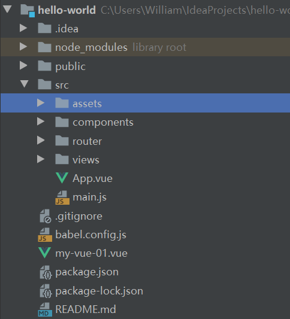

# Vue--Axios-ElementUI快速入门

## 一、安装必要工具

- node.js ：https://nodejs.org/zh-cn/
- npm淘宝镜像：windows下打开命令提示行(CMD)，执行npm install cnpm -g --registry=https://r.npm.taobao.org
- vue-cli：npm install -g @vue/cli  如果安装太慢可以使用淘宝镜像cnpm install -g @vue/cli

## 二、创建工程

### 2.1、创建项目

可以使用vue create \<app-name>

也可以进入图形化界面vue ui来创建项目

### 2.2、目录结构



- public文件夹：存放静态资源，不经过webpack编译，一般放置不会变动的文件，必须用绝对路径访问，比如网站图标、依赖js等。
- src/assets文件夹：同样为存放静态资源，会经过webpack编译，必须用相对路径访问
- src/components文件夹：公共组件
- src/router文件夹：路由配置文件
- App.vue：根组件
- main.js：入口文件

## 三、安装依赖

- Vue-Router：路由管理器，在项目路径下*npm* install *vue*-*router* --save-dev
- Axios：用于异步通信，类似于ajax，在项目路径下npm install --save axios vue-axios
- ElementUI：安装ElementUI需同时安装SASS，在项目路径下npm install element-ui -S
- Sass : npm install sass-loader node-sass --save-dev

## 四、vue-cli

### 4.1、vue文件基本组成

```vue
<template>
    <h1>用户列表</h1>
</template>

<script>
    export default {
        name: "UserList"
    }
</script>

<style scoped>

</style>
```

#### 4.1.2、template标签

template为页面组件，必须包裹在一个标签内

```html
<template>
    <!--错误-->
    <h1>用户列表</h1>
    <h1>单位属性</h1>
</template>
```

```html
<template>
    <!--正确-->
	<div>
        <h1>用户列表</h1>
        <h1>单位属性</h1>
    </div>
</template>
```

#### 4.1.3、script标签

存放JavaScript方法

export default与export的区别

1. export default 和export都可以用于导出常量，函数，文件，模块等；

2. 可以在模块中通过import+(常量 | 函数 | 文件 | 模块)名的方式，将其导入，以便能够对其进行使用

3. 在一个文件或者模块中，export,import可以有多个，但是export default只能有一个。

4. 通过export方式导出，在导入的时候需要加{}，export default不需要在导入的时候加{}

#### 4.1.4、style标签

存放样式

## 五、Axios异步通信

```js
import Axios from "axios";
import VueAxios from "vue-axios";
Vue.use(VueAxios,Axios)
```

### 5.1、axios基本语法

````js
axios({
  method:'get',
  url:'http://bit.ly/2mTM3nY',
  responseType:'stream'
})
  .then(function(response) {
  response.data.pipe(fs.createWriteStream('ada_lovelace.jpg'))
});
````

- method：创建请求时使用的方法

- utl：请求路径

- responseType：服务器响应的数据类型，可以是 'arraybuffer', 'blob', 'document', 'json', 'text', 'stream' ，其中json为默认类型

- then：请求后的方法，可以获取响应参数

  ```js
  axios.get('/user/12345')
    .then(function(response) {
      console.log(response.data);
      console.log(response.status);
      console.log(response.statusText);
      console.log(response.headers);
      console.log(response.config);
    });
  ```

## 六、vue-router

### 6.1、vue-rounter配置文件

首先创建vue-router配置文件router/index.js

在主入口配置

```js
import router from './router'
Vue.use(router);
new Vue({
  router
}).$mount('#app')
```

导入vue-router

```js
import Vue from "vue";
import VueRouter from "vue-router";
```

通过Vue.use使用插件

```js
Vue.use(VueRouter);
```

调用VueRouter

```js
export default new VueRouter({
    routes : [
        {
            
        }
    ]              
})
```

需要先导入组件

```js
import Main from '../views/Main';
import Login from "../views/Login";
import List from "../views/user/List";
import Profile from "../views/user/Profile";
import NotFound from "../views/NotFound";
```

然后配置到vue-router中

```js
export default new VueRouter({
    routes : [
        {
            path : '/login',
            name : 'Login',
            component : Login
        },
        {
            path: '/main',
            name: 'Main',
            component: Main,
            children : [
                {
                    path:'/user/list',
                    name:'UserList',
                    component: List
                },
                {
                    path: '/user/profile/:userId',
                    name: 'UserProfile',
                    component: Profile,
                    props:true
                },
                {
                    path:'/goHome',
                    name: 'GoHome',
                    redirect : '/main'
                }
            ]
        },
        {
            path: '*',
            component: NotFound

        }
    ]
});
```

其中children可以配置子组件

redirect可以重定向

可以设置默认路径，如果没找到页面则提示404

```js
{
    path: '*',
    component: NotFound
}
```

### 6.2、引用子组件

通过\<router-link>标签跳转到子组件

```html
<el-menu-item index="1-1">
    <router-link :to="{ name: 'UserProfile', params: { userId: 123 }}">个人信息</router-link>

</el-menu-item>
<el-menu-item index="1-2">
    <router-link to="/user/list">用户列表</router-link>
</el-menu-item>
<el-menu-item index="1-3">
    <router-link to="/goHome">回到首页</router-link>
</el-menu-item>
```

通过\<router-view>标签将子组件渲染到父组件

```html
<router-link :to="{name:'Main'}">首页</router-link>
<router-view></router-view>
```

to属性实质上就是将参数传入到router.push中

```js
// 字符串
router.push('home')

// 对象
router.push({ path: 'home' })

// 命名的路由
router.push({ name: 'user', params: { userId: '123' }})

// 带查询参数，变成 /register?plan=private
router.push({ path: 'register', query: { plan: 'private' }})
```

v-bind:to可以作用于对象，从而将参数传递给router.push

如上面的userId，可以通过{{$route.params.userId}}获取

## 七、ElementUI

创建ElementUI配置文件

plugins/element.js

```js
import Vue from 'vue'
import Element from 'element-ui'
import '../element-variables.scss'

Vue.use(Element)
```

在入口main.js引入element.js

```js
import './plugins/element.js'
import ElementUI from 'element-ui'
import "element-ui/lib/theme-chalk/index.css"
Vue.use(ElementUI)
import {
  Pagination,
  Dialog,
  Autocomplete,
  Dropdown,
  DropdownMenu,
  DropdownItem,
  Menu,
  Submenu,
  MenuItem,
  MenuItemGroup,
  Input,
  InputNumber,
  Radio,
  RadioGroup,
  RadioButton,
  Checkbox,
  CheckboxButton,
  CheckboxGroup,
  Switch,
  Select,
  Option,
  OptionGroup,
  Button,
  ButtonGroup,
  Table,
  TableColumn,
  DatePicker,
  TimeSelect,
  TimePicker,
  Popover,
  Tooltip,
  Breadcrumb,
  BreadcrumbItem,
  Form,
  FormItem,
  Tabs,
  TabPane,
  Tag,
  Tree,
  Alert,
  Slider,
  Icon,
  Row,
  Col,
  Upload,
  Progress,
  Spinner,
  Badge,
  Card,
  Rate,
  Steps,
  Step,
  Carousel,
  CarouselItem,
  Collapse,
  CollapseItem,
  Cascader,
  ColorPicker,
  Transfer,
  Container,
  Header,
  Aside,
  Main,
  Footer,
  Timeline,
  TimelineItem,
  Link,
  Divider,
  Image,
  Calendar,
  Backtop,
  PageHeader,
  CascaderPanel,
  Loading,
  MessageBox,
  Message,
  Notification
} from 'element-ui';

Vue.use(Pagination);
Vue.use(Dialog);
Vue.use(Autocomplete);
Vue.use(Dropdown);
Vue.use(DropdownMenu);
Vue.use(DropdownItem);
Vue.use(Menu);
Vue.use(Submenu);
Vue.use(MenuItem);
Vue.use(MenuItemGroup);
Vue.use(Input);
Vue.use(InputNumber);
Vue.use(Radio);
Vue.use(RadioGroup);
Vue.use(RadioButton);
Vue.use(Checkbox);
Vue.use(CheckboxButton);
Vue.use(CheckboxGroup);
Vue.use(Switch);
Vue.use(Select);
Vue.use(Option);
Vue.use(OptionGroup);
Vue.use(Button);
Vue.use(ButtonGroup);
Vue.use(Table);
Vue.use(TableColumn);
Vue.use(DatePicker);
Vue.use(TimeSelect);
Vue.use(TimePicker);
Vue.use(Popover);
Vue.use(Tooltip);
Vue.use(Breadcrumb);
Vue.use(BreadcrumbItem);
Vue.use(Form);
Vue.use(FormItem);
Vue.use(Tabs);
Vue.use(TabPane);
Vue.use(Tag);
Vue.use(Tree);
Vue.use(Alert);
Vue.use(Slider);
Vue.use(Icon);
Vue.use(Row);
Vue.use(Col);
Vue.use(Upload);
Vue.use(Progress);
Vue.use(Spinner);
Vue.use(Badge);
Vue.use(Card);
Vue.use(Rate);
Vue.use(Steps);
Vue.use(Step);
Vue.use(Carousel);
Vue.use(CarouselItem);
Vue.use(Collapse);
Vue.use(CollapseItem);
Vue.use(Cascader);
Vue.use(ColorPicker);
Vue.use(Transfer);
Vue.use(Container);
Vue.use(Header);
Vue.use(Aside);
Vue.use(Main);
Vue.use(Footer);
Vue.use(Timeline);
Vue.use(TimelineItem);
Vue.use(Link);
Vue.use(Divider);
Vue.use(Image);
Vue.use(Calendar);
Vue.use(Backtop);
Vue.use(PageHeader);
Vue.use(CascaderPanel);

Vue.use(Loading.directive);

Vue.prototype.$loading = Loading.service;
Vue.prototype.$msgbox = MessageBox;
Vue.prototype.$alert = MessageBox.alert;
Vue.prototype.$confirm = MessageBox.confirm;
Vue.prototype.$prompt = MessageBox.prompt;
Vue.prototype.$notify = Notification;
Vue.prototype.$message = Message;
new Vue({
  render: h => h(App)
}).$mount('#app')
```

具体使用可以参考element官网

