# 黑马JPA

## 第一章、ORM框架概述

ORM(Object-Relational Mapping)表示对象关系映射。在面向对象的软件开发中，通过ORM，就可以把对象关系映射到关系型数据库中。只要一套程序能够做到建立对象与数据库的关联，操作对象就可以直接操作数据库数据，就可以说这套程序实现了ORM对象关系映射。

简单的说：ORM就是建立实体类和数据库表之间的关系，从而达到操作实体类就相当于操作数据库表的目的。

### 1.1、为什么使用ORM

当实现一个应用程序时（不使用O/R Mapping），我们可能会写特别多数据访问层的代码，从数据库保存数据、修改数据、删除数据，而这些代码都是重复的。而使用ORM则会大大减少重复性代码。对象关系映射（Object Relational Mapping，简称ORM），主要实现程序对象到关系数据库数据的映射。

### 1.2、常见ORM框架

常见的orm框架：Mybatis（ibatis）、Hibernate、Jpa

## 第二章、Hibernate与JPA概述

### 2.1、Hibernate概述

Hibernate是一个开源的对象关系映射框架，它对JDBC进行了一个非常轻量级的对象封装，它将POJO与数据库表建立映射关系，是一个全自动的orm框架，Hibernate可以自动生成SQL语句，自动执行，使得JAVA程序员可以随心所欲的使用对象编程思维来操纵数据库。

### 2.2、JPA概述

JPA全称是Java Persistence API，即Java持久化API，是SUN公司推出的一套基于ORM的规范，内部是由接口和抽象类构成。

JPA通过JDK1.5注解描述对象-关系表的映射关系，并将运行期的实体对象持久化到数据库中。

### 2.3、JPA的优势

#### 1、标准化

JPA是JCP组织发布的Java EE标准之一，因此任何声称符合JPA标准的框架都遵循同样的架构，提供相同的访问API，这保证了基于JPA开发的企业应用能够经过少量的修改就能够在不同的JPA框架运行。

#### 2、容器级特性的支持

JPA框架中支持大数据集、事务、并发等容器级事务，这使得JPA超越了简单持久化框架的局限，在企业应用发挥更大的作用

#### 3、简单方便

JPA的主要目标之一就是提供更加简单的编程模型，在JPA框架下创建实体和创建JAVA类一样简单，没有任何的约束和限制，只需要使用javax.persistence.Entity进行注释，JPA框架和接口也都非常简单，没有太多特别的规则和设计模式的要求，开发者可以很容易的掌握。JPA基于非侵入式原则设计，因此可以很容易的和其他框架或者容器集成。

#### 4、查询能力

JPA的查询语言是面向对象而非面向数据库的，它以面向对象的自然语法构造查询语句，可以看成是Hibernate HQL的等价物。JPA定义了独特的JPQL(Java Persistence Query Language)，JPQL是EJB QL的一种扩展，它是针对实体的一种查询语句，操作对象是实体，而不是关系数据库的表，而且能够支持批量UPDATE、JOIN、GROUP BY，HAVING等通常只有SQL才能够提供的高级查询特性，甚至能够支持子查询

#### 5、高级特性

JPA中能够支持面向对象的高级特性，如类之间的继承、多态和类之间的复杂关系，这样的支持能够让开发者最大限度的使用面向对象的模型设计企业应用，而不需要自行处理这些特性在关系数据库的持久化。

### 2.4、JPA与Hibernate的关系

JPA规范本质上就是一种ORM规范，注意JPA不是ORM框架，因为JPA并未提供ORM实现，它只是指定了一些规范，提供了一些编程的API接口，但具体实现则由服务厂商来提供实现。

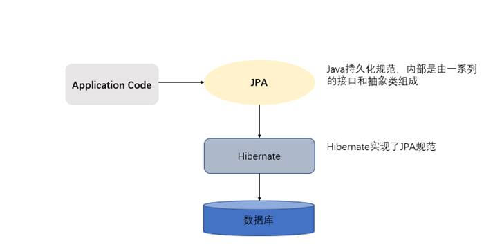

JPA和Hibernate的关系就像JDBC和JDBC驱动的关系，JPA是规范，Hibernate除了作为ORM框架之外，它也是一种JPA实现。也就是说使用JPA规范进行数据库操作，底层需要Hibernate作为其实现类完成数据持久化工作。

## 第三章、JPA搭建及基础使用

### 3.1、需求介绍

本章节我们是实现的功能是保存一个客户到数据库的客户表中。

### 3.2、开发包介绍

由于JPA是sun公司制定的API规范，所以我们不需要导入额外的JPA相关的jar包，只需要导入JPA的提供商的jar包。我们选择Hibernate作为JPA的提供商，所以需要导入Hibernate的相关jar包。

下载网址：

http://sourceforge.net/projects/hibernate/files/hibernate-orm/5.0.7.Final/

 页面显示如下图：

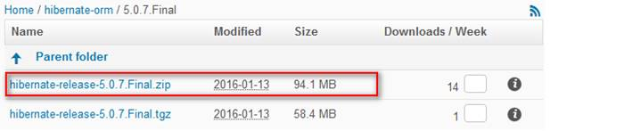

### 3.3、搭建开发环境

#### 3.3.1、导入jar包

对于JPA操作，只需要从hibernate提供的资料中找到我们需要的jar导入到工程中即可。

- 传统工程导入jar包 

  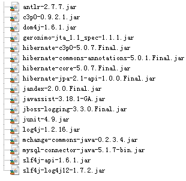

- maven工程导入坐标

  ```xml
    <properties>
  		<project.build.sourceEncoding>UTF-8</project.build.sourceEncoding>
  		<project.hibernate.version>5.0.7.Final</project.hibernate.version>
  	</properties>
  
  	<dependencies>
  		<!-- junit -->
  		<dependency>
  			<groupId>junit</groupId>
  			<artifactId>junit</artifactId>
  			<version>4.12</version>
  			<scope>test</scope>
  		</dependency>
  
  		<!-- hibernate对jpa的支持包 -->
  		<dependency>
  		<groupId>org.hibernate</groupId>
  			<artifactId>hibernate-entitymanager</artifactId>
  			<version>${project.hibernate.version}</version>
  		</dependency>
  
  		<!-- c3p0 -->
  		<dependency>
  			<groupId>org.hibernate</groupId>
  			<artifactId>hibernate-c3p0</artifactId>
  			<version>${project.hibernate.version}</version>
  		</dependency>
  
  		<!-- log日志 -->
  		<dependency>
  			<groupId>log4j</groupId>
  			<artifactId>log4j</artifactId>
  			<version>1.2.17</version>
  		</dependency>
  
  		<!-- Mysql and MariaDB -->
  		<dependency>
  			<groupId>mysql</groupId>
  			<artifactId>mysql-connector-java</artifactId>
  			<version>5.1.6</version>
  		</dependency>
  	</dependencies>
  ```


#### 3.3.2、创建客户的数据库表和客户的实体类

- 创建客户的数据库表

  ```sql
      /*创建客户表*/
      CREATE TABLE cst_customer (
          cust_id bigint(32) NOT NULL AUTO_INCREMENT COMMENT '客户编号(主键)',
          cust_name varchar(32) NOT NULL COMMENT '客户名称(公司名称)',
          cust_source varchar(32) DEFAULT NULL COMMENT '客户信息来源',
          cust_industry varchar(32) DEFAULT NULL COMMENT '客户所属行业',
          cust_level varchar(32) DEFAULT NULL COMMENT '客户级别',
          cust_address varchar(128) DEFAULT NULL COMMENT '客户联系地址',
          cust_phone varchar(64) DEFAULT NULL COMMENT '客户联系电话',
          PRIMARY KEY (`cust_id`)
      ) ENGINE=InnoDB AUTO_INCREMENT=1 DEFAULT CHARSET=utf8;
  ```

- 创建客户的实体类

  ```java
  public class Customer implements Serializable {
  
      private Long custId;
      private String custName;
      private String custSource;
      private String custIndustry;
      private String custLevel;
      private String custAddress;
      private String custPhone;
  ... getter setter
  }
  ```

#### 3.3.3、编写实体类和数据库表的映射配置[重点]

在实体类上使用JPA注解的形式配置映射关系

```java
/**
 * 所有的注解都是使用JPA规范提供的注解
 * 所以在导入注解包的时候，一定要导入javax.persistence下的
 */
@Entity//声明实体类
@Table(name = "cst_customer")//建立实体类和表之间的关系
public class Customer implements Serializable {

    @Id//声明当前私有属性为主键
    @GeneratedValue(strategy = GenerationType.IDENTITY)//配置主键的生成策略
    @Column(name = "cust_Id")//指定和表中cust_id字段的映射关系
    private Long custId;

    @Column(name="cust_name")//指定和表中cust_name字段的映射关系
    private String custName;

    @Column(name="cust_source")//指定和表中cust_source字段的映射关系
    private String custSource;

    @Column(name="cust_industry")//指定和表中cust_industry字段的映射关系
    private String custIndustry;

    @Column(name="cust_level")//指定和表中cust_level字段的映射关系
    private String custLevel;

    @Column(name="cust_address")//指定和表中cust_address字段的映射关系
    private String custAddress;
    
    @Column(name="cust_phone")//指定和表中cust_phone字段的映射关系
    private String custPhone;
 ... getter setter
}   
```

#### 3.3.4、配置JPA的核心配置文件

```xml
<?xml version="1.0" encoding="UTF-8"?>
<persistence xmlns="http://java.sun.com/xml/ns/persistence"
             xmlns:xsi="http://www.w3.org/2001/XMLSchema-instance"
             xsi:schemaLocation="http://java.sun.com/xml/ns/persistence
    http://java.sun.com/xml/ns/persistence/persistence_2_0.xsd"
             version="2.0">
    <!--
        配置持久化单元
            name：持久化单元名称
            transaction-type：事务类型
                RESOURCE_LOCAL：本地事务管理
                JTA：分布式事务管理
    -->
    <persistence-unit name="jpa_demo" transaction-type="RESOURCE_LOCAL">
        <!--配置JPA规范的服务提供商-->
        <provider>org.hibernate.jpa.HibernatePersistenceProvider</provider>
        <properties>
            <!--数据库驱动-->
            <property name="javax.persistence.jdbc.driver" value="com.mysql.jdbc.Driver"/>
            <!--数据库地址-->
            <property name="javax.persistence.jdbc.url" value="jdbc:mysql://localhost:3306/jpa_demo?useUnicode=true&amp;characterEncoding=UTF-8&amp;serverTimezone=Asia/Shanghai&amp;allowPublicKeyRetrieval=true&amp;verifyServerCertificate=false&amp;useSSL=false"/>
            <!--数据库用户名-->
            <property name="javax.persistence.jdbc.user" value="root"/>
            <!--数据库密码-->
            <property name="javax.persistence.jdbc.password" value="123456"/>

            <!--jpa提供者的可选配置：我们的JPA规范的提供者为hibernate，所以jpa的核心配置中兼容hibernate的配置-->
            <property name="hibernate.show_sql" value="true"/>
            <property name="hibernate.format_sql" value="true"/>
            <!--
            none:不用Hibernate自动生成表
            create:每次都会创建一个新的表(测试)
            create-drop:每次都会创建一个新的表，执行程序结束后删除这个表(测试)
            update:如果数据库中有表，使用原来的表，如果没有表，创建一个新表，可以更新表结构
            validate:只会使用原来的表，对映射关系进行校验
            -->
            <property name="hibernate.hbm2ddl.auto" value="create"/>
        </properties>
    </persistence-unit>
</persistence>
```

#### 3.3.4、实现保存操作

````java
public class JPADemoTest {
    @Test
    public void test(){
        /**
         * 创建实体管理类方法，借助persistence静态方法获取
         * 其中传递的参数为持久化单元名称，需要JPA文件中指定
         */
        EntityManagerFactory factory = Persistence.createEntityManagerFactory("jpa_demo");
        //创建实体管理类
        EntityManager entityManager = factory.createEntityManager();
        //获取事务对象
        EntityTransaction transaction = entityManager.getTransaction();
        //开启事务
        transaction.begin();
        Customer customer = new Customer();
        customer.setCustName("张三");
        //保存操作
        entityManager.persist(customer);
        //提交事务
        transaction.commit();
        //释放资源
        entityManager.close();
        factory.close();
    }
}
````

### 3.4、常用注解说明

- @Entity：指定当前类是实体类
- @Table：指定实体类和表之间的对应关系
  - name：指定数据库表的名称
  - comment：数据库表描述
- @Id：指定当前字段是主键
- @GenericGenerator：生成主键策略
  - name：主键生成策略名称
  - strategy：策略类型
    - uuid2: UUIDGenerator.class;
    - guid: GUIDGenerator.class;
    - uuid: UUIDHexGenerator.class;
    - uuid.hex: UUIDHexGenerator.class;
    - assigned: Assigned.class;
    - identity: IdentityGenerator.class;
    - select: SelectGenerator.class;
    - sequence: SequenceStyleGenerator.class;
    - seqhilo: SequenceHiLoGenerator.class;
    - increment: IncrementGenerator.class;
    - foreign: ForeignGenerator.class;
    - sequence-identity: 
    - SequenceIdentityGenerator.class;
    - enhanced-sequence: 
    - SequenceStyleGenerator.class;
    - enhanced-table: TableGenerator.class;
- @GeneratedValue：指定主键的生成方式
  - strategy：指定主键的生成策略
    - GenerationType.TABLE 使用一个额外的表来存储主键；
    - GenerationType.SEQUENCE 使用序列的方式存储，且需要数据库底层支持；
    - GenerationType.IDENTITY 由数据库生成，一般为主键自增等；
    - GenerationType.AUTO 表示由程序生成，不声明则默认为该属性；
- @Column：指定实体类属性和数据表之间的数据关系
  - name：指定数据库表的列名称
  - unique：是否唯一
  - nullable：是否可以为空
  - insertable：是否可以插入
  - updateable：是否可以更新
  - columnDefinition：定义建表时创建此列的DDL
  - table：当映射多个表时，指定表的表中的字段，默认值为主表表名
  - length：字段长度，仅对varchar类型的字段生效，默认长度为255；
  - precision：数字有效位，如长度为4，可以输入1234、123.4，但是不能输入12345
  - scale：小数点右位数，如长度为2，可以输入12.34，但不能输入12.345，与precision共同确定数字精度
  - secondaryTable：从表名。如果此列不建在主表上(默认建在主表)，该属性定义该列所在从表的名字搭建开发环境(重点)
- @Lob：指定持久属性或字段应作为大对象持久保存到数据库支持的大对象类型。
- @Basic：实体类与数据库字段映射时最简单的类型
  - fetch：加载方式
    - FetchType.EAGER：即使加载(默认值)
    - FetchType.LAZY：懒加载
  - optional：属性是否可空
    - true：可空(默认值)
    - false：不可空

### 3.5、JPA的主键生成策略

JPA通过annotation(注解)来映射hibernate实体，基于annotation的hibernate主键标识为@Id，其生成规则由@GeneratedValue设定，这里的@Id和@GeneratedValue都是JPA的标准做法

其中@GeneratedValue有以下四种策略

- IDENTITY：主键由数据库自动生成(主要是自动增长型)

  ```java
  @Id  
  @GeneratedValue(strategy = GenerationType.IDENTITY) 
  private Long custId;
  ```

- SEQUENCE：根据底层数据库的序列来生成主键，条件是数据库支持序列

  ```java
  @Id  
  @GeneratedValue(strategy = GenerationType.SEQUENCE,generator="payablemoney_seq")  
  @SequenceGenerator(name="payablemoney_seq", sequenceName="seq_payment")  
  private Long custId;
  
  //@SequenceGenerator源码中的定义
  @Target({TYPE, METHOD, FIELD})   
  @Retention(RUNTIME)  
  public @interface SequenceGenerator {  
      //表示该表主键生成策略的名称，它被引用在@GeneratedValue中设置的“generator”值中
      String name();  
      //属性表示生成策略用到的数据库序列名称。
      String sequenceName() default "";  
      //表示主键初识值，默认为0
      int initialValue() default 0;  
      //表示每次主键值增加的大小，例如设置1，则表示每次插入新记录后自动加1，默认为50
      int allocationSize() default 50;  
  }
  ```

- AUTO：主键由程序控制

  ```java
  @Id  
  @GeneratedValue(strategy = GenerationType.AUTO)  
  private Long custId;
  ```

- TABLE：使用一个特定的数据库表格来保存主键

  ```java
  @Id  
  @GeneratedValue(strategy = GenerationType.TABLE, generator="payablemoney_gen")  
  @TableGenerator(name = "pk_gen",  
                  table="tb_generator",  
                  pkColumnName="gen_name",  
                  valueColumnName="gen_value",  
                  pkColumnValue="PAYABLEMOENY_PK",  
                  allocationSize=1  
                 ) 
  
  private Long custId;
  //@TableGenerator的定义：
  @Target({TYPE, METHOD, FIELD})   
  @Retention(RUNTIME)  
  public @interface TableGenerator {  
      //表示该表主键生成策略的名称，它被引用在@GeneratedValue中设置的“generator”值中
      String name();  
      //表示表生成策略所持久化的表名，例如，这里表使用的是数据库中的“tb_generator”。
      String table() default "";  
      //catalog和schema具体指定表所在的目录名或是数据库名
            String catalog() default "";  
        String schema() default "";  
        //属性的值表示在持久化表中，该主键生成策略所对应键值的名称。例如在“tb_generator”中将“gen_name”作为主键的键值
        String pkColumnName() default "";  
        //属性的值表示在持久化表中，该主键当前所生成的值，它的值将会随着每次创建累加。例如，在“tb_generator”中将“gen_value”作为主键的值 
        String valueColumnName() default "";  
        //属性的值表示在持久化表中，该生成策略所对应的主键。例如在“tb_generator”表中，将“gen_name”的值为“CUSTOMER_PK”。 
        String pkColumnValue() default "";  
        //表示主键初识值，默认为0。 
        int initialValue() default 0;  
        //表示每次主键值增加的大小，例如设置成1，则表示每次创建新记录后自动加1，默认为50。
        int allocationSize() default 50;  
        UniqueConstraint[] uniqueConstraints() default {};  
  } 
  
  ```

  ```sql
  -- 这里应用表tb_generator，定义为
  CREATE TABLE  tb_generator (  
      id NUMBER NOT NULL,  
      gen_name VARCHAR2(255) NOT NULL,  
      gen_value NUMBER NOT NULL,  
      PRIMARY KEY(id)  
  )
  ```

### 3.6、JPA的API介绍

#### 3.6.1、Persistence对象

Persistence对象主要用于获取EntityManagerFactory对象。通过调用该类的createEntityManagerFactory静态方法，根据配置文件中持久化单元名称创建EntityManagerFactory

```java
/**
 * 创建实体管理类方法，借助persistence静态方法获取
 * 其中传递的参数为持久化单元名称，需要JPA文件中指定
 */
EntityManagerFactory factory = Persistence.createEntityManagerFactory("jpa_demo");
```

#### 3.6.2、EntityManagerFactory

EntityManagerFactory接口主要用来创建EntityManager实例

```java
//创建实体管理类
EntityManager entityManager = factory.createEntityManager();
```

由于EntityManagerFactory是一个线程安全的对象。并且EntityManagerFactory的创建及其浪费资源，所以在使用JPA编程时，我们可以对EntityManagerFactory的创建进行优化，只需要做到一个工程只存在一个EntityManagerFactory即可

#### 3.6.3、EntityManager

在JPA规范中，EntityManager是完成持久化操作的核心对象。实体类作为普通Java对象，只有在调用EntityManager将其持久化后才会变成持久化对象。EntityManager对象在一组实体类与底层数据源之间进行O/R映射的管理。它可以用来管理和更新Entity Bean，根据主键查找Entity Bean，还可以通过JPQL语句查询实体

我们可以通过调用EntityManager的方法完成获取事务，以及持久化数据库的操作

EntityManager：

- getTransaction：获取事务对象
- persist：保存操作
- merge：更新操作
- remove：删除操作
- find/getReference：根据ID查询

#### 3.6.4、EntityTransaction

在JPA规范中，EntityTransaction是完成事务操作的核心对象，对于EntityTransaction在我们的Java代码中承接功能比较简单

EntityTransaction

- begin：开启事务
- commit：提交事务
- rollback：回滚事务

## 第四章、JPA操作数据库

### 4.1、抽取JPAUtil工具类

```java
public final class JPAUtil {
    //JPA实体管理器工厂
    private static EntityManagerFactory em;
    //使用静态代码块赋值
    static{
        //注意：该方法参数必须和persistence.xml中persistence-unit标签name属性取值一致
        em = Persistence.createEntityManagerFactory("jpa_demo");
    }
	/**
     * 使用管理器工厂生产一个管理器对象
     * @return
     */
    public static EntityManager getEntityManager(){
        return em.createEntityManager();
    }
}
```

### 4.2、使用JPA完成增删改查操作

#### 4.2.1、保存

```java
/**
     * 保存一个实体
     */
@Test
public void testAdd(){
    //定义对象
    Customer customer = new Customer();
    customer.setCustName("苏茶");
    customer.setCustLevel("VVIP");
    customer.setCustSource("网络");
    customer.setCustIndustry("IT");
    customer.setCustAddress("拱墅区萍水街");
    customer.setCustPhone("1231112");
    EntityManager em = null;
    EntityTransaction tx = null;
    try {
        //获取实体管理对象
        em = JPAUtil.getEntityManager();
        //获取事务对象
        tx = em.getTransaction();
        //开启事务
        tx.begin();
        //执行操作
        em.persist(customer);
        //提交事务
        tx.commit();
    }catch (Exception e){
        //回滚事务
        tx.rollback();
        e.printStackTrace();
    }finally {
        //释放资源
        em.close();
    }
}
```

#### 4.2.2、修改

```java
@Test
public void testMerge(){
    //定义对象
    EntityManager em = null;
    EntityTransaction tx = null;
    try {
        //获取实体管理对象
        em = JPAUtil.getEntityManager();
        //获取事务对象
        tx = em.getTransaction();
        //开启事务
        tx.begin();
        //查找对象
        Customer customer1 = em.find(Customer.class, 2L);
        customer1.setCustName("李四");
        //把原对象从缓存中清除出去
        em.clear();
        em.merge(customer1);
        //提交事务
        tx.commit();
    }catch (Exception e){
        //回滚事务
        tx.rollback();
        e.printStackTrace();
    }finally {
        //释放资源
        em.close();
    }
}
```

#### 4.2.3、删除

```java
@Test
public void testRemove(){
    //定义对象
    EntityManager em = null;
    EntityTransaction tx = null;
    try {
        //获取实体管理对象
        em = JPAUtil.getEntityManager();
        //获取事务对象
        tx = em.getTransaction();
        //开启事务
        tx.begin();
        //删除对象
        Customer customer = em.find(Customer.class, 2L);
        em.remove(customer);
        //提交事务
        tx.commit();
    }catch (Exception e){
        //回滚事务
        tx.rollback();
        e.printStackTrace();
    }finally {
        //释放资源
        em.close();
    }
}
```

#### 4.2.4、根据id查询

```java
/**
 * 查找一个，使用立即加载策略
 */
@Test
public void testGetOne(){
    //定义对象
    EntityManager em = null;
    EntityTransaction tx = null;
    try {
        //获取实体管理对象
        em = JPAUtil.getEntityManager();
        //获取事务对象
        tx = em.getTransaction();
        //开启事务
        tx.begin();
        //查找对象
        Customer customer = em.find(Customer.class, 3L);
        Customer customer1 = em.find(Customer.class, 3L);
        System.out.println(customer == customer1);//输出结果为true，EntityManager也有缓存
        System.out.println(customer);
        //提交事务
        tx.commit();
    }catch (Exception e){
        //回滚事务
        tx.rollback();
        e.printStackTrace();
    }finally {
        //释放资源
        em.close();
    }
}
```

```java
/**
 * 查询一个：使用延迟加载策略
 */
@Test
public void testLoadOne(){
    //定义对象
    EntityManager em = null;
    EntityTransaction tx = null;
    try {
        //获取实体管理对象
        em = JPAUtil.getEntityManager();
        //获取事务对象
        tx = em.getTransaction();
        //开启事务
        tx.begin();
        //查找对象
        Customer customer = em.getReference(Customer.class,3L);
        Customer customer1 = em.getReference(Customer.class,3L);
        System.out.println(customer == customer1);//true
        System.out.println(customer);
        //提交事务
        tx.commit();
    }catch (Exception e){
        //回滚事务
        tx.rollback();
        e.printStackTrace();
    }finally {
        //释放资源
        em.close();
    }
}
```

find与getReference区别：

getReference延迟加载也叫作按需加载：如果不使用这个对象就不会查询

find如果没找到会返回null

getReference如果没找到会抛出EntityNotFoundException异常

### 4.3、JPA中的复杂查询

JPQL全称Java Persistence Query Language

基于首次在EJB2.0中引入的EJB查询语言(EJB QL)，Java持久化查询语言(JPQL)是一种可移植的查询语言，旨在以面向对象表达式语言的表达式，将SQL语法和简单查询语义绑定在一起，使用这种语言编写的查询是可移植的，可以被编译成所有主流数据库服务器上的SQL。

其特征与原生SQL语句类似，并且完全面向对象，通过类名和属性访问，而不是表名和表的属性

#### 4.3.1、查询全部

```java
@Test
public void findAll(){
    //定义对象
    EntityManager em = null;
    EntityTransaction tx = null;
    try {
        //获取实体管理对象
        em = JPAUtil.getEntityManager();
        //获取事务对象
        tx = em.getTransaction();
        //开启事务
        tx.begin();
        String jpql = "from Customer";
        Query query = em.createQuery(jpql);
        List list = query.getResultList();
        for (Object o : list) {
            System.out.println(o);
        }
        //提交事务
        tx.commit();
    }catch (Exception e){
        //回滚事务
        tx.rollback();
        e.printStackTrace();
    }finally {
        //释放资源
        em.close();
    }
}
```

#### 4.3.2、分页查询

```java
@Test
public void findPaged(){
    //定义对象
    EntityManager em = null;
    EntityTransaction tx = null;
    try {
        //获取实体管理对象
        em = JPAUtil.getEntityManager();
        //获取事务对象
        tx = em.getTransaction();
        //开启事务
        tx.begin();
        String jpql = "from Customer";
        Query query = em.createQuery(jpql);
        query.setFirstResult(4);
        query.setMaxResults(2);

        List list = query.getResultList();
        for (Object o : list) {
            System.out.println(o);
        }
        //提交事务
        tx.commit();
    }catch (Exception e){
        //回滚事务
        tx.rollback();
        e.printStackTrace();
    }finally {
        //释放资源
        em.close();
    }
}
```

#### 4.3.3、条件查询

```java
@Test
public void findCondition(){
    //定义对象
    EntityManager em = null;
    EntityTransaction tx = null;
    try {
        //获取实体管理对象
        em = JPAUtil.getEntityManager();
        //获取事务对象
        tx = em.getTransaction();
        //开启事务
        tx.begin();
        String jpql = "from Customer where custName like ?";
        
        Query query = em.createQuery(jpql);
        query.setParameter(1,"苏茶");

        List list = query.getResultList();
        for (Object o : list) {
            System.out.println(o);
        }
        //提交事务
        tx.commit();
    }catch (Exception e){
        //回滚事务
        tx.rollback();
        e.printStackTrace();
    }finally {
        //释放资源
        em.close();
    }
}
```

#### 4.3.4、排序查询

```java
@Test
public void testOrder(){
    //定义对象
    EntityManager em = null;
    EntityTransaction tx = null;
    try {
        //获取实体管理对象
        em = JPAUtil.getEntityManager();
        //获取事务对象
        tx = em.getTransaction();
        //开启事务
        tx.begin();
        String jpql = "from Customer order by custId desc";

        Query query = em.createQuery(jpql);

        List list = query.getResultList();
        for (Object o : list) {
            System.out.println(o);
        }
        //提交事务
        tx.commit();
    }catch (Exception e){
        //回滚事务
        tx.rollback();
        e.printStackTrace();
    }finally {
        //释放资源
        em.close();
    }
}
```

#### 4.3.5、统计查询

```java
@Test
public void findCount(){
    //定义对象
    EntityManager em = null;
    EntityTransaction tx = null;
    try {
        //获取实体管理对象
        em = JPAUtil.getEntityManager();
        //获取事务对象
        tx = em.getTransaction();
        //开启事务
        tx.begin();
        String jpql = "select count(custId) from Customer";

        Query query = em.createQuery(jpql);

        Object singleResult = query.getSingleResult();
        System.out.println(singleResult);
        //提交事务
        tx.commit();
    }catch (Exception e){
        //回滚事务
        tx.rollback();
        e.printStackTrace();
    }finally {
        //释放资源
        em.close();
    }
}
```

## 第五章、Spring Data JPA概述

### 5.1、Spring Data JPA概述

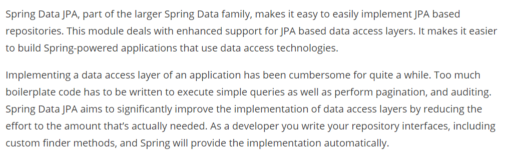

Spring Data JPA是Spring基于ORM框架、JPA规范的基础上封装的一套JPA应用框架，可使开发者用极简的代码即可实现对数据库的访问和操作。它提供了包括增删改查等在内的常用功能，且易于扩展。学习并使用Spring Data JPA可以极大提高开发效率

Spring Data JPA让我们解脱了DAO层的操作，基本上所有CRUD都可以依赖于它来实现，在实际的工作工程中，推荐使用Spring Data JPA + ORM(如：Hibernate)完成操作，这样在切换不同的ORM框架时提供了极大的方便，同时也使数据库层操作更加简单，方便解耦

### 5.2、Spring Data JPA的特性

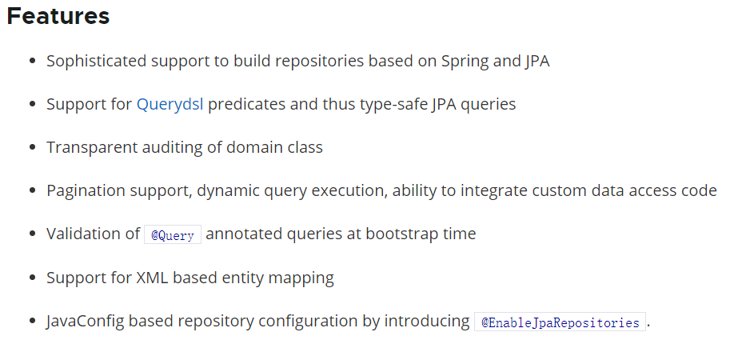

Spring Data JPA 极大简化了数据库访问层代码。通过Spring Data JPA，DAO层只需要写接口，就自动具有了增删改查、分页查询等方法。

### 5.3、Spring Data JPA 与 JPA 与 Hibernate之间的关系

JPA是一套规范，内部是有接口和抽象类组成的。Hibernate是一套成熟的全自动ORM框架，而且Hibernate实现了JPA规范，所以也可以称Hibernate为JPA的一种实现方式，我们使用JPA的API编程，意味着站在更高的角度上看待问题(面向接口编程)

Spring Data JPA是Spring提供的一套对JPA操作更加高级的封装，是在JPA规范下的专门用来进行数据持久化的解决方案。

## 第六章、Spring Data JPA搭建及基础使用

### 6.1、搭建Spring Data JPA的开发环境

#### 6.1.1、导入相关依赖

使用Spring Data JPA，需要整合Spring与Spring Data JPA，并且需要提供JPA的服务提供者Hibernate，所以需要导入Spring、Hibernate、数据库驱动等的依赖

```xml
  <properties>
        <spring.version>4.2.4.RELEASE</spring.version>
        <hibernate.version>5.0.7.Final</hibernate.version>
        <slf4j.version>1.6.6</slf4j.version>
        <log4j.version>1.2.12</log4j.version>
        <c3p0.version>0.9.1.2</c3p0.version>
        <mysql.version>5.1.6</mysql.version>
    </properties>

    <dependencies>
        <!-- junit单元测试 -->
        <dependency>
            <groupId>junit</groupId>
            <artifactId>junit</artifactId>
            <version>4.9</version>
            <scope>test</scope>
        </dependency>
        
        <!-- spring beg -->
        <dependency>
            <groupId>org.aspectj</groupId>
            <artifactId>aspectjweaver</artifactId>
            <version>1.6.8</version>
        </dependency>

        <dependency>
            <groupId>org.springframework</groupId>
            <artifactId>spring-aop</artifactId>
            <version>${spring.version}</version>
        </dependency>

        <dependency>
            <groupId>org.springframework</groupId>
            <artifactId>spring-context</artifactId>
            <version>${spring.version}</version>
        </dependency>

        <dependency>
            <groupId>org.springframework</groupId>
            <artifactId>spring-context-support</artifactId>
            <version>${spring.version}</version>
        </dependency>

        <dependency>
            <groupId>org.springframework</groupId>
            <artifactId>spring-orm</artifactId>
            <version>${spring.version}</version>
        </dependency>

        <dependency>
            <groupId>org.springframework</groupId>
            <artifactId>spring-beans</artifactId>
            <version>${spring.version}</version>
        </dependency>

        <dependency>
            <groupId>org.springframework</groupId>
            <artifactId>spring-core</artifactId>
            <version>${spring.version}</version>
        </dependency>
        
        <!-- spring end -->

        <!-- hibernate beg -->
        <dependency>
            <groupId>org.hibernate</groupId>
            <artifactId>hibernate-core</artifactId>
            <version>${hibernate.version}</version>
        </dependency>
        <dependency>
            <groupId>org.hibernate</groupId>
            <artifactId>hibernate-entitymanager</artifactId>
            <version>${hibernate.version}</version>
        </dependency>
        <dependency>
            <groupId>org.hibernate</groupId>
            <artifactId>hibernate-validator</artifactId>
            <version>5.2.1.Final</version>
        </dependency>
        <!-- hibernate end -->

        <!-- c3p0 beg -->
        <dependency>
            <groupId>c3p0</groupId>
            <artifactId>c3p0</artifactId>
            <version>${c3p0.version}</version>
        </dependency>
        <!-- c3p0 end -->

        <!-- log end -->
        <dependency>
            <groupId>log4j</groupId>
            <artifactId>log4j</artifactId>
            <version>${log4j.version}</version>
        </dependency>

        <dependency>
            <groupId>org.slf4j</groupId>
            <artifactId>slf4j-api</artifactId>
            <version>${slf4j.version}</version>
        </dependency>

        <dependency>
            <groupId>org.slf4j</groupId>
            <artifactId>slf4j-log4j12</artifactId>
            <version>${slf4j.version}</version>
        </dependency>
        <!-- log end -->

        
        <dependency>
            <groupId>mysql</groupId>
            <artifactId>mysql-connector-java</artifactId>
            <version>${mysql.version}</version>
        </dependency>

        <dependency>
            <groupId>org.springframework.data</groupId>
            <artifactId>spring-data-jpa</artifactId>
            <version>1.9.0.RELEASE</version>
        </dependency>

        <dependency>
            <groupId>org.springframework</groupId>
            <artifactId>spring-test</artifactId>
            <version>4.2.4.RELEASE</version>
        </dependency>
        
        <!-- el beg 使用spring data jpa 必须引入 -->
        <dependency>  
            <groupId>javax.el</groupId>  
            <artifactId>javax.el-api</artifactId>  
            <version>2.2.4</version>  
        </dependency>  
          
        <dependency>  
            <groupId>org.glassfish.web</groupId>  
            <artifactId>javax.el</artifactId>  
            <version>2.2.4</version>  
        </dependency> 
        <!-- el end -->
    </dependencies>
```

#### 6.1.2、整合Spring Data JPA与Spring

```xml
<?xml version="1.0" encoding="UTF-8"?>
<beans xmlns="http://www.springframework.org/schema/beans"
       xmlns:xsi="http://www.w3.org/2001/XMLSchema-instance" xmlns:aop="http://www.springframework.org/schema/aop"
       xmlns:context="http://www.springframework.org/schema/context"
       xmlns:jdbc="http://www.springframework.org/schema/jdbc" xmlns:tx="http://www.springframework.org/schema/tx"
       xmlns:jpa="http://www.springframework.org/schema/data/jpa" xmlns:task="http://www.springframework.org/schema/task"
       xsi:schemaLocation="
      http://www.springframework.org/schema/beans http://www.springframework.org/schema/beans/spring-beans.xsd
      http://www.springframework.org/schema/aop http://www.springframework.org/schema/aop/spring-aop.xsd
      http://www.springframework.org/schema/context http://www.springframework.org/schema/context/spring-context.xsd
      http://www.springframework.org/schema/jdbc http://www.springframework.org/schema/jdbc/spring-jdbc.xsd
      http://www.springframework.org/schema/tx http://www.springframework.org/schema/tx/spring-tx.xsd
      http://www.springframework.org/schema/data/jpa 
      http://www.springframework.org/schema/data/jpa/spring-jpa.xsd">

    <!--dataSource配置数据库连接池-->
    <bean id="dataSource" class="com.mchange.v2.c3p0.ComboPooledDataSource">
        <property name="driverClass" value="com.mysql.jdbc.Driver"/>
        <property name="jdbcUrl" value="jdbc:mysql://localhost:3306/jpa_demo?useUnicode=true&amp;characterEncoding=UTF-8&amp;serverTimezone=Asia/Shanghai&amp;allowPublicKeyRetrieval=true&amp;verifyServerCertificate=false&amp;useSSL=false"/>
        <property name="user" value="root"/>
        <property name="password" value="123456"/>
    </bean>
    <!--配置entityManagerFactory对象交给spring容器管理-->
    <bean id="entityManagerFactory" class="org.springframework.orm.jpa.LocalContainerEntityManagerFactoryBean">
        <property name="dataSource" ref="dataSource"/>
        <!--扫描实体类包位置-->
        <property name="packagesToScan" value="com.shary.entity"/>
        <!--jpa实现厂家-->
        <property name="persistenceProvider">
            <bean class="org.hibernate.jpa.HibernatePersistenceProvider"/>
        </property>
        <!--JPA供应商适配器-->
        <property name="jpaVendorAdapter">
            <bean class="org.springframework.orm.jpa.vendor.HibernateJpaVendorAdapter">
                <!--是否自动创建数据库-->
                <property name="generateDdl" value="false"/>
                <!--指定数据库类型-->
                <property name="database" value="MYSQL"/>
                <!--数据库方言-->
                <property name="databasePlatform" value="org.hibernate.dialect.MySQLDialect"/>
                <!--是否显示sql语句-->
                <property name="showSql" value="true"/>
            </bean>
        </property>
        <!--jpa方言，不同JPA框架(Hibernate,openjpa,eclipselink)有自己不同的实现方式，比如说一级缓存和二级缓存，通过JPA方言配置可以统一管理-->
        <property name="jpaDialect">
            <bean class="org.springframework.orm.jpa.vendor.HibernateJpaDialect"/>
        </property>
    </bean>
    <!--事务管理器-->
    <!--JPA事务管理器-->
    <bean id="transactionManager" class="org.springframework.orm.jpa.JpaTransactionManager">
        <property name="entityManagerFactory" ref="entityManagerFactory"/>
    </bean>

    <!--整合spring data jpa-->
    <jpa:repositories base-package="com.shary.dao" transaction-manager-ref="transactionManager" entity-manager-factory-ref="entityManagerFactory"/>

    <!--声明式事务-->
<!--    <tx:advice id="txAdvice" transaction-manager="transactionManager">-->
<!--        <tx:attributes>-->
<!--            <tx:method name="save*" propagation="REQUIRED"/>-->
<!--            <tx:method name="insert*" propagation="REQUIRED"/>-->
<!--            <tx:method name="update*" propagation="REQUIRED"/>-->
<!--            <tx:method name="delete*" propagation="REQUIRED"/>-->
<!--            <tx:method name="get*" read-only="true"/>-->
<!--            <tx:method name="find*" read-only="true"/>-->
<!--            <tx:method name="*" propagation="REQUIRED"/>-->
<!--        </tx:attributes>-->
<!--    </tx:advice>-->
<!--    <aop:config>-->
<!--        <aop:pointcut id="pointcut" expression="execution(* com.shary.service.*.*(..))"/>-->
<!--        <aop:advisor advice-ref="txAdvice" pointcut-ref="pointcut"/>-->
<!--    </aop:config>-->
    
    <context:component-scan base-package="com.shary"/>
</beans>
```

#### 6.1.3、使用JPA注解配置映射关系

```java
/**
 * 所有的注解都是使用JPA规范提供的注解
 * 所以在导入注解包的时候，一定要导入javax.persistence下的
 */
@Entity//声明实体类
@Table(name = "cst_customer")//建立实体类和表之间的关系
public class Customer implements Serializable {

    @Id//声明当前私有属性为主键
    @GeneratedValue(strategy = GenerationType.IDENTITY)//配置主键的生成策略
    @Column(name = "cust_Id",insertable = true)//指定和表中cust_id字段的映射关系
    private Long custId;

    @Column(name="cust_name",updatable = true)//指定和表中cust_name字段的映射关系
    private String custName;

    @Column(name="cust_source")//指定和表中cust_source字段的映射关系
    private String custSource;

    @Column(name="cust_industry")//指定和表中cust_industry字段的映射关系
    private String custIndustry;

    @Column(name="cust_level")//指定和表中cust_level字段的映射关系
    private String custLevel;

    @Column(name="cust_address")//指定和表中cust_address字段的映射关系
    private String custAddress;
    
    @Column(name="cust_phone")//指定和表中cust_phone字段的映射关系
    private String custPhone;
    ... getter setter
}
```

### 6.2、使用Spring Data JPA完成需求

#### 6.2.1、编写符合Spring Data JPA规范的Dao层接口

1. 创建一个Dao层接口，并实现JpaRepository和JpaSpecificationExecutor
2. 提供相应的泛型

```java
/**
 * JpaRepository<实体类型,主键类型>：用来完成基本CRUD功能
 * JpaSpecificationExecutor<实体类型>：用于复杂查询(分页等查询操作)
 */
public interface CustomerDao extends JpaRepository<Customer,Long>, JpaSpecificationExecutor<Customer> {
    
}
```

这样就定义好了一个符合Spring Data JPA规范的Dao层接口

#### 6.2.2、完成基本CRUD操作

完成了Spring Data JPA的环境搭建，并且编写了符合Spring Data JPA规范的Dao层接口之后，就可以使用定义好的Dao层接口进行客户的基本CRUD操作

```java
@RunWith(SpringJUnit4ClassRunner.class)
@ContextConfiguration(locations = "classpath:applicationContext.xml")
public class CustomerDaoTest {
    @Autowired
    CustomerDao customerDao;

    /**
     * 保存客户，调用save(obj)方法
     */
    @Test
    public void testSave(){
        Customer customer = new Customer();
        customer.setCustName("老九");
        customerDao.save(customer);
    }

    /**
     * 修改客户：调用save(obj)方法
     * 对于save方法的解释：如果执行此方法是对象中存在id属性，即为更新操作会根据id查询，再更新
     * 如果执行此方法中对象不存在id属性，即为保存操作
     */
    @Test
    public void testUpdate(){
        Customer customer = customerDao.findOne(3L);
        customer.setCustName("茶苏");
        customerDao.save(customer);
    }

    /**
     * 根据id删除：调用delete(id)方法
     */
    @Test
    public void testDelete(){
        customerDao.delete(9L);
    }

    /**
     * 根据id查询：调用findOne(id)方法
     */
    @Test
    public void testFindById(){
        Customer customer = customerDao.findOne(1L);
        System.out.println(customer);
    }
}
```

## 第七章、Spring Data JPA搭建及基础使用

### 7.1、Spring Data JPA的常用接口分析

在客户的案例中，可以发现在自定义的CustomerDao中，并没有提供任何的方法就可以使用很多的方法，因为它继承了JpaRepository和JpaSpecificationExecutor，所以我们可以使用这两个接口的所有方法

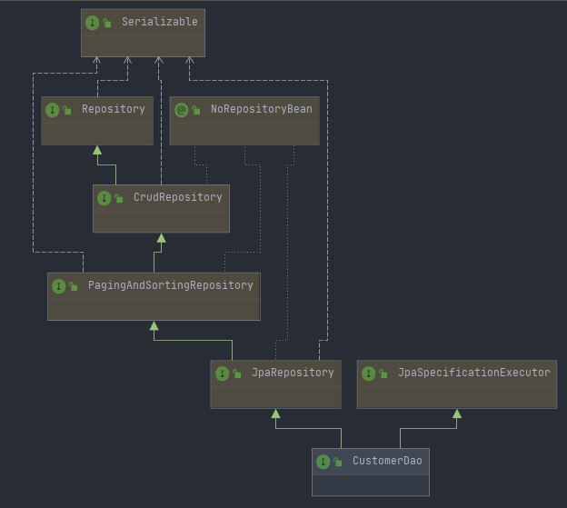

在使用Spring Data JPA时，一般实现JpaRepository和JpaSpecificationExecutor，这样就可以定义这些方法中定义的所有方法

### 7.2、Spring Data JPA 的实现过程

通过对客户的案例，以debug断点调试的方法，通过分析Spring Data JPA的原理来分析程序的执行过程。

先以findOne方法为例进行分析

- 代理子类的实现过程

  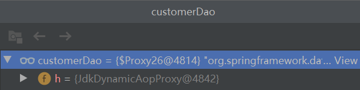

  通过断点可以看到，customerDao对象，实质上是通过JdkDynamicAopProxy生成的一个代理对象

- 代理对象中方法调用的分析

  当程序执行的时候，会通过JdkDynamicAopProxy的invoke方法，对customerDao对象生成动态代理对象。根据Spring Data JPA介绍而知，想要进行findOne查询方法，最终还是会通过JPA规范的API来完成操作，而这些API则都是通过JdkDynamicAopProxy生成的动态代理对象当中，而这个动态代理对象就是SimpleJpaRepository

  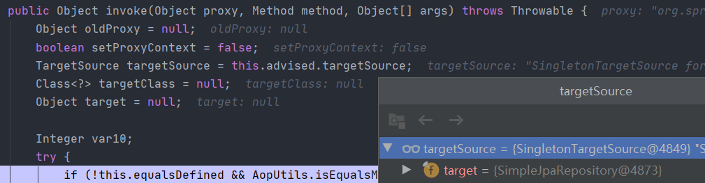

  通过SimpleJpaRepository源码分析，定位到了findOne方法，在此方法中，返回em.find()的返回结果

  ```java
  //JPA规范中定义的entityManager
  private final EntityManager em;
  public T findOne(ID id) {
      Assert.notNull(id, "The given id must not be null!");
      Class<T> domainType = this.getDomainClass();
      if (this.metadata == null) {
          return this.em.find(domainType, id);
      } else {
          LockModeType type = this.metadata.getLockModeType();
          Map<String, Object> hints = this.getQueryHints();
          return type == null ? this.em.find(domainType, id, hints) : this.em.find(domainType, id, type, hints);
      }
  }
  ```

  em就是EntityManager对象，而他是JPA原生的实现方式，所以可以得出结论Spring Data JPA只是对标准JPA操作进行了进一步封装，简化了Dao层代码的开发

### 7.3、Spring Data JPA完整的调用过程分析

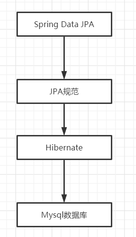

## 第八章、Spring Data JPA的查询方式

### 8.1、使用Spring Data JPA中接口定义的方法进行查询

在继承JpaRepository和JpaSpecificationExecutor接口后，就可以使用接口中定义的方法进行查询

- 继承JpaRepository后的方法列表

  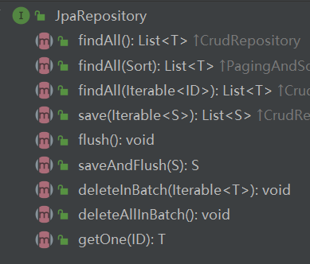

- 继承JpaSpecificationExecutor后的方法列表

  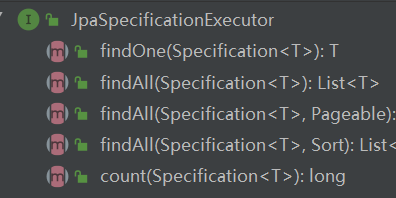

### 8.2、使用JPQL的方式查询

使用Spring Data JPA提供的查询方法已经可以解决大部分的应用场景，但是对于某些业务来说，我们还需要灵活的构造查询条件，这时就可以使用@Query注解，结合JPQL的语句方式完成查询

@Query注解，只需在方法上面标注该注解，同时提供一个JPQL查询语句即可

```java
/**
 * JpaRepository<实体类型,主键类型>：用来完成基本CRUD功能
 * JpaSpecificationExecutor<实体类型>：用于复杂查询(分页等查询操作)
 */
public interface CustomerDao extends JpaRepository<Customer,Long>, JpaSpecificationExecutor<Customer> {

    //@Query使用jpql方式进行查询
    @Query(value = "from Customer")
    public List<Customer> findAllCustomer();

    //@Query使用jpql方式查询，其中?1代表参数的占位符，其中1对应方法中的参数索引
    @Query(value = "from Customer where custName = ?1")
    public Customer findCustomer(String custName);
    


}
```

此外，也可以通过使用@Query来执行一个更新操作，为此，使用@Query的同时，用@Modifying来将该操作标识为修改查询，还要@Transactional注解确定为声明式事务，这样框架最终会生成一个更新的操作，而非查询

```java
@Transactional
@Query(value = "update Customer set custName = ?1 where custId = ?2")
@Modifying
public void updateCustomer(String custName,Long custId);
```

### 8.3、使用SQL语句查询

Spring Data JPA同时也支持sql语句的查询

```java
@Query(value = "select * from cst_customer",nativeQuery = true)
public List<Customer> findSql();
```
### 8.4、方法命名规则查询

顾名思义，方法命名规则查询就是根据方法的名字，就能创建查询。只需要按照Spring Data JPA提供的方法命名规则定义方法的名词，就可以完成查询工作。Spring Data JPA在程序执行的时候会根据方法名称进行解析，并自动生成查询语句进行查询

按照Spring Data JPA定义的规则，查询方法以findBy开头，涉及条件查询时，条件的属性用条件关键字连接，要注意的是：条件属性首字母需大写。框架在进行方法名解析时，会先把方法名多余的前缀截取掉，然后对剩下的部分进行解析。

```java
//方法命名方式查询
public Customer findByCustName(String custName);
```

具体的关键字，使用方法和生产成SQL如下表所示

| **Keyword**   | **Sample**                                | **JPQL**                                      |
| ------------- | ----------------------------------------- | --------------------------------------------- |
| And           | findByLastnameAndFirstname                | …  where x.lastname = ?1 and x.firstname = ?2 |
| Or            | findByLastnameOrFirstname                 | …  where x.lastname = ?1 or x.firstname = ?2  |
| Is,Equals     | findByFirstnameIs,  findByFirstnameEquals | …  where x.firstname = ?1                     |
| Between       | findByStartDateBetween                    | …  where x.startDate between ?1 and ?2        |
| LessThan      | findByAgeLessThan                         | …  where x.age < ?1                           |
| LessThanEqual | findByAgeLessThanEqual                    | …  where x.age ⇐ ?1                           |
| GreaterThan       | findByAgeGreaterThan           | …  where x.age > ?1                                          |
| GreaterThanEqual  | findByAgeGreaterThanEqual      | …  where x.age >= ?1                                         |
| After             | findByStartDateAfter           | …  where x.startDate > ?1                                    |
| Before            | findByStartDateBefore          | …  where x.startDate < ?1                                    |
| IsNull            | findByAgeIsNull                | …  where x.age is null                                       |
| IsNotNull,NotNull | findByAge(Is)NotNull           | …  where x.age not null                                      |
| Like              | findByFirstnameLike            | …  where x.firstname like ?1                                 |
| NotLike           | findByFirstnameNotLike         | … where  x.firstname not like ?1                             |
| StartingWith      | findByFirstnameStartingWith    | …  where x.firstname like ?1 (parameter bound with appended %) |
| EndingWith        | findByFirstnameEndingWith      | …  where x.firstname like ?1 (parameter bound with prepended %) |
| Containing        | findByFirstnameContaining      | …  where x.firstname like ?1 (parameter bound wrapped in %)  |
| OrderBy           | findByAgeOrderByLastnameDesc   | …  where x.age = ?1 order by x.lastname desc                 |
| Not               | findByLastnameNot              | …  where x.lastname <> ?1                                    |
| In                | findByAgeIn(Collection ages)   | …  where x.age in ?1                                         |
| NotIn             | findByAgeNotIn(Collection age) | …  where x.age not in ?1                                     |
| TRUE              | findByActiveTrue()             | …  where x.active = true                                     |
| FALSE             | findByActiveFalse()            | …  where x.active = false                                    |
| IgnoreCase | findByFirstnameIgnoreCase | …  where UPPER(x.firstame) = UPPER(?1) |

## 第九章、Specifications动态查询

如果查询一个实体的时候，给定的条件不是固定的，这是就需要构建相应的查询语句，在Spring Data JPA中可以通过JPASpecificationExecutor接口查询。相比JPQL，其优势是类型安全，更加的面向对象。

```java
/**
*
*/
public interface JpaSpecificationExecutor<T> {
    //根据条件查询一个对象
    T findOne(Specification<T> var1);
	//根据条件查询集合
    List<T> findAll(Specification<T> var1);
	//根据条件分页查询
    Page<T> findAll(Specification<T> var1, Pageable var2);
	//排序查询
    List<T> findAll(Specification<T> var1, Sort var2);
	//统计查询
    long count(Specification<T> var1);
}
```

对于JpaSpecificationExecutor，这个接口基本是围绕着Specification接口来定义的。我们可以简单的理解为，Specification构造的就是查询条件

```java
public interface Specification<T> {
	/**
	 * @param root：Root接口，代表查询的根对象，可以通过root获取实体中的属性
	 * @param query：代表一个顶层查询对象，用来自定义查询
	 * @param cb：用来构建查询，此对象里有很多条件方法 
	 */
	Predicate toPredicate(Root<T> root, CriteriaQuery<?> query, CriteriaBuilder cb);
}
```

### 9.1、使用Specifications完成查询

```java
    @Test
    public void testSpecifications(){
        //通过lambda表达式，实现toPredicate方法
        Specification<Customer> spec = (Root<Customer> root, CriteriaQuery<?> query, CriteriaBuilder cb) ->
                //cb构件查询，添加查询方式 like：模糊匹配
                //root:从实体Customer对象中按照custName属性进行查询
                cb.like(root.get("custName").as(String.class),"苏%");
        Customer customer = customerDao.findOne(spec);
        System.out.println(customer);
    }
```

### 9.2、基于Specifications的分页查询

```java
	@Test
    public void testPage(){
        Specification<Customer> spec = (Root<Customer> root,CriteriaQuery<?> query,CriteriaBuilder cb) ->                cb.like(root.get("custName").as(String.class),"苏%");
        /*
         * 构造分页参数
         * Pageable：接口
         *  pageRequest实现了Pageable接口，调用构造方法的形式构造
         *      第一个参数：页码（从0开始）
         *      第二个参数：每页查询条数
         */
        Pageable pageable = new PageRequest(1, 2);
        /*
         * 分页查询，封装为Spring Data JPA内部的page bean
         *      此重载的findAll方法为分页方法需要两个参数
         *      第一个参数：查询条件Specification
         *      第二个参数，分页参数
         */
        Page<Customer> page = customerDao.findAll(spec,pageable);
        for (Customer customer : page) {
            System.out.println(customer);
        }
    }
```

对于Spring Data JPA中的分页查询，是其内部自动实现的封装过程，返回的是一个Spring Data JPA提供的pageBean对象。其中的方法说明如下：

```java
public interface Page<T> extends Slice<T> {
    //获取总页数
    int getTotalPages();
	//获取总记录数
    long getTotalElements();
	//获取列表数据
    <S> Page<S> map(Converter<? super T, ? extends S> var1);
}
```

### 9.3、方法对应关系

| 方法名称                    | Sql对应关系           |
| --------------------------- | --------------------- |
| equle                       | filed =  value        |
| gt（greaterThan ）          | filed  > value        |
| lt（lessThan ）             | filed  < value        |
| ge（greaterThanOrEqualTo ） | filed  >= value       |
| le（ lessThanOrEqualTo）    | filed  <= value       |
| notEqule                    | filed  != value       |
| like                        | filed  like value     |
| notLike                     | filed  not like value |

## 第十章、多表设计

### 10.1、表之间关系划分

数据库中多表之间存在着三种关系，如图所示。

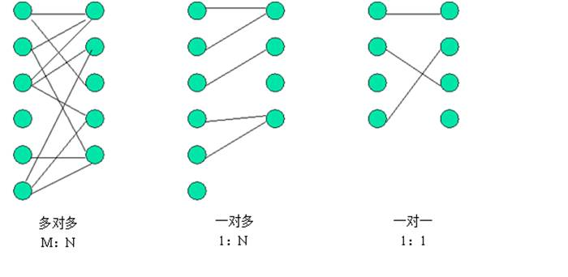

从图可以看出，系统设计的三种实体关系分别为：多对多、一对多和一对一关系。注意：一对多关系可以看为两种： 即一对多，多对一。所以说四种更精确。

明确： 我们今天只涉及实际开发中常用的关联关系，一对多和多对多。而一对一的情况，在实际开发中几乎不用。

### 10.1、在JPA框架中表关系的分析步骤

在实际开发中，数据库的表难免会有相互的关联关系，在操作表就有可能会涉及到多张表的操作。而在这种实现了ORM思想的框架中(如JPA)，就可以通过操作实体类就实现对操作库表的操作。

- 第一步：首先确定两张表之间的关系

  如果关系确定错了，后面做的所有操作就都不可能正确。

- 第二步：在数据库中实现两张表的关系

- 第三步：在实体类中描述出两个实体的关系

- 第四步：配置出实体类和数据库表的关系映射(重点)

### 10.2、JPA中的一对多

在一对多关系中，我们习惯把一的一方称之为主表，把多的一方称之为从表。在数据库中建立一对多的关系，需要使用数据库的外键约束。

外键：指的是从表中有一列，取值参照主表的主键，这一列就是外键。

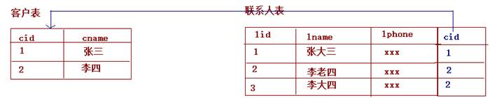

### 10.3、实体类关系建立以及映射配置

在实体类中，由于客户是少的一方，它应该包含多个联系人，所以实体类要体现出客户中有多个联系人的信息。

```java
@Entity//声明实体类
@Table(name = "cst_customer")//建立实体类和表之间的关系
public class Customer implements Serializable {

    @Id//声明当前私有属性为主键
    @GeneratedValue(strategy = GenerationType.IDENTITY)//配置主键的生成策略
    @Column(name = "cust_Id",insertable = true)//指定和表中cust_id字段的映射关系
    private Long custId;

    @Column(name="cust_name",updatable = true)//指定和表中cust_name字段的映射关系
    private String custName;

    @Column(name="cust_source")//指定和表中cust_source字段的映射关系
    private String custSource;

    @Column(name="cust_industry")//指定和表中cust_industry字段的映射关系
    private String custIndustry;

    @Column(name="cust_level")//指定和表中cust_level字段的映射关系
    private String custLevel;

    @Column(name="cust_address")//指定和表中cust_address字段的映射关系
    private String custAddress;
    
    @Column(name="cust_phone")//指定和表中cust_phone字段的映射关系
    private String custPhone;

    @OneToMany(targetEntity = LinkMan.class,cascade = CascadeType.ALL)
    @JoinColumn(name = "ikm_cust_id",referencedColumnName = "cust_id")
    private Set<LinkMan> linkmans = new HashSet<>();
}
```

由于联系人是多的一方，在实体类中要体现出，每个联系人只能对应一个客户

```java
@Entity
@Table(name = "cst_linkman")
public class LinkMan implements Serializable {
    @Id
    @GeneratedValue(strategy = GenerationType.IDENTITY)
    @Column(name = "ikm_id")
    private Long ikmId;
    @Column(name = "ikm_name")
    private String ikmName;
    @Column(name = "ikm_gender")
    private String ikmGender;
    @Column(name = "ikm_phone")
    private String ikmPhone;
    @Column(name = "ikm_mobile")
    private String ikmMobile;
    @Column(name = "ikm_email")
    private String ikmEmail;
    @Column(name = "ikm_position")
    private String ikmPosition;
    @Column(name = "ikm_memo")
    private String ikmMemo;

    @ManyToOne(targetEntity = Customer.class,fetch = FetchType.LAZY)
    @JoinColumn(name = "ikm_cust_id",referencedColumnName = "cust_id")
    private Customer customer;
}
```

### 10.4、一对多的操作

#### 10.4.1、添加

```java
@RunWith(SpringJUnit4ClassRunner.class)
@ContextConfiguration(locations = "classpath:applicationContext.xml")
public class CustomerManyTest {
    @Autowired
    private CustomerDao customerDao;

    @Autowired
    private LinkManDao linkManDao;

    @Test
    @Transactional//开启事务
    @Rollback(false)//不设置回滚
    public void testAdd(){
        Customer customer = new Customer();
        customer.setCustName("TBD云集中心");
        customer.setCustPhone("12345689");
        customer.setCustAddress("七里亭一村");
        customer.setCustLevel("VVIP");
        customer.setCustIndustry("商业办公");
        customer.setCustSource("网络");

        LinkMan linkMan = new LinkMan();
        linkMan.setIkmName("客户一号");
        linkMan.setIkmGender("男");
        linkMan.setIkmPhone("1234567");
        linkMan.setIkmMobile("1234567");
        linkMan.setIkmEmail("William@qwq.com");
        linkMan.setIkmPosition("学生");
        linkMan.setIkmMemo("这不想记啥都行");

        customer.getLinkmans().add(linkMan);
        linkMan.setCustomer(customer);

        customerDao.save(customer);
        linkManDao.save(linkMan);
    }
}
```

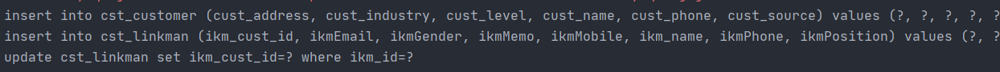

通过保存的案例，可以发现在设置了双向关系之后，会发送两条insert语句，一条多余的update语句，解决这个问题的思路很简单，就是一的一方放弃维护权

```java
//    @OneToMany(targetEntity = LinkMan.class)
//    @JoinColumn(name = "ikm_cust_id",referencedColumnName = "cust_id")
    //放弃外键维护权
    @OneToMany(mappedBy = "customer",cascade = CascadeType.ALL)
    private Set<LinkMan> linkmans = new HashSet<>();
```

#### 10.4.2、删除

```java
@Test
@Transactional
@Rollback(false)
public void testDelete(){
    customerDao.delete(12L);
}
```

删除操作的说明如下：

- 删除从表数据：可以随时任意删除。

- 删除主表数据：
  1. 在默认情况下，它会把外键字段置为null，然后删除主表数据。如果在数据库的表结构上，外键字段有非空约束，默认情况就会报错了，
  2. 如果配置了放弃维护关联关系的权利，则不能删除(与外键字段是否允许为null没有关系)，因为在删除时，它根本不会去更新从表的外键字段了。
  3. 如果还想删除，使用级联删除引用
- 没有从表数据引用，随便删

在实际开发中，级联删除要慎重使用！

#### 10.4.3、级联操作

级联操作：指操作一个对象同时操作它的关联对象

只需要在操作主体的注解上配置cascade

cascade

- CascadeType.MERGE 级联更新
- CascadeType.PERSIST 级联保存：
- CascadeType.REFRESH 级联刷新：
- CascadeType.REMOVE 级联删除：
- CascadeType.ALL  包含所有

```java
@OneToMany(mappedBy="customer",cascade=CascadeType.ALL)
```

### 10.5、JPA中的多对多

#### 10.5.1、表关系建立

多对多的表关系建立靠的是中间表，其中用户表和中间表的关系是一对多，角色表和中间表的关系也是一对多

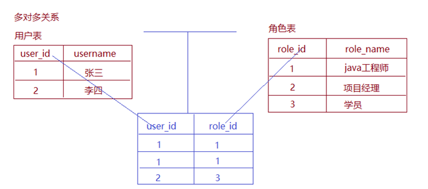

#### 10.5.2、实体类关系建立以及映射配置

一个用户可以具有多个角色，所以在用户实体类中应该包含多个角色的信息

```java
@Entity
@Table(name="sys_user")
public class SysUser implements Serializable {
    @Id
    @GeneratedValue(strategy = GenerationType.IDENTITY)
    @Column(name = "user_id")
    private Long userId;
    @Column(name = "user_code")
    private String userCode;
    @Column(name = "user_name")
    private String userName;
    @Column(name = "user_password")
    private String userPassword;
    @Column(name = "user_state")
    private String userState;

    @ManyToMany(targetEntity = SysRole.class,cascade = CascadeType.ALL)
    @JoinTable(name = "sys_user_role",
            //joinColumns,当前对象在中间表中的外键
            joinColumns = {@JoinColumn(name = "sys_user_id",referencedColumnName = "user_id")},
            //inverseJoinColumns，对方对象在中间表的外键
            inverseJoinColumns = {@JoinColumn(name = "sys_role_id",referencedColumnName = "role_id")}
    )
    private Set<SysRole> roles = new HashSet<>();
}
```

一个角色可以赋予多个用户，所以在角色实体类中应该包含多个用户的信息

```java
@Entity
@Table(name = "sys_role")
public class SysRole implements Serializable {
    @Id
    @GeneratedValue(strategy = GenerationType.IDENTITY)
    @Column(name = "role_id")
    private Long roleId;
    @Column(name = "role_name")
    private String roleName;
    @Column(name = "role_memo")
    private String roleMemo;
    //多对多关系映射
    //配置多对多
    @ManyToMany(mappedBy = "roles")  //配置多表关系
    private Set<SysUser> users = new HashSet<>();
}
```

#### 10.5.3、多对多的保存

```java
@RunWith(SpringJUnit4ClassRunner.class)
@ContextConfiguration(locations = "classpath:applicationContext.xml")
public class SysUserDaoTest {
    @Autowired
    SysRoleDao sysRoleDao;
    @Autowired
    SysUserDao sysUserDao;
    @Test
    @Transactional
    @Rollback(false)
    public void addTest(){
        SysUser sysUser = new SysUser();
        sysUser.setUserName("张三");
        SysRole sysRole = new SysRole();
        sysRole.setRoleName("学生");
        sysUser.getRoles().add(sysRole);
        sysRole.getUsers().add(sysUser);
        sysUserDao.save(sysUser);
        sysRoleDao.save(sysRole);
    }
}
```

在多对多(保存)中，如果双向都设置关系，意味着双方都维护中间表，都会往中间表插入数据，中间表的2个字段又作为联合主键，所以报错，主键重复，解决保存失败的问题：只需要在任意一方放弃对中间表的维护权即可，推荐在被动一方放弃

```java
	//放弃对中间表的维护权，解决保存中主键冲突的问题
	@ManyToMany(mappedBy="roles")
	private Set<SysUser> users = new HashSet<SysUser>(0);
```

#### 10.5.4、多对多的删除

```java
@Test
@Transactional
@Rollback(false)
public void testDelete(){
    sysUserDao.delete(1L);
}
```

在多对多删除时，双向级联删除根本不能配置，如果配置了的话，如果数据之间有相互引用的关系，可能会清空所有数据

### 10.6、映射注解说明

- @OneToMany：建立一对多关系映射
  - targetEntityClass：指定多的多方的类的字节码，例：targetEntity = LinkMan.class
  - mappedBy：指定从表实体类中引用主表对象的名称
  - cascade：指定要使用的级联操作，不仅作用于删除，也作用于更新、修改、查询
  - fetch：指定是否采用延迟加载
  - orphanRemoval：是否使用孤儿删除，如果删除关联外键，自动删除外表关联数据，需搭配mappedBy属性才能生效，优先级低于cascade
- @ManyToOne：建立多对一的关系
  - targetEntityClass：指定一的一方实体类字节码
  - cascade：指定要使用的级联操作
  - fetch：指定是否采用延迟加载
  - optional：关联是否可选。如果设置为false，则必须始终存在非空关系
- @JoinColumn：用于定义主键字段和外键字段的对应关系
  - name：指定外键字段的名称
  - referencedColumnName：指定引用主表的主键字段名称
  - unique：是否唯一，默认值不唯一
  - nullable：是否允许为空
  - insertable
  - updatable
  - columnDefinition：定义建表时创建此列的DDL
  - foreignKey：外键设置 @ForeignKey(name = "none",value = ConstraintMode.NO_CONSTRAINT)

- @ManyToMany：用于映射多对多关系
  - cascade：配置级联操作
  - fetch：配置是否采用延迟加载
  - targetEntity：配置目标的实体类。映射多对多的时候不用写
- @JoinTable：针对中间表的配置
  - name：中间表的名称
  - joinColumns：中间表的外关键字段关联当前实体类所对应表的主键字段
  - inverseJoinColumn：中间表的外键字段关联对方表的主键字段

## 第十一章、Spring Data JPA中的多表查询

### 11.1、对象导航查询

对象图导航检索方式是根据已经加载的对象，导航到他的关联对象。它利用类与类之间的关系来检索对象。例如：我们通过ID查询方式查出一个客户，可以调用Customer类中的getLinkMans()方法来获取该客户的所有联系人。对象导航查询的使用要求是：两个对象之间必须存在关联关系。

查询一个客户，获取该客户下的所有联系人

```java
@Test
//由于是在Java代码中测试，为了解决no session问题，将操作配置同一事务中
@Transactional
public void findTest(){
    Customer customer = customerDao.findOne(1L);
    Set<LinkMan> linkmans = customer.getLinkmans();
    for (LinkMan linkman : linkmans) {
        System.out.println(linkman);
    }
}
```

查询一个联系人，获取该联系人的所有客户

```java
@Test
@Transactional
public void findTest2(){
    LinkMan linkMan = linkManDao.findOne(1L);
    Customer customer = linkMan.getCustomer();
    System.out.println(customer);
}
```

对象导航查询问题分析

1. 查询客户时，要不要把联系人查询出来？

   如果我们不查的话，在用的时候还要自己写代码，调用方法去查询。如果我们查出来的，不使用时又会白白的浪费了服务器内存

   所以，可以采用延迟加载的思想。通过配置的方式来设定当我们在需要使用时，发起真正的查询

   ```java
   @OneToMany(mappedBy = "customer",cascade = CascadeType.ALL,fetch = FetchType.LAZY)
   private Set<LinkMan> linkmans = new HashSet<>();
   ```

   在客户对象的OneToMany注解中添加fetch属性

   - FetchType.EAGER：立即加载
   - FetchType.LAZY：延迟加载

2. 查询联系人时，要不要把客户查询出来

   查询联系人详情时，肯定会看看该联系人的所属客户。如果我们不查的话，在用的时候还要自己写代码，调用方法去查询。如果我们查出来的话，一个对象不会消耗太多的内存。而且多数情况下我们都是要使用的。

   采用立即加载的思想。通过配置的方式来设定，只要查询从表实体，就把主表实体对象同时查出来

   ```java
   @ManyToOne(targetEntity=Customer.class,fetch=FetchType.EAGER)
   @JoinColumn(name="cst_lkm_id",referencedColumnName="cust_id")
   	private Customer customer;
   ```

### 11.2、使用Specification查询

```java
@Test
@Transactional
public void findTest3(){
    Specification<LinkMan> spec = (Root<LinkMan> root,CriteriaQuery<?> query,CriteriaBuilder cb) -> {
        Join<LinkMan, Customer> join = root.join("customer", JoinType.INNER);
        return cb.like(join.get("custName").as(String.class),"TBD云集中心");
    };
    List<LinkMan> list = linkManDao.findAll(spec);
    for (LinkMan linkMan : list) {
        System.out.println(linkMan);
    }
}
```