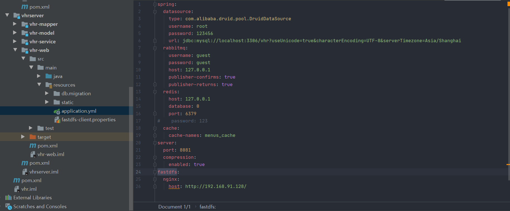
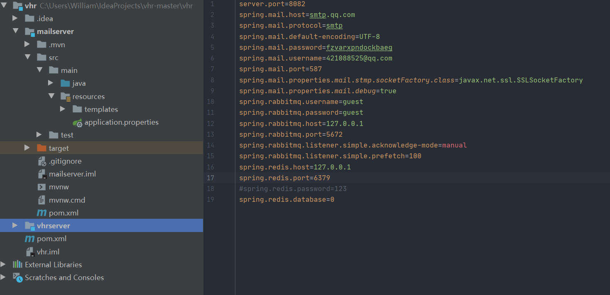

# VHR微人事项目部署

## 1、项目地址

- GitHub：https://github.com/lenve/vhr
- Gitee：https://gitee.com/lenve/vhr

## 2、准备

- 空的 vhr 数据库(这里我使用的是mysql 8.0.19)
- redis(3.2.100)
- rabbitmq

## 3、导入项目

## 4、项目配置

需要配置数据库、redis以及Ribbitmq

全部配置都在vhr-web

发送邮件项目

邮箱用自己的

## 5、启动项目

数据库脚本使用 Flyway 管理，**不需要手动导入数据库脚本**，只需要提前在本地 MySQL 中创建一个空的数据库 vhr，并修改项目中关于数据的配置（resources 目录下的 application.properties 文件中）即可

运行VhrApplication和MailserverApplication